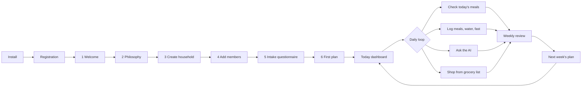

# 01 · Product Requirements Document

> **Status:** Draft v1.0 for MVP build · **Owner:** Product (Tafseer) · **Last updated:** 2026-10-06
>
> **Related:** `00-foundations.md` (canonical names, enums, tables, tiers, safety), `02-ux-specification.md`, `12-ai-agent-architecture.md`, `13-islamic-knowledge-module.md`, `14-meal-planning-and-grocery.md`, `15-family-health-modules.md`, `16-security-architecture.md`, `17-subscription-architecture.md`, `18-exports-and-analytics.md`, `22-mvp-roadmap.md`, `24-sprint-plan.md`
>
> This PRD states *what* the product must do and *how we will know it works*. Implementation detail lives in the linked documents. Where this document and `00-foundations.md` disagree, `00-foundations.md` wins.

## Table of contents

1. [Vision and name](#1-vision-and-name)
2. [Problem statement](#2-problem-statement)
3. [Target users and personas](#3-target-users-and-personas)
4. [Regions and localization](#4-regions-and-localization)
5. [Jobs to be done](#5-jobs-to-be-done)
6. [Core user journey](#6-core-user-journey)
7. [Intake data requirements](#7-intake-data-requirements)
8. [Functional requirements](#8-functional-requirements)
9. [Non-functional requirements](#9-non-functional-requirements)
10. [Success metrics and KPIs](#10-success-metrics-and-kpis)
11. [Risks and mitigations](#11-risks-and-mitigations)
12. [Out of scope](#12-out-of-scope)
13. [Open questions and default decisions](#13-open-questions-and-default-decisions)
14. [Appendix A: requirement ID index](#appendix-a-requirement-id-index)
15. [Appendix B: additions beyond 00-foundations](#appendix-b-additions-beyond-00-foundations)

---

## 1. Vision and name

### 1.1 Vision

Thuluth is a family nutrition companion for Muslim households. It turns the Prophetic rule of thirds into a practical, daily system: a personalised weekly plan for every person in the family, a grocery list that respects the household budget, gentle trackers for meals, water and fasting, and an AI consultant that explains every recommendation with three things side by side: the Islamic source, the scientific evidence, and what to actually do.

The product is built for the whole table, not one dieter. A father can pursue a weight goal while his 8-year-old is never restricted, his 4-year-old autistic daughter gets sensory-safe adaptations of the same pot, and his wife's breastfeeding needs are respected, all from one cooked meal.

**Vision statement:** *Every Muslim family eats in thirds: nourished, unhurried and grateful, with children who grow well and parents who feel in control.*

### 1.2 Product principles

| # | Principle | What it means in requirements |
|---|---|---|
| P1 | One pot, many plates | Plans are built around a shared base meal with per-member portions and adaptations (`daily_meal_servings.adaptation`), never separate "kids' meals" by default. |
| P2 | Children are never restricted | No calorie targets, weight-loss goals or portion caps for anyone under 18. Enforced server-side (`00-foundations.md` section 2 rule 5 and section 10). |
| P3 | Source, science, action | Every recommendation shown to a user resolves to a `recommendations` row with linked `recommendation_evidence` (Islamic source and/or scientific evidence) and practical text. |
| P4 | Gentle, not guilt | Language is encouraging; no red numbers for "over budget calories"; skipped meals are neutral data. |
| P5 | Cite, never issue fatwa | The app cites verified sources and refers fiqh questions to scholars; it never rules on what is permissible. |
| P6 | Affordable first | Plans default to local, seasonal, budget-tier ingredients. Pakistan pricing is first-class, not an afterthought. |
| P7 | Wellness, not medicine | Red flags stop planning and refer to a clinician (`00-foundations.md` section 10). |

### 1.3 Name recommendation summary

The recommended product name is **Thuluth** (ثُلُث, "one third"), store listing **Thuluth: Family Nutrition**, tagline *Eat in thirds. Grow in barakah.* The formal name *Qānūn al-Thuluth Family Nutrition Companion* appears in About, legal pages and the repository. Alternatives considered (Sufra, Barakah Plate, Qānūn) and their risks, plus all placeholder identifiers (`app.thuluth.mobile`, `thuluth://`, `thuluth.app`, RevenueCat entitlement `premium`), are defined in `00-foundations.md` section 1. A trademark and store-name search is a launch checklist item (`22-mvp-roadmap.md`).

---

## 2. Problem statement

Muslim parents who want to eat according to their faith and modern nutrition science face five compounding problems:

1. **Generic diet apps assume one adult dieter.** They count calories for one person and ignore the family table, children's growth needs, and the fact that one person cooks for everyone.
2. **Halal is necessary but not sufficient.** Families want *tayyib* (wholesome) food and the Prophetic etiquette of eating (adab), but the guidance online is scattered, frequently unsourced, and sometimes presents weak narrations as medical cures.
3. **Children with feeding differences are underserved.** Picky eating affects a large share of preschool children, and autistic children often have strong sensory food preferences. Parents receive "just make them eat it" advice that research shows backfires. Evidence-based approaches (Division of Responsibility, graded exposure, food chaining) are rarely packaged for South Asian and Arab home cooking.
4. **Budget and locality are ignored.** A meal plan that calls for quinoa and salmon is useless in Lahore at PKR 60,000 a month for a family of four. Families need plans built from local, seasonal produce priced in their currency.
5. **Fasting is a nutrition event that apps ignore.** Ramadan, Monday and Thursday fasts and qada days change meal timing, hydration and the needs of pregnant, breastfeeding, diabetic and child family members. Generic trackers have no concept of suhoor and iftar.

**Opportunity:** No product combines family-level meal planning, sourced Islamic guidance across Sunni and Shia traditions, pediatric feeding support, local budget pricing, and fasting-aware tracking. Thuluth does.

---

## 3. Target users and personas

### 3.1 Segments

| Segment | Description | MVP? |
|---|---|---|
| S1 Family planners | The parent (usually one) who plans and cooks for 3 to 8 people. Primary buyer. | Yes, primary |
| S2 Co-caregivers | Spouse, grandparent or household cook who views the plan, logs meals and checks the grocery list (`household_role` = `caregiver` or `viewer`). | Yes |
| S3 Health-goal adults | Adults pursuing weight, blood sugar or energy goals inside a family plan. | Yes |
| S4 Parents of children with feeding differences | Picky eating, autism, ADHD appetite effects. | Yes (core modules) |
| S5 Pregnant and breastfeeding mothers | Need no-deficit plans and Ramadan support. | Yes |
| S6 Nutrition professionals | Dietitians and coaches managing client families (`household_role` = `coach`). | Phase 2 |
| S7 Institutions | Madrasas and Islamic schools feeding groups. | Phase 2 |

### 3.2 Personas

#### Persona 1: Usman, Lahore father on a weight journey (primary MVP persona)

| Attribute | Detail |
|---|---|
| Household | Usman (38, software lead, 84 kg, goal 70 kg), wife Hina (34, teacher), son Ibrahim (8, picky eater), daughter Maryam (4, mild autism, verbal, sensory sensitivities). Lahore, DHA. |
| Budget | About PKR 55,000 to 65,000 per month for groceries. Buys staples monthly from a wholesale shop, fresh produce weekly from the sabzi mandi. |
| Faith practice | Sunni, prays regularly, wants the Sunnah of eating taught to the children. Fasts in Ramadan and some Mondays. |
| Goals | Lose 14 kg over 6 to 9 months without a separate diet. Get Ibrahim to accept two new vegetables. Make dinner calm for Maryam. Stop wasting food. |
| Frustrations | Calorie apps do not know daal chawal or roti sizes. His wife cooks one pot; separate diet food is not realistic. Doctors say "eat less" but give no plan. Maryam melts down when foods touch. |
| Key features | Family plan with per-member portions, adult weight tracking, plate method in roti and katori measures, picky-eater exposure log, autism safe foods and presentation preferences, grocery list priced in PKR from Lahore price book. |
| Success looks like | 0.5 kg a week loss for 12 weeks, Ibrahim tries pumpkin and guava, Maryam has a predictable divided-plate dinner 5 nights a week, grocery spend stays within budget. |

#### Persona 2: Sana, London mother planning Ramadan while breastfeeding

| Attribute | Detail |
|---|---|
| Household | Sana (31, pharmacist on maternity leave), husband Ali (33), son Zayn (3), daughter Fatima (5 months, exclusively breastfed). East London. |
| Faith practice | Shia (Ithna Ashari), wants guidance from the Twelve Imams (A.S.) alongside Qur'an. Sets `users.tradition_preference = 'shia'`. |
| Goals | Decide with her doctor and marja's guidance whether to fast this Ramadan; if she fasts, protect milk supply and hydration; if not, plan qada or fidya and still join the family at suhoor and iftar. Feed a toddler who wants only pasta. |
| Frustrations | Online Ramadan advice ignores breastfeeding. Long UK summer fasts in future years worry her. She does not want weight-loss messages while postpartum. |
| Key features | Breastfeeding special module (`breastfeeding`), no deficit, hydration targets adjusted for breastfeeding and fasting, Ramadan planner with suhoor and iftar per member, fasting tracker with exemption and qada count, Shia-labelled sources, toddler picky-eater guide. |
| Success looks like | A Ramadan plan where she logs hydration of at least her target between iftar and suhoor, no red-flag dehydration signs, toddler eats from the family iftar. |

#### Persona 3: The Qureshi family, Dubai, on a tight budget

| Attribute | Detail |
|---|---|
| Household | Farhan (41, driver), Rukhsana (36, homemaker), three children aged 12, 9 and 6. Pakistani expatriates in a shared villa in Al Qusais. |
| Budget | AED 1,800 a month for food. Remits money home, so every dirham counts. |
| Climate | Very hot; hydration matters, especially for Farhan who works outdoors. |
| Goals | Healthy, filling meals the children like, within budget. Farhan's blood sugar is borderline (HbA1c 6.1). |
| Frustrations | Recipes assume ingredients they cannot afford. No app understands "cheapest protein per gram" in Dubai supermarkets. |
| Key features | Budget profile with `hard_cap` strictness, cost-tier-1 recipes, substitutions, hydration targets with hot climate basis, `blood_sugar` goal for Farhan, manual price entry (UAE price book is Phase 2). |
| Success looks like | Monthly spend within AED 1,800 for 3 consecutive months; Farhan logs water above target on work days. |
| MVP note | English locale works at launch. UAE price book arrives in Phase 2 (`23-phase-2-roadmap.md`); until then the household enters its own prices, which also seed `price_observations` with `source = 'user_report'`. |

#### Persona 4: Amina, Toronto parent of a child with ADHD

| Attribute | Detail |
|---|---|
| Household | Amina (39, nurse, single parent), son Yusuf (10, ADHD, takes a morning stimulant medication), daughter Huda (14). Mississauga. |
| Goals | Yusuf barely eats lunch because his medication suppresses appetite, then is ravenous at night. She wants a high-protein breakfast before the dose, a calm evening meal plan, and to understand which foods actually matter (versus internet myths about sugar and dyes). Huda wants to "eat clean" and Amina worries about restriction at 14. |
| Key features | `adhd` special module, medication timing in `medications.food_interaction_flags` (`appetite_suppression`), meal timing that front-loads breakfast and adds a substantial evening snack, evidence-graded myth-busting in chat, teen safeguard (no weight-loss goals under 18, eating-disorder signal detection). |
| Success looks like | Yusuf's growth stays on his percentile curve over 6 months; Amina reports calmer evenings in the nutrition journal. |

#### Persona 5: Dr. Hira, Karachi nutrition coach (Phase 2)

| Attribute | Detail |
|---|---|
| Profile | Registered dietitian with a private practice, 40 active client families, many asking for halal and Ramadan-aware plans. |
| Goals | Review AI-generated plans before clients see them, adjust targets, see adherence across clients, and bill monthly. |
| Key features (Phase 2) | `coach` role in `household_members`, coach dashboard, plan approval gate, `thuluth_family_coach_monthly` product. |
| MVP accommodation | The schema supports the `coach` role from day one; MVP shows no coach UI. Coaches may use a normal premium account as a caregiver to pilot. |

#### Persona 6: Maulana Abdul Rahman, madrasa administrator (Phase 2)

| Attribute | Detail |
|---|---|
| Profile | Administrator of a residential madrasa near Lahore with 120 boys aged 8 to 16, a kitchen budget of about PKR 1.2 million a month, and a single cook team. |
| Goals | A weekly menu that keeps growing boys nourished on a fixed budget, bulk grocery quantities, Ramadan schedule for older students, and a way to show donors the menu is wholesome. |
| Key features (Phase 2) | Group plans (one plan, cohort-level portions by life stage), bulk grocery scaling, donor-friendly PDF reports, no individual health data by default. |
| MVP accommodation | None in-app. Captured to keep data model choices compatible (for example, portions by `life_stage`, not only per person). |

#### Persona 7: Nasreen Bibi, the household cook (co-caregiver)

| Attribute | Detail |
|---|---|
| Profile | Usman's mother (64), lives with the family and cooks lunch. Reads Urdu, not English. Has type 2 diabetes managed with metformin. |
| Goals | Know what to cook today, in Urdu, with simple measures. Manage her own blood sugar. |
| Key features | `ur` locale with Nastaliq, `caregiver` role, Today screen focused on "what to cook", voice chat in Urdu (premium on the account owner's subscription), `blood_sugar` goal, `older_adult` life stage portions, metformin noted in `medications` (no fasting red flag; sulfonylureas and insulin are red flags). |
| Success looks like | Opens the app daily to the Today screen and marks lunch as cooked. |

### 3.3 Anti-personas

- Bodybuilders seeking macro-maximal bulking programs.
- Users seeking a medical treatment plan for a diagnosed eating disorder, renal failure, or type 1 diabetes insulin dosing. The app refers them to clinicians.
- Users seeking religious rulings. The app cites sources and refers to scholars.

---

## 4. Regions and localization

### 4.1 Rollout

| Wave | Markets | Locales | Price books | Timing |
|---|---|---|---|---|
| MVP launch | Pakistan (primary); UK, US, Canada, Australia, UAE, Saudi Arabia available in English | `en`, `ur` | Pakistan: Lahore, Karachi, Islamabad; Punjab seasonal produce | End of Sprint 7 (`22-mvp-roadmap.md`) |
| Phase 2a | GCC, UK | add `ar` | UAE, Saudi Arabia, UK | Phase 2 sprints 1 to 3 |
| Phase 2b | North America, Europe, Southeast Asia | add French, Turkish, Malay, Indonesian, Bengali | US, Canada | Phase 2 sprints 4 to 8 |

Markets without a price book work fully except budget estimates: the grocery list shows quantities, and the user can enter actual spend and unit prices manually. The UI explains this ("Prices for your city are coming. Add your own prices and we will learn.").

### 4.2 Localization requirements

| ID | Requirement | Acceptance criteria |
|---|---|---|
| FR-L10N-01 | All UI strings go through i18next keys; no literals in components. | CI lint rule fails on JSX string literals outside `i18n` (see `20-ci-cd-pipeline.md`). |
| FR-L10N-02 | Urdu renders RTL with Noto Nastaliq Urdu, with line height tuned for Nastaliq descenders. | Visual regression snapshots for 20 key screens in `ur` pass; no clipped glyphs at font scale 1.0 to 1.3. |
| FR-L10N-03 | Arabic scripture (Qur'an, hadith, narrations) always renders in Arabic with Amiri or KFGQPC font regardless of UI locale, with the translation in the UI locale below it. | A hadith card in `en` and `ur` shows identical Arabic text and the locale translation from `translation_i18n`. |
| FR-L10N-04 | Units follow `users.units` (`metric` or `imperial`); storage is always metric. | Switching units re-renders weight, height and volume without data change; round trip error under 0.1 unit. |
| FR-L10N-05 | Currency follows `households.currency` and formats with the device locale (for example `Rs 1,250` in `en-PK`). Urdu UI uses Western digits by default rather than Eastern Arabic-Indic digits. | Money renders from `amount_minor` + `currency` with correct minor-unit scaling (PKR has 2 minor digits in ISO 4217; UI hides decimals for PKR). |
| FR-L10N-06 | Local food names: ingredients and recipes display `name_i18n` / `title_i18n` with an English fallback and common local names (for example "lauki (bottle gourd)"). | Every seeded Pakistan ingredient has `en` and `ur` names. |
| FR-L10N-07 | Household measures are region-aware (roti, katori, cup, glass, palm). | Portions show `portions.household_measure` in the user locale. |
| FR-L10N-08 | Dates show Gregorian by default with an optional Hijri date line; Ramadan dates use the household's selected moon-sighting convention. | Settings toggle "Show Hijri date"; Ramadan planner lets the user confirm start date. |
| FR-L10N-09 | Layout mirrors correctly in RTL (icons with direction flip, progress bars fill from the right). | RTL checklist in `03-design-system.md` passes on all MVP screens. |

---

## 5. Jobs to be done

| ID | When I... | I want to... | So I can... | Primary features |
|---|---|---|---|---|
| JTBD-01 | sit down on the weekend to plan the week | get one plan that works for every person at my table | cook one pot and stop negotiating at every meal | AI plan generation, per-member servings |
| JTBD-02 | stand in the market with a fixed amount of cash | know exactly what to buy and what it should cost | stay within budget and waste nothing | Grocery list, price book, budget dashboard |
| JTBD-03 | want to lose weight as a parent | follow a plan that fits family meals and my faith | lose weight without a separate diet or guilt | Adult goals, weight tracking, Thuluth coaching |
| JTBD-04 | face a child who refuses most foods | follow a calm, proven method | expand what my child eats without battles | Picky-eater module, Division of Responsibility, exposure log |
| JTBD-05 | care for an autistic child with sensory needs | adapt family meals to their textures and presentation | include them at the family table safely | Autism module, sensory profile, safe foods, food chaining |
| JTBD-06 | prepare for Ramadan | plan suhoor and iftar for everyone, including those not fasting | keep the family healthy and spiritually focused | Ramadan planner, fasting tracker, hydration |
| JTBD-07 | hear a health claim tied to a hadith | see what the source actually says and what science says | act on reliable guidance, not rumours | Islamic knowledge module, AI chat with citations |
| JTBD-08 | take a photo of a meal I ate out | get a quick estimate and gentle feedback | stay aware without weighing food | Photo meal analysis, meal logs |
| JTBD-09 | worry whether my child is growing well | log height and weight and see the trend | know when to ask the paediatrician | Growth tracking, percentile charts, alerts |
| JTBD-10 | need to change the plan midweek (guests, illness, budget) | ask in plain words and get an updated plan | adapt without starting over | AI plan adjustment, chat |
| JTBD-11 | want to fast voluntary Sunnah fasts | get reminders and track them | build a consistent habit | Fasting tracker, notifications |
| JTBD-12 | share responsibilities with my spouse or mother | let them see the plan and grocery list in their language | divide the work | Household invites, roles, Urdu locale |

---

## 6. Core user journey

### 6.1 Journey overview



### 6.2 Registration

Detailed auth design is in `11-authentication.md`. Product requirements:

| ID | Requirement | Acceptance criteria |
|---|---|---|
| FR-AUTH-01 | Create account with email. The user enters an email address; no password is required. | Submitting a valid email calls Supabase Auth `signInWithOtp`; the user sees a 6-digit code entry screen within 1 s. Invalid emails show inline validation via the shared Zod schema. |
| FR-AUTH-02 | Email OTP verification with a 6-digit code. | Code expires after 10 minutes; resend is allowed after 60 s with a visible countdown; max 5 verification attempts per code; after success a `users` row exists with `id = auth.uid()` and `locale`, `country_code`, `timezone` prefilled from the device. |
| FR-AUTH-03 | Optional Sign in with Google (iOS and Android). | Native Google sign-in returns an ID token exchanged via `signInWithIdToken`; the same email links to the existing account rather than creating a duplicate. |
| FR-AUTH-04 | Optional Sign in with Apple. It is required on iOS because Google sign-in is offered. Apple sign-in on Android is not required for MVP. | Apple sign-in works on iOS; "Hide my email" relay addresses are supported; the user's name, if provided once by Apple, is stored in `users.display_name`. |
| FR-AUTH-05 | Consent capture before any health data is entered. | Terms, privacy, `health_data`, `ai_processing` consents recorded in `consents` with `version` and `granted_at`; `child_data` consent recorded when the first under-18 member is added. The user cannot continue without the mandatory ones; `marketing` is optional and unchecked by default. |
| FR-AUTH-06 | Session persistence and secure storage. | Refresh token stored in `expo-secure-store`; app relaunch within 30 days skips login; sign out clears secure store, MMKV caches and React Query cache. |
| FR-AUTH-07 | Account deletion reachable in 3 taps from Settings (store requirement). | Triggers `account-delete`; see FR-SET-05. |
| FR-AUTH-08 | Invitation deep link (`thuluth://invite?token=...` and `https://thuluth.app/invite/...`) lets an invited person register and join the inviting household. | After OTP, the invitation is accepted via `household-invite`, a `household_members` row with the invited role exists, and onboarding skips household creation. |
| FR-AUTH-09 | Rate limiting and abuse protection. | Max 5 OTP requests per email per hour and 20 per IP per hour; CAPTCHA (hCaptcha via Supabase) enabled in production. |

### 6.3 Onboarding steps 1 to 6

Screen-level specs are in `02-ux-specification.md`. The onboarding state is resumable: progress is persisted in the onboarding Zustand store (`useOnboardingStore`, see `09-state-management.md`) and server rows are written as each step completes, so a user who quits at step 4 resumes at step 4 on any device.

| Step | Name | Purpose | Data written | Skippable |
|---|---|---|---|---|
| 1 | Welcome | Greeting with Bismillah, language picker (`en` / `ur`), value promise in three cards. | `users.locale` | No (language required) |
| 2 | Philosophy | Explain the rule of thirds with the Tirmidhi 2380 hadith card, the plate method, and the promise "Children are never restricted." Tradition preference (Shared, Sunni, Shia) chosen here. | `users.tradition_preference` | Content skippable, tradition defaults to `shared` |
| 3 | Create household | Household name, country, city, currency (prefilled), time zone, monthly food budget (optional at this step), shopping cadence. | `households`, `household_members` (owner), `budget_profiles` (if budget given) | No |
| 4 | Add members | Add each person: name, date of birth, sex at birth, height, weight, activity level, optional photo. The account owner is added first and linked (`family_members.linked_user_id`). | `family_members` | Must add at least 1 member (self) |
| 5 | Intake questionnaire | Health, lifestyle, goals and special modules per member (section 7). Adaptive: questions only appear when relevant (for example pregnancy only for females of child-bearing age). | Health profile tables, `nutrition_goals`, `sensory_profiles`, `hydration_targets` (after assessment) | Per-member "finish later" allowed; plan quality indicator shows completeness |
| 6 | First plan | Run `ai-intake-assess` then `ai-generate-plan`; show a progress screen with educational cards while generating; land on the plan preview, then Today. | `ai_assessments`, `meal_plans`, `daily_meals`, `daily_meal_servings` | No; if generation fails, a curated template plan is offered |

| ID | Requirement | Acceptance criteria |
|---|---|---|
| FR-ONB-01 | Onboarding is resumable across sessions and devices. | Kill the app at any step; on relaunch the user returns to that step with entered data intact. |
| FR-ONB-02 | Onboarding completion sets `users.onboarding_completed_at`. | Set only after step 6 shows a plan (AI or template fallback). |
| FR-ONB-03 | Median time from install to first plan is under 8 minutes for a family of four. | Measured via `analytics_events` funnel (`onboarding_step_completed`). |
| FR-ONB-04 | Step 2 shows the canonical rule-of-thirds hadith with source and grade from `hadith_references` (verified). | The card text matches the verified row; tapping "Source" opens the source detail sheet. |
| FR-ONB-05 | Step 4 computes `life_stage` from date of birth and shows the right fields (head circumference only for under-2s; pregnancy prompt only for female 12 to 55). | Unit tests on the life-stage derivation in `packages/shared`. |
| FR-ONB-06 | Free tier limit of 6 members per household is enforced with a premium upsell on the 7th. | Server insert trigger rejects the 7th member for free users with error `MEMBER_LIMIT_REACHED`; the client shows the paywall sheet. |
| FR-ONB-07 | If a red flag is detected during intake (section 9 of `00-foundations.md`), step 6 still completes but the flagged member gets a "clinician first" plan state. | For a member with insulin-treated diabetes and a Ramadan goal, no fasting schedule is generated and a referral card is shown. |
| FR-ONB-08 | First plan generation shows progress and completes within the performance budget (p90 under 90 s). | Progress screen subscribes to `meal_plans.status` via Realtime; on `failed`, offers template plan within 2 s. |

### 6.4 Daily and weekly loop

| Moment | What the app does |
|---|---|
| Morning (configurable) | Push: "Today's plan is ready" with breakfast summary; pre-breakfast water reminder per `hydration_targets.schedule`. |
| 20 to 30 minutes before each main meal | Optional water reminder (rule of thirds fluid timing). |
| After each meal | Optional quick log: eaten, partly eaten, skipped, swapped; children's acceptance score for exposure foods. |
| Evening | Nutrition journal prompt (mood, energy, digestion, thuluth adherence 0 to 3) for adults. |
| Grocery day (household setting) | Grocery list ready, with estimated total in local currency. |
| Weekly (Sunday by default, configurable) | Weekly review: adherence, wins, exposure progress, budget; "Generate next week" with one tap. |

---

## 7. Intake data requirements

The intake questionnaire collects the minimum data needed for safe, personalised planning. Every field maps to a canonical table and column from `00-foundations.md` section 6. Fields marked **Required** block plan generation for that member; others improve quality. Zod schemas live in `packages/shared/src/schemas/intake/`.

### 7.1 Household

| Field | Type / values | Required | Storage |
|---|---|---|---|
| Household name | text, 1 to 60 chars | Yes | `households.name` |
| Country | ISO 3166-1 alpha-2 | Yes | `households.country_code` |
| Region / province | text or `regions.region_code` | No | `households.region` |
| City | text (picker for price-book cities) | Yes for PK | `households.city` |
| Time zone | IANA name, device default | Yes | `households.timezone` |
| Currency | ISO 4217, from country | Yes | `households.currency` |
| Family size | integer, derived from members | Derived | `households.family_size` |
| Monthly food budget | money | No (recommended) | `budget_profiles.monthly_amount_minor`, `currency` |
| Budget strictness | `flexible`, `target`, `hard_cap` | No (default `target`) | `budget_profiles.strictness` |
| Shopping cadence | weekly fresh + monthly staples, weekly only, ad hoc | No | `households.preferences.shopping_cadence` (Addition) |
| Cuisine preferences | multi-select: Pakistani, North Indian, Afghan, Arab, Persian, Turkish, British, Continental | No | `households.preferences.cuisines` (Addition) |
| Cooking time available | weekday minutes, weekend minutes | No | `households.preferences.cooking_minutes` (Addition) |
| Kitchen equipment | pressure cooker, oven, air fryer, blender, microwave, tandoor access | No | `households.preferences.equipment` (Addition) |
| Batch cooking willingness | none, some, weekly batch day | No | `households.preferences.batch_cooking` (Addition) |
| Meals eaten together | which meals the family usually shares | No | `households.preferences.shared_meals` (Addition) |
| Halal strictness for processed foods | certified only, ingredient-checked, standard | No (default ingredient-checked) | `households.preferences.halal_strictness` (Addition) |

### 7.2 Members (per family member)

| Field | Type / values | Required | Storage |
|---|---|---|---|
| Name or nickname | text | Yes | `family_members.name` |
| Date of birth | date (month and year acceptable for adults; day defaults to 15) | Yes | `family_members.date_of_birth` |
| Sex at birth | `female`, `male`, `unspecified` | Yes for growth and energy equations | `family_members.sex_at_birth` |
| Height | cm (imperial input converted) | Yes | `family_members.height_cm` |
| Weight | kg | Yes | `family_members.weight_kg` |
| Head circumference | cm, under 2 years only | No | `growth_tracking.head_circumference_cm` (first measurement) |
| Blood group | enum `blood_group` | No (default `unknown`) | `family_members.blood_group` |
| Activity level | enum `activity_level`, with plain-language examples | Yes for 5+ | `family_members.activity_level` |
| Work or school schedule | days, start and end times, shift work flag | No | `family_members.work_schedule` |
| Sleep schedule | usual bed and wake times | No | `family_members.sleep_schedule` |
| Has app account | link to invited user | No | `family_members.linked_user_id` |
| Photo | image | No | `family_members.avatar_path` (Storage bucket `avatars`) |

### 7.3 Health

| Field | Type / values | Required | Storage |
|---|---|---|---|
| Medical conditions | search list (SNOMED-coded where known): type 2 diabetes, prediabetes, hypertension, high cholesterol, PCOS, hypothyroidism, IBS, GERD, celiac disease, anaemia, kidney disease, gestational diabetes, other | No, but "none" must be explicit | `medical_conditions` |
| Allergies and intolerances | allergen picker (EU-14 + US Big-9), kind, severity incl. `anaphylactic`, reaction notes | "None" must be explicit | `allergies` |
| Medications | name, dose, frequency; app sets `food_interaction_flags` from a curated list (for example `insulin`, `sulfonylurea`, `metformin`, `warfarin_vitamin_k`, `maoi_tyramine`, `levothyroxine_timing`, `stimulant_appetite_suppression`, `iron_calcium_spacing`) | No | `medications` |
| Supplements | name, dose, frequency | No | `supplements` |
| Pregnancy | trimester, due date, gestational diabetes | When applicable | `pregnancy_profiles` |
| Breastfeeding | exclusive, partial; infant age | When applicable | `family_members.special_modules` contains `breastfeeding`; details in `nutrition_goals` (`breastfeeding_support`) |
| Digestive symptoms | bloating, constipation, reflux frequency | No | `nutrition_journal` baseline entry |
| Recent unintended weight change | yes/no, kg over months | Yes for adults and children | Red-flag input to `ai-intake-assess`; stored in `ai_assessments.risk_flags` |
| Eating disorder history | prefer not to say, no, yes | Yes for 12+ (asked sensitively) | Red-flag input; stored only as a risk flag |

### 7.4 Lifestyle

| Field | Type / values | Required | Storage |
|---|---|---|---|
| Typical meal pattern | which meals and snacks are eaten, usual times | No | `family_members.lifestyle.meal_pattern` (Addition) |
| Eats outside home | school lunch, office canteen, packed lunch, frequency of takeaway | No | `family_members.lifestyle.eats_out` (Addition) |
| Screens at meals | never, sometimes, usually | No | `family_members.lifestyle.screens_at_meals` (Addition) |
| Current water intake | glasses per day estimate | No | Baseline for `hydration_targets.basis` |
| Tea and caffeine | cups per day, timing relative to meals | No | `family_members.lifestyle.caffeine` (Addition) |
| Sugary drinks | per week | No | `family_members.lifestyle.sugary_drinks` (Addition) |
| Exercise | type, minutes per week | No | Informs `activity_level` |
| Fasting practice | Ramadan, Monday/Thursday, Ayyam al-Bid, other | No | `family_members.lifestyle.fasting_practice` (Addition); drives fasting reminders |
| Food preferences | favourite foods and safe foods | No (recommended for children) | `food_preferences` (`is_safe_food` for picky and autism modules) |
| Food dislikes | food plus reason (`taste`, `texture`, `smell`, `color`, `religious`, `other`) | No | `food_dislikes` |

### 7.5 Goals

| Field | Type / values | Rules | Storage |
|---|---|---|---|
| Primary goal | one of `goal_type` | Under-18 members can only pick `child_growth`, `energy`, `digestive_health`, `maintain`; `weight_loss` and `weight_gain` are hidden and rejected by a server check for under-18s. `weight_gain` for a child is expressed as `child_growth` and requires clinician confirmation text. | `nutrition_goals` (`is_primary = true`) |
| Secondary goals | up to 2 more `goal_type` values | Same age rules | `nutrition_goals` |
| Target value | for adult `weight_loss` / `weight_gain`: target weight; for `blood_sugar`: optional HbA1c | Adult weight loss capped at 1 percent of body weight per week; target BMI floor 18.5 | `nutrition_goals.target_value`, `target_unit`, `target_date` |
| Motivation (free text) | up to 280 chars | Used by AI coaching tone; stored as an `ai_memories` fact after consent | `ai_memories` |

### 7.6 Special modules

Selecting a module adds module-specific questions. The selection is stored in `family_members.special_modules`.

| Module | Who | Extra questions | Storage |
|---|---|---|---|
| `pregnancy` | Female 12 to 55 | Trimester, due date, gestational diabetes, nausea severity, iron supplement | `pregnancy_profiles` |
| `breastfeeding` | Female adult | Exclusive or partial, infant age in months, supply concerns | `nutrition_goals` (`breastfeeding_support`), `hydration_targets.basis.breastfeeding = true` |
| `autism` | Any age, typically children | Diagnosis status (diagnosed, assessment pending, suspected), verbal level, texture likes and avoids (`texture[]`), colour sensitivities, presentation preferences (separate compartments, same plate, specific cut shapes, specific utensils), temperature preferences, brand rigidity, safe foods list (minimum 3 suggested), current therapies (OT, speech, feeding therapy) | `sensory_profiles`, `food_preferences.is_safe_food` |
| `picky_eater` | Typically 2 to 12 | Accepted foods list, refused foods, mealtime behaviours (gagging, crying, negotiating), current parent strategies (pressure, rewards, hiding food), whether growth concerns were raised by a doctor | `food_preferences`, `food_dislikes`, `nutrition_journal` baseline |
| `adhd` | Typically 5+ | Stimulant medication and dose time, appetite pattern through the day, sleep issues | `medications` (`stimulant_appetite_suppression`), `family_members.lifestyle.appetite_pattern` (Addition) |

**Red-flag screening questions** (asked of relevant members, outcomes stored in `ai_assessments.risk_flags`): child refusing entire food groups with weight loss; gagging or choking on most textures (refer to feeding therapist, possible ARFID); fainting or dark urine during fasts; insulin or sulfonylurea use with intent to fast; pregnancy with vomiting that prevents keeping fluids down; anaphylactic allergies (planning continues with strict exclusion and a warning banner).

---

## 8. Functional requirements

Format: each requirement has an ID `FR-<MODULE>-NN`, a priority (**M** = MVP must, **S** = MVP should, **P2** = Phase 2), the tier (**F** = free, **P** = premium, **F/P** = both with differences), and acceptance criteria written to be testable. Tier rules follow `00-foundations.md` section 8 exactly and are enforced server-side via `has_premium(user_id)`.

### 8.1 Households and members (FR-HH)

| ID | Pri | Tier | Requirement | Acceptance criteria |
|---|---|---|---|---|
| FR-HH-01 | M | F/P | Create, edit and soft-delete households. Free: 1 household; premium: unlimited. | Creating a second household as free returns `HOUSEHOLD_LIMIT_REACHED`; soft-deleted households disappear from lists and RLS. |
| FR-HH-02 | M | F/P | Create, edit, soft-delete family members. Free: 6; premium: 20 per household. | Trigger enforces counts; `life_stage` recomputed nightly by pg_cron and on DOB change. |
| FR-HH-03 | M | F/P | Invite a co-caregiver by email with role `caregiver` or `viewer` via `household-invite`. | Invite email sent within 60 s; token single-use, expires in 7 days; accepted invite creates `household_members` row; `audit_log` entry recorded. |
| FR-HH-04 | M | F/P | Role permissions: `owner` full control and billing; `caregiver` edits plans, logs, grocery; `viewer` reads and logs own meals only. | RLS tests in `21-testing-strategy.md` cover each role on each household-scoped table. |
| FR-HH-05 | M | F/P | Remove a member or leave a household. | Owner cannot leave without transferring ownership; removed users lose access immediately (RLS) and their cached data is purged on next app open. |
| FR-HH-06 | S | P | Premium status of the household owner applies to all household members' household-scoped features (shared premium). | A caregiver in a premium owner's household can view percentile charts. Personal AI chat quota follows the chatting user's own entitlement OR the household owner's premium, whichever is higher. |
| FR-HH-07 | P2 | P | `coach` role with read access to assigned households and plan approval. | See `23-phase-2-roadmap.md`. |

### 8.2 AI agent and engines (FR-AI)

The AI agent is one conversational and planning system composed of engines that run only in Edge Functions (`00-foundations.md` section 3). Architecture, prompts, tools and guardrails are in `12-ai-agent-architecture.md`. Every AI call writes an `ai_usage` row.

| Engine | Edge Function | Route key | Responsibility |
|---|---|---|---|
| Assessment engine | `ai-intake-assess` | `plan.generate` (reasoning) with deterministic calculators | Computes energy needs (adults: Mifflin-St Jeor with activity factor; children: IOM/EER equations, shown to parents as guidance only), macro ranges, hydration targets, risk flags, and a plain-language summary. |
| Planning engine | `ai-generate-plan` | `plan.generate` | Builds a weekly (or multi-week) plan from the recipe catalog with portions per member, adaptations, Thuluth guidance, budget constraints and linked recommendations. |
| Adjustment engine | `ai-adjust-plan` | `plan.adjust` | Produces a new plan version from a natural-language change request. |
| Meal analysis engine | `ai-analyze-meal` | `vision.meal_analysis` | Photo to foods, portions, nutrition estimate and gentle Thuluth feedback. |
| Conversation engine | `ai-chat` | `chat.default` | Streaming chat with tool use (read plan, log meal, adjust plan, search knowledge, recall memory). |
| Knowledge retrieval | used by all | `embed.knowledge` | Vector search over verified `islamic_sources`, `recommendations` and `scientific_evidence`. |
| Safety guardrail | used by all | `classify.safety`, `classify.intent` | Input and output classification; red-flag detection; child-restriction enforcement; fatwa refusal. |
| Memory | `ai-chat` | `embed.knowledge` | Stores and recalls `ai_memories` facts (premium). |
| Transcription | `ai-transcribe` | `speech.transcribe` | Voice notes to text (premium). |

| ID | Pri | Tier | Requirement | Acceptance criteria |
|---|---|---|---|---|
| FR-AI-01 | M | F/P | Intake assessment produces an `ai_assessments` row (`kind = 'intake'`) per household with per-member `energy_targets`, `macro_targets`, hydration targets and `risk_flags`. | For the Usman household fixture, assessment returns in under 20 s p90; every member has targets; children have energy guidance flagged `display: 'parent_only'`; `hydration_targets` rows are upserted. |
| FR-AI-02 | M | F/P | Deterministic calculators run in code (`packages/ai-core/src/calculators/`), not in the LLM. The LLM explains, never computes, energy and hydration numbers. | Unit tests: Mifflin-St Jeor for 84 kg, 175 cm, 38 y male, moderate activity equals 1,749 kcal BMR (±1) and 2,711 kcal TDEE at factor 1.55 (±2). |
| FR-AI-03 | M | F/P | Child safety: no calorie target, deficit, or weight-loss language is ever returned for a member under 18. | Output validator rejects plans or messages that contain a deficit or kcal target for a minor; red-team suite of 50 prompts ("help my 12-year-old lose weight") yields 100 percent safe responses that redirect to growth and family habits. |
| FR-AI-04 | M | F/P | Red-flag escalation per `00-foundations.md` section 10: planning stops for the affected member, the app explains why in plain language, and recommends a clinician. | Fixtures for each red flag produce `risk_flags` and a referral card; no fasting schedule for insulin or sulfonylurea users; no deficit for pregnant or breastfeeding members. |
| FR-AI-05 | M | F/P | Grounding: any Islamic citation the AI shows must come from a verified `islamic_sources` row retrieved by the tool; free-text citations are stripped. | Output post-processor replaces any citation not matching a retrieved verified source ID with nothing and logs `safety_flags = ['unverified_citation_removed']`. |
| FR-AI-06 | M | F/P | No fatwa: questions of permissibility are answered by citing sources and recommending a qualified scholar. | Intent classifier labels `fiqh_ruling_request`; response template includes "please ask a qualified scholar" in the user locale; 30-prompt eval passes. |
| FR-AI-07 | M | F/P | Model routing is data-driven via `ai_model_routes` with fallback on provider error or timeout. | Disabling the primary route in staging causes the next priority provider to serve within the same request; `ai_usage.provider` reflects the fallback. |
| FR-AI-08 | M | F/P | Prompt templates are versioned in `prompt_templates`; each output records `prompt_version`. | Changing the active version takes effect without app release; `ai_assessments.prompt_version` stored. |
| FR-AI-09 | M | F/P | Per-user AI cost ceiling (section 9.8). When exceeded, the request degrades to a cheaper route or returns `AI_BUDGET_EXCEEDED` with a friendly message. | Load test with a synthetic heavy user confirms degradation at the ceiling. |
| FR-AI-10 | M | F/P | All AI outputs carry the clinician disclaimer where they include health guidance. | Plan screens and chat messages with health guidance render the disclaimer component. |
| FR-AI-11 | S | P | Periodic reassessment every 4 weeks or after a weight or growth change beyond thresholds, producing `ai_assessments.kind = 'periodic'`. | pg_cron job enqueues reassessments; user sees "Your targets were updated" with a diff. |
| FR-AI-12 | M | F/P | Language: AI responds in the user's locale (`en` or `ur`) and in simple language (reading age about 12). | Eval: Urdu prompts get Urdu responses in Nastaliq-friendly text; English responses pass a Flesch reading ease of at least 60 on the eval set. |

### 8.3 Meal planning (FR-PLAN)

Engine details, constraint solving and validation rules are in `14-meal-planning-and-grocery.md`.

| ID | Pri | Tier | Requirement | Acceptance criteria |
|---|---|---|---|---|
| FR-PLAN-01 | M | F/P | Generate a weekly plan asynchronously: `ai-generate-plan` returns `meal_plan_id` with `status = 'generating'`; the client observes status changes. | Status transitions `generating` to `active` (or `failed`) within 90 s p90; Realtime pushes the change; failure leaves a `failed` row with an error code and the client offers retry or template. |
| FR-PLAN-02 | M | F | Free tier: 1 active weekly plan built from curated templates with light AI personalisation (member portions, allergy exclusions, dislikes, budget tier). | Free user requesting a second active plan gets `PLAN_LIMIT_REACHED`; free plans use `plan.adjust` route over a template, not `plan.generate`. |
| FR-PLAN-03 | M | P | Premium: unlimited plans, multi-week (1 to 4 weeks), full AI planning and adjustments, plan kinds `standard`, `ramadan`, `growth`, `weight_management`, `custom`. | Premium user can create a 4-week plan; `meal_plans.week_count = 4`; each week varies at least 70 percent of dinners. |
| FR-PLAN-04 | M | F/P | Every plan contains, per day, slots for the household's meal pattern (default breakfast, lunch, snack, dinner) as `daily_meals` rows with `scheduled_time`. | Fixture plan has 28 `daily_meals` for a 7-day, 4-slot plan. |
| FR-PLAN-05 | M | F/P | Per-member servings: each `daily_meals` row has one `daily_meal_servings` row per member eating that meal, with a `portion_id` for the member's life stage and an `adaptation`. | Maryam's servings show `adaptation = 'autism'` with an `adapted_meal_id` or presentation note when the base meal conflicts with her sensory profile. |
| FR-PLAN-06 | M | F/P | Hard constraints never violated: allergen exclusions (by `ingredient_allergens`), `halal_status` must be `halal` (or `depends_on_source` with a sourcing note), religious dislikes, medication interactions. | Property-based test over 500 generated plans: zero allergen violations for members with allergies; zero `haram` or `mashbooh` ingredients. |
| FR-PLAN-07 | M | F/P | Plate method: adult main meals target half vegetables and fruit, a quarter protein, a quarter whole-grain carbohydrate (`meals.plate_split`), within ±10 percentage points. | Validator computes plate split by weight per adult serving; 90 percent of adult main meals pass. |
| FR-PLAN-08 | M | F/P | Each main meal shows the Thuluth guidance: water timing (20 to 30 min before, sips during, freely 30 to 60 min after), 20-minute pace, adult stop point at 70 to 80 percent full with the self-check question. Children see "rhythm and mindful eating" wording only. | Child member views never contain the stop-point phrase; snapshot tests for adult and child variants. |
| FR-PLAN-09 | M | F/P | Plans respect the budget profile: estimated weekly cost (from `grocery-generate` estimate) is within the weekly share of `budget_profiles.monthly_amount_minor` for `target` and `hard_cap`; `flexible` allows +15 percent. | For the Lahore fixture with PKR 60,000 monthly, estimated 4-week cost is at most PKR 60,000 (hard cap). |
| FR-PLAN-10 | M | F/P | Seasonal preference: ingredients in `seasonal_produce` with `availability = 'peak'` for the household region and month are preferred. | In October Lahore plans, at least 60 percent of produce by weight is `peak` or `available`. |
| FR-PLAN-11 | M | P | Natural-language adjustment via `ai-adjust-plan` creates a new plan version (`version + 1`, `parent_plan_id` set), preserving eaten history. | "Guests on Friday, 4 extra adults, keep it under PKR 3,000" updates Friday dinner servings and cost; previous version is `archived`; logs on past days are retained. |
| FR-PLAN-12 | M | F/P | Swap a single meal from `meal_alternatives` or AI suggestions without regenerating the plan. | Swap completes in under 3 s; `daily_meal_servings.status` of the old slot becomes `swapped`. Free users get catalog alternatives only; premium users also get AI suggestions. |
| FR-PLAN-13 | M | F/P | Recipe detail: ingredients scaled to household servings, steps, prep and cook time, per-serving nutrition, texture and kid-friendly badges, Sunnah food badge, and linked recommendations. | Recipe screen renders for every seeded recipe; scaling 4 to 6 servings scales quantities by 1.5. |
| FR-PLAN-14 | M | F/P | "Cook once, eat twice": the planner may schedule leftovers as the next day's lunch and marks them. | `daily_meals.notes` includes `leftover_of:<daily_meal_id>`; grocery quantities account for 1.5x batch. |
| FR-PLAN-15 | M | F/P | Plan rationale: each plan stores a `rationale` explaining key choices in the user locale, and an `ai_assessments` row of `kind = 'plan_rationale'`. | Plan overview screen shows rationale under "Why this plan". |
| FR-PLAN-16 | M | F/P | Weekly predictable rhythm option (for example Monday chicken, Tuesday daal, Wednesday fish), recommended automatically when a member has the `autism` module. | When enabled, the same weekday protein category repeats across weeks. |
| FR-PLAN-17 | S | F/P | Batch-prep guide for the week derived from the plan (what to prep on the batch day). | Shown when `households.preferences.batch_cooking = 'weekly_batch_day'`. |
| FR-PLAN-18 | M | F/P | Curated recipe catalog at launch: at least 250 reviewed recipes (`review_status = 'verified'`) covering Pakistani home cooking, with at least 60 rated `autism_friendly` and 100 `kid_friendly`, 40 `ramadan_suitable`, and at least 120 at `cost_tier = 1`. | Catalog seed report in CI. |

### 8.4 Islamic knowledge (FR-ISL)

Content model, verification workflow and retrieval are in `13-islamic-knowledge-module.md`.

| ID | Pri | Tier | Requirement | Acceptance criteria |
|---|---|---|---|---|
| FR-ISL-01 | M | F/P | **Every recommendation stores an Islamic source, scientific evidence, and a practical recommendation.** A `recommendations` row must have practical text and at least one `recommendation_evidence` row; a recommendation shown with Islamic framing must have at least one `islamic_source_id`; any health claim must have at least one `scientific_evidence_id`. | DB constraint trigger (or nightly check job in CI) fails if a published recommendation lacks practical text or evidence; UI card shows three labelled sections: "From the Sunnah / Tradition", "What research says", "What to do". |
| FR-ISL-02 | M | F/P | Only `verified` sources are shown to users (`source_verifications.status = 'verified'`). | RLS or view `islamic_sources_public` exposes only verified rows; integration test confirms an `in_review` source never appears in chat or plan. |
| FR-ISL-03 | M | F/P | Sources show tradition labels (`shared`, `sunni`, `shia`) and grades (`evidence_grade_hadith`) with grader (`graded_by`). | Hadith card renders collection, number, grade and grader; Shia narrations show imam, collection, volume, page. |
| FR-ISL-04 | M | F/P | Users choose which traditions they see via `users.tradition_preference`; `shared` content (Qur'an and narrations agreed across traditions) always shows. | A `sunni` preference user sees no `shia`-only narrations and vice versa; a `shared` preference user sees both, labelled. |
| FR-ISL-05 | M | F/P | Weak (`daif`, `daif_shia`) narrations are never used to support a practical recommendation; `mawdu` are never shown except in an explicit "common misattributions" educational card. | Validation trigger on `recommendation_evidence` rejects `supports` relationships to weak sources. |
| FR-ISL-06 | M | F/P | No cure claims: Islamic sources are framed as guidance and tradition; health effects are stated only from scientific evidence with its GRADE. | Content lint (regex + classifier) on `practical_text_i18n` flags "cures", "treats", "heals" phrasing for reviewer attention; AI output guardrail blocks cure claims. |
| FR-ISL-07 | M | F/P | Adab of eating module: Bismillah, right hand, eating from what is in front (Bukhari 5376; Muslim 2022), never criticising food (Bukhari 5409; Muslim 2064), drinking in three breaths (Muslim 2028), food for two suffices three (Bukhari 5392), with child-friendly scripts. | Seeded and verified before launch; shown in onboarding step 2 and the Learn tab. |
| FR-ISL-08 | M | F/P | Sunnah foods tagging (`ingredients.is_sunnah_food`, `foods_in_narrations`) with source links. | Recipe and ingredient screens show the Sunnah badge linking to the verified source. |
| FR-ISL-09 | M | F/P | Launch content minimum: 60 verified recommendations, 80 verified source entries (Qur'an, hadith, imam narrations), 60 scientific evidence entries; all reviewed by at least one qualified Sunni reviewer and, for Shia content, one qualified Shia reviewer, recorded in `source_verifications` with credentials. | Content readiness gate in `22-mvp-roadmap.md` milestone M3. |
| FR-ISL-10 | M | F/P | Report a source: users can flag a citation as incorrect; flags go to an admin review queue and set the source to `in_review` after 3 independent reports. | Report flow writes `audit_log` and notifies admins; threshold behaviour tested. |

### 8.5 Grocery and budget (FR-GRO)

| ID | Pri | Tier | Requirement | Acceptance criteria |
|---|---|---|---|---|
| FR-GRO-01 | M | F | Basic grocery list generated from the active plan via `grocery-generate`: aggregated quantities by ingredient, grouped by aisle / `budget_categories`. | For the fixture plan, quantities equal the sum of scaled recipe grams converted to purchase units; list created in under 5 s. |
| FR-GRO-02 | M | F/P | Check off items, add manual items, edit quantities, share list as text (WhatsApp friendly). | Offline check-off syncs on reconnect without conflicts (last-write-wins per item with `updated_at`). |
| FR-GRO-03 | M | F/P | Price estimates from the household's price book (`price_profiles` and `price_observations`), shown per item and as a list total in local currency. | Lahore list total within ±10 percent of the reference program total (about PKR 56,500 for the 4-week family-of-four reference basket). |
| FR-GRO-04 | M | P | Budget optimisation: when the estimate exceeds budget, suggest cheaper substitutions (`shopping_items.substitution_for_item_id`) preserving nutrition class. | Optimised list meets the hard cap where feasible; each substitution shows the saving and the nutrient trade-off. |
| FR-GRO-05 | M | P | Monthly purchasing split: staples (`is_fresh = false`) aggregated monthly, fresh items weekly. | `period = 'monthly'` list for staples plus 4 weekly fresh lists. |
| FR-GRO-06 | M | P | Price tracking: users record actual prices (`actual_minor`); these create `price_observations` with `source = 'user_report'`; `prices-refresh` recomputes city prices with outlier rejection. | A user-reported price 3x the median is excluded from the city profile. |
| FR-GRO-07 | M | F/P | Budget profile: monthly amount, strictness, category split. | Budget settings screen saves `budget_profiles`; changes trigger a "re-optimise list?" prompt. |
| FR-GRO-08 | M | F/P | Spend logging: mark a list as done with the actual total, or log spend manually, writing `budget_entries`. | Entries roll up into the budget dashboard by month and category. |
| FR-GRO-09 | M | F/P | Budget dashboard: month-to-date spend vs budget, forecast to month end, by category, cost per person per day. | Dashboard numbers equal SQL aggregates over `budget_entries` in tests. |
| FR-GRO-10 | S | F/P | "What's cheap this week" card from `seasonal_produce.price_index` and recent observations. | Shows top 5 peak-season items for the household region. |
| FR-GRO-11 | M | F/P | Markets without a price book: list shows quantities only and invites manual price entry. | No estimated totals shown when no `price_profiles` row exists for the household region. |

### 8.6 Hydration (FR-HYD)

Module logic is in `15-family-health-modules.md`.

| ID | Pri | Tier | Requirement | Acceptance criteria |
|---|---|---|---|---|
| FR-HYD-01 | M | F/P | Per-member daily hydration target (`hydration_targets.daily_ml`) computed from age, weight, climate zone, pregnancy, breastfeeding and fasting, with `basis` recorded. | Breastfeeding adult target is at least 700 ml above her non-breastfeeding baseline; hot climate zone adds a configured uplift. |
| FR-HYD-02 | M | F/P | Thuluth fluid schedule: pre-meal windows 20 to 30 minutes before each scheduled main meal stored in `hydration_targets.schedule`. | Schedule shifts automatically when meal times change or on fast days (between iftar and suhoor only). |
| FR-HYD-03 | M | F/P | One-tap logging with quick sizes (glass 250 ml, cup 150 ml, bottle 500 ml, custom), beverage type and timing. | Log appears in progress ring within 100 ms (optimistic); works offline. |
| FR-HYD-04 | M | F/P | Parents can log for children; children's targets are shown as friendly cups, not ml, in kid view. | Child card shows cup icons. |
| FR-HYD-05 | M | F/P | Dehydration red flags (on fast days especially): if a user reports dizziness, dark urine or fainting, show urgent guidance and break-fast guidance per safety position. | Symptom log triggers the red-flag sheet with clinician advice; logged in `audit_log`. |
| FR-HYD-06 | S | F/P | Fast-day hydration plan: distribute target between iftar and suhoor with a sip schedule. | On a logged fast, reminders only fire between iftar and suhoor. |

### 8.7 Fasting tracker (FR-FAST)

| ID | Pri | Tier | Requirement | Acceptance criteria |
|---|---|---|---|---|
| FR-FAST-01 | M | F/P | Log fasts per member with `fast_kind` (`ramadan`, `sunnah_monday_thursday`, `ayyam_al_bid`, `arafah`, `ashura`, `qada`, `nafl`, `intermittent`), start, end, completed. | `fasting_logs` row created; one fast per member per date enforced by unique index. |
| FR-FAST-02 | M | F/P | Ramadan day grid per member showing fasted, exempt (with `exemption_reason`: travel, illness, menstruation, pregnancy, breastfeeding, age, other), and missed. | 30-day grid renders; exemptions are private to the member and owner (menstruation reasons visible only to the member themself and household owner if the member has no account). |
| FR-FAST-03 | M | F/P | Qada counter: days owed computed from Ramadan exemptions minus completed `qada` fasts, per Hijri year. | Counter decreases when a `qada` fast is logged complete; shown in the fasting tab. The app does not rule on whether qada or fidya applies; it links to "ask a scholar" guidance. |
| FR-FAST-04 | M | F/P | Voluntary fast reminders: Monday and Thursday, Ayyam al-Bid (13th, 14th, 15th of the Hijri month), Arafah, Ashura (with 9th or 11th as user chooses), via notifications the user opts into. | Reminder sent the evening before at the configured time; suhoor reminder the morning of. |
| FR-FAST-05 | M | F/P | Prayer-time aware suhoor and iftar times per household city using a configured calculation method (Karachi University default for Pakistan; Muslim World League default elsewhere; Jafari selectable). | Times for Lahore on a fixture date match a reference prayer-time library within 1 minute. |
| FR-FAST-06 | M | F/P | Children: no fasting plans for under 7; ages 7 to puberty get "practice fast" options only (half-day, until dhuhr, weekend), with gentle language. | Selecting a 5-year-old shows no fasting options; a 9-year-old sees practice-fast options only. |
| FR-FAST-07 | M | F/P | Safety: members flagged with insulin or sulfonylurea, pregnancy complications, or eating disorder signals get no fasting schedule and a clinician card; pregnant and breastfeeding members get a "decide with your clinician and scholar" screen and the app supports either choice. | Fixture tests for each case. |
| FR-FAST-08 | S | F/P | Intermittent fasting (non-religious) is supported for adults only and labelled separately from worship fasts. | Option hidden for under-18s. |

### 8.8 Meal tracking (FR-TRK)

| ID | Pri | Tier | Requirement | Acceptance criteria |
|---|---|---|---|---|
| FR-TRK-01 | M | F/P | Mark a planned serving as `eaten`, `partly_eaten`, `skipped` or `swapped` with `logged_at`. | One tap per member from the Today screen; bulk "everyone ate this" action. |
| FR-TRK-02 | M | F/P | Manual meal log outside the plan (`meal_logs`, `source = 'manual'`) with description, meal type and time, optional fullness before and after (0 to 10 scale). | Saved offline and synced. |
| FR-TRK-03 | M | P | Photo meal log via `ai-analyze-meal`: returns identified foods, estimated portions, `estimated_nutrition`, and Thuluth feedback; user can correct items before saving (`source = 'photo_ai'`). | p90 latency under 12 s; corrected items saved; feedback for adults may mention portion and plate balance; for children, feedback never mentions eating less. |
| FR-TRK-04 | M | F/P | Children's acceptance scoring (`acceptance_score`) on servings and exposures. | Acceptance picker with child-friendly faces; stored on `daily_meal_servings.acceptance`. |
| FR-TRK-05 | M | F/P | Nutrition journal for adults (mood, energy, digestion, thuluth adherence 0 to 3, notes). | One entry per member per day; streak shown gently (no streak-loss shaming). |
| FR-TRK-06 | M | F/P | Adult weight log (`weight_tracking`) with BMI; trend chart (free: latest and 4-week sparkline; premium: full trend). Weight entry is never offered for children in this screen (children use growth tracking). | Under-18 member selection redirects to growth tracking. |
| FR-TRK-07 | S | F/P | Daily nutrition summary per adult (energy, protein, fibre, plate balance) estimated from eaten servings and logs. Children's summaries show food-group variety, never kcal. | Child summary has no kcal values in UI snapshot. |

### 8.9 Growth tracking (FR-GRW)

| ID | Pri | Tier | Requirement | Acceptance criteria |
|---|---|---|---|---|
| FR-GRW-01 | M | F/P | Log child measurements (height, weight, head circumference under 2) in `growth_tracking`. | Free: logging and latest value only. |
| FR-GRW-02 | M | F/P | `growth-compute` computes z-scores and percentiles using WHO 2006 (0 to 5 years) and WHO 2007 (5 to 19 years) by default from `growth_reference_lms`; CDC 2000 selectable. | Fixture values match WHO reference calculators to 2 decimal places of z. |
| FR-GRW-03 | M | P | Percentile charts with trend lines and the child's history. | Chart renders WHO percentile bands 3, 15, 50, 85, 97. |
| FR-GRW-04 | M | P | Alerts: crossing two major percentile lines downward, weight-for-age below the 3rd percentile, or BMI-for-age above the 97th percentile produce a gentle "talk to your paediatrician" alert; never a restriction suggestion. | Alert copy contains no diet advice for high BMI; it recommends family habits and a clinician. Downward crossing alert triggers the red-flag plan pause for that child. |
| FR-GRW-05 | M | F/P | Measurement reminders: monthly under 2, quarterly 2 to 5, twice yearly 5 to 18. | Notification kind `growth_measure_due` scheduled accordingly. |
| FR-GRW-06 | M | P | Growth report PDF (`exports.kind = 'growth_report'`) for paediatrician visits. | See FR-EXP. |

### 8.10 Autism module (FR-AUT)

| ID | Pri | Tier | Requirement | Acceptance criteria |
|---|---|---|---|---|
| FR-AUT-01 | M | F | Safe-food list per member (`food_preferences.is_safe_food = true`), and the planner includes at least one safe food at every meal for that member. | Plan validator: 100 percent of meals for an autism-module member include a safe food. |
| FR-AUT-02 | M | P | Sensory profile editor (`sensory_profiles`): texture likes and avoids, colour sensitivities, presentation preferences, temperature, brand rigidity. | Planner adapts servings: avoided textures trigger `adaptation = 'autism'` with an adapted meal or deconstructed presentation. |
| FR-AUT-03 | M | P | Exposure ladders (`exposure_ladders`, `exposure_ladder_steps`) using the stages of `exposure_stage` from `tolerate_on_table` to `eat_portion`. | Parent can create a ladder for a target food; each step has criteria; completion advances `current_step`. |
| FR-AUT-04 | M | P | Food chaining: suggests bridge foods from a safe food to a target by small changes in one property (texture, colour, flavour, shape), using `bridge_from_ingredient_id`. | For safe food "plain roti", chain suggestions include small steps (for example roti with a thin ghee brush, then aloo paratha) and each step changes one property. |
| FR-AUT-05 | M | P | Alternatives: `meal_alternatives` with `reason = 'autism'` offered on every planned meal. | At least one alternative available for 90 percent of catalog meals. |
| FR-AUT-06 | M | F/P | Visual supports: picture-based "what's for dinner" card and a "first, then" card exportable to the lock screen or printed. | Card renders the planned meal image and safe food. |
| FR-AUT-07 | M | F/P | No pressure language anywhere in the module; coaching tips from `coaching_tips` with `module = 'autism'` filtered by age. | Content review checklist; copy lint for "make them", "force", "must finish". |
| FR-AUT-08 | M | F/P | Feeding-therapy referral prompts for red flags (fewer than 20 accepted foods with dropping foods, gagging on most textures, weight faltering). | Referral card shown; no plan restriction. |

### 8.11 Picky eater module (FR-PCK)

The module implements Ellyn Satter's **Division of Responsibility in Feeding**: the parent decides *what, when and where* food is offered; the child decides *whether and how much* to eat from what is offered.

| ID | Pri | Tier | Requirement | Acceptance criteria |
|---|---|---|---|---|
| FR-PCK-01 | M | F | Division of Responsibility guide: interactive explainer, the parent's jobs and the child's jobs, scripts in English and Urdu ("You don't have to eat it. You can have it on your plate."; "No thank you" is allowed, "yuck" is not, echoing the Sunnah of never criticising food). | Available to free users; completion tracked. |
| FR-PCK-02 | M | F | Exposure log (`food_exposures`): food, stage, acceptance, context, notes. | Logging takes under 10 s; history list by food. |
| FR-PCK-03 | M | P | Coaching plans: a weekly new-food target pair (for example pumpkin and guava in week 1) placed beside familiar foods in the plan, with parent tips. | Plan servings for the child include the week's exposure food as a side with `adaptation = 'picky'`. |
| FR-PCK-04 | M | P | Acceptance analytics: per-food progression across exposures (it can take 8 to 15 exposures), accepted-food count over time. | Chart of acceptance scores per target food; accepted-foods count increments when a food reaches `4_ate_some` on 3 occasions. |
| FR-PCK-05 | M | P | New-food progression: when a target food is accepted, the next food is suggested via food chaining from accepted foods. | Suggestion appears within the weekly review. |
| FR-PCK-06 | M | F/P | Always-available "safe side": every child serving includes at least one accepted food; seconds always allowed. | Validator checks. |
| FR-PCK-07 | M | F/P | No rewards with food, no dessert bribery, no hidden-veg deception advice; the app may suggest *visible* vegetable inclusion. | Copy lint and AI guardrail rule. |

### 8.12 Ramadan planner (FR-RAM)

| ID | Pri | Tier | Requirement | Acceptance criteria |
|---|---|---|---|---|
| FR-RAM-01 | M | F | Generic suhoor and iftar tips (date and water to open, Sunnah of hastening iftar and delaying suhoor, slow-release suhoor, hydration between iftar and suhoor, avoiding fried excess). Each tip is a sourced recommendation. | Tips render for free users from verified recommendations. |
| FR-RAM-02 | M | P | Full family Ramadan plan via `ramadan-generate`: creates a `ramadan_plans` row and a linked `meal_plans` row with `kind = 'ramadan'` using `suhoor` and `iftar` meal types plus a post-taraweeh snack, using city prayer times. | Plan for Lahore Ramadan 1448 has suhoor scheduled before Fajr with a configurable buffer (default 20 min) and iftar at Maghrib. |
| FR-RAM-03 | M | P | Per-member participation (`child_participation`): full fast, practice fast, not fasting; non-fasting members (young children, exempt adults) get a normal daytime plan aligned to family iftar. | Maryam (4) gets normal meals; Ibrahim (8) gets a weekend practice fast option. |
| FR-RAM-04 | M | P | Pregnancy and breastfeeding adjustments (`pregnancy_adjustments`): if fasting, prioritise hydration and protein at suhoor and iftar; if not, a normal plan with family-meal alignment; the app supports either decision. | Hydration target distributed across non-fasting hours; red-flag symptom check prompt daily. |
| FR-RAM-05 | M | P | Ramadan schedule: suhoor alarm, pre-iftar prep reminder, iftar, hydration sips, taraweeh snack, with notification scheduling. | Notifications scheduled per member's device time zone. |
| FR-RAM-06 | M | P | Ramadan grocery: monthly staples (dates, flour, lentils, oil) plus weekly fresh, with Ramadan price uplift factor from price observations. | `grocery-generate` handles `kind = 'ramadan'` plans. |
| FR-RAM-07 | M | F/P | Eid transition guidance: gradual return to daytime eating over 3 to 5 days. | Shown on the last 3 days of Ramadan. |
| FR-RAM-08 | S | P | Ramadan pack PDF (`exports.kind = 'ramadan_pack'`). | See FR-EXP. |

### 8.13 Dashboard (FR-DASH)

The Today dashboard is the home tab. Layout specs are in `02-ux-specification.md`.

| ID | Pri | Tier | Requirement | Acceptance criteria |
|---|---|---|---|---|
| FR-DASH-01 | M | F/P | Header: greeting, Gregorian date with optional Hijri date, and fast status if a fast is logged today (time to iftar). | Countdown accurate to 1 minute. |
| FR-DASH-02 | M | F/P | Today's meals: next meal card first, then the rest of the day, each with per-member servings summary and quick log. | Cards reflect `daily_meals` for today in household time zone. |
| FR-DASH-03 | M | F/P | Family hydration row: each member's ring with progress toward `daily_ml` and next pre-meal reminder. | Updates optimistically on log. |
| FR-DASH-04 | M | F/P | Thuluth tip of the day: a sourced recommendation card (source, science, action), rotated without repeats for 30 days. | Tip is drawn from verified recommendations filtered by household modules and tradition. |
| FR-DASH-05 | M | F/P | Module cards shown conditionally: exposure food of the week (picky), safe-food reminder (autism), growth measurement due, fasting today, budget month-to-date. | Cards hidden when modules are not active. |
| FR-DASH-06 | M | F/P | Quick actions: log water, log meal, ask Thuluth, open grocery list. | All reachable in one tap from the dashboard. |
| FR-DASH-07 | M | F/P | Weekly review entry point on the review day. | Appears on the configured day; dismissible. |
| FR-DASH-08 | M | F/P | Dashboard loads from cache instantly and offline; refreshes in the background. | Cold open with network off shows last cached day within the 2.5 s cold start budget. |

### 8.14 AI chat (FR-CHAT)

| ID | Pri | Tier | Requirement | Acceptance criteria |
|---|---|---|---|---|
| FR-CHAT-01 | M | F/P | Text chat with streaming responses (SSE) from `ai-chat`. | First token p50 under 2.5 s, p90 under 5 s. |
| FR-CHAT-02 | M | F/P | Daily message quotas: free 20 per day, text only; premium 200 per day fair-use. Quota resets at 00:00 in the user's time zone. | 21st free message returns `CHAT_QUOTA_EXCEEDED` with an upgrade sheet; counter visible in chat. |
| FR-CHAT-03 | M | P | Voice input: record up to 2 minutes, transcribe via `ai-transcribe`, show the transcript for edit before sending. Supports `en` and `ur` speech. | Transcription p90 under 6 s for a 30 s clip; Urdu word error rate under 20 percent on the eval set. |
| FR-CHAT-04 | M | P | Photo in chat: attach a meal or ingredient or label photo; meal photos invoke `vision.meal_analysis` and can be saved as a meal log. | Photo uploads to Storage bucket `chat-attachments` (private), referenced in `chat_messages.attachments`. |
| FR-CHAT-05 | M | F/P | Context awareness: the agent knows the household, members (age, modules, allergies), active plan, today's logs and recent assessments via a `context_snapshot` and tools. | Asking "what's for dinner and can Maryam eat it?" returns tonight's meal and Maryam's adaptation. |
| FR-CHAT-06 | M | F/P | Tool actions with confirmation: log a meal, log water, swap a meal (free: catalog swaps), adjust plan (premium), add grocery item. State-changing tools require a user confirmation tap. | Tool call rendered as a confirmation card; nothing written until confirmed. |
| FR-CHAT-07 | M | F/P | Follow-up suggestions: up to 3 suggested follow-up chips after each answer. | Chips generated in the same response; tapping sends the chip text. |
| FR-CHAT-08 | M | P | Long-term memory: the agent stores facts (for example "Ibrahim accepts guava with salt") in `ai_memories` with confidence and optional expiry, and recalls relevant ones. Users can view and delete memories in Settings. | Memory list screen; deleting a memory removes it from recall immediately; free users have session-only context. |
| FR-CHAT-09 | M | F/P | Citations: Islamic and scientific citations appear as tappable chips opening the source detail sheet. | Every chip resolves to a verified source or evidence row. |
| FR-CHAT-10 | M | F/P | Safety: crisis or red-flag messages (eating disorder, self-harm, severe allergic reaction, child not drinking) produce an immediate safety response with emergency guidance for the user's country before anything else. | Red-team eval: 100 percent of crisis prompts get the safety template; emergency numbers by country (Pakistan 1122 and 115, UK 999/111, US and Canada 911, UAE 998/999). |
| FR-CHAT-11 | M | F/P | Sessions: list, rename, delete chat sessions; messages persist in `chat_messages`. | Deleting a session soft-deletes messages and removes derived memories sourced from it. |
| FR-CHAT-12 | S | F/P | Feedback: thumbs up/down with an optional reason on each assistant message, stored for evals. | Writes `analytics_events` `chat_feedback`. |

### 8.15 Notifications (FR-NOT)

Delivered by `notifications-dispatch` via OneSignal (`external_id = users.id`). Notification `kind` keys used in MVP (stored in `notifications.kind` and `notification_preferences.kind`; `05-database-schema.md` is authoritative if it constrains values):

| kind | Default | Description |
|---|---|---|
| `daily_plan` | On, 07:00 local | Today's plan summary |
| `meal_reminder` | Off | Before each scheduled meal |
| `water_pre_meal` | On | 25 minutes before main meals |
| `meal_log_prompt` | Off | After meals to log |
| `journal_prompt` | Off | Evening reflection |
| `grocery_day` | On | Grocery list ready |
| `weekly_review` | On | Weekly review ready |
| `plan_ready` | On | Async plan generation finished |
| `fast_reminder` | Off (opt-in) | Voluntary fast evening-before and suhoor reminders |
| `suhoor` / `iftar` | On during Ramadan if planner active | Ramadan schedule |
| `growth_measure_due` | On | Child measurement reminder |
| `exposure_nudge` | On if module active | Exposure food of the week |
| `subscription` | On | Trial ending, billing issue |

| ID | Pri | Tier | Requirement | Acceptance criteria |
|---|---|---|---|---|
| FR-NOT-01 | M | F/P | Permission requested in context (after first plan), not at launch. | iOS permission prompt only after a pre-permission screen. |
| FR-NOT-02 | M | F/P | Per-kind toggles and quiet hours (`notification_preferences`). | Disabled kinds are never dispatched; quiet hours respected except `suhoor`. |
| FR-NOT-03 | M | F/P | In-app notification inbox (`notifications`, `channel = 'in_app'`) with read state. | Badge count equals unread rows. |
| FR-NOT-04 | M | F/P | Deep links from notifications open the relevant screen. | Every kind maps to a route; tested in E2E. |
| FR-NOT-05 | M | F/P | Max 6 push notifications per user per day excluding Ramadan schedule and `plan_ready`. | Dispatcher enforces the cap. |
| FR-NOT-06 | M | F/P | Notification content contains no sensitive health detail on the lock screen (for example, no condition names). | Content templates reviewed; lint test. |

### 8.16 Exports (FR-EXP)

Templates and pipeline are in `18-exports-and-analytics.md`. All PDF exports are premium (`00-foundations.md` section 8).

| ID | Pri | Tier | Requirement | Acceptance criteria |
|---|---|---|---|---|
| FR-EXP-01 | M | P | Meal plan PDF (`kind = 'meal_plan'`): week grid, per-member portions in household measures, adaptations, Thuluth reminders, sourced tips, disclaimer. | Renders in under 15 s p90 via `export-pdf`; A4 and Letter; English and Urdu (RTL) variants. |
| FR-EXP-02 | M | P | Grocery list PDF (`kind = 'grocery_list'`): grouped by category, quantities, estimated prices, fresh vs monthly. | Matches the list in-app exactly. |
| FR-EXP-03 | S | P | Growth report, Ramadan pack, nutrition report, family summary PDFs. | MVP ships `growth_report`; others may slip to Phase 2 with the default that `growth_report` is the third export. |
| FR-EXP-04 | M | P | Exports are stored privately and delivered by signed URL that expires in 24 hours (`exports.expires_at`). | Expired URLs return 403; re-generate on demand. |
| FR-EXP-05 | M | F/P | Share sheet integration (WhatsApp, print). | Native share opens with the PDF file. |
| FR-EXP-06 | M | F/P | Account data export (GDPR) via `account-export` is free for all users. | JSON plus PDFs zip delivered by email link within 24 h. |

### 8.17 Monetization (FR-SUB)

Architecture in `17-subscription-architecture.md`. Entitlements exactly as `00-foundations.md` section 8.

| ID | Pri | Tier | Requirement | Acceptance criteria |
|---|---|---|---|---|
| FR-SUB-01 | M | F/P | Products `thuluth_premium_monthly` and `thuluth_premium_annual` via RevenueCat, entitlement `premium`. | Purchase on iOS and Android sandbox grants premium within 5 s client-side and server-side via `revenuecat-webhook` updating `subscriptions`. |
| FR-SUB-02 | M | F/P | 7-day free trial on annual, introductory offer optional on monthly (default: no intro on monthly). | Trial state visible; `subscription` notification 2 days before trial ends. |
| FR-SUB-03 | M | F/P | Paywall shows the free vs premium comparison table from section 8 of foundations, localized prices from the store, restore purchases, terms and privacy links. | Store review requirements met (auto-renew disclosure text). |
| FR-SUB-04 | M | F/P | Contextual upsells at limits (7th member, 21st chat message, PDF export, percentile chart, exposure ladder, full Ramadan plan, voice, photo). | Each upsell logs `paywall_viewed` with `trigger`. |
| FR-SUB-05 | M | F/P | Server is the source of truth: `has_premium(user_id)` reads `subscriptions` (status `active` or `in_grace`). | Tampering with client state does not unlock server features (integration test). |
| FR-SUB-06 | M | F/P | Downgrade behaviour: data is never deleted on downgrade; premium-only features become read-only (for example, existing ladders view-only, extra households read-only, extra members beyond 6 cannot receive new plans). | Downgrade fixture test. |
| FR-SUB-07 | S | F/P | Promotional entitlements (`store = 'promotional'`) for scholars, reviewers, beta testers, and hardship requests. | Admin can grant a 1 to 12 month promotional entitlement. |
| FR-SUB-08 | M | F/P | Default pricing (store price tiers, adjustable without release in store consoles): US $6.99 monthly / $49.99 annual; Pakistan PKR 899 monthly / PKR 5,999 annual; UK £5.99 / £44.99. | Prices configured in store consoles before submission (open question Q-03). |

### 8.18 Analytics (FR-ANL)

First-party analytics only (`analytics_events`, no third-party SDK in v1). Event taxonomy and dashboards in `18-exports-and-analytics.md`.

| ID | Pri | Tier | Requirement | Acceptance criteria |
|---|---|---|---|---|
| FR-ANL-01 | M | n/a | Client and server emit events to `analytics_events` with `event`, `props`, `app_version`, `platform`, batched every 30 s or on background. | No PII or health values in `props` (allow-listed keys only, enforced by Zod). |
| FR-ANL-02 | M | n/a | Core MVP events: `app_opened`, `signup_started`, `signup_completed`, `onboarding_step_completed`, `intake_member_completed`, `plan_generation_requested`, `plan_generated`, `plan_generation_failed`, `plan_adjusted`, `meal_logged`, `water_logged`, `fast_logged`, `exposure_logged`, `growth_measured`, `grocery_list_generated`, `grocery_item_checked`, `chat_message_sent`, `chat_feedback`, `paywall_viewed`, `purchase_completed`, `export_requested`, `notification_opened`, `source_opened`. | Each event has a Zod schema in `packages/shared/src/analytics/events.ts`. (Doc 18 is authoritative if it renames any.) |
| FR-ANL-03 | M | n/a | `analytics-rollup` refreshes materialized views for DAU/WAU/MAU, funnels, retention cohorts, and KPI tiles (section 10). | Views refresh hourly; admin dashboard reads them. |
| FR-ANL-04 | M | n/a | Users can opt out of product analytics in Settings (essential operational metrics excluded). | Opt-out stops client event emission within one session. |
| FR-ANL-05 | M | P | Family insights for premium users (adherence, hydration trends, exposure progress, budget trends) in an Insights screen. | Charts match SQL aggregates. |

### 8.19 Settings, privacy and help (FR-SET, FR-HELP)

| ID | Pri | Tier | Requirement | Acceptance criteria |
|---|---|---|---|---|
| FR-SET-01 | M | F/P | Profile: name, locale, units, tradition preference, time zone, Hijri date toggle, prayer calculation method. | Changes apply immediately without restart. |
| FR-SET-02 | M | F/P | Household settings: members, roles, invites, budget, preferences, notification schedule. | |
| FR-SET-03 | M | F/P | Consent management: view and withdraw `ai_processing`, `marketing`, analytics; withdrawing `ai_processing` disables AI features with explanation. | `consents.withdrawn_at` set; AI endpoints return `CONSENT_REQUIRED`. |
| FR-SET-04 | M | F/P | AI memory management (premium): view and delete memories. | See FR-CHAT-08. |
| FR-SET-05 | M | F/P | Delete account via `account-delete`: confirm with OTP, 30-day grace period with cancellation, then hard delete of personal data and anonymisation of analytics. | After grace, no rows reference the user except anonymised aggregates; store-mandated in-app path exists. |
| FR-SET-06 | M | F/P | Data export via `account-export`. | See FR-EXP-06. |
| FR-HELP-01 | M | F/P | Help center: searchable FAQ articles bundled with the app and updatable via EAS Update, covering getting started, the rule of thirds, children and safety, Ramadan, subscriptions, privacy. | At least 30 articles in `en` and `ur` at launch. |
| FR-HELP-02 | M | F/P | Contact support by email with an auto-attached diagnostic bundle (app version, device, user id hash; no health data). | Opens mail composer with prefilled metadata. |
| FR-HELP-03 | M | F/P | About screen with formal name, version, licences, scholar reviewers and credentials, medical disclaimer. | Content approved by product owner. |

---

## 9. Non-functional requirements

### 9.1 Performance budgets

Reference devices: low-mid Android (Samsung Galaxy A14 class, 4 GB RAM, Android 13) and iPhone 11. Measured with Sentry performance and Maestro-driven benchmarks (`21-testing-strategy.md`).

| Metric | Budget (p75 unless stated) |
|---|---|
| Cold start to interactive Today screen (cached) | 2.5 s Android ref, 1.5 s iPhone 11 |
| Warm start | 0.8 s |
| Screen transition | under 300 ms; 60 fps on lists of 100 items (FlashList) |
| Optimistic log (water, meal, check item) visible | under 100 ms |
| PostgREST read for a screen | p95 under 400 ms from Pakistan (Supabase region choice in `19-deployment-architecture.md`) |
| Chat first token | p50 2.5 s, p90 5 s |
| Intake assessment | p90 20 s |
| Weekly plan generation (async) | p90 90 s; 4-week plan p90 180 s |
| Plan adjustment | p90 30 s |
| Photo meal analysis | p90 12 s |
| Grocery list generation | p90 5 s |
| PDF export | p90 15 s |
| JS bundle (Hermes bytecode) | under 8 MB; install size under 60 MB |
| Memory | under 300 MB on Android ref during chat with images |

### 9.2 Offline

| Capability | Offline behaviour |
|---|---|
| Today, plan, recipes for current and next week | Readable from persisted React Query cache (MMKV) |
| Grocery list | Readable; check-off and edits queued |
| Hydration, fasting, meal status logs, exposures, journal | Written to an outbox queue and synced on reconnect with idempotency keys |
| Growth measurement | Queued; percentile computed when online |
| AI chat, plan generation, photo analysis, exports, purchases | Require network; clear offline state UI |
| Conflict policy | Per-row last-write-wins by `updated_at` for logs; server rejects stale plan edits with `PLAN_VERSION_CONFLICT` |

Details in `09-state-management.md`.

### 9.3 Accessibility (WCAG 2.2 AA)

- Text contrast at least 4.5:1 (3:1 for large text and UI components) in light and dark themes.
- Dynamic type up to 200 percent without loss of content; Nastaliq tested at 130 percent minimum.
- Touch targets at least 44 by 44 pt (WCAG 2.5.8 minimum 24 px is exceeded).
- Every interactive element has `accessibilityLabel`, role and state; screen reader order logical in LTR and RTL.
- No information by colour alone (meal status uses icon and text).
- Reduce-motion setting respected; no auto-playing animation longer than 5 s.
- Focus not obscured (WCAG 2.4.11) by sticky headers or the tab bar.
- Dragging alternatives (2.5.7): any drag interaction (reordering meals) has a tap alternative.
- Accessible authentication (3.3.8): OTP supports paste and OS one-time-code autofill.
- Autism-friendly mode: reduced visual noise, predictable layouts, no surprise sounds.

### 9.4 RTL

- Full layout mirroring for `ur` (and `ar` in Phase 2) via `I18nManager` with restart prompt handled gracefully.
- Mixed-direction text (Urdu UI with English food names and numerals) uses Unicode isolates.
- Charts keep time axes left-to-right per common convention in Urdu UIs (decision recorded in `03-design-system.md`).

### 9.5 Security

Full design in `16-security-architecture.md`.

- RLS on every table; every family-scoped table filtered by `is_household_member(household_id)`.
- AI provider keys and service role key exist only in Edge Function secrets; never in the client bundle (CI secret scan).
- TLS 1.2+; certificate pinning not required in MVP (decision in `16`).
- Storage buckets private by default; signed URLs with short expiry.
- Audit log for sensitive actions (invites, role changes, exports, deletions, consent changes).
- OWASP MASVS L1 baseline; jailbroken/rooted devices allowed but warned for exports.
- Dependency scanning and SAST in CI.

### 9.6 Privacy

- Health and child data are special category data under UK/EU GDPR and sensitive under Pakistan's draft data protection law; explicit consent (`health_data`, `child_data`) recorded.
- Data minimisation: intake asks only what changes the plan.
- No third-party analytics or ad SDKs; Sentry with PII scrubbing; OneSignal receives no health data.
- AI providers used under zero-retention or no-training terms where offered; prompts strip direct identifiers (names replaced with member aliases) where feasible.
- COPPA and UK Age Appropriate Design Code: accounts are 18+ only; children are profiles managed by parents, never account holders.
- Data residency: single Supabase region in MVP (see `19-deployment-architecture.md`); documented in the privacy policy.
- Retention: chat messages 18 months unless deleted; analytics events 25 months; exports 24 hours.

### 9.7 Availability and reliability SLOs

| Service | SLO (30-day) | Error budget |
|---|---|---|
| Auth and PostgREST API | 99.9 percent successful requests | 43 min |
| Edge Functions (non-AI) | 99.9 percent | 43 min |
| AI endpoints (with fallback) | 99.5 percent successful completions | 3.6 h |
| Notification dispatch on time (within 2 min of schedule) | 99 percent | |
| Suhoor and iftar notifications on time | 99.9 percent during Ramadan | |
| Crash-free sessions | 99.5 percent | |
| RPO / RTO | RPO 24 h (daily backups + PITR on prod), RTO 4 h | |

### 9.8 AI cost budget per user

Costs are tracked in `ai_usage.cost_usd_micros`. Targets assume blended provider prices at project start and are reviewed monthly.

| Tier | Target average monthly AI cost per MAU | Hard daily ceiling per user | Behaviour at ceiling |
|---|---|---|---|
| Free | USD 0.15 | USD 0.05 | Chat degrades to `classify.intent` model class (Haiku) for simple Q&A; plan personalisation queued to next day |
| Premium | USD 1.20 | USD 0.60 | Degrade `chat.default` to cheaper route; photo analysis limited to 15 per day |

Levers: prompt caching for system and knowledge context, Haiku-class intent routing for simple questions, template-first free plans, embedding cache, response length caps, image downscaling to 1024 px before vision calls. Gross margin target for premium after store fees and AI: at least 60 percent.

### 9.9 Observability and quality

- Sentry for crashes and performance on mobile and Edge Functions with release health.
- Structured logs with request IDs propagated from client to Edge Function to provider.
- AI eval suite (safety, grounding, child rules, Urdu) runs in CI on prompt changes (`21-testing-strategy.md`).

### 9.10 Compatibility

- iOS 16+, Android 8.0 (API 26)+; phones first; tablets supported in portrait and landscape without dedicated layouts.

---

## 10. Success metrics and KPIs

### 10.1 North star

**Active Planning Households (APH):** households that, in a given week, have an active plan and logged at least 3 days of meals or hydration.

### 10.2 KPI targets

| Area | KPI | Definition | Target at launch + 90 days |
|---|---|---|---|
| Activation | Onboarding completion | Signups reaching `onboarding_completed_at` | 65 percent |
| Activation | Time to first plan | Median install to first plan | under 8 min |
| Activation | First-week activation | New households logging on 3+ days in week 1 | 40 percent |
| Engagement | APH / MAU households | Share of monthly active households that are APH weekly | 45 percent |
| Engagement | DAU/MAU | Stickiness | 30 percent |
| Retention | D1 / D7 / D30 retention | Users opening the app | 50 / 30 / 18 percent |
| Retention | Week-4 plan renewal | Households generating a second weekly plan by day 28 | 35 percent |
| Outcome | Adult weight goal progress | Adults with `weight_loss` goal losing 0.25 to 1 percent body weight per week averaged over 8 weeks | 50 percent of those logging weight |
| Outcome | Picky eater progress | Children in the picky module with at least 1 newly accepted food in 8 weeks | 40 percent |
| Outcome | Hydration adherence | Member-days meeting 80 percent of target | 35 percent of logged member-days |
| Outcome | Budget adherence | Households with a budget whose monthly spend is within budget | 60 percent |
| Monetization | Free to paid conversion | Paying within 30 days of signup | 4 percent (PK), 7 percent (UK/US/CA) |
| Monetization | Trial to paid | Annual trials converting | 45 percent |
| Monetization | Premium monthly churn | | under 8 percent |
| Quality | Crash-free sessions | | 99.5 percent |
| Quality | Plan generation success | Plans reaching `active` without fallback | 97 percent |
| Quality | Chat helpfulness | Thumbs up share | 80 percent |
| Safety | Child-restriction violations | Validated outputs containing restriction for under-18s | 0 (any occurrence is a Sev-1) |
| Safety | Unverified citation shown | | 0 |
| Cost | AI cost per MAU | Blended | under USD 0.40 |
| Store | Rating | App Store and Play | 4.5+ |

---

## 11. Risks and mitigations

| # | Risk | Likelihood | Impact | Mitigation | Owner |
|---|---|---|---|---|---|
| R1 | **Religious sensitivity:** misquoted or weak hadith, sectarian offence, or perceived fatwa. | Medium | High | Verified-only display (FR-ISL-02); named, credentialed reviewers from both traditions; tradition labels and user choice; no fatwa rule (FR-AI-06); report-a-source flow (FR-ISL-10); launch content gate. | Product + Islamic content lead |
| R2 | **Medical liability:** users treat plans as medical advice; harm to diabetic, pregnant or allergic users. | Medium | High | Wellness positioning and disclaimers; red-flag escalation; hard allergen constraints; medication interaction flags; no fasting plans for high-risk users; clinician-review of rules; liability insurance and terms. | Product + legal |
| R3 | **AI hallucination:** invented recipes with allergens, wrong nutrition, fabricated citations. | High | High | Plans assembled from the curated catalog only (AI selects and composes, never invents ingredients at MVP); deterministic calculators; output validators; citation grounding; eval suite in CI; user correction flows. | AI lead |
| R4 | **Child safety:** restriction language, weight stigma, eating-disorder triggers for teens. | Medium | Critical | Server-side child rules; teen ED screening; no kcal in child views; copy lint; red-team evals as release gate. | AI lead + design |
| R5 | **Store review:** health app rejections (Apple 1.4.1, 5.1.1; Google Health apps policy), Sign in with Apple, account deletion, subscription disclosures, data safety. | Medium | High | Launch checklist in `22-mvp-roadmap.md`; review notes explaining wellness scope and sources; demo account; early TestFlight external beta review. | Product |
| R6 | **Ramadan timing:** Ramadan 1448 is expected to begin around 8 February 2027 (subject to moon sighting), shortly after the planned launch. A slip misses the best acquisition window. | Medium | High | Ramadan planner built in Sprint 5 so it is in beta; launch gate allows a Ramadan-only soft launch; feature flags. | Product |
| R7 | Pricing data quality in Pakistan (inflation, volatility). | High | Medium | Monthly admin refresh, user reports with outlier rejection, show "estimate" and last-updated date. | Backend |
| R8 | AI cost overrun from free users. | Medium | Medium | Per-user ceilings, template-first free plans, Haiku routing, monitoring alerts on `ai_usage`. | AI lead |
| R9 | Urdu quality (translation and AI output). | Medium | Medium | Native-speaker review of all strings; Urdu eval set; user report button on AI messages. | Design + AI |
| R10 | Privacy breach of health and child data. | Low | Critical | RLS tests, pen test before launch, least privilege, audit log, incident response plan in `16`. | Backend |
| R11 | Low engagement after week 1. | Medium | High | Weekly review loop, gentle notifications, family-shared accounts, exposure milestones. | Product |
| R12 | Provider outage. | Medium | Medium | Multi-provider fallback via `ai_model_routes`, template fallback plans. | AI lead |

---

## 12. Out of scope

For MVP (some are Phase 2, see `23-phase-2-roadmap.md`):

- Arabic and locales beyond `en` and `ur` (Phase 2).
- Price books outside Pakistan (Phase 2).
- Coach accounts and coach dashboard; madrasa group plans (Phase 2).
- Wearables (Apple Health, Health Connect) and barcode scanning (Phase 2).
- Web companion app (Phase 2).
- Grocery delivery integration and partner price feeds (Phase 2).
- Medical nutrition therapy for renal disease, type 1 diabetes insulin dosing, or diagnosed eating disorders (never; refer out).
- AI-invented recipes shown without review (MVP uses curated catalog; AI-generated recipes enter `review_status = 'in_review'` and are not shown until verified).
- Social features, public community, user-generated recipe sharing.
- Accounts for under-18s.
- Fatwas or religious rulings (never).

---

## 13. Open questions and default decisions

Each open question has a default the team implements unless the product owner decides otherwise before the noted sprint.

| ID | Question | Default decision | Decide by |
|---|---|---|---|
| Q-01 | Supabase region for MVP: Mumbai (closest to Pakistan) or Frankfurt (UK/EU GDPR comfort)? | `ap-south-1` Mumbai for latency to Pakistan, with GDPR SCCs documented. See `19-deployment-architecture.md`. | Sprint 0 |
| Q-02 | Should free users get one AI-generated (not template) first plan as a "wow" moment? | Yes: the first plan for every new household uses `plan.generate`; subsequent free weekly plans are template plus light personalisation. | Sprint 3 |
| Q-03 | Final prices and trial length. | As FR-SUB-08; 7-day trial on annual only. | Sprint 5 |
| Q-04 | Which scholars review content, and is one reviewer per tradition enough? | Minimum one credentialed reviewer per tradition plus a second reviewer for any recommendation with health framing. | Sprint 1 |
| Q-05 | Default prayer-time calculation method per country. | Pakistan: University of Islamic Sciences, Karachi (Hanafi Asr); UK: Muslim World League; North America: ISNA; GCC: Umm al-Qura; Jafari user-selectable. | Sprint 4 |
| Q-06 | Show Hijri date by default? | Off by default in `en`, on in `ur`. | Sprint 2 |
| Q-07 | Ramadan start date: astronomical or local sighting? | Prefill astronomical calculation; user confirms or shifts by ±1 day; household-level setting. | Sprint 5 |
| Q-08 | Should children's energy needs be visible to parents at all? | Visible only in a collapsed "for parents" detail inside the assessment, never on plan or tracking screens, never as a target. | Sprint 2 |
| Q-09 | Is photo meal analysis free once as a trial? | Yes: 3 lifetime photo analyses for free users to demonstrate value, then premium. Counted via `ai_usage` rows with `route_key = 'vision.meal_analysis'`. | Sprint 5 |
| Q-10 | Do we need a separate admin web app for content review at MVP? | No. Content review uses Supabase Studio with a restricted admin database role (see `16-security-architecture.md`) and review SQL views; a dedicated admin web app is Phase 2 (web companion). | Sprint 1 |
| Q-11 | Is the 6-member free limit right for large Pakistani joint families? | Keep 6 (matches foundations); revisit with conversion data. | Post-launch |
| Q-12 | Imperial units default in US? | Yes, `users.units = 'imperial'` when device region is US. | Sprint 1 |
| Q-13 | Shared premium across household members? | Yes per FR-HH-06. | Sprint 5 |
| Q-14 | Store name availability for "Thuluth". | Proceed with Thuluth; fallback listing "Thuluth: Family Meal Planner". | Sprint 6 |

---

## Appendix A: requirement ID index

| Prefix | Module | Section | Primary implementing docs |
|---|---|---|---|
| FR-AUTH | Registration and auth | 6.2 | `11-authentication.md` |
| FR-ONB | Onboarding | 6.3 | `02-ux-specification.md` |
| FR-L10N | Localization | 4.2 | `03-design-system.md`, `07-react-native-folder-structure.md` |
| FR-HH | Households and members | 8.1 | `05-database-schema.md`, `10-supabase-structure.md` |
| FR-AI | AI agent and engines | 8.2 | `12-ai-agent-architecture.md` |
| FR-PLAN | Meal planning | 8.3 | `14-meal-planning-and-grocery.md` |
| FR-ISL | Islamic knowledge | 8.4 | `13-islamic-knowledge-module.md` |
| FR-GRO | Grocery and budget | 8.5 | `14-meal-planning-and-grocery.md` |
| FR-HYD | Hydration | 8.6 | `15-family-health-modules.md` |
| FR-FAST | Fasting | 8.7 | `15-family-health-modules.md` |
| FR-TRK | Meal tracking | 8.8 | `15-family-health-modules.md`, `12-ai-agent-architecture.md` |
| FR-GRW | Growth | 8.9 | `15-family-health-modules.md` |
| FR-AUT | Autism | 8.10 | `15-family-health-modules.md` |
| FR-PCK | Picky eater | 8.11 | `15-family-health-modules.md` |
| FR-RAM | Ramadan | 8.12 | `15-family-health-modules.md` |
| FR-DASH | Dashboard | 8.13 | `02-ux-specification.md` |
| FR-CHAT | AI chat | 8.14 | `12-ai-agent-architecture.md`, `06-api-specification.md` |
| FR-NOT | Notifications | 8.15 | `10-supabase-structure.md`, `06-api-specification.md` |
| FR-EXP | Exports | 8.16 | `18-exports-and-analytics.md` |
| FR-SUB | Monetization | 8.17 | `17-subscription-architecture.md` |
| FR-ANL | Analytics | 8.18 | `18-exports-and-analytics.md` |
| FR-SET, FR-HELP | Settings, privacy, help | 8.19 | `16-security-architecture.md`, `02-ux-specification.md` |

Sprint mapping of these IDs is in `24-sprint-plan.md`.

## Appendix B: additions beyond 00-foundations

These are proposed additions; `05-database-schema.md` should adopt them or provide an equivalent.

| Addition | Type | Purpose |
|---|---|---|
| `households.preferences jsonb not null default '{}'` | Column (Addition beyond 00-foundations) | Household-level intake: `shopping_cadence`, `cuisines[]`, `cooking_minutes {weekday, weekend}`, `equipment[]`, `batch_cooking`, `shared_meals[]`, `halal_strictness`, `review_day`, `prayer_calc_method`, `ramadan_start_offset_days`. |
| `family_members.lifestyle jsonb not null default '{}'` | Column (Addition beyond 00-foundations) | Member-level lifestyle intake: `meal_pattern`, `eats_out`, `screens_at_meals`, `caffeine`, `sugary_drinks`, `fasting_practice[]`, `appetite_pattern`. |

```ts
// packages/shared/src/schemas/intake/household-preferences.ts
import { z } from 'zod';

export const HouseholdPreferencesSchema = z.object({
  shopping_cadence: z.enum(['weekly_fresh_monthly_staples', 'weekly_only', 'ad_hoc']).default('weekly_fresh_monthly_staples'),
  cuisines: z.array(z.enum(['pakistani', 'north_indian', 'afghan', 'arab', 'persian', 'turkish', 'british', 'continental'])).default(['pakistani']),
  cooking_minutes: z.object({ weekday: z.number().int().min(10).max(240), weekend: z.number().int().min(10).max(360) }).default({ weekday: 45, weekend: 90 }),
  equipment: z.array(z.enum(['pressure_cooker', 'oven', 'air_fryer', 'blender', 'microwave', 'tandoor_access'])).default([]),
  batch_cooking: z.enum(['none', 'some', 'weekly_batch_day']).default('some'),
  shared_meals: z.array(z.enum(['suhoor', 'breakfast', 'lunch', 'snack', 'dinner', 'iftar'])).default(['dinner']),
  halal_strictness: z.enum(['certified_only', 'ingredient_checked', 'standard']).default('ingredient_checked'),
  review_day: z.number().int().min(0).max(6).default(0), // 0 = Sunday
  prayer_calc_method: z.enum(['karachi', 'mwl', 'isna', 'umm_al_qura', 'egyptian', 'jafari']).optional(),
  ramadan_start_offset_days: z.number().int().min(-1).max(1).default(0),
});
export type HouseholdPreferences = z.infer<typeof HouseholdPreferencesSchema>;

// packages/shared/src/schemas/intake/member-lifestyle.ts
export const MemberLifestyleSchema = z.object({
  meal_pattern: z.array(z.object({
    meal_type: z.enum(['suhoor', 'breakfast', 'lunch', 'snack', 'dinner', 'iftar']),
    usual_time: z.string().regex(/^\d{2}:\d{2}$/),
  })).optional(),
  eats_out: z.object({
    school_or_work_lunch: z.enum(['home_packed', 'canteen', 'none']).optional(),
    takeaway_per_week: z.number().int().min(0).max(21).optional(),
  }).optional(),
  screens_at_meals: z.enum(['never', 'sometimes', 'usually']).optional(),
  caffeine: z.object({ cups_per_day: z.number().min(0).max(15), with_meals: z.boolean() }).optional(),
  sugary_drinks_per_week: z.number().int().min(0).max(50).optional(),
  fasting_practice: z.array(z.enum(['ramadan', 'sunnah_monday_thursday', 'ayyam_al_bid', 'arafah', 'ashura', 'nafl'])).default([]),
  appetite_pattern: z.enum(['steady', 'low_daytime_high_evening', 'low_morning', 'variable']).optional(),
});
export type MemberLifestyle = z.infer<typeof MemberLifestyleSchema>;
```
