# 02 · UX Specification

> **Status:** Draft for implementation (v1 / MVP) · **Owner:** Product design (Tafseer, product owner) · **Related:** `00-foundations.md` (canonical names), `01-product-requirements.md` (requirements and acceptance criteria), `03-design-system.md` (tokens, typography, components), `07-react-native-folder-structure.md` (file locations), `08-component-architecture.md` (component contracts), `09-state-management.md` (stores), `12-ai-agent-architecture.md` (chat, guardrails), `13-islamic-knowledge-module.md` (citations), `14-meal-planning-and-grocery.md` (plans, grocery, budget), `15-family-health-modules.md` (growth, autism, picky eater, Ramadan, fasting, hydration), `17-subscription-architecture.md` (paywall, entitlements), `18-exports-and-analytics.md` (exports, analytics event catalog)
>
> This document defines what every screen shows, how users move between screens, and how each screen behaves in every state. Visual tokens and component visuals live in `03-design-system.md`; component props and file locations live in `08-component-architecture.md`. Where this document names a component, it uses the same name as those documents.

## Table of contents

1. [UX principles](#1-ux-principles)
2. [Information architecture](#2-information-architecture)
3. [Navigation map and React Navigation structure](#3-navigation-map-and-react-navigation-structure)
4. [Cross-cutting behaviour](#4-cross-cutting-behaviour)
5. [Key user flows](#5-key-user-flows)
6. [Screen inventory](#6-screen-inventory)
7. [Screen specifications](#7-screen-specifications)
   - 7.1 Boot and authentication: Splash, Auth Welcome, Login, OTP Verification
   - 7.2 Onboarding 1 to 6
   - 7.3 Intake Wizard
   - 7.4 First Plan Generation and Assessment Summary
   - 7.5 Today tab: Dashboard, Daily Meals, Meal Detail, Daily Reflection
   - 7.6 Plan tab: Meal Plans, Meal Plan Detail, Adjust Plan, Recipes, Recipe Detail, Grocery Lists, Grocery List Detail, Shopping Mode
   - 7.7 Chat tab: Chat Sessions, AI Nutrition Chat, Meal Photo Capture, Meal Analysis Result, Source Detail
   - 7.8 Family tab: Family Management, Add Family Member, Member Profile, Health Profile, Caregivers and Invite
   - 7.9 Growth Tracking
   - 7.10 Autism module
   - 7.11 Picky Eater module
   - 7.12 More tab: Hydration, Fasting, Meal Log, Nutrition Insights, Ramadan Planner, Budget Dashboard
   - 7.13 Notifications, Settings, Subscription and Paywall, Help Center, Exports
8. [Copy and tone reference](#8-copy-and-tone-reference)
9. [Analytics event summary](#9-analytics-event-summary)
10. [Acceptance checklist for every screen](#10-acceptance-checklist-for-every-screen)

---

## 1. UX principles

These principles are tie-breakers. When two designs are both feasible, the one that better satisfies the higher-numbered principle loses to the lower-numbered one.

| # | Principle | What it means in practice | Anti-patterns we reject |
|---|---|---|---|
| P1 | **Safe before clever** | Red-flag states (growth faltering, dehydration signs, eating-disorder signals, severe allergy) always surface with clinician guidance, even on free tier and even if the user dismissed a tip earlier. Safety copy is never behind a paywall. | Hiding an alert behind "Upgrade to see why". |
| P2 | **Gentle and non-judgmental** | Language describes food neutrally ("vegetables", "a sweet treat"), never morally ("junk", "bad", "cheat"). Logging a skipped meal is a neutral act. No streak loss shaming, no red "failure" states for eating. | "You failed your goal", red X on a skipped meal, "guilt-free". |
| P3 | **Never shame food or bodies** | Children never see numbers about their own body or calories. Adult weight appears only where the adult chose a weight goal, and only to that adult or the household owner. Growth charts use "growing along their curve" language. No before/after imagery. | BMI labels like "obese" on a child, calorie counts on a child's meal card. |
| P4 | **Family-first** | The default unit is the household meal: one dish, adapted per member. The Today screen leads with "what is the family eating", then per-member portions. Members can be people without phones. | Forcing each person to have an account; separate meals per person by default. |
| P5 | **Low cognitive load for tired parents** | One primary action per screen. Logging a meal for the whole family takes at most 2 taps (tap meal card, tap "Everyone ate"). Forms default sensibly and remember last choices. Every flow can be paused and resumed. | Long forms without save, mandatory fields that are not truly needed. |
| P6 | **Sensory-calm by default, calmer on request** | No autoplay video, no confetti, no flashing badges. Motion is short and purposeful. An explicit Sensory-calm mode (Settings > Accessibility, and suggested when the autism module is enabled) lowers saturation, removes decorative patterns, mutes haptics and sounds, and uses fixed layouts. See `03-design-system.md` §6. | Celebratory animations on every log, bouncing icons, surprise sounds. |
| P7 | **Trust through sources** | Every recommendation shows where it comes from: an Islamic source chip and a scientific evidence chip, with grade. Islamic sources are guidance and tradition, never cures. The user's tradition preference (`users.tradition_preference`) filters which narrations appear. | Unattributed advice, "the Prophet said this cures X". |
| P8 | **Respect time, faith and locale** | Prayer and Ramadan context are first-class. Urdu (RTL, Nastaliq) is a full peer of English. Units and currency follow household settings. | Western-only meal assumptions, left-to-right only layouts. |
| P9 | **Honest premium** | Free tier is genuinely useful. Premium features are shown as a calm preview with a single "See Premium" action; no countdowns, no fake discounts, no dark patterns. | Interrupting a meal log with a paywall, confirmshaming ("No, I don't care about my kids"). |
| P10 | **Offline-tolerant** | Reads come from the persisted React Query cache; tracking writes (meals, water, fasting, growth, exposures) queue offline and sync later. AI features clearly say they need a connection. | Blank screens offline, lost logs. |

### 1.1 Child-specific UX rules (hard constraints)

1. No kcal, macro grams or "target" numbers are shown on any card or screen when the selected member is under 18. Portions are shown as household measures ("1 small roti, ½ katori daal") and the line "Seconds are always fine if they are still hungry."
2. Goal pickers hide `weight_loss` for members under 18 and show `child_growth` as the default.
3. Fasting screens do not offer fast logging for members under 7; members 7 to puberty see "practice fast" framing only (half-day, until Zuhr, etc.), never a full-fast target.
4. Growth percentiles are visible to household owners and caregivers only (not viewers), and are phrased as growth along a curve.
5. Acceptance scores (`acceptance_score`) describe the food experience, never the child ("Tasted", not "Good eater").

### 1.2 Tone

Warm, short, plain. Second person to the parent, first-person plural for family actions ("Let's plan this week"). Islamic phrases are used naturally and sparingly (Bismillah at meal start, Alhamdulillah after completion) and are turned off with Settings > Faith > "Show Islamic phrases" for users who prefer neutral copy. See §8 for the full copy reference.

---

## 2. Information architecture

```text
Thuluth
├── Boot
│   └── Splash (session restore, locale, feature flags)
├── Auth (signed out)
│   ├── Auth Welcome
│   ├── Login (email OTP, Google, Apple)
│   └── OTP Verification
├── Onboarding (signed in, users.onboarding_completed_at is null)
│   ├── 1 Welcome and name
│   ├── 2 Philosophy: the rule of thirds
│   ├── 3 Language, region, units
│   ├── 4 Sources and tradition
│   ├── 5 Privacy and consents
│   ├── 6 Reminders and notifications
│   ├── Intake Wizard (household → members → per-member health → modules → budget → review)
│   ├── Assessment Summary
│   └── First Plan Generation (progress) → Main
├── Main (bottom tabs)
│   ├── Today
│   │   ├── Dashboard
│   │   │   ├── Today's meals (MealCard list) → Meal Detail
│   │   │   ├── Family hydration score → Hydration Tracker
│   │   │   ├── Budget status → Budget Dashboard
│   │   │   ├── Shopping reminders → Grocery List Detail
│   │   │   ├── Growth alerts → Growth Tracking
│   │   │   ├── AI recommendations → Chat / Source Detail
│   │   │   └── Meal completion + thirds check-in → Daily Reflection
│   │   ├── Daily Meals (day view, date picker)
│   │   ├── Meal Detail (per-member servings, acceptance)
│   │   ├── Daily Reflection (nutrition_journal)
│   │   └── Notifications Center
│   ├── Plan
│   │   ├── Meal Plans (active, drafts, history)
│   │   │   └── Meal Plan Detail (week grid) → Adjust Plan
│   │   ├── Recipes (browse, filter) → Recipe Detail (per-member portions, adaptations)
│   │   └── Grocery Lists → Grocery List Detail → Shopping Mode
│   ├── Chat
│   │   ├── Chat Sessions
│   │   └── AI Nutrition Chat (thread)
│   │       ├── Meal Photo Capture → Meal Analysis Result
│   │       └── Source Detail
│   ├── Family
│   │   ├── Family Management (members, household switcher, caregivers)
│   │   │   ├── Add Family Member
│   │   │   └── Caregivers → Invite Caregiver
│   │   └── Member Profile
│   │       ├── Health Profile (conditions, allergies, medications, supplements, preferences, goals, pregnancy)
│   │       ├── Growth Tracking (children) → Add Measurement, Growth Alert
│   │       ├── Autism module: Hub, Sensory Profile, Safe Foods, Exposure Ladders, Food Chaining
│   │       └── Picky Eater module: Hub, Division of Responsibility guide, Exposure Log, Coaching Plan, Acceptance Analytics
│   └── More
│       ├── Trackers: Hydration, Fasting, Meal Log
│       ├── Nutrition Insights
│       ├── Ramadan Planner → Ramadan Setup
│       ├── Budget Dashboard
│       ├── Exports
│       ├── Settings (profile, language, units, faith and sources, notifications, accessibility, privacy and data, household)
│       ├── Subscription (manage) / Paywall
│       ├── Help Center → Help Article, Contact support
│       └── About (formal name, disclaimers, licences)
└── Global modals and sheets
    ├── Paywall, Log Meal, Log Hydration, Acceptance, Swap Meal
    ├── Add Growth Measurement, Growth Alert
    ├── Invite Caregiver, Accept Invite (deep link)
    ├── Plan Generation Progress, Adjust Plan
    ├── Fast Log, Create Export, Source Detail, Household Switcher, Member Picker
    └── Offline / Update required interstitials
```

Placement rationale: Hydration, Fasting and Meal Log are reached primarily from Dashboard widgets (one tap) and secondarily from More. They do not get tabs because the five tabs reflect the parent's mental model: "today", "the plan", "ask", "my family", "everything else".

---

## 3. Navigation map and React Navigation structure

React Navigation 7, native stack (`@react-navigation/native-stack`) and bottom tabs (`@react-navigation/bottom-tabs`). No Expo Router. Navigator files live under `apps/mobile/src/navigation/` (see `07-react-native-folder-structure.md`).

### 3.1 Navigator tree

```mermaid
flowchart TD
  Root["RootStack (native-stack)"]
  Root --> Boot["Boot (Splash)"]
  Root --> AuthStack["AuthStack"]
  Root --> OnbStack["OnboardingStack"]
  Root --> Main["MainTabs (bottom-tabs)"]
  Root --> Modals["Modal group (presentation: modal / formSheet)"]

  AuthStack --> AuthWelcome
  AuthStack --> Login
  AuthStack --> OtpVerify

  OnbStack --> OnbWelcome["OnboardingWelcome"]
  OnbStack --> OnbPhilosophy["OnboardingPhilosophy"]
  OnbStack --> OnbRegion["OnboardingRegion"]
  OnbStack --> OnbTradition["OnboardingTradition"]
  OnbStack --> OnbConsents["OnboardingConsents"]
  OnbStack --> OnbNotif["OnboardingNotifications"]
  OnbStack --> Intake["IntakeWizard (nested IntakeStack)"]
  OnbStack --> AssessSum["AssessmentSummary"]
  OnbStack --> FirstPlan["FirstPlanGeneration"]

  Main --> TodayStack
  Main --> PlanStack
  Main --> ChatStack
  Main --> FamilyStack
  Main --> MoreStack

  TodayStack --> Dashboard
  TodayStack --> DailyMeals
  TodayStack --> MealDetail
  TodayStack --> DailyReflection
  TodayStack --> NotificationsCenter

  PlanStack --> MealPlans
  PlanStack --> MealPlanDetail
  PlanStack --> Recipes
  PlanStack --> RecipeDetail
  PlanStack --> GroceryLists
  PlanStack --> GroceryListDetail

  ChatStack --> ChatSessions
  ChatStack --> ChatThread

  FamilyStack --> FamilyManagement
  FamilyStack --> MemberProfile
  FamilyStack --> HealthProfile
  FamilyStack --> Caregivers
  FamilyStack --> GrowthDashboard
  FamilyStack --> AutismHub
  FamilyStack --> SensoryProfile
  FamilyStack --> SafeFoods
  FamilyStack --> ExposureLadders
  FamilyStack --> ExposureLadderDetail
  FamilyStack --> FoodChaining
  FamilyStack --> PickyEaterHub
  FamilyStack --> DivisionOfResponsibility
  FamilyStack --> ExposureLog
  FamilyStack --> PickyCoachingPlan
  FamilyStack --> AcceptanceAnalytics

  MoreStack --> MoreHome
  MoreStack --> HydrationTracker
  MoreStack --> FastingTracker
  MoreStack --> MealLog
  MoreStack --> NutritionInsights
  MoreStack --> RamadanPlanner
  MoreStack --> BudgetDashboard
  MoreStack --> Exports
  MoreStack --> Settings
  MoreStack --> SettingsDetail["Settings* detail screens"]
  MoreStack --> Subscription
  MoreStack --> HelpCenter
  MoreStack --> HelpArticle
  MoreStack --> About

  Modals --> PaywallModal
  Modals --> LogMealModal
  Modals --> MealPhotoCapture
  Modals --> MealAnalysisResult
  Modals --> LogHydrationSheet
  Modals --> AcceptanceSheet
  Modals --> SwapMealSheet
  Modals --> AddFamilyMemberModal
  Modals --> AddGrowthMeasurementModal
  Modals --> GrowthAlertModal
  Modals --> InviteCaregiverModal
  Modals --> AcceptInvite
  Modals --> PlanGenerationProgress
  Modals --> AdjustPlanModal
  Modals --> ShoppingMode
  Modals --> RamadanSetup["RamadanSetup (nested RamadanSetupStack)"]
  Modals --> FastLogSheet
  Modals --> CreateExportSheet
  Modals --> SourceDetailSheet
  Modals --> HouseholdSwitcherSheet
  Modals --> MemberPickerSheet
```

Root routing is state-driven, not imperative: `RootNavigator` renders exactly one of `Boot`, `Auth`, `Onboarding`, `Main` based on `useSessionStore` (session present?) and `users.onboarding_completed_at` (see `09-state-management.md` and `11-authentication.md`). Modals are registered in the root stack inside a `Stack.Group screenOptions={{ presentation: 'modal' }}` (full modals) and a second group with `presentation: 'formSheet'` and `sheetAllowedDetents` for sheets, so they can be opened from any tab and are available only when `Main` is mounted.

### 3.2 Bottom tabs

| Tab (route) | Label en / ur | Icon (outline / filled) | Initial screen | Badge |
|---|---|---|---|---|
| `TodayTab` | Today / آج | `sun` / `sun-filled` | `Dashboard` | Unread growth alert count |
| `PlanTab` | Plan / منصوبہ | `calendar` / `calendar-filled` | `MealPlans` | Dot when a plan is `generating` or a grocery list is `shopping` |
| `ChatTab` | Ask / پوچھیں | `chat` / `chat-filled` | `ChatThread` (latest session) | none |
| `FamilyTab` | Family / خاندان | `family` / `family-filled` | `FamilyManagement` | Dot when invitation pending |
| `MoreTab` | More / مزید | `menu` / `menu-filled` | `MoreHome` | none |

The Chat tab is labelled "Ask" in UI copy (shorter and friendlier) but its route remains `ChatTab`. Tab bar height 56pt plus safe-area inset; labels always visible (never icon-only), see `03-design-system.md` §9.

### 3.3 Route names and param types

All param lists are in `apps/mobile/src/navigation/types.ts`. IDs are UUID strings. Dates are `IsoDate` strings (`YYYY-MM-DD`, household time zone).

```ts
// apps/mobile/src/navigation/types.ts
import type { NavigatorScreenParams, CompositeScreenProps } from '@react-navigation/native';
import type { NativeStackScreenProps } from '@react-navigation/native-stack';
import type { BottomTabScreenProps } from '@react-navigation/bottom-tabs';
import type {
  MealType, SpecialModule, FastKind, PlanKind, AcceptanceScore,
} from '@thuluth/shared/enums'; // generated from 00-foundations §5

export type Uuid = string;
export type IsoDate = string; // 'YYYY-MM-DD'

export type PaywallTrigger =
  // Values shared with PaywallSheetProps['trigger'] in 08-component-architecture.md §5.17
  | 'chat_quota' | 'voice' | 'photo' | 'growth_chart' | 'exposure_ladder' | 'ramadan_plan'
  | 'export' | 'settings' | 'onboarding'
  // Additional triggers this spec needs; proposed extension of the 08 union
  | 'plan_multi_week' | 'plan_adjust' | 'grocery_optimize' | 'sensory_profile'
  | 'picky_coaching' | 'insights' | 'household_limit' | 'member_limit';

export type ExportKind =
  | 'meal_plan' | 'grocery_list' | 'nutrition_report' | 'growth_report' | 'ramadan_pack' | 'family_summary';

export type AuthStackParamList = {
  AuthWelcome: undefined;
  Login: { mode?: 'sign_in' | 'sign_up'; inviteToken?: string } | undefined;
  OtpVerify: { email: string; inviteToken?: string };
};

export type IntakeStackParamList = {
  IntakeHousehold: undefined;
  IntakeMembers: undefined;
  IntakeMemberBody: { familyMemberId: Uuid };
  IntakeMemberRoutine: { familyMemberId: Uuid };
  IntakeMemberHealth: { familyMemberId: Uuid };
  IntakeMemberAllergies: { familyMemberId: Uuid };
  IntakeMemberFood: { familyMemberId: Uuid };
  IntakeMemberGoals: { familyMemberId: Uuid };
  IntakeMemberModules: { familyMemberId: Uuid };
  IntakeModulePregnancy: { familyMemberId: Uuid; module: 'pregnancy' | 'breastfeeding' };
  IntakeModuleSensory: { familyMemberId: Uuid };      // autism
  IntakeModulePicky: { familyMemberId: Uuid };        // picky_eater, also used by autism for safe foods
  IntakeModuleAdhd: { familyMemberId: Uuid };
  IntakeBudget: undefined;
  IntakeReview: undefined;
};

export type OnboardingStackParamList = {
  OnboardingWelcome: undefined;
  OnboardingPhilosophy: undefined;
  OnboardingRegion: undefined;
  OnboardingTradition: undefined;
  OnboardingConsents: undefined;
  OnboardingNotifications: undefined;
  IntakeWizard: NavigatorScreenParams<IntakeStackParamList>;
  AssessmentSummary: { assessmentIds: Uuid[] };
  FirstPlanGeneration: { mealPlanId: Uuid };
};

export type TodayStackParamList = {
  Dashboard: undefined;
  DailyMeals: { date?: IsoDate; familyMemberId?: Uuid };
  MealDetail: { dailyMealId: Uuid };
  DailyReflection: { date?: IsoDate; familyMemberId?: Uuid };
  NotificationsCenter: undefined;
};

export type PlanStackParamList = {
  MealPlans: undefined;
  MealPlanDetail: { mealPlanId: Uuid; weekIndex?: number };
  Recipes: { mealType?: MealType; filter?: RecipeFilterPreset; pickForDailyMealId?: Uuid };
  RecipeDetail: { recipeId: Uuid; dailyMealId?: Uuid };
  GroceryLists: undefined;
  GroceryListDetail: { groceryListId: Uuid };
};
export type RecipeFilterPreset = 'kid_friendly' | 'autism_friendly' | 'ramadan_suitable' | 'budget' | 'sunnah_foods';

export type ChatStackParamList = {
  ChatSessions: undefined;
  ChatThread: { sessionId?: Uuid; prefill?: string; mealLogId?: Uuid; familyMemberId?: Uuid };
};

export type FamilyStackParamList = {
  FamilyManagement: undefined;
  MemberProfile: { familyMemberId: Uuid };
  HealthProfile: { familyMemberId: Uuid; section?: HealthSection };
  Caregivers: { householdId: Uuid };
  GrowthDashboard: { familyMemberId: Uuid; indicator?: 'wfa' | 'hfa' | 'bmi' | 'hc' };
  AutismHub: { familyMemberId: Uuid };
  SensoryProfile: { familyMemberId: Uuid };
  SafeFoods: { familyMemberId: Uuid };
  ExposureLadders: { familyMemberId: Uuid };
  ExposureLadderDetail: { ladderId: Uuid };
  FoodChaining: { familyMemberId: Uuid; ladderId?: Uuid };
  PickyEaterHub: { familyMemberId: Uuid };
  DivisionOfResponsibility: undefined;
  ExposureLog: { familyMemberId: Uuid };
  PickyCoachingPlan: { familyMemberId: Uuid };
  AcceptanceAnalytics: { familyMemberId: Uuid };
};
export type HealthSection =
  | 'conditions' | 'allergies' | 'medications' | 'supplements' | 'preferences' | 'dislikes' | 'goals' | 'pregnancy';

export type MoreStackParamList = {
  MoreHome: undefined;
  HydrationTracker: { familyMemberId?: Uuid; date?: IsoDate };
  FastingTracker: { familyMemberId?: Uuid };
  MealLog: { familyMemberId?: Uuid; date?: IsoDate };
  NutritionInsights: { familyMemberId?: Uuid; range?: '7d' | '30d' | '90d' };
  RamadanPlanner: { ramadanPlanId?: Uuid };
  BudgetDashboard: { month?: string /* YYYY-MM */ };
  Exports: undefined;
  Settings: undefined;
  SettingsProfile: undefined;
  SettingsLanguage: undefined;
  SettingsFaith: undefined;
  SettingsNotifications: undefined;
  SettingsAccessibility: undefined;
  SettingsPrivacy: undefined;
  SettingsHousehold: { householdId: Uuid };
  Subscription: undefined;
  HelpCenter: { query?: string };
  HelpArticle: { slug: string };
  About: undefined;
};

export type MainTabParamList = {
  TodayTab: NavigatorScreenParams<TodayStackParamList>;
  PlanTab: NavigatorScreenParams<PlanStackParamList>;
  ChatTab: NavigatorScreenParams<ChatStackParamList>;
  FamilyTab: NavigatorScreenParams<FamilyStackParamList>;
  MoreTab: NavigatorScreenParams<MoreStackParamList>;
};

export type RamadanSetupStackParamList = {
  RamadanSetupDates: undefined;
  RamadanSetupCity: undefined;
  RamadanSetupMembers: undefined;
  RamadanSetupMeals: undefined;
  RamadanSetupReview: undefined;
};

export type RootStackParamList = {
  Boot: undefined;
  Auth: NavigatorScreenParams<AuthStackParamList>;
  Onboarding: NavigatorScreenParams<OnboardingStackParamList>;
  Main: NavigatorScreenParams<MainTabParamList>;
  // Full-screen modals
  PaywallModal: { trigger: PaywallTrigger };
  LogMealModal: { familyMemberId?: Uuid; mealType?: MealType; date?: IsoDate };
  MealPhotoCapture: { familyMemberId?: Uuid; returnTo: 'chat' | 'meal_log'; sessionId?: Uuid };
  MealAnalysisResult: { mealLogId: Uuid; sessionId?: Uuid };
  AddFamilyMemberModal: { householdId: Uuid; source: 'family' | 'intake' };
  AddGrowthMeasurementModal: { familyMemberId: Uuid };
  GrowthAlertModal: { growthTrackingId: Uuid };
  InviteCaregiverModal: { householdId: Uuid };
  AcceptInvite: { token: string };
  PlanGenerationProgress: { mealPlanId: Uuid };
  AdjustPlanModal: { mealPlanId: Uuid; dailyMealId?: Uuid };
  ShoppingMode: { groceryListId: Uuid };
  RamadanSetup: NavigatorScreenParams<RamadanSetupStackParamList>;
  // Sheets (formSheet)
  LogHydrationSheet: { familyMemberId?: Uuid };
  AcceptanceSheet: { dailyMealServingId: Uuid };
  SwapMealSheet: { dailyMealId: Uuid };
  FastLogSheet: { familyMemberId?: Uuid; date?: IsoDate; kind?: FastKind };
  CreateExportSheet: { kind?: ExportKind; mealPlanId?: Uuid; groceryListId?: Uuid; familyMemberId?: Uuid };
  SourceDetailSheet: { recommendationId?: Uuid; islamicSourceId?: Uuid; scientificEvidenceId?: Uuid };
  HouseholdSwitcherSheet: undefined;
  MemberPickerSheet: { purpose: 'filter' | 'log_meal' | 'log_hydration' | 'log_fast'; multi?: boolean };
};

export type RootScreenProps<T extends keyof RootStackParamList> =
  NativeStackScreenProps<RootStackParamList, T>;
export type TodayScreenProps<T extends keyof TodayStackParamList> = CompositeScreenProps<
  NativeStackScreenProps<TodayStackParamList, T>,
  CompositeScreenProps<BottomTabScreenProps<MainTabParamList, 'TodayTab'>, RootScreenProps<keyof RootStackParamList>>
>;
// PlanScreenProps, ChatScreenProps, FamilyScreenProps, MoreScreenProps follow the same pattern.

declare global {
  namespace ReactNavigation { interface RootParamList extends RootStackParamList {} }
}
```

### 3.4 Deep links

Linking config in `apps/mobile/src/navigation/linking.ts`; prefixes `thuluth://` and `https://thuluth.app`.

| URL | Route | Notes |
|---|---|---|
| `thuluth://today` | `Main > TodayTab > Dashboard` | Default push target |
| `thuluth://meal/:dailyMealId` | `Main > TodayTab > MealDetail` | Meal reminder push |
| `thuluth://hydration` | `Main > MoreTab > HydrationTracker` | Pre-meal water reminder |
| `thuluth://grocery/:groceryListId` | `Main > PlanTab > GroceryListDetail` | Shopping reminder |
| `thuluth://plan/:mealPlanId` | `Main > PlanTab > MealPlanDetail` | Plan ready push |
| `thuluth://growth/:familyMemberId` | `Main > FamilyTab > GrowthDashboard` | Measurement due |
| `thuluth://chat/:sessionId?` | `Main > ChatTab > ChatThread` | |
| `thuluth://ramadan` | `Main > MoreTab > RamadanPlanner` | Suhoor / iftar reminders |
| `https://thuluth.app/invite/:token` | `AcceptInvite` | If signed out, token is carried through `Login` and `OtpVerify` params, then `AcceptInvite` opens after auth |
| `thuluth://paywall?trigger=:trigger` | `PaywallModal` | Marketing push (only if the user opted into marketing) |
| `thuluth://export/:exportId` | `Main > MoreTab > Exports` | Export ready |

When a deep link targets `Main` while the user is in `Onboarding`, the link is held in memory by the linking handler in `apps/mobile/src/navigation/linking.ts` and replayed after onboarding completes.

---

## 4. Cross-cutting behaviour

### 4.1 Standard screen states

Every data screen implements these states using shared components (names per `08-component-architecture.md`):

| State | Component | Rule |
|---|---|---|
| Loading (first load) | `Skeleton` variants matching the final layout | Never a full-screen spinner after Splash. Skeletons respect reduced motion (no shimmer, static tint). |
| Refreshing | Native pull-to-refresh (`RefreshControl`) | Every list screen. |
| Empty | `EmptyState` (illustration, title, body, one primary action) | Copy always suggests the next useful action. |
| Error | `ErrorState` (message, Retry, "Get help") | Shows the `error.code` from the Edge Function envelope in small text for support. Sentry breadcrumb added. |
| Offline | `OfflineBanner` (top, persistent while offline) plus per-action `QueuedBadge` | Cached data stays visible with "Last updated 2h ago". AI actions show `RequiresConnectionNotice`. |
| Free vs premium | `PremiumGate` (wraps content; renders preview or lock) and `PremiumBadge` | Gating is UI-only; server enforces (see `17-subscription-architecture.md`). |
| Permission denied (role) | `RoleNotice` | Viewers see read-only screens with "Ask the household owner to change this." |

### 4.2 Household and member context

- The active household is in `useActiveHouseholdStore` (see `09-state-management.md` §5.2). The header of Today, Plan and Family shows `HouseholdSwitcherButton` only if the user belongs to more than one household.
- Many screens filter by member. `FamilyMemberSwitcher variant="avatars" includeAll` (horizontal avatars with "Everyone" first) sits under the header. The selection is screen state for the session and is not persisted.
- Avatars never use faces: members pick a `Avatar` from geometric or object illustrations (date palm, crescent-free star tile, pomegranate, book) or initials. Uploaded photos are allowed for adults only and are optional (`family_members.avatar_path`).

### 4.3 Roles (from `household_role`)

| Capability | owner | caregiver | viewer | coach (Phase 2) |
|---|---|---|---|---|
| View plans, meals, recipes, grocery | Yes | Yes | Yes | Yes |
| Log meals, water, fasting, exposures | Yes | Yes | No | No |
| Edit members and health profiles | Yes | Yes (not delete) | No | Suggest only |
| See growth percentiles and alerts | Yes | Yes | No | Yes |
| Generate / adjust plans, edit budget | Yes | Yes | No | Suggest only |
| Invite / remove people, delete household | Yes | No | No | No |
| Subscription | Per user (the payer's premium covers the household; see `17-subscription-architecture.md`) | | | |

### 4.4 Gestures and haptics

- Swipe-to-act is always duplicated by a visible button (accessibility).
- Haptics: `selection` on chip toggles, `success` on completing a meal or a grocery list, nothing on errors (errors use text and icon). All haptics off in Sensory-calm mode and when the OS setting disables them.

### 4.5 Disclaimers

- `DisclaimerFooter` appears at the bottom of every plan, assessment, insight and chat answer containing health content: "Thuluth offers general nutrition education, not medical advice. Please speak to your doctor about health conditions." (ur: "تھُلُث عمومی غذائی رہنمائی فراہم کرتا ہے، طبی مشورہ نہیں۔ صحت کے مسائل کے لیے اپنے ڈاکٹر سے رجوع کریں۔")
- `ScholarNotice` appears next to any fiqh-adjacent content (fasting exemptions, Ramadan for pregnancy): "For rulings, please ask a qualified scholar you trust."

### 4.6 Analytics conventions

Events are written to `analytics_events` through `track(event, props)` (batched, offline-queued). Names are `snake_case` `object_action`. Props never include free text, names, health values or photos; they use IDs, enums and counts only. Every screen fires `screen_viewed { screen: RouteName }` automatically from the navigation container's `onStateChange`; the per-screen tables below list only additional events. The full catalog and retention rules are in `18-exports-and-analytics.md`.

---

## 5. Key user flows

Each flow lists the Edge Functions and tables touched. Diagrams use route names from §3.3.

### 5.1 Registration and OTP

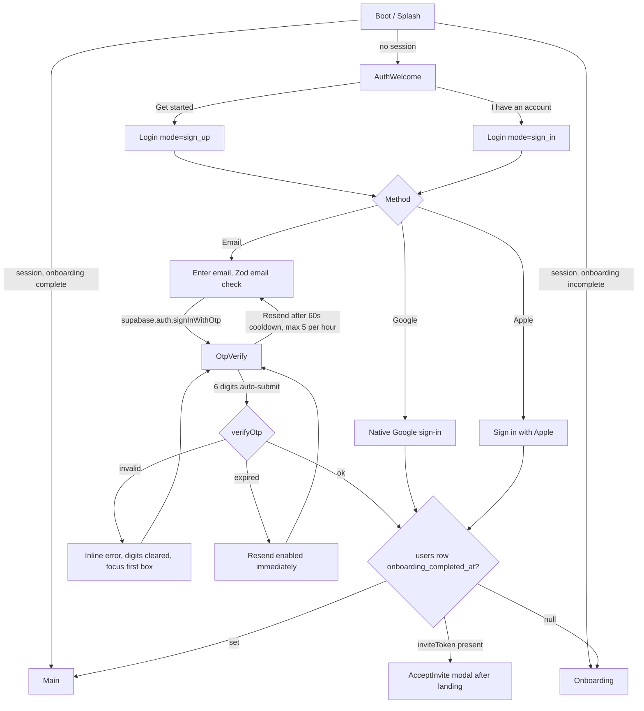

Details: `11-authentication.md`. The `users` row is created by the `auth.users` insert trigger; `locale` defaults from the device. OTP length is 6 digits, valid for 10 minutes.

### 5.2 Onboarding 1 to 6

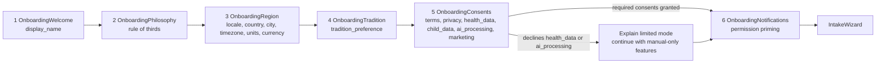

Progress is saved after each step (`users` update, `consents` insert). Killing the app resumes at the last incomplete step (`useOnboardingStore.step`, persisted). Back is always allowed; the language step re-renders the whole stack in the chosen locale and direction immediately (`I18nManager.forceRTL` requires a reload on Android; we show "Restarting to switch to Urdu…" and call `Updates.reloadAsync()`).

### 5.3 Intake wizard with branching for special modules

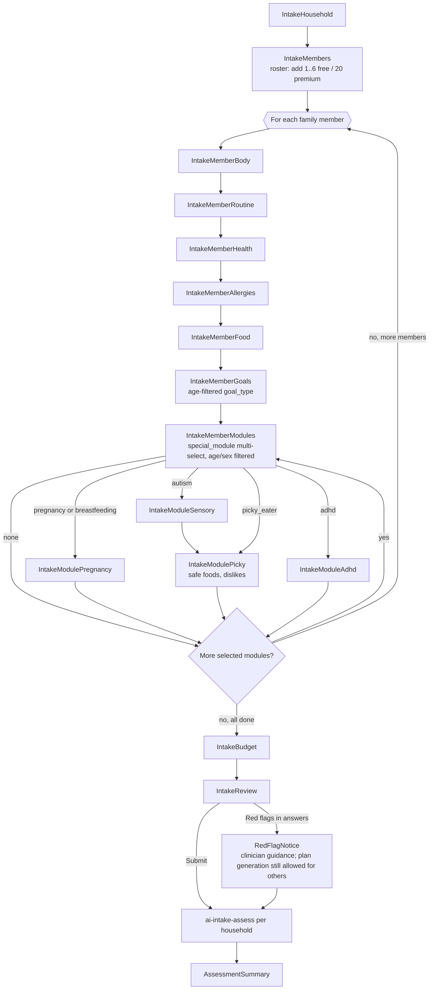

Branch order when several modules are selected: pregnancy/breastfeeding, then autism (sensory then safe foods), then picky eater (skipped if autism already captured safe foods; the picky screen then opens pre-filled), then ADHD. Members can be "Skip for now" at any per-member step after Body; skipped members get life-stage defaults and a "Finish profile" task on Dashboard.

### 5.4 First plan generation with progress

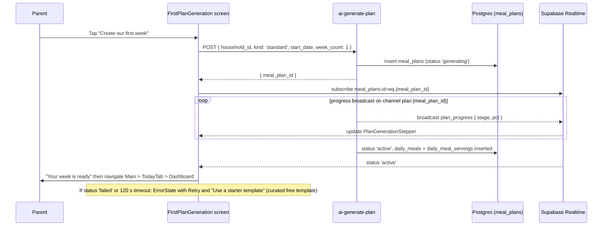

Progress stages shown in `PlanGenerationStepper` (broadcast on Realtime channel `plan:{meal_plan_id}`; contract in `06-api-specification.md`): `reading_profiles` (10%), `targets` (25%), `choosing_meals` (55%), `adapting_portions` (75%), `checking_safety` (90%), `saving` (100%). Each stage shows one short educational line (for example the fluid-timing rule) so the wait teaches something. Free users get a 1-week plan; the Premium multi-week toggle shows `PremiumBadge`.

### 5.5 Daily meal logging and acceptance scoring

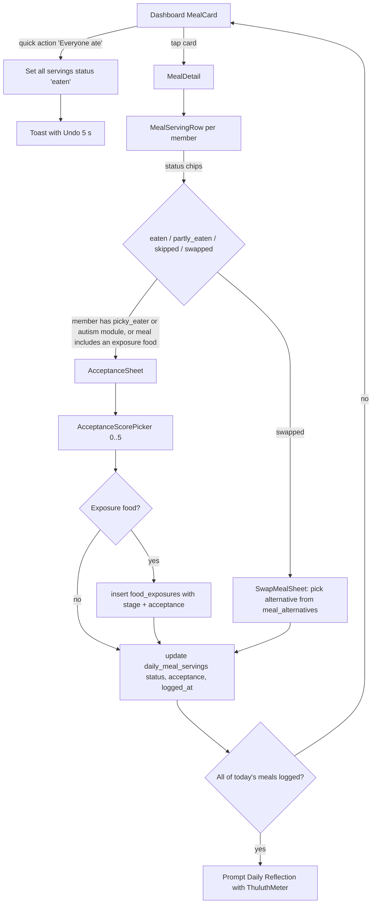

Offline: writes go to the mutation queue; `QueuedBadge` on the card until synced. Acceptance is optional for everyone except where the parent enabled "Ask me about new foods" (default on for picky and autism members).

### 5.6 AI chat with photo meal analysis

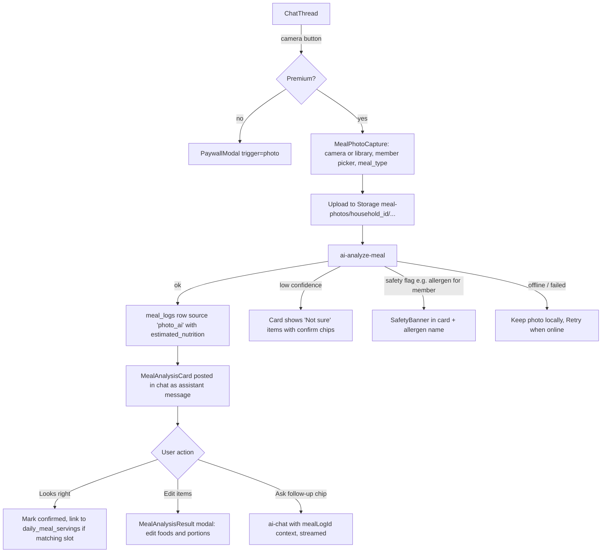

Text chat: `ai-chat` streams over SSE. Free users: text only, 20 messages per day; the composer shows the remaining count from 5 down. Voice: record (max 120 s), `ai-transcribe`, editable transcript inserted into composer, user sends.

### 5.7 Grocery shopping mode

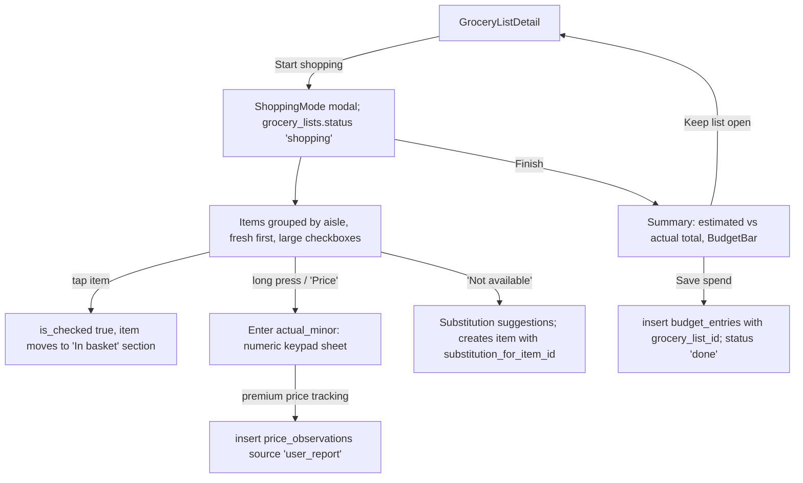

Shopping mode keeps the screen awake (`expo-keep-awake`), works fully offline, uses 56pt rows and a high-contrast option, and can be operated one-handed (Finish button bottom-anchored).

### 5.8 Hydration logging

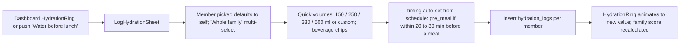

The family hydration score on Dashboard is `round(100 * avg over members with a target of min(1, today_ml / daily_ml))`. A child below 50% at 16:00 local triggers a gentle in-app nudge, never a red warning; signs-of-dehydration content is linked from Help.

### 5.9 Growth measurement entry and alert

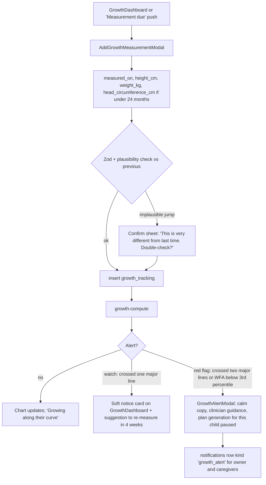

Free tier stores the measurement and shows latest value; charts and trend alerts are Premium. **Red-flag alerts are shown to free users too** (P1), as text without the chart.

### 5.10 Ramadan setup

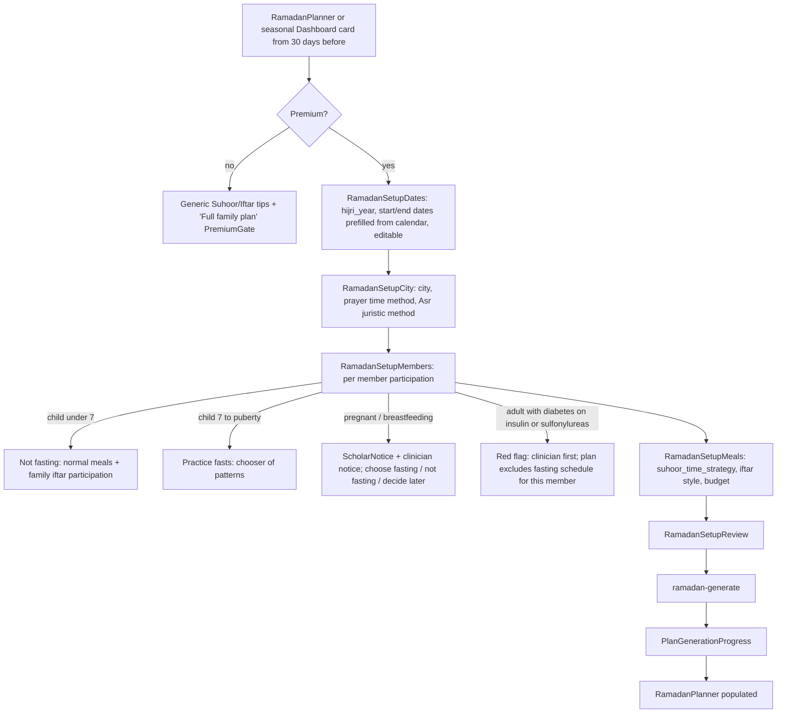

### 5.11 Upgrade paywall

```mermaid
flowchart TD
  T[Any gated action] --> P[PaywallModal trigger]
  P --> O[Load RevenueCat offerings; show annual preselected, monthly secondary]
  O -->|offerings fail| OE[ErrorState + Retry; 'Restore purchases' still visible]
  O --> B[Purchase]
  B -->|success| E[Entitlement 'premium' active in SDK]
  E --> W[Wait for server truth: poll has_premium up to 10 s or Realtime on subscriptions]
  W --> R[Close modal, resume original action automatically]
  B -->|cancelled| P
  B -->|pending / deferred (Ask to Buy)| PD[Pending state message]
  P -->|Restore| RS[Purchases.restorePurchases]
```

The original intent (for example "send this photo") is held in memory by `PaywallContainer` (see `08-component-architecture.md` §5.17 and `17-subscription-architecture.md`) and replayed after purchase.

### 5.12 Invite caregiver

```mermaid
sequenceDiagram
  participant O as Owner
  participant App
  participant EF as household-invite
  participant C as Caregiver
  O->>App: Family > Caregivers > Invite
  App->>App: InviteCaregiverModal (email, role caregiver/viewer)
  App->>EF: POST { action: 'create', household_id, email, role }
  EF-->>App: invitation (expires_at = now + 7 days)
  EF-->>C: Email with https://thuluth.app/invite/{token}
  C->>App: Opens link (app installed or store then deferred link)
  App->>App: AcceptInvite (signed out: Login with inviteToken, then OTP)
  App->>EF: POST { action: 'accept', token }
  EF-->>App: household_members row created
  App->>C: HouseholdSwitcher shows new household; lands on Dashboard
```

---

## 6. Screen inventory

ID prefixes: `B` boot/auth, `O` onboarding, `I` intake, `T` Today, `P` Plan, `C` Chat, `F` Family, `G` growth, `A` autism, `K` picky eater, `M` More, `S` settings/system, `X` modal or sheet. Tier column: F = free, P = premium, F/P = free with premium sections. Sprint column refers to `24-sprint-plan.md` (indicative).

| ID | Screen | Route | Navigator | Tier | Primary data | Primary action |
|---|---|---|---|---|---|---|
| B1 | Splash | `Boot` | Root | F | session, `users`, `feature_flags` | none (auto) |
| B2 | Auth Welcome | `AuthWelcome` | AuthStack | F | none | Get started |
| B3 | Login | `Login` | AuthStack | F | none | Send code |
| B4 | OTP Verification | `OtpVerify` | AuthStack | F | none | Verify |
| O1 | Onboarding Welcome | `OnboardingWelcome` | OnboardingStack | F | `users.display_name` | Continue |
| O2 | Philosophy | `OnboardingPhilosophy` | OnboardingStack | F | static content | Continue |
| O3 | Language and Region | `OnboardingRegion` | OnboardingStack | F | `users`, `regions` | Continue |
| O4 | Sources and Tradition | `OnboardingTradition` | OnboardingStack | F | `users.tradition_preference` | Continue |
| O5 | Privacy and Consents | `OnboardingConsents` | OnboardingStack | F | `consents` | Agree and continue |
| O6 | Reminders | `OnboardingNotifications` | OnboardingStack | F | `notification_preferences`, `devices` | Allow reminders |
| I1 | Intake: Household | `IntakeHousehold` | IntakeStack | F | `households` | Next |
| I2 | Intake: Members | `IntakeMembers` | IntakeStack | F | `family_members` | Next |
| I3 | Intake: Body and activity | `IntakeMemberBody` | IntakeStack | F | `family_members` | Next |
| I4 | Intake: Routine | `IntakeMemberRoutine` | IntakeStack | F | `family_members.work_schedule`, `sleep_schedule` | Next |
| I5 | Intake: Health | `IntakeMemberHealth` | IntakeStack | F | `medical_conditions`, `medications`, `supplements` | Next |
| I6 | Intake: Allergies | `IntakeMemberAllergies` | IntakeStack | F | `allergies`, `allergens` | Next |
| I7 | Intake: Food likes and dislikes | `IntakeMemberFood` | IntakeStack | F | `food_preferences`, `food_dislikes` | Next |
| I8 | Intake: Goals | `IntakeMemberGoals` | IntakeStack | F | `nutrition_goals` | Next |
| I9 | Intake: Special modules | `IntakeMemberModules` | IntakeStack | F | `family_members.special_modules` | Next |
| I10 | Intake: Pregnancy / breastfeeding | `IntakeModulePregnancy` | IntakeStack | F | `pregnancy_profiles` | Next |
| I11 | Intake: Sensory profile | `IntakeModuleSensory` | IntakeStack | F | `sensory_profiles` | Next |
| I12 | Intake: Safe foods (picky) | `IntakeModulePicky` | IntakeStack | F | `food_preferences.is_safe_food`, `food_dislikes` | Next |
| I13 | Intake: ADHD routine | `IntakeModuleAdhd` | IntakeStack | F | `medications`, `family_members.work_schedule` | Next |
| I14 | Intake: Budget | `IntakeBudget` | IntakeStack | F | `budget_profiles` | Next |
| I15 | Intake: Review | `IntakeReview` | IntakeStack | F | all of the above | Create our plan |
| O7 | Assessment Summary | `AssessmentSummary` | OnboardingStack | F | `ai_assessments`, `hydration_targets` | Create our first week |
| O8 | First Plan Generation | `FirstPlanGeneration` | OnboardingStack | F/P | `meal_plans` | (auto) |
| T1 | Dashboard | `Dashboard` | TodayStack | F/P | many (see 7.5.1) | Log a meal |
| T2 | Daily Meals | `DailyMeals` | TodayStack | F | `daily_meals`, `daily_meal_servings` | Log |
| T3 | Meal Detail | `MealDetail` | TodayStack | F | `daily_meals`, `meals`, `portions`, servings | Everyone ate |
| T4 | Daily Reflection | `DailyReflection` | TodayStack | F | `nutrition_journal` | Save |
| T5 | Notifications Center | `NotificationsCenter` | TodayStack | F | `notifications` | Open |
| P1 | Meal Plans | `MealPlans` | PlanStack | F/P | `meal_plans` | New plan |
| P2 | Meal Plan Detail | `MealPlanDetail` | PlanStack | F/P | `meal_plans`, `daily_meals`, `plan_recommendations` | Adjust |
| P3 | Recipes | `Recipes` | PlanStack | F | `recipes` | Open recipe |
| P4 | Recipe Detail | `RecipeDetail` | PlanStack | F | `recipes`, `recipe_ingredients`, `portions`, `meal_alternatives` | Add to plan |
| P5 | Grocery Lists | `GroceryLists` | PlanStack | F | `grocery_lists` | New list |
| P6 | Grocery List Detail | `GroceryListDetail` | PlanStack | F/P | `shopping_items` | Start shopping |
| C1 | Chat Sessions | `ChatSessions` | ChatStack | F | `chat_sessions` | New chat |
| C2 | AI Nutrition Chat | `ChatThread` | ChatStack | F/P | `chat_messages`, `ai_memories` | Send |
| F1 | Family Management | `FamilyManagement` | FamilyStack | F | `households`, `family_members`, `household_members` | Add member |
| F2 | Member Profile | `MemberProfile` | FamilyStack | F | `family_members` + summaries | Edit |
| F3 | Health Profile | `HealthProfile` | FamilyStack | F | health tables | Add item |
| F4 | Caregivers | `Caregivers` | FamilyStack | F | `household_members`, `household_invitations` | Invite |
| G1 | Growth Tracking | `GrowthDashboard` | FamilyStack | F/P | `growth_tracking`, `growth_reference_lms` | Add measurement |
| A1 | Autism Hub | `AutismHub` | FamilyStack | F/P | modules summary | Open section |
| A2 | Sensory Profile | `SensoryProfile` | FamilyStack | P | `sensory_profiles` | Save |
| A3 | Safe Foods | `SafeFoods` | FamilyStack | F | `food_preferences` (`is_safe_food`) | Add safe food |
| A4 | Exposure Ladders | `ExposureLadders` | FamilyStack | P | `exposure_ladders` | New ladder |
| A5 | Exposure Ladder Detail | `ExposureLadderDetail` | FamilyStack | P | `exposure_ladder_steps`, `food_exposures` | Log try |
| A6 | Food Chaining | `FoodChaining` | FamilyStack | P | `exposure_ladders` (strategy `food_chaining`) | Build chain |
| K1 | Picky Eater Hub | `PickyEaterHub` | FamilyStack | F/P | `food_exposures`, `coaching_tips` | Log exposure |
| K2 | Division of Responsibility | `DivisionOfResponsibility` | FamilyStack | F | `coaching_tips` | none |
| K3 | Exposure Log | `ExposureLog` | FamilyStack | F | `food_exposures` | Log exposure |
| K4 | Coaching Plan | `PickyCoachingPlan` | FamilyStack | P | `coaching_tips`, `exposure_ladders` | Start week |
| K5 | Acceptance Analytics | `AcceptanceAnalytics` | FamilyStack | P | `daily_meal_servings.acceptance`, `food_exposures` | none |
| M1 | More | `MoreHome` | MoreStack | F | none | navigate |
| M2 | Hydration Tracker | `HydrationTracker` | MoreStack | F | `hydration_targets`, `hydration_logs` | Log water |
| M3 | Fasting Tracker | `FastingTracker` | MoreStack | F | `fasting_logs` | Log fast |
| M4 | Meal Log | `MealLog` | MoreStack | F/P | `meal_logs` | Log meal |
| M5 | Nutrition Insights | `NutritionInsights` | MoreStack | P (teaser F) | aggregates | none |
| M6 | Ramadan Planner | `RamadanPlanner` | MoreStack | F/P | `ramadan_plans`, `meal_plans`, `fasting_logs` | Set up Ramadan |
| M7 | Budget Dashboard | `BudgetDashboard` | MoreStack | F/P | `budget_profiles`, `budget_entries`, `grocery_lists` | Add spend |
| M8 | Exports | `Exports` | MoreStack | P | `exports` | New export |
| S1 | Settings | `Settings` and `Settings*` | MoreStack | F | `users`, prefs | navigate |
| S2 | Subscription | `Subscription` | MoreStack | F | `subscriptions` | Manage |
| S3 | Help Center | `HelpCenter`, `HelpArticle` | MoreStack | F | bundled content | Search |
| S4 | About | `About` | MoreStack | F | static | none |
| X1 | Paywall | `PaywallModal` | Root modal | F | RevenueCat offerings | Start Premium |
| X2 | Log Meal | `LogMealModal` | Root modal | F | `meal_logs` | Save |
| X3 | Meal Photo Capture | `MealPhotoCapture` | Root modal | P | Storage | Analyze |
| X4 | Meal Analysis Result | `MealAnalysisResult` | Root modal | P | `meal_logs.estimated_nutrition` | Save |
| X5 | Log Hydration | `LogHydrationSheet` | Root sheet | F | `hydration_logs` | Add |
| X6 | Acceptance | `AcceptanceSheet` | Root sheet | F | `daily_meal_servings`, `food_exposures` | Save |
| X7 | Swap Meal | `SwapMealSheet` | Root sheet | F | `meal_alternatives` | Swap |
| X8 | Add Family Member | `AddFamilyMemberModal` | Root modal | F | `family_members` | Save |
| X9 | Add Growth Measurement | `AddGrowthMeasurementModal` | Root modal | F | `growth_tracking` | Save |
| X10 | Growth Alert | `GrowthAlertModal` | Root modal | F | `growth_tracking` | I understand |
| X11 | Invite Caregiver | `InviteCaregiverModal` | Root modal | F | `household_invitations` | Send invite |
| X12 | Accept Invite | `AcceptInvite` | Root modal | F | `household_invitations` | Join family |
| X13 | Plan Generation Progress | `PlanGenerationProgress` | Root modal | F/P | `meal_plans` | (auto) |
| X14 | Adjust Plan | `AdjustPlanModal` | Root modal | P | `meal_plans` | Apply changes |
| X15 | Shopping Mode | `ShoppingMode` | Root modal | F/P | `shopping_items` | Finish |
| X16 | Ramadan Setup (5 steps) | `RamadanSetup` | Root modal stack | P | `ramadan_plans` | Generate |
| X17 | Fast Log | `FastLogSheet` | Root sheet | F | `fasting_logs` | Save |
| X18 | Create Export | `CreateExportSheet` | Root sheet | P | `exports` | Create PDF |
| X19 | Source Detail | `SourceDetailSheet` | Root sheet | F | `recommendations`, `recommendation_evidence`, source tables | none |
| X20 | Household Switcher | `HouseholdSwitcherSheet` | Root sheet | F | `household_members` | Switch |
| X21 | Member Picker | `MemberPickerSheet` | Root sheet | F | `family_members` | Select |

---

## 7. Screen specifications

Format for every screen: **Purpose**, **Entry points**, **Layout regions** (top to bottom), **Components**, **Data**, **Actions**, **States**, **Copy**, **Accessibility**, **Analytics**. "Components" names match `03-design-system.md` §10 and `08-component-architecture.md`. "Data" names the tables and the query hook (hooks live in `apps/mobile/src/features/<feature>/api/`; key shapes in `09-state-management.md`). Urdu copy is shown in Nastaliq script; final strings are owned by the i18n files `apps/mobile/src/i18n/{en,ur}/*.json`.

### 7.1 Boot and authentication

#### 7.1.1 Splash (`Boot`, B1)

- **Purpose:** Restore session, load locale and direction, fetch feature flags and entitlement snapshot, decide the root route. No user interaction.
- **Entry points:** Cold start; `Updates.reloadAsync()` after a language change.
- **Layout regions:** Full-bleed `color.bg.canvas`; centred `ThuluthLogo` (Thuluth-inspired logotype, 96pt); subtle `GeometricPattern` at 4% opacity behind (hidden in Sensory-calm mode); app version in caption at bottom (only in non-production builds).
- **Components:** `ThuluthLogo`, `GeometricPattern`, `ActivityIndicator` (appears only after 1.5 s).
- **Data:** `supabase.auth.getSession()`; `users` row (`useMe()`); `feature_flags` (cached); RevenueCat `getCustomerInfo()` (non-blocking).
- **Actions:** None. Native splash (expo-splash-screen) is held until fonts (Inter, Noto Nastaliq Urdu, Amiri Quran) and the MMKV stores are hydrated, max 3 s, then this screen renders.
- **States:** *Loading:* logo only. *Offline with cached session:* proceed to `Main` with `OfflineBanner`. *Offline without session:* go to `AuthWelcome`, which shows the offline banner. *Forced update* (flag `min_supported_version` greater than current): `UpdateRequired` interstitial with store link. *Error fetching user:* retry twice with backoff, then proceed with cached data.
- **Copy:** none visible except "Getting things ready…" / "تیاری ہو رہی ہے…" after 1.5 s.
- **Accessibility:** `accessibilityLabel="Thuluth"`; the indicator announces "Loading" once; no motion when reduced motion is on.
- **Analytics:** `app_opened { cold: boolean, has_session: boolean }`.

#### 7.1.2 Auth Welcome (`AuthWelcome`, B2)

- **Purpose:** First impression and the choice between creating an account and signing in. Sets the gentle tone.
- **Entry points:** Splash with no session; sign-out.
- **Layout regions:** (1) Top 55%: illustration of a shared dinner spread (sufra) seen from above, no people's faces, hands only; (2) Title and one-line tagline; (3) Primary and secondary buttons; (4) Language toggle "English · اردو" at top-end; (5) Legal footnote.
- **Components:** `Illustration name="sufra_overhead"`, `Text variant="displaySm"`, `Button variant="primary"`, `Button variant="ghost"`, `LanguageToggle`, `LegalFootnote`.
- **Data:** none. Language toggle writes to `usePreferencesStore.locale` (pre-auth) and is copied into `users.locale` after sign-up.
- **Actions:** Get started → `Login {mode:'sign_up'}`; I have an account → `Login {mode:'sign_in'}`; language toggle.
- **States:** Offline: `OfflineBanner`, buttons still enabled (Login screen handles the error).
- **Copy:** Title "Eat in thirds. Grow in barakah." · Body "Gentle, faith-rooted meal planning for your whole family." · Buttons "Get started" / "I already have an account". Urdu: "تہائی میں کھائیں، برکت میں بڑھیں۔" · "شروع کریں" / "میرا اکاؤنٹ پہلے سے ہے"
- **Accessibility:** Illustration `accessibilityElementsHidden`; buttons 52pt tall; title is header role.
- **Analytics:** `auth_welcome_cta { cta: 'get_started' | 'sign_in' }`, `locale_changed { from, to, where: 'auth_welcome' }`.

#### 7.1.3 Login (`Login`, B3)

- **Purpose:** Collect an email for OTP, or sign in with Google or Apple. One screen serves sign-up and sign-in (Supabase OTP creates the user if absent).
- **Entry points:** Auth Welcome; invite deep link while signed out (carries `inviteToken`).
- **Layout regions:** (1) `Screen` header with back; (2) Title; (3) `Input` email; (4) Primary "Send code"; (5) Divider "or"; (6) `SocialButton provider="apple"` (iOS first, also shown on Android per Apple guideline parity), `SocialButton provider="google"`; (7) Legal text with Terms and Privacy links.
- **Components:** `Screen`, `Input variant="text" keyboardType="email-address"`, `Button`, `Divider`, `SocialButton`, `InlineError`, `LegalFootnote`.
- **Data / validation:** Zod `z.string().trim().toLowerCase().email().max(254)`. Calls `supabase.auth.signInWithOtp({ email, options: { shouldCreateUser: true } })`.
- **Actions:** Send code → `OtpVerify {email, inviteToken}`. Social sign-in → native flow → `signInWithIdToken`. Invite banner shows if `inviteToken` present: "You've been invited to join a family on Thuluth."
- **States:** *Submitting:* button spinner, field disabled. *Invalid email:* inline error under field. *Rate limited (429):* "Too many attempts. Please wait a minute and try again." *Offline:* inline error "You're offline. Connect to the internet to sign in." *Social cancelled:* silently return. *Social error:* toast with retry.
- **Copy:** Title (sign_up) "Let's create your family's space" / (sign_in) "Welcome back". Field label "Email". Helper "We'll send a 6-digit code. No password needed." Urdu: "اپنے خاندان کی جگہ بنائیں" · "ای میل" · "ہم 6 ہندسوں کا کوڈ بھیجیں گے۔ پاس ورڈ کی ضرورت نہیں۔"
- **Accessibility:** `autoComplete="email"`, `textContentType="emailAddress"`, `keyboardType="email-address"`; error announced via `accessibilityLiveRegion="polite"`; email field is LTR even in Urdu.
- **Analytics:** `auth_otp_requested { mode }`, `auth_social_started { provider }`, `auth_social_completed { provider, is_new_user }`, `auth_error { code, step: 'login' }`.

#### 7.1.4 OTP Verification (`OtpVerify`, B4)

- **Purpose:** Verify the 6-digit code.
- **Entry points:** Login.
- **Layout regions:** (1) Header with back; (2) Title and the email (masked middle part, tappable "Change"); (3) `Input variant="otp"` six cells; (4) Resend row with countdown; (5) Help link "Didn't get it?".
- **Components:** `Input variant="otp"`, `CountdownText`, `Button variant="link"`, `InlineError`, `HelpSheet`.
- **Data:** `supabase.auth.verifyOtp({ email, token, type: 'email' })`. On success, read `users.onboarding_completed_at`; the root navigator reacts to the session change.
- **Actions:** Auto-submit on 6th digit; paste full code supported; iOS `textContentType="oneTimeCode"`, Android SMS retriever is not used (email). Resend after 60 s (max 5 per hour client-side; server limits authoritative). Change email → back.
- **States:** *Verifying:* boxes dimmed, spinner below. *Invalid:* shake animation (disabled on reduced motion; replaced with colour + text), clear and refocus. *Expired:* "This code has expired. We've enabled Resend." *Too many attempts:* lock 5 minutes with message. *Offline:* inline error.
- **Copy:** "Check your email" · "Enter the 6-digit code we sent to a••••@gmail.com" · "Resend code in 0:42" · "Didn't get it? Check spam, or try another email." Urdu: "اپنی ای میل دیکھیں" · "کوڈ دوبارہ بھیجیں"
- **Accessibility:** the OTP `Input` is a single hidden `TextInput` with six visual cells so screen readers treat it as one field labelled "Verification code, 6 digits"; digits always LTR.
- **Analytics:** `auth_otp_verified { attempts }`, `auth_otp_resent`, `auth_error { code, step: 'otp' }`.

### 7.2 Onboarding 1 to 6

Shared layout for O1 to O6: `OnboardingScaffold` with a `WizardProgress` (6 dots, current filled), a skip-free flow (each step is quick), a bottom-anchored primary button, and Back in the header. Each step saves on Continue; failures keep the user on the step with an inline error.

#### 7.2.1 O1 Welcome and name (`OnboardingWelcome`)

- **Purpose:** Greet, collect `users.display_name`.
- **Layout:** Bismillah line in Arabic (Amiri, decorative, `accessibilityLabel="Bismillah ir-Rahman ir-Raheem"`), title, `Input` "What should we call you?", Continue.
- **Data:** update `users.display_name` (Zod: 1 to 40 chars, trimmed, no emoji-only).
- **States:** saving, error toast. Prefilled from Apple/Google name if available.
- **Copy:** "Assalamu alaikum! We're glad you're here." · "What should we call you?" Urdu: "السلام علیکم! خوش آمدید۔" · "ہم آپ کو کس نام سے پکاریں؟"
- **Accessibility:** Bismillah toggle respects Settings > Faith "Show Islamic phrases" (default on; the screen hides it if a later reinstall had it off).
- **Analytics:** `onboarding_step_completed { step: 1 }`.

#### 7.2.2 O2 Philosophy (`OnboardingPhilosophy`)

- **Purpose:** Teach the rule of thirds in 20 seconds and set expectations that children are never restricted.
- **Layout:** (1) `ThuluthMeter mode="adult"` in demo form (static example values) showing the three thirds labelled Food, Drink, Breath; (2) Hadith card: Arabic (Amiri), translation, `SourceCitationChip` "Tirmidhi 2380 · Sahih"; (3) `PlateDiagram size={220} showLabels` with half vegetables and fruit, quarter protein, quarter whole grains; (4) "For children" callout with the never-restrict promise; (5) Continue.
- **Components:** `ThuluthMeter`, `PlateDiagram`, `QuoteCard`, `SourceCitationChip`, `Callout tone="info"`.
- **Data:** static; citation chip opens `SourceDetailSheet` for the verified `hadith_references` row (looked up by `collection='tirmidhi', number='2380'`; if not yet verified in the DB, the chip is shown without tap).
- **Copy:** Hadith translation as in `00-foundations.md` §2. Callout: "For children, we never count or cut. We build calm meal rhythms, and seconds are always welcome when they're hungry." Urdu callout: "بچوں کے لیے ہم کبھی گنتی یا کمی نہیں کرتے۔ ہم پرسکون کھانے کے معمولات بناتے ہیں، اور بھوک ہو تو دوسری بار لینا ہمیشہ ٹھیک ہے۔"
- **Accessibility:** Diagrams have full text alternatives ("Plate: half vegetables and fruit, one quarter protein, one quarter whole grains").
- **Analytics:** `onboarding_step_completed { step: 2 }`, `source_chip_opened { where: 'onboarding' }`.

#### 7.2.3 O3 Language, region, units (`OnboardingRegion`)

- **Purpose:** Set `users.locale`, `country_code`, `timezone`, `units`; prefill household currency and city.
- **Layout:** `SegmentedControl` English / اردو; `SelectField` Country (Pakistan first, then alphabetical; flags are not used, names only); `SelectField` City (from `regions` for launch price books: Lahore, Karachi, Islamabad; "Other" free text); `SelectField` Time zone (auto from device, editable); `SegmentedControl` Units Metric / Imperial; read-only currency preview "Prices in PKR".
- **Data:** `regions` (cached); update `users`. Household currency is written later in I1.
- **Validation:** country required; timezone must be a valid IANA name (`Intl.supportedValuesOf('timeZone')`).
- **States:** Changing language to Urdu triggers RTL reload confirmation sheet.
- **Copy:** "Where is your family based?" · "We use this for local prices, seasonal produce and prayer times." Urdu: "آپ کا خاندان کہاں رہتا ہے؟"
- **Analytics:** `onboarding_step_completed { step: 3, locale, country_code, units }`.

#### 7.2.4 O4 Sources and tradition (`OnboardingTradition`)

- **Purpose:** Choose which Islamic sources appear: `shared`, `sunni`, `shia` (`users.tradition_preference`).
- **Layout:** Explanation paragraph; three `RadioCard`s: "All sources, each labelled by tradition" (`shared`: shared sources plus Sunni and Shia narrations, labelled), "Shared and Sunni sources" (`sunni`), "Shared and Shia sources, including narrations of the Twelve Imams (peace be upon them)" (`shia`); note that every source is labelled and verified; Continue. Filtering semantics are defined in `09-state-management.md` §5.6.
- **Data:** update `users.tradition_preference` (default `shared`).
- **Copy:** "Thuluth cites the Qur'an, the Sunnah of the Prophet ﷺ and the narrations of the Ahl al-Bayt. Choose what you'd like to see. You can change this anytime." Urdu: "آپ کون سے ماخذ دیکھنا چاہیں گے؟ آپ اسے کبھی بھی بدل سکتے ہیں۔"
- **Accessibility:** radio group semantics; each card has a one-line description read after the title.
- **Analytics:** `onboarding_step_completed { step: 4, tradition }`.

#### 7.2.5 O5 Privacy and consents (`OnboardingConsents`)

- **Purpose:** Record explicit consents in `consents` with version. Required: `terms`, `privacy`, `health_data`, `child_data` (only if the user will add children; asked here, re-asked in I2 if skipped), `ai_processing`. Optional: `marketing`.
- **Layout:** Plain-language summary ("What we store, why, who sees it"), then `ConsentRow` checkboxes each with "Read more" expanding text; "Agree and continue" enabled once required boxes are checked; secondary "Continue without AI" if `ai_processing` unchecked.
- **Data:** insert `consents` rows `{kind, version, granted_at}`; version strings are constants in `packages/shared/src/legal.ts` (no table needed).
- **States:** Declining `ai_processing` sets limited mode: chat, photo analysis and AI plan generation are disabled; curated templates still work. Declining `health_data` blocks the intake health steps (they become "Skipped") and shows a persistent tip.
- **Copy:** "Your family's health information is private. It is stored securely, never sold, and only shared with people you invite." · "AI processing: questions and meal photos are sent to our AI providers to generate answers. They are not used to train public models." Urdu: "آپ کے خاندان کی صحت کی معلومات نجی ہیں۔"
- **Accessibility:** each checkbox has its own label; "Read more" is a button with expanded state.
- **Analytics:** `consent_updated { kind, granted }` per row (no free text).

#### 7.2.6 O6 Reminders and notifications (`OnboardingNotifications`)

- **Purpose:** Prime the OS permission and set initial `notification_preferences`.
- **Layout:** Illustration (bell made of a geometric tile); list of `SwitchRow`s: Meal reminders, Water before meals, Shopping day, Growth check-ins (monthly), Ramadan suhoor and iftar (seasonal); quiet hours picker (default 22:00 to 06:00); "Allow reminders" primary, "Not now" secondary.
- **Data:** upsert `notification_preferences` per kind; on permission grant, OneSignal `login(users.id)` and upsert `devices`.
- **States:** Permission denied: show "You can turn reminders on later in Settings." and continue.
- **Copy:** "Small, kind reminders. Never more than you choose." Urdu: "مختصر، نرم یاددہانیاں۔ آپ کی مرضی سے زیادہ کبھی نہیں۔"
- **Analytics:** `push_permission_result { granted }`, `onboarding_step_completed { step: 6 }`.

### 7.3 Intake Wizard (`IntakeWizard`, I1 to I15)

**Shared scaffold.** Every step renders inside `IntakeStep` (`08-component-architecture.md` §5.20) with: header (Back, title, "Save and exit" which returns to a resume card on Dashboard after onboarding, or stays in onboarding before), a `WizardProgress` bar showing section progress (Household, Family, each member's name as a section, Budget, Review), the current member's `Avatar` and name on per-member steps, a scrollable form, and a bottom bar with "Next" (primary) and, on optional steps, "Skip for now". Forms use React Hook Form with Zod resolvers from `packages/shared/src/schemas/intake/*.ts`. Each step persists on Next (upsert, idempotent). Draft input is also kept in `useIntakeDraftStore` (MMKV) so an app kill loses nothing.

**Age logic.** Age computed from `date_of_birth` in the household time zone. `life_stage`: infant under 12 months, toddler 12 to 35 months, child 3 to 12 years, teen 13 to 17, adult 18 to 64, older_adult 65 plus (stored; derivation rule is authoritative in `05-database-schema.md`).

#### 7.3.1 I1 Household (`IntakeHousehold`)

| Field | Column | Control | Validation (Zod) | Default | Copy (label / helper) |
|---|---|---|---|---|---|
| Family name | `households.name` | Input | 1 to 40 chars | "{display_name}'s family" | "What do you call your household?" / "Only you and people you invite see this." |
| Country | `households.country_code` | SelectField | ISO 3166-1 alpha-2 | from O3 | "Country" |
| City | `households.city`, `region` | SelectField + free text | required, 1 to 60 | from O3 | "City" / "Used for local prices and prayer times." |
| Time zone | `households.timezone` | SelectField | valid IANA | from O3 | "Time zone" |
| Currency | `households.currency` | SelectField | ISO 4217 | from country (PKR) | "Currency" |

Urdu label examples: "گھرانے کا نام", "شہر", "کرنسی". Analytics: `intake_step_completed { step: 'household' }`.

#### 7.3.2 I2 Members roster (`IntakeMembers`)

- **Layout:** List of `MemberRow` (avatar, name, age label, life stage chip); "Add a family member" button opens an inline `MemberQuickForm` (name, date of birth, sex at birth, "This is me" toggle). Counter "3 of 6 (free plan)".
- **Fields:**

| Field | Column | Control | Validation | Copy |
|---|---|---|---|---|
| Name | `family_members.name` | Input | 1 to 40 | "Name or nickname" |
| Date of birth | `date_of_birth` | DatePickerField (year-first for adults) | not in future; age 0 to 120 | "Date of birth" / "For children, this lets us follow growth charts accurately." |
| Sex at birth | `sex_at_birth` | SegmentedControl female / male / prefer not to say (`unspecified`) | required | "Sex at birth" / "Used only for growth charts and energy needs." |
| This is me | `linked_user_id = auth.uid()` | Switch | at most one member per user per household | "This is me" |
| Avatar | `avatar_path` or preset key | AvatarPicker | optional | "Pick an icon" |

- **Rules:** At least one member to continue. If any member is under 18 and `child_data` consent is missing, show `ConsentInlineCard` before continuing. Adding a 7th member on free tier opens `PaywallModal {trigger:'member_limit'}` (insert also blocked by server trigger).
- **States:** Empty: "Add everyone you cook for, even if they don't use phones." Error on save: row-level inline error with retry.
- **Copy (ur):** "خاندان کے افراد شامل کریں" · "یہ میں ہوں"
- **Analytics:** `family_member_added { life_stage, source: 'intake' }`.

#### 7.3.3 I3 Body and activity (`IntakeMemberBody`)

| Field | Column | Control | Validation | Notes / copy |
|---|---|---|---|---|
| Height | `height_cm` | Input variant="numeric" with unit toggle cm / ft-in | 40 to 230 cm; child plausibility vs WHO median ±4 SD (warning, not block) | "Height" / "A rough number is fine. You can update it later." |
| Weight | `weight_kg` | Input variant="numeric" kg / lb | 2 to 300 kg; same plausibility warning | "Weight" (children: "Weight helps us check growth, not to restrict food.") |
| Activity level | `activity_level` | RadioCards with examples | required for 3 years plus; hidden for infants/toddlers (stored null, life-stage default used) | sedentary "Mostly sitting", light "Walks, light chores", moderate "30 to 60 min activity most days", active "Sports or physical work", very_active "Hard training or labour" |
| Blood group | `blood_group` | SelectField | enum incl. `unknown` | Optional. "We don't change plans by blood group; this is for your records." |

First growth measurement: for members under 18, height and weight entered here are also inserted into `growth_tracking` (measured_on = today) and `growth-compute` is called in the background. For adults with a weight goal later, a first `weight_tracking` row is inserted.

Analytics: `intake_step_completed { step: 'body', life_stage }`.

#### 7.3.4 I4 Routine (`IntakeMemberRoutine`)

- **Fields:** `work_schedule jsonb` and `sleep_schedule jsonb`. Shape (shared Zod schema):

```ts
export const WorkScheduleSchema = z.object({
  kind: z.enum(['school', 'office', 'shift', 'home', 'none']),
  days: z.array(z.number().int().min(0).max(6)).max(7), // 0 = Sunday
  start: z.string().regex(/^\d{2}:\d{2}$/).optional(),
  end: z.string().regex(/^\d{2}:\d{2}$/).optional(),
  packedLunch: z.boolean().default(false),
});
export const SleepScheduleSchema = z.object({
  wake: z.string().regex(/^\d{2}:\d{2}$/),
  sleep: z.string().regex(/^\d{2}:\d{2}$/),
  nap: z.object({ start: z.string(), end: z.string() }).optional(), // toddlers
});
```

- **Controls:** RadioCards for kind (labels adapt: child shows "School", adult shows "Work"), `DayChips`, `TimeField`s, Switch "Takes a packed lunch / tiffin".
- **Copy:** "When does {name} usually wake up and sleep?" Urdu: "{name} عموماً کب جاگتے اور سوتے ہیں؟"
- **Skip:** allowed; defaults by life stage.

#### 7.3.5 I5 Health (`IntakeMemberHealth`)

- **Layout:** Three collapsible sections, each with an "Add" button and a "None" chip (explicit none is stored as the absence of rows plus `intake_flags.none_conditions = true` in the draft store; no column needed).
  - **Conditions** (`medical_conditions`): searchable `ConditionPicker` (SNOMED-coded common list: type 1 diabetes, type 2 diabetes, prediabetes, hypertension, high cholesterol, PCOS, hypothyroidism, IBS, celiac disease, anaemia, GERD, kidney disease, gestational diabetes) plus free text; `diagnosed_on` optional month-year; notes optional (max 280).
  - **Medications** (`medications`): name (autocomplete, free text allowed), dose (free text, max 40), frequency (chips: once daily, twice daily, with meals, as needed, other). `food_interaction_flags` are set server-side by `ai-intake-assess`, not by the user.
  - **Supplements** (`supplements`): name, dose, frequency (common chips: vitamin D, iron, folic acid, multivitamin, omega-3, calcium).
- **Red-flag capture:** selecting type 1 diabetes, or type 2 diabetes plus a medication matching insulin or sulfonylurea patterns, shows an inline `SafetyBanner tone="info"`: "We'll keep fasting and big diet changes off {name}'s plan until you've spoken with their doctor." Also a gentle screener question for teens and adults: "Has {name} been worried about food, weight or eating lately?" (Yes / No / Prefer not to say). "Yes" adds risk flag `eating_concern` to the draft which `ai-intake-assess` maps to the eating-disorder escalation path; the UI immediately shows supportive copy and a Help link, and removes weight goals from I8 for that member.
- **Copy:** "Does {name} have any health conditions we should plan around?" · Helper: "This helps us avoid foods that don't suit them. It never replaces their doctor's advice." Urdu: "کیا {name} کو کوئی ایسی بیماری ہے جس کا ہمیں خیال رکھنا چاہیے؟"
- **Analytics:** `intake_step_completed { step: 'health', conditions_count, medications_count }` (counts only).

#### 7.3.6 I6 Allergies and intolerances (`IntakeMemberAllergies`)

| Field | Column | Control | Validation |
|---|---|---|---|
| Allergen | `allergies.allergen_id` | `AllergenGrid` (EU-14 + US Big-9 superset from `allergens`, icon + label) plus search | required per row |
| Type | `kind` | SegmentedControl Allergy / Intolerance | required |
| Severity | `severity` | RadioCards mild, moderate, severe, anaphylactic | required for allergies; optional for intolerances |
| Reaction notes | `reaction_notes` | TextArea | max 280 |

Selecting `anaphylactic` shows: "We'll exclude {allergen} and foods that may contain it from all of {name}'s meals, and flag shared family dishes. Always check labels; our data can't guarantee cross-contamination safety." Copy (ur): "الرجی", "شدید ردعمل". Analytics: `intake_step_completed { step: 'allergies', count, has_anaphylactic }`.

#### 7.3.7 I7 Food likes and dislikes (`IntakeMemberFood`)

- **Layout:** Two `IngredientChipPicker`s (search across `ingredients` with `name_i18n`; recent and region-popular suggestions first: daal, roti, chicken, eggs, rice, yogurt, banana, guava, lauki, spinach) for **Likes** (`food_preferences`, `strength` 1 to 3 via tap cycling: like, love, favourite) and **Dislikes** (`food_dislikes` with `reason` chips: taste, texture, smell, color, religious, other). Free-text items allowed (ingredient_id null, `label` set).
- **Validation:** max 50 per list; an item cannot be both liked and disliked.
- **Copy:** "What does {name} enjoy? And what would they rather skip?" Helper for children: "Dislikes are normal. We'll keep offering a little, without pressure." Urdu: "{name} کو کیا پسند ہے؟ اور کیا ناپسند؟"

#### 7.3.8 I8 Goals (`IntakeMemberGoals`)

- **Options by age** (`goal_type`):

| Life stage | Shown goals | Hidden | Default |
|---|---|---|---|
| infant, toddler, child, teen | `child_growth`, `energy`, `digestive_health` (teen also `blood_sugar` and `heart_health` only if a matching condition exists) | `weight_loss`, `weight_gain` (weight gain for under-18 is clinician-led; the app shows "If a doctor has advised weight gain, add it in Health > Notes and we'll support it with more energy-dense meals"); `pregnancy_support` is not offered here but is added automatically when the pregnancy module is selected for a teen in I9 | `child_growth` |
| adult, older_adult | all except `child_growth`; `pregnancy_support` / `breastfeeding_support` only if sex at birth is female or unspecified | `child_growth` | `maintain` |

- **Fields:** multi-select up to 3, one marked primary (`is_primary`). For `weight_loss` / `weight_gain` (adults): optional `target_value` (kg), `target_date`; validation caps loss pace at 1 percent body weight per week (warning) and blocks targets resulting in BMI under 18.5. `weight_loss` is hidden if the member is pregnant, breastfeeding, or flagged `eating_concern`.
- **Copy:** "What would help {name} most right now?" Child header: "For children, our goal is always healthy growth." Urdu: "اس وقت {name} کے لیے سب سے زیادہ کیا مددگار ہوگا؟"

#### 7.3.9 I9 Special modules (`IntakeMemberModules`)

- **Options** (`special_module[]`): pregnancy and breastfeeding (female or unspecified, age 15 plus; mutually exclusive in one entry but both allowed sequentially is not offered in v1), autism (any age 18 months plus), adhd (3 years plus), picky_eater (12 months plus). Each option is a `ModuleCard` with a one-line explanation and, for autism and picky eater, "Free: safe-food list / guide. Premium: full module" text.
- **Branching:** see §5.3. Choosing none goes to the next member.
- **Copy:** "Would any extra support help {name}?" · autism: "Sensory-friendly meals, safe foods and gentle food exploration." · picky_eater: "Calm strategies for selective eating." Urdu: "کیا {name} کے لیے کوئی اضافی مدد فائدہ مند ہوگی؟"

#### 7.3.10 I10 Pregnancy / breastfeeding (`IntakeModulePregnancy`)

| Field | Column | Control | Validation |
|---|---|---|---|
| Due date | `pregnancy_profiles.due_date` | DatePickerField | today to today + 42 weeks |
| Trimester | `trimester` | auto-computed from due date, editable | 1 to 3 |
| Gestational diabetes | `gestational_diabetes` | Switch | boolean |
| Breastfeeding: baby's age | see note below | MonthsField | 0 to 36 months |

Note: breastfeeding has no dedicated table in `00-foundations.md`. The baby's age is used only to choose guidance and is stored in `nutrition_goals` as `goal_type = 'breastfeeding_support'` with `target_unit = 'baby_age_months'` and `target_value = <months>`. This avoids a new column. Copy: "Congratulations! We'll make sure {name} gets enough, with no calorie cutting." Urdu: "مبارک ہو! ہم یقینی بنائیں گے کہ {name} کو پوری غذا ملے۔" `ScholarNotice` appears about fasting.

#### 7.3.11 I11 Sensory profile (`IntakeModuleSensory`)

Rendered with `SensoryProfileEditor` (`08-component-architecture.md` §5.9).

| Field | Column | Control |
|---|---|---|
| Textures liked | `sensory_profiles.texture_likes` | `TextureChipGrid` (enum `texture`, each chip with a small neutral icon) |
| Textures avoided | `texture_avoids` | same grid, distinct selection style (outline + strike icon, not red) |
| Colour sensitivities | `color_sensitivities` | colour swatch chips with text labels (green, red, orange, white, brown, mixed colours) |
| Presentation | `presentation_prefs` | toggles: foods separated, same plate always, divided plate, cut shapes (strips, cubes, coins), sauce on the side |
| Temperature | `temperature_prefs` | chips: warm, room temperature, cold, no preference |
| Brand rigidity | `brand_rigidity` | Switch "Prefers the same brand or packaging" |

Free tier stores this profile during intake (so plans can use it); editing later via `SensoryProfile` screen is Premium (see A2), but the plan generator always respects the stored profile. Copy: "Every child experiences food differently. Tell us what feels comfortable for {name}." Urdu: "ہر بچہ کھانے کو مختلف انداز سے محسوس کرتا ہے۔" Accessibility: colours always have text labels.

#### 7.3.12 I12 Safe foods (`IntakeModulePicky`)

- **Fields:** "Foods {name} reliably eats" (`food_preferences` with `is_safe_food = true`, minimum 3 suggested, warning if fewer: "That's okay. We'll start from whatever {name} eats today."); "Foods that are hard right now" (`food_dislikes`); "How are mealtimes lately?" single-select (calm, sometimes hard, often stressful) stored in the draft for the assessment prompt only.
- **Copy:** "Safe foods are foods your child eats without stress. We'll include one at every meal." Urdu: "محفوظ غذائیں وہ ہیں جو بچہ بغیر پریشانی کے کھاتا ہے۔ ہم ہر کھانے میں ایک شامل کریں گے۔"

#### 7.3.13 I13 ADHD routine (`IntakeModuleAdhd`)

- **Fields:** Stimulant medication? (Yes / No / Not sure) and dose time (`medications` row with `frequency`), "Appetite is lower at lunch" Switch, "Needs snacks on a schedule" Switch. Stored as `medications` rows and draft flags passed to `ai-intake-assess`.
- **Copy:** "Some ADHD medicines lower appetite midday. We can plan a bigger breakfast and an evening snack." Urdu: "کچھ ADHD دوائیں دوپہر کو بھوک کم کر دیتی ہیں۔"

#### 7.3.14 I14 Budget (`IntakeBudget`)

| Field | Column | Control | Validation / default |
|---|---|---|---|
| Monthly food budget | `budget_profiles.monthly_amount_minor`, `currency` | `CurrencyField` with suggestions from household size and price book (e.g. Lahore family of four: PKR 70,000 to 90,000) | > 0; max 10,000,000 major units |
| How strict? | `strictness` | RadioCards flexible / target / hard_cap | default `target` |
| Category split | `category_split` | "Use recommended split" Switch (default on) else `BudgetSplitEditor` across `budget_categories` | sums to 100% |
| Shopping day | stored in `notification_preferences` (kind `shopping_reminder`, `quiet_hours` unaffected) and used by grocery list period | DayChips | default Sunday (bazaar day) |

Copy: "What would you like to spend on food each month?" helper "We'll suggest seasonal, local swaps to stay within it." Urdu: "آپ ماہانہ کھانے پر کتنا خرچ کرنا چاہتے ہیں؟"

#### 7.3.15 I15 Review (`IntakeReview`)

- **Layout:** Summary cards per section and member, each with "Edit" jumping to that step and back to Review. Missing-but-optional items show "Skipped" chips. `RedFlagNotice` at top if any red flags were captured, listing affected members and what the plan will not include. Primary "Create our plan".
- **Actions:** mark household intake complete; call `ai-intake-assess` (one call per household; returns one assessment per member plus household summary). Then `users.onboarding_completed_at` is set only after the first plan is active or the user chooses "Explore first".
- **States:** *Submitting:* full-width progress "Understanding your family…" (5 to 20 s), cancellable (keeps data). *AI declined in consents:* button reads "Use a starter plan" and skips assessment. *Error:* `ErrorState` with retry; code shown.
- **Analytics:** `intake_completed { members, modules: SpecialModule[], has_red_flags }`, `ai_assessment_requested`.

### 7.4 Assessment Summary and First Plan Generation

#### 7.4.1 Assessment Summary (`AssessmentSummary`, O7)

- **Purpose:** Show, in plain language, what the AI understood and the targets it will plan with, before generating.
- **Layout:** (1) Household summary paragraph (`ai_assessments` with `family_member_id null`); (2) Horizontal `MemberSummaryCard` carousel: adults show energy range and macro split as a small `PlateDiagram`, hydration target in glasses and ml; children show "Growth-first plan", hydration target in cups, portion style ("Child-sized portions, seconds welcome"); no kcal for children; (3) `RecommendationList` of 3 key recommendations each with `SourceCitationChip`s; (4) Risk flags (`risk_flags`) as `SafetyBanner`s; (5) `DisclaimerFooter`; (6) Primary "Create our first week".
- **Data:** `ai_assessments` by ids; `hydration_targets` per member; `plan_recommendations` → `recommendations` + `recommendation_evidence`.
- **Actions:** Create → `ai-generate-plan` → `FirstPlanGeneration`. "Something's not right" → returns to Review.
- **Copy:** "Here's what we understood about your family" · Adult card: "Around 1,900 to 2,100 kcal a day. Water: about 8 glasses (2 L), mostly before and after meals." · Child card: "Growing well is the goal. Water: about 5 cups (1.2 L)." Urdu: "ہم نے آپ کے خاندان کے بارے میں یہ سمجھا"
- **Analytics:** `assessment_viewed { members }`, `plan_generate_requested { kind: 'standard', weeks: 1, source: 'onboarding' }`.

#### 7.4.2 First Plan Generation (`FirstPlanGeneration`, O8) and Plan Generation Progress (`PlanGenerationProgress`, X13)

- **Purpose:** Show generation progress, teach while waiting, handle failure.
- **Layout:** `PlanGenerationStepper` (6 stages from §5.4), each stage an icon + label, current one with a calm progress bar (no spinner animation in Sensory-calm mode); rotating `TipCard` with a rule-of-thirds tip and a `SourceCitationChip`; "We'll notify you when it's ready" link (enables leaving the screen; the X13 modal variant shows a Close button).
- **Data:** Realtime on `meal_plans` row and broadcast channel `plan:{id}`; fallback polling every 3 s.
- **States:** *Generating;* *Ready:* checkmark and "Your week is ready" with primary "See today's meals"; *Failed (`status='failed'`):* "We couldn't finish your plan. Your answers are saved." Retry or "Start with a ready-made week" (curated template); *Timeout 120 s:* switch copy to "Taking longer than usual. We'll send a notification when it's done." *Offline:* the request is not sent; `RequiresConnectionNotice`.
- **Copy (ur):** "آپ کا ہفتہ تیار ہے"
- **Accessibility:** stage changes announced politely; tip rotation pauses when screen reader is on (user swipes to read the next).
- **Analytics:** `plan_generation_completed { duration_ms, status }`, `plan_generation_failed { code }`, `onboarding_completed { duration_s }`.

### 7.5 Today tab

#### 7.5.1 Dashboard (`Dashboard`, T1)

- **Purpose:** Answer "What are we eating today, is everyone okay, and what needs my attention?" in one glance. Primary action: log a meal.
- **Entry points:** Today tab (default after sign-in), `thuluth://today`, most pushes.
- **Layout regions (top to bottom, all in one `ScrollView` with sticky header):**

| # | Region | Content | Component(s) | Visibility |
|---|---|---|---|---|
| 1 | Header | Greeting with time-of-day and Hijri + Gregorian date; `HouseholdSwitcherButton` (if more than one household); bell `IconButton` with unread count → `NotificationsCenter` | `DashboardHeader`, `HijriDate`, `IconButton`, `CountBadge` | always |
| 2 | Priority alerts | Growth red-flag or watch alerts, allergy safety warnings, plan failed, intake unfinished. Max 2 shown, "See all" if more | `AlertCard` (tone info / warning / danger; danger only for red flags) | when any |
| 3 | Today's meals | Horizontal or vertical list (setting) of `MealCard`s for today's `daily_meals` ordered by `scheduled_time`; each card shows meal type, title, `PlateDiagram size={32}`, scheduled time, member completion avatars (filled = logged), quick action "Everyone ate" | `SectionHeader`, `MealCard` | when an active plan exists |
| 4 | Meal completion | "3 of 4 meals logged" with `ProgressBar`, yesterday's average "thirds kept" from adult reflections (`ThirdsKeptSummary`), link to `DailyReflection` | `CompletionSummary`, `ThirdsKeptSummary` | active plan |
| 5 | Family hydration | `ProgressRing` styled as a hydration ring (family score %, see `03-design-system.md` §10.4 `HydrationRing`), member mini-rings row, "+ Water" button opening `LogHydrationSheet`; next pre-meal window "Water before lunch at 12:40" | `ProgressRing`, `ProgressRing size={40}` per member, `Button size="sm"` | always |
| 6 | Budget status | Month-to-date spend vs budget `BudgetBar`, days left, status text | `BudgetBar`, `StatText` | when `budget_profiles` exists |
| 7 | Shopping reminders | Next grocery list due (by `starts_on`) or open list with unchecked count; "Start shopping" | `ReminderCard` | when a list is `open` or due within 2 days |
| 8 | Growth | Next measurement due per child ("Ayaan: measure in 5 days"), latest status chip; premium shows mini sparkline | `GrowthStatusRow`, `Sparkline` (premium) | when any member under 18 |
| 9 | AI recommendations | 1 to 3 `RecommendationCard`s from `plan_recommendations` for today (e.g. "Add a squeeze of lemon to today's palak chana for iron absorption") with `SourceCitationChip`s and "Ask about this" → `ChatThread {prefill}` | `RecommendationCard`, `SourceCitationChip` | when available |
| 10 | Today's fast | If any member has a `fasting_logs` row today or Ramadan is active: `FastingTimer` compact (time to iftar) | `FastingTimerCompact` | conditional |
| 11 | Module nudges | Exposure food of the week for picky/autism members ("This week: guava slices beside banana"), with "Log a try" | `ExposureNudgeCard` | if modules active |
| 12 | Footer | `DisclaimerFooter` (short form) | `DisclaimerFooter` | always |

- **Floating action:** `Fab` "Log" → action sheet: Log a meal (`LogMealModal`), Add water (`LogHydrationSheet`), Log a fast (`FastLogSheet`), Snap a meal (`MealPhotoCapture`, premium badge), Add measurement (`AddGrowthMeasurementModal`, only if children exist).
- **Data (queries):**

| Region | Hook | Query |
|---|---|---|
| Meals | `useTodayMeals(householdId, date)` | `daily_meals` where `household_id` and `plan_date = today` join `meals` (title, `plate_split`) and `daily_meal_servings` (status per member), from the active `meal_plans` (`status='active'`) |
| Hydration | `useHydrationToday(householdId)` | `hydration_targets` + sum of `hydration_logs.volume_ml` grouped by `family_member_id` for local day |
| Budget | `useBudgetMonth(householdId, month)` | `budget_profiles` (active) + sum `budget_entries.amount_minor` for month |
| Shopping | `useUpcomingGrocery(householdId)` | `grocery_lists` where status in (`open`,`shopping`) order by `starts_on` limit 1, plus count of unchecked `shopping_items` |
| Growth | `useGrowthStatus(householdId)` | latest `growth_tracking` per child member; due date = last `measured_on` + interval (monthly under 2 years, quarterly 2 to 18 years) |
| Alerts | `useDashboardAlerts(householdId)` | unread `notifications` where kind in (`growth_alert`,`allergy_warning`,`plan_failed`) + client-derived tasks (unfinished intake members) |
| Recommendations | `useTodayRecommendations(householdId)` | `plan_recommendations` for active plan + date, join `recommendations` and `recommendation_evidence` (verified sources only) |
| Fasting | `useFastingToday(householdId)` | `fasting_logs` where `fast_date = today` |
| Reflection | `useThuluthAverage(householdId, yesterday)` | avg `nutrition_journal.thuluth_adherence` for adult members |

- **Actions:** tap meal card → `MealDetail`; "Everyone ate" → bulk update servings to `eaten` (with Undo toast); "+ Water" → `LogHydrationSheet`; budget → `BudgetDashboard`; shopping → `GroceryListDetail` or `ShoppingMode`; growth row → `GrowthDashboard`; recommendation → `SourceDetailSheet` or chat; pull to refresh.
- **States:**
  - *Loading:* skeletons for header, 3 meal cards, ring, bar.
  - *Empty (no active plan):* `EmptyState` "Let's plan your family's week" with primary "Create a plan" (→ `PlanGenerationProgress` via `ai-generate-plan`) and secondary "Browse recipes". Hydration and growth sections still show.
  - *Plan generating:* meal region shows `PlanGeneratingCard` with live stage.
  - *Error:* per-section `ErrorState variant="inline"` (a failing section never blanks the whole dashboard).
  - *Offline:* cached data with "Updated 10:42"; logging still works (queued).
  - *Free vs premium:* growth sparkline and Ramadan full planner card are premium; free sees the latest value and a calm `PremiumGate fallback="lock-badge"` row. Red-flag alerts are always visible.
  - *Viewer role:* quick actions hidden; `RoleNotice` once per session.
  - *Ramadan mode* (active `ramadan_plans` covering today): meal cards reorder to suhoor and iftar, header shows `PrayerTimesStrip` (Fajr, Maghrib), hydration window copy shifts to "Between iftar and suhoor".
- **Copy:** Greeting "Good morning, Amina" / "صبح بخیر، آمنہ". Empty meal: "No meals planned for today." Completion done: "Alhamdulillah, all meals logged today." Hydration: "Family water today: 64%" / "آج خاندان کا پانی: 64٪". Budget: "PKR 41,200 of 80,000 spent · 12 days left" / "80,000 میں سے 41,200 روپے خرچ · 12 دن باقی". Gentle child nudge: "Ayaan might enjoy a cup of water with his snack."
- **Accessibility:** Each region is a landmark with heading; meal cards expose a custom action "Mark everyone ate"; ring and bar expose values as text ("Family water 64 percent of today's goal"); the FAB has label "Log something" and is reachable before the tab bar in focus order.
- **Analytics:** `dashboard_section_tapped { section }`, `meal_bulk_logged { daily_meal_id_count, source: 'dashboard' }`, `fab_action { action }`, `recommendation_opened { recommendation_code }`.

#### 7.5.2 Daily Meals (`DailyMeals`, T2)

- **Purpose:** Day view of all meal slots with per-member status; navigate days.
- **Entry points:** Dashboard "See all meals"; Meal Plan Detail day header; push.
- **Layout:** `WeekStrip` date selector (7 days of the active plan week, swipe for next week; Hijri date under Gregorian in small text); `FamilyMemberSwitcher`; list of `MealCard`s, each followed by inline `MealServingRow`s (avatar, portion household measure, status chips); day footer with daily totals for adults only (`NutrientSummary`, adults selected) and a "How did today feel?" link to Daily Reflection.
- **Data:** `useDayMeals(householdId, date, memberId?)` → `daily_meals` + `daily_meal_servings` + `portions`.
- **Actions:** set status per serving (chips: Ate, Some, Skipped, Swapped); open `AcceptanceSheet`; open `SwapMealSheet`; open `MealDetail`; "Adjust this day" (premium → `AdjustPlanModal {dailyMealId}`).
- **States:** Empty day (outside plan range): "This day isn't in your plan yet." with "Extend plan" (premium) or "Create next week" (free, if the current week has ended). Offline queued badges. Past days editable up to 7 days back; older days read-only with note.
- **Copy:** Status chips "Ate · Some · Skipped · Swapped" / "کھا لیا · تھوڑا · چھوڑ دیا · بدل دیا".
- **Accessibility:** status chips are a radio group per member with label "Ayaan, lunch status".
- **Analytics:** `meal_serving_logged { status, has_acceptance, meal_type, life_stage }`.

#### 7.5.3 Meal Detail (`MealDetail`, T3)

- **Purpose:** Everything about one planned meal: what it is, how much each person gets, adaptations, cooking link, logging.
- **Entry points:** Meal cards; `thuluth://meal/:id`.
- **Layout:** (1) Hero: meal title, meal type, scheduled time, `PlateDiagram size={160} showLabels` with legend; (2) "Before you eat" strip: "Water 20 to 30 minutes before · Bismillah · About 20 minutes" (`AdabStrip`); (3) Components list (recipes and sides) each → `RecipeDetail`; (4) "Portions for your family" `PortionTable`: member, household measure, adaptation badge (autism, picky, allergy, pregnancy) with tap-to-explain; adults may see kcal if Settings > Show numbers is on; children never; (5) Adaptation notes per member (`AdaptationNote`: "Zainab: plain rice and chicken pieces separated, carrot sticks on the side"); (6) Logging: `MealServingRow`s and "Everyone ate" primary; (7) Recommendations with `SourceCitationChip`s; (8) `DisclaimerFooter`.
- **Data:** `daily_meals` by id; `meals` (`components`, `plate_split`); `portions` by `meal_id`/`recipe_id` + life stage; `daily_meal_servings` with `adaptation`, `adapted_meal_id` (join to adapted `meals`); `allergies` for members to show `AllergenWarning` if any component contains a member's allergen (should never happen; defensive).
- **Actions:** Everyone ate; per-member status; acceptance; swap (`SwapMealSheet` lists `meal_alternatives` by reason, plus "Ask AI for another idea" premium); open recipe; "Ask about this meal" → chat with prefill.
- **States:** loading skeleton; error; offline; meal in past/future (future meals: logging disabled until the day, label "Planned for Thursday").
- **Copy:** "Seconds are always fine if they're still hungry." · Adult stop-point tip (adults only, via `ThuluthMeter mode="adult"` with `onCheckIn`): "Pause before seconds. Could I eat more if I had to?" Children's rows use `ThuluthMeter mode="child"` (rhythm only). Urdu: "بھوک ہو تو دوسری بار لینا بالکل ٹھیک ہے۔"
- **Accessibility:** Plate legend uses text and patterns; portion table readable row by row ("Ayaan, 1 small roti and half a katori daal, picky adaptation").
- **Analytics:** `meal_detail_viewed { meal_type }`, `meal_swapped { reason }`, `meal_bulk_logged { source: 'meal_detail' }`.

#### 7.5.4 Daily Reflection (`DailyReflection`, T4)

- **Purpose:** 30-second evening check-in for adults feeding `nutrition_journal`.
- **Entry points:** Prompt after all meals logged; Dashboard completion region; evening reminder.
- **Layout:** Member selector (adults only for the thirds question; for members under 18 the parent can record mood, energy and digestion only, never thuluth adherence or fullness); `ThirdsKeptPicker` (0 to 3 thirds kept, stored in `thuluth_adherence`: "How close to the rule of thirds today?") with today's `ThuluthMeter mode="adult"` (from `meal_logs.fullness_after` and pre-meal water) shown above it as context; mood (5 neutral emoji-free icons: calm, happy, tired, low, stressed), energy (1 to 5), digestion (good / okay / uncomfortable); notes (max 500); Save.
- **Data:** upsert `nutrition_journal` (`family_member_id`, `journal_date`).
- **States:** already submitted → edit mode; offline queued.
- **Copy:** "How did today feel?" · Picker labels "0 · 1 · 2 · 3 thirds kept" with helper "No judgment. Some days are just busy." Urdu: "آج کا دن کیسا رہا؟" · "کوئی فیصلہ نہیں۔ کچھ دن بس مصروف ہوتے ہیں۔"
- **Accessibility:** `ThirdsKeptPicker` is an adjustable control (`accessibilityRole="adjustable"`, increment/decrement).
- **Analytics:** `reflection_saved { thuluth_adherence, has_notes }`.

#### 7.5.5 Notifications Center (`NotificationsCenter`, T5)

Specified in §7.13.1.

### 7.6 Plan tab

#### 7.6.1 Meal Plans (`MealPlans`, P1)

- **Purpose:** See the active plan, drafts, generating plans and history; create a new plan.
- **Layout:** Header "Plans" + "New plan" button; `ActivePlanCard` (kind, dates, week x of y, `PlateDiagram` average, "Open"); `SegmentedControl` Active / History; `PlanListItem`s (status chip from `plan_status`, kind chip from `plan_kind`, version number for adjusted plans "v3"); Grocery shortcut card "This week's grocery list".
- **Data:** `meal_plans` for household ordered by `start_date desc`; status counts.
- **Actions:** New plan → `NewPlanSheet` (kind: standard / growth / weight_management (adults only in household) / custom; weeks 1 (free) or 1 to 4 (premium); start date; use budget toggle) → `ai-generate-plan` → `PlanGenerationProgress`. Ramadan plans are created only from the Ramadan Planner. Archive, duplicate (premium), delete draft.
- **States:** Empty: "No plans yet" with "Create a plan" and "Start with a ready-made week". Free with an active plan: "New plan" replaces the active one after confirmation ("Your current week will move to history."). Multi-week selection shows `PremiumBadge` and opens paywall on tap.
- **Copy (ur):** "منصوبے" · "نیا منصوبہ" · "پچھلے منصوبے"
- **Analytics:** `plan_generate_requested { kind, weeks, source: 'plans' }`, `plan_archived`.

#### 7.6.2 Meal Plan Detail (`MealPlanDetail`, P2)

- **Purpose:** The week at a glance and the plan's rationale.
- **Layout:** Header with plan title, dates, version; `WeekSelector` (multi-week plans); `PlanWeekGrid`: rows = days, columns = meal types used by the plan (breakfast, lunch, snack, dinner; Ramadan uses suhoor, iftar, dinner), cells = compact `MealCard` (cell density; proposed `density="cell"` prop, see `03-design-system.md` §10.4) with title and adaptation dots; tap a cell → `MealDetail`; "Why this plan" expandable (`meal_plans.rationale`, `plan_recommendations` with chips); weekly theme banner (e.g. "Week 1: Rhythm and Bismillah"); weekly exposure foods for picky/autism members; actions bar: "Adjust plan" (premium), "Grocery list" (→ existing list or `grocery-generate`), "Export PDF" (premium → `CreateExportSheet {kind:'meal_plan'}`).
- **Data:** `meal_plans`, `daily_meals` + `meals` for date range, `daily_meal_servings` adaptation summary, `plan_recommendations`.
- **States:** generating (grid skeleton + stepper card); failed (retry); archived (read-only banner); landscape on tablets shows full grid; phones scroll horizontally with sticky day column (in RTL the sticky column is on the right).
- **Copy:** "Why this plan?" / "یہ منصوبہ کیوں؟" · Free adjust tap: "Want to change something? Premium lets you ask in your own words, like 'no fish this week'."
- **Accessibility:** grid exposed as a list grouped by day for screen readers.
- **Analytics:** `plan_viewed { kind, week_index }`, `plan_export_tapped`, `grocery_generate_requested { source: 'plan' }`.

#### 7.6.3 Adjust Plan (`AdjustPlanModal`, X14)

- **Purpose:** Natural-language changes producing a new plan version via `ai-adjust-plan`.
- **Layout:** Scope selector (whole plan / this day / this meal, preselected from params); `TextArea` "What would you like to change?"; suggestion chips ("No fish this week", "Cheaper meals", "More iron for Amina", "Zainab's school lunches", "Less cooking on weekdays"); preview diff after the AI responds: list of changed meals (old → new) with reasons; "Apply changes" creates the version (`parent_plan_id`), "Try again".
- **States:** premium only (free sees PaywallModal on entry, trigger `plan_adjust`); thinking state with streaming reasons; guardrail refusal (e.g. "Remove all carbs for my 6-year-old"): calm explanation card "We keep children's meals balanced so they can grow. Here's what we can do instead…" with alternatives.
- **Analytics:** `plan_adjust_requested { scope, chip_used }`, `plan_adjust_applied { changed_meals }`, `ai_guardrail_shown { route: 'plan.adjust', reason_code }`.

#### 7.6.4 Recipes (`Recipes`, P3)

- **Purpose:** Browse and search recipes; pick a replacement for a meal slot when `pickForDailyMealId` is set.
- **Layout:** `SearchBar`; filter chips (meal type, kid-friendly, autism-friendly, Ramadan, budget tier 1 to 3 shown as "₨", "₨₨", "₨₨₨" per currency symbol, Sunnah foods, cook time under 30 min, cuisine); allergen-safe toggle "Safe for my family" (default on: excludes recipes containing any household member's allergens via `ingredient_allergens`); `RecipeCard` grid (2 columns): image or `GeometricPlaceholder`, title, time, cost tier, texture icons when autism filter active.
- **Data:** `recipes` where `review_status='verified'` (curated) or `source='user'` owned by household; full-text search on `title_i18n` (index in `05-database-schema.md`); paginated infinite query, 20 per page.
- **States:** empty search: "No recipes match. Try fewer filters." Offline: cached pages only. Pick mode: header "Choose a replacement for Tuesday lunch" and tap returns.
- **Copy (ur):** "ترکیبیں" · "میرے خاندان کے لیے محفوظ"
- **Analytics:** `recipe_search { has_query, filters }`, `recipe_opened { recipe_source }`.

#### 7.6.5 Recipe Detail (`RecipeDetail`, P4)

- **Purpose:** Cook it, with per-member portions and adaptations.
- **Layout:** (1) Image (food only; no faces) or pattern placeholder; (2) Title (en/ur), cuisine, times, cost tier, badges (kid-friendly, autism-friendly, Ramadan, Sunnah food with `SourceCitationChip` when an ingredient `is_sunnah_food`); (3) `ServingsStepper` defaulting to household members eating; (4) **Per-member portions** `PortionTable` (from `portions` by life stage: household measure + grams; adults optional kcal); (5) **Adaptations** tabbed by reason (`AdaptationTabs`: Autism, Picky, Allergy, Pregnancy) showing `meal_alternatives` notes and texture/colour tips ("Serve chicken pieces plain before adding sauce; keep rice separate"); (6) Ingredients with quantities scaled, allergen icons, halal status note for `mashbooh` / `depends_on_source` items ("Check gelatin source"); (7) Steps (`steps jsonb`) with large text, timers; "Cook mode" keeps screen awake; (8) Nutrition per serving (adults; `per_serving_nutrition`); (9) Sources and evidence chips.
- **Data:** `recipes`, `recipe_ingredients` + `ingredients` + `ingredient_allergens`, `portions`, `meal_alternatives`, `foods_in_narrations` for Sunnah chips.
- **Actions:** Add to plan (choose day and slot, premium for edits beyond swapping within the same meal type; free can swap within an active plan); Add ingredients to grocery list; Cook mode; Share (text only).
- **States:** loading, error, offline (cached), AI-generated recipe banner "Created by AI, reviewed: no" if `review_status != 'verified'` (only shown to the household that generated it).
- **Copy:** "Portions for your family" / "آپ کے خاندان کے لیے مقدار" · "Seconds welcome for children" · halal note "Check the source of this ingredient."
- **Accessibility:** steps are numbered list; timers announce completion; cook mode font +2 steps.
- **Analytics:** `recipe_added_to_plan`, `recipe_cook_mode_started`, `recipe_ingredients_added_to_list { count }`.

#### 7.6.6 Grocery Lists (`GroceryLists`, P5)

- **Purpose:** All lists by period with status and estimated totals.
- **Layout:** "New list" button (from plan, or ad hoc); `GroceryListCard`s: period (weekly / monthly / adhoc), dates, status chip (open / shopping / done), estimated vs actual total, item progress "18 of 42".
- **Data:** `grocery_lists` order by `starts_on desc`.
- **Actions:** open; new from plan → `grocery-generate` (free: basic list; premium: budget optimisation and substitutions toggled on, monthly purchasing split of fresh vs dry goods).
- **States:** empty "Your grocery list will appear here once you have a plan." Generating spinner card.
- **Analytics:** `grocery_generate_requested { source: 'lists', optimize: boolean }`.

#### 7.6.7 Grocery List Detail (`GroceryListDetail`, P6)

- **Purpose:** Review and edit the list before shopping.
- **Layout:** Header (period, dates, `BudgetBar` estimated total vs weekly budget share); `SegmentedControl` By aisle / By recipe; sections by `aisle` (Produce, Fruit, Proteins, Dairy, Legumes, Grains, Fats, Dry fruits and nuts, Spices, Other), fresh items first with a "Buy weekly" tag (`is_fresh`), dry goods with "Monthly" tag; `GroceryItemRow` (checkbox, label, quantity + unit, estimated price, substitution indicator); premium "Save money" panel listing suggested swaps with savings (e.g. "Walnuts → peanuts and roasted chana: save PKR 1,200"); "Start shopping" primary; overflow: Add item, Share as text, Export PDF (premium), Mark done.
- **Data:** `grocery_lists`, `shopping_items` (+ `ingredients` for i18n names), latest `price_observations` for the household's `price_profiles` (premium price tracking).
- **Actions:** check/uncheck, edit quantity, delete, add item (free text or ingredient search), accept a substitution (creates item with `substitution_for_item_id`), start shopping → `ShoppingMode`.
- **States:** offline full editing (queued); free tier: substitutions and savings panel replaced by `PremiumGate fallback="lock-badge"` "See cheaper swaps"; empty list.
- **Copy:** "Fresh: buy this week" / "تازہ: اس ہفتے خریدیں" · "Monthly staples" / "ماہانہ راشن" · Estimated total "About PKR 18,900".
- **Accessibility:** checkboxes 44pt; row label reads "Onions, 7 kilograms, about 840 rupees, not in basket".
- **Analytics:** `grocery_item_checked { source: 'detail' }`, `grocery_substitution_accepted { savings_minor_bucket }`, `shopping_started`.

#### 7.6.8 Shopping Mode (`ShoppingMode`, X15)

- **Purpose:** In-store, one-handed, offline checklist with price capture.
- **Layout:** Full-screen modal; top bar (Close, list name, `ProgressBar` items checked, running actual total); large `GroceryItemRow mode="shopping"` (56pt) grouped by aisle with sticky aisle headers; checked items collapse into "In basket (12)" at the bottom; bottom bar: "Finish" primary.
- **Actions:** tap to check (haptic `selection` unless calm mode); "Price" opens `PriceEntrySheet` numeric keypad → `actual_minor` (and premium: `price_observations` insert with `source='user_report'`); "Not available" → `SubstitutionSheet`; Finish → `ShoppingSummarySheet` (estimated vs actual, BudgetBar, "Save spend to budget" creates `budget_entries` per category; status `done`).
- **States:** offline is the expected state: everything local-first, syncs later with `QueuedBadge` in top bar; screen stays awake; high-contrast toggle in overflow.
- **Copy:** "Not available? See swaps" / "دستیاب نہیں؟ متبادل دیکھیں" · Summary "You spent PKR 17,450. That's PKR 1,450 under the estimate." (No praise/shame language either way when over: "PKR 900 over the estimate. We'll suggest swaps next week.")
- **Analytics:** `shopping_finished { items, checked, has_actuals, duration_s }`, `price_reported { count }`.

### 7.7 Chat tab

#### 7.7.1 Chat Sessions (`ChatSessions`, C1)

- **Purpose:** List past conversations; start a new one.
- **Layout:** "New chat" button; search (titles only, client-side over cached sessions); `ChatSessionRow` (title from `chat_sessions.title`, last message preview truncated to one line, relative time, member context avatar if the session was about one member).
- **Data:** `chat_sessions` where `user_id = auth.uid()` and `household_id = active`, order by `last_message_at desc`.
- **Actions:** open; swipe to delete (with button fallback, soft delete); rename.
- **States:** empty: "Ask anything about feeding your family." with 4 starter chips. Offline: cached list, new chat disabled.
- **Analytics:** `chat_session_opened`, `chat_session_deleted`.

#### 7.7.2 AI Nutrition Chat (`ChatThread`, C2)

- **Purpose:** A Claude-like conversational consultant that knows the family (with consent), streams answers, accepts voice and photos, analyses meals, cites Islamic and scientific sources, and suggests follow-ups.
- **Entry points:** Chat tab (opens latest session or a new one), "Ask about this" from any card (prefill), meal analysis, deep link.
- **Layout regions:**

| # | Region | Details | Components |
|---|---|---|---|
| 1 | Header | Session title (tap to rename), `MemberContextSelector` ("About: Everyone ▾", choose a member to focus answers), `MemoryIndicator` (brain-free icon: a small bookmark; shows "Remembers 12 things" premium, "Memory off" free; tap → `MemorySheet` listing `ai_memories` facts with delete), overflow (New chat, Export chat (premium), Report a problem) | `ChatHeader`, `MemberContextSelector`, `MemoryIndicator` |
| 2 | Message list | Inverted `FlashList`; `ChatMessageBubble role="user"` end-aligned, `ChatMessageBubble role="assistant"` full-width (no bubble fill) with markdown rendering (headings, lists, bold, tables limited to 3 columns); day separators | `ChatMessageList`, `ChatMessageBubble`, `MarkdownText` |
| 3 | Assistant message parts | `StreamingText` with a soft caret while streaming; `MealAnalysisCard` (photo thumbnail, detected items with portion estimates and confidence, `PlateDiagram` of the detected split vs ideal, Thuluth feedback line, adult-only nutrition table, actions "Looks right" / "Edit"); `SourceCitationChip` row under the answer (one chip per source: Islamic chip shows source kind icon + short citation "Bukhari 5376" + grade badge + tradition label; science chip shows "Cochrane review 2023 · High" etc.); `PlanChangeCard` when the assistant proposes a plan change (Apply → `ai-adjust-plan`, premium); `SafetyBanner` for red flags; `ScholarNotice` for fiqh questions; `DisclaimerFooter variant="inline"` once per health answer | `StreamingText`, `MealAnalysisCard`, `SourceCitationChip`, `PlanChangeCard`, `SafetyBanner`, `ScholarNotice` |
| 4 | Follow-up chips | 2 to 4 `FollowUpChips` generated with the answer ("Make it cheaper", "Version for Zainab", "Add to this week's plan", "Why water before meals?") | `FollowUpChips` |
| 5 | Composer | Multiline `ChatComposer` (max 4,000 chars), attachment button (camera / library, premium), mic button (premium; press-and-hold or tap to toggle), send button (becomes Stop while streaming); free remaining counter "5 messages left today" when 5 or fewer remain | `ChatComposer`, `VoiceRecordButton`, `AttachmentButton`, `UsageCounter` |

- **Streaming behaviour:** POST to `ai-chat` (SSE). Events (contract in `06-api-specification.md`): `message_start`, `delta` (text), `tool_call` (shows a quiet status line, e.g. "Checking Zainab's safe foods…", "Looking up sources…"), `citation` (adds a chip), `card` (inserts a structured card), `follow_ups`, `safety`, `message_end`, `error`. Text renders progressively at the token rate; autoscroll only if the user is at the bottom (otherwise show "New reply ↓" pill). Stop cancels the request and keeps partial text marked "Stopped".
- **Voice input:** `VoiceRecordButton` records m4a (max 120 s) with a level meter (static bars in calm mode), on release uploads to `ai-transcribe`, inserts the transcript into the composer for review (never auto-sends). Urdu speech is supported; transcript direction follows detected script.
- **Photo upload and meal analysis:** see §5.6. Images are resized client-side to max 1600px long edge, JPEG 0.8, EXIF stripped, uploaded to Storage, then `ai-analyze-meal` is called; the resulting `meal_logs` row (source `photo_ai`) is posted as an assistant message with a `MealAnalysisCard`. Photos with people are fine to send but the UI reminds: "Try to frame just the food."
- **Memory:** premium only. When the agent stores a new memory the assistant message shows a subtle line "Saved to memory: Zainab prefers crunchy textures" with Undo. Free users see `MemoryIndicator` in off state with a premium tooltip.
- **Data:** `chat_sessions`, `chat_messages` (paginated, 30 per page), `ai_memories` (count + list), `plan_recommendations` by `chat_message_id` for chips; `meal_logs` for analysis cards; daily usage from `ai_usage` via `useChatQuota()` (server returns remaining in the SSE `message_start`).
- **Actions:** send, stop, retry failed message, copy message, thumbs up/down feedback (writes `analytics_events` only, no new table), tap chip → `SourceDetailSheet`, apply plan change, follow-up chip sends that text, long-press message → Copy / Report.
- **States:**
  - *New session empty:* greeting + 4 starter chips tailored to modules ("Ideas for a picky 4-year-old", "Suhoor that keeps us full", "Is honey okay for my baby?", "Cheap high-iron dinners").
  - *Streaming;* *Tool working;* *Error mid-stream:* partial text kept, inline "Something went wrong. Retry" with error code; *Quota reached (free):* composer replaced by `QuotaReachedCard` "You've used today's 20 messages. They refresh at midnight." with "See Premium" (`PaywallModal {trigger:'chat_quota'}`); premium fair-use limit copy: "You've reached today's limit. Let's continue tomorrow."
  - *Offline:* message list readable; composer disabled with `RequiresConnectionNotice`.
  - *AI consent withdrawn:* chat replaced with explanation and link to Settings > Privacy.
  - *Red flag detected:* `SafetyBanner tone="danger"` at top of the answer with clinician guidance; the assistant stops planning-type help for that topic (per `12-ai-agent-architecture.md`).
- **Copy examples:** Starter header "How can I help your family today?" / "آج میں آپ کے خاندان کی کیسے مدد کر سکتا ہوں؟" · Tool line "Looking up sources…" / "حوالہ جات تلاش کر رہا ہوں…" · Scholar notice "This touches on a religious ruling. Please ask a scholar you trust; here is what the sources say." · Analysis feedback "About half the plate is rice. Next time, try adding cucumber salad to make room for vegetables."
- **Accessibility:** streaming text is announced at sentence boundaries, not per token (`AccessibilityInfo.announceForAccessibility` on each completed sentence, max once per 2 s), with a final "Reply complete"; chips are buttons with full citation as label ("Source: Sahih al-Bukhari 5376, graded sahih, shared tradition"); mic button has hold and toggle modes (toggle default when a screen reader is on); Arabic quotes in answers render in Amiri with `writingDirection="rtl"` inside LTR English text.
- **Analytics:** `chat_message_sent { has_attachment, input: 'text'|'voice', member_scoped }`, `chat_stream_completed { latency_first_token_ms, duration_ms }`, `chat_stopped`, `chat_follow_up_tapped`, `chat_feedback { value: 'up'|'down' }`, `meal_photo_analyzed { confidence_bucket }`, `memory_deleted`, `paywall_shown { trigger }` (on quota).

#### 7.7.3 Meal Photo Capture (`MealPhotoCapture`, X3)

- **Purpose:** Capture or choose a meal photo with minimal context.
- **Layout:** Camera preview (expo-camera) with a plate-shaped guide overlay; shutter; library button; after capture: preview with member picker (who ate this, multi-select), meal type chips (auto from time), optional note ("Half portion of biryani"), "Analyze".
- **States:** camera permission denied → explanation + Settings link + library fallback; offline → save locally and queue analysis (premium) with "We'll analyze it when you're back online"; free → shouldn't reach (gated before) but if deep-linked shows PaywallModal.
- **Analytics:** `meal_photo_captured { source: 'camera'|'library' }`.

#### 7.7.4 Meal Analysis Result (`MealAnalysisResult`, X4)

- **Purpose:** Review and correct AI-detected foods and portions, then save as a meal log (and optionally link to a planned slot).
- **Layout:** Photo; `DetectedFoodRow`s (food label, portion household measure, grams, confidence chip "Sure / Not sure", edit and remove); "Add a food"; `PlateDiagram` comparison (this meal vs the plate method); Thuluth feedback card; fullness before/after sliders for adults (`fullness_before`, `fullness_after` 0 to 10, optional, matching the schema check and `ThuluthMeter`); "Link to today's lunch" switch if a matching `daily_meals` slot exists (sets the members' servings to `eaten`); Save.
- **Data:** update `meal_logs.estimated_nutrition` (edited), `description`.
- **Copy:** "Here's what we see. Fix anything we got wrong." / "ہمیں یہ نظر آ رہا ہے۔ جو غلط ہو اسے درست کریں۔"
- **Analytics:** `meal_analysis_edited { edits }`, `meal_log_saved { source: 'photo_ai', linked_to_plan }`.

#### 7.7.5 Source Detail (`SourceDetailSheet`, X19)

- **Purpose:** Show the full evidence behind a recommendation: Islamic source + scientific evidence + practical recommendation (the three-part structure from `recommendation_evidence`).
- **Layout (sheet, medium and large detents):** Recommendation title and practical text; **Islamic source** section: Arabic text (Amiri / KFGQPC for Qur'an), translation in current locale, citation (collection, book, number or surah:ayah; for imam narrations: imam, collection, volume, page), grade badge (`evidence_grade_hadith`), tradition label, "Verified by {reviewer_name}, {reviewed_on}" from `source_verifications`; **Scientific evidence** section: title, study type, GRADE badge (`evidence_grade_science`), population, summary, DOI/PMID link (opens in-app browser); relationship label (supports / context / caution); `ScholarNotice` and the line "Islamic sources are shared as guidance and tradition, not as medical cures."
- **Data:** `recommendations`, `recommendation_evidence`, `islamic_sources` → `quran_references` / `hadith_references` / `imam_narrations`, `source_verifications` (status verified only), `scientific_evidence`. Filtered by `users.tradition_preference` (shared always shown).
- **States:** source unverified (should not reach users) → hidden; offline cached.
- **Accessibility:** Arabic block has `accessibilityLanguage="ar"`; translation follows.
- **Analytics:** `source_detail_viewed { kind, tradition, has_science }`, `evidence_link_opened`.

### 7.8 Family tab

#### 7.8.1 Family Management (`FamilyManagement`, F1)

- **Purpose:** See and manage everyone in the household, and the household itself.
- **Layout:** Header with household name and `HouseholdSwitcherButton`; `MemberCard` grid (avatar, name, age, life stage chip, module chips, quick status: "Profile 80% complete", growth status for children); "Add family member" tile; section "People with access" summary (owner, caregivers, viewers count) → `Caregivers`; household settings row → `SettingsHousehold`; member limit counter on free tier ("5 of 6").
- **Data:** `households`, `family_members` (not deleted), `household_members` count, `household_invitations` pending count.
- **Actions:** open member → `MemberProfile`; add → `AddFamilyMemberModal`; reorder (drag with button alternative) stored client-side.
- **States:** single-member household: tip "Add the people you cook for"; viewer role: add hidden; limit reached → tile shows lock and paywall.
- **Copy (ur):** "خاندان" · "فرد شامل کریں" · "رسائی رکھنے والے لوگ"
- **Analytics:** `family_member_opened`, `family_add_tapped`.

#### 7.8.2 Add Family Member (`AddFamilyMemberModal`, X8)

- **Purpose:** Add a member outside the wizard; then optionally run the per-member intake steps.
- **Layout:** Same fields as I2 quick form; after save: sheet "Want to tell us more about {name}?" with "Continue setup" (opens a mini wizard using IntakeStack screens I3 to I13 in a modal stack) and "Later" (adds a Dashboard task). Plan impact note: "We'll add {name} to meals starting tomorrow." On save for a member added mid-plan, the app calls `ai-adjust-plan` with a system change "add member" for premium, or adds default life-stage portions for free.
- **Validation and gating:** same as I2; free limit 6, premium 20.
- **Analytics:** `family_member_added { life_stage, source: 'family' }`.

#### 7.8.3 Member Profile (`MemberProfile`, F2)

- **Purpose:** Hub for one person.
- **Layout:** Header (avatar, name, age, life stage, "Edit"); summary tiles: Health (counts of conditions, allergies, medications), Goals (primary goal chip), Hydration today (mini ring), Growth (children; latest status chip) or Weight (adults with weight goal; visible to that adult and owner only), Modules (autism, picky, pregnancy, ADHD chips → hubs); recent activity (last meals logged, acceptance highlights); danger zone: Remove member (owner only; soft delete with confirm and 30-day restore).
- **Data:** `family_members`, counts from health tables, `nutrition_goals` primary, `hydration_logs` today, latest `growth_tracking` / `weight_tracking`.
- **Actions:** edit basics (inline sheet), open sections, link to an app account ("This is me" for adults), export family summary (premium).
- **Copy:** child growth tile "Growing along their curve" / "اپنی رفتار سے بڑھ رہے ہیں".
- **Analytics:** `member_profile_section_opened { section }`.

#### 7.8.4 Health Profile (`HealthProfile`, F3)

- **Purpose:** View and edit all health data for a member after intake.
- **Layout:** Section list (Conditions, Allergies and intolerances, Medications, Supplements, Likes, Dislikes, Goals, Pregnancy or breastfeeding when applicable), each a `SectionCard` with items and "Add"; editing uses the same field components and Zod schemas as the intake steps (§7.3.5 to §7.3.10). A banner "Changes update your plan from tomorrow" appears after any edit that affects planning; premium triggers a background `ai-adjust-plan`, free applies rule-based filtering (allergen exclusion is always applied immediately for all tiers, via plan validation in `14-meal-planning-and-grocery.md`).
- **Data:** `medical_conditions`, `allergies` + `allergens`, `medications`, `supplements`, `food_preferences`, `food_dislikes`, `nutrition_goals`, `pregnancy_profiles`.
- **States:** viewer read-only; red-flag additions show the same `SafetyBanner` as intake; adding a new severe allergy that conflicts with today's planned meal shows an immediate `AlertCard` on Dashboard and the meal card.
- **Accessibility:** each item row has edit and delete as custom actions.
- **Analytics:** `health_item_added { section }`, `health_item_removed { section }`.

#### 7.8.5 Caregivers (`Caregivers`, F4) and Invite Caregiver (`InviteCaregiverModal`, X11) and Accept Invite (`AcceptInvite`, X12)

- **Caregivers layout:** list of `household_members` (avatar initials, display name, role chip, "You"); pending `household_invitations` (email, role, expires in N days, Resend, Revoke); "Invite someone" primary (owner only). Owner can change roles (caregiver ⇄ viewer) and remove access.
- **Invite modal fields:** email (Zod email, not already a member, not the owner), role (RadioCards: Caregiver "Can log meals and edit profiles", Viewer "Can see plans and lists"; Coach shown disabled "Coming soon"), optional personal note (max 200, included in email). Send → `household-invite` (`action: 'create'`). Success state: "Invitation sent to sara@…. It expires in 7 days."
- **Accept Invite:** shows household name, inviter display name, role, what they'll see; "Join family" → `household-invite` (`action: 'accept'`); errors: expired ("This invitation has expired. Ask {inviter} to send a new one."), already used, email mismatch ("This invite was sent to another email. Sign in with that email to accept."). Free users joining a second household: allowed as a member (the household limit counts owned households; see `17-subscription-architecture.md`).
- **Copy (ur):** "کسی کو مدعو کریں" · "خاندان میں شامل ہوں" · "یہ دعوت نامہ ختم ہو چکا ہے۔"
- **Analytics:** `invite_sent { role }`, `invite_accepted { role }`, `invite_revoked`, `member_role_changed { from, to }`.

### 7.9 Growth Tracking (`GrowthDashboard`, G1) with Add Measurement (X9) and Growth Alert (X10)

- **Purpose:** Child growth dashboard: measurements over time against WHO/CDC references with gentle interpretation and safety alerts.
- **Entry points:** Member Profile (children), Dashboard growth row, measurement-due push, `thuluth://growth/:id`.
- **Layout regions:**
  1. Header: child selector (children only), age "4 years 2 months".
  2. Status card: plain-language status ("Growing steadily along their curve"), last measured date, next due date, "Add measurement" primary.
  3. `SegmentedControl` indicator: Weight for age, Height for age, BMI for age (2 years plus), Head circumference (under 24 months).
  4. `GrowthChart`: percentile bands (3rd, 15th, 50th, 85th, 97th for WHO; 5th to 95th for CDC), the child's points joined by a line; x-axis age in months/years, y-axis kg/cm; tap point → tooltip with date, value, percentile.
  5. Measurement history list (`GrowthMeasurementRow`: date, height, weight, percentiles as "around the 40th percentile").
  6. Education: "How to measure at home" link (Help article) and `DisclaimerFooter`.
- **Components:** `GrowthChart`, `GrowthStatusCard`, `SegmentedControl`, `GrowthMeasurementRow`, `PremiumGate`.
- **Data:** `growth_tracking` for member ordered by `measured_on`; `growth_reference_lms` for the chosen reference (`who_2006` 0 to 5 years, `who_2007` 5 to 19 years, `cdc_2000` if the household selected US charts in Settings) to draw bands, computed client-side from L, M, S at band z-values; z-scores and percentiles come from the row (computed by `growth-compute`).
- **Add Measurement modal (X9):** fields `measured_on` (default today, not future, not before birth), `height_cm` (Input variant="numeric" with unit toggle; lying length note for under 2 years: "Measure lying down for children under 2"), `weight_kg`, `head_circumference_cm` (under 24 months, optional). Zod: at least one of height or weight; ranges per age; plausibility check vs previous measurement (height decrease over 1 cm or weight change over 10% within 30 days prompts a confirm). Save → insert, call `growth-compute`, show result.
- **Growth Alert modal (X10):** for red flags. Layout: calm illustration (a sprouting plant), title, explanation in plain language, what to do ("Book a check-up with your paediatrician. Take this chart with you."), "Export growth report" (premium) or "Show chart to doctor" (opens chart full screen for free users too), "I understand". The member's plan generation is paused for weight-related changes; meals continue unchanged. Alert is stored as a notification for owner and caregivers.
- **States:** *No measurements:* "Add {name}'s first measurement to start their growth chart." *One measurement (free and premium):* single point plus status. *Free:* latest values and percentile phrase only; chart area shows `PremiumGate fallback="teaser"` (blurred bands with "See growth charts and trends"). Red-flag alerts shown regardless of tier. *Viewer role:* screen hidden. *Offline:* add measurement queued; computation runs when online; status says "We'll update the chart when you're back online."
- **Copy:** Statuses: "Growing steadily along their curve" · "Worth checking: {name}'s weight has moved across a line on the chart. Measure again in 4 weeks." · Red flag title "Let's check in with a doctor" body "{name}'s growth has changed more than we'd expect. This doesn't mean something is wrong, but a paediatrician should take a look." Urdu: "ڈاکٹر سے مشورہ کر لیں" · "{name} کی نشوونما میں توقع سے زیادہ تبدیلی آئی ہے۔ اس کا مطلب یہ نہیں کہ کچھ غلط ہے، لیکن بچوں کے ڈاکٹر کو دکھانا بہتر ہے۔" Never use "underweight", "obese" or "overweight" labels in UI; percentiles only, described neutrally.
- **Accessibility:** `GrowthChart` provides a data table alternative ("View as table") and a summary label ("Weight for age, 6 measurements, latest around the 40th percentile, steady"); bands distinguished by pattern and label, not colour only.
- **Analytics:** `growth_measurement_added { indicator_count, life_stage }`, `growth_alert_shown { level: 'watch'|'red_flag' }`, `growth_chart_viewed { indicator, reference }`.

### 7.10 Autism module

Module content, evidence and stage logic are defined in `15-family-health-modules.md`. UX rules specific to this module: Sensory-calm mode is suggested (one-time sheet) when autism is enabled for any member; language is neurodiversity-affirming ("safe foods", "food exploration", never "problem eater" or "fixing"); progress is never time-boxed ("there's no deadline"); every screen offers "Pause this" without penalty.

#### 7.10.1 Autism Hub (`AutismHub`, A1)

- **Purpose:** Overview for one member: safe foods, sensory profile, active ladders and chains, this week's exposure food, coaching tips.
- **Layout:** Member header; `SafeFoodsSummary` (count + first 6 `SafeFoodTile`s) → SafeFoods; `SensoryProfileSummary` (texture likes/avoids chips) → SensoryProfile (premium); "Food exploration" list of active `ExposureLadder orientation="horizontal"` cards → detail (premium); "This week's exploration food" card (from plan); `CoachingTipCard` (from `coaching_tips` where `module='autism'` and age range matches); "Pause module" in overflow.
- **Data:** `food_preferences` (`is_safe_food`), `sensory_profiles`, `exposure_ladders` (status active), `coaching_tips`, `food_exposures` last 14 days.
- **States:** Free: Safe foods fully usable; sensory and ladders show `PremiumGate fallback="teaser"` with plain description: "Build gentle step-by-step food exploration ladders." Empty ladders: "When you're ready, we can pick one food to explore together."
- **Copy:** "Safe foods first, always." / "ہمیشہ پہلے محفوظ غذائیں۔"
- **Analytics:** `autism_hub_viewed`, `module_paused { module: 'autism' }`.

#### 7.10.2 Sensory Profile (`SensoryProfile`, A2, premium for editing)

- **Purpose:** View and edit `sensory_profiles`.
- **Layout:** `SensoryProfileEditor` (same controls as I11) grouped in cards: Textures, Colours, Presentation, Temperature, Brand and packaging; a live preview `PlatePreview` showing how a meal will be presented (separated compartments, cut shapes) using simple shapes (no realistic food photos to keep it calm); Save.
- **States:** free users see the stored profile read-only with "Edit with Premium"; save error inline.
- **Accessibility:** every texture has a text label and an optional description ("Crunchy: like cucumber or crackers").
- **Analytics:** `sensory_profile_updated { fields_changed }`.

#### 7.10.3 Safe Foods (`SafeFoods`, A3, free)

- **Purpose:** Maintain the list of foods the child reliably accepts, including brand-specific notes.
- **Layout:** Grid of `SafeFoodTile` (label, optional ingredient icon, texture chip, "brand" note, strength 1 to 3 as filled dots); "Add safe food" (ingredient search or free text); sort: most recent, alphabetical; each tile long-press → edit, mark "No longer safe" (moves to dislikes with reason, never deleted silently, because losing a safe food is important information: the app shows "That's common. We'll keep offering it alongside other safe foods.").
- **Data:** `food_preferences` where `is_safe_food = true`.
- **Rules:** plan generation guarantees at least one safe food per meal for this member (validated server-side, see `14-meal-planning-and-grocery.md`).
- **Copy:** "Foods {name} enjoys without stress" / "وہ غذائیں جو {name} آرام سے کھاتا ہے"
- **Analytics:** `safe_food_added`, `safe_food_lost`.

#### 7.10.4 Exposure Ladders (`ExposureLadders`, A4) and Detail (`ExposureLadderDetail`, A5), premium

- **Purpose:** Step-by-step exploration of a target food across `exposure_stage` steps: tolerate on table, look, touch, smell, lick, taste, chew and spit, eat small, eat portion.
- **List layout:** Active ladders (`ExposureLadder orientation="horizontal"`: target food, current step label, last try date), paused, completed; "Start a new ladder" → `NewLadderSheet` (pick target food, suggestions ranked by similarity to safe foods and by nutrition value; choose strategy: exposure ladder or food chaining → FoodChaining).
- **Detail layout:** `ExposureLadder orientation="vertical"` stepper (steps from `exposure_ladder_steps`: stage icon, food label, `criteria` e.g. "3 calm tries", completed date); current step highlighted with "Log a try" primary; tries history list (`food_exposures`: date, stage, `AcceptanceScorePicker` read-only value, context chip "family dinner", note); coaching tip for the current stage; actions: Move to next step (suggested automatically when criteria met: e.g. 3 tries with acceptance at or above `2_touched` for touch stage; parent confirms), Step back (no negative language: "Let's go back one step for now"), Pause.
- **Log a try sheet:** stage (preselected), `AcceptanceScorePicker` (0 to 5 with icons and words), context chips (meal type, setting), note; saves `food_exposures` and updates `exposure_ladders.current_step` when moving.
- **States:** free → PaywallModal (`exposure_ladder`); empty; offline logging queued.
- **Copy:** Stage names en/ur: "On the table / میز پر", "Look / دیکھنا", "Touch / چھونا", "Smell / سونگھنا", "Lick / چاٹنا", "Taste / چکھنا", "Chew and spit / چبا کر نکالنا", "Eat a little / تھوڑا کھانا", "Eat a portion / پورا حصہ". Encouragement "Every calm try counts." / "ہر پرسکون کوشش اہم ہے۔"
- **Accessibility:** stepper read as "Step 3 of 9, Touch, current"; completed steps marked with icon and text "done".
- **Analytics:** `ladder_started { strategy }`, `exposure_logged { stage, acceptance }`, `ladder_step_changed { direction: 'up'|'down' }`, `ladder_completed`.

#### 7.10.5 Food Chaining (`FoodChaining`, A6), premium

- **Purpose:** Build a chain from a safe food to a target food through small changes (taste, texture, colour, shape), stored as an `exposure_ladders` row with `strategy='food_chaining'` and steps with `bridge_from_ingredient_id`.
- **Layout:** `FoodChainBuilder`: horizontal chain of nodes (start = safe food tile, end = target), AI-suggested intermediate links ("Plain paratha → paratha with a thin egg layer → egg roll → omelette") with a "why" line per link (what changes: texture, flavour, colour); edit, reorder, remove links; "Ask AI for a chain" (calls `ai-chat` in a structured tool mode, see `12-ai-agent-architecture.md`) respects sensory profile; Save chain → creates steps; progress shown like a ladder.
- **States:** RTL: chain flows right-to-left with mirrored arrows; long chains wrap vertically on small screens.
- **Copy:** "Small steps from foods {name} already loves." / "{name} کی پسندیدہ غذاؤں سے چھوٹے قدم۔"
- **Analytics:** `food_chain_created { links }`, `food_chain_ai_suggested`.

### 7.11 Picky Eater module

#### 7.11.1 Picky Eater Hub (`PickyEaterHub`, K1)

- **Purpose:** Calm, practical support for selective eating in typically developing children, built on the Division of Responsibility (parent decides what, when, where; child decides whether and how much).
- **Layout:** Member header; "This week's new foods" card (from the plan's exposure foods, e.g. "Pumpkin in Friday's chana-pumpkin curry; guava slices with a pinch of salt", pairing advice "beside roti and his favourite banana"); quick "Log an exposure" button; Division of Responsibility card → K2; Exposure Log preview (last 5) → K3; Coaching Plan card (premium) → K4; Acceptance trends card (premium) → K5; tip of the day (`coaching_tips`, module `picky`) with adab link ("'No thank you' is allowed; 'yuck' is not", from the hadith that the Prophet (peace be upon him) never criticised food, Bukhari 5409, Muslim 2064).
- **Data:** `daily_meal_servings` with acceptance, `food_exposures`, `coaching_tips`, plan exposure metadata from `daily_meals.notes` (format defined in `14-meal-planning-and-grocery.md`).
- **States:** free: hub, guide and log; premium cards gated with preview.
- **Copy:** "Your job: offer. Their job: decide." / "آپ کا کام: پیش کرنا۔ ان کا کام: فیصلہ کرنا۔"
- **Analytics:** `picky_hub_viewed`.

#### 7.11.2 Division of Responsibility guide (`DivisionOfResponsibility`, K2), free

- **Layout:** Short illustrated guide in 5 cards (swipeable, also readable as a list): Parent's jobs, Child's jobs, What pressure looks like (and gentle alternatives), Serving style (family style, one safe food, small portions of new foods, seconds allowed), Mealtime adab for children (Bismillah, right hand, eat from what is in front of you, Bukhari 5376 and Muslim 2022, with `SourceCitationChip`s). "Save as reminder" sets a weekly gentle tip notification.
- **Copy (example):** "Instead of 'Just one more bite', try 'You can leave it on the side of your plate.'" / "'بس ایک اور نوالہ' کے بجائے کہیں 'آپ اسے پلیٹ کے کنارے پر رکھ سکتے ہیں۔'"
- **Analytics:** `dor_guide_viewed { cards_viewed }`.

#### 7.11.3 Exposure Log (`ExposureLog`, K3), free

- **Layout:** Filter by food; list grouped by food (food label, number of exposures, last acceptance via read-only `AcceptanceScorePicker` (proposed `readOnly` prop)); detail rows with date, stage, context. "Log an exposure" sheet same as A5's "Log a try" (stage optional, defaults to `taste` only if the parent chooses; default `tolerate_on_table`).
- **Copy:** "It can take 8 to 15 tries before a new food feels familiar. Keep going, kindly." (evidence citation chip from `scientific_evidence`).
- **Analytics:** `exposure_logged { stage, acceptance, source: 'picky' }`.

#### 7.11.4 Coaching Plan (`PickyCoachingPlan`, K4), premium

- **Purpose:** A 4-week progression plan (one or two new foods per week, pairing with safe foods, weekly theme), generated with the meal plan and adjustable.
- **Layout:** Week tabs (Week 1 to 4) with theme ("Rhythm and Bismillah", "Slow down", "The fullness check", "Make it ours"), target foods with pairing instructions, parent script cards, checklist of the week's tries (auto-ticked from `food_exposures`), "Swap this food" action (ai-adjust-plan scope meal), "Start week" primary.
- **Data:** `exposure_ladders` + steps for the member, `coaching_tips`.
- **Analytics:** `picky_plan_week_started { week }`, `picky_food_swapped`.

#### 7.11.5 Acceptance Analytics (`AcceptanceAnalytics`, K5), premium

- **Layout:** `AcceptanceTrendChart` (stacked bars per week of acceptance scores 0 to 5 using a sequential palette plus labels), "Foods getting easier" list (rising average), "Still exploring" list (no negative framing), new foods accepted count, meal-type breakdown. Range selector 4 / 12 weeks.
- **Data:** `daily_meal_servings.acceptance` + `food_exposures.acceptance` for member, aggregated in a view (`member_acceptance_weekly`, defined in `18-exports-and-analytics.md`).
- **Copy:** "3 foods are getting easier this month." / "اس مہینے 3 غذائیں آسان ہو رہی ہیں۔"
- **Accessibility:** chart has a table view.
- **Analytics:** `acceptance_analytics_viewed { range }`.

### 7.12 More tab and trackers

#### 7.12.1 More (`MoreHome`, M1)

- **Layout:** Profile row (avatar, display name, tier badge "Free" / "Premium") → `SettingsProfile`; groups of `ListItem`s: **Track** (Water, Fasting, Meal log), **Understand** (Nutrition insights `PremiumBadge`, Budget), **Seasons** (Ramadan planner, with "Starts in 12 days" chip when within 30 days), **Share** (Exports `PremiumBadge`), **App** (Settings, Subscription, Help center, About). Premium upsell card for free users (single, dismissible for 30 days).
- **Analytics:** `more_item_tapped { item }`.

#### 7.12.2 Hydration Tracker (`HydrationTracker`, M2)

- **Purpose:** Track water and other drinks per member with Thuluth fluid timing.
- **Layout:** `FamilyMemberSwitcher` (Everyone + members); big `HydrationRing` (selected member: ml of target, or family score for Everyone); `FluidTimingTimeline`: today's meals as markers with shaded "water before" windows (20 to 30 min before) and "drink freely" windows (30 to 60 min after), logged drinks as dots; quick add buttons (150, 250, 330, 500 ml; container presets editable: "Glass 250 ml", "Steel tumbler 300 ml", "Bottle 500 ml"); beverage chips (water, milk, laban, juice, tea, other); today's log list with swipe to delete; 7-day bar chart; target explanation ("Based on age, weight, Lahore's climate in October, fasting status") from `hydration_targets.basis`.
- **Data:** `hydration_targets`, `hydration_logs` (today and 7 days).
- **Actions:** log (auto timing classification from the meal schedule, editable), delete, edit target (owner/caregiver; adults may lower only to a floor computed from basis; children's targets are not editable below the computed minimum, the field explains why).
- **States:** fasting day: targets redistribute to iftar-to-suhoor window, timeline shows Maghrib to Fajr; no target (e.g. infant under 6 months): "Babies under 6 months get all the fluid they need from breast milk or formula." and logging hidden for that member; offline queued.
- **Copy:** "Water before meals, sips during, freely after." / "کھانے سے پہلے پانی، دوران چند گھونٹ، بعد میں جی بھر کے۔" · Drinking adab tip: "Sit to drink, in three breaths" (Muslim 2028) chip.
- **Accessibility:** ring value as text; timeline as list ("Lunch at 13:00, water window 12:30 to 12:40, 1 glass logged at 12:35").
- **Analytics:** `hydration_logged { volume_ml_bucket, beverage, timing, members_count }`, `hydration_target_edited`.

#### 7.12.3 Log Hydration sheet (`LogHydrationSheet`, X5)

- **Layout:** member avatars (multi-select, default the user's own member or last used), volume presets, custom stepper (50 ml steps), beverage chips, time (default now), Add. "Whole family drank a glass" shortcut.
- **Analytics:** as above with `source: 'sheet'`.

#### 7.12.4 Fasting Tracker (`FastingTracker`, M3)

- **Purpose:** Log obligatory, sunnah and voluntary fasts and intermittent fasting for adults; practice fasts for older children.
- **Layout:** `FamilyMemberSwitcher` (members under 7 are excluded with explanation tooltip); `FastingTimer` (when a fast is active today: progress from Fajr/start to Maghrib/end, times from prayer-time source); "Log a fast" primary → `FastLogSheet`; calendar month view (`FastingCalendar`) with Hijri dates, days marked by kind (`fast_kind`: Ramadan, Monday/Thursday, Ayyam al-Bid 13 to 15, Arafah, Ashura, Qada, Nafl, Intermittent) using icon + colour; Qada counter ("Qada remaining: 4", user-entered, owner/self only); upcoming sunnah days ("Ayyam al-Bid begins Thursday"); child practice-fast section for members 7 to puberty: pattern choices (until Zuhr, until Asr, weekend full day) with encouragement, never a target count.
- **Data:** `fasting_logs`, Hijri calendar utility (`packages/shared/src/hijri.ts`, Umm al-Qura with user offset ±2 days in Settings > Faith), prayer times from `ramadan_plans.city_prayer_times_source` or the settings method.
- **Rules:** `intermittent` kind available to adults only and hidden for pregnant/breastfeeding members and members flagged `eating_concern`; diabetes red-flag members see a `SafetyBanner` before logging any fast; exemption reasons (travel, illness, menstruation, pregnancy, breastfeeding, other) are optional and private to the member and owner.
- **States:** empty month; offline queued; free has full tracker.
- **Copy:** "May Allah accept your fast." (shown after completed, toggleable via Islamic phrases setting) / "اللہ آپ کا روزہ قبول فرمائے۔" · Child: "Practice fast: until Zuhr today. Water and food are ready whenever he needs them."
- **Accessibility:** calendar days announce date, Hijri date and fast status.
- **Analytics:** `fast_logged { kind, completed, has_exemption }`, `fasting_timer_viewed`.

#### 7.12.5 Fast Log sheet (`FastLogSheet`, X17)

- **Fields:** member, date (default today; Hijri shown), kind (`fast_kind` chips filtered by age and context), started at (default Fajr), ended at (default Maghrib or now), completed (Yes / Broke early / Exempt), exemption reason (if Exempt), notes (max 280). Zod: ended after started; date not more than 1 day in future (pre-logging intention); child under 7 blocked.
- **Analytics:** as above.

#### 7.12.6 Meal Log (`MealLog`, M4) and Log Meal modal (`LogMealModal`, X2)

- **Purpose:** Free-form log of food eaten outside the plan (dawat, school canteen, restaurant), manual or by photo.
- **Meal Log layout:** date selector; `FamilyMemberSwitcher`; timeline of entries (`MealLogRow`: time, meal type, description or detected items, photo thumbnail, source badge manual / photo AI / plan); planned meals marked eaten also appear (source `plan`) so the day is complete; adult day summary (optional numbers).
- **Log Meal modal fields:** member(s) (multi), meal type (`meal_type` chips, default by time), when (default now), description (TextArea, max 500, required if no photo), photo (premium: attach and analyze with `ai-analyze-meal`; free: attach a photo for the family's own record, stored in `meal_logs.photo_path`, without AI analysis), fullness before/after (adults, optional, 0 to 10 slider labelled "Very hungry" (0) to "Very full" (10)), Save → `meal_logs` (`source='manual'`).
- **States:** empty day "Nothing logged yet."; offline queued; children: no fullness sliders (instead optional "Seemed hungry / satisfied" chips mapped to the same columns as 3 and 7).
- **Copy:** "What did you eat?" / "آپ نے کیا کھایا؟" · Dawat tip "Enjoyed a dawat? Just log it. Tomorrow's plan stays the same."
- **Analytics:** `meal_log_saved { source, has_photo, members_count }`.

#### 7.12.7 Nutrition Insights (`NutritionInsights`, M5), premium (teaser on free)

- **Purpose:** Gentle trends for the household and adults; children's insights are about variety and rhythm, not numbers.
- **Layout:** Range selector (7 / 30 / 90 days); `FamilyMemberSwitcher`; `InsightCard`s: Plate balance (average `PlateDiagram` of logged meals vs ideal), Thuluth adherence trend (`ThirdsKeptTrend` from `nutrition_journal`), Hydration consistency (% days at target, pre-meal water share), Variety (distinct vegetables and fruits per week, per member, including children), Meal rhythm (logged on time %), Key nutrients for adults who opted to see numbers (iron, calcium, fibre, vitamin D vs targets from `ai_assessments.macro_targets`), Acceptance (link to K5 for picky/autism members), Budget efficiency (cost per meal). Each card has "Ask about this" and source chips where relevant.
- **Data:** analytics views listed in `18-exports-and-analytics.md` (`household_plate_balance_daily`, `member_hydration_daily`, `member_variety_weekly`, `member_acceptance_weekly`).
- **States:** free → `PremiumGate fallback="teaser"` with a sample card using the user's own last 7 days of hydration only (a real but limited insight). Not enough data: "Log a few more days and we'll show your trends."
- **Copy:** "Your family ate 14 different vegetables this month, MashaAllah." / "اس مہینے آپ کے خاندان نے 14 مختلف سبزیاں کھائیں، ماشاءاللہ۔"
- **Analytics:** `insights_viewed { range }`, `insight_card_tapped { card }`.

#### 7.12.8 Ramadan Planner (`RamadanPlanner`, M6) and Ramadan Setup (`RamadanSetup`, X16)

- **Purpose:** Plan a family Ramadan: suhoor and iftar menus, schedules from city prayer times, child participation, hydration between iftar and suhoor, budget, and daily fasting tracking.
- **Planner layout (premium, setup complete):** header with Ramadan day counter ("Ramadan day 12 of 30") and `PrayerTimesStrip` (Fajr/Suhoor end, Maghrib/Iftar); today's suhoor and iftar `MealCard`s (dates and water first at iftar per the Sunnah, with chip; light iftar then main meal after Maghrib prayer); `HydrationPlanCard` ("Iftar: 2 glasses · Taraweeh: 1 · Before bed: 1 · Suhoor: 2"); family participation list (who is fasting today, practice fasts, not fasting) with quick log; week menu → `MealPlanDetail` of the Ramadan plan; grocery shortcut (Ramadan pantry list); last-ten-nights card (lighter meals, sleep tips); Eid preparation card at the end.
- **Free layout:** generic tips (suhoor ideas, iftar balance, hydration timing) with `SourceCitationChip`s and `PremiumGate fallback="teaser"` "Full family Ramadan plan".
- **Setup steps (modal stack, §5.10):**

| Step | Route | Fields | Validation / rules |
|---|---|---|---|
| 1 | `RamadanSetupDates` | `hijri_year` (prefilled), `start_date`, `end_date` (prefilled by Umm al-Qura with local moon-sighting note, editable) | 29 or 30 days; start within 60 days |
| 2 | `RamadanSetupCity` | city (from household), calculation method (Karachi University default for Pakistan, Umm al-Qura for KSA, MWL default elsewhere), Asr method (Hanafi / Shafi'i), Shia option (Jafari method) linked to tradition preference | stored in `city_prayer_times_source` |
| 3 | `RamadanSetupMembers` | per member: Fasting / Practice fasts (7 to puberty) / Not fasting / Decide later; pregnancy and breastfeeding members get `ScholarNotice` and clinician text and their choice is respected either way; under 7: fixed "Not fasting, joins family iftar" | stored in `child_participation` and `pregnancy_adjustments`; red-flag members cannot be set to Fasting without acknowledging "My doctor has approved fasting" checkbox, and even then the plan includes a clinician reminder and no extended fasting guidance |
| 4 | `RamadanSetupMeals` | `suhoor_time_strategy` (wake early for full suhoor / light suhoor before Fajr / pre-bed snack plus water), iftar style (light then main, single meal), cooking time available, budget for the month | |
| 5 | `RamadanSetupReview` | summary, Generate | calls `ramadan-generate` → `PlanGenerationProgress` |

- **Data:** `ramadan_plans`, linked `meal_plans` (`kind='ramadan'`), `fasting_logs`, `hydration_targets` (fasting basis).
- **States:** outside Ramadan and more than 60 days away: planner shows "Ramadan {year} is expected around {date}" and educational content; generating; error; offline (cached plan and timers work; prayer times cached for the whole month at generation).
- **Copy:** "Break your fast with dates and water, as the Prophet ﷺ did." (Abu Dawud 2356 and Tirmidhi 696, with chip; verification per `13-islamic-knowledge-module.md`) / "نبی کریم ﷺ کی طرح کھجور اور پانی سے روزہ افطار کریں۔" · Child: "Ayaan is practising until Zuhr today. Make his lunch something he loves."
- **Analytics:** `ramadan_setup_started`, `ramadan_setup_completed { members_fasting, practice_fasts }`, `ramadan_plan_viewed { day }`.

#### 7.12.9 Budget Dashboard (`BudgetDashboard`, M7)

- **Purpose:** Monthly food spend vs budget, by category, with cost-saving guidance.
- **Layout:** Month selector; headline `BudgetBar` (spent vs `monthly_amount_minor`, projected end-of-month dotted segment) with status text based on `strictness`; category breakdown list (`BudgetBar` `categories` prop, one row per `budget_categories` entry with split target from `category_split`); spend entries list (from `budget_entries`: date, category, amount, linked list); "Add spend" sheet (amount `CurrencyField`, category, date, note); premium cards: "Price watch" (ingredients whose price rose more than 10% in `price_observations` with seasonal swap suggestions from `seasonal_produce`), "Lean month swaps" (e.g. "Replace one beef dinner a week with chana daal and egg curry: save about PKR 1,300"), cost per person per day.
- **Data:** `budget_profiles`, `budget_entries` (month), `grocery_lists` totals, `price_observations` and `seasonal_produce` (premium).
- **States:** no budget: "Set a monthly food budget" (→ budget edit, same form as I14); over budget: neutral tone with "Here are swaps for the rest of the month"; `BudgetBar` tone thresholds follow `08-component-architecture.md` §5.11 (below 85% success, 85 to 100% warning, over 100% danger plus a banner for `hard_cap`), with neutral copy; free: totals, categories and manual entries; premium cards gated.
- **Copy:** "PKR 52,300 spent of 80,000. On track." / "80,000 میں سے 52,300 روپے خرچ۔ درست سمت میں۔" · Over: "PKR 3,200 over this month. Next week's list can include cheaper seasonal swaps."
- **Accessibility:** bars expose "Proteins, 18,400 of 22,000 rupees, 84 percent".
- **Analytics:** `budget_viewed { month_offset }`, `budget_entry_added { category }`, `budget_swap_viewed`.

### 7.13 Notifications, settings, subscription, help, exports and shared sheets

#### 7.13.1 Notifications Center (`NotificationsCenter`, T5)

- **Purpose:** In-app inbox of `notifications` (channel `in_app` and mirrored push).
- **Layout:** `SegmentedControl` All / Alerts; `NotificationRow` (icon by kind, title, body, relative time, unread dot); grouped by Today / This week / Earlier; "Mark all as read"; gear → `SettingsNotifications`.
- **Notification kinds (values of `notifications.kind` and `notification_preferences.kind`):** `meal_reminder`, `hydration_reminder`, `shopping_reminder`, `growth_measurement_due`, `growth_alert`, `allergy_warning`, `plan_ready`, `plan_failed`, `export_ready`, `invite_received`, `invite_accepted`, `ramadan_suhoor`, `ramadan_iftar`, `fast_reminder` (sunnah days), `coaching_tip`, `subscription` (billing issues), `marketing` (opt-in only). The canonical list is maintained in `15-family-health-modules.md` and `06-api-specification.md`; this list is the UX set.
- **Data:** `notifications` for `user_id`, `scheduled_for <= now()`, paginated; `read_at` update on open.
- **Actions:** tap → deep link from `data.route`; swipe to mark read (button fallback).
- **States:** empty "You're all caught up." / "سب کچھ دیکھ لیا گیا۔"; offline cached.
- **Analytics:** `notification_opened { kind, channel }`.

#### 7.13.2 Settings (`Settings` and detail screens, S1)

| Screen | Route | Contents | Data |
|---|---|---|---|
| Settings home | `Settings` | Grouped `SettingsRow`s linking to the screens below, plus Sign out | none |
| Profile | `SettingsProfile` | Display name, email (read-only, change via support in v1), linked sign-in methods, avatar | `users` |
| Language and units | `SettingsLanguage` | Language (English / اردو; Arabic shown "Coming soon"), units (metric / imperial), number format (Western digits in both locales in v1; an Urdu-digits option ۱۲۳ is Phase 2, per `08-component-architecture.md` §10.3), date format, Hijri date offset (−2 to +2) | `users.locale`, `units`, `usePreferencesStore` |
| Faith and sources | `SettingsFaith` | Tradition preference (shared / sunni / shia), show Islamic phrases (on/off), show Arabic text with translations (on/off), prayer time method and Asr method, growth chart reference (WHO default / CDC) | `users.tradition_preference`, prefs |
| Notifications | `SettingsNotifications` | Per-kind switches, reminder times (meal reminder offset, water windows), quiet hours, push permission status with "Open system settings" | `notification_preferences` |
| Accessibility and display | `SettingsAccessibility` | Theme (system / light / dark), Sensory-calm mode, text size override (follows system by default, extra +1 / +2 steps), reduce motion (follows system, can force on), haptics on/off, sounds on/off, show numbers for adults (kcal and nutrients), high-contrast shopping mode default | `usePreferencesStore` (per device) |
| Privacy and data | `SettingsPrivacy` | App lock with Face ID / fingerprint (`usePreferencesStore.biometricLock`: off, immediate, 1 min, 5 min), consents with toggle and withdraw (each withdrawal explains consequence), AI memory on/off and "Clear all memories", download my data (`account-export`), delete account (`account-delete`, 2-step confirm with typed "DELETE" equivalent in Urdu "حذف"), legal documents | `consents`, `ai_memories` |
| Household | `SettingsHousehold` | Name, location, time zone, currency, budget (link to form), leave household (non-owner), transfer ownership, delete household (owner, typed confirm) | `households`, `household_members` |

- **States:** saving inline with checkmark; failures inline; offline: read-only with banner (preferences stored locally still toggle).
- **Accessibility:** every switch row has the label and state; destructive actions use danger colour plus an icon and explicit text.
- **Analytics:** `setting_changed { key }` (key only, never value for privacy settings), `account_export_requested`, `account_delete_requested`, `sensory_calm_toggled { enabled }`.

#### 7.13.3 Subscription (`Subscription`, S2) and Paywall (`PaywallModal`, X1)

- **Paywall purpose:** Explain Premium honestly and sell `thuluth_premium_annual` (preselected) or `thuluth_premium_monthly` via RevenueCat.
- **Paywall layout (`PaywallSheet` component, rendered full-screen modal):** (1) Close button (always visible immediately, top-start); (2) Contextual headline from `trigger` (e.g. `photo`: "Snap a meal, get gentle feedback"); (3) Benefits list (5 rows, icon + text, the trigger's benefit first): full AI planning and adjustments, 200 chat messages a day with voice and photos and memory, growth charts and alerts, autism and picky-eater programs, Ramadan family planner, budget optimisation, PDF exports, unlimited households; (4) Plan options `PlanOptionCard` ×2 with localized price strings from the store (`product.priceString`), annual shows per-month equivalent and savings percentage computed from the two store prices (never hardcoded); (5) Primary "Start Premium" (or "Start free trial" when the offering has an intro offer: label and terms from the store); (6) Fine print: renewal terms, cancel anytime in store settings; links Terms, Privacy, "Restore purchases"; (7) Small reassurance: "Safety alerts and core tracking stay free, always."
- **Data:** `Purchases.getOfferings()` (current offering `default`; experiment offerings via RevenueCat), `Purchases.getCustomerInfo()`; server truth `subscriptions` via `has_premium` (see `17-subscription-architecture.md`).
- **States:** loading offerings (skeleton cards); offerings error (retry, restore still shown); purchasing (button spinner, modal not dismissible during the store sheet); success ("Welcome to Premium" then resume `pendingIntent`); cancelled (stay); pending (Ask to Buy / slow card: "We'll unlock Premium as soon as the payment completes."); already premium (close immediately and resume). Regional pricing in PKR from the store.
- **Subscription screen layout:** current tier, renewal date (`current_period_end`), store, status (`subscription_status` mapped to plain text: active, in grace period "Payment issue: please update your payment method", billing retry, cancelled "Premium until 12 Nov", expired, paused); "Manage in App Store / Google Play" (deep link to store subscription management); Restore purchases; "What's included" list; for household members covered by another user's premium: "Premium is shared by {owner name} in {household}".
- **Copy:** Headline default "More help for every meal" / "ہر کھانے کے لیے مزید مدد" · CTA "Start Premium" / "پریمیم شروع کریں" · "Restore purchases" / "خریداری بحال کریں".
- **Accessibility:** price and period read together ("Annual, 8,999 rupees per year, about 750 rupees per month"); selected plan uses radio semantics; Close labelled "Close, continue with free plan".
- **Analytics:** `paywall_shown { trigger, offering_id }`, `paywall_plan_selected { product_id }`, `purchase_started { product_id }`, `purchase_completed { product_id, trigger }`, `purchase_failed { code }`, `purchase_restored { had_entitlement }`, `paywall_closed { trigger, seconds_open }`.

#### 7.13.4 Help Center (`HelpCenter`, `HelpArticle`, S3)

- **Purpose:** Self-serve answers and contact.
- **Layout:** `SearchBar` (client-side search over bundled articles); categories (Getting started, Meal plans, Children and growth, Autism and picky eating, Ramadan and fasting, Water, Budget and groceries, Premium and billing, Privacy and safety, Islamic sources and verification); popular articles; "Contact us" (opens email composer to support with app version and user id, no health data); "Report a safety concern" (priority email template); emergency note: "If someone is unwell, contact local emergency services." (localized number: 1122 Pakistan rescue, 999 UK, 911 US, 998 UAE ambulance, 997 KSA).
- **Article screen:** markdown article, related articles, "Was this helpful?" yes/no.
- **Content source:** bundled Markdown per locale at `apps/mobile/src/features/help/content/{locale}/{slug}.md` with a JSON index; updates ship via EAS Update (no new table in v1).
- **Required articles at launch:** how to measure a child at home; signs of dehydration in children; what the rule of thirds means for children; how sources are verified; Division of Responsibility; safe foods explained; fasting and children; pregnancy and fasting (with scholar and clinician notice); how premium sharing works; deleting your data.
- **Analytics:** `help_search { has_results }`, `help_article_viewed { slug }`, `help_article_feedback { slug, helpful }`, `support_contact_opened { kind }`.

#### 7.13.5 Exports (`Exports`, M8) and Create Export (`CreateExportSheet`, X18), premium

- **Purpose:** Generate and download PDFs: meal plan, grocery list, nutrition report, growth report (for doctor visits), Ramadan pack, family summary (`exports.kind`).
- **Exports layout:** "New export" primary; list of `ExportRow` (kind icon, title, created, status `generating` / `ready` / `failed` / `expired`, size); tap ready → share sheet / open (signed URL from `export-pdf`; expires per `exports.expires_at`, default 7 days; regenerate if expired).
- **Create sheet fields:** kind (preselected from context), scope (plan and weeks / grocery list / member / date range), language (en / ur; Urdu exports use Nastaliq), paper size (A4 default; Letter for US region), include sources appendix (default on), include child data (growth report requires explicit confirm "This report contains {name}'s growth data. Share only with people you trust."). Create → `export-pdf`.
- **States:** free → `PaywallModal {trigger:'export'}` on entry (the list still shows past exports if the user was premium before, downloadable until expiry); generating (row spinner, push `export_ready` when done); failed (retry, error code); offline (cannot create; ready files cached locally remain openable).
- **Analytics:** `export_requested { kind, locale }`, `export_downloaded { kind }`, `export_failed { kind, code }`.

#### 7.13.6 About (`About`, S4)

Formal name "Qānūn al-Thuluth Family Nutrition Companion", version and build, medical disclaimer (full text from `16-security-architecture.md` legal section or `01-product-requirements.md`), source verification statement, open-source licences, credits for scholar reviewers (names from `source_verifications`, aggregated), translation credits.

#### 7.13.7 Shared sheets

| Sheet | Fields / content | Data | Analytics |
|---|---|---|---|
| `AcceptanceSheet` (X6) | Food (meal or specific exposure food), `AcceptanceScorePicker` (0 Refused, 1 Tolerated on plate, 2 Touched, 3 Tasted, 4 Ate some, 5 Ate well; each with icon and short word), "Was this a new food?" switch (creates `food_exposures` with stage inferred: 0 to 1 → `tolerate_on_table`, 2 → `touch`, 3 → `taste`, 4 → `eat_small`, 5 → `eat_portion`, editable), optional note | `daily_meal_servings.acceptance`, `food_exposures` | `acceptance_logged { score, is_exposure, module }` |
| `SwapMealSheet` (X7) | Alternatives from `meal_alternatives` grouped by reason with short notes; "Pick a recipe" → `Recipes {pickForDailyMealId}`; premium "Ask AI for another idea" | `meal_alternatives`, `meals` | `meal_swapped { reason, source }` |
| `HouseholdSwitcherSheet` (X20) | Households with role chips; "Create a household" (free limit 1 owned → paywall) | `household_members` + `households` | `household_switched` |
| `MemberPickerSheet` (X21) | Avatars, multi-select when `multi`, "Everyone" | `family_members` | none |

---

## 8. Copy and tone reference

### 8.1 Vocabulary

| Use | Avoid | Why |
|---|---|---|
| "vegetables", "sweet treat", "fried snack" | "junk", "bad food", "cheat meal", "guilt-free" | P2: food is neutral |
| "Skipped" | "Missed", "Failed" | Neutral logging |
| "Still exploring" | "Refused", "Won't eat" (in summaries) | Child framing; the enum value `0_refused` is shown as "Not today" in UI |
| "Growing along their curve" | "Underweight", "Overweight", "Obese" | P3 |
| "Safe foods" | "Comfort foods", "Picky foods" | Autism module convention |
| "Practice fast" | "Half fast" (for children) | Encouraging, not partial failure |
| "Talk to your doctor" | "You must see a doctor immediately" (except red-flag emergencies) | Calm escalation; emergencies use direct language |
| "The Prophet (peace be upon him)" in prose, "ﷺ" in short UI | Abbreviations "PBUH" | House style |
| "Imam Ja'far al-Sadiq (peace be upon him)" | Unlabelled narrations | Tradition labelling |

### 8.2 Acceptance score UI labels

| Enum value | en | ur |
|---|---|---|
| `0_refused` | Not today | آج نہیں |
| `1_tolerated` | On the plate | پلیٹ میں رہا |
| `2_touched` | Touched | چھوا |
| `3_tasted` | Tasted | چکھا |
| `4_ate_some` | Ate some | تھوڑا کھایا |
| `5_ate_well` | Ate well | اچھی طرح کھایا |

### 8.3 Meal types

| Enum | en | ur |
|---|---|---|
| `suhoor` | Suhoor | سحری |
| `breakfast` | Breakfast | ناشتہ |
| `lunch` | Lunch | دوپہر کا کھانا |
| `snack` | Snack | ہلکا ناشتہ |
| `dinner` | Dinner | رات کا کھانا |
| `iftar` | Iftar | افطار |

### 8.4 Error messages

| Code (from envelope) | en | ur |
|---|---|---|
| `NETWORK_OFFLINE` (client) | You're offline. We'll save this and sync later. | آپ آف لائن ہیں۔ ہم اسے محفوظ کر کے بعد میں بھیج دیں گے۔ |
| `QUOTA_EXCEEDED` | You've reached today's limit. | آج کی حد پوری ہو گئی ہے۔ |
| `PREMIUM_REQUIRED` | This is part of Premium. | یہ پریمیم کا حصہ ہے۔ |
| `MEMBER_LIMIT` | Your plan allows 6 family members. | آپ کے پلان میں 6 افراد کی گنجائش ہے۔ |
| `AI_UNAVAILABLE` | Our assistant is taking a break. Please try again in a minute. | ہمارا معاون مصروف ہے۔ ایک منٹ بعد دوبارہ کوشش کریں۔ |
| `SAFETY_ESCALATION` | Let's pause here. This needs a doctor's advice. | یہاں رک جاتے ہیں۔ اس کے لیے ڈاکٹر کا مشورہ ضروری ہے۔ |
| `VALIDATION_FAILED` | Please check the highlighted fields. | براہ کرم نشان زدہ خانے دیکھیں۔ |
| `UNKNOWN` | Something went wrong. Please try again. | کچھ غلط ہو گیا۔ دوبارہ کوشش کریں۔ |

Canonical error codes are owned by `06-api-specification.md`; the mobile client maps unknown codes to `UNKNOWN`.

---

## 9. Analytics event summary

All events below are emitted through `track()` (see §4.6) and catalogued with prop schemas in `18-exports-and-analytics.md`. Grouped for quick reference:

| Area | Events |
|---|---|
| Lifecycle and auth | `app_opened`, `screen_viewed`, `auth_welcome_cta`, `auth_otp_requested`, `auth_otp_verified`, `auth_otp_resent`, `auth_social_started`, `auth_social_completed`, `auth_error`, `locale_changed` |
| Onboarding and intake | `onboarding_step_completed`, `consent_updated`, `push_permission_result`, `intake_step_completed`, `family_member_added`, `intake_completed`, `ai_assessment_requested`, `assessment_viewed`, `onboarding_completed` |
| Plans and meals | `plan_generate_requested`, `plan_generation_completed`, `plan_generation_failed`, `plan_viewed`, `plan_adjust_requested`, `plan_adjust_applied`, `plan_archived`, `plan_export_tapped`, `meal_detail_viewed`, `meal_serving_logged`, `meal_bulk_logged`, `meal_swapped`, `acceptance_logged`, `reflection_saved` |
| Recipes and grocery | `recipe_search`, `recipe_opened`, `recipe_added_to_plan`, `recipe_cook_mode_started`, `recipe_ingredients_added_to_list`, `grocery_generate_requested`, `grocery_item_checked`, `grocery_substitution_accepted`, `shopping_started`, `shopping_finished`, `price_reported` |
| Chat and AI | `chat_session_opened`, `chat_session_deleted`, `chat_message_sent`, `chat_stream_completed`, `chat_stopped`, `chat_follow_up_tapped`, `chat_feedback`, `meal_photo_captured`, `meal_photo_analyzed`, `meal_analysis_edited`, `memory_deleted`, `ai_guardrail_shown`, `source_chip_opened`, `source_detail_viewed`, `evidence_link_opened`, `recommendation_opened` |
| Family and health | `family_member_opened`, `family_add_tapped`, `member_profile_section_opened`, `health_item_added`, `health_item_removed`, `invite_sent`, `invite_accepted`, `invite_revoked`, `member_role_changed`, `household_switched` |
| Growth | `growth_measurement_added`, `growth_alert_shown`, `growth_chart_viewed` |
| Autism and picky | `autism_hub_viewed`, `module_paused`, `sensory_profile_updated`, `safe_food_added`, `safe_food_lost`, `ladder_started`, `exposure_logged`, `ladder_step_changed`, `ladder_completed`, `food_chain_created`, `food_chain_ai_suggested`, `picky_hub_viewed`, `dor_guide_viewed`, `picky_plan_week_started`, `picky_food_swapped`, `acceptance_analytics_viewed` |
| Trackers | `hydration_logged`, `hydration_target_edited`, `fast_logged`, `fasting_timer_viewed`, `meal_log_saved` |
| Insights, Ramadan, budget | `insights_viewed`, `insight_card_tapped`, `ramadan_setup_started`, `ramadan_setup_completed`, `ramadan_plan_viewed`, `budget_viewed`, `budget_entry_added`, `budget_swap_viewed` |
| Platform | `dashboard_section_tapped`, `fab_action`, `more_item_tapped`, `notification_opened`, `setting_changed`, `sensory_calm_toggled`, `account_export_requested`, `account_delete_requested`, `help_search`, `help_article_viewed`, `help_article_feedback`, `support_contact_opened`, `export_requested`, `export_downloaded`, `export_failed` |
| Monetisation | `paywall_shown`, `paywall_plan_selected`, `purchase_started`, `purchase_completed`, `purchase_failed`, `purchase_restored`, `paywall_closed` |

Funnel definitions (activation = first plan active and first meal logged within 48 hours; weekly engaged family = 5 or more logged meals in 7 days) live in `18-exports-and-analytics.md`.

---

## 10. Acceptance checklist for every screen

A screen is done when all of the following hold (QA in `21-testing-strategy.md`):

1. All strings come from i18n keys with complete `en` and `ur` entries; the screen renders correctly in Urdu RTL with Nastaliq line heights (no clipped glyphs; see `03-design-system.md` §5.3).
2. Loading, empty, error and offline states are implemented as specified and covered by component tests or Storybook stories.
3. Free and premium variants are implemented; premium UI never hides safety information.
4. Children (members under 18) never see calorie numbers, weight-loss options, or shaming labels on this screen; a test asserts this for child fixtures.
5. Every interactive element has an accessibility label and role, a touch target of at least 44 x 44pt (components default to 48 x 48dp per `08-component-architecture.md` §11), and works with VoiceOver and TalkBack; dynamic type up to the largest accessibility size does not truncate primary actions.
6. Colours come from tokens only; the screen passes contrast checks in light, dark and Sensory-calm themes.
7. Motion respects reduced motion; no animation exceeds 300 ms except progress indicators.
8. Analytics events fire with the documented props and contain no PII or health values.
9. Role restrictions (viewer, caregiver) behave as in §4.3.
10. Deep links listed in §3.4 for this screen open it with correct params from cold start.
