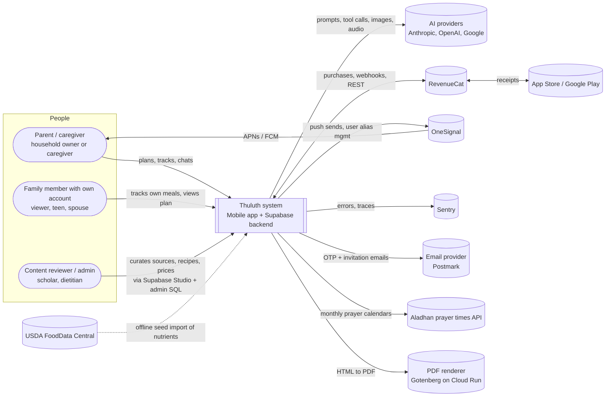
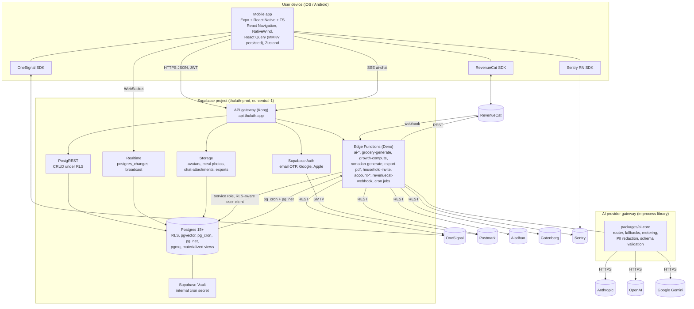
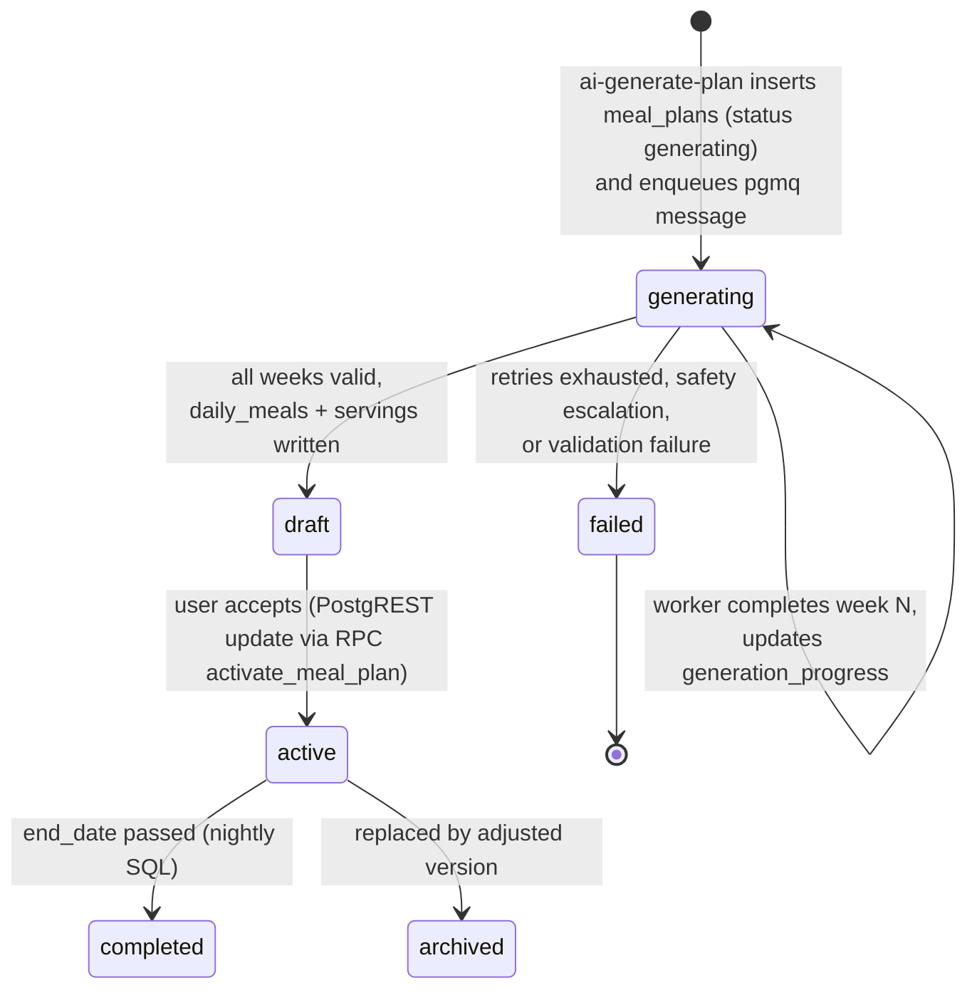
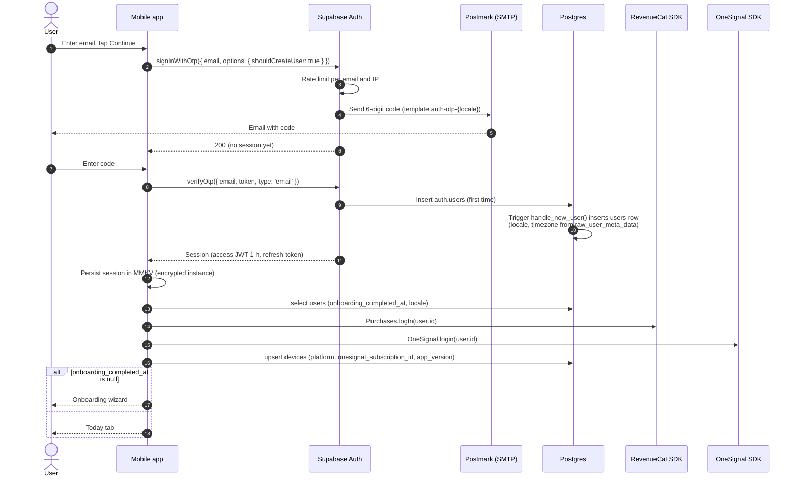
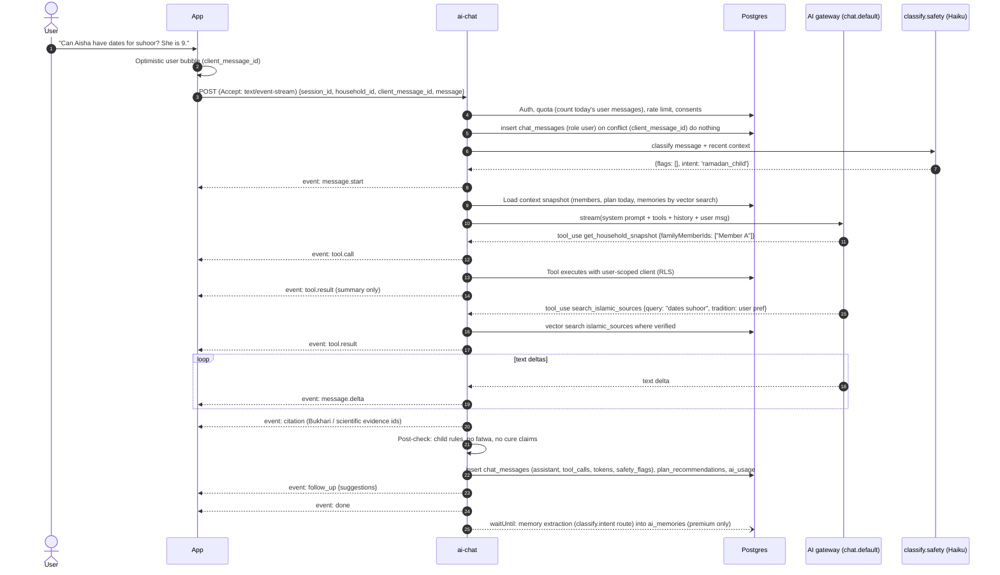
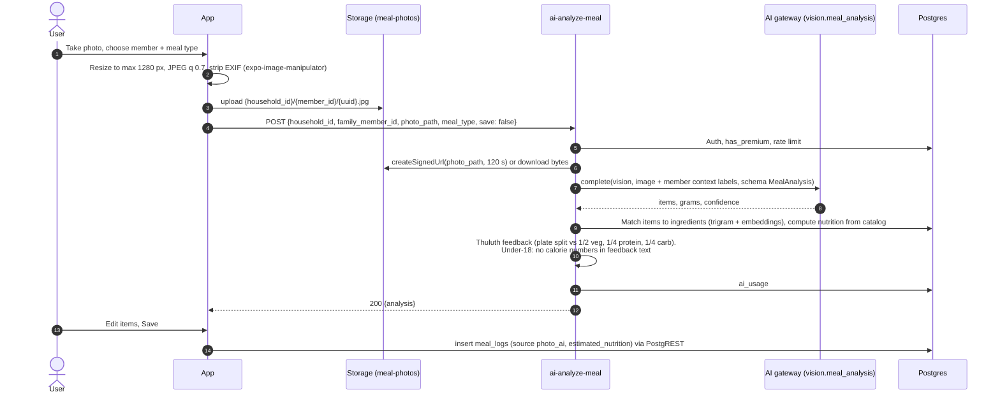
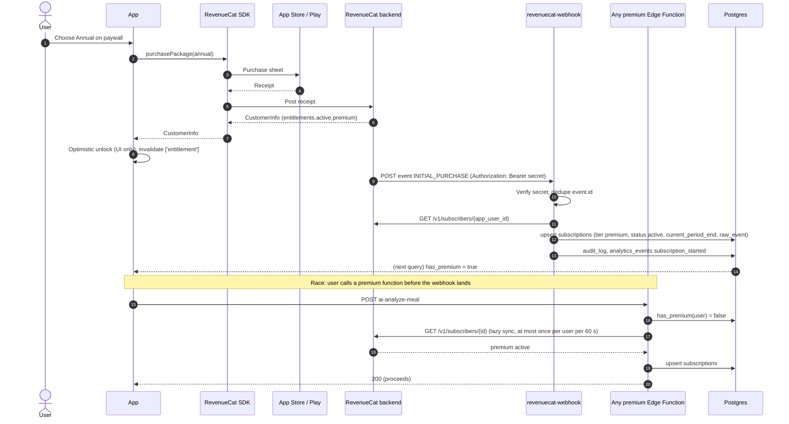
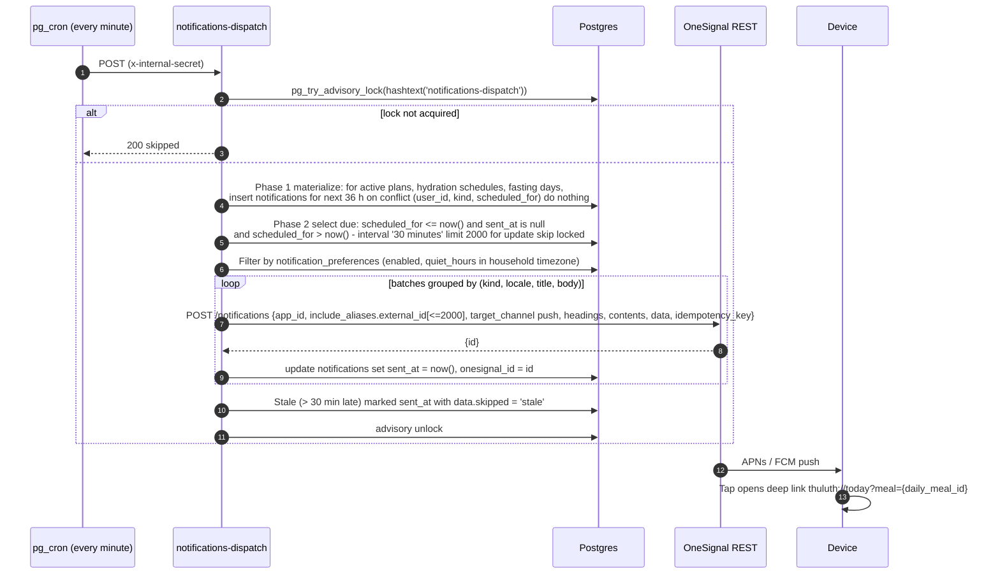

# 04 · System Architecture

> **Status:** Draft for implementation (v1 / MVP) · **Owner:** Architecture · **Deliverable:** 3. System Architecture
>
> **Related:** `00-foundations.md` (canonical names), `05-database-schema.md` (DDL, RLS), `06-api-specification.md` (contracts), `09-state-management.md` (client state), `10-supabase-structure.md` (project layout), `11-authentication.md`, `12-ai-agent-architecture.md` (prompts, tools, guardrails), `16-security-architecture.md`, `17-subscription-architecture.md`, `18-exports-and-analytics.md`, `19-deployment-architecture.md`, `20-ci-cd-pipeline.md`, `21-testing-strategy.md`.

## Table of contents

1. [Architectural goals and constraints](#1-architectural-goals-and-constraints)
2. [C4 level 1: system context](#2-c4-level-1-system-context)
3. [C4 level 2: containers](#3-c4-level-2-containers)
4. [Component catalog](#4-component-catalog)
5. [Request paths](#5-request-paths)
6. [Sequence diagrams](#6-sequence-diagrams)
7. [Offline strategy](#7-offline-strategy)
8. [Caching](#8-caching)
9. [Multi-region and data residency](#9-multi-region-and-data-residency)
10. [Scalability targets and capacity estimates](#10-scalability-targets-and-capacity-estimates)
11. [Cost model](#11-cost-model)
12. [Observability](#12-observability)
13. [Failure modes and degradation](#13-failure-modes-and-degradation)
14. [Architecture decision records](#14-architecture-decision-records)
15. [Additions beyond 00-foundations](#15-additions-beyond-00-foundations)

---

## 1. Architectural goals and constraints

| # | Goal | Architectural consequence |
|---|---|---|
| G1 | Health-adjacent family data, including children, stays private and in our control | Single Postgres of record (Supabase) with RLS on every user table; first-party analytics; AI called only server-side; PII scrubbing before any third party (Sentry, AI providers). |
| G2 | Low operational burden for a small team with agentic engineers | Managed backend (Supabase), managed builds (EAS), no Kubernetes, no self-run queues in v1. Every moving part has a hosted equivalent. |
| G3 | Works on mid-range Android phones on patchy Pakistani mobile networks | Persisted React Query cache, offline mutation queue for tracking actions, small payloads (explicit `select` lists), images via transform CDN, SSE for streaming instead of WebSockets for AI. |
| G4 | AI is swappable and auditable | Provider abstraction in `packages/ai-core`, data-driven routing in `ai_model_routes`, every call metered into `ai_usage`, prompts versioned in `prompt_templates`. |
| G5 | Safety rules cannot be bypassed by a client | Entitlements, quotas, child rules and red-flag escalation enforced in Edge Functions and database triggers; the client only reflects them. |
| G6 | Ramadan is a predictable 10x spike | Capacity plan sized for the iftar peak, cached prayer times, pre-generated Ramadan plans, rate limits per tier. |

Hard constraints from `00-foundations.md`: Expo managed workflow with React Navigation 7 (not Expo Router), Supabase (Postgres, Auth, Storage, Edge Functions, Realtime, pg_cron, pgvector), RevenueCat, OneSignal, Sentry, the Edge Function list in section 7, and the safety position in section 10.

## 2. C4 level 1: system context



External systems and why they exist:

| System | Direction | Data sent | Data classification sent out |
|---|---|---|---|
| Anthropic / OpenAI / Google | Outbound HTTPS from Edge Functions | Pseudonymised profile context (first names replaced by member labels, ages in years, conditions, allergies), message text, meal photos, voice audio | Health data; covered by provider DPAs and zero-retention settings where available (see `16-security-architecture.md`) |
| RevenueCat | SDK on device, webhook in, REST out | `app_user_id = users.id`, purchase receipts | No health data |
| OneSignal | REST out, SDK on device | `external_id = users.id`, push title/body, tags limited to locale and tier | No health data in payloads; notification bodies are generic ("Time for lunch, 1:30 PM") |
| Sentry | SDK on device and in Edge Functions | Stack traces, breadcrumbs, release, hashed user id | PII scrubbed (`beforeSend`), no request bodies |
| Postmark | SMTP (Supabase Auth) and REST (invitations) | Email address, OTP code, inviter display name | Contact data only |
| Aladhan | REST out from `ramadan-generate` | City, country, method, year/month | Location at city level only |
| USDA FDC | Offline script, never at runtime | FDC ids | None |
| Gotenberg (PDF renderer) | REST out from `export-pdf` | Rendered HTML of the export (contains plan, names) | Personal data; runs in our own GCP project in the EU, no persistence |

## 3. C4 level 2: containers



Container responsibilities:

| Container | Tech | Owns | Does not own |
|---|---|---|---|
| Mobile app | Expo SDK (pinned), RN New Architecture, TypeScript strict | Presentation, offline cache, optimistic updates, local reminders fallback, purchase UI | Any business rule that affects money, safety or entitlements |
| API gateway | Supabase Kong, custom domain `api.thuluth.app` | TLS, routing, API key check | Business auth (done by RLS and functions) |
| Supabase Auth | GoTrue | Identities, sessions, JWT (asymmetric signing keys), OTP emails | Profile data (lives in `users`) |
| PostgREST | Supabase | All CRUD on household data | Anything calling a third party |
| Realtime | Supabase Realtime | Plan generation status, shared grocery list updates | Chat streaming (SSE) |
| Storage | Supabase Storage + image transforms | Binary objects with RLS on `storage.objects` | Metadata (rows in tables) |
| Edge Functions | Deno, one folder per function in `supabase/functions/` | AI, third parties, multi-table writes, cron jobs | Simple CRUD |
| Postgres | Supabase managed Postgres 15+ | System of record, RLS, triggers, queues, analytics views | Binary data |
| AI gateway | `packages/ai-core`, bundled into functions via `supabase/functions/_shared/ai/` | Provider adapters, routing, fallbacks, retries, metering, structured output validation | Prompt content (from `prompt_templates`) and tool implementations (in `_shared/tools/`) |

## 4. Component catalog

### 4.1 Mobile app

Folder layout is defined in `07-react-native-folder-structure.md`; components in `08-component-architecture.md`; stores in `09-state-management.md`. Architecture-relevant pieces:

| Module | Path | Notes |
|---|---|---|
| Supabase client | `apps/mobile/src/lib/supabase.ts` | `createClient(url, publishableKey, { auth: { storage: mmkvAuthStorage, autoRefreshToken: true, persistSession: true, detectSessionInUrl: false } })`. `AppState` listener calls `startAutoRefresh` / `stopAutoRefresh`. |
| Edge client | `apps/mobile/src/lib/edge.ts` | `callFunction<TReq, TRes>(name, body, opts)` that adds headers (section 5.1 of `06-api-specification.md`), validates the response with the shared Zod schema and maps the error envelope to `AppError`. |
| SSE client | `apps/mobile/src/lib/sse.ts` | Uses `fetch` from `expo/fetch` (streaming `ReadableStream` body) and a line parser for `event:` / `data:` frames. Reconnect is not automatic; chat turns are idempotent by `client_message_id`. |
| Query client | `apps/mobile/src/lib/query-client.ts` | React Query v5, `persistQueryClient` with an MMKV persister, `onlineManager` wired to NetInfo, `focusManager` to AppState. |
| Mutation queue | `apps/mobile/src/lib/offline/mutation-defaults.ts` | `queryClient.setMutationDefaults` per offline-capable mutation key so paused mutations resume after a cold start (section 7). |
| Purchases | `apps/mobile/src/features/subscription/` | `Purchases.configure({ apiKey, appUserID: user.id })` after sign-in; `Purchases.logIn(user.id)` on account switch. |
| Push | `apps/mobile/src/features/notifications/` | `OneSignal.initialize(appId)`, `OneSignal.login(user.id)`; device row upserted into `devices`. |
| Telemetry | `apps/mobile/src/lib/telemetry/` | Sentry init with `beforeSend` scrubber; `track(event, props)` batching to `analytics_events` (flush every 30 s or 20 events, persisted when offline). |

### 4.2 Supabase

| Service | Configuration |
|---|---|
| Auth | Email OTP (6 digits, 10 minute expiry, custom SMTP via Postmark), Google and Apple via native ID token (`signInWithIdToken`). Asymmetric JWT signing keys; Edge Functions verify with `supabase.auth.getClaims()` against JWKS. Details in `11-authentication.md`. |
| PostgREST | Exposed schema `public` only. `max_rows = 1000`. Every table has RLS enabled and forced. `pg_graphql` disabled. |
| Realtime | `postgres_changes` enabled only on publication `supabase_realtime` tables: `meal_plans`, `shopping_items`, `grocery_lists`, `exports`. RLS applies to change events. Broadcast used for nothing in v1. |
| Storage | Buckets (Addition beyond 00-foundations, names): `avatars` (private), `meal-photos` (private), `chat-attachments` (private), `exports` (private), `public-catalog` (public, recipe images). Object paths start with `{household_id}/` so storage RLS is `is_household_member(((storage.foldername(name))[1])::uuid)`. Image transforms for thumbnails. Full policy text in `10-supabase-structure.md`. |
| Edge Functions | All 17 functions from `00-foundations.md` section 7. `verify_jwt = false` in `supabase/config.toml` for every function; authentication is done in code by `_shared/auth.ts` (user JWT via `getClaims`, internal calls via `x-internal-secret`, webhook via shared secret). This keeps one consistent auth path and works with publishable and secret API keys. |
| pg_cron | Jobs listed in 4.2.1. Each calls an Edge Function through `pg_net` with the internal secret read from Vault. |
| pgmq | Queue `plan_generation` (Addition beyond 00-foundations) for durable async plan jobs. |
| pgvector | `ai_memories.embedding` and `islamic_sources.embedding`, HNSW indexes (see `05-database-schema.md`). |

#### 4.2.1 Scheduled jobs (pg_cron)

| Job name | Schedule (UTC) | Target | Purpose |
|---|---|---|---|
| `notifications-dispatch-every-minute` | `* * * * *` | `notifications-dispatch` | Materialize the rolling reminder window and send due notifications |
| `plan-generation-sweeper` | `* * * * *` | `ai-generate-plan` internal worker route | Pick up visible messages in `plan_generation` that no worker is processing (crash recovery) |
| `prices-refresh-nightly` | `0 21 * * *` (02:00 PKT) | `prices-refresh` | Recompute price profiles from observations |
| `analytics-rollup-hourly` | `5 * * * *` | `analytics-rollup` | Refresh hourly materialized views |
| `analytics-rollup-nightly` | `30 22 * * *` | `analytics-rollup` with `{"scope":"daily"}` | Refresh daily views, create next month partition of `analytics_events`, detach partitions older than 13 months |
| `account-delete-executor` | `0 * * * *` | `account-delete` internal route | Execute erasures whose grace period has ended |
| `exports-purge-expired` | `25 * * * *` | `export-pdf` internal action `purge_expired` | Delete objects of `exports` past `expires_at` through the Storage API and set `status = 'expired'` |
| `idempotency-gc` | `0 3 * * *` | SQL only | Delete expired `idempotency_keys` and `rate_limit_buckets` rows |

```sql
-- Example: cron calls an Edge Function with the internal secret from Vault
select cron.schedule(
  'notifications-dispatch-every-minute',
  '* * * * *',
  $$
  select net.http_post(
    url     := 'https://api.thuluth.app/functions/v1/notifications-dispatch',
    headers := jsonb_build_object(
      'content-type', 'application/json',
      'x-internal-secret', (select decrypted_secret from vault.decrypted_secrets where name = 'internal_cron_secret')
    ),
    body    := jsonb_build_object('triggered_at', now()),
    timeout_milliseconds := 55000
  );
  $$
);
```

### 4.3 AI provider gateway

The gateway is a library, not a network service. It is compiled into each AI Edge Function from `packages/ai-core` (mirrored into `supabase/functions/_shared/ai/` by a build step described in `20-ci-cd-pipeline.md`). Full agent design lives in `12-ai-agent-architecture.md`; this section fixes the runtime contract.

```ts
// packages/ai-core/src/types.ts
export type RouteKey =
  | 'chat.default' | 'plan.generate' | 'plan.adjust' | 'vision.meal_analysis'
  | 'classify.safety' | 'classify.intent' | 'speech.transcribe' | 'embed.knowledge';

export type ProviderId = 'anthropic' | 'openai' | 'google';

export interface RouteConfig {            // one row of ai_model_routes
  route_key: RouteKey;
  provider: ProviderId;
  model: string;
  params: {
    max_tokens?: number;
    effort?: 'low' | 'medium' | 'high';
    timeout_ms?: number;                  // per attempt, default 30000 (plan.generate: 120000)
    price_in_usd_per_mtok?: number;       // used for cost_usd_micros
    price_out_usd_per_mtok?: number;
    price_cache_read_usd_per_mtok?: number;
  };
  priority: number;                       // 1 = primary, 2 = first fallback, ...
  enabled: boolean;
}

export interface AiCallContext {
  userId: string;
  householdId: string;
  routeKey: RouteKey;
  requestId: string;
  promptKey: string;                      // prompt_templates.key
  promptVersion: number;
  signal?: AbortSignal;
}

export interface AiGateway {
  complete<T>(ctx: AiCallContext, req: CompletionRequest, schema?: import('zod').ZodType<T>): Promise<CompletionResult<T>>;
  stream(ctx: AiCallContext, req: CompletionRequest): AsyncIterable<StreamEvent>;   // normalized deltas + tool calls
  transcribe(ctx: AiCallContext, audio: Uint8Array, mime: string): Promise<{ text: string; language: string }>;
  embed(ctx: AiCallContext, texts: string[]): Promise<number[][]>;                 // returns 1536-d vectors
}
```

Gateway behaviour, in order, for every call:

1. Load enabled routes for `routeKey` ordered by `priority` (cached per isolate for 60 s).
2. Redact: replace member names with labels (`Member A`), drop emails and phone numbers, round dates of birth to age in years and months.
3. Call the primary with its timeout. Retry once on 429 / 5xx / network error with jittered backoff (250 to 750 ms), then move to the next route. Never fall back after the first streamed token of a chat turn has been sent to the client (the turn errors instead, see section 13).
4. Validate structured output with the Zod schema; on failure, one repair attempt on the same route ("return valid JSON for this schema"), then fallback.
5. Write one `ai_usage` row per attempt (including failures, with `tokens_out = 0`) with `cost_usd_micros` computed from route params.
6. Emit a Sentry span `ai.call` with `route_key`, `provider`, `model`, `latency_ms`, `fallback_depth`.

### 4.4 Third parties

| Component | Integration point | Notes |
|---|---|---|
| RevenueCat | Mobile SDK; webhook to `revenuecat-webhook`; REST `GET /v1/subscribers/{app_user_id}` from `_shared/entitlements.ts` | Server truth is `subscriptions`; `has_premium(user_id)` reads it. Lazy re-sync described in 6.5. |
| OneSignal | Mobile SDK; REST `POST https://api.onesignal.com/notifications` from `notifications-dispatch`; user delete from `account-delete` | Separate apps for dev and prod (`Thuluth Dev`, `Thuluth Prod`); staging uses `Thuluth Dev`. |
| Sentry | `@sentry/react-native` (Expo config plugin), `npm:@sentry/deno` in functions | Projects `thuluth-mobile`, `thuluth-edge`. |
| Postmark | Supabase Auth custom SMTP for OTP; REST API for `household-invite` and `account-export` ready emails | Message stream `outbound` for transactional mail only; no marketing in v1. |
| Aladhan | `GET https://api.aladhan.com/v1/calendarByCity/{year}/{month}?city=&country=&method=&school=` | Called by `ramadan-generate`; results cached in `prayer_times_cache` (Addition beyond 00-foundations). Method default per tradition: Sunni Pakistan `method=1` (University of Islamic Sciences, Karachi) with `school=1` (Hanafi Asr); Shia `method=0` (Shia Ithna Ashari, Leva Institute, Qum). For Shia users iftar uses `Maghrib`, not `Sunset`. Users can override in Ramadan settings. |
| USDA FoodData Central | `scripts/seed/fdc-import.ts` (run by an engineer or a manual GitHub Action) calling `POST https://api.nal.usda.gov/fdc/v1/foods` | Populates per-100 g nutrient columns of `ingredients` where `fdc_id` is set. Never called at runtime. Pakistani foods without FDC entries are seeded from curated tables and marked in `ingredients` metadata. |
| Gotenberg | `POST {GOTENBERG_URL}/forms/chromium/convert/html` from `export-pdf` | Chromium rendering is needed for correct Urdu Nastaliq shaping and Arabic scripture fonts. Runs as a private Cloud Run service in `europe-west3`, authenticated with a Google-signed ID token or a static bearer secret. Addition beyond 00-foundations (see section 15). |

## 5. Request paths

There are four request paths. Choosing the right one is a code review checkpoint.

| Path | When | Auth | Example |
|---|---|---|---|
| A. CRUD via PostgREST + RLS | Single-table or parent/child reads and writes on household data; no third party; no cross-household logic | User JWT; RLS `is_household_member(household_id)` | Log a glass of water, tick a shopping item, read today's meals |
| B. Synchronous Edge Function | Calls AI or a third party, or writes many tables atomically, and completes in under about 20 s | User JWT verified in function; entitlement and quota checks; user-scoped client for reads, service role for writes after checks | `ai-intake-assess`, `ai-analyze-meal`, `grocery-generate`, `growth-compute`, `export-pdf` |
| C. Async job with status polling + Realtime | Work that can exceed 20 s or must survive a client disconnect | Same as B for the enqueue call; worker runs with internal secret | `ai-generate-plan`, large `ai-adjust-plan`, `ramadan-generate`, `account-export` |
| D. Webhooks and cron | Third party or scheduler initiated | Shared secret (RevenueCat), internal secret (cron) | `revenuecat-webhook`, `notifications-dispatch`, `prices-refresh`, `analytics-rollup` |

Streaming chat (`ai-chat`) is path B with an SSE response.

### 5.1 Path A: CRUD via RLS

```mermaid
flowchart LR
    A[Component] --> H[useXxx hook<br/>React Query]
    H -->|supabase-js select / insert / update| G[Gateway]
    G --> PR[PostgREST]
    PR -->|SET request.jwt.claims| PG[(Postgres RLS)]
    PG -->|rows visible to auth.uid()| PR
    PR --> H
    H -->|cache, persist to MMKV| A
```

Rules:
- Always pass `household_id` in filters and inserts; RLS rejects rows without membership.
- Always use explicit `select` column lists; never `select('*')` in app code (lint rule `thuluth/no-select-star`).
- Inserts generate the `id` on the client (`crypto.randomUUID()` via `expo-crypto`) so retries are idempotent with `upsert(..., { onConflict: 'id', ignoreDuplicates: true })`.
- Writes that need counts or limits (household count, member count per tier) are enforced by insert triggers that raise `P0001` with message `LIMIT_REACHED:family_members`; the edge client maps it to the `LIMIT_REACHED` error code.

### 5.2 Path B: AI via Edge Functions

Every AI function follows the same pipeline, implemented once in `supabase/functions/_shared/pipeline.ts`:

```ts
export async function handleAiRequest<TReq, TRes>(req: Request, spec: {
  name: string;
  schema: z.ZodType<TReq>;
  requirePremium?: boolean | ((body: TReq) => boolean);
  rateLimit: RateLimitSpec;
  idempotent?: boolean;
  consents: Array<'ai_processing' | 'health_data' | 'child_data'>;
  run: (ctx: FnContext, body: TReq) => Promise<TRes>;
}): Promise<Response>;
```

1. `requireUser(req)` → claims (`sub`, `aal`), request id.
2. Parse and validate JSON with the Zod schema → `VALIDATION_FAILED` on error.
3. Check `X-App-Version` against `feature_flags['app.min_supported_version']` → `UPGRADE_REQUIRED`.
4. Check consents in `consents` (not withdrawn) → `CONSENT_REQUIRED`. `child_data` is required only when the request touches a member under 18.
5. Check household membership with the user-scoped client (`select id from households where id = $1`, RLS returns zero rows if not a member) → `FORBIDDEN`.
6. Entitlement (`has_premium`) → `PREMIUM_REQUIRED`; daily quota → `QUOTA_EXCEEDED`; burst rate limit → `RATE_LIMITED`.
7. Idempotency lookup (`idempotency_keys`) → replay stored response or `IDEMPOTENCY_IN_PROGRESS`.
8. Feature flag kill switch (`ai.chat.enabled`, `ai.vision.enabled`, ...) → `AI_UNAVAILABLE`.
9. `run()`: load context, call `classify.safety`, call the main route, validate, apply guardrails (child rules), write rows in one transaction via an RPC where possible.
10. Store idempotent response, write `audit_log` for writes, return.

### 5.3 Path C: async plan generation job pattern



Mechanics:
1. Enqueue call returns `202` with `meal_plan_id` in under 1 s.
2. The same request schedules the worker with `EdgeRuntime.waitUntil(kickWorker(meal_plan_id))`, which POSTs to `ai-generate-plan` worker route (`/functions/v1/ai-generate-plan/worker`, internal secret). This starts a fresh invocation with its own wall-clock budget.
3. The worker reads the message with `pgmq.read('plan_generation', vt => 300, qty => 1)`, generates one week per model call (keeps each call under about 90 s), writes rows for that week, updates `meal_plans.generation_progress`, and re-kicks itself for the next week if the remaining wall-clock budget is under 120 s.
4. On completion it sets `status = 'draft'`, deletes the queue message, writes `ai_usage`, and inserts a `notifications` row (`kind = 'plan_ready'`) for users not currently connected.
5. If a worker crashes, the message becomes visible again after the 300 s visibility timeout and `plan-generation-sweeper` (cron, every minute) kicks a worker. `read_ct > 3` marks the plan `failed` with `generation_progress.error_code = 'AI_UNAVAILABLE'`.
6. Client: subscribes on Realtime channel `plan:{meal_plan_id}` to `postgres_changes` on `meal_plans` with filter `id=eq.{meal_plan_id}` and also polls `GET meal_plans?id=eq.{id}&select=status,generation_progress` with backoff (2 s, 4 s, 8 s, then every 10 s, max 10 min). Polling covers Realtime disconnects on mobile networks. Whichever sees a terminal status first wins.

### 5.4 Webhooks

| Webhook | Verification | Processing | Idempotency |
|---|---|---|---|
| RevenueCat → `revenuecat-webhook` | `Authorization: Bearer {REVENUECAT_WEBHOOK_SECRET}` constant-time compare | Fetch canonical subscriber from RevenueCat REST, upsert `subscriptions`, invalidate entitlement cache | `idempotency_keys` with scope `revenuecat`, key `event.id` |
| Cron → functions | `x-internal-secret` constant-time compare | Function specific | Each job is idempotent by design (status columns, unique keys) |

OneSignal is outbound only in v1 (no inbound webhooks). Postmark bounce webhooks are Phase 2.

## 6. Sequence diagrams

### 6.1 Sign-in with email OTP



Google and Apple use `signInWithIdToken` with the native credential; the rest of the flow (steps 9 onwards) is identical. See `11-authentication.md`.

### 6.2 Plan generation (async)

```mermaid
sequenceDiagram
    autonumber
    actor U as Parent
    participant App
    participant EF as ai-generate-plan
    participant W as ai-generate-plan/worker
    participant PG as Postgres
    participant Q as pgmq plan_generation
    participant AI as AI gateway (plan.generate)
    participant RT as Realtime

    U->>App: Generate plan (start date, weeks, budget)
    App->>EF: POST {household_id, kind, start_date, week_count} + Idempotency-Key
    EF->>PG: Auth, consents, membership, has_premium, active plan count
    EF->>PG: insert meal_plans (status generating, version 1)
    EF->>Q: pgmq.send(plan_generation, {meal_plan_id, attempt: 0})
    EF-->>App: 202 {meal_plan_id, status: generating}
    EF--)W: waitUntil: POST /worker (x-internal-secret)
    App->>RT: subscribe meal_plans id=eq.{meal_plan_id}
    App->>App: Start backoff polling
    W->>Q: pgmq.read(vt 300)
    W->>PG: Load context: members, assessments, allergies, sensory profiles,<br/>budget, candidate meals (pre-filtered by halal, allergens, region, season, cost tier)
    W->>AI: classify.safety on profile signals
    alt red flag (e.g. faltering growth, insulin + fasting plan)
        W->>PG: meal_plans.status = failed, generation_progress.error_code = SAFETY_ESCALATION
        PG-->>RT: change event
        RT-->>App: status failed + escalation
    else safe
        loop each week
            W->>AI: complete(plan.generate, week N, schema WeekPlan)
            AI-->>W: WeekPlan JSON (meal ids, portions per member, adaptations)
            W->>W: Validate: Zod, allergens, halal, child rules (no restriction for under 18),<br/>plate split, budget estimate
            W->>PG: rpc write_plan_week(meal_plan_id, week json) inserts daily_meals, daily_meal_servings, plan_recommendations
            W->>PG: update generation_progress {completed_weeks: N}
            PG-->>RT: change event
            RT-->>App: progress N / total
        end
        W->>PG: status = draft; rationale; ai_usage rows
        W->>Q: pgmq.delete
        PG-->>RT: change event
        RT-->>App: status draft
    end
    App-->>U: Review plan, Accept
    App->>PG: rpc activate_meal_plan(meal_plan_id)
```

### 6.3 Chat streaming with tool calls



Notes:
- The safety classifier and the main model call run concurrently; the first `message.delta` is held until the classifier returns (typically under 600 ms). If the classifier flags an escalation, the main stream is aborted and the turn returns a fixed escalation message from `prompt_templates` plus a `safety` event.
- Tool execution happens inside the function with the user's JWT so RLS bounds what the agent can see. Write tools (for example `log_hydration`) require an explicit user confirmation chip in the UI and are executed by the client through PostgREST, not by the agent. See `12-ai-agent-architecture.md`.

### 6.4 Photo meal analysis



### 6.5 Purchase and entitlement sync



### 6.6 Push reminder dispatch



### 6.7 PDF export

```mermaid
sequenceDiagram
    autonumber
    actor U as User
    participant App
    participant EF as export-pdf
    participant PG as Postgres
    participant GOT as Gotenberg (Cloud Run)
    participant STO as Storage (exports)

    U->>App: Export this week's plan (Urdu, A4)
    App->>EF: POST {household_id, kind: meal_plan, params, locale: ur, paper: A4} + Idempotency-Key
    EF->>PG: Auth, has_premium, rate limit
    EF->>PG: insert exports (status processing)
    EF->>PG: Load plan, meals, portions, recipes, recommendations (user-scoped client)
    EF->>EF: Render HTML template exports/meal-plan.{locale}.html<br/>(fonts: Noto Nastaliq Urdu, Amiri; dir=rtl for ur)
    EF->>GOT: POST /forms/chromium/convert/html (index.html, fonts, paper A4)
    GOT-->>EF: application/pdf bytes
    EF->>STO: upload exports/{household_id}/{export_id}.pdf
    EF->>PG: update exports (status ready, storage_path, expires_at now()+7 days)
    EF->>STO: createSignedUrl(path, 86400)
    EF-->>App: 200 {export_id, url, expires_at}
    App->>App: expo-sharing / expo-print preview
```

If rendering takes longer than 20 s the function returns `202 {export_id, status: processing}` and finishes in `waitUntil`; the client listens on Realtime `exports` for `status = ready`. `exports.status` is `processing`, `ready`, `failed` or `expired`. The signed URL lives 24 hours and the object 7 days; a fresh URL comes from `GET export-pdf?export_id=` (06 §4.10).

## 7. Offline strategy

Offline scope in MVP: **read everything recently viewed, and write tracking actions**. AI, plan generation, purchases and exports require a connection and show an offline banner with a retry action.

### 7.1 Read cache

- React Query cache persisted to MMKV with `persistQueryClient`, `maxAge = 7 days`, `buster = {app version}+{schema version}`.
- Only queries with `meta: { persist: true }` are persisted (via `dehydrateOptions.shouldDehydrateQuery`). Persisted: today and next 7 days of `daily_meals` with servings, active `meal_plans`, open `grocery_lists` with items, `family_members`, `hydration_targets`, last 14 days of tracking logs, recipes referenced by the persisted plan, user and household rows, `feature_flags`, entitlement snapshot.
- Not persisted: chat history beyond the last session's 50 messages, analytics, exports, anything from catalog search.
- Images: `expo-image` with disk cache policy `memory-disk` for recipe images and avatars.

### 7.2 Mutation queue

Offline-capable mutations are registered once with `queryClient.setMutationDefaults(key, { mutationFn, onMutate, onError, onSettled, retry })` so that paused mutations deserialized from MMKV after a cold start can resume (React Query requires the function to be known by key).

| Mutation key | Table | Write type | Conflict class |
|---|---|---|---|
| `['hydration','log']` | `hydration_logs` | insert (client uuid) | Append-only |
| `['meal-log','create']` | `meal_logs` (manual only) | insert | Append-only |
| `['serving','status']` | `daily_meal_servings` | update `status`, `acceptance`, `logged_at` | Field-level LWW |
| `['fasting','log']` | `fasting_logs` | upsert by (`family_member_id`, `fast_date`, `kind`) | Field-level LWW |
| `['shopping-item','toggle']` | `shopping_items` | update `is_checked`, `actual_minor` | Field-level LWW, check wins ties |
| `['shopping-item','add']` | `shopping_items` | insert | Append-only |
| `['exposure','log']` | `food_exposures` | insert | Append-only |
| `['journal','upsert']` | `nutrition_journal` | upsert by (`family_member_id`, `journal_date`) | Field-level LWW |
| `['growth','measure']` | `growth_tracking` | insert raw values; `growth-compute` runs when back online | Append-only, computed later |
| `['weight','log']` | `weight_tracking` | insert | Append-only |

Queue rules:
- Mutations run serially per key scope (`scope: { id: 'offline-writes' }`) to preserve order.
- Retry: exponential backoff 1 s to 60 s, unlimited while offline, max 5 attempts once online; then the item moves to a "Couldn't sync" list in Settings with retry and discard.
- Each mutation carries `client_updated_at` in memory (not a column) to drive the merge rule below.

### 7.3 Conflict rules

1. **Append-only tables**: no conflicts. Insert with the client-generated `id` and `ignoreDuplicates: true`; replays are harmless.
2. **Field-level last-writer-wins** for updates: the client sends only changed fields with a precondition on the `updated_at` it last saw:
   ```ts
   const { data } = await supabase.from('daily_meal_servings')
     .update({ status: 'eaten', logged_at: new Date().toISOString() })
     .eq('id', servingId).eq('updated_at', knownUpdatedAt)
     .select('id, updated_at');
   if (data?.length === 0) await mergeAndRetry(servingId, changedFields);
   ```
   `mergeAndRetry` refetches the row. If the server row changed **different** fields, the client re-applies its fields without the precondition. If it changed the **same** field, the most recent intent wins by comparing the server `updated_at` with the mutation's `client_updated_at`; the losing side is shown as a quiet toast ("Updated by Fatima on another phone").
3. **Shopping item ties**: when both sides changed `is_checked` within 10 s, `true` wins (shopping together should never un-tick an item someone just picked up).
4. **Deletes win**: a soft-deleted row (`deleted_at` set) is never resurrected by an offline update; the mutation is dropped and the cache entry removed.
5. **Server-computed fields** (`growth_tracking.*_z`, `*_percentile`, `bmi`) are never written by the client.
6. **Plan versions**: if a queued serving update targets a `daily_meal` whose plan was archived by an adjustment while offline, the write still lands (history is kept) and the UI shows it on the archived version.

## 8. Caching

| Layer | What | TTL / invalidation |
|---|---|---|
| Client React Query | Household data | `staleTime` 30 s for today screens, 5 min for profiles, 24 h for catalog (recipes, ingredients, islamic sources) keyed by `catalog_version` flag value; invalidated by mutations and Realtime events |
| Client MMKV | Persisted queries, auth session, Zustand stores | See 7.1 |
| CDN | `public-catalog` bucket images, image transforms | `cache-control: public, max-age=31536000, immutable` (content-hashed file names) |
| Signed URLs | Private images and exports | Signed for 1 h; client caches URL for 50 min |
| Edge isolate memory | `ai_model_routes`, `prompt_templates` (active), `feature_flags`, entitlement lookups | 60 s; isolates are short-lived so correctness never depends on it |
| Postgres | `prayer_times_cache` (per city, method, month), materialized analytics views, `recipes.per_serving_nutrition` (computed column refreshed by trigger) | Prayer times kept for 18 months; views refreshed by `analytics-rollup` |
| AI provider prompt cache | Stable system prompt + tool definitions + household context block placed before volatile turn content | Provider-managed (5 min default). Prompt layout rule in `12-ai-agent-architecture.md`: static prefix, then household snapshot, then history, then the new message |
| RevenueCat | Entitlements lazily synced | 60 s per user lazy re-sync throttle |

## 9. Multi-region and data residency

### 9.1 Decision for v1

**One production region: `eu-central-1` (Frankfurt).** Rationale:

- Supabase has no region in Pakistan or the GCC that suits v1 (closest options are Mumbai and the EU). EU hosting gives GDPR and UK GDPR alignment by default for the UK and Europe markets in Phase 2, and the UK has an adequacy decision for the EU.
- Measured round-trip from Lahore to Frankfurt is typically 120 to 160 ms. With React Query caching and optimistic updates this is acceptable; AI latency dominates anyway.
- Pakistan: the Personal Data Protection Bill has gone through several drafts with clauses on cross-border transfer and "critical personal data". As of writing, health data processed with consent and a privacy notice disclosing transfer is the working assumption. **Legal review is required before launch and on any enactment**; the migration path in 9.3 is the contingency.
- AI providers: request EU or zero-data-retention processing where offered (Anthropic `inference_geo` and org retention settings, OpenAI and Google data controls). Configured in route `params`, see `12-ai-agent-architecture.md` and `16-security-architecture.md`.

### 9.2 Edge Function placement

Edge Functions default to the region nearest the caller. All functions that touch Postgres more than once per request are pinned to the database region by the client sending `x-region: eu-central-1` (set in `apps/mobile/src/lib/edge.ts`). This avoids a 150 ms round trip per query from a Mumbai edge isolate to Frankfurt.

### 9.3 Residency roadmap (Phase 2)

| Trigger | Design |
|---|---|
| A market requires in-country storage (for example a Pakistani law requiring local copies of health data, or GCC health data rules) | Regional "cell": a separate Supabase project per residency zone (`thuluth-prod-eu`, `thuluth-prod-me`), same migrations and functions. `households` are homed in one cell. A small global directory (email hash → cell) in the EU project routes sign-in. No cross-cell joins; catalog data is replicated by the seed pipeline. |
| GCC launch latency | Read replica in `me-central-1` only if Supabase offers it there; otherwise accept EU latency. |

### 9.4 GDPR and UK GDPR obligations that shape architecture

| Obligation | Implementation |
|---|---|
| Lawful basis and explicit consent for health data (Art. 9) and children's data | `consents` rows (`health_data`, `child_data`, `ai_processing`), checked in Edge Functions before AI processing |
| Right of access and portability | `account-export` (JSON + PDFs zip; step-up re-auth; download link and object live 24 hours) |
| Right to erasure | `account-delete` (step-up re-auth, `REAUTH_REQUIRED`) with a 30-day cancellable grace (FR-SET-05; immediate only for an age-gate decline), then hard delete across tables, storage, RevenueCat subscriber, OneSignal user, Sentry user (by hashed id) |
| Data minimisation to processors | Gateway redaction (4.3), no health data in push payloads or analytics props |
| Records of processing and DPAs | Listed in `16-security-architecture.md` |
| Breach notification within 72 h | Incident runbook in `19-deployment-architecture.md` |

## 10. Scalability targets and capacity estimates

### 10.1 Targets (MVP launch to 12 months)

| Metric | Target |
|---|---|
| Monthly active users | 100,000 |
| Daily active users | 35,000 (35 percent DAU/MAU) |
| Households | 70,000 (average 1.4 app users per household) |
| Family members | 280,000 (average 4 per household) |
| Premium share of MAU | 5 percent (5,000) |
| Ramadan peak multiplier on API traffic | 10x at iftar window (about 18:00 to 19:30 local) |

### 10.2 Service level objectives

| SLO | Objective | Measurement |
|---|---|---|
| API availability (PostgREST + functions, non-AI) | 99.9 percent monthly | Synthetic checks every minute from 2 locations + Sentry error rate |
| PostgREST read latency | p95 < 300 ms from Pakistan | Sentry performance spans |
| Chat time to first token | p95 < 2.5 s | `ai-chat` span `ttft_ms` |
| Plan generation (1 week, 4 members) | p95 < 90 s to `draft` | `meal_plans` timestamps |
| Photo analysis | p95 < 12 s | Function span |
| Crash-free sessions | > 99.5 percent | Sentry release health |
| Push reminder delay | p95 < 2 min after `scheduled_for` | `sent_at - scheduled_for` |

### 10.3 Load estimate

| Flow | Assumption | Daily volume | Peak rate |
|---|---|---|---|
| PostgREST calls | 3 sessions per DAU, 25 calls per session | 2.6 M | Average 30 rps; normal peak 120 rps; Ramadan iftar 300 rps |
| Tracking writes | 15 per DAU | 525 k | 60 wps peak |
| Chat messages (user turns) | Free MAU 10 per month, premium 4 per day | 32 k free + 20 k premium = 52 k | 40 concurrent streams normal, 150 at Ramadan peak |
| Photo analyses | Premium 4 per month | 670 | under 1 rps |
| Plan generations | 25 percent of households weekly (mostly template personalization on free) | 2,500 per day | 50 concurrent workers at Sunday evening peak |
| Push notifications | 4 per DAU | 140 k | 2,000 per minute at meal times |
| `analytics_events` rows | 30 per DAU | 1.05 M | Batched inserts, 20 events per request |

### 10.4 Storage estimate (12 months)

| Data | Size estimate | Notes |
|---|---|---|
| `analytics_events` | 1 M rows/day × 300 B ≈ 9 GB/month | Monthly partitions; raw kept 13 months; older partitions detached and exported to Storage as compressed CSV |
| `chat_messages` | 100 k rows/day × 2 KB ≈ 6 GB/month | Keep 24 months; summary in `chat_sessions.context_snapshot` |
| Plans (`daily_meals`, `daily_meal_servings`) | 4.5 M serving rows/week ≈ 1 GB/month with indexes | |
| Tracking logs | ≈ 0.5 GB/month | |
| Embeddings | `islamic_sources` (≈ 20 k × 6 KB) + `ai_memories` (≈ 500 k × 6 KB) ≈ 3 GB | 1536-d float4 |
| Storage objects | Meal photos 100 KB × 20 k/month, exports 300 KB × 15 k/month ≈ 6.5 GB/month | Exports expire after 7 days; meal photos kept until log deleted |
| **Database total at month 12** | ≈ 120 to 150 GB | Requires Supabase compute XL or 2XL and disk autoscaling |

### 10.5 Scaling levers in order

1. Query hygiene: explicit selects, composite indexes beginning with `household_id`, `explain analyze` gate in review for new queries (see `05-database-schema.md`).
2. Supavisor transaction pooling for Edge Functions (`?pgbouncer=true` connection string; never session-level state in functions).
3. Compute upgrade (Large → XL → 2XL), which is a few minutes of restart and is scheduled outside Pakistani evening hours.
4. Read replica for analytics and catalog search; point `analytics-rollup` and catalog-only RPCs at it.
5. Move `analytics_events` raw ingestion out of the primary (Phase 2: separate Supabase project or an object-store pipeline).
6. Regional cells (9.3).

## 11. Cost model

### 11.1 AI unit costs

Prices are list prices per million tokens at time of writing and are stored per route in `ai_model_routes.params` so `ai_usage.cost_usd_micros` stays accurate when prices change. **Verify against provider pricing pages before budgeting.**

| Route | Model | Input $/MTok | Output $/MTok | Cache read $/MTok |
|---|---|---|---|---|
| `chat.default`, `plan.adjust`, `vision.meal_analysis` | `claude-sonnet-5-5` | 2.00 | 10.00 | 0.20 |
| `plan.generate` | `claude-opus-5-5` | 4.00 | 20.00 | 0.20 |
| `classify.safety`, `classify.intent` | `claude-haiku-4-5-20251001` | 1.00 | 5.00 | 0.10 |
| `speech.transcribe` | OpenAI transcription | per audio minute, about $0.006 | | |
| `embed.knowledge` | `text-embedding-3-large` | about 0.13 | | |

Per-operation estimates (thinking tokens billed as output):

| Operation | Token profile | Est. cost |
|---|---|---|
| Chat turn (Sonnet, effort low) | 9 k input of which 7 k cache read; 2 k fresh; 600 output incl. thinking; plus Haiku safety call 1.5 k in / 60 out | ≈ $0.014 |
| Chat turn with tool calls (2 round trips) | ≈ 1.6x the above | ≈ $0.022 |
| Photo meal analysis | 1.6 k image tokens + 3 k context, 800 output | ≈ $0.018 |
| Voice note (45 s) | transcription | ≈ $0.005 |
| Intake assessment (household of 4) | 12 k in, 3 k out on Sonnet | ≈ $0.054 |
| Plan generation, 1 week, 4 members (Opus, effort medium, model chooses from pre-filtered candidate meal ids rather than writing recipes) | 25 k in, 12 k out | ≈ $0.34 |
| Plan generation, 4 weeks | 4 × above, with shared context cached | ≈ $1.25 |
| Plan adjustment (Sonnet) | 15 k in, 4 k out | ≈ $0.07 |
| Free-tier template personalization (Sonnet, effort low, swaps only) | 8 k in, 1.5 k out | ≈ $0.03 |

### 11.2 AI cost per user per month

| Segment | Usage assumption | AI cost / user / month |
|---|---|---|
| Free MAU | 10 chat turns, 1 template personalization, intake amortized ($0.02) | ≈ $0.19 |
| Premium MAU | 120 chat turns (30 percent with tools), 4 photo analyses, 10 voice notes, one 4-week plan, 3 adjustments, memory extraction ($0.05) | ≈ $3.60 |

At 100 k MAU (95 k free, 5 k premium): **≈ $18 k free + $18 k premium ≈ $36 k per month** baseline.

This baseline is too high relative to plausible revenue (5 k premium at a blended net of about $4 per month is about $20 k). The architecture therefore ships with these cost controls, all data-driven:

| Control | Mechanism | Expected effect |
|---|---|---|
| Per-user monthly AI budget | `ai_usage` sum checked in the pipeline: free $0.15, premium $5.00 soft cap (beyond it, chat moves to a cheaper route and a fair-use notice is shown) | Caps tail users |
| Cheaper free chat route | Optional route key `chat.free` → `claude-haiku-4-5-20251001` (Addition beyond 00-foundations, disabled by default; product decision) | Free chat cost ≈ $0.005/turn |
| Prompt caching discipline | Stable prefix ≥ 70 percent of input | Already assumed above; regressions alarm when cache-read share < 50 percent |
| Candidate pre-filtering | SQL narrows meals to about 60 candidates per slot before the model call | Keeps plan input under 25 k |
| Batch API for non-interactive work | Nightly periodic assessments and recipe enrichment via provider batch endpoints (50 percent discount) | Admin and background workloads |

Target after controls: free ≈ $0.08, premium ≈ $2.80 → **≈ $21.6 k per month at 100 k MAU**. Pricing and conversion assumptions are owned by `17-subscription-architecture.md`; this is an open question flagged to the product owner.

### 11.3 Platform costs at 100 k MAU (monthly, approximate)

| Item | Estimate | Notes |
|---|---|---|
| Supabase Pro organization | $25 base | Includes 100 k auth MAU |
| Prod compute XL (later 2XL) | $210 to $410 | |
| PITR (7 days) | $100 | Prod only |
| Disk, egress, storage, function invocations overage | $150 to $300 | 150 GB disk, image transforms |
| Custom domain add-on | $10 | `api.thuluth.app` |
| Staging + dev projects (Micro / Small compute) | $40 | |
| Sentry Team plan + volume | $80 to $200 | Sample performance at 10 percent |
| OneSignal | $0 to $300 | Depends on plan and MAU tiers; verify |
| RevenueCat | 1 percent of tracked revenue above the free threshold | About $200 at $20 k MTR |
| Postmark | $15 to $50 | OTP volume |
| Cloud Run (Gotenberg) | $10 to $40 | Scale to zero |
| EAS (Production plan) | $99+ | Build credits and update MAU; verify |
| **Total excluding AI** | **≈ $1.0 k to $1.8 k** | |

All vendor prices must be re-verified at budgeting time; they change frequently.

## 12. Observability

### 12.1 Signals

| Signal | Tool | Content |
|---|---|---|
| Mobile errors, ANRs, crashes, performance | Sentry `thuluth-mobile` | Release `app.thuluth.mobile@{version}+{buildNumber}`, dist = build number, EAS Update id as tag `eas_update_id`, hashed user id (`sha256(user_id + SENTRY_SALT)`), breadcrumbs without PII |
| Edge errors and traces | Sentry `thuluth-edge` | Release = git SHA, spans for DB calls and `ai.call`, tag `fn` |
| Structured logs | Supabase function logs (Logflare), optionally drained to a log platform in Phase 2 | One JSON line per request (12.2) |
| AI usage and cost | `ai_usage` table + materialized view `mv_ai_cost_daily` | Cost per route, per tier, per day; fallback rate; latency percentiles |
| Product analytics | `analytics_events` + views (`18-exports-and-analytics.md`) | Funnels, retention, feature usage |
| Database health | Supabase dashboard reports, `pg_stat_statements` | Slow queries > 200 ms reviewed weekly |
| Synthetic checks | Better Stack (or equivalent) | `GET /rest/v1/feature_flags?select=key&limit=1` and a `growth-compute` health ping every minute |

### 12.2 Structured log format (Edge Functions)

```ts
// supabase/functions/_shared/log.ts
export interface LogLine {
  ts: string;                 // ISO instant
  level: 'debug' | 'info' | 'warn' | 'error';
  fn: string;                 // function name
  request_id: string;         // X-Request-Id from client or generated
  user_hash?: string;         // sha256(user_id + LOG_SALT), never raw ids or emails
  household_hash?: string;
  route_key?: string;
  provider?: string;
  model?: string;
  fallback_depth?: number;
  status: number;
  error_code?: string;
  latency_ms: number;
  tokens_in?: number;
  tokens_out?: number;
  msg: string;                // short event name, e.g. "ai.call.completed"
}
```

Never log request bodies, message text, photo paths with names, or health values.

### 12.3 Alerts

| Alert | Condition | Channel |
|---|---|---|
| Edge error rate | > 2 percent 5xx over 5 min for any function | Sentry alert → email + Slack/WhatsApp group |
| AI fallback storm | Fallback depth ≥ 1 on > 20 percent of calls over 10 min | Sentry metric alert |
| AI daily spend | `mv_ai_cost_daily` > 130 percent of 7-day average | Nightly SQL check posting to notifications for admins |
| Plan generation stuck | Any `meal_plans` in `generating` older than 15 min | `plan-generation-sweeper` emits Sentry event |
| Push lag | p95 `sent_at - scheduled_for` > 5 min | analytics-rollup check |
| Crash-free sessions | < 99.3 percent on latest release | Sentry release health |
| DB CPU / disk | CPU > 80 percent for 15 min; disk > 80 percent | Supabase usage alerts |

## 13. Failure modes and degradation

| Failure | Detection | Degradation / response |
|---|---|---|
| Primary AI provider outage or 5xx | Gateway retries then falls back by `ai_model_routes.priority` | Chat: Anthropic Sonnet → OpenAI flagship → Gemini Pro. Plan generate: Opus → Sonnet. Vision: Sonnet → Gemini Pro vision. Safety classifier: Haiku → Gemini Flash → **fail closed** (if no classifier is available the chat turn uses a conservative system prompt that refuses medical-dosage and fasting-plan questions and suggests trying later). |
| All providers down | Every route exhausted | `AI_UNAVAILABLE` (503) with `retry_after`; UI shows curated content (coaching tips, templates, Islamic sources) and keeps tracking fully functional. Plan jobs stay queued and resume. |
| Provider rate limit (429) | Response status | Backoff, fallback; sustained 429s trigger an ops alert to request quota increase |
| Stream breaks mid-turn | SSE `error` event or connection drop | No fallback after first token. Partial assistant message saved with `safety_flags` including `incomplete`. Client offers "Retry"; retry re-sends the same `client_message_id` and the server regenerates the assistant message. |
| Structured output invalid twice | Zod failure | Fallback route; plan week fails after all routes → plan `failed` with `AI_OUTPUT_INVALID`; free users get a curated template plan instead |
| Supabase degraded or down | Synthetic checks, client errors | App works from persisted cache; mutations queue; banner "Working offline". Push reminders already delivered by OneSignal schedule are unaffected; new ones pause. |
| Realtime disconnect | Channel status | Polling fallback (5.3) |
| RevenueCat webhook delay or outage | Entitlement mismatch | Lazy sync from REST (6.5). If RevenueCat REST is also down, the server still never trusts a client-provided CustomerInfo snapshot; the user sees "Purchase is being confirmed" and premium functions return `PREMIUM_REQUIRED` with `details.pending_confirmation = true`. |
| OneSignal outage | 5xx from REST | Notifications remain unsent, retried next minute until 30 min stale; in-app inbox (`notifications` with channel `in_app`) still shows them |
| Aladhan outage | 5xx / timeout | Use `prayer_times_cache`; if city/month missing, compute locally with the `adhan` JS library (`npm:adhan`) using the same method and mark `city_prayer_times_source = 'computed_fallback'` |
| Gotenberg outage | 5xx | `export-pdf` returns `UPSTREAM_UNAVAILABLE`; export retried by client with same Idempotency-Key |
| Postmark outage | SMTP errors | OTP sign-in shows "Use Google/Apple" alternatives; invitations can be shared as a link from the app (token link generated by `household-invite`) |
| Abuse / cost attack | Rate limit counters, per-user budget | `RATE_LIMITED` (429), `QUOTA_EXCEEDED` (429), budget downgrade; Supabase Auth CAPTCHA (hCaptcha / Turnstile) enabled if OTP abuse is detected |

Rate limits per tier are specified in `06-api-specification.md` section 2.7.

## 14. Architecture decision records

ADRs live in `docs/adr/NNNN-title.md` (one page each: context, decision, consequences). The initial set:

| ADR | Decision | Short rationale |
|---|---|---|
| 0001 | **React Navigation 7 over Expo Router** | Product decision in `00-foundations.md`. Explicit navigator config keeps auth gating, modal stacks and deep-link mapping in typed code; avoids file-system routing churn with feature-first folders. Deep links configured via `linking` config. |
| 0002 | **Supabase as the only backend** | Postgres + RLS + Auth + Storage + Functions in one managed product; SQL-first schema fits relational nutrition data; no custom API server to run. |
| 0003 | **AI called only server-side** | Keys never ship in the app; guardrails, quotas and metering cannot be bypassed; model routing changes without releases. |
| 0004 | **`household_id` on every family-scoped row** | RLS is a single indexed predicate `is_household_member(household_id)`; no join-based policies; simpler Realtime filters and exports. Cost: denormalization enforced by FK + trigger checks. |
| 0005 | **First-party analytics in Postgres** | Health-adjacent behaviour data stays in our database and region; one consent model; no third-party SDK in v1. |
| 0006 | **CRUD through PostgREST, logic through Edge Functions** | Avoids writing hundreds of trivial endpoints; functions only where AI, third parties or multi-table atomicity are involved. |
| 0007 | **Async plan generation with pgmq + Realtime + polling** | Survives disconnects and function wall-clock limits; no external queue service. |
| 0008 | **SSE for chat streaming** | Works through mobile proxies, simple to resume by idempotent turn id; Realtime WebSockets reserved for row changes. |
| 0009 | **AI gateway as an in-process library, not a separate service** | Fewer hops and deployables; Edge Functions already isolate per request; can be extracted later for multi-agent (`25-future-multi-agent-architecture.md`). |
| 0010 | **RevenueCat webhook + REST re-fetch as entitlement truth** | Webhook events can arrive out of order; re-fetching the subscriber makes processing idempotent and order-independent. |
| 0011 | **Single EU region for v1** | GDPR alignment, no Pakistan region available, acceptable latency; cell-based residency is the planned extension. |
| 0012 | **Client-generated UUIDs and field-level LWW offline merges** | Idempotent retries, minimal conflict UI, no CRDT complexity for low-contention family data. |
| 0013 | **Server-side PDF via Chromium (Gotenberg)** | Correct Urdu Nastaliq and Arabic shaping that pure-JS PDF libraries cannot provide; identical output across devices. |
| 0014 | **EAS Build + EAS Update with fingerprint runtime versions** | OTA updates only reach binaries with matching native code, eliminating a class of crashes (see `19-deployment-architecture.md`). |
| 0015 | **Function auth in code, `verify_jwt = false`** | One auth code path for user JWT (asymmetric keys via `getClaims`), internal cron calls and webhooks. |
| 0016 | **MMKV for persistence** | Synchronous, fast on low-end Android, supports encryption for the auth session. |
| 0017 | **Zod contracts shared between app and functions** | One source of truth for request and response shapes; contract tests in CI. |
| 0018 | **Fail-closed safety classification** | If safety cannot be assessed, the agent narrows its behaviour rather than answering freely. |

## 15. Additions beyond 00-foundations

| Addition | Type | Purpose |
|---|---|---|
| Storage buckets `avatars`, `meal-photos`, `chat-attachments`, `exports`, `public-catalog` | Naming | Bucket names were not fixed in foundations |
| `meal_plans.generation_progress jsonb` | Column | Async job progress and error code (`{phase, completed_weeks, total_weeks, attempt, error_code}`) |
| pgmq queue `plan_generation` | Queue | Durable plan generation jobs |
| `ai-generate-plan` internal sub-route `/worker`, `account-delete` internal sub-route `/execute` | Function sub-routes | Workers invoked by `waitUntil` and pg_cron; not new functions |
| `idempotency_keys` table | Table | Idempotent function calls and webhook dedupe (DDL in `06-api-specification.md` section 2.4) |
| `rate_limit_buckets` table + `consume_rate_limit()` | Table + function | Burst rate limiting |
| `prayer_times_cache` table | Table | Shared Aladhan cache |
| `users.deletion_scheduled_for timestamptz` | Column | Erasure grace period |
| `exports.kind` value `account_data` | Value | GDPR export artifact |
| Route key `chat.free` | AI route (disabled by default) | Optional cost control |
| Gotenberg PDF renderer on Cloud Run | External component | Chromium HTML-to-PDF for `export-pdf` |
| Postmark | Vendor choice | Email provider for OTP and invitations |
| `activate_meal_plan(uuid)`, `write_plan_week(uuid, jsonb)` | RPCs | Atomic plan writes and activation |
