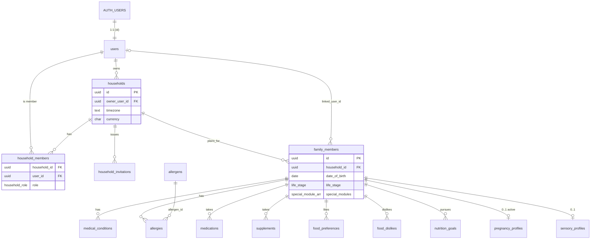
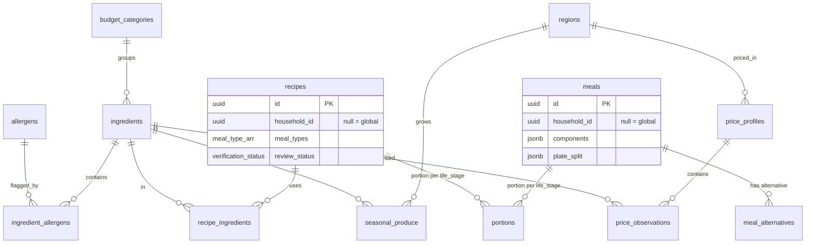
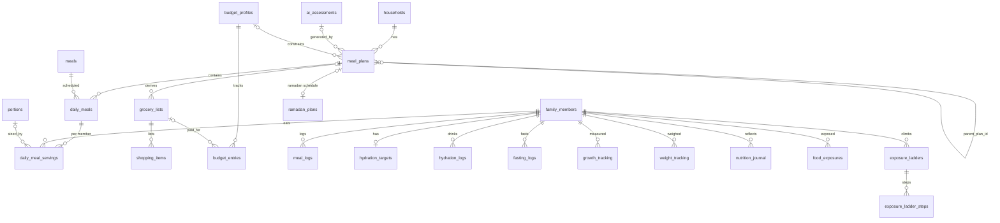
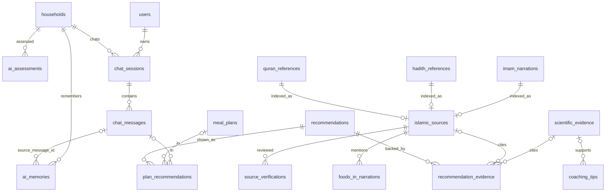
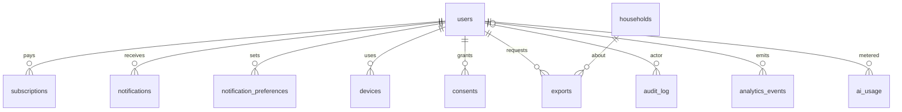
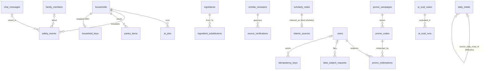

# 05 · Database Schema

> **Status:** Draft v1 for implementation · **Owner:** Backend / Data · **Deliverable:** 4 (Database Schema)
>
> **Related docs:** `00-foundations.md` (canonical names, enums, table catalog), `04-system-architecture.md`, `06-api-specification.md`, `10-supabase-structure.md` (directory layout, Storage, cron wiring, local workflow), `11-authentication.md`, `12-ai-agent-architecture.md`, `13-islamic-knowledge-module.md`, `14-meal-planning-and-grocery.md`, `15-family-health-modules.md`, `16-security-architecture.md`, `17-subscription-architecture.md`, `18-exports-and-analytics.md`, `21-testing-strategy.md`.
>
> This document is the reference DDL. Every SQL block headed by a migration file name is meant to be copied verbatim into `supabase/migrations/`. Anything not in `00-foundations.md` is marked **Addition beyond 00-foundations** and listed in [section 20](#20-additions-beyond-00-foundations).

## Table of contents

1. [Design principles](#1-design-principles)
2. [Migration plan](#2-migration-plan)
3. [Entity relationship diagrams](#3-entity-relationship-diagrams)
4. [0001 Extensions and enums](#4-0001-extensions-and-enums)
5. [0002 Core helper functions](#5-0002-core-helper-functions)
6. [0003 Identity and tenancy](#6-0003-identity-and-tenancy)
7. [0004 Food catalog](#7-0004-food-catalog)
8. [0005 Health profile](#8-0005-health-profile)
9. [0006 Islamic knowledge and evidence](#9-0006-islamic-knowledge-and-evidence)
10. [0007 AI](#10-0007-ai)
11. [0008 Plans, grocery and budget](#11-0008-plans-grocery-and-budget)
12. [0009 Tracking and family modules](#12-0009-tracking-and-family-modules)
13. [0010 Platform](#13-0010-platform)
14. [0011 Access helper functions](#14-0011-access-helper-functions)
15. [0012 Triggers](#15-0012-triggers)
16. [0013 Row Level Security](#16-0013-row-level-security)
17. [0014 Analytics partitions, materialized views and cron](#17-0014-analytics-partitions-materialized-views-and-cron)
18. [Data retention](#18-data-retention)
19. [Seed strategy](#19-seed-strategy)
20. [Additions beyond 00-foundations](#20-additions-beyond-00-foundations)
21. [Acceptance criteria and test hooks](#21-acceptance-criteria-and-test-hooks)
22. [Consolidated additions (migrations 0017 onward)](#22-consolidated-additions-migrations-0017-onward)
    - New tables: `ai_jobs`, `safety_events`, `ai_eval_cases`, `ai_eval_runs`, `scholar_reviewers`, `scholarly_notes`, `quran_text`, `pantry_items`, `ingredient_substitutions`, `consent_versions`, `data_subject_requests`, `deleted_user_ledger`, `household_keys`, `revenuecat_events`, `promo_campaigns`, `promo_codes`, `promo_redemptions`, `analytics_event_catalog`, `analytics.metric_snapshots`, `idempotency_keys`, `rate_limit_buckets`, `prayer_times_cache`
    - New views: `citable_islamic_sources`, `v_knowledge_status`, `v_qada_balance`, `fasting_logs_visible`, `mv_current_prices`, ten `analytics.mv_*` views; pgmq queue `plan_generation`

---

## 1. Design principles

| Principle | Rule in this schema |
|---|---|
| Naming | `snake_case`, plural tables, `id uuid primary key default gen_random_uuid()`. |
| Timestamps | Every table has `created_at` and `updated_at`, both `timestamptz not null default now()`, with `updated_at` maintained by the `set_updated_at()` trigger attached in migration 0012 by a loop over all public tables. |
| Soft delete | User-owned tables carry `deleted_at timestamptz`. RLS `select` policies filter `deleted_at is null`. Hard deletes happen only through `account-delete` and retention jobs running as `service_role`. |
| Tenancy | Every family-scoped row carries `household_id uuid not null references households(id)`. RLS uses a single indexed predicate `is_household_member(household_id)`. Every `household_id` column has a btree index (usually composite with the most common filter). |
| Integrity of denormalised `household_id` | Child rows also carry the parent's `household_id`. A composite foreign key `(parent_id, household_id) references parent(id, household_id)` guarantees the copy can never drift. Each parent therefore has `unique (id, household_id)`. |
| Units | Metric only: `weight_kg numeric(5,2)`, `height_cm numeric(5,1)`, `*_ml integer`, `kcal numeric(7,1)`, `_g`, `_mg`, `_mcg` suffixes. Conversion to imperial is a client concern (`users.units`). |
| Money | `amount_minor bigint` + `currency char(3)`. PKR uses 2 minor digits (paisa) per ISO 4217, so Rs 120 is stored as `12000`. |
| Enums | Only the enums in `00-foundations.md` section 5 are Postgres enums. Small closed sets from the table catalog (for example `kind ('allergy'|'intolerance')`) are `text` with a `check` constraint so values can be added in a migration without enum gymnastics. |
| ON DELETE | Household-scoped children `on delete cascade` from `households` and `family_members` (a household is only hard-deleted by erasure). References into the global catalog use `on delete restrict` (catalog rows are retired, never deleted). Optional links (`linked_user_id`, `reporter_user_id`, `source_message_id`) use `on delete set null`. |
| Security definer | Helper functions used inside RLS are `security definer`, `stable`, `set search_path = ''`, fully schema-qualified, so they cannot recurse into RLS and cannot be hijacked by `search_path`. |
| Extensions schema | Extensions live in schema `extensions` (Supabase default). Vector columns are typed `extensions.vector(1536)`. |

## 2. Migration plan

File names follow the Supabase CLI convention `<UTC timestamp>_<name>.sql`. The short number (0001 to 0014) is used in this document for readability. Storage bucket creation and seed files are specified in `10-supabase-structure.md`.

| # | File | Contents |
|---|---|---|
| 0001 | `20261001000100_extensions_enums.sql` | Extensions, all canonical enums |
| 0002 | `20261001000200_core_helpers.sql` | `set_updated_at`, `life_stage_for_dob`, `compute_bmi`, `is_admin` |
| 0003 | `20261001000300_identity_tenancy.sql` | `users`, `households`, `household_members`, `household_invitations`, `family_members` |
| 0004 | `20261001000400_food_catalog.sql` | `allergens`, `budget_categories`, `regions`, `ingredients`, `ingredient_allergens`, `recipes`, `recipe_ingredients`, `meals`, `portions`, `meal_alternatives`, `seasonal_produce`, `price_profiles`, `price_observations` |
| 0005 | `20261001000500_health_profile.sql` | `medical_conditions`, `allergies`, `medications`, `supplements`, `food_preferences`, `food_dislikes`, `nutrition_goals`, `pregnancy_profiles`, `sensory_profiles` |
| 0006 | `20261001000600_islamic_knowledge.sql` | `quran_references`, `hadith_references`, `imam_narrations`, `islamic_sources`, `source_verifications`, `foods_in_narrations`, `scientific_evidence`, `recommendations`, `recommendation_evidence`, `coaching_tips` |
| 0007 | `20261001000700_ai.sql` | `ai_assessments`, `chat_sessions`, `chat_messages`, `ai_memories`, `ai_usage`, `ai_model_routes`, `prompt_templates` |
| 0008 | `20261001000800_plans_grocery_budget.sql` | `budget_profiles`, `meal_plans`, `daily_meals`, `daily_meal_servings`, `grocery_lists`, `shopping_items`, `budget_entries`, `plan_recommendations` |
| 0009 | `20261001000900_tracking_modules.sql` | `meal_logs`, `hydration_targets`, `hydration_logs`, `fasting_logs`, `ramadan_plans`, `growth_reference_lms`, `growth_tracking`, `weight_tracking`, `nutrition_journal`, `food_exposures`, `exposure_ladders`, `exposure_ladder_steps` |
| 0010 | `20261001001000_platform.sql` | `subscriptions`, `notifications`, `notification_preferences`, `devices`, `consents`, `audit_log`, `analytics_events` (partitioned), `exports`, `feature_flags` |
| 0011 | `20261001001100_access_helpers.sql` | `is_household_member`, `household_role_of`, `can_edit_household`, `can_author_plans`, `shares_household_with`, `has_premium`, `household_has_premium` |
| 0012 | `20261001001200_triggers.sql` | `updated_at` loop, derived columns, entitlement limits, audit, auth profile creation, membership bootstrap |
| 0013 | `20261001001300_rls.sql` | `enable row level security` on every table and all policies |
| 0014 | `20261001001400_analytics_cron.sql` | Partition maintenance, materialized views, all `pg_cron` jobs |

Migrations 0015 and 0016 (Storage, Realtime) are in `10-supabase-structure.md`; 0016b and 0017 to 0026 (consolidated additions from the other documents) are listed in [section 22.1](#221-migration-plan-0015-onward).

Rules for future migrations are in `10-supabase-structure.md` section "Migration rules". The short version: forward-only, additive enum changes only, every new table ships with RLS policies and a pgTAP test in the same pull request.

## 3. Entity relationship diagrams

The ERD is split by domain. Columns shown are the keys and the most important attributes only; the DDL is authoritative.

### 3.1 Identity, tenancy and health profile



### 3.2 Food catalog and pricing



### 3.3 Plans, grocery, budget and tracking



### 3.4 AI, Islamic knowledge and evidence



### 3.5 Platform



---

## 4. 0001 Extensions and enums

```sql
-- supabase/migrations/20261001000100_extensions_enums.sql
-- Extensions. Supabase installs extensions into schema "extensions".
create extension if not exists pgcrypto  with schema extensions;
create extension if not exists citext    with schema extensions;
create extension if not exists pg_trgm   with schema extensions;
create extension if not exists vector    with schema extensions;   -- pgvector
create extension if not exists pg_cron;                            -- installs into schema "cron"
create extension if not exists pg_net    with schema extensions;   -- Addition beyond 00-foundations: HTTP calls from pg_cron to Edge Functions
-- Supabase Vault (schema "vault") is enabled by default on hosted projects and used for cron secrets.

-- Canonical enums, copied verbatim from 00-foundations section 5. Additive changes only.
create type public.household_role        as enum ('owner','caregiver','viewer','coach');
create type public.sex_at_birth          as enum ('female','male','unspecified');
create type public.blood_group           as enum ('A+','A-','B+','B-','AB+','AB-','O+','O-','unknown');
create type public.activity_level        as enum ('sedentary','light','moderate','active','very_active');
create type public.life_stage            as enum ('infant','toddler','child','teen','adult','older_adult');
create type public.goal_type             as enum ('weight_loss','weight_gain','maintain','child_growth','energy','digestive_health','pregnancy_support','breastfeeding_support','blood_sugar','heart_health');
create type public.special_module        as enum ('pregnancy','breastfeeding','autism','adhd','picky_eater');
create type public.meal_type             as enum ('suhoor','breakfast','lunch','snack','dinner','iftar');
create type public.meal_status           as enum ('planned','eaten','partly_eaten','skipped','swapped');
create type public.plan_status           as enum ('draft','generating','active','completed','archived','failed');
create type public.plan_kind             as enum ('standard','ramadan','growth','weight_management','custom');
create type public.severity              as enum ('mild','moderate','severe','anaphylactic');
create type public.evidence_grade_hadith as enum ('sahih','hasan','daif','mawdu','sahih_shia','muwaththaq','hasan_shia','daif_shia','ungraded');
create type public.evidence_grade_science as enum ('high','moderate','low','very_low','expert_opinion');
create type public.source_tradition      as enum ('shared','sunni','shia');
create type public.source_kind           as enum ('quran','hadith','imam_narration','scholarly');
create type public.verification_status   as enum ('unverified','in_review','verified','rejected');
create type public.subscription_tier     as enum ('free','premium');
create type public.subscription_status   as enum ('active','in_grace','in_billing_retry','cancelled','expired','paused');
create type public.chat_role             as enum ('user','assistant','system','tool');
create type public.notification_channel  as enum ('push','in_app','email');
create type public.texture               as enum ('smooth','soft','crunchy','chewy','crispy','mixed','lumpy','wet','dry');
create type public.exposure_stage        as enum ('tolerate_on_table','look','touch','smell','lick','taste','chew_spit','eat_small','eat_portion');
create type public.acceptance_score      as enum ('0_refused','1_tolerated','2_touched','3_tasted','4_ate_some','5_ate_well');
create type public.fast_kind             as enum ('ramadan','sunnah_monday_thursday','ayyam_al_bid','arafah','ashura','qada','nafl','intermittent');
create type public.price_source          as enum ('seed','user_report','admin','partner_feed');
```

> `pg_net` is an **Addition beyond 00-foundations**. It is a standard Supabase extension and is the only supported way for `pg_cron` to invoke Edge Functions (`notifications-dispatch`, `prices-refresh`, `analytics-rollup`).

## 5. 0002 Core helper functions

```sql
-- supabase/migrations/20261001000200_core_helpers.sql

-- 5.1 updated_at maintenance (attached to every table in 0012)
create or replace function public.set_updated_at()
returns trigger
language plpgsql
set search_path = ''
as $$
begin
  new.updated_at := now();
  return new;
end;
$$;

-- 5.2 Life stage from date of birth.
-- infant < 12 months, toddler 12-35 months, child 3-12 years, teen 13-17,
-- adult 18-64, older_adult >= 65. Boundaries match 15-family-health-modules.md.
create or replace function public.life_stage_for_dob(p_dob date, p_on date default current_date)
returns public.life_stage
language sql
immutable
parallel safe
set search_path = ''
as $$
  select case
    when p_dob is null then 'adult'::public.life_stage
    when (extract(year from age(p_on, p_dob)) * 12 + extract(month from age(p_on, p_dob))) < 12 then 'infant'
    when extract(year from age(p_on, p_dob)) < 3  then 'toddler'
    when extract(year from age(p_on, p_dob)) < 13 then 'child'
    when extract(year from age(p_on, p_dob)) < 18 then 'teen'
    when extract(year from age(p_on, p_dob)) < 65 then 'adult'
    else 'older_adult'
  end::public.life_stage;
$$;

-- Age in whole months, used by growth-compute and coaching_tips filtering.
create or replace function public.age_in_months(p_dob date, p_on date default current_date)
returns integer
language sql
immutable
parallel safe
set search_path = ''
as $$
  select (extract(year from age(p_on, p_dob)) * 12 + extract(month from age(p_on, p_dob)))::integer;
$$;

-- Convenience: is this person a minor on a given date (drives "children are never restricted").
create or replace function public.is_minor(p_dob date, p_on date default current_date)
returns boolean
language sql
immutable
parallel safe
set search_path = ''
as $$
  select p_dob is not null and age(p_on, p_dob) < interval '18 years';
$$;

-- 5.3 BMI = kg / m^2, rounded to 2 dp. Null-safe, rejects nonsense heights.
create or replace function public.compute_bmi(p_weight_kg numeric, p_height_cm numeric)
returns numeric(5,2)
language sql
immutable
parallel safe
set search_path = ''
as $$
  select case
    when p_weight_kg is null or p_height_cm is null or p_height_cm < 30 then null
    else round(p_weight_kg / ((p_height_cm / 100.0) ^ 2), 2)
  end::numeric(5,2);
$$;

-- 5.4 Platform admin check (Addition beyond 00-foundations).
-- Admins are users whose auth.users.raw_app_meta_data has {"role":"admin"}; this is
-- set only with the service role (see 16-security-architecture.md). Used by RLS on
-- curated catalog tables so the internal admin console can write through PostgREST.
create or replace function public.is_admin()
returns boolean
language sql
stable
set search_path = ''
as $$
  select coalesce((auth.jwt() -> 'app_metadata' ->> 'role') = 'admin', false);
$$;
```

> `age_in_months`, `is_minor` and `is_admin` are **Additions beyond 00-foundations**.

## 6. 0003 Identity and tenancy

```sql
-- supabase/migrations/20261001000300_identity_tenancy.sql

-- 6.1 users: profile row 1:1 with auth.users. Created by trigger on auth.users (0012).
create table public.users (
  id                       uuid primary key references auth.users(id) on delete cascade,
  display_name             text not null default '' check (char_length(display_name) <= 80),
  email                    extensions.citext,                 -- Addition: copy of auth email for invitation matching
  avatar_path              text,                               -- Addition: Storage path in bucket "avatars"
  locale                   text not null default 'en'
                             check (locale in ('en','ur','ar','fr','tr','ms','id','bn')),
  country_code             char(2) check (country_code ~ '^[A-Z]{2}$'),
  timezone                 text not null default 'Asia/Karachi',
  tradition_preference     public.source_tradition not null default 'shared',
  units                    text not null default 'metric' check (units in ('metric','imperial')),
  onboarding_completed_at  timestamptz,
  created_at               timestamptz not null default now(),
  updated_at               timestamptz not null default now(),
  deleted_at               timestamptz
);
create unique index users_email_key on public.users (email) where deleted_at is null;

-- 6.2 households
create table public.households (
  id              uuid primary key default gen_random_uuid(),
  owner_user_id   uuid not null references public.users(id) on delete cascade,
  name            text not null check (char_length(name) between 1 and 80),
  country_code    char(2) not null default 'PK' check (country_code ~ '^[A-Z]{2}$'),
  region          text,                         -- region_code matching regions.region_code, e.g. 'PB'
  region_id       uuid,                         -- Addition: FK to regions added in 0004
  city            text,
  timezone        text not null default 'Asia/Karachi',
  currency        char(3) not null default 'PKR' check (currency ~ '^[A-Z]{3}$'),
  family_size     smallint not null default 0 check (family_size between 0 and 50), -- maintained by trigger
  created_at      timestamptz not null default now(),
  updated_at      timestamptz not null default now(),
  deleted_at      timestamptz
);
create index households_owner_idx on public.households (owner_user_id) where deleted_at is null;

-- 6.3 household_members: app users with access to a household
create table public.household_members (
  id            uuid primary key default gen_random_uuid(),
  household_id  uuid not null references public.households(id) on delete cascade,
  user_id       uuid not null references public.users(id) on delete cascade,
  role          public.household_role not null,
  invited_by    uuid references public.users(id) on delete set null,  -- Addition
  created_at    timestamptz not null default now(),
  updated_at    timestamptz not null default now(),
  deleted_at    timestamptz
);
-- one live membership per (household, user); hot path for every RLS check
create unique index household_members_unique_live
  on public.household_members (household_id, user_id) where deleted_at is null;
create index household_members_user_idx
  on public.household_members (user_id, household_id) include (role) where deleted_at is null;
-- exactly one owner row per household
create unique index household_members_one_owner
  on public.household_members (household_id) where role = 'owner' and deleted_at is null;

-- 6.4 household_invitations
create table public.household_invitations (
  id            uuid primary key default gen_random_uuid(),
  household_id  uuid not null references public.households(id) on delete cascade,
  email         extensions.citext not null,
  role          public.household_role not null check (role <> 'owner'),
  token_hash    text not null unique,      -- sha256 hex of the opaque token; raw token only in the email link
  invited_by    uuid not null references public.users(id) on delete cascade,
  expires_at    timestamptz not null default now() + interval '7 days',
  accepted_at   timestamptz,
  accepted_by   uuid references public.users(id) on delete set null,   -- Addition
  revoked_at    timestamptz,                                             -- Addition
  created_at    timestamptz not null default now(),
  updated_at    timestamptz not null default now(),
  check (expires_at > created_at)
);
create index household_invitations_household_idx on public.household_invitations (household_id);
create unique index household_invitations_one_pending
  on public.household_invitations (household_id, email)
  where accepted_at is null and revoked_at is null;

-- 6.5 family_members: a person being planned for (may have no app account)
create table public.family_members (
  id               uuid primary key default gen_random_uuid(),
  household_id     uuid not null references public.households(id) on delete cascade,
  linked_user_id   uuid references public.users(id) on delete set null,
  name             text not null check (char_length(name) between 1 and 60),
  date_of_birth    date check (date_of_birth > date '1900-01-01'),   -- "not in the future" enforced by trigger (CHECK must be immutable)
  sex_at_birth     public.sex_at_birth not null default 'unspecified',
  height_cm        numeric(5,1) check (height_cm between 30 and 260),
  weight_kg        numeric(5,2) check (weight_kg between 1 and 400),
  blood_group      public.blood_group not null default 'unknown',
  activity_level   public.activity_level not null default 'moderate',
  life_stage       public.life_stage not null default 'adult',   -- set by trigger from date_of_birth
  work_schedule    jsonb not null default '{}'::jsonb,           -- {"days":["mon",...],"start":"09:00","end":"17:00","shift":"day"}
  sleep_schedule   jsonb not null default '{}'::jsonb,           -- {"bed":"22:00","wake":"05:30","nap":"14:00-15:00"}
  special_modules  public.special_module[] not null default '{}',
  avatar_path      text,                                         -- bucket "avatars": {household_id}/members/{id}.webp
  sort_order       smallint not null default 0,                  -- Addition: display order
  created_at       timestamptz not null default now(),
  updated_at       timestamptz not null default now(),
  deleted_at       timestamptz,
  unique (id, household_id),
  check (jsonb_typeof(work_schedule) = 'object'),
  check (jsonb_typeof(sleep_schedule) = 'object')
);
create index family_members_household_idx on public.family_members (household_id, sort_order) where deleted_at is null;
create index family_members_linked_user_idx on public.family_members (linked_user_id) where linked_user_id is not null;
create index family_members_modules_gin on public.family_members using gin (special_modules);
create unique index family_members_one_link_per_household
  on public.family_members (household_id, linked_user_id) where linked_user_id is not null and deleted_at is null;
```

Notes:
- `households.family_size` counts live `family_members` rows and is maintained by trigger `trg_family_members_family_size` (0012). Clients never write it.
- `household_members` is distinct from `family_members`. A grandmother who uses the app as caregiver is a `household_members` row; she may also be a `family_members` row (with `linked_user_id`) if the household plans her meals.

## 7. 0004 Food catalog

The catalog is global and admin-managed. Two catalog tables (`recipes`, `meals`) also hold household-private rows (user recipes and AI-composed meals for a specific plan); those rows carry a non-null `household_id` and are protected by household RLS. Global rows have `household_id is null`.

```sql
-- supabase/migrations/20261001000400_food_catalog.sql

-- 7.1 allergens: EU-14 + US Big-9 superset
create table public.allergens (
  id          uuid primary key default gen_random_uuid(),
  code        text not null unique check (code ~ '^[a-z_]+$'),
  name_i18n   jsonb not null check (name_i18n ? 'en'),
  eu14        boolean not null default false,   -- Addition: regulatory flags
  us_big9     boolean not null default false,   -- Addition
  created_at  timestamptz not null default now(),
  updated_at  timestamptz not null default now()
);

-- 7.2 budget_categories
create table public.budget_categories (
  id          uuid primary key default gen_random_uuid(),
  code        text not null unique check (code in (
                'staples','protein_animal','protein_plant','dairy','produce_veg',
                'produce_fruit','oils_fats','spices','beverages','snacks')),
  name_i18n   jsonb not null check (name_i18n ? 'en'),
  sort_order  smallint not null default 0,      -- Addition
  created_at  timestamptz not null default now(),
  updated_at  timestamptz not null default now()
);

-- 7.3 regions
create table public.regions (
  id                uuid primary key default gen_random_uuid(),
  country_code      char(2) not null check (country_code ~ '^[A-Z]{2}$'),
  region_code       text not null,               -- ISO 3166-2 subdivision suffix, e.g. 'PB' for Punjab
  name              text not null,
  climate_zone      text not null check (climate_zone in (
                      'hot_arid','hot_semi_arid','humid_subtropical','tropical',
                      'mediterranean','temperate_oceanic','continental','subarctic')),
  default_currency  char(3) not null check (default_currency ~ '^[A-Z]{3}$'),
  created_at        timestamptz not null default now(),
  updated_at        timestamptz not null default now(),
  unique (country_code, region_code)
);

alter table public.households
  add constraint households_region_id_fkey foreign key (region_id)
  references public.regions(id) on delete set null;
create index households_region_idx on public.households (region_id);

-- 7.4 ingredients (nutrients per 100 g edible portion)
create table public.ingredients (
  id                   uuid primary key default gen_random_uuid(),
  name                 text not null,
  name_i18n            jsonb not null default '{}'::jsonb,   -- {"en":"Bottle gourd","ur":"لوکی"}
  category             text not null check (category in (
                         'vegetable','fruit','grain','legume','meat','poultry','fish','egg',
                         'dairy','nut_seed','oil_fat','spice_herb','sweetener','beverage',
                         'condiment','prepared')),
  budget_category_id   uuid not null references public.budget_categories(id) on delete restrict,
  default_unit         text not null default 'g' check (default_unit in (
                         'g','kg','ml','l','piece','dozen','bunch','tsp','tbsp','cup','katori','lot')),
  grams_per_unit       numeric(8,2),                 -- Addition: e.g. 1 dozen eggs = 600 g, 1 roti = 40 g
  kcal                 numeric(7,1) check (kcal >= 0),
  protein_g            numeric(6,2) check (protein_g >= 0),
  carbs_g              numeric(6,2) check (carbs_g >= 0),
  fiber_g              numeric(6,2) check (fiber_g >= 0),
  sugar_g              numeric(6,2) check (sugar_g >= 0),
  fat_g                numeric(6,2) check (fat_g >= 0),
  sat_fat_g            numeric(6,2) check (sat_fat_g >= 0),
  sodium_mg            numeric(8,2) check (sodium_mg >= 0),
  iron_mg              numeric(7,2) check (iron_mg >= 0),
  calcium_mg           numeric(8,2) check (calcium_mg >= 0),
  zinc_mg              numeric(7,2) check (zinc_mg >= 0),
  vitamin_a_mcg        numeric(8,2) check (vitamin_a_mcg >= 0),
  vitamin_c_mg         numeric(7,2) check (vitamin_c_mg >= 0),
  vitamin_d_mcg        numeric(7,2) check (vitamin_d_mcg >= 0),
  b12_mcg              numeric(7,2) check (b12_mcg >= 0),
  folate_mcg           numeric(8,2) check (folate_mcg >= 0),
  potassium_mg         numeric(8,2) check (potassium_mg >= 0),
  omega3_g             numeric(6,3) check (omega3_g >= 0),
  halal_status         text not null default 'halal' check (halal_status in ('halal','haram','mashbooh','depends_on_source')),
  is_sunnah_food       boolean not null default false,
  fdc_id               integer unique,               -- USDA FoodData Central id
  textures             public.texture[] not null default '{}',
  color                text check (color in ('red','orange','yellow','green','purple','blue','white','beige','brown','black','mixed')),
  is_active            boolean not null default true, -- Addition: retire instead of delete
  created_at           timestamptz not null default now(),
  updated_at           timestamptz not null default now(),
  check (sat_fat_g is null or fat_g is null or sat_fat_g <= fat_g),
  check (sugar_g is null or carbs_g is null or sugar_g <= carbs_g)
);
create unique index ingredients_name_key on public.ingredients (lower(name));
create index ingredients_name_trgm on public.ingredients using gin (name extensions.gin_trgm_ops);
create index ingredients_name_i18n_gin on public.ingredients using gin (name_i18n jsonb_path_ops);
create index ingredients_budget_category_idx on public.ingredients (budget_category_id);
create index ingredients_sunnah_idx on public.ingredients (id) where is_sunnah_food;

-- 7.5 ingredient_allergens
create table public.ingredient_allergens (
  id             uuid primary key default gen_random_uuid(),
  ingredient_id  uuid not null references public.ingredients(id) on delete cascade,
  allergen_id    uuid not null references public.allergens(id) on delete restrict,
  created_at     timestamptz not null default now(),
  updated_at     timestamptz not null default now(),
  unique (ingredient_id, allergen_id)
);
create index ingredient_allergens_allergen_idx on public.ingredient_allergens (allergen_id);

-- 7.6 recipes
create table public.recipes (
  id                     uuid primary key default gen_random_uuid(),
  household_id           uuid references public.households(id) on delete cascade,  -- Addition: null = global catalog
  created_by_user_id     uuid references public.users(id) on delete set null,       -- Addition
  title                  text not null check (char_length(title) between 1 and 120),
  title_i18n             jsonb not null default '{}'::jsonb,
  cuisine                text not null default 'pakistani',
  region_tags            text[] not null default '{}',        -- e.g. {'PK-PB','PK','south_asia'}
  meal_types             public.meal_type[] not null check (cardinality(meal_types) > 0),
  servings               smallint not null check (servings between 1 and 50),
  prep_min               smallint not null default 0 check (prep_min between 0 and 1440),
  cook_min               smallint not null default 0 check (cook_min between 0 and 1440),
  steps                  jsonb not null default '[]'::jsonb check (jsonb_typeof(steps) = 'array'),
                         -- [{"n":1,"text_i18n":{"en":"..."},"timer_min":10}]
  texture_profile        public.texture[] not null default '{}',
  colors                 text[] not null default '{}',
  kid_friendly           boolean not null default false,
  autism_friendly        boolean not null default false,
  ramadan_suitable       boolean not null default false,
  cost_tier              smallint not null default 2 check (cost_tier between 1 and 3),
  per_serving_nutrition  jsonb not null default '{}'::jsonb,  -- computed by trigger from recipe_ingredients
  image_path             text,                                -- bucket "recipe-images"
  source                 text not null default 'curated' check (source in ('curated','ai_generated','user')),
  review_status          public.verification_status not null default 'unverified',
  created_at             timestamptz not null default now(),
  updated_at             timestamptz not null default now(),
  deleted_at             timestamptz,
  -- global rows are curated or AI drafts awaiting review; user rows always belong to a household
  check (source <> 'user' or household_id is not null),
  unique (id, household_id)
);
create index recipes_household_idx on public.recipes (household_id) where household_id is not null and deleted_at is null;
create index recipes_catalog_idx on public.recipes (review_status, cost_tier) where household_id is null and deleted_at is null;
create index recipes_meal_types_gin on public.recipes using gin (meal_types);
create index recipes_region_tags_gin on public.recipes using gin (region_tags);
create index recipes_title_trgm on public.recipes using gin (title extensions.gin_trgm_ops);
create index recipes_flags_idx on public.recipes (kid_friendly, autism_friendly, ramadan_suitable) where deleted_at is null;

-- 7.7 recipe_ingredients
create table public.recipe_ingredients (
  id             uuid primary key default gen_random_uuid(),
  recipe_id      uuid not null references public.recipes(id) on delete cascade,
  ingredient_id  uuid not null references public.ingredients(id) on delete restrict,
  quantity       numeric(8,2) not null check (quantity > 0),
  unit           text not null,                  -- as written: 'katori', 'tbsp', 'g'
  grams          numeric(8,2) not null check (grams > 0),  -- normalized, used for nutrition
  optional       boolean not null default false,
  prep_note      text,
  sort_order     smallint not null default 0,    -- Addition
  created_at     timestamptz not null default now(),
  updated_at     timestamptz not null default now()
);
create index recipe_ingredients_recipe_idx on public.recipe_ingredients (recipe_id, sort_order);
create index recipe_ingredients_ingredient_idx on public.recipe_ingredients (ingredient_id);

-- 7.8 meals: composed meal usable in plans
create table public.meals (
  id            uuid primary key default gen_random_uuid(),
  household_id  uuid references public.households(id) on delete cascade,  -- Addition: null = global template
  source        text not null default 'curated' check (source in ('curated','ai_generated','user')), -- Addition
  title         text not null check (char_length(title) between 1 and 160),
  title_i18n    jsonb not null default '{}'::jsonb,                        -- Addition
  meal_type     public.meal_type not null,
  components    jsonb not null check (jsonb_typeof(components) = 'array' and jsonb_array_length(components) > 0),
                -- [{"recipe_id":"uuid","role":"main"},{"label":"Kachumber salad","ingredient_ids":["uuid"],"role":"side"}]
  plate_split   jsonb not null default '{"veg_fruit":0.5,"protein":0.25,"carb":0.25}'::jsonb,
  created_at    timestamptz not null default now(),
  updated_at    timestamptz not null default now(),
  deleted_at    timestamptz,
  check (
    (plate_split ?& array['veg_fruit','protein','carb'])
    and abs((plate_split->>'veg_fruit')::numeric + (plate_split->>'protein')::numeric
            + (plate_split->>'carb')::numeric - 1) <= 0.05
  ),
  unique (id, household_id)
);
create index meals_household_idx on public.meals (household_id) where household_id is not null and deleted_at is null;
create index meals_catalog_type_idx on public.meals (meal_type) where household_id is null and deleted_at is null;
create index meals_components_gin on public.meals using gin (components jsonb_path_ops);

-- 7.9 portions: guidance per life stage
create table public.portions (
  id                uuid primary key default gen_random_uuid(),
  household_id      uuid references public.households(id) on delete cascade,  -- Addition: set for portions of household meals
  meal_id           uuid references public.meals(id) on delete cascade,
  recipe_id         uuid references public.recipes(id) on delete cascade,
  life_stage        public.life_stage not null,
  grams             numeric(7,1) not null check (grams > 0),
  household_measure text not null,              -- '1 small roti, half katori daal'
  household_measure_i18n jsonb not null default '{}'::jsonb,                  -- Addition
  kcal              numeric(7,1) check (kcal >= 0),  -- stored for adults; never displayed for minors (UI rule, 15-family-health-modules.md)
  created_at        timestamptz not null default now(),
  updated_at        timestamptz not null default now(),
  check (num_nonnulls(meal_id, recipe_id) = 1)
);
create unique index portions_meal_stage_key on public.portions (meal_id, life_stage) where meal_id is not null;
create unique index portions_recipe_stage_key on public.portions (recipe_id, life_stage) where recipe_id is not null;
create index portions_household_idx on public.portions (household_id) where household_id is not null;

-- 7.10 meal_alternatives
create table public.meal_alternatives (
  id                   uuid primary key default gen_random_uuid(),
  meal_id              uuid not null references public.meals(id) on delete cascade,
  alternative_meal_id  uuid not null references public.meals(id) on delete cascade,
  reason               text not null check (reason in ('allergy','budget','autism','picky','season','preference')),
  notes                text,
  created_at           timestamptz not null default now(),
  updated_at           timestamptz not null default now(),
  check (meal_id <> alternative_meal_id),
  unique (meal_id, alternative_meal_id, reason)
);
create index meal_alternatives_alt_idx on public.meal_alternatives (alternative_meal_id);

-- 7.11 seasonal_produce
create table public.seasonal_produce (
  id             uuid primary key default gen_random_uuid(),
  region_id      uuid not null references public.regions(id) on delete cascade,
  ingredient_id  uuid not null references public.ingredients(id) on delete restrict,
  month          smallint not null check (month between 1 and 12),
  availability   text not null check (availability in ('peak','available','scarce')),
  price_index    numeric(4,2) not null default 1.00 check (price_index > 0),  -- 1.00 = annual average price
  created_at     timestamptz not null default now(),
  updated_at     timestamptz not null default now(),
  unique (region_id, ingredient_id, month)
);
create index seasonal_produce_region_month_idx on public.seasonal_produce (region_id, month, availability);

-- 7.12 price_profiles: a regional price book
create table public.price_profiles (
  id              uuid primary key default gen_random_uuid(),
  region_id       uuid not null references public.regions(id) on delete restrict,
  city            text,                 -- null = region-wide fallback
  currency        char(3) not null check (currency ~ '^[A-Z]{3}$'),
  effective_from  date not null,
  label           text,                 -- Addition: 'Lahore retail Oct 2026'
  created_at      timestamptz not null default now(),
  updated_at      timestamptz not null default now()
);
create unique index price_profiles_key on public.price_profiles (region_id, coalesce(city, ''), effective_from);

-- 7.13 price_observations
create table public.price_observations (
  id                 uuid primary key default gen_random_uuid(),
  price_profile_id   uuid not null references public.price_profiles(id) on delete cascade,
  ingredient_id      uuid not null references public.ingredients(id) on delete restrict,
  unit               text not null check (unit in ('g','kg','ml','l','piece','dozen','bunch','lot','bottle','pack')),
  amount_minor       bigint not null check (amount_minor > 0),   -- price per one unit
  observed_on        date not null default current_date,
  source             public.price_source not null,
  reporter_user_id   uuid references public.users(id) on delete set null,
  moderation_status  text not null default 'accepted'
                       check (moderation_status in ('pending','accepted','rejected')),  -- Addition
  created_at         timestamptz not null default now(),
  updated_at         timestamptz not null default now(),
  check (source <> 'user_report' or reporter_user_id is not null)
);
create index price_observations_lookup_idx
  on public.price_observations (price_profile_id, ingredient_id, observed_on desc)
  where moderation_status = 'accepted';
create index price_observations_reporter_idx on public.price_observations (reporter_user_id) where reporter_user_id is not null;
create index price_observations_pending_idx on public.price_observations (created_at) where moderation_status = 'pending';
```

Notes:
- `recipes.per_serving_nutrition` shape: `{"kcal":312.5,"protein_g":18.2,"carbs_g":40.1,"fiber_g":7.9,"fat_g":8.4,"sat_fat_g":2.1,"sodium_mg":410,"iron_mg":3.2,"calcium_mg":120, ...}`. It is recomputed by `recompute_recipe_nutrition()` (0012) whenever `recipe_ingredients` change. Keys mirror the `ingredients` nutrient columns.
- Household meals created by `ai-generate-plan` set `meals.household_id`, `source = 'ai_generated'` and reference only verified global recipes or household recipes in `components`. Validation lives in the Edge Function (`14-meal-planning-and-grocery.md`).
- Effective prices for planning come from the materialized view `mv_ingredient_prices` (0014), refreshed by `prices-refresh`.

## 8. 0005 Health profile

All tables carry `household_id` and `family_member_id`, with a composite foreign key to `family_members (id, household_id)`. All are soft-deletable.

```sql
-- supabase/migrations/20261001000500_health_profile.sql

-- 8.1 medical_conditions
create table public.medical_conditions (
  id                uuid primary key default gen_random_uuid(),
  household_id      uuid not null references public.households(id) on delete cascade,
  family_member_id  uuid not null,
  condition_code    text,                -- SNOMED CT concept id where known, e.g. '44054006' (type 2 diabetes)
  label             text not null check (char_length(label) between 1 and 120),
  diagnosed_on      date,
  notes             text check (char_length(notes) <= 2000),
  on_insulin_or_sulfonylurea boolean not null default false,  -- Addition: drives fasting red flag (00-foundations 10.2)
  created_at        timestamptz not null default now(),
  updated_at        timestamptz not null default now(),
  deleted_at        timestamptz,
  foreign key (family_member_id, household_id) references public.family_members(id, household_id) on delete cascade
);
create index medical_conditions_member_idx on public.medical_conditions (household_id, family_member_id) where deleted_at is null;

-- 8.2 allergies
create table public.allergies (
  id                uuid primary key default gen_random_uuid(),
  household_id      uuid not null references public.households(id) on delete cascade,
  family_member_id  uuid not null,
  allergen_id       uuid not null references public.allergens(id) on delete restrict,
  kind              text not null default 'allergy' check (kind in ('allergy','intolerance')),
  severity          public.severity not null,
  reaction_notes    text check (char_length(reaction_notes) <= 2000),
  created_at        timestamptz not null default now(),
  updated_at        timestamptz not null default now(),
  deleted_at        timestamptz,
  foreign key (family_member_id, household_id) references public.family_members(id, household_id) on delete cascade
);
create unique index allergies_member_allergen_key on public.allergies (family_member_id, allergen_id) where deleted_at is null;
create index allergies_household_idx on public.allergies (household_id) where deleted_at is null;

-- 8.3 medications
create table public.medications (
  id                     uuid primary key default gen_random_uuid(),
  household_id           uuid not null references public.households(id) on delete cascade,
  family_member_id       uuid not null,
  name                   text not null check (char_length(name) between 1 and 120),
  dose                   text,
  frequency              text,
  food_interaction_flags text[] not null default '{}',  -- e.g. {'take_with_food','avoid_grapefruit','vitamin_k_consistency','fasting_risk_hypoglycemia'}
  created_at             timestamptz not null default now(),
  updated_at             timestamptz not null default now(),
  deleted_at             timestamptz,
  foreign key (family_member_id, household_id) references public.family_members(id, household_id) on delete cascade
);
create index medications_member_idx on public.medications (household_id, family_member_id) where deleted_at is null;

-- 8.4 supplements
create table public.supplements (
  id                uuid primary key default gen_random_uuid(),
  household_id      uuid not null references public.households(id) on delete cascade,
  family_member_id  uuid not null,
  name              text not null check (char_length(name) between 1 and 120),
  dose              text,
  frequency         text,
  created_at        timestamptz not null default now(),
  updated_at        timestamptz not null default now(),
  deleted_at        timestamptz,
  foreign key (family_member_id, household_id) references public.family_members(id, household_id) on delete cascade
);
create index supplements_member_idx on public.supplements (household_id, family_member_id) where deleted_at is null;

-- 8.5 food_preferences
create table public.food_preferences (
  id                uuid primary key default gen_random_uuid(),
  household_id      uuid not null references public.households(id) on delete cascade,
  family_member_id  uuid not null,
  ingredient_id     uuid references public.ingredients(id) on delete restrict,
  recipe_id         uuid references public.recipes(id) on delete set null,
  label             text not null check (char_length(label) between 1 and 120),
  strength          smallint not null default 2 check (strength between 1 and 3),
  is_safe_food      boolean not null default false,   -- autism / picky "safe food" list
  created_at        timestamptz not null default now(),
  updated_at        timestamptz not null default now(),
  deleted_at        timestamptz,
  foreign key (family_member_id, household_id) references public.family_members(id, household_id) on delete cascade
);
create index food_preferences_member_idx on public.food_preferences (household_id, family_member_id) where deleted_at is null;
create index food_preferences_safe_idx on public.food_preferences (family_member_id) where is_safe_food and deleted_at is null;

-- 8.6 food_dislikes
create table public.food_dislikes (
  id                uuid primary key default gen_random_uuid(),
  household_id      uuid not null references public.households(id) on delete cascade,
  family_member_id  uuid not null,
  ingredient_id     uuid references public.ingredients(id) on delete restrict,
  label             text not null check (char_length(label) between 1 and 120),
  reason            text not null default 'taste' check (reason in ('taste','texture','smell','color','religious','other')),
  created_at        timestamptz not null default now(),
  updated_at        timestamptz not null default now(),
  deleted_at        timestamptz,
  foreign key (family_member_id, household_id) references public.family_members(id, household_id) on delete cascade
);
create index food_dislikes_member_idx on public.food_dislikes (household_id, family_member_id) where deleted_at is null;

-- 8.7 nutrition_goals
create table public.nutrition_goals (
  id                uuid primary key default gen_random_uuid(),
  household_id      uuid not null references public.households(id) on delete cascade,
  family_member_id  uuid not null,
  goal_type         public.goal_type not null,
  target_value      numeric(8,2),
  target_unit       text check (target_unit in ('kg','kg_per_week','cm','mmol_l','mg_dl','ml_per_day','servings_per_day','percent','kcal_per_day')),
  target_date       date,
  is_primary        boolean not null default false,
  created_at        timestamptz not null default now(),
  updated_at        timestamptz not null default now(),
  deleted_at        timestamptz,
  check ((target_value is null) = (target_unit is null)),
  foreign key (family_member_id, household_id) references public.family_members(id, household_id) on delete cascade
);
create unique index nutrition_goals_one_primary on public.nutrition_goals (family_member_id) where is_primary and deleted_at is null;
create index nutrition_goals_member_idx on public.nutrition_goals (household_id, family_member_id) where deleted_at is null;
-- Child safety (no weight_loss and no kcal targets under 18) is enforced by trigger enforce_child_goal_safety (0012).

-- 8.8 pregnancy_profiles
create table public.pregnancy_profiles (
  id                    uuid primary key default gen_random_uuid(),
  household_id          uuid not null references public.households(id) on delete cascade,
  family_member_id      uuid not null,
  trimester             smallint check (trimester between 1 and 3),
  due_date              date,
  gestational_diabetes  boolean not null default false,
  created_at            timestamptz not null default now(),
  updated_at            timestamptz not null default now(),
  deleted_at            timestamptz,
  foreign key (family_member_id, household_id) references public.family_members(id, household_id) on delete cascade
);
create unique index pregnancy_profiles_one_live on public.pregnancy_profiles (family_member_id) where deleted_at is null;
create index pregnancy_profiles_household_idx on public.pregnancy_profiles (household_id) where deleted_at is null;

-- 8.9 sensory_profiles
create table public.sensory_profiles (
  id                   uuid primary key default gen_random_uuid(),
  household_id         uuid not null references public.households(id) on delete cascade,
  family_member_id     uuid not null,
  texture_likes        public.texture[] not null default '{}',
  texture_avoids       public.texture[] not null default '{}',
  color_sensitivities  text[] not null default '{}',
  presentation_prefs   jsonb not null default '{}'::jsonb,
                       -- {"separate_foods":true,"same_plate":true,"divided_plate":true,"cut_shapes":["strips","circles"],"sauce_on_side":true}
  temperature_prefs    text[] not null default '{}'
                         check (temperature_prefs <@ array['hot','warm','room','cold']::text[]),
  brand_rigidity       boolean not null default false,
  created_at           timestamptz not null default now(),
  updated_at           timestamptz not null default now(),
  deleted_at           timestamptz,
  check (not (texture_likes && texture_avoids)),
  check (jsonb_typeof(presentation_prefs) = 'object'),
  foreign key (family_member_id, household_id) references public.family_members(id, household_id) on delete cascade
);
create unique index sensory_profiles_one_live on public.sensory_profiles (family_member_id) where deleted_at is null;
create index sensory_profiles_household_idx on public.sensory_profiles (household_id) where deleted_at is null;
```

## 9. 0006 Islamic knowledge and evidence

Curated global content. The user-facing rule from `00-foundations.md` section 10.5 ("only verified sources are cited") is enforced in RLS by exposing only rows whose `islamic_sources.verification_status = 'verified'`. Editorial workflow and grading rules live in `13-islamic-knowledge-module.md`.

```sql
-- supabase/migrations/20261001000600_islamic_knowledge.sql

-- 9.1 quran_references
create table public.quran_references (
  id                uuid primary key default gen_random_uuid(),
  surah             smallint not null check (surah between 1 and 114),
  ayah_start        smallint not null check (ayah_start >= 1),
  ayah_end          smallint not null,
  arabic_text       text not null,
  translation_i18n  jsonb not null check (translation_i18n ? 'en'),  -- {"en":"...","ur":"..."}
  translator        text not null,          -- e.g. 'Sahih International' (en), 'Fateh Muhammad Jalandhari' (ur)
  topic_tags        text[] not null default '{}',
  created_at        timestamptz not null default now(),
  updated_at        timestamptz not null default now(),
  check (ayah_end >= ayah_start),
  unique (surah, ayah_start, ayah_end)
);
create index quran_references_tags_gin on public.quran_references using gin (topic_tags);

-- 9.2 hadith_references (Sunni collections and shared narrations)
create table public.hadith_references (
  id                uuid primary key default gen_random_uuid(),
  collection        text not null check (collection in (
                      'bukhari','muslim','tirmidhi','abu_dawud','ibn_majah','nasai','ahmad',
                      'malik_muwatta','darimi','bayhaqi','tabarani','hakim','ibn_hibban','other')),
  book              text,                   -- book / chapter name as printed
  number            text not null,          -- text to allow '2022a' style numbering
  numbering_scheme  text not null default 'sunnah_com',  -- Addition: which numbering the number follows
  arabic_text       text not null,
  translation_i18n  jsonb not null check (translation_i18n ? 'en'),
  narrator          text,
  grade             public.evidence_grade_hadith not null default 'ungraded',
  graded_by         text,                   -- e.g. 'al-Albani', 'Shuaib al-Arnaut'
  tradition         public.source_tradition not null default 'sunni',
  created_at        timestamptz not null default now(),
  updated_at        timestamptz not null default now(),
  unique (collection, numbering_scheme, number)
);

-- 9.3 imam_narrations (narrations of the Twelve Imams, peace be upon them)
create table public.imam_narrations (
  id                uuid primary key default gen_random_uuid(),
  imam              text not null check (imam in (
                      'ali_ibn_abi_talib','hasan_ibn_ali','husayn_ibn_ali','ali_zayn_al_abidin',
                      'muhammad_al_baqir','jafar_al_sadiq','musa_al_kazim','ali_al_rida',
                      'muhammad_al_jawad','ali_al_hadi','hasan_al_askari','muhammad_al_mahdi')),
  collection        text not null check (collection in (
                      'al_kafi','tibb_al_aimma','bihar_al_anwar','wasail_al_shia','al_mahasin',
                      'man_la_yahduruhu_al_faqih','tahdhib_al_ahkam','uyun_akhbar_al_rida',
                      'makarim_al_akhlaq','nahj_al_balagha','other')),
  volume            text,
  page              text,
  number            text,
  arabic_text       text not null,
  translation_i18n  jsonb not null check (translation_i18n ? 'en'),
  grade             public.evidence_grade_hadith not null default 'ungraded',
  graded_by         text,
  created_at        timestamptz not null default now(),
  updated_at        timestamptz not null default now(),
  check (num_nonnulls(volume, page, number) >= 1)
);
create unique index imam_narrations_locator_key
  on public.imam_narrations (collection, coalesce(volume,''), coalesce(page,''), coalesce(number,''));

-- 9.4 islamic_sources: polymorphic index used for retrieval and citation
create table public.islamic_sources (
  id                   uuid primary key default gen_random_uuid(),
  kind                 public.source_kind not null,
  ref_id               uuid,                 -- id in quran_references / hadith_references / imam_narrations; null for 'scholarly'
  tradition            public.source_tradition not null,
  citation_text        text not null,        -- 'Tirmidhi 2380; Ibn Majah 3349 (sahih, al-Albani)'
  embedding            extensions.vector(1536),
  verification_status  public.verification_status not null default 'unverified',  -- Addition: synced from latest source_verifications row
  topic_tags           text[] not null default '{}',                               -- Addition: retrieval filter
  created_at           timestamptz not null default now(),
  updated_at           timestamptz not null default now(),
  check ((kind = 'scholarly') = (ref_id is null))
);
create unique index islamic_sources_ref_key on public.islamic_sources (kind, ref_id) where ref_id is not null;
create index islamic_sources_verified_idx on public.islamic_sources (tradition, kind) where verification_status = 'verified';
create index islamic_sources_tags_gin on public.islamic_sources using gin (topic_tags);
create index islamic_sources_embedding_hnsw on public.islamic_sources
  using hnsw (embedding extensions.vector_cosine_ops) with (m = 16, ef_construction = 64);

-- 9.5 source_verifications
create table public.source_verifications (
  id                    uuid primary key default gen_random_uuid(),
  islamic_source_id     uuid not null references public.islamic_sources(id) on delete cascade,
  status                public.verification_status not null,
  reviewer_name         text not null,
  reviewer_credentials  text not null,
  reviewed_on           date not null default current_date,
  method                text not null check (method in ('primary_text_check','takhrij','scholar_panel','cross_reference')),
  notes                 text,
  created_at            timestamptz not null default now(),
  updated_at            timestamptz not null default now()
);
create index source_verifications_source_idx on public.source_verifications (islamic_source_id, reviewed_on desc, created_at desc);

-- 9.6 foods_in_narrations
create table public.foods_in_narrations (
  id                 uuid primary key default gen_random_uuid(),
  islamic_source_id  uuid not null references public.islamic_sources(id) on delete cascade,
  ingredient_id      uuid references public.ingredients(id) on delete restrict,
  food_label         text not null,          -- 'talbina', 'dates', 'pumpkin (dubba)'
  context            text not null check (context in ('recommended','mentioned','cautioned')),
  created_at         timestamptz not null default now(),
  updated_at         timestamptz not null default now()
);
create index foods_in_narrations_source_idx on public.foods_in_narrations (islamic_source_id);
create index foods_in_narrations_ingredient_idx on public.foods_in_narrations (ingredient_id) where ingredient_id is not null;

-- 9.7 scientific_evidence
create table public.scientific_evidence (
  id          uuid primary key default gen_random_uuid(),
  title       text not null,
  citation    text not null,                -- Vancouver style
  doi         text unique check (doi ~* '^10\.\d{4,9}/\S+$'),
  pmid        text unique check (pmid ~ '^\d{1,9}$'),
  study_type  text not null check (study_type in (
                'systematic_review','meta_analysis','rct','cohort','case_control',
                'cross_sectional','guideline','narrative_review','expert_opinion')),
  grade       public.evidence_grade_science not null,
  summary     text not null,
  population  text,                          -- 'children 2-5 y', 'pregnant women', 'adults with T2D'
  created_at  timestamptz not null default now(),
  updated_at  timestamptz not null default now()
);
create index scientific_evidence_title_trgm on public.scientific_evidence using gin (title extensions.gin_trgm_ops);

-- 9.8 recommendations
create table public.recommendations (
  id                   uuid primary key default gen_random_uuid(),
  code                 text not null unique check (code ~ '^[a-z0-9_.]+$'),   -- 'hydration.pre_meal_water'
  title_i18n           jsonb not null check (title_i18n ? 'en'),
  practical_text_i18n  jsonb not null check (practical_text_i18n ? 'en'),
  applies_to           jsonb not null default '{}'::jsonb,
                       -- {"life_stages":["adult"],"modules":["pregnancy"],"goals":["blood_sugar"],"min_age_months":24}
  contraindications    jsonb not null default '{}'::jsonb,
                       -- {"conditions":["ckd"],"medications":["warfarin"],"life_stages":["infant"]}
  review_status        public.verification_status not null default 'unverified',  -- Addition: publish gate
  created_at           timestamptz not null default now(),
  updated_at           timestamptz not null default now()
);
create index recommendations_applies_gin on public.recommendations using gin (applies_to jsonb_path_ops);

-- 9.9 recommendation_evidence
create table public.recommendation_evidence (
  id                      uuid primary key default gen_random_uuid(),
  recommendation_id       uuid not null references public.recommendations(id) on delete cascade,
  islamic_source_id       uuid references public.islamic_sources(id) on delete restrict,
  scientific_evidence_id  uuid references public.scientific_evidence(id) on delete restrict,
  relationship            text not null check (relationship in ('supports','context','caution')),
  created_at              timestamptz not null default now(),
  updated_at              timestamptz not null default now(),
  check (num_nonnulls(islamic_source_id, scientific_evidence_id) >= 1)
);
create index recommendation_evidence_rec_idx on public.recommendation_evidence (recommendation_id);
create index recommendation_evidence_src_idx on public.recommendation_evidence (islamic_source_id) where islamic_source_id is not null;
create index recommendation_evidence_sci_idx on public.recommendation_evidence (scientific_evidence_id) where scientific_evidence_id is not null;

-- 9.10 coaching_tips
create table public.coaching_tips (
  id              uuid primary key default gen_random_uuid(),
  module          text not null check (module in ('picky','autism','ramadan','general')),
  age_min_months  smallint not null default 0 check (age_min_months >= 0),
  age_max_months  smallint not null default 1200,
  body_i18n       jsonb not null check (body_i18n ? 'en'),
  evidence_id     uuid references public.scientific_evidence(id) on delete set null,
  is_active       boolean not null default true,    -- Addition
  created_at      timestamptz not null default now(),
  updated_at      timestamptz not null default now(),
  check (age_max_months >= age_min_months)
);
create index coaching_tips_module_age_idx on public.coaching_tips (module, age_min_months, age_max_months) where is_active;
```

Publishing rule (trigger `enforce_recommendation_publish`, 0012): a recommendation can only move to `review_status = 'verified'` when it has non-empty `practical_text_i18n.en`, at least one `recommendation_evidence` row with a `scientific_evidence_id`, and at least one row with a verified `islamic_source_id`. This encodes "every recommendation stores Islamic source + scientific evidence + practical recommendation".

## 10. 0007 AI

```sql
-- supabase/migrations/20261001000700_ai.sql

-- 10.1 ai_assessments
create table public.ai_assessments (
  id                 uuid primary key default gen_random_uuid(),
  household_id       uuid not null references public.households(id) on delete cascade,
  family_member_id   uuid,
  kind               text not null check (kind in ('intake','periodic','plan_rationale')),
  summary            text not null,
  energy_targets     jsonb not null default '{}'::jsonb,
                     -- adults: {"kcal_per_day":2100,"method":"mifflin_st_jeor","pal":1.55}
                     -- minors: {"method":"eer_iom_2005","display":false} (never shown, 00-foundations 10.3)
  macro_targets      jsonb not null default '{}'::jsonb,    -- {"protein_g":80,"carbs_pct":50,"fat_pct":30,"fiber_g":30}
  hydration_targets  jsonb not null default '{}'::jsonb,    -- Addition: {"daily_ml":2300,"basis":{...}}
  risk_flags         text[] not null default '{}',           -- 'red_flag.faltering_growth', 'red_flag.ed_signals', ...
  input_snapshot     jsonb not null default '{}'::jsonb,    -- Addition: de-identified intake used for the run
  model_route        text not null,                          -- 'plan.generate'
  model              text,                                   -- Addition: concrete model id actually used
  prompt_version     text not null,                          -- 'intake_assess@3'
  created_by_user_id uuid references public.users(id) on delete set null,  -- Addition
  created_at         timestamptz not null default now(),
  updated_at         timestamptz not null default now(),
  unique (id, household_id),
  foreign key (family_member_id, household_id) references public.family_members(id, household_id) on delete cascade
);
create index ai_assessments_household_idx on public.ai_assessments (household_id, created_at desc);
create index ai_assessments_member_idx on public.ai_assessments (family_member_id, created_at desc) where family_member_id is not null;

-- 10.2 chat_sessions (private to the user who started them)
create table public.chat_sessions (
  id                uuid primary key default gen_random_uuid(),
  household_id      uuid not null references public.households(id) on delete cascade,
  user_id           uuid not null references public.users(id) on delete cascade,
  title             text not null default '' check (char_length(title) <= 120),
  context_snapshot  jsonb not null default '{}'::jsonb,
  last_message_at   timestamptz,
  created_at        timestamptz not null default now(),
  updated_at        timestamptz not null default now(),
  deleted_at        timestamptz,
  unique (id, household_id)
);
create index chat_sessions_user_idx on public.chat_sessions (user_id, household_id, last_message_at desc nulls last) where deleted_at is null;

-- 10.3 chat_messages (written only by ai-chat with service role)
create table public.chat_messages (
  id           uuid primary key default gen_random_uuid(),
  session_id   uuid not null,
  household_id uuid not null references public.households(id) on delete cascade,
  role         public.chat_role not null,
  content      text not null default '',
  attachments  jsonb not null default '[]'::jsonb,
               -- [{"type":"image","path":"{household_id}/{session_id}/{uuid}.jpg","mime":"image/jpeg"},{"type":"audio",...}]
  tool_calls   jsonb not null default '[]'::jsonb,
  tokens_in    integer check (tokens_in >= 0),
  tokens_out   integer check (tokens_out >= 0),
  model        text,
  safety_flags text[] not null default '{}',
  created_at   timestamptz not null default now(),
  updated_at   timestamptz not null default now(),
  check (jsonb_typeof(attachments) = 'array'),
  foreign key (session_id, household_id) references public.chat_sessions(id, household_id) on delete cascade
);
create index chat_messages_session_idx on public.chat_messages (session_id, created_at);
create index chat_messages_household_idx on public.chat_messages (household_id, created_at desc);
create index chat_messages_safety_idx on public.chat_messages using gin (safety_flags) where cardinality(safety_flags) > 0;

-- 10.4 ai_memories (premium long-term memory)
create table public.ai_memories (
  id                 uuid primary key default gen_random_uuid(),
  household_id       uuid not null references public.households(id) on delete cascade,
  family_member_id   uuid,
  fact               text not null check (char_length(fact) between 1 and 500),
  source_message_id  uuid references public.chat_messages(id) on delete set null,
  embedding          extensions.vector(1536) not null,
  confidence         numeric(3,2) not null default 0.80 check (confidence between 0 and 1),
  expires_at         timestamptz,
  created_at         timestamptz not null default now(),
  updated_at         timestamptz not null default now(),
  deleted_at         timestamptz,
  foreign key (family_member_id, household_id) references public.family_members(id, household_id) on delete cascade
);
create index ai_memories_household_idx on public.ai_memories (household_id, family_member_id) where deleted_at is null;
create index ai_memories_embedding_hnsw on public.ai_memories
  using hnsw (embedding extensions.vector_cosine_ops) with (m = 16, ef_construction = 64);

-- 10.5 ai_usage (metering; written by Edge Functions)
create table public.ai_usage (
  id               uuid primary key default gen_random_uuid(),
  user_id          uuid not null references public.users(id) on delete cascade,
  household_id     uuid references public.households(id) on delete set null,
  route_key        text not null,
  provider         text not null check (provider in ('anthropic','openai','google')),
  model            text not null,
  tokens_in        integer not null default 0 check (tokens_in >= 0),
  tokens_out       integer not null default 0 check (tokens_out >= 0),
  cost_usd_micros  bigint not null default 0 check (cost_usd_micros >= 0),
  latency_ms       integer check (latency_ms >= 0),
  status           text not null default 'ok' check (status in ('ok','error','fallback','blocked')), -- Addition
  request_id       text,                                                                      -- Addition: correlates with Sentry
  created_at       timestamptz not null default now(),
  updated_at       timestamptz not null default now()
);
create index ai_usage_user_day_idx on public.ai_usage (user_id, route_key, created_at desc);
create index ai_usage_created_idx on public.ai_usage using brin (created_at);

-- 10.6 ai_model_routes
create table public.ai_model_routes (
  id          uuid primary key default gen_random_uuid(),
  route_key   text not null,
  provider    text not null check (provider in ('anthropic','openai','google')),
  model       text not null,
  params      jsonb not null default '{}'::jsonb,   -- {"max_tokens":4096,"temperature":0.4,"timeout_ms":60000}
  priority    smallint not null default 1 check (priority >= 1),  -- 1 = primary, 2+ = fallbacks
  enabled     boolean not null default true,
  created_at  timestamptz not null default now(),
  updated_at  timestamptz not null default now(),
  unique (route_key, priority)
);

-- 10.7 prompt_templates
create table public.prompt_templates (
  id          uuid primary key default gen_random_uuid(),
  key         text not null check (key ~ '^[a-z0-9_.]+$'),
  version     integer not null check (version >= 1),
  body        text not null,
  variables   jsonb not null default '[]'::jsonb,   -- ["household_summary","locale","tradition"]
  is_active   boolean not null default false,
  created_at  timestamptz not null default now(),
  updated_at  timestamptz not null default now(),
  unique (key, version)
);
create unique index prompt_templates_one_active on public.prompt_templates (key) where is_active;
```

Daily chat quota (20 free / 200 premium, `00-foundations.md` section 8) is counted by `ai-chat` as `count(*) from ai_usage where user_id = $1 and route_key = 'chat.default' and status <> 'blocked' and created_at >= date_trunc('day', now() at time zone users.timezone) at time zone users.timezone`. The `ai_usage_user_day_idx` index serves this query.

## 11. 0008 Plans, grocery and budget

```sql
-- supabase/migrations/20261001000800_plans_grocery_budget.sql

-- 11.1 budget_profiles
create table public.budget_profiles (
  id                    uuid primary key default gen_random_uuid(),
  household_id          uuid not null references public.households(id) on delete cascade,
  monthly_amount_minor  bigint not null check (monthly_amount_minor > 0),
  currency              char(3) not null check (currency ~ '^[A-Z]{3}$'),
  strictness            text not null default 'target' check (strictness in ('flexible','target','hard_cap')),
  category_split        jsonb not null default '{}'::jsonb,
                        -- {"staples":0.18,"protein_animal":0.30,"dairy":0.15,"produce_veg":0.12,...}; values sum to 1 +/- 0.02 (validated in Edge Function)
  is_active             boolean not null default true,     -- Addition: one active profile per household
  created_at            timestamptz not null default now(),
  updated_at            timestamptz not null default now(),
  deleted_at            timestamptz,
  unique (id, household_id),
  check (jsonb_typeof(category_split) = 'object')
);
create unique index budget_profiles_one_active on public.budget_profiles (household_id) where is_active and deleted_at is null;

-- 11.2 meal_plans
create table public.meal_plans (
  id                          uuid primary key default gen_random_uuid(),
  household_id                uuid not null references public.households(id) on delete cascade,
  kind                        public.plan_kind not null default 'standard',
  status                      public.plan_status not null default 'draft',
  title                       text,                                        -- Addition
  start_date                  date not null,
  end_date                    date not null,
  week_count                  smallint not null default 1 check (week_count between 1 and 12),
  generated_by_assessment_id  uuid,
  budget_profile_id           uuid,
  rationale                   text,
  version                     integer not null default 1 check (version >= 1),
  parent_plan_id              uuid,
  failure_reason              text,                                        -- Addition: set when status = 'failed'
  generation_meta             jsonb not null default '{}'::jsonb,          -- Addition: {"route":"plan.generate","model":"...","prompt_version":"...","job_id":"..."}
  created_by_user_id          uuid references public.users(id) on delete set null,  -- Addition
  created_at                  timestamptz not null default now(),
  updated_at                  timestamptz not null default now(),
  deleted_at                  timestamptz,
  unique (id, household_id),
  check (end_date >= start_date),
  check (end_date - start_date + 1 <= week_count * 7),
  check (status <> 'failed' or failure_reason is not null),
  foreign key (generated_by_assessment_id, household_id) references public.ai_assessments(id, household_id) on delete set null (generated_by_assessment_id),
  foreign key (budget_profile_id, household_id) references public.budget_profiles(id, household_id) on delete set null (budget_profile_id),
  foreign key (parent_plan_id, household_id) references public.meal_plans(id, household_id) on delete set null (parent_plan_id)
);
create index meal_plans_household_status_idx on public.meal_plans (household_id, status, start_date desc) where deleted_at is null;
create index meal_plans_parent_idx on public.meal_plans (parent_plan_id) where parent_plan_id is not null;
-- linear version history: at most one non-failed child per parent, so concurrent adjustments cannot fork a plan
create unique index meal_plans_one_child on public.meal_plans (parent_plan_id)
  where parent_plan_id is not null and status <> 'failed' and deleted_at is null;

-- 11.3 daily_meals: a planned meal slot
create table public.daily_meals (
  id              uuid primary key default gen_random_uuid(),
  meal_plan_id    uuid not null,
  household_id    uuid not null references public.households(id) on delete cascade,
  plan_date       date not null,
  meal_type       public.meal_type not null,
  slot            smallint not null default 1 check (slot between 1 and 4),  -- Addition: allows two snacks a day
  meal_id         uuid not null references public.meals(id) on delete restrict,
  scheduled_time  time,
  notes           text,
  created_at      timestamptz not null default now(),
  updated_at      timestamptz not null default now(),
  unique (id, household_id),
  unique (meal_plan_id, plan_date, meal_type, slot),
  foreign key (meal_plan_id, household_id) references public.meal_plans(id, household_id) on delete cascade
);
create index daily_meals_household_date_idx on public.daily_meals (household_id, plan_date, meal_type);
create index daily_meals_meal_idx on public.daily_meals (meal_id);

-- 11.4 daily_meal_servings: per-member portion and tracking
create table public.daily_meal_servings (
  id                uuid primary key default gen_random_uuid(),
  daily_meal_id     uuid not null,
  household_id      uuid not null references public.households(id) on delete cascade,
  family_member_id  uuid not null,
  portion_id        uuid references public.portions(id) on delete set null,
  adaptation        text not null default 'none' check (adaptation in ('none','autism','picky','allergy','pregnancy')),
  adapted_meal_id   uuid references public.meals(id) on delete restrict,
  status            public.meal_status not null default 'planned',
  acceptance        public.acceptance_score,
  logged_at         timestamptz,
  created_at        timestamptz not null default now(),
  updated_at        timestamptz not null default now(),
  unique (daily_meal_id, family_member_id),
  check (adaptation <> 'none' or adapted_meal_id is null),
  check (status = 'planned' or logged_at is not null),
  foreign key (daily_meal_id, household_id) references public.daily_meals(id, household_id) on delete cascade,
  foreign key (family_member_id, household_id) references public.family_members(id, household_id) on delete cascade
);
create index daily_meal_servings_member_idx on public.daily_meal_servings (household_id, family_member_id, status);
create index daily_meal_servings_meal_idx on public.daily_meal_servings (daily_meal_id);

-- 11.5 grocery_lists
create table public.grocery_lists (
  id                     uuid primary key default gen_random_uuid(),
  household_id           uuid not null references public.households(id) on delete cascade,
  meal_plan_id           uuid,
  period                 text not null default 'weekly' check (period in ('weekly','monthly','adhoc')),
  starts_on              date not null,
  ends_on                date not null,
  estimated_total_minor  bigint not null default 0 check (estimated_total_minor >= 0),
  currency               char(3) not null check (currency ~ '^[A-Z]{3}$'),
  status                 text not null default 'open' check (status in ('open','shopping','done')),
  price_profile_id       uuid references public.price_profiles(id) on delete set null,  -- Addition: price book used for estimates
  created_at             timestamptz not null default now(),
  updated_at             timestamptz not null default now(),
  deleted_at             timestamptz,
  unique (id, household_id),
  check (ends_on >= starts_on),
  foreign key (meal_plan_id, household_id) references public.meal_plans(id, household_id) on delete set null (meal_plan_id)
);
create index grocery_lists_household_idx on public.grocery_lists (household_id, starts_on desc) where deleted_at is null;

-- 11.6 shopping_items
create table public.shopping_items (
  id                        uuid primary key default gen_random_uuid(),
  grocery_list_id           uuid not null,
  household_id              uuid not null references public.households(id) on delete cascade,
  ingredient_id             uuid references public.ingredients(id) on delete restrict,
  label                     text not null check (char_length(label) between 1 and 160),
  quantity                  numeric(8,2) not null default 1 check (quantity > 0),
  unit                      text not null default 'piece',
  estimated_minor           bigint check (estimated_minor >= 0),
  actual_minor              bigint check (actual_minor >= 0),
  is_checked                boolean not null default false,
  substitution_for_item_id  uuid references public.shopping_items(id) on delete set null,
  aisle                     text,               -- budget_categories.code by default, user-editable
  is_fresh                  boolean not null default true,   -- true = buy weekly, false = monthly staple
  sort_order                smallint not null default 0,     -- Addition
  created_at                timestamptz not null default now(),
  updated_at                timestamptz not null default now(),
  check (substitution_for_item_id is distinct from id),
  foreign key (grocery_list_id, household_id) references public.grocery_lists(id, household_id) on delete cascade
);
create index shopping_items_list_idx on public.shopping_items (grocery_list_id, aisle, sort_order);
create index shopping_items_household_idx on public.shopping_items (household_id);

-- 11.7 budget_entries: actual spend
create table public.budget_entries (
  id                 uuid primary key default gen_random_uuid(),
  household_id       uuid not null references public.households(id) on delete cascade,
  budget_profile_id  uuid not null,
  amount_minor       bigint not null check (amount_minor > 0),
  currency           char(3) not null check (currency ~ '^[A-Z]{3}$'),   -- Addition: explicit, must equal profile currency
  category_id        uuid not null references public.budget_categories(id) on delete restrict,
  spent_on           date not null default current_date,
  grocery_list_id    uuid,
  note               text,                                               -- Addition
  created_at         timestamptz not null default now(),
  updated_at         timestamptz not null default now(),
  foreign key (budget_profile_id, household_id) references public.budget_profiles(id, household_id) on delete cascade,
  foreign key (grocery_list_id, household_id) references public.grocery_lists(id, household_id) on delete set null (grocery_list_id)
);
create index budget_entries_household_month_idx on public.budget_entries (household_id, spent_on desc);
create index budget_entries_profile_idx on public.budget_entries (budget_profile_id, category_id, spent_on);

-- 11.8 plan_recommendations: recommendation instances shown in a plan or chat
create table public.plan_recommendations (
  id                 uuid primary key default gen_random_uuid(),
  household_id       uuid not null references public.households(id) on delete cascade,
  meal_plan_id       uuid,
  chat_message_id    uuid references public.chat_messages(id) on delete cascade,
  recommendation_id  uuid not null references public.recommendations(id) on delete restrict,
  family_member_id   uuid,
  created_at         timestamptz not null default now(),
  updated_at         timestamptz not null default now(),
  check (num_nonnulls(meal_plan_id, chat_message_id) >= 1),
  foreign key (meal_plan_id, household_id) references public.meal_plans(id, household_id) on delete cascade,
  foreign key (family_member_id, household_id) references public.family_members(id, household_id) on delete cascade
);
create index plan_recommendations_plan_idx on public.plan_recommendations (household_id, meal_plan_id);
create index plan_recommendations_msg_idx on public.plan_recommendations (chat_message_id) where chat_message_id is not null;
```

Notes:
- `on delete set null (column)` (Postgres 15+) nulls only the optional column of a composite foreign key and leaves `household_id` intact.
- Free tier "1 active weekly plan" is enforced by `enforce_plan_entitlement` (0012). Edge Functions additionally check before spending AI tokens.
- `meal_plans_one_child` keeps version history linear: `ai-adjust-plan` creates the child with `version = parent.version + 1`, and a second concurrent adjustment of the same parent fails with a unique violation that the function maps to `PLAN_ADJUST_CONFLICT`.

## 12. 0009 Tracking and family modules

High-volume log tables (`hydration_logs`, `fasting_logs`, `growth_tracking`, `weight_tracking`, `nutrition_journal`, `food_exposures`, `exposure_ladder_steps`) are hard-deletable by editors for quick undo; their deletes on sensitive tables are captured in `audit_log`. Entity tables (`meal_logs`, `hydration_targets`, `ramadan_plans`, `exposure_ladders`) are soft-deleted.

```sql
-- supabase/migrations/20261001000900_tracking_modules.sql

-- 12.1 meal_logs: free-form tracking outside a plan
create table public.meal_logs (
  id                   uuid primary key default gen_random_uuid(),
  household_id         uuid not null references public.households(id) on delete cascade,
  family_member_id     uuid not null,
  eaten_at             timestamptz not null default now(),
  meal_type            public.meal_type not null,
  description          text not null default '' check (char_length(description) <= 2000),
  photo_path           text,                  -- bucket "meal-photos": {household_id}/{family_member_id}/{yyyy}/{mm}/{id}.jpg
  estimated_nutrition  jsonb not null default '{}'::jsonb,
                       -- {"items":[{"label":"chicken karahi","grams":180,"confidence":0.7}],"kcal":640,"protein_g":38,...,"thuluth_feedback":"..."}
  fullness_before      smallint check (fullness_before between 0 and 10),   -- hunger-fullness scale, 0 = starving, 10 = stuffed
  fullness_after       smallint check (fullness_after between 0 and 10),
  source               text not null default 'manual' check (source in ('manual','photo_ai','plan')),
  daily_meal_serving_id uuid references public.daily_meal_servings(id) on delete set null,  -- Addition: when source = 'plan'
  logged_by_user_id    uuid references public.users(id) on delete set null,                  -- Addition
  created_at           timestamptz not null default now(),
  updated_at           timestamptz not null default now(),
  deleted_at           timestamptz,
  check (source <> 'photo_ai' or photo_path is not null),
  foreign key (family_member_id, household_id) references public.family_members(id, household_id) on delete cascade
);
create index meal_logs_member_time_idx on public.meal_logs (household_id, family_member_id, eaten_at desc) where deleted_at is null;

-- 12.2 hydration_targets
create table public.hydration_targets (
  id                uuid primary key default gen_random_uuid(),
  household_id      uuid not null references public.households(id) on delete cascade,
  family_member_id  uuid not null,
  daily_ml          integer not null check (daily_ml between 300 and 6000),
  schedule          jsonb not null default '[]'::jsonb,
                    -- [{"window":"pre_breakfast","start":"07:00","ml":250},{"window":"pre_lunch","start":"12:30","ml":250},...]
  basis             jsonb not null default '{}'::jsonb,
                    -- {"age_years":34,"weight_kg":68,"climate_zone":"hot_semi_arid","pregnancy":false,"breastfeeding":false,"fasting":false,"source":"efsa_2010"}
  created_at        timestamptz not null default now(),
  updated_at        timestamptz not null default now(),
  deleted_at        timestamptz,
  check (jsonb_typeof(schedule) = 'array'),
  foreign key (family_member_id, household_id) references public.family_members(id, household_id) on delete cascade
);
create unique index hydration_targets_one_live on public.hydration_targets (family_member_id) where deleted_at is null;
create index hydration_targets_household_idx on public.hydration_targets (household_id) where deleted_at is null;

-- 12.3 hydration_logs
create table public.hydration_logs (
  id                uuid primary key default gen_random_uuid(),
  household_id      uuid not null references public.households(id) on delete cascade,
  family_member_id  uuid not null,
  logged_at         timestamptz not null default now(),
  volume_ml         integer not null check (volume_ml between 10 and 3000),
  beverage          text not null default 'water' check (beverage in ('water','milk','laban','juice','tea','other')),
  timing            text not null default 'other' check (timing in ('pre_meal','with_meal','post_meal','other')),
  created_at        timestamptz not null default now(),
  updated_at        timestamptz not null default now(),
  foreign key (family_member_id, household_id) references public.family_members(id, household_id) on delete cascade
);
create index hydration_logs_member_time_idx on public.hydration_logs (household_id, family_member_id, logged_at desc);

-- 12.4 fasting_logs
create table public.fasting_logs (
  id                uuid primary key default gen_random_uuid(),
  household_id      uuid not null references public.households(id) on delete cascade,
  family_member_id  uuid not null,
  fast_date         date not null,
  kind              public.fast_kind not null,
  started_at        timestamptz,
  ended_at          timestamptz,
  completed         boolean not null default false,
  exemption_reason  text check (exemption_reason in ('illness','travel','menstruation','pregnancy','breastfeeding','age','medical_advice','other')),
  is_practice_fast  boolean not null default false,   -- Addition: child half-day practice fast (7 to puberty)
  notes             text check (char_length(notes) <= 2000),
  created_at        timestamptz not null default now(),
  updated_at        timestamptz not null default now(),
  check (ended_at is null or started_at is null or ended_at > started_at),
  check (not (completed and exemption_reason is not null)),
  unique (family_member_id, fast_date, kind),
  foreign key (family_member_id, household_id) references public.family_members(id, household_id) on delete cascade
);
create index fasting_logs_member_date_idx on public.fasting_logs (household_id, family_member_id, fast_date desc);
-- Safety trigger enforce_fasting_safety (0012): no 'intermittent' fasting for minors; under-7s may only be logged as exempt (reason 'age').

-- 12.5 ramadan_plans
create table public.ramadan_plans (
  id                        uuid primary key default gen_random_uuid(),
  household_id              uuid not null references public.households(id) on delete cascade,
  hijri_year                smallint not null check (hijri_year between 1440 and 1600),
  start_date                date not null,
  end_date                  date not null,
  meal_plan_id              uuid,
  suhoor_time_strategy      text not null default 'late' check (suhoor_time_strategy in ('late','early','split')),
  child_participation       jsonb not null default '{}'::jsonb,
                            -- {"<family_member_id>":{"mode":"practice_half_day","days":["sat","sun"]}}; under-7 => "none"
  pregnancy_adjustments     jsonb not null default '{}'::jsonb,
                            -- {"<family_member_id>":{"fasting":"deferred_to_clinician","snack_plan":true}}
  city_prayer_times_source  text not null default 'aladhan' check (city_prayer_times_source in ('aladhan','manual','umm_al_qura','isna','mwl','karachi','tehran','jafari')),
  prayer_times              jsonb not null default '[]'::jsonb,   -- Addition: cached [{"date":"2027-02-08","fajr":"05:31","maghrib":"17:55"}]
  created_at                timestamptz not null default now(),
  updated_at                timestamptz not null default now(),
  deleted_at                timestamptz,
  check (end_date >= start_date and end_date - start_date <= 30),
  foreign key (meal_plan_id, household_id) references public.meal_plans(id, household_id) on delete set null (meal_plan_id)
);
create unique index ramadan_plans_one_per_year on public.ramadan_plans (household_id, hijri_year) where deleted_at is null;

-- 12.6 growth_reference_lms (global reference data: WHO 2006, WHO 2007, CDC 2000)
create table public.growth_reference_lms (
  id          uuid primary key default gen_random_uuid(),
  reference   text not null check (reference in ('who_2006','who_2007','cdc_2000')),
  indicator   text not null check (indicator in ('wfa','lhfa','bmifa','hcfa')),  -- weight, length/height, BMI, head circumference for age
  sex         public.sex_at_birth not null check (sex in ('female','male')),
  age_months  numeric(6,2) not null check (age_months between 0 and 240),
  l           numeric(10,6) not null,
  m           numeric(10,4) not null check (m > 0),
  s           numeric(10,6) not null check (s > 0),
  created_at  timestamptz not null default now(),
  updated_at  timestamptz not null default now(),
  unique (reference, indicator, sex, age_months)
);

-- 12.7 growth_tracking (children)
create table public.growth_tracking (
  id                          uuid primary key default gen_random_uuid(),
  household_id                uuid not null references public.households(id) on delete cascade,
  family_member_id            uuid not null,
  measured_on                 date not null,
  age_months                  numeric(6,2),                 -- Addition: computed by growth-compute
  height_cm                   numeric(5,1) check (height_cm between 30 and 230),
  weight_kg                   numeric(5,2) check (weight_kg between 0.5 and 250),
  bmi                         numeric(5,2) generated always as (public.compute_bmi(weight_kg, height_cm)) stored,
  head_circumference_cm       numeric(4,1) check (head_circumference_cm between 20 and 70),
  height_for_age_z            numeric(5,2) check (height_for_age_z between -10 and 10),
  weight_for_age_z            numeric(5,2) check (weight_for_age_z between -10 and 10),
  bmi_for_age_z               numeric(5,2) check (bmi_for_age_z between -10 and 10),
  head_circumference_for_age_z numeric(5,2) check (head_circumference_for_age_z between -10 and 10),  -- Addition
  height_for_age_percentile   numeric(5,2) check (height_for_age_percentile between 0 and 100),
  weight_for_age_percentile   numeric(5,2) check (weight_for_age_percentile between 0 and 100),
  bmi_for_age_percentile      numeric(5,2) check (bmi_for_age_percentile between 0 and 100),
  head_circumference_for_age_percentile numeric(5,2) check (head_circumference_for_age_percentile between 0 and 100), -- Addition
  reference                   text not null default 'who_2006' check (reference in ('who_2006','who_2007','cdc_2000')),
  flags                       text[] not null default '{}',  -- Addition: 'red_flag.wfa_below_p3', 'red_flag.crossed_two_major_lines'
  computed_at                 timestamptz,                   -- Addition: null until growth-compute has run
  created_at                  timestamptz not null default now(),
  updated_at                  timestamptz not null default now(),
  check (num_nonnulls(height_cm, weight_kg, head_circumference_cm) >= 1),
  unique (family_member_id, measured_on),
  foreign key (family_member_id, household_id) references public.family_members(id, household_id) on delete cascade
);
create index growth_tracking_member_idx on public.growth_tracking (household_id, family_member_id, measured_on desc);
create index growth_tracking_flags_idx on public.growth_tracking using gin (flags) where cardinality(flags) > 0;

-- 12.8 weight_tracking (adults)
create table public.weight_tracking (
  id                uuid primary key default gen_random_uuid(),
  household_id      uuid not null references public.households(id) on delete cascade,
  family_member_id  uuid not null,
  measured_on       date not null,
  weight_kg         numeric(5,2) not null check (weight_kg between 20 and 400),
  waist_cm          numeric(5,1) check (waist_cm between 30 and 250),
  bmi               numeric(5,2),          -- set by trigger from family_members.height_cm
  created_at        timestamptz not null default now(),
  updated_at        timestamptz not null default now(),
  unique (family_member_id, measured_on),
  foreign key (family_member_id, household_id) references public.family_members(id, household_id) on delete cascade
);
create index weight_tracking_member_idx on public.weight_tracking (household_id, family_member_id, measured_on desc);

-- 12.9 nutrition_journal
create table public.nutrition_journal (
  id                 uuid primary key default gen_random_uuid(),
  household_id       uuid not null references public.households(id) on delete cascade,
  family_member_id   uuid not null,
  journal_date       date not null,
  mood               smallint check (mood between 1 and 5),
  energy             smallint check (energy between 1 and 5),
  digestion          smallint check (digestion between 1 and 5),
  thuluth_adherence  smallint check (thuluth_adherence between 0 and 3),  -- thirds respected today (adults); rhythm score for minors
  notes              text check (char_length(notes) <= 4000),
  created_at         timestamptz not null default now(),
  updated_at         timestamptz not null default now(),
  unique (family_member_id, journal_date),
  foreign key (family_member_id, household_id) references public.family_members(id, household_id) on delete cascade
);
create index nutrition_journal_member_idx on public.nutrition_journal (household_id, family_member_id, journal_date desc);

-- 12.10 food_exposures (picky eater and autism exposure log)
create table public.food_exposures (
  id                uuid primary key default gen_random_uuid(),
  household_id      uuid not null references public.households(id) on delete cascade,
  family_member_id  uuid not null,
  ingredient_id     uuid not null references public.ingredients(id) on delete restrict,
  exposed_on        date not null default current_date,
  stage             public.exposure_stage not null,
  acceptance        public.acceptance_score not null,
  context           text check (context in ('family_meal','snack','cooking_together','grocery_trip','play','school','other')),
  ladder_step_id    uuid,                     -- Addition: FK added below once exposure_ladder_steps exists
  notes             text check (char_length(notes) <= 2000),
  created_at        timestamptz not null default now(),
  updated_at        timestamptz not null default now(),
  foreign key (family_member_id, household_id) references public.family_members(id, household_id) on delete cascade
);
create index food_exposures_member_idx on public.food_exposures (household_id, family_member_id, exposed_on desc);
create index food_exposures_ingredient_idx on public.food_exposures (family_member_id, ingredient_id, exposed_on desc);

-- 12.11 exposure_ladders
create table public.exposure_ladders (
  id                    uuid primary key default gen_random_uuid(),
  household_id          uuid not null references public.households(id) on delete cascade,
  family_member_id      uuid not null,
  target_ingredient_id  uuid not null references public.ingredients(id) on delete restrict,
  strategy              text not null check (strategy in ('exposure_ladder','food_chaining')),
  status                text not null default 'active' check (status in ('active','paused','completed','abandoned')),
  current_step          smallint not null default 1 check (current_step >= 1),
  created_at            timestamptz not null default now(),
  updated_at            timestamptz not null default now(),
  deleted_at            timestamptz,
  unique (id, household_id),
  foreign key (family_member_id, household_id) references public.family_members(id, household_id) on delete cascade
);
create index exposure_ladders_member_idx on public.exposure_ladders (household_id, family_member_id, status) where deleted_at is null;
create unique index exposure_ladders_one_active_target
  on public.exposure_ladders (family_member_id, target_ingredient_id) where status = 'active' and deleted_at is null;

-- 12.12 exposure_ladder_steps
create table public.exposure_ladder_steps (
  id                         uuid primary key default gen_random_uuid(),
  ladder_id                  uuid not null,
  household_id               uuid not null references public.households(id) on delete cascade,
  step_no                    smallint not null check (step_no >= 1),
  stage                      public.exposure_stage not null,
  food_label                 text not null,       -- 'orange lentil puffs', 'carrot coin, soft-cooked'
  bridge_from_ingredient_id  uuid references public.ingredients(id) on delete restrict,
  criteria                   text not null,       -- 'two calm sessions at this stage with acceptance >= 2_touched'
  completed_on               date,
  created_at                 timestamptz not null default now(),
  updated_at                 timestamptz not null default now(),
  unique (ladder_id, step_no),
  unique (id, household_id),
  foreign key (ladder_id, household_id) references public.exposure_ladders(id, household_id) on delete cascade
);
create index exposure_ladder_steps_household_idx on public.exposure_ladder_steps (household_id);

alter table public.food_exposures
  add constraint food_exposures_ladder_step_fkey
  foreign key (ladder_step_id, household_id) references public.exposure_ladder_steps(id, household_id)
  on delete set null (ladder_step_id);
```

## 13. 0010 Platform

```sql
-- supabase/migrations/20261001001000_platform.sql

-- 13.1 subscriptions (server truth from revenuecat-webhook; see 17-subscription-architecture.md)
create table public.subscriptions (
  id                  uuid primary key default gen_random_uuid(),
  user_id             uuid not null references public.users(id) on delete cascade,
  tier                public.subscription_tier not null default 'free',
  status              public.subscription_status not null,
  product_id          text not null,      -- 'thuluth_premium_monthly' | 'thuluth_premium_annual' | promo id
  store               text not null check (store in ('app_store','play_store','promotional')),
  rc_app_user_id      text not null,      -- equals users.id::text (RevenueCat appUserID)
  current_period_end  timestamptz,
  will_renew          boolean not null default false,
  raw_event           jsonb not null default '{}'::jsonb,   -- latest webhook payload (PII-scrubbed)
  last_event_id       text,               -- Addition: RevenueCat event.id for idempotency
  last_event_at       timestamptz,        -- Addition: event.event_timestamp_ms; older events are ignored
  created_at          timestamptz not null default now(),
  updated_at          timestamptz not null default now(),
  unique (rc_app_user_id, product_id, store)
);
create index subscriptions_user_active_idx on public.subscriptions (user_id, tier, status, current_period_end desc);
create unique index subscriptions_last_event_key on public.subscriptions (last_event_id) where last_event_id is not null;

-- 13.2 notifications
create table public.notifications (
  id             uuid primary key default gen_random_uuid(),
  user_id        uuid not null references public.users(id) on delete cascade,
  household_id   uuid references public.households(id) on delete cascade,
  channel        public.notification_channel not null default 'push',
  kind           text not null,            -- same vocabulary as notification_preferences.kind
  title          text not null check (char_length(title) <= 120),
  body           text not null check (char_length(body) <= 500),
  data           jsonb not null default '{}'::jsonb,   -- {"deeplink":"thuluth://today","family_member_id":"..."}
  scheduled_for  timestamptz not null default now(),
  sent_at        timestamptz,
  read_at        timestamptz,
  onesignal_id   text,
  status         text not null default 'pending' check (status in ('pending','sent','failed','cancelled')),  -- Addition
  dedupe_key     text,                     -- Addition: e.g. 'hydration:<member>:2026-10-06T12:30'
  attempts       smallint not null default 0,  -- Addition
  created_at     timestamptz not null default now(),
  updated_at     timestamptz not null default now()
);
create index notifications_due_idx on public.notifications (scheduled_for) where status = 'pending';
create index notifications_user_inbox_idx on public.notifications (user_id, created_at desc) where channel = 'in_app';
create unique index notifications_dedupe_key on public.notifications (user_id, dedupe_key) where dedupe_key is not null;

-- 13.3 notification_preferences
create table public.notification_preferences (
  id           uuid primary key default gen_random_uuid(),
  user_id      uuid not null references public.users(id) on delete cascade,
  kind         text not null check (kind in (
                 'meal_reminder','hydration_reminder','suhoor_alarm','iftar_alert','fasting_reminder',
                 'growth_measurement_due','plan_ready','grocery_reminder','weekly_summary',
                 'coaching_tip','household_activity','subscription','marketing')),
  enabled      boolean not null default true,
  quiet_hours  jsonb not null default '{}'::jsonb,   -- {"start":"22:00","end":"06:30","tz":"Asia/Karachi"}
  created_at   timestamptz not null default now(),
  updated_at   timestamptz not null default now(),
  unique (user_id, kind)
);

-- 13.4 devices
create table public.devices (
  id                         uuid primary key default gen_random_uuid(),
  user_id                    uuid not null references public.users(id) on delete cascade,
  platform                   text not null check (platform in ('ios','android','web')),
  onesignal_subscription_id  text unique,
  app_version                text not null,
  last_seen_at               timestamptz not null default now(),
  created_at                 timestamptz not null default now(),
  updated_at                 timestamptz not null default now()
);
create index devices_user_idx on public.devices (user_id, last_seen_at desc);

-- 13.5 consents (append-only history; withdrawal sets withdrawn_at)
create table public.consents (
  id            uuid primary key default gen_random_uuid(),
  user_id       uuid not null references public.users(id) on delete cascade,
  household_id  uuid references public.households(id) on delete cascade,  -- Addition: scope for 'child_data'
  kind          text not null check (kind in ('terms','privacy','health_data','child_data','ai_processing','marketing')),
  version       text not null,           -- document version, e.g. '2026-09-01'
  granted_at    timestamptz not null default now(),
  withdrawn_at  timestamptz,
  created_at    timestamptz not null default now(),
  updated_at    timestamptz not null default now(),
  check (withdrawn_at is null or withdrawn_at >= granted_at),
  check (kind <> 'child_data' or household_id is not null)
);
create index consents_user_kind_idx on public.consents (user_id, kind, granted_at desc);
create unique index consents_one_live on public.consents (user_id, kind, coalesce(household_id, '00000000-0000-0000-0000-000000000000'::uuid), version)
  where withdrawn_at is null;

-- 13.6 audit_log (append-only)
create table public.audit_log (
  id             uuid primary key default gen_random_uuid(),
  actor_user_id  uuid references public.users(id) on delete set null,
  household_id   uuid references public.households(id) on delete set null,
  action         text not null check (action in ('insert','update','delete','soft_delete','restore','role_change','export','login','erasure')),
  entity         text not null,           -- table name
  entity_id      uuid,
  diff           jsonb not null default '{}'::jsonb,
  ip_hash        text,
  at             timestamptz not null default now(),
  created_at     timestamptz not null default now(),
  updated_at     timestamptz not null default now()
);
create index audit_log_household_at_idx on public.audit_log (household_id, at desc);
create index audit_log_actor_at_idx on public.audit_log (actor_user_id, at desc);
create index audit_log_entity_idx on public.audit_log (entity, entity_id);
create index audit_log_at_brin on public.audit_log using brin (at);

-- 13.7 analytics_events (range-partitioned by month on occurred_at)
create table public.analytics_events (
  id           uuid not null default gen_random_uuid(),
  user_id      uuid,                      -- no FK: partitioned, erasure job nulls it (18 retention)
  household_id uuid,                      -- no FK, same reason
  event        text not null check (event ~ '^[a-z][a-z0-9_.]{2,63}$'),   -- 'plan.generated', 'hydration.logged'
  props        jsonb not null default '{}'::jsonb,
  occurred_at  timestamptz not null,
  app_version  text,
  platform     text check (platform in ('ios','android','web','server')),
  created_at   timestamptz not null default now(),
  updated_at   timestamptz not null default now(),
  primary key (id, occurred_at)
) partition by range (occurred_at);

create index analytics_events_event_time_idx on public.analytics_events (event, occurred_at);
create index analytics_events_user_time_idx on public.analytics_events (user_id, occurred_at);

create table public.analytics_events_default partition of public.analytics_events default;
-- Monthly partitions (analytics_events_yYYYYmMM) are created by private.ensure_analytics_partitions() in 0014.

-- 13.8 exports
create table public.exports (
  id            uuid primary key default gen_random_uuid(),
  household_id  uuid not null references public.households(id) on delete cascade,
  user_id       uuid not null references public.users(id) on delete cascade,
  kind          text not null check (kind in ('meal_plan','grocery_list','nutrition_report','growth_report','ramadan_pack','family_summary')),
  status        text not null default 'queued' check (status in ('queued','rendering','ready','failed','expired')),
  params        jsonb not null default '{}'::jsonb,   -- Addition: {"meal_plan_id":"...","locale":"ur","paper":"A4"}
  storage_path  text,                                 -- bucket "exports": {household_id}/{id}.pdf
  error         text,                                 -- Addition
  expires_at    timestamptz not null default now() + interval '7 days',
  created_at    timestamptz not null default now(),
  updated_at    timestamptz not null default now(),
  check (status <> 'ready' or storage_path is not null)
);
create index exports_household_idx on public.exports (household_id, created_at desc);
create index exports_expiry_idx on public.exports (expires_at) where status = 'ready';

-- 13.9 feature_flags
create table public.feature_flags (
  id          uuid primary key default gen_random_uuid(),
  key         text not null unique check (key ~ '^[a-z0-9_.]+$'),
  enabled     boolean not null default false,
  rules       jsonb not null default '{}'::jsonb,
              -- {"countries":["PK"],"min_app_version":"1.2.0","percent":25,"tiers":["premium"],"user_ids":[]}
  description text,                                   -- Addition
  created_at  timestamptz not null default now(),
  updated_at  timestamptz not null default now()
);
```

`account-export` uses `entity`-keyed queries over every table above. Note that `account-delete` must also delete from `analytics_events` by `user_id` (no FK cascade), which `18-exports-and-analytics.md` and the function spec in `06-api-specification.md` cover.

## 14. 0011 Access helper functions

All helpers are `security definer` so they read `household_members` without triggering its own RLS (avoiding recursion), `stable` so Postgres can cache them within a statement, and `set search_path = ''`.

```sql
-- supabase/migrations/20261001001100_access_helpers.sql

create schema if not exists private;
revoke all on schema private from public, anon, authenticated;

-- 14.1 membership
create or replace function public.is_household_member(p_household_id uuid)
returns boolean
language sql
stable
security definer
set search_path = ''
as $$
  select exists (
    select 1
    from public.household_members hm
    where hm.household_id = p_household_id
      and hm.user_id = auth.uid()
      and hm.deleted_at is null
  );
$$;

create or replace function public.household_role_of(p_household_id uuid)
returns public.household_role
language sql
stable
security definer
set search_path = ''
as $$
  select hm.role
  from public.household_members hm
  where hm.household_id = p_household_id
    and hm.user_id = auth.uid()
    and hm.deleted_at is null
  limit 1;
$$;

-- owner or caregiver: may write family data
create or replace function public.can_edit_household(p_household_id uuid)
returns boolean
language sql
stable
security definer
set search_path = ''
as $$
  select coalesce(public.household_role_of(p_household_id) in ('owner','caregiver'), false);
$$;

-- Addition: owner, caregiver or coach may author plans and recommendations (coach is Phase 2)
create or replace function public.can_author_plans(p_household_id uuid)
returns boolean
language sql
stable
security definer
set search_path = ''
as $$
  select coalesce(public.household_role_of(p_household_id) in ('owner','caregiver','coach'), false);
$$;

-- Addition: the caller is the linked app user of this family member (self-logging teen or adult)
create or replace function public.is_linked_member(p_family_member_id uuid)
returns boolean
language sql
stable
security definer
set search_path = ''
as $$
  select exists (
    select 1 from public.family_members fm
    where fm.id = p_family_member_id
      and fm.linked_user_id = auth.uid()
      and fm.deleted_at is null
      and public.is_household_member(fm.household_id)
  );
$$;

-- Addition: used by users RLS so co-members can see each other's display name
create or replace function public.shares_household_with(p_user_id uuid)
returns boolean
language sql
stable
security definer
set search_path = ''
as $$
  select exists (
    select 1
    from public.household_members me
    join public.household_members them on them.household_id = me.household_id
    where me.user_id = auth.uid() and me.deleted_at is null
      and them.user_id = p_user_id and them.deleted_at is null
  );
$$;

-- Addition: set-returning variant for policies that benefit from an initPlan
create or replace function public.my_household_ids()
returns setof uuid
language sql
stable
security definer
set search_path = ''
as $$
  select hm.household_id from public.household_members hm
  where hm.user_id = auth.uid() and hm.deleted_at is null;
$$;

-- 14.2 entitlements
-- Premium = a premium subscription row that is active, in grace, or cancelled-but-not-yet-expired.
create or replace function public.has_premium(p_user_id uuid)
returns boolean
language sql
stable
security definer
set search_path = ''
as $$
  select exists (
    select 1 from public.subscriptions s
    where s.user_id = p_user_id
      and s.tier = 'premium'
      and (
        s.status in ('active','in_grace')
        or (s.status = 'cancelled' and s.current_period_end > now())
      )
      and (s.current_period_end is null or s.current_period_end > now() - interval '3 days')  -- clock-skew / webhook-lag tolerance
  );
$$;

-- Addition: premium follows the household owner, so caregivers in a premium household get premium features there
create or replace function public.household_has_premium(p_household_id uuid)
returns boolean
language sql
stable
security definer
set search_path = ''
as $$
  select coalesce((
    select public.has_premium(h.owner_user_id) from public.households h where h.id = p_household_id
  ), false);
$$;

-- 14.3 soft delete RPC (Addition).
-- Why: an UPDATE that sets deleted_at makes the row fail the SELECT policy (deleted_at is null),
-- and PostgREST's filtered UPDATE needs the new row to stay visible, so a plain PATCH fails with 42501.
-- Clients call supabase.rpc('soft_delete', { p_table: 'allergies', p_id }) instead.
create or replace function public.soft_delete(p_table text, p_id uuid)
returns void
language plpgsql
security definer
set search_path = ''
as $$
declare
  v_household uuid;
  v_allowed constant text[] := array[
    'family_members','medical_conditions','allergies','medications','supplements','food_preferences',
    'food_dislikes','nutrition_goals','pregnancy_profiles','sensory_profiles','meal_plans','meal_logs',
    'budget_profiles','grocery_lists','hydration_targets','ramadan_plans','exposure_ladders',
    'chat_sessions','ai_memories','recipes','meals','household_members'];
begin
  if not (p_table = any (v_allowed)) then
    raise exception 'SOFT_DELETE_NOT_ALLOWED' using errcode = '42501', detail = p_table;
  end if;

  execute format('select household_id from public.%I where id = $1 and deleted_at is null', p_table)
    into v_household using p_id;
  if v_household is null then
    raise exception 'NOT_FOUND' using errcode = 'P0002';
  end if;

  if p_table = 'chat_sessions' then
    if not exists (select 1 from public.chat_sessions where id = p_id and user_id = auth.uid()) then
      raise exception 'FORBIDDEN' using errcode = '42501';
    end if;
  elsif p_table = 'household_members' then
    -- owner may remove others; anyone may leave; the owner row cannot be removed this way
    if exists (select 1 from public.household_members where id = p_id and role = 'owner') then
      raise exception 'OWNER_CANNOT_LEAVE' using errcode = '42501';
    end if;
    if not (public.household_role_of(v_household) = 'owner'
            or exists (select 1 from public.household_members where id = p_id and user_id = auth.uid())) then
      raise exception 'FORBIDDEN' using errcode = '42501';
    end if;
  elsif p_table = 'meal_plans' then
    if not public.can_author_plans(v_household) then
      raise exception 'FORBIDDEN' using errcode = '42501';
    end if;
  elsif not public.can_edit_household(v_household) then
    raise exception 'FORBIDDEN' using errcode = '42501';
  end if;

  execute format('update public.%I set deleted_at = now() where id = $1', p_table) using p_id;
end;
$$;

revoke execute on function public.soft_delete(text, uuid) from public, anon;
grant execute on function public.soft_delete(text, uuid) to authenticated;
-- Helper functions are callable by authenticated (RLS needs them); none leak data beyond a boolean or the caller's own role.
revoke execute on function public.has_premium(uuid) from public, anon;
grant execute on function public.has_premium(uuid) to authenticated, service_role;
```

Policy authoring rule: inside policies, always pass a column (`is_household_member(household_id)`), never a subquery. For list endpoints over very large tables (for example `hydration_logs` history), the API layer filters by `household_id = :id` explicitly so the planner uses the composite index first and the helper is evaluated on few rows.

`has_premium(other_user)` lets an authenticated user learn whether another user is premium. That is acceptable (it is a boolean, and the client already sees household premium state through `household_has_premium`), but Edge Functions call it with the service role and the caller's verified `sub` only.

## 15. 0012 Triggers

Trigger inventory:

| Trigger function | Table(s) | Timing | Purpose |
|---|---|---|---|
| `set_updated_at` | every table with `updated_at` | before update | Maintain `updated_at` |
| `private.validate_timezone` | `users`, `households` | before insert/update of `timezone` | Reject unknown IANA names |
| `private.family_members_derive` | `family_members` | before insert/update | Derive `life_stage`, reject future DOB, module sanity |
| `private.family_size_sync` | `family_members` | after insert/delete/update of `deleted_at` | Maintain `households.family_size` |
| `private.household_bootstrap` | `households` | after insert | Create the owner `household_members` row |
| `private.enforce_household_entitlement` | `households` | before insert / restore | Free: 1 owned household |
| `private.enforce_member_entitlement` | `family_members` | before insert / restore | Free: 6, Premium: 20 members |
| `private.enforce_plan_entitlement` | `meal_plans` | before insert/update of `status`, `week_count` | Free: 1 active weekly plan |
| `private.protect_owner_membership` | `household_members` | before update/delete | Owner row immutable except via `transfer_household_ownership` |
| `private.audit_row_change` | sensitive tables (list below) | after insert/update/delete | Append to `audit_log` |
| `private.audit_log_immutable` | `audit_log` | before update/delete | Append-only |
| `private.handle_new_auth_user` | `auth.users` | after insert | Create `users` profile + default notification preferences |
| `private.sync_auth_email` | `auth.users` | after update of `email` | Keep `users.email` in sync |
| `private.weight_tracking_bmi` | `weight_tracking` | before insert/update | Set `bmi` from member height |
| `private.sync_latest_measurement` | `growth_tracking`, `weight_tracking` | after insert/update | Copy latest height/weight onto `family_members` |
| `private.growth_reset_computed` | `growth_tracking` | before update | Clear z-scores when raw values change |
| `private.enforce_child_goal_safety` | `nutrition_goals` | before insert/update | No weight-loss or kcal goals for minors |
| `private.enforce_fasting_safety` | `fasting_logs` | before insert/update | No intermittent fasting for minors; no fasts under 7 |
| `private.chat_touch_session` | `chat_messages` | after insert | Maintain `chat_sessions.last_message_at` |
| `private.recipe_nutrition_sync` | `recipe_ingredients`, `recipes` | after change | Recompute `per_serving_nutrition` |
| `private.validate_islamic_source` | `islamic_sources` | before insert/update | Polymorphic ref check, tradition consistency, status managed |
| `private.sync_source_verification` | `source_verifications` | after insert/update/delete | Denormalise latest status to `islamic_sources` |
| `private.reset_verification_on_edit` | `quran_references`, `hadith_references`, `imam_narrations` | after update of text or grade | Send edited source back to `in_review` |
| `private.enforce_recommendation_publish` | `recommendations` | before insert/update of `review_status` | Publishing gate |
| `private.price_report_moderation` | `price_observations` | before insert | User reports start `pending` |
| `private.budget_entry_currency` | `budget_entries` | before insert/update | Currency equals profile currency |

All entitlement and safety errors use `errcode` and a stable `message` string. Edge Functions and the client map them to the error envelope (`06-api-specification.md`): `ENTITLEMENT_HOUSEHOLD_LIMIT`, `ENTITLEMENT_MEMBER_LIMIT`, `ENTITLEMENT_PLAN_LIMIT`, `CHILD_WEIGHT_LOSS_GOAL_NOT_ALLOWED`, `CHILD_CALORIE_TARGET_NOT_ALLOWED`, `CHILD_INTERMITTENT_FASTING_NOT_ALLOWED`, `UNDER_7_FASTING_NOT_ALLOWED`, `OWNER_ROW_PROTECTED`, `DOB_IN_FUTURE`, `INVALID_TIMEZONE`, `AUDIT_LOG_IMMUTABLE`.

```sql
-- supabase/migrations/20261001001200_triggers.sql

-- 15.1 updated_at on every table that has the column (partition children inherit from the parent trigger)
do $$
declare r record;
begin
  for r in
    select c.relname
    from pg_class c
    join pg_namespace n on n.oid = c.relnamespace
    join pg_attribute a on a.attrelid = c.oid and a.attname = 'updated_at' and not a.attisdropped
    where n.nspname = 'public' and c.relkind in ('r','p') and not c.relispartition
  loop
    execute format(
      'create trigger trg_%s_updated_at before update on public.%I for each row execute function public.set_updated_at()',
      r.relname, r.relname);
  end loop;
end $$;

-- 15.2 time zone validation
create or replace function private.validate_timezone()
returns trigger language plpgsql set search_path = '' as $$
begin
  if not exists (select 1 from pg_catalog.pg_timezone_names where name = new.timezone) then
    raise exception 'INVALID_TIMEZONE' using errcode = '22023', detail = new.timezone;
  end if;
  return new;
end $$;
create trigger trg_users_timezone before insert or update of timezone on public.users
  for each row execute function private.validate_timezone();
create trigger trg_households_timezone before insert or update of timezone on public.households
  for each row execute function private.validate_timezone();

-- 15.3 family_members derived fields
create or replace function private.family_members_derive()
returns trigger language plpgsql set search_path = '' as $$
begin
  if new.date_of_birth is not null and new.date_of_birth > current_date then
    raise exception 'DOB_IN_FUTURE' using errcode = '22007';
  end if;
  new.life_stage := public.life_stage_for_dob(new.date_of_birth);
  if new.special_modules && array['pregnancy','breastfeeding']::public.special_module[]
     and (new.sex_at_birth = 'male' or new.life_stage in ('infant','toddler','child')) then
    raise exception 'MODULE_NOT_APPLICABLE' using errcode = '23514', detail = 'pregnancy/breastfeeding';
  end if;
  return new;
end $$;
create trigger trg_family_members_derive
  before insert or update of date_of_birth, sex_at_birth, special_modules on public.family_members
  for each row execute function private.family_members_derive();

-- nightly refresh for birthdays (scheduled in 0014)
create or replace function private.refresh_life_stages()
returns integer language plpgsql security definer set search_path = '' as $$
declare v_count integer;
begin
  update public.family_members fm
     set life_stage = public.life_stage_for_dob(fm.date_of_birth)
   where fm.deleted_at is null
     and fm.date_of_birth is not null
     and fm.life_stage is distinct from public.life_stage_for_dob(fm.date_of_birth);
  get diagnostics v_count = row_count;
  return v_count;
end $$;

-- 15.4 households.family_size
create or replace function private.family_size_sync()
returns trigger language plpgsql security definer set search_path = '' as $$
declare v_household uuid := coalesce(new.household_id, old.household_id);
begin
  update public.households h
     set family_size = (select count(*) from public.family_members fm
                        where fm.household_id = v_household and fm.deleted_at is null)
   where h.id = v_household;
  return null;
end $$;
create trigger trg_family_members_family_size
  after insert or delete or update of deleted_at on public.family_members
  for each row execute function private.family_size_sync();

-- 15.5 owner membership bootstrap
create or replace function private.household_bootstrap()
returns trigger language plpgsql security definer set search_path = '' as $$
begin
  insert into public.household_members (household_id, user_id, role)
  values (new.id, new.owner_user_id, 'owner');
  return null;
end $$;
create trigger trg_households_bootstrap after insert on public.households
  for each row execute function private.household_bootstrap();

-- 15.6 entitlements (00-foundations section 8)
create or replace function private.enforce_household_entitlement()
returns trigger language plpgsql security definer set search_path = '' as $$
declare v_count integer;
begin
  if coalesce(current_setting('app.bypass_entitlements', true), '') = 'on' then
    return new;
  end if;
  perform pg_advisory_xact_lock(hashtextextended('households:' || new.owner_user_id::text, 0));
  select count(*) into v_count
    from public.households h
   where h.owner_user_id = new.owner_user_id and h.deleted_at is null and h.id <> new.id;
  if v_count >= 1 and not public.has_premium(new.owner_user_id) then
    raise exception 'ENTITLEMENT_HOUSEHOLD_LIMIT' using errcode = 'P0001',
      detail = json_build_object('tier','free','limit',1,'current',v_count)::text,
      hint = 'upgrade_required';
  end if;
  return new;
end $$;
create trigger trg_households_entitlement before insert on public.households
  for each row execute function private.enforce_household_entitlement();
create trigger trg_households_entitlement_restore before update of deleted_at on public.households
  for each row when (old.deleted_at is not null and new.deleted_at is null)
  execute function private.enforce_household_entitlement();

create or replace function private.enforce_member_entitlement()
returns trigger language plpgsql security definer set search_path = '' as $$
declare v_count integer; v_limit integer;
begin
  if coalesce(current_setting('app.bypass_entitlements', true), '') = 'on' then
    return new;
  end if;
  perform pg_advisory_xact_lock(hashtextextended('family_members:' || new.household_id::text, 0));
  v_limit := case when public.household_has_premium(new.household_id) then 20 else 6 end;
  select count(*) into v_count
    from public.family_members fm
   where fm.household_id = new.household_id and fm.deleted_at is null and fm.id <> new.id;
  if v_count >= v_limit then
    raise exception 'ENTITLEMENT_MEMBER_LIMIT' using errcode = 'P0001',
      detail = json_build_object('limit',v_limit,'current',v_count)::text,
      hint = case when v_limit = 6 then 'upgrade_required' else 'hard_limit' end;
  end if;
  return new;
end $$;
create trigger trg_family_members_entitlement before insert on public.family_members
  for each row execute function private.enforce_member_entitlement();
create trigger trg_family_members_entitlement_restore before update of deleted_at on public.family_members
  for each row when (old.deleted_at is not null and new.deleted_at is null)
  execute function private.enforce_member_entitlement();

create or replace function private.enforce_plan_entitlement()
returns trigger language plpgsql security definer set search_path = '' as $$
declare v_count integer;
begin
  if coalesce(current_setting('app.bypass_entitlements', true), '') = 'on'
     or public.household_has_premium(new.household_id) then
    return new;
  end if;
  if new.status in ('generating','active') then
    if new.week_count > 1 or new.kind not in ('standard','custom') then
      raise exception 'ENTITLEMENT_PLAN_LIMIT' using errcode = 'P0001',
        detail = json_build_object('reason','multi_week_or_kind','kind',new.kind,'week_count',new.week_count)::text,
        hint = 'upgrade_required';
    end if;
    perform pg_advisory_xact_lock(hashtextextended('meal_plans:' || new.household_id::text, 0));
    select count(*) into v_count from public.meal_plans mp
     where mp.household_id = new.household_id and mp.deleted_at is null
       and mp.status in ('generating','active') and mp.id <> new.id
       and mp.id is distinct from new.parent_plan_id;   -- an adjustment replaces its parent
    if v_count >= 1 then
      raise exception 'ENTITLEMENT_PLAN_LIMIT' using errcode = 'P0001',
        detail = json_build_object('reason','one_active_plan','current',v_count)::text,
        hint = 'upgrade_required';
    end if;
  end if;
  return new;
end $$;
create trigger trg_meal_plans_entitlement
  before insert or update of status, week_count, kind on public.meal_plans
  for each row execute function private.enforce_plan_entitlement();

-- 15.7 owner row protection and ownership transfer
create or replace function private.protect_owner_membership()
returns trigger language plpgsql set search_path = '' as $$
begin
  if coalesce(current_setting('app.allow_owner_change', true), '') = 'on' then
    return coalesce(new, old);
  end if;
  if tg_op = 'DELETE' then
    -- allow cascades from a deleted household or user (erasure)
    if old.role = 'owner' and exists (select 1 from public.households h where h.id = old.household_id) then
      raise exception 'OWNER_ROW_PROTECTED' using errcode = '42501';
    end if;
    return old;
  end if;
  if new.household_id <> old.household_id or new.user_id <> old.user_id then
    raise exception 'MEMBERSHIP_IMMUTABLE' using errcode = '42501';
  end if;
  if (old.role = 'owner' or new.role = 'owner') and old.role is distinct from new.role then
    raise exception 'OWNER_ROW_PROTECTED' using errcode = '42501';
  end if;
  if old.role = 'owner' and new.deleted_at is not null then
    raise exception 'OWNER_ROW_PROTECTED' using errcode = '42501';
  end if;
  return new;
end $$;
create trigger trg_household_members_protect_owner before update or delete on public.household_members
  for each row execute function private.protect_owner_membership();

-- Addition beyond 00-foundations: ownership transfer RPC
create or replace function public.transfer_household_ownership(p_household_id uuid, p_new_owner uuid)
returns void language plpgsql security definer set search_path = '' as $$
declare v_old_owner uuid;
begin
  select owner_user_id into v_old_owner from public.households where id = p_household_id and deleted_at is null for update;
  if v_old_owner is null or v_old_owner <> auth.uid() then
    raise exception 'FORBIDDEN' using errcode = '42501';
  end if;
  if not exists (select 1 from public.household_members where household_id = p_household_id
                 and user_id = p_new_owner and deleted_at is null and role in ('caregiver','viewer')) then
    raise exception 'NEW_OWNER_NOT_MEMBER' using errcode = '23514';
  end if;
  if exists (select 1 from public.households where owner_user_id = p_new_owner and deleted_at is null)
     and not public.has_premium(p_new_owner) then
    raise exception 'ENTITLEMENT_HOUSEHOLD_LIMIT' using errcode = 'P0001', hint = 'new_owner_upgrade_required';
  end if;
  perform set_config('app.allow_owner_change', 'on', true);
  update public.household_members set role = 'caregiver'
   where household_id = p_household_id and user_id = v_old_owner and deleted_at is null;
  update public.household_members set role = 'owner'
   where household_id = p_household_id and user_id = p_new_owner and deleted_at is null;
  update public.households set owner_user_id = p_new_owner where id = p_household_id;
  perform set_config('app.allow_owner_change', 'off', true);
end $$;
revoke execute on function public.transfer_household_ownership(uuid, uuid) from public, anon;
grant execute on function public.transfer_household_ownership(uuid, uuid) to authenticated;

-- 15.8 audit
create or replace function private.request_ip_hash()
returns text language plpgsql stable security definer set search_path = '' as $$
declare v_ip text; v_salt text;
begin
  v_ip := split_part(coalesce(nullif(current_setting('request.headers', true), '')::json ->> 'x-forwarded-for', ''), ',', 1);
  if v_ip = '' then
    return null;
  end if;
  select decrypted_secret into v_salt from vault.decrypted_secrets where name = 'audit_ip_salt';
  return encode(extensions.digest(trim(v_ip) || coalesce(v_salt, ''), 'sha256'), 'hex');
end $$;

-- tg_argv[0] = 'full' (store old/new values) or 'keys_only' (store changed column names only; used for health data)
create or replace function private.audit_row_change()
returns trigger language plpgsql security definer set search_path = '' as $$
declare
  v_mode   text := coalesce(tg_argv[0], 'full');
  v_redact constant text[] := array['token_hash','raw_event','embedding','updated_at'];
  v_old    jsonb;
  v_new    jsonb;
  v_row    jsonb;
  v_diff   jsonb := '{}'::jsonb;
  v_action text := lower(tg_op);
  v_household uuid;
  k        text;
begin
  if tg_op in ('UPDATE','DELETE') then v_old := to_jsonb(old) - v_redact; end if;
  if tg_op in ('INSERT','UPDATE') then v_new := to_jsonb(new) - v_redact; end if;
  v_row := coalesce(v_new, v_old);

  if tg_op = 'UPDATE' then
    if v_old ->> 'deleted_at' is null and v_new ->> 'deleted_at' is not null then
      v_action := 'soft_delete';
    elsif v_old ->> 'deleted_at' is not null and v_new ->> 'deleted_at' is null then
      v_action := 'restore';
    elsif tg_table_name = 'household_members' and (v_old ->> 'role') is distinct from (v_new ->> 'role') then
      v_action := 'role_change';
    end if;
    for k in select jsonb_object_keys(v_new) loop
      if (v_new -> k) is distinct from (v_old -> k) then
        v_diff := v_diff || jsonb_build_object(k,
          case when v_mode = 'keys_only' then to_jsonb('changed'::text)
               else jsonb_build_object('old', v_old -> k, 'new', v_new -> k) end);
      end if;
    end loop;
    if v_diff = '{}'::jsonb then
      return null;   -- no-op update
    end if;
  elsif tg_op = 'INSERT' then
    v_diff := case when v_mode = 'keys_only'
                   then jsonb_build_object('keys', (select jsonb_agg(x) from jsonb_object_keys(v_new) x))
                   else jsonb_build_object('new', v_new) end;
  else
    v_diff := case when v_mode = 'keys_only' then '{}'::jsonb else jsonb_build_object('old', v_old) end;
  end if;

  v_household := case when tg_table_name = 'households' then (v_row ->> 'id')::uuid
                      else (v_row ->> 'household_id')::uuid end;
  -- during erasure cascades the household is already gone; keep the entry but drop the FK value
  if v_household is not null and not exists (select 1 from public.households h where h.id = v_household) then
    v_household := null;
  end if;

  insert into public.audit_log (actor_user_id, household_id, action, entity, entity_id, diff, ip_hash)
  values (
    -- the actor may be the user being erased in this very transaction
    (select u.id from public.users u where u.id = auth.uid()),
    v_household,
    v_action,
    tg_table_name,
    (v_row ->> 'id')::uuid,
    v_diff,
    private.request_ip_hash()
  );
  return null;
end $$;

do $$
declare
  t record;
begin
  for t in
    select * from (values
      ('households','full'), ('household_members','full'), ('household_invitations','full'),
      ('family_members','keys_only'), ('medical_conditions','keys_only'), ('allergies','keys_only'),
      ('medications','keys_only'), ('supplements','keys_only'), ('pregnancy_profiles','keys_only'),
      ('nutrition_goals','keys_only'), ('growth_tracking','keys_only'), ('weight_tracking','keys_only'),
      ('ai_memories','keys_only'), ('subscriptions','full'), ('consents','full'), ('exports','full'),
      ('source_verifications','full'), ('recommendations','full'), ('ai_model_routes','full'),
      ('prompt_templates','full'), ('feature_flags','full')
    ) as v(tbl, mode)
  loop
    execute format(
      'create trigger trg_%s_audit after insert or update or delete on public.%I for each row execute function private.audit_row_change(%L)',
      t.tbl, t.tbl, t.mode);
  end loop;
end $$;

create or replace function private.audit_log_immutable()
returns trigger language plpgsql set search_path = '' as $$
begin
  if tg_op = 'DELETE' and coalesce(current_setting('app.retention_job', true), '') = 'on' then
    return old;
  end if;
  -- allow the FK "on delete set null" actions fired by erasure (users / households deleted);
  -- nothing else about the row may change
  if tg_op = 'UPDATE'
     and (to_jsonb(new) - array['actor_user_id','household_id','updated_at'])
         = (to_jsonb(old) - array['actor_user_id','household_id','updated_at'])
     and (new.actor_user_id is null or new.actor_user_id = old.actor_user_id)
     and (new.household_id is null or new.household_id = old.household_id) then
    return new;
  end if;
  raise exception 'AUDIT_LOG_IMMUTABLE' using errcode = '42501';
end $$;
create trigger trg_audit_log_immutable before update or delete on public.audit_log
  for each row execute function private.audit_log_immutable();

-- 15.9 auth.users -> public.users
create or replace function private.handle_new_auth_user()
returns trigger language plpgsql security definer set search_path = '' as $$
declare
  v_meta jsonb := coalesce(new.raw_user_meta_data, '{}'::jsonb);
  v_tz   text  := nullif(v_meta ->> 'timezone', '');
begin
  if v_tz is null or not exists (select 1 from pg_catalog.pg_timezone_names where name = v_tz) then
    v_tz := 'Asia/Karachi';
  end if;
  insert into public.users (id, email, display_name, locale, timezone, country_code)
  values (
    new.id,
    new.email,
    left(coalesce(nullif(v_meta ->> 'display_name',''), nullif(v_meta ->> 'full_name',''), nullif(v_meta ->> 'name',''), ''), 80),
    case when v_meta ->> 'locale' in ('en','ur','ar') then v_meta ->> 'locale' else 'en' end,
    v_tz,
    case when (v_meta ->> 'country_code') ~ '^[A-Z]{2}$' then v_meta ->> 'country_code' end
  )
  on conflict (id) do nothing;

  insert into public.notification_preferences (user_id, kind, enabled)
  select new.id, k, k <> 'marketing'
  from unnest(array['meal_reminder','hydration_reminder','suhoor_alarm','iftar_alert','fasting_reminder',
                    'growth_measurement_due','plan_ready','grocery_reminder','weekly_summary',
                    'coaching_tip','household_activity','subscription','marketing']) as k
  on conflict (user_id, kind) do nothing;
  return new;
end $$;
create trigger on_auth_user_created after insert on auth.users
  for each row execute function private.handle_new_auth_user();

create or replace function private.sync_auth_email()
returns trigger language plpgsql security definer set search_path = '' as $$
begin
  update public.users set email = new.email where id = new.id;
  return new;
end $$;
create trigger on_auth_user_email_updated after update of email on auth.users
  for each row when (old.email is distinct from new.email)
  execute function private.sync_auth_email();

-- 15.10 measurements
create or replace function private.weight_tracking_bmi()
returns trigger language plpgsql security definer set search_path = '' as $$
begin
  select public.compute_bmi(new.weight_kg, fm.height_cm) into new.bmi
    from public.family_members fm where fm.id = new.family_member_id;
  return new;
end $$;
create trigger trg_weight_tracking_bmi before insert or update of weight_kg on public.weight_tracking
  for each row execute function private.weight_tracking_bmi();

create or replace function private.sync_latest_measurement()
returns trigger language plpgsql security definer set search_path = '' as $$
begin
  if tg_table_name = 'growth_tracking' then
    if not exists (select 1 from public.growth_tracking g
                   where g.family_member_id = new.family_member_id and g.measured_on > new.measured_on) then
      update public.family_members
         set height_cm = coalesce(new.height_cm, height_cm),
             weight_kg = coalesce(new.weight_kg, weight_kg)
       where id = new.family_member_id;
    end if;
  else
    if not exists (select 1 from public.weight_tracking w
                   where w.family_member_id = new.family_member_id and w.measured_on > new.measured_on) then
      update public.family_members set weight_kg = new.weight_kg where id = new.family_member_id;
    end if;
  end if;
  return null;
end $$;
create trigger trg_growth_tracking_sync after insert or update of height_cm, weight_kg on public.growth_tracking
  for each row execute function private.sync_latest_measurement();
create trigger trg_weight_tracking_sync after insert or update of weight_kg on public.weight_tracking
  for each row execute function private.sync_latest_measurement();

create or replace function private.growth_reset_computed()
returns trigger language plpgsql set search_path = '' as $$
begin
  if (new.height_cm, new.weight_kg, new.head_circumference_cm, new.measured_on)
       is distinct from (old.height_cm, old.weight_kg, old.head_circumference_cm, old.measured_on)
     and new.computed_at is not distinct from old.computed_at then
    new.age_months := null;
    new.height_for_age_z := null; new.weight_for_age_z := null;
    new.bmi_for_age_z := null; new.head_circumference_for_age_z := null;
    new.height_for_age_percentile := null; new.weight_for_age_percentile := null;
    new.bmi_for_age_percentile := null; new.head_circumference_for_age_percentile := null;
    new.flags := '{}'; new.computed_at := null;
  end if;
  return new;
end $$;
create trigger trg_growth_tracking_reset before update on public.growth_tracking
  for each row execute function private.growth_reset_computed();

-- 15.11 child safety (00-foundations sections 2.5 and 10.3)
create or replace function private.enforce_child_goal_safety()
returns trigger language plpgsql security definer set search_path = '' as $$
declare v_dob date; v_stage public.life_stage;
begin
  select date_of_birth, life_stage into v_dob, v_stage
    from public.family_members where id = new.family_member_id;
  if v_stage in ('infant','toddler','child','teen') or public.is_minor(v_dob) then
    if new.goal_type = 'weight_loss' then
      raise exception 'CHILD_WEIGHT_LOSS_GOAL_NOT_ALLOWED' using errcode = '23514';
    end if;
    if new.target_unit in ('kcal_per_day','kg_per_week') then
      raise exception 'CHILD_CALORIE_TARGET_NOT_ALLOWED' using errcode = '23514';
    end if;
  end if;
  if new.goal_type in ('pregnancy_support','breastfeeding_support') and v_stage in ('infant','toddler','child') then
    raise exception 'MODULE_NOT_APPLICABLE' using errcode = '23514';
  end if;
  return new;
end $$;
create trigger trg_nutrition_goals_child_safety before insert or update on public.nutrition_goals
  for each row execute function private.enforce_child_goal_safety();

create or replace function private.enforce_fasting_safety()
returns trigger language plpgsql security definer set search_path = '' as $$
declare v_dob date;
begin
  select date_of_birth into v_dob from public.family_members where id = new.family_member_id;
  if public.is_minor(v_dob, new.fast_date) and new.kind = 'intermittent' then
    raise exception 'CHILD_INTERMITTENT_FASTING_NOT_ALLOWED' using errcode = '23514';
  end if;
  if v_dob is not null and age(new.fast_date, v_dob) < interval '7 years'
     and (new.completed or new.started_at is not null or new.is_practice_fast) then
    raise exception 'UNDER_7_FASTING_NOT_ALLOWED' using errcode = '23514';
  end if;
  if new.is_practice_fast and not public.is_minor(v_dob, new.fast_date) then
    new.is_practice_fast := false;
  end if;
  return new;
end $$;
create trigger trg_fasting_logs_safety before insert or update on public.fasting_logs
  for each row execute function private.enforce_fasting_safety();

-- 15.12 chat
create or replace function private.chat_touch_session()
returns trigger language plpgsql security definer set search_path = '' as $$
begin
  update public.chat_sessions set last_message_at = new.created_at
   where id = new.session_id and (last_message_at is null or last_message_at < new.created_at);
  return null;
end $$;
create trigger trg_chat_messages_touch after insert on public.chat_messages
  for each row execute function private.chat_touch_session();

-- 15.13 recipe nutrition
create or replace function public.recompute_recipe_nutrition(p_recipe_id uuid)
returns void language sql security definer set search_path = '' as $$
  update public.recipes r
     set per_serving_nutrition = coalesce((
       select jsonb_strip_nulls(jsonb_build_object(
         'kcal',          round(sum(i.kcal          * ri.grams / 100) / r.servings, 1),
         'protein_g',     round(sum(i.protein_g     * ri.grams / 100) / r.servings, 1),
         'carbs_g',       round(sum(i.carbs_g       * ri.grams / 100) / r.servings, 1),
         'fiber_g',       round(sum(i.fiber_g       * ri.grams / 100) / r.servings, 1),
         'sugar_g',       round(sum(i.sugar_g       * ri.grams / 100) / r.servings, 1),
         'fat_g',         round(sum(i.fat_g         * ri.grams / 100) / r.servings, 1),
         'sat_fat_g',     round(sum(i.sat_fat_g     * ri.grams / 100) / r.servings, 1),
         'sodium_mg',     round(sum(i.sodium_mg     * ri.grams / 100) / r.servings, 0),
         'iron_mg',       round(sum(i.iron_mg       * ri.grams / 100) / r.servings, 2),
         'calcium_mg',    round(sum(i.calcium_mg    * ri.grams / 100) / r.servings, 0),
         'zinc_mg',       round(sum(i.zinc_mg       * ri.grams / 100) / r.servings, 2),
         'vitamin_a_mcg', round(sum(i.vitamin_a_mcg * ri.grams / 100) / r.servings, 0),
         'vitamin_c_mg',  round(sum(i.vitamin_c_mg  * ri.grams / 100) / r.servings, 1),
         'vitamin_d_mcg', round(sum(i.vitamin_d_mcg * ri.grams / 100) / r.servings, 2),
         'b12_mcg',       round(sum(i.b12_mcg       * ri.grams / 100) / r.servings, 2),
         'folate_mcg',    round(sum(i.folate_mcg    * ri.grams / 100) / r.servings, 0),
         'potassium_mg',  round(sum(i.potassium_mg  * ri.grams / 100) / r.servings, 0),
         'omega3_g',      round(sum(i.omega3_g      * ri.grams / 100) / r.servings, 3),
         'grams',         round(sum(ri.grams) / r.servings, 0)
       ))
       from public.recipe_ingredients ri
       join public.ingredients i on i.id = ri.ingredient_id
       where ri.recipe_id = r.id and not ri.optional
     ), '{}'::jsonb)
   where r.id = p_recipe_id;
$$;
revoke execute on function public.recompute_recipe_nutrition(uuid) from public, anon, authenticated;

create or replace function private.recipe_nutrition_sync()
returns trigger language plpgsql security definer set search_path = '' as $$
begin
  if tg_table_name = 'recipes' then
    perform public.recompute_recipe_nutrition(new.id);
  else
    if tg_op in ('INSERT','UPDATE') then perform public.recompute_recipe_nutrition(new.recipe_id); end if;
    if tg_op in ('UPDATE','DELETE') and (tg_op = 'DELETE' or old.recipe_id <> new.recipe_id) then
      perform public.recompute_recipe_nutrition(old.recipe_id);
    end if;
  end if;
  return null;
end $$;
create trigger trg_recipe_ingredients_nutrition after insert or update or delete on public.recipe_ingredients
  for each row execute function private.recipe_nutrition_sync();
create trigger trg_recipes_servings_nutrition after update of servings on public.recipes
  for each row execute function private.recipe_nutrition_sync();

-- 15.14 Islamic sources integrity
create or replace function private.validate_islamic_source()
returns trigger language plpgsql set search_path = '' as $$
declare v_trad public.source_tradition;
begin
  if new.kind = 'quran' then
    if not exists (select 1 from public.quran_references where id = new.ref_id) then
      raise exception 'ISLAMIC_SOURCE_REF_INVALID' using errcode = '23503';
    end if;
    new.tradition := 'shared';
  elsif new.kind = 'hadith' then
    select tradition into v_trad from public.hadith_references where id = new.ref_id;
    if v_trad is null then raise exception 'ISLAMIC_SOURCE_REF_INVALID' using errcode = '23503'; end if;
    new.tradition := v_trad;
  elsif new.kind = 'imam_narration' then
    if not exists (select 1 from public.imam_narrations where id = new.ref_id) then
      raise exception 'ISLAMIC_SOURCE_REF_INVALID' using errcode = '23503';
    end if;
    new.tradition := 'shia';
  end if;

  if coalesce(current_setting('app.verification_sync', true), '') <> 'on' then
    if tg_op = 'INSERT' then
      new.verification_status := 'unverified';
    elsif new.verification_status is distinct from old.verification_status then
      raise exception 'VERIFICATION_STATUS_MANAGED' using errcode = '42501',
        hint = 'insert a source_verifications row instead';
    end if;
  end if;
  return new;
end $$;
create trigger trg_islamic_sources_validate before insert or update on public.islamic_sources
  for each row execute function private.validate_islamic_source();

create or replace function private.sync_source_verification()
returns trigger language plpgsql security definer set search_path = '' as $$
declare v_source uuid := coalesce(new.islamic_source_id, old.islamic_source_id);
begin
  perform set_config('app.verification_sync', 'on', true);
  update public.islamic_sources s
     set verification_status = coalesce((
           select v.status from public.source_verifications v
            where v.islamic_source_id = s.id
            order by v.reviewed_on desc, v.created_at desc limit 1), 'unverified')
   where s.id = v_source;
  perform set_config('app.verification_sync', 'off', true);
  return null;
end $$;
create trigger trg_source_verifications_sync after insert or update or delete on public.source_verifications
  for each row execute function private.sync_source_verification();

create or replace function private.reset_verification_on_edit()
returns trigger language plpgsql security definer set search_path = '' as $$
declare v_kind public.source_kind := case tg_table_name
  when 'quran_references' then 'quran' when 'hadith_references' then 'hadith' else 'imam_narration' end;
begin
  perform set_config('app.verification_sync', 'on', true);
  update public.islamic_sources set verification_status = 'in_review'
   where kind = v_kind and ref_id = new.id and verification_status = 'verified';
  perform set_config('app.verification_sync', 'off', true);
  return null;
end $$;
create trigger trg_quran_references_reverify after update of arabic_text, translation_i18n on public.quran_references
  for each row execute function private.reset_verification_on_edit();
create trigger trg_hadith_references_reverify after update of arabic_text, translation_i18n, grade, number, collection on public.hadith_references
  for each row execute function private.reset_verification_on_edit();
create trigger trg_imam_narrations_reverify after update of arabic_text, translation_i18n, grade, collection, volume, page, number on public.imam_narrations
  for each row execute function private.reset_verification_on_edit();

-- 15.15 recommendation publishing gate
create or replace function private.enforce_recommendation_publish()
returns trigger language plpgsql set search_path = '' as $$
begin
  if coalesce(new.practical_text_i18n ->> 'en', '') = '' then
    raise exception 'RECOMMENDATION_MISSING_PRACTICAL_TEXT' using errcode = '23514';
  end if;
  if not exists (select 1 from public.recommendation_evidence re
                 where re.recommendation_id = new.id and re.scientific_evidence_id is not null) then
    raise exception 'RECOMMENDATION_MISSING_SCIENTIFIC_EVIDENCE' using errcode = '23514';
  end if;
  if not exists (select 1 from public.recommendation_evidence re
                 join public.islamic_sources s on s.id = re.islamic_source_id
                 where re.recommendation_id = new.id and s.verification_status = 'verified') then
    raise exception 'RECOMMENDATION_MISSING_VERIFIED_ISLAMIC_SOURCE' using errcode = '23514';
  end if;
  return new;
end $$;
create trigger trg_recommendations_publish before insert or update of review_status on public.recommendations
  for each row when (new.review_status = 'verified')
  execute function private.enforce_recommendation_publish();

-- 15.16 price report moderation and budget currency
create or replace function private.price_report_moderation()
returns trigger language plpgsql set search_path = '' as $$
begin
  if new.source = 'user_report' and not public.is_admin() then
    new.moderation_status := 'pending';
    new.reporter_user_id := auth.uid();
    new.observed_on := least(new.observed_on, current_date);
  end if;
  return new;
end $$;
create trigger trg_price_observations_moderation before insert on public.price_observations
  for each row execute function private.price_report_moderation();

create or replace function private.budget_entry_currency()
returns trigger language plpgsql set search_path = '' as $$
begin
  if new.currency <> (select currency from public.budget_profiles where id = new.budget_profile_id) then
    raise exception 'CURRENCY_MISMATCH' using errcode = '23514';
  end if;
  return new;
end $$;
create trigger trg_budget_entries_currency before insert or update of currency, budget_profile_id on public.budget_entries
  for each row execute function private.budget_entry_currency();
```

> `transfer_household_ownership`, `recompute_recipe_nutrition` and `refresh_life_stages` are **Additions beyond 00-foundations**.

## 16. 0013 Row Level Security

### 16.1 Role model

| Role | Read household data | Write family profile, tracking, grocery, budget | Author plans and plan recommendations | Manage members and invitations | Update household settings | Chat |
|---|---|---|---|---|---|---|
| `owner` | Yes | Yes | Yes | Yes | Yes | Own sessions |
| `caregiver` | Yes | Yes | Yes | No | No | Own sessions |
| `viewer` | Yes | No (except self-logging when linked to a `family_members` row) | No | No | No | Own sessions |
| `coach` (Phase 2) | Yes | No | Yes | No | No | Own sessions |
| `service_role` (Edge Functions) | Bypasses RLS | Bypasses RLS | Bypasses RLS | Bypasses RLS | Bypasses RLS | Writes all chat messages |
| platform admin (`is_admin()`) | No household access | No | No | No | No | No; writes global catalog only |

Chat sessions are private to the user who created them, even from the household owner. Viewers and coaches can chat because chatting does not modify household data; any plan change requested in chat goes through `ai-adjust-plan`, which re-checks `can_author_plans`.

### 16.2 Policy matrix

Pattern legend: **HE** = household edit (select: member; insert/update/delete: `can_edit_household`); **HE+self** = HE plus a linked member may write their own rows; **HP** = household plan (select: member; writes: `can_author_plans`); **HS** = household read, service writes only; **CAT** = global catalog (select: authenticated; writes: `is_admin()`); **SVC** = no client access; **custom** = see SQL.

Soft-deletable tables have no `delete` policy for clients; they use `rpc('soft_delete')`.

| Table | Pattern | Notes |
|---|---|---|
| `users` | custom | self + co-members read; self update via column grants |
| `households` | custom | owner updates; insert as owner |
| `household_members` | custom | owner manages; leave via `soft_delete` |
| `household_invitations` | custom | owner only |
| `family_members` | HE | |
| `medical_conditions`, `allergies`, `medications`, `supplements`, `food_preferences`, `food_dislikes`, `nutrition_goals`, `pregnancy_profiles`, `sensory_profiles` | HE | |
| `ai_assessments` | HS | written by `ai-intake-assess`, `ai-generate-plan` |
| `chat_sessions` | custom | own sessions only |
| `chat_messages` | custom | read own sessions; service writes |
| `ai_memories` | custom | owner/caregiver read, update, forget; service inserts |
| `ai_usage` | custom | read own; service writes |
| `ai_model_routes`, `prompt_templates` | admin only | |
| `allergens`, `budget_categories`, `regions`, `ingredients`, `ingredient_allergens`, `meal_alternatives`, `seasonal_produce`, `price_profiles`, `growth_reference_lms`, `scientific_evidence`, `coaching_tips`, `feature_flags` | CAT | `coaching_tips` filters `is_active`; `feature_flags` read-only |
| `recipes`, `recipe_ingredients`, `meals`, `portions` | custom | global verified rows + household-private rows |
| `price_observations` | custom | read accepted; authenticated may report |
| `quran_references`, `hadith_references`, `imam_narrations`, `islamic_sources`, `foods_in_narrations` | custom | verified only |
| `source_verifications` | custom | read rows of verified sources; admin writes |
| `recommendations`, `recommendation_evidence` | custom | verified only; admin writes |
| `meal_plans`, `daily_meals`, `plan_recommendations` | HP | |
| `daily_meal_servings`, `grocery_lists`, `shopping_items`, `budget_profiles`, `budget_entries`, `hydration_targets`, `ramadan_plans`, `exposure_ladders`, `exposure_ladder_steps`, `growth_tracking` | HE | |
| `meal_logs`, `hydration_logs`, `fasting_logs`, `weight_tracking`, `nutrition_journal`, `food_exposures` | HE+self | |
| `subscriptions` | custom | read own |
| `notifications` | custom | read own; mark read |
| `notification_preferences`, `devices` | custom | own rows |
| `consents` | custom | own; insert and withdraw only |
| `audit_log` | custom | household owner and actor read |
| `analytics_events` | custom | insert own; no read |
| `exports` | custom | requester and household editors read; service writes |

### 16.3 Policies

```sql
-- supabase/migrations/20261001001300_rls.sql

-- 16.3.0 Baseline privileges: anon gets nothing in public; authenticated gets DML gated by RLS.
revoke all on all tables in schema public from anon;
revoke all on all sequences in schema public from anon;
revoke all on all functions in schema public from anon;
alter default privileges in schema public revoke all on tables from anon;
alter default privileges in schema public revoke all on functions from anon;
alter default privileges in schema public revoke all on sequences from anon;

-- Policy generators (kept in schema private, not exposed through PostgREST).
create or replace procedure private.apply_household_rls(p_table regclass, p_write text)
language plpgsql set search_path = '' as $$
declare
  v_soft  boolean;
  v_check text;
  v_name  text := (select relname from pg_class where oid = p_table);
begin
  select exists (select 1 from pg_attribute where attrelid = p_table and attname = 'deleted_at' and not attisdropped)
    into v_soft;
  v_check := case p_write
    when 'edit'      then 'public.can_edit_household(household_id)'
    when 'edit_self' then '(public.can_edit_household(household_id) or public.is_linked_member(family_member_id))'
    when 'plan'      then 'public.can_author_plans(household_id)'
    when 'service'   then null
    else null end;

  execute format('alter table %s enable row level security', p_table);
  execute format(
    'create policy %I on %s for select to authenticated using (%s public.is_household_member(household_id))',
    v_name || '_select_member', p_table, case when v_soft then 'deleted_at is null and' else '' end);

  if v_check is not null then
    execute format('create policy %I on %s for insert to authenticated with check (%s)',
                   v_name || '_insert_' || p_write, p_table, v_check);
    execute format('create policy %I on %s for update to authenticated using (%s) with check (%s)',
                   v_name || '_update_' || p_write, p_table, v_check, v_check);
    if not v_soft then
      execute format('create policy %I on %s for delete to authenticated using (%s)',
                     v_name || '_delete_' || p_write, p_table, v_check);
    end if;
  end if;
end $$;

create or replace procedure private.apply_catalog_rls(p_table regclass, p_select_using text default 'true')
language plpgsql set search_path = '' as $$
declare v_name text := (select relname from pg_class where oid = p_table);
begin
  execute format('alter table %s enable row level security', p_table);
  execute format('create policy %I on %s for select to authenticated using (%s or public.is_admin())',
                 v_name || '_select_all', p_table, p_select_using);
  execute format('create policy %I on %s for insert to authenticated with check (public.is_admin())',
                 v_name || '_insert_admin', p_table);
  execute format('create policy %I on %s for update to authenticated using (public.is_admin()) with check (public.is_admin())',
                 v_name || '_update_admin', p_table);
  execute format('create policy %I on %s for delete to authenticated using (public.is_admin())',
                 v_name || '_delete_admin', p_table);
end $$;

-- 16.3.1 Identity and tenancy -------------------------------------------------------------

alter table public.users enable row level security;
create policy users_select_self_or_comember on public.users for select to authenticated
  using (deleted_at is null and (id = auth.uid() or public.shares_household_with(id)));
create policy users_update_self on public.users for update to authenticated
  using (id = auth.uid()) with check (id = auth.uid());
-- no insert (trigger on auth.users) and no delete (account-delete Edge Function)
revoke insert, update, delete on public.users from authenticated;
grant update (display_name, avatar_path, locale, country_code, timezone, tradition_preference, units, onboarding_completed_at)
  on public.users to authenticated;

alter table public.households enable row level security;
create policy households_select_member on public.households for select to authenticated
  using (deleted_at is null and (owner_user_id = auth.uid() or public.is_household_member(id)));
  -- owner_user_id branch lets INSERT ... RETURNING see the row before the bootstrap trigger's membership row is visible
create policy households_insert_owner on public.households for insert to authenticated
  with check (owner_user_id = auth.uid());
create policy households_update_owner on public.households for update to authenticated
  using (public.household_role_of(id) = 'owner') with check (public.household_role_of(id) = 'owner');
revoke update on public.households from authenticated;
grant update (name, country_code, region, region_id, city, timezone, currency) on public.households to authenticated;
-- households are soft-deleted only through account-delete or an owner "delete household" Edge Function path

alter table public.household_members enable row level security;
create policy household_members_select on public.household_members for select to authenticated
  using (deleted_at is null and public.is_household_member(household_id));
create policy household_members_insert_owner on public.household_members for insert to authenticated
  with check (public.household_role_of(household_id) = 'owner' and role <> 'owner');
create policy household_members_update_owner on public.household_members for update to authenticated
  using (public.household_role_of(household_id) = 'owner')
  with check (public.household_role_of(household_id) = 'owner' and role <> 'owner');
revoke update on public.household_members from authenticated;
grant update (role) on public.household_members to authenticated;

alter table public.household_invitations enable row level security;
create policy household_invitations_select_owner on public.household_invitations for select to authenticated
  using (public.household_role_of(household_id) = 'owner');
create policy household_invitations_insert_owner on public.household_invitations for insert to authenticated
  with check (public.household_role_of(household_id) = 'owner' and invited_by = auth.uid());
create policy household_invitations_update_owner on public.household_invitations for update to authenticated
  using (public.household_role_of(household_id) = 'owner')
  with check (public.household_role_of(household_id) = 'owner');
revoke update on public.household_invitations from authenticated;
grant update (revoked_at) on public.household_invitations to authenticated;   -- owner may revoke; acceptance is service-only
-- In practice household-invite (service role) creates invitations so it can send the email; the insert policy
-- exists so an owner-side retry from the admin console also works.

call private.apply_household_rls('public.family_members', 'edit');

-- 16.3.2 Health profile -------------------------------------------------------------------
call private.apply_household_rls('public.medical_conditions', 'edit');
call private.apply_household_rls('public.allergies', 'edit');
call private.apply_household_rls('public.medications', 'edit');
call private.apply_household_rls('public.supplements', 'edit');
call private.apply_household_rls('public.food_preferences', 'edit');
call private.apply_household_rls('public.food_dislikes', 'edit');
call private.apply_household_rls('public.nutrition_goals', 'edit');
call private.apply_household_rls('public.pregnancy_profiles', 'edit');
call private.apply_household_rls('public.sensory_profiles', 'edit');

-- 16.3.3 Food catalog ---------------------------------------------------------------------
call private.apply_catalog_rls('public.allergens');
call private.apply_catalog_rls('public.budget_categories');
call private.apply_catalog_rls('public.regions');
call private.apply_catalog_rls('public.ingredients', 'is_active');
call private.apply_catalog_rls('public.ingredient_allergens');
call private.apply_catalog_rls('public.meal_alternatives');
call private.apply_catalog_rls('public.seasonal_produce');
call private.apply_catalog_rls('public.price_profiles');

-- recipes: verified global rows, plus rows private to the caller's households
alter table public.recipes enable row level security;
create policy recipes_select on public.recipes for select to authenticated
  using (
    deleted_at is null and (
      (household_id is null and review_status = 'verified')
      or (household_id is not null and public.is_household_member(household_id))
      or public.is_admin()
    ));
create policy recipes_insert on public.recipes for insert to authenticated
  with check (
    (household_id is not null and source = 'user' and created_by_user_id = auth.uid()
       and review_status = 'unverified' and public.can_edit_household(household_id))
    or public.is_admin());
create policy recipes_update on public.recipes for update to authenticated
  using ((household_id is not null and public.can_edit_household(household_id)) or public.is_admin())
  with check ((household_id is not null and source = 'user' and public.can_edit_household(household_id)) or public.is_admin());
create policy recipes_delete_admin on public.recipes for delete to authenticated using (public.is_admin());

alter table public.recipe_ingredients enable row level security;
-- the subquery runs under the caller's RLS on recipes, so visibility follows the parent recipe
create policy recipe_ingredients_select on public.recipe_ingredients for select to authenticated
  using (exists (select 1 from public.recipes r where r.id = recipe_id));
create policy recipe_ingredients_write on public.recipe_ingredients for all to authenticated
  using (exists (select 1 from public.recipes r where r.id = recipe_id
                 and ((r.household_id is not null and r.source = 'user' and public.can_edit_household(r.household_id)) or public.is_admin())))
  with check (exists (select 1 from public.recipes r where r.id = recipe_id
                 and ((r.household_id is not null and r.source = 'user' and public.can_edit_household(r.household_id)) or public.is_admin())));

alter table public.meals enable row level security;
create policy meals_select on public.meals for select to authenticated
  using (deleted_at is null and (household_id is null or public.is_household_member(household_id) or public.is_admin()));
create policy meals_insert on public.meals for insert to authenticated
  with check ((household_id is not null and source = 'user' and public.can_author_plans(household_id)) or public.is_admin());
create policy meals_update on public.meals for update to authenticated
  using ((household_id is not null and public.can_author_plans(household_id)) or public.is_admin())
  with check ((household_id is not null and public.can_author_plans(household_id)) or public.is_admin());
create policy meals_delete_admin on public.meals for delete to authenticated using (public.is_admin());

alter table public.portions enable row level security;
create policy portions_select on public.portions for select to authenticated
  using (household_id is null or public.is_household_member(household_id) or public.is_admin());
create policy portions_write on public.portions for all to authenticated
  using ((household_id is not null and public.can_author_plans(household_id)) or public.is_admin())
  with check ((household_id is not null and public.can_author_plans(household_id)) or public.is_admin());

alter table public.price_observations enable row level security;
create policy price_observations_select on public.price_observations for select to authenticated
  using (moderation_status = 'accepted' or reporter_user_id = auth.uid() or public.is_admin());
create policy price_observations_insert on public.price_observations for insert to authenticated
  with check ((source = 'user_report' and reporter_user_id = auth.uid()) or public.is_admin());
create policy price_observations_update_admin on public.price_observations for update to authenticated
  using (public.is_admin()) with check (public.is_admin());
create policy price_observations_delete_admin on public.price_observations for delete to authenticated
  using (public.is_admin());

-- 16.3.4 Islamic knowledge and evidence: users see verified content only (00-foundations 10.5)
alter table public.islamic_sources enable row level security;
create policy islamic_sources_select_verified on public.islamic_sources for select to authenticated
  using (verification_status = 'verified' or public.is_admin());
create policy islamic_sources_write_admin on public.islamic_sources for all to authenticated
  using (public.is_admin()) with check (public.is_admin());

alter table public.quran_references enable row level security;
create policy quran_references_select_verified on public.quran_references for select to authenticated
  using (public.is_admin() or exists (select 1 from public.islamic_sources s
         where s.kind = 'quran' and s.ref_id = quran_references.id and s.verification_status = 'verified'));
create policy quran_references_write_admin on public.quran_references for all to authenticated
  using (public.is_admin()) with check (public.is_admin());

alter table public.hadith_references enable row level security;
create policy hadith_references_select_verified on public.hadith_references for select to authenticated
  using (public.is_admin() or exists (select 1 from public.islamic_sources s
         where s.kind = 'hadith' and s.ref_id = hadith_references.id and s.verification_status = 'verified'));
create policy hadith_references_write_admin on public.hadith_references for all to authenticated
  using (public.is_admin()) with check (public.is_admin());

alter table public.imam_narrations enable row level security;
create policy imam_narrations_select_verified on public.imam_narrations for select to authenticated
  using (public.is_admin() or exists (select 1 from public.islamic_sources s
         where s.kind = 'imam_narration' and s.ref_id = imam_narrations.id and s.verification_status = 'verified'));
create policy imam_narrations_write_admin on public.imam_narrations for all to authenticated
  using (public.is_admin()) with check (public.is_admin());

alter table public.source_verifications enable row level security;
create policy source_verifications_select on public.source_verifications for select to authenticated
  using (public.is_admin() or (status = 'verified' and exists (select 1 from public.islamic_sources s
         where s.id = islamic_source_id)));
create policy source_verifications_write_admin on public.source_verifications for all to authenticated
  using (public.is_admin()) with check (public.is_admin());

alter table public.foods_in_narrations enable row level security;
create policy foods_in_narrations_select on public.foods_in_narrations for select to authenticated
  using (exists (select 1 from public.islamic_sources s where s.id = islamic_source_id));  -- inherits verified filter
create policy foods_in_narrations_write_admin on public.foods_in_narrations for all to authenticated
  using (public.is_admin()) with check (public.is_admin());

call private.apply_catalog_rls('public.scientific_evidence');
call private.apply_catalog_rls('public.coaching_tips', 'is_active');

alter table public.recommendations enable row level security;
create policy recommendations_select_verified on public.recommendations for select to authenticated
  using (review_status = 'verified' or public.is_admin());
create policy recommendations_write_admin on public.recommendations for all to authenticated
  using (public.is_admin()) with check (public.is_admin());

alter table public.recommendation_evidence enable row level security;
create policy recommendation_evidence_select on public.recommendation_evidence for select to authenticated
  using (public.is_admin() or (
    exists (select 1 from public.recommendations r where r.id = recommendation_id)
    and (islamic_source_id is null or exists (select 1 from public.islamic_sources s where s.id = islamic_source_id))));
create policy recommendation_evidence_write_admin on public.recommendation_evidence for all to authenticated
  using (public.is_admin()) with check (public.is_admin());

-- 16.3.5 AI ------------------------------------------------------------------------------
call private.apply_household_rls('public.ai_assessments', 'service');

alter table public.chat_sessions enable row level security;
create policy chat_sessions_select_own on public.chat_sessions for select to authenticated
  using (deleted_at is null and user_id = auth.uid() and public.is_household_member(household_id));
create policy chat_sessions_insert_own on public.chat_sessions for insert to authenticated
  with check (user_id = auth.uid() and public.is_household_member(household_id));
create policy chat_sessions_update_own on public.chat_sessions for update to authenticated
  using (user_id = auth.uid()) with check (user_id = auth.uid() and public.is_household_member(household_id));
revoke update on public.chat_sessions from authenticated;
grant update (title) on public.chat_sessions to authenticated;

alter table public.chat_messages enable row level security;
create policy chat_messages_select_own_session on public.chat_messages for select to authenticated
  using (exists (select 1 from public.chat_sessions s where s.id = session_id and s.user_id = auth.uid()));
-- no client insert/update/delete: ai-chat (service role) persists both user and assistant turns

alter table public.ai_memories enable row level security;
create policy ai_memories_select_editors on public.ai_memories for select to authenticated
  using (deleted_at is null and public.can_edit_household(household_id));
create policy ai_memories_update_editors on public.ai_memories for update to authenticated
  using (public.can_edit_household(household_id)) with check (public.can_edit_household(household_id));
revoke update on public.ai_memories from authenticated;
grant update (fact, expires_at) on public.ai_memories to authenticated;  -- edits re-embedded by ai-chat on next read; forget via soft_delete

alter table public.ai_usage enable row level security;
create policy ai_usage_select_own on public.ai_usage for select to authenticated
  using (user_id = auth.uid());

alter table public.ai_model_routes enable row level security;
create policy ai_model_routes_admin on public.ai_model_routes for all to authenticated
  using (public.is_admin()) with check (public.is_admin());

alter table public.prompt_templates enable row level security;
create policy prompt_templates_admin on public.prompt_templates for all to authenticated
  using (public.is_admin()) with check (public.is_admin());

-- 16.3.6 Plans, grocery, budget -----------------------------------------------------------
call private.apply_household_rls('public.meal_plans', 'plan');
call private.apply_household_rls('public.daily_meals', 'plan');
call private.apply_household_rls('public.plan_recommendations', 'plan');
call private.apply_household_rls('public.daily_meal_servings', 'edit');
call private.apply_household_rls('public.budget_profiles', 'edit');
call private.apply_household_rls('public.grocery_lists', 'edit');
call private.apply_household_rls('public.shopping_items', 'edit');
call private.apply_household_rls('public.budget_entries', 'edit');

-- 16.3.7 Tracking and modules -------------------------------------------------------------
call private.apply_household_rls('public.meal_logs', 'edit_self');
call private.apply_household_rls('public.hydration_logs', 'edit_self');
call private.apply_household_rls('public.fasting_logs', 'edit_self');
call private.apply_household_rls('public.weight_tracking', 'edit_self');
call private.apply_household_rls('public.nutrition_journal', 'edit_self');
call private.apply_household_rls('public.food_exposures', 'edit');
call private.apply_household_rls('public.hydration_targets', 'edit');
call private.apply_household_rls('public.ramadan_plans', 'edit');
call private.apply_household_rls('public.growth_tracking', 'edit');
call private.apply_household_rls('public.exposure_ladders', 'edit');
call private.apply_household_rls('public.exposure_ladder_steps', 'edit');
call private.apply_catalog_rls('public.growth_reference_lms');

-- 16.3.8 Platform ------------------------------------------------------------------------
alter table public.subscriptions enable row level security;
create policy subscriptions_select_own on public.subscriptions for select to authenticated
  using (user_id = auth.uid());

alter table public.notifications enable row level security;
create policy notifications_select_own on public.notifications for select to authenticated
  using (user_id = auth.uid());
create policy notifications_update_own on public.notifications for update to authenticated
  using (user_id = auth.uid()) with check (user_id = auth.uid());
revoke update on public.notifications from authenticated;
grant update (read_at) on public.notifications to authenticated;

alter table public.notification_preferences enable row level security;
create policy notification_preferences_own on public.notification_preferences for all to authenticated
  using (user_id = auth.uid()) with check (user_id = auth.uid());

alter table public.devices enable row level security;
create policy devices_own on public.devices for all to authenticated
  using (user_id = auth.uid()) with check (user_id = auth.uid());

alter table public.consents enable row level security;
create policy consents_select_own on public.consents for select to authenticated
  using (user_id = auth.uid());
create policy consents_insert_own on public.consents for insert to authenticated
  with check (user_id = auth.uid() and withdrawn_at is null
              and (household_id is null or public.can_edit_household(household_id)));
create policy consents_withdraw_own on public.consents for update to authenticated
  using (user_id = auth.uid()) with check (user_id = auth.uid());
revoke update, delete on public.consents from authenticated;
grant update (withdrawn_at) on public.consents to authenticated;

alter table public.audit_log enable row level security;
create policy audit_log_select on public.audit_log for select to authenticated
  using (actor_user_id = auth.uid()
         or (household_id is not null and public.household_role_of(household_id) = 'owner'));
revoke insert, update, delete on public.audit_log from authenticated;

alter table public.analytics_events enable row level security;
create policy analytics_events_insert_own on public.analytics_events for insert to authenticated
  with check (user_id = auth.uid()
              and (household_id is null or public.is_household_member(household_id))
              and occurred_at between now() - interval '7 days' and now() + interval '5 minutes');
revoke select, update, delete on public.analytics_events from authenticated;

alter table public.exports enable row level security;
create policy exports_select on public.exports for select to authenticated
  using (user_id = auth.uid() or public.can_edit_household(household_id));

call private.apply_catalog_rls('public.feature_flags');
```

Notes:
- RLS is enabled but deliberately not `force`d. Tables are owned by `postgres`, and the `security definer` helpers and trigger functions (also owned by `postgres`) must read `household_members` and write `audit_log` without re-entering RLS; forcing RLS on the owner would make `is_household_member` recurse into its own policy. `service_role` has `bypassrls`, so Edge Functions are unaffected either way.
- Every table above has `enable row level security`. The pgTAP test `supabase/tests/rls/000_all_tables_have_rls.test.sql` (see section 21) fails the build if any `public` table lacks RLS or has zero policies.
- Storage object policies (buckets keyed by `household_id`) are in `10-supabase-structure.md`.

## 17. 0014 Analytics partitions, materialized views and cron

```sql
-- supabase/migrations/20261001001400_analytics_cron.sql

-- 17.1 analytics_events monthly partitions -----------------------------------------------
create or replace function private.ensure_analytics_partitions(p_months_ahead integer default 3)
returns integer language plpgsql security definer set search_path = '' as $$
declare
  v_start date; v_end date; v_name text; v_created integer := 0;
begin
  for i in 0..p_months_ahead loop
    v_start := (date_trunc('month', now() at time zone 'UTC') + make_interval(months => i))::date;
    v_end   := (v_start + interval '1 month')::date;
    v_name  := format('analytics_events_y%sm%s', to_char(v_start, 'YYYY'), to_char(v_start, 'MM'));
    if to_regclass('public.' || v_name) is null then
      execute format(
        'create table public.%I partition of public.analytics_events for values from (%L) to (%L)',
        v_name, v_start::timestamptz, v_end::timestamptz);
      -- partitions are reachable directly by name; lock them down (parent RLS does not apply to direct access)
      execute format('alter table public.%I enable row level security', v_name);
      execute format('revoke all on table public.%I from anon, authenticated', v_name);
      v_created := v_created + 1;
    end if;
  end loop;
  return v_created;
end $$;

create or replace function private.drop_old_analytics_partitions(p_keep_months integer default 13)
returns integer language plpgsql security definer set search_path = '' as $$
declare r record; v_month date; v_dropped integer := 0;
begin
  for r in
    select c.relname
    from pg_inherits i join pg_class c on c.oid = i.inhrelid
    where i.inhparent = 'public.analytics_events'::regclass
      and c.relname ~ '^analytics_events_y\d{4}m\d{2}$'
  loop
    v_month := to_date(regexp_replace(r.relname, '^analytics_events_y(\d{4})m(\d{2})$', '\1\2'), 'YYYYMM');
    if v_month < (date_trunc('month', now()) - make_interval(months => p_keep_months))::date then
      execute format('drop table public.%I', r.relname);
      v_dropped := v_dropped + 1;
    end if;
  end loop;
  return v_dropped;
end $$;

alter table public.analytics_events_default enable row level security;
revoke all on table public.analytics_events_default from anon, authenticated;
select private.ensure_analytics_partitions(3);

-- 17.2 materialized views ---------------------------------------------------------------
-- Effective ingredient prices: median of accepted observations within 90 days of the latest one,
-- so seed prices never disappear just because nobody reported recently.
create materialized view public.mv_ingredient_prices as
with ranked as (
  select po.*,
         max(po.observed_on) over (partition by po.price_profile_id, po.ingredient_id, po.unit) as latest_on
  from public.price_observations po
  where po.moderation_status = 'accepted'
)
select price_profile_id,
       ingredient_id,
       unit,
       percentile_cont(0.5) within group (order by amount_minor)::bigint as median_minor,
       count(*)                                                        as n_observations,
       max(observed_on)                                                as last_observed_on,
       bool_or(source in ('user_report','partner_feed'))               as has_live_data
from ranked
where observed_on >= latest_on - 90
group by price_profile_id, ingredient_id, unit
with no data;
create unique index mv_ingredient_prices_key on public.mv_ingredient_prices (price_profile_id, ingredient_id, unit);
grant select on public.mv_ingredient_prices to authenticated;   -- public price information, no PII

create materialized view public.mv_daily_active_users as
select date_trunc('day', occurred_at)::date as day,
       coalesce(platform, 'unknown')       as platform,
       count(distinct user_id)             as dau,
       count(*)                            as events
from public.analytics_events
where occurred_at >= now() - interval '400 days'
group by 1, 2
with no data;
create unique index mv_daily_active_users_key on public.mv_daily_active_users (day, platform);

create materialized view public.mv_feature_usage_daily as
select date_trunc('day', occurred_at)::date as day,
       event,
       count(distinct user_id)             as users,
       count(distinct household_id)        as households,
       count(*)                            as events
from public.analytics_events
where occurred_at >= now() - interval '400 days'
group by 1, 2
with no data;
create unique index mv_feature_usage_daily_key on public.mv_feature_usage_daily (day, event);

revoke all on public.mv_daily_active_users, public.mv_feature_usage_daily from anon, authenticated;

-- RPCs for the cron Edge Functions (service role only)
create or replace function public.refresh_ingredient_prices()
returns void language plpgsql security definer set search_path = '' as $$
begin
  if not exists (select 1 from public.mv_ingredient_prices limit 1) then
    refresh materialized view public.mv_ingredient_prices;            -- first population cannot be concurrent
  else
    refresh materialized view concurrently public.mv_ingredient_prices;
  end if;
end $$;

create or replace function public.refresh_analytics_views()
returns void language plpgsql security definer set search_path = '' as $$
begin
  refresh materialized view public.mv_daily_active_users;
  refresh materialized view public.mv_feature_usage_daily;
  -- 18-exports-and-analytics.md adds further views here; switch to CONCURRENTLY once populated
end $$;

revoke execute on function public.refresh_ingredient_prices(), public.refresh_analytics_views() from public, anon, authenticated;
grant execute on function public.refresh_ingredient_prices(), public.refresh_analytics_views() to service_role;
refresh materialized view public.mv_ingredient_prices;
refresh materialized view public.mv_daily_active_users;
refresh materialized view public.mv_feature_usage_daily;

-- 17.3 retention helpers -----------------------------------------------------------------
create or replace function private.purge_soft_deleted(p_days integer default 30)
returns integer language plpgsql security definer set search_path = '' as $$
declare r record; v_total integer := 0; v_n integer;
begin
  for r in
    select c.relname
    from pg_class c
    join pg_namespace n on n.oid = c.relnamespace
    join pg_attribute a on a.attrelid = c.oid and a.attname = 'deleted_at' and not a.attisdropped
    where n.nspname = 'public' and c.relkind = 'r'
      and c.relname not in ('users','households',        -- handled by account-delete
                            'recipes','meals')           -- may still be referenced by historical plans
  loop
    begin
      execute format('delete from public.%I where deleted_at < now() - make_interval(days => $1)', r.relname)
        using p_days;
      get diagnostics v_n = row_count;
      v_total := v_total + v_n;
    exception when foreign_key_violation then
      raise warning 'purge_soft_deleted: % skipped (%)', r.relname, sqlerrm;   -- surfaces in cron.job_run_details
    end;
  end loop;
  return v_total;
end $$;

create or replace function private.purge_audit_log(p_years integer default 3)
returns integer language plpgsql security definer set search_path = '' as $$
declare v_n integer;
begin
  perform set_config('app.retention_job', 'on', true);
  delete from public.audit_log where at < now() - make_interval(years => p_years);
  get diagnostics v_n = row_count;
  perform set_config('app.retention_job', 'off', true);
  return v_n;
end $$;

-- 17.4 Edge Function invoker for cron (secrets live in Supabase Vault) ---------------------
-- Vault secrets (created per environment, never in migrations):
--   project_url  = https://<ref>.supabase.co
--   cron_secret  = random 32-byte hex; Edge Functions compare it to header x-cron-secret
--   audit_ip_salt = random 32-byte hex
create or replace function private.invoke_edge_function(p_name text, p_body jsonb default '{}'::jsonb)
returns bigint language plpgsql security definer set search_path = '' as $$
declare v_url text; v_secret text;
begin
  select decrypted_secret into v_url    from vault.decrypted_secrets where name = 'project_url';
  select decrypted_secret into v_secret from vault.decrypted_secrets where name = 'cron_secret';
  if v_url is null or v_secret is null then
    raise warning 'invoke_edge_function: vault secrets missing, skipping %', p_name;
    return null;
  end if;
  return net.http_post(
    url     := v_url || '/functions/v1/' || p_name,
    headers := jsonb_build_object('Content-Type', 'application/json', 'x-cron-secret', v_secret),
    body    := p_body,
    timeout_milliseconds := 15000
  );
end $$;

-- 17.5 pg_cron schedule (UTC). Pakistan Standard Time is UTC+5. --------------------------
select cron.schedule('notifications-dispatch', '* * * * *',
  $$select private.invoke_edge_function('notifications-dispatch')$$);
select cron.schedule('prices-refresh', '15 0 * * *',                       -- 05:15 PKT
  $$select private.invoke_edge_function('prices-refresh')$$);
select cron.schedule('analytics-rollup', '10 * * * *',
  $$select private.invoke_edge_function('analytics-rollup')$$);
select cron.schedule('exports-purge-expired', '25 * * * *',
  $$select private.invoke_edge_function('export-pdf', '{"action":"purge_expired"}'::jsonb)$$);
select cron.schedule('analytics-partitions', '0 3 20 * *',
  $$select private.ensure_analytics_partitions(3)$$);
select cron.schedule('analytics-retention', '30 3 1 * *',
  $$select private.drop_old_analytics_partitions(13)$$);
select cron.schedule('refresh-life-stages', '5 19 * * *',                  -- 00:05 PKT
  $$select private.refresh_life_stages()$$);
select cron.schedule('ai-memories-expire', '20 19 * * *',
  $$update public.ai_memories set deleted_at = now() where expires_at < now() and deleted_at is null$$);
select cron.schedule('soft-delete-purge', '40 19 * * *',
  $$select private.purge_soft_deleted(30)$$);
select cron.schedule('invitations-cleanup', '50 19 * * *',
  $$delete from public.household_invitations where accepted_at is null and expires_at < now() - interval '30 days'$$);
select cron.schedule('notifications-retention', '0 20 * * 0',
  $$delete from public.notifications where status in ('sent','cancelled','failed') and created_at < now() - interval '180 days'$$);
select cron.schedule('ai-usage-retention', '0 21 2 * *',
  $$delete from public.ai_usage where created_at < now() - interval '25 months'$$);
select cron.schedule('audit-retention', '0 22 3 * *',
  $$select private.purge_audit_log(3)$$);
select cron.schedule('cron-history-retention', '0 23 * * *',
  $$delete from cron.job_run_details where end_time < now() - interval '14 days'$$);
```

Operational notes:
- If an event arrives for a month without a partition it lands in `analytics_events_default`. The monthly job creates partitions three months ahead, so the default partition should stay empty; an alert in `analytics-rollup` fires if `count(*) > 0` there. Creating a partition fails if the default already contains rows in that range; the runbook moves them with `insert ... select` + `delete` before retrying.
- The cron wiring, the per-function auth mode and the Vault setup are described in `10-supabase-structure.md`.

## 18. Data retention

Retention aligns with `16-security-architecture.md` (privacy) and `18-exports-and-analytics.md`. Hard deletes run as `service_role` or `postgres` from `pg_cron`.

| Data | Retention | Mechanism |
|---|---|---|
| Soft-deleted rows (all tables with `deleted_at` except `users`, `households`) | 30 days after `deleted_at`, then hard-deleted | `soft-delete-purge` cron |
| Account (`users`, owned `households` and everything under them) | Erased within 30 days of request; immediate soft-delete and sign-out | `account-delete` Edge Function deletes `auth.users`, cascading through `public.users` |
| Analytics events | 13 months, then partition dropped; `user_id`/`household_id` deleted on account erasure | `analytics-retention` cron, `account-delete` |
| Audit log | 3 years; on erasure `actor_user_id` and `household_id` become null (FK `set null`), diffs of health tables contain keys only | `audit-retention` cron |
| AI usage metering | 25 months (billing disputes, cost analysis) | `ai-usage-retention` cron |
| Chat sessions and messages | Until the user deletes the session or the account. Attachments in Storage are removed with the session (`10-supabase-structure.md`) | `soft_delete('chat_sessions')` then purge |
| AI memories | Until `expires_at` (default 365 days set by `ai-chat`), user "forget", or account deletion | `ai-memories-expire` cron |
| Notifications | 180 days after send | `notifications-retention` cron |
| Exports (PDF/zip files) | `expires_at` (7 days) then file deleted and row marked `expired` | `exports-purge-expired` cron calling `export-pdf` |
| Invitations | 30 days after expiry if not accepted | `invitations-cleanup` cron |
| Subscriptions | Life of account + 7 years for the `raw_event` of paid periods if tax law requires (default: life of account) | Manual export to finance before erasure |
| Consents | Life of account; kept 3 years after erasure as proof of consent in a pseudonymised export (default: deleted with account, decision pending legal review) | `account-delete` |
| `cron.job_run_details` | 14 days | `cron-history-retention` |
| Global catalog, Islamic sources, price observations | Indefinite (not personal data; `reporter_user_id` set null on erasure) | n/a |

## 19. Seed strategy

Seed data lives in `supabase/seed/` as idempotent SQL (`insert ... on conflict do update`) and CSV loaded by `supabase/seed/load.ts` (layout in `10-supabase-structure.md`). Order matters because of foreign keys. Seeds run with `set app.bypass_entitlements = 'on'`.

| Order | File | Source | Contents and acceptance |
|---|---|---|---|
| 1 | `010_allergens.sql` | EU Regulation 1169/2011 Annex II (14) + US FALCPA/FASTER Act (9) | 15 codes: `gluten_cereals`, `crustaceans`, `eggs`, `fish`, `peanuts`, `soy`, `milk`, `tree_nuts`, `celery`, `mustard`, `sesame`, `sulphites`, `lupin`, `molluscs`, `wheat` (US lists wheat separately from gluten cereals). `name_i18n` has `en` and `ur`. |
| 2 | `020_budget_categories.sql` | `00-foundations.md` | The 10 codes with `en`/`ur` names and `sort_order`. |
| 3 | `030_regions.sql` | ISO 3166-2 | MVP: `PK-PB` Punjab (`hot_semi_arid`, PKR), `PK-SD` Sindh (`hot_arid`), `PK-IS` Islamabad Capital Territory (`humid_subtropical`), `PK-KP`. Phase 2 rows (`AE-DU`, `SA-01`, `GB-ENG`, `US-*`, `CA-ON`) seeded disabled through the absence of price profiles. |
| 4 | `040_ingredients.csv` | USDA FoodData Central (`fdc_id`) + Pakistan Food Composition Table 2001 for local items | About 450 ingredients at MVP. Every row has `budget_category_id`, `halal_status`, `textures`, `color`; Sunnah foods flagged (dates, barley/talbina, pumpkin/dubba, honey, olive oil, black seed, milk, vinegar, pomegranate, figs, grapes, cucumber, watermelon). Urdu names reviewed by a native speaker. |
| 5 | `050_ingredient_allergens.csv` | Derived | Joins for every ingredient containing an allergen (`besan` -> none; `atta` -> `gluten_cereals`, `wheat`; `paneer` -> `milk`). |
| 6 | `060_growth_reference_lms.csv` | WHO Child Growth Standards 2006 (0 to 60 months: wfa, lhfa, bmifa, hcfa by sex) and WHO Growth Reference 2007 (61 to 228 months: wfa to 120 months, hfa, bmifa); CDC 2000 for Phase 2 US | Monthly LMS rows. Checksum of the published WHO expanded tables stored in `supabase/seed/checksums.txt`; a pgTAP test spot-checks known values (for example WHO 2006 boys wfa at 0 months: L 0.3487, M 3.3464, S 0.14602). |
| 7 | `070_seasonal_produce_punjab.csv` | Punjab Agriculture Department crop calendars, Lahore wholesale market observation | Per month availability for about 60 produce items. Example for October: guava `peak`, pumpkin `peak`, spinach `available` (peak Nov to Feb), turnip `available`, kinnow `scarce` (peak Dec to Feb), mango `scarce`. |
| 8 | `080_price_book_lahore.sql` | `/mnt/project-files/nutrition-program/source/data.py` (Lahore retail, Oct 2026 estimates) | `price_profiles` row `region PK-PB, city 'Lahore', currency PKR, effective_from 2026-10-01, label 'Lahore retail Oct 2026'`, plus `price_observations` with `source 'seed'`. Karachi and Islamabad profiles are derived from Lahore with a city factor until real data arrives (flagged `label` "derived"). |
| 9 | `090_recipes_curated.sql` | In-house dietitian-reviewed recipes from the 4-week Lahore programme (`meals.py`) | About 120 recipes (daal chawal, palak chana, shalgam gosht, lauki koftas, talbina, chana-pumpkin curry, fish cutlets, besan cheela, haleem with barley) with `recipe_ingredients`, `portions` per life stage, `review_status 'verified'`. Then about 80 global `meals` with `plate_split` and `meal_alternatives`. Nutrition computed by the trigger, then spot-checked. |
| 10 | `100_islamic_sources.sql` | Primary collections, verified by the scholar panel (`13-islamic-knowledge-module.md`) | Only references that passed verification are inserted with a `source_verifications` row (`status 'verified'`, reviewer name and credentials). Initial core set includes Tirmidhi 2380 / Ibn Majah 3349 (rule of thirds), Bukhari 5376 / Muslim 2022 (Bismillah, right hand, eat from what is near you), Bukhari 5409 / Muslim 2064 (never criticising food), Muslim 2028 (drinking in three breaths), Bukhari 5392 (food for two suffices three), Bukhari 5417 (talbina), Muslim 2033 (picking up a fallen morsel), Qur'an 7:31 (eat and drink, do not be excessive), 80:24-32, 55:68. Shia narrations from *al-Kafi* and *Tibb al-A'imma* are seeded only after a qualified Shia scholar has verified the exact volume, page and grading; until then they stay `unverified` and are invisible to users. |
| 11 | `110_scientific_evidence.sql` + `120_recommendations.sql` | Peer-reviewed sources (WHO, EFSA, AAP, NICE, Satter Division of Responsibility, exposure-based feeding literature) | Each recommendation inserted `unverified`, its evidence links inserted, then updated to `verified` so the publishing trigger validates it. |
| 12 | `130_coaching_tips.sql` | Content team, evidence-linked | Picky, autism, Ramadan and general tips with age bands. |
| 13 | `140_ai_model_routes.sql`, `150_prompt_templates.sql`, `160_feature_flags.sql` | `00-foundations.md` section 3 routing table | Routes per environment; prompts versioned from `packages/ai-core/prompts/`. |
| dev only | `900_dev_fixtures.sql` | Synthetic | Test users (`owner@thuluth.test`, `caregiver@thuluth.test`, `viewer@thuluth.test`), a Lahore household of four (two adults, son 7, daughter 4 with autism module), a premium subscription row for the owner. Never loaded in staging or prod. |

Example seed (Lahore price book excerpt):

```sql
-- supabase/seed/080_price_book_lahore.sql (excerpt)
with region as (
  select id from public.regions where country_code = 'PK' and region_code = 'PB'
), profile as (
  insert into public.price_profiles (region_id, city, currency, effective_from, label)
  select id, 'Lahore', 'PKR', date '2026-10-01', 'Lahore retail Oct 2026' from region
  on conflict (region_id, coalesce(city, ''), effective_from) do update set label = excluded.label
  returning id
)
insert into public.price_observations (price_profile_id, ingredient_id, unit, amount_minor, observed_on, source)
select p.id, i.id, v.unit, v.rupees * 100, date '2026-10-01', 'seed'
from profile p
cross join (values
  ('Onion',                 'kg',     120),
  ('Tomato',                'kg',     175),
  ('Potato',                'kg',      90),
  ('Bottle gourd (lauki)',  'kg',     160),
  ('Pumpkin (kaddu)',       'kg',      60),
  ('Spinach (palak)',       'kg',     100),
  ('Guava (amrood)',        'kg',     200),
  ('Banana',                'dozen',  180),
  ('Chicken, whole, with bone', 'kg', 570),
  ('Beef mince, lean',      'kg',    1400),
  ('Eggs, farm',            'dozen',  315),
  ('Fresh milk',            'l',      210),
  ('Chakki atta (whole wheat flour)', 'kg', 135),
  ('Whole barley (jau)',    'kg',     260),
  ('Masoor daal',           'kg',     300),
  ('Kabuli chana',          'kg',     380),
  ('Dates (Aseel)',         'kg',     600),
  ('Desi ghee',             'kg',    3400)
) as v(name, unit, rupees)
join public.ingredients i on lower(i.name) = lower(v.name);
```

## 20. Additions beyond 00-foundations

This table covers additions made in migrations 0001 to 0014. Additions requested by the other documents and migrated in 0016b and 0017 to 0026 are traced in [section 22.15](#2215-traceability).

| Kind | Name | Reason |
|---|---|---|
| Extension | `pg_net` | `pg_cron` to Edge Function HTTP calls |
| Schema | `private` | Non-exposed home for trigger functions, generators, cron helpers |
| Function | `is_admin()` | Admin writes to curated catalog through RLS |
| Function | `age_in_months(date, date)`, `is_minor(date, date)` | Child safety rules and growth math |
| Function | `can_author_plans(uuid)`, `is_linked_member(uuid)`, `shares_household_with(uuid)`, `my_household_ids()`, `household_has_premium(uuid)` | RLS for coach role, self-logging, co-member profile visibility, household-level premium |
| Function | `soft_delete(text, uuid)` | Soft delete through RLS (PostgREST cannot PATCH a row out of its own select policy) |
| Function | `transfer_household_ownership(uuid, uuid)` | Owner row is otherwise immutable |
| Function | `recompute_recipe_nutrition(uuid)`, `refresh_ingredient_prices()`, `refresh_analytics_views()` | Derived data maintained by triggers and cron |
| Materialized views | `mv_ingredient_prices`, `mv_daily_active_users`, `mv_feature_usage_daily` | Pricing for `grocery-generate`, analytics for `analytics-rollup` |
| Columns | `users.email`, `users.avatar_path` | Invitation matching; avatar storage path |
| Columns | `households.region_id` | FK to `regions` alongside the text `region` |
| Columns | `household_members.invited_by`; `household_invitations.accepted_by`, `revoked_at` | Invitation lifecycle |
| Columns | `family_members.sort_order` | Display order |
| Columns | `allergens.eu14`, `us_big9`; `budget_categories.sort_order`; `ingredients.grams_per_unit`, `is_active` | Catalog quality |
| Columns | `recipes.household_id`, `created_by_user_id`; `recipe_ingredients.sort_order`; `meals.household_id`, `source`, `title_i18n`; `portions.household_id`, `household_measure_i18n` | Household-private recipes and AI-composed meals |
| Columns | `price_profiles.label`; `price_observations.moderation_status` | Crowd-sourced price moderation |
| Columns | `medical_conditions.on_insulin_or_sulfonylurea` | Fasting red flag from section 10.2 |
| Columns | `hadith_references.numbering_scheme`; `islamic_sources.verification_status`, `topic_tags`; `recommendations.review_status`; `coaching_tips.is_active` | Verified-only exposure and publishing gate |
| Columns | `ai_assessments.hydration_targets`, `input_snapshot`, `model`, `created_by_user_id`; `ai_usage.status`, `request_id` | Intake output and observability |
| Columns | `budget_profiles.is_active`; `meal_plans.title`, `failure_reason`, `generation_meta`, `created_by_user_id`; `daily_meals.slot`; `grocery_lists.price_profile_id`; `shopping_items.sort_order`; `budget_entries.currency`, `note` | Plan lifecycle and grocery UX |
| Columns | `meal_logs.daily_meal_serving_id`, `logged_by_user_id`; `fasting_logs.is_practice_fast`; `ramadan_plans.prayer_times`; `growth_tracking.age_months`, `head_circumference_for_age_z`, `head_circumference_for_age_percentile`, `flags`, `computed_at`; `food_exposures.ladder_step_id` | Module requirements |
| Columns | `subscriptions.last_event_id`, `last_event_at`; `notifications.status`, `dedupe_key`, `attempts`; `consents.household_id`; `exports.params`, `error`; `feature_flags.description` | Idempotency, dispatch, scoping |

## 21. Acceptance criteria and test hooks

pgTAP tests live in `supabase/tests/` (structure in `10-supabase-structure.md`, strategy in `21-testing-strategy.md`). The schema is accepted when all of the following pass on `supabase db reset`:

1. **RLS coverage:** every `public` base table and partition has `relrowsecurity = true`; every non-partition table has at least one policy, except partitions (locked by revoked grants).
   ```sql
   select is(
     (select count(*) from pg_class c join pg_namespace n on n.oid = c.relnamespace
      where n.nspname = 'public' and c.relkind in ('r','p') and not c.relrowsecurity),
     0::bigint, 'all public tables have RLS enabled');
   ```
2. **Tenancy isolation:** a user in household A selects zero rows of household B from every household-scoped table (generated test iterates the tables that have a `household_id` column).
3. **Role matrix:** viewer cannot insert into `allergies`; caregiver can; coach can insert `meal_plans` but not `allergies`; only the owner can update `households.name` and insert `household_members`.
4. **Self-logging:** a viewer linked to a family member can insert `hydration_logs` for that member and not for another member.
5. **Entitlements:** a free owner's second `households` insert fails with `ENTITLEMENT_HOUSEHOLD_LIMIT`; the 7th `family_members` insert fails with `ENTITLEMENT_MEMBER_LIMIT`; after inserting an active premium `subscriptions` row both succeed up to 20 members; a free household cannot have two `active` plans or a 2-week plan.
6. **Child safety:** `nutrition_goals` with `goal_type 'weight_loss'` for a 12-year-old fails; `fasting_logs` `kind 'intermittent'` for a 16-year-old fails; a completed fast for a 6-year-old fails.
7. **Islamic verification:** an `islamic_sources` row without a verified `source_verifications` row is invisible to `authenticated`; editing the hadith text sends it back to `in_review` and hides it; a recommendation cannot be set `verified` without both evidence kinds.
8. **Audit:** updating `allergies.severity` writes one `audit_log` row with `diff = {"severity":"changed"}` (keys only), and `update audit_log` fails.
9. **Auth bootstrap:** inserting into `auth.users` creates `public.users` and 13 `notification_preferences` rows (`marketing` disabled).
10. **Derived data:** `family_members.life_stage` is `toddler` for a DOB 20 months ago; `growth_tracking.bmi` equals `compute_bmi`; adding a recipe ingredient updates `recipes.per_serving_nutrition`.
11. **Partitions:** `analytics_events` has partitions for the current month and the next three; `authenticated` cannot select from `analytics_events` or any partition.
12. **Indexes:** `explain` of `select * from ai_memories order by embedding <=> $1 limit 8` uses `ai_memories_embedding_hnsw`.

## 22. Consolidated additions (migrations 0017 onward)

Documents 01 to 25 were written in parallel and each ended with "Additions beyond 00-foundations". Per `00-foundations.md` section 11 ("Schema additions"), every MVP addition is collected here as forward-only migrations 0017 to 0026, applied after `10-supabase-structure.md` migrations 0015 (Storage), 0016 (Realtime) and 0016b (`voice-notes` bucket, `10-supabase-structure.md` section 6.5). Nothing in 0001 to 0014 is edited: tables from those migrations change only through `alter table`, and replaced functions use `create or replace` (the publishing gate from 0012 is one of them).

Resolutions applied from `00-foundations.md` section 11:

- **Rate limiting:** one table `rate_limit_buckets` and one function `consume_rate_limit()` (0025). Every mention of `rate_limits` (for example in `16-security-architecture.md`) means this table.
- **Sensitive notes:** no pgsodium. Free-text notes live in `*_enc bytea` columns with `*_key_version`, written only by the `health-notes` Edge Function using per-household DEKs (`household_keys`) wrapped by a KEK in Supabase Vault (0022). Plaintext columns are constrained to null.
- **Recommendation publishing:** `recommendations.science_only boolean not null default false`; the 0012 gate is replaced so a `science_only` recommendation needs only scientific evidence (0019).
- **Premium scope:** `has_premium` and `household_has_premium` from 0011 are reused, not redefined.
- **Plan generation:** pgmq queue `plan_generation`, progress in `meal_plans.generation_progress`, streamed over the existing Realtime publication (0026).

### 22.1 Migration plan (0015 onward)

| # | File | Contents |
|---|---|---|
| 0015 | `20261001001500_storage.sql` | Buckets and Storage policies (`10-supabase-structure.md` section 6.4) |
| 0016 | `20261001001600_realtime.sql` | Realtime publication and private channel policies (`10-supabase-structure.md` section 7.3) |
| 0016b | `20261001001650_storage_voice_notes.sql` | `voice-notes` bucket and policies (`10-supabase-structure.md` section 6.5) |
| 0017 | `20261001001700_consolidation_helpers.sql` | `attach_updated_at`, `attach_audit`, `has_household_role`, `has_content_role`, cross-domain `users` columns |
| 0018 | `20261001001800_ai_jobs_safety.sql` | `ai_jobs`, `safety_events`, `ai_eval_cases`, `ai_eval_runs`, metering and memory columns, `chat_messages` column privileges, `ai_quota_check` |
| 0019 | `20261001001900_islamic_knowledge_extras.sql` | `scholar_reviewers`, `scholarly_notes`, `quran_text`, citation codes, two-reviewer verification, retraction, `science_only` publishing gate, `citable_islamic_sources`, `search_islamic_sources`, `v_knowledge_status`, content-role policies |
| 0020 | `20261001002000_meal_planning_grocery_extras.sql` | `households.preferences`, ingredient yields, tiered portions, leftovers and lunchboxes, weekly themes, price screening, `mv_current_prices`, `pantry_items`, `ingredient_substitutions` |
| 0021 | `20261001002100_health_modules_extras.sql` | `family_members.lifestyle`, growth inputs, Hijri offset and qada, Ramadan calculation settings, picky-eater values, `v_qada_balance`, `growth_dashboard`, `picky_acceptance_summary` |
| 0022 | `20261001002200_security_privacy.sql` | `consent_versions`, consent triggers, `data_subject_requests`, `deleted_user_ledger`, `household_keys`, `*_enc` columns, `fasting_logs_visible`, identity audit, erasure executor |
| 0023 | `20261001002300_subscriptions_promos.sql` | Subscription lifecycle columns, `revenuecat_events`, promo tables, `premium_for`, `get_my_entitlements`, `trial_ending` preference |
| 0024 | `20261001002400_analytics.sql` | Event columns, `analytics_event_catalog`, `track_events`, schema `analytics` with materialized views and `metric_snapshots`, `get_family_insights` |
| 0025 | `20261001002500_platform_idempotency_rate_limits.sql` | `idempotency_keys`, `rate_limit_buckets`, `consume_rate_limit`, `prayer_times_cache`, account-data exports, `evaluate_feature_flags`, housekeeping cron |
| 0026 | `20261001002600_plan_generation_queue.sql` | pgmq `plan_generation`, `meal_plans.generation_progress`, queue wrappers, `write_plan_week`, `activate_meal_plan`, sweeper cron |

No migration adds an enum value, so none needs its own transaction (`10-supabase-structure.md` section 16 rule 4).

### 22.2 New tables and views at a glance

| Domain | Tables | Views, materialized views |
|---|---|---|
| AI jobs and safety | `ai_jobs`, `safety_events`, `ai_eval_cases`, `ai_eval_runs` | |
| Islamic knowledge | `scholar_reviewers`, `scholarly_notes`, `quran_text` | `citable_islamic_sources`, `v_knowledge_status` |
| Meal planning and grocery | `pantry_items`, `ingredient_substitutions` | `mv_current_prices` |
| Health modules | | `v_qada_balance` |
| Security and privacy | `consent_versions`, `data_subject_requests`, `deleted_user_ledger`, `household_keys` | `fasting_logs_visible` |
| Subscriptions and promos | `revenuecat_events`, `promo_campaigns`, `promo_codes`, `promo_redemptions` | |
| Analytics | `analytics_event_catalog`, `analytics.metric_snapshots` | `analytics.mv_user_active_days`, `mv_dau`, `mv_meal_adherence_daily`, `mv_plan_completion`, `mv_retention_weekly`, `mv_food_acceptance_weekly`, `mv_hydration_daily`, `mv_growth_coverage_monthly`, `mv_paywall_funnel_daily`, `mv_family_weekly_summary` |
| Platform | `idempotency_keys`, `rate_limit_buckets` (unlogged), `prayer_times_cache` | |
| Queue | pgmq `plan_generation` (tables `pgmq.q_plan_generation`, `pgmq.a_plan_generation`) | |



Access patterns for the new tables (all have RLS enabled and at least one policy, matching acceptance criterion 1 in section 21):

| Pattern | Tables |
|---|---|
| Household members read, writes by service role (`apply_household_rls(..., 'service')` or equivalent) | `ai_jobs`, `safety_events` (editors may resolve) |
| Household members read, owner and caregiver write (`apply_household_rls(..., 'edit')`) | `pantry_items` |
| Global catalog: everyone reads, admins write (`apply_catalog_rls`) | `ingredient_substitutions`, `consent_versions`, `analytics_event_catalog` |
| Content roles (`has_content_role`) and admins | `scholar_reviewers`, `scholarly_notes`, `quran_text`, plus new policies on the 0006 knowledge tables |
| User reads own rows, admins manage | `promo_redemptions`, `data_subject_requests` |
| Service role only; admins may read for support (grants revoked from `authenticated`) | `idempotency_keys`, `rate_limit_buckets`, `prayer_times_cache`, `revenuecat_events`, `deleted_user_ledger`, `promo_campaigns`, `promo_codes`, `ai_eval_cases`, `ai_eval_runs`, `analytics.metric_snapshots` |
| Nobody through the API (`using (false)`) | `household_keys` |

### 22.3 0017 Consolidation helpers

```sql
-- supabase/migrations/20261001001700_consolidation_helpers.sql
-- Shared helpers for migrations 0018 onward, plus the users columns that several domains read.

-- 17.1 Attach the standard updated_at and audit triggers to tables created after 0012 -------------
create or replace procedure private.attach_updated_at(p_table regclass)
language plpgsql set search_path = '' as $$
declare v_name text := (select relname from pg_class where oid = p_table);
begin
  execute format('create trigger %I before update on %s for each row execute function public.set_updated_at()',
                 'trg_' || v_name || '_updated_at', p_table);
end $$;

-- p_mode: 'full' or 'keys_only' (health data), as in private.audit_row_change() from 0012
create or replace procedure private.attach_audit(p_table regclass, p_mode text)
language plpgsql set search_path = '' as $$
declare v_name text := (select relname from pg_class where oid = p_table);
begin
  execute format('create trigger %I after insert or update or delete on %s for each row execute function private.audit_row_change(%L)',
                 'trg_' || v_name || '_audit', p_table, p_mode);
end $$;

-- 17.2 Role helpers ---------------------------------------------------------------------------
-- From 11-authentication.md section 10.2, aligned with 05 conventions (search_path '', soft-deleted memberships ignored).
create or replace function public.has_household_role(p_household_id uuid, p_roles public.household_role[])
returns boolean
language sql
stable
security definer
set search_path = ''
as $$
  select exists (
    select 1 from public.household_members hm
    where hm.household_id = p_household_id
      and hm.user_id = auth.uid()
      and hm.deleted_at is null
      and hm.role = any (p_roles)
  );
$$;
revoke all on function public.has_household_role(uuid, public.household_role[]) from public, anon;
grant execute on function public.has_household_role(uuid, public.household_role[]) to authenticated, service_role;

-- Knowledge-base admin roles from 13-islamic-knowledge-module.md section 8.1. Claims live in
-- auth.users.raw_app_meta_data as {"role":"content_editor"} or {"roles":["scholar_reviewer","content_editor"]}
-- and are set only with the service role. Platform admins (is_admin) pass every check.
create or replace function public.has_content_role(variadic p_roles text[])
returns boolean
language sql
stable
set search_path = ''
as $$
  select public.is_admin()
      or coalesce((auth.jwt() -> 'app_metadata' ->> 'role') = any (p_roles), false)
      or coalesce((
           select bool_or(r = any (p_roles))
           from jsonb_array_elements_text(
                  case when jsonb_typeof(auth.jwt() -> 'app_metadata' -> 'roles') = 'array'
                       then auth.jwt() -> 'app_metadata' -> 'roles' else '[]'::jsonb end) as r), false);
$$;
revoke all on function public.has_content_role(text[]) from public, anon;
grant execute on function public.has_content_role(text[]) to authenticated, service_role;

-- 17.3 users columns read across domains ----------------------------------------------------
alter table public.users
  add column age_attested_at        timestamptz,                         -- 11 section 13: account holder attests 18+
  add column deletion_scheduled_for timestamptz,                         -- 04, 06 section 4.13: erasure grace period
  add column processing_restricted  boolean not null default false,      -- 16 section 7.4: GDPR restriction, blocks AI and analytics
  add column analytics_opt_out      boolean not null default false,      -- 18 section 14: objection to analytics
  add column is_internal            boolean not null default false;      -- 18: staff and test accounts excluded from metrics
create index users_deletion_due_idx on public.users (deletion_scheduled_for) where deletion_scheduled_for is not null;

-- clients may set the attestation and the analytics toggle; the rest is service-only
grant update (age_attested_at, analytics_opt_out) on public.users to authenticated;
```

### 22.4 0018 AI jobs and safety

```sql
-- supabase/migrations/20261001001800_ai_jobs_safety.sql
-- AI job tracking, safety escalations, evals, metering columns and quota check (12-ai-agent-architecture.md).

-- 18.1 ai_jobs: resumable stages of plan generation, adjustment, Ramadan generation and assessment.
-- Transport is the pgmq queue plan_generation (0026); this table is the durable stage record.
create table public.ai_jobs (
  id            uuid primary key default gen_random_uuid(),
  household_id  uuid not null references public.households(id) on delete cascade,
  user_id       uuid references public.users(id) on delete set null,
  kind          text not null check (kind in ('plan_generate','plan_adjust','ramadan_generate','assessment')),
  subject_id    uuid,                                   -- meal_plans.id, ramadan_plans.id or ai_assessments.id
  status        text not null default 'queued'
                  check (status in ('queued','running','succeeded','failed','blocked_red_flag','cancelled')),
  stage         text not null default 's0_queued',
  attempts      integer not null default 0 check (attempts >= 0),
  state         jsonb not null default '{}'::jsonb,     -- stage outputs; no free text beyond what plans already hold
  error         jsonb,
  request_id    uuid not null default gen_random_uuid(),
  heartbeat_at  timestamptz,
  created_at    timestamptz not null default now(),
  updated_at    timestamptz not null default now()
);
create index ai_jobs_household_idx on public.ai_jobs (household_id, created_at desc);
create index ai_jobs_resume_idx on public.ai_jobs (status, heartbeat_at) where status in ('queued','running');
create index ai_jobs_subject_idx on public.ai_jobs (subject_id) where subject_id is not null;
call private.attach_updated_at('public.ai_jobs');
call private.apply_household_rls('public.ai_jobs', 'service');   -- members read; writes by service role only

-- 18.2 safety_events: durable record of red-flag escalations (00-foundations section 10.2)
create table public.safety_events (
  id                uuid primary key default gen_random_uuid(),
  household_id      uuid not null references public.households(id) on delete cascade,
  family_member_id  uuid,
  user_id           uuid references public.users(id) on delete set null,
  source            text not null check (source in ('chat','plan_generation','photo','growth','intake')),
  category          text not null check (char_length(category) <= 64),   -- matches escalate_to_clinician.category
  urgency           text not null check (urgency in ('emergency_now','same_day','soon','routine')),
  evidence          text check (char_length(evidence) <= 1000),         -- short text already shown to the user
  chat_message_id   uuid references public.chat_messages(id) on delete set null,
  resolved_at       timestamptz,
  resolved_by       uuid references public.users(id) on delete set null,
  resolved_note     text check (char_length(resolved_note) <= 1000),
  created_at        timestamptz not null default now(),
  updated_at        timestamptz not null default now(),
  foreign key (family_member_id, household_id)
    references public.family_members(id, household_id) on delete set null (family_member_id)
);
create index safety_events_household_idx on public.safety_events (household_id, created_at desc);
create index safety_events_open_idx on public.safety_events (household_id) where resolved_at is null;
create index safety_events_member_idx on public.safety_events (family_member_id) where family_member_id is not null;
call private.attach_updated_at('public.safety_events');
call private.attach_audit('public.safety_events', 'keys_only');

alter table public.safety_events enable row level security;
create policy safety_events_select_member on public.safety_events for select to authenticated
  using (public.is_household_member(household_id));
create policy safety_events_resolve_editor on public.safety_events for update to authenticated
  using (public.can_edit_household(household_id))
  with check (public.can_edit_household(household_id) and resolved_by = auth.uid());
revoke insert, update, delete on public.safety_events from authenticated;
grant update (resolved_at, resolved_by, resolved_note) on public.safety_events to authenticated;

-- 18.3 Eval harness (12 section 19, 21 section 20). Deployed everywhere, populated in staging and CI only.
create table public.ai_eval_cases (
  id          uuid primary key default gen_random_uuid(),
  suite       text not null check (suite ~ '^[a-z0-9_.]+$'),
  case_key    text not null,
  fixture     jsonb not null,
  expect      jsonb not null,
  active      boolean not null default true,
  created_at  timestamptz not null default now(),
  updated_at  timestamptz not null default now(),
  unique (suite, case_key)
);
create table public.ai_eval_runs (
  id               uuid primary key default gen_random_uuid(),
  suite            text not null,
  git_sha          text,
  case_id          uuid references public.ai_eval_cases(id) on delete cascade,   -- null = suite-level summary row
  prompt_key       text,
  prompt_version   integer,
  route_key        text,
  model            text,
  passed           boolean not null,
  judge_score      numeric(4,2) check (judge_score between 0 and 10),
  output           jsonb,
  prompt_versions  jsonb not null default '{}'::jsonb,   -- summary rows (21): {"chat.system": 7, ...}
  routes           jsonb not null default '{}'::jsonb,
  metrics          jsonb not null default '{}'::jsonb,
  created_at       timestamptz not null default now(),
  updated_at       timestamptz not null default now()
);
create index ai_eval_runs_suite_idx on public.ai_eval_runs (suite, created_at desc);
create index ai_eval_runs_case_idx on public.ai_eval_runs (case_id, created_at desc) where case_id is not null;
call private.attach_updated_at('public.ai_eval_cases');
call private.attach_updated_at('public.ai_eval_runs');
alter table public.ai_eval_cases enable row level security;
alter table public.ai_eval_runs enable row level security;
create policy ai_eval_cases_admin on public.ai_eval_cases for all to authenticated
  using (public.is_admin()) with check (public.is_admin());
create policy ai_eval_runs_admin on public.ai_eval_runs for all to authenticated
  using (public.is_admin()) with check (public.is_admin());

-- 18.4 Metering and memory columns (05 already has ai_usage.request_id and ai_usage.status)
alter table public.ai_usage
  add column prompt_key          text,
  add column prompt_version      integer check (prompt_version >= 1),
  add column cache_read_tokens   integer not null default 0 check (cache_read_tokens >= 0),
  add column cache_write_tokens  integer not null default 0 check (cache_write_tokens >= 0);
create index ai_usage_user_created_idx on public.ai_usage (user_id, created_at desc) include (cost_usd_micros);

alter table public.ai_memories
  add column kind    text not null default 'context' check (kind in ('preference','routine','context','goal_context')),
  add column status  text not null default 'active'  check (status in ('active','superseded','withdrawn'));
create index ai_memories_active_idx on public.ai_memories (household_id, kind) where status = 'active' and deleted_at is null;

-- 18.5 chat_messages: hide tool_calls, tokens and model from clients (06 section 3.8).
-- A column revoke has no effect while a table-level grant exists, so the grant is replaced by a column list.
revoke select on public.chat_messages from authenticated;
grant select (id, session_id, household_id, role, content, attachments, safety_flags, created_at, updated_at)
  on public.chat_messages to authenticated;

-- 18.6 ai_quota_check: server-side caps (12 section 17). Caps come from feature_flags key 'ai.caps'
-- (rules = {"free": {...}, "premium": {...}}, merged per tier over the defaults below). Service role only.
create or replace function public.ai_quota_check(p_user_id uuid, p_route_key text)
returns table (allowed boolean, remaining integer, degrade_to text)
language plpgsql
stable
security definer
set search_path = ''
as $$
declare
  v_defaults constant jsonb := '{
    "free":    {"per_day": {"chat.default": 20,  "vision.meal_analysis": 0,  "speech.transcribe": 0,  "plan.adjust": 0},
                "monthly_hard_usd_micros": 500000},
    "premium": {"per_day": {"chat.default": 200, "vision.meal_analysis": 15, "speech.transcribe": 40, "plan.adjust": 20},
                "monthly_hard_usd_micros": 8000000, "degrade_route": "chat.free"}}'::jsonb;
  v_tier       text := case when public.has_premium(p_user_id) then 'premium' else 'free' end;
  v_rules      jsonb;
  v_cap        integer;
  v_tz         text;
  v_day_start  timestamptz;
  v_used       integer;
  v_month_cost bigint;
  v_restricted boolean;
begin
  select coalesce(u.timezone, 'UTC'), u.processing_restricted into v_tz, v_restricted
    from public.users u where u.id = p_user_id;
  if v_restricted is null or v_restricted then          -- unknown user or GDPR restriction
    return query select false, 0, null::text;
    return;
  end if;

  v_rules := (v_defaults -> v_tier)
             || coalesce((select f.rules -> v_tier from public.feature_flags f where f.key = 'ai.caps' and f.enabled), '{}'::jsonb);
  v_cap := (v_rules -> 'per_day' ->> p_route_key)::integer;          -- null = no daily cap for this route
  v_day_start := date_trunc('day', now() at time zone v_tz) at time zone v_tz;

  if p_route_key = 'chat.default' then                               -- chat caps count user messages, not model calls
    select count(*) into v_used
      from public.chat_messages m join public.chat_sessions s on s.id = m.session_id
     where s.user_id = p_user_id and m.role = 'user' and m.created_at >= v_day_start;
  else
    select count(*) into v_used
      from public.ai_usage a
     where a.user_id = p_user_id and a.route_key = p_route_key and a.created_at >= v_day_start and a.status <> 'blocked';
  end if;

  select coalesce(sum(a.cost_usd_micros), 0) into v_month_cost
    from public.ai_usage a
   where a.user_id = p_user_id and a.created_at >= date_trunc('month', now());

  if v_month_cost >= coalesce((v_rules ->> 'monthly_hard_usd_micros')::bigint, 9223372036854775807) then
    if v_tier = 'premium' then
      return query select (v_cap is null or v_used < v_cap), case when v_cap is null then null else greatest(v_cap - v_used, 0) end, v_rules ->> 'degrade_route';
    else
      return query select false, 0, null::text;
    end if;
    return;
  end if;

  return query select (v_cap is null or v_used < v_cap), case when v_cap is null then null else greatest(v_cap - v_used, 0) end, null::text;
end $$;
revoke all on function public.ai_quota_check(uuid, text) from public, anon, authenticated;
grant execute on function public.ai_quota_check(uuid, text) to service_role;
```

Notes:
- `ai_jobs` and the pgmq queue are complementary: the queue delivers work and retries on visibility timeout, `ai_jobs` keeps the stage state a resumed worker needs and the history the admin console shows.
- `ai_eval_runs` merges the two shapes requested: per-case rows (`12-ai-agent-architecture.md`) and suite summary rows with `case_id` null (`21-testing-strategy.md`). The table exists in production but is written only by CI against staging.
- Route keys `chat.summarize`, `eval.judge` and `chat.free` are `ai_model_routes` seed rows (section 19, order 13), not schema.

### 22.5 0019 Islamic knowledge extras

```sql
-- supabase/migrations/20261001001900_islamic_knowledge_extras.sql
-- Two-reviewer verification, citation codes, scholarly notes, retraction, science_only publishing
-- (13-islamic-knowledge-module.md, 12-ai-agent-architecture.md section 9, 00-foundations section 11).

-- 19.1 Reviewers and staging tables -----------------------------------------------------------
create table public.scholar_reviewers (
  id                   uuid primary key default gen_random_uuid(),
  user_id              uuid unique references public.users(id) on delete set null,   -- admin console account
  full_name            text not null,
  credentials          text not null,
  institution          text,
  traditions           public.source_tradition[] not null check (cardinality(traditions) >= 1),
  competencies         text[] not null default '{}',     -- 'quran','hadith_grading','rijal','arabic_translation','urdu_translation'
  languages            text[] not null default '{ar,en}',
  is_active            boolean not null default true,
  approved_by          uuid references public.users(id) on delete set null,
  agreement_signed_on  date,
  created_at           timestamptz not null default now(),
  updated_at           timestamptz not null default now()
);

-- Backs islamic_sources.kind = 'scholarly' (short scholarly notes, never fatwas)
create table public.scholarly_notes (
  id                  uuid primary key default gen_random_uuid(),
  title_i18n          jsonb not null check (title_i18n ? 'en'),
  body_i18n           jsonb not null check (body_i18n ? 'en'),
  author_name         text not null,
  author_credentials  text not null,
  tradition           public.source_tradition not null default 'shared',
  created_at          timestamptz not null default now(),
  updated_at          timestamptz not null default now()
);

-- Staging for Tanzil Arabic and licensed translations; quran_references copy from here
create table public.quran_text (
  id             uuid primary key default gen_random_uuid(),
  surah          smallint not null check (surah between 1 and 114),
  ayah           smallint not null check (ayah >= 1),
  edition        text not null,           -- 'tanzil-uthmani', 'en.khattab', 'ur.jalandhry', 'en.pickthall'
  text           text not null,
  source_sha256  text not null check (source_sha256 ~ '^[0-9a-f]{64}$'),
  created_at     timestamptz not null default now(),
  updated_at     timestamptz not null default now(),
  unique (surah, ayah, edition)
);

call private.attach_updated_at('public.scholar_reviewers');
call private.attach_updated_at('public.scholarly_notes');
call private.attach_updated_at('public.quran_text');
call private.attach_audit('public.scholar_reviewers', 'full');

-- 19.2 Column additions on 0006 tables ----------------------------------------------------------
-- islamic_sources: stable citation code, approvals, retraction, lexical search. Migrations run before
-- seeds in every environment, so "not null" on code is safe here.
alter table public.islamic_sources
  add column code               text not null,
  add column approvals_count    smallint not null default 0 check (approvals_count >= 0),
  add column retracted_at       timestamptz,
  add column retraction_reason  text,
  add column search_tsv         tsvector generated always as (
      to_tsvector('simple'::regconfig, coalesce(code, '') || ' ' || coalesce(citation_text, ''))) stored;
alter table public.islamic_sources add constraint islamic_sources_code_key unique (code);
alter table public.islamic_sources add constraint islamic_sources_code_format
  check (code ~ '^(quran|hadith|imam|scholarly)\.[a-z0-9_.]+$');
-- scholarly sources now point at scholarly_notes, so every kind has a ref_id
alter table public.islamic_sources drop constraint islamic_sources_check;
alter table public.islamic_sources add constraint islamic_sources_ref_required check (ref_id is not null);
create index islamic_sources_tsv_idx on public.islamic_sources using gin (search_tsv);
create index islamic_sources_citable_idx on public.islamic_sources (tradition, kind)
  where verification_status = 'verified' and approvals_count >= 2 and retracted_at is null;

-- hadith_references.edition from 13 is the existing numbering_scheme column; only also_in is new
alter table public.hadith_references
  add column also_in jsonb not null default '[]'::jsonb check (jsonb_typeof(also_in) = 'array');
alter table public.imam_narrations
  add column edition  text,
  add column chapter  text,
  add column also_in  jsonb not null default '[]'::jsonb check (jsonb_typeof(also_in) = 'array');

alter table public.source_verifications
  add column reviewer_id  uuid references public.scholar_reviewers(id) on delete restrict,
  add column round        smallint not null default 1 check (round >= 1),
  add column action       text check (action in ('claim','approve','reject','request_changes','correct','retract','reinstate')),
  add column checklist    jsonb not null default '{}'::jsonb check (jsonb_typeof(checklist) = 'object');
-- 13 records several methods comma-separated; accept both vocabularies
alter table public.source_verifications drop constraint source_verifications_method_check;
alter table public.source_verifications add constraint source_verifications_method_check
  check (string_to_array(method, ',') <@ array[
    'primary_text_check','takhrij','scholar_panel','cross_reference',
    'checked_against_printed_edition','checked_against_digital_corpus',
    'grading_confirmed_from_cited_authority','translation_reviewed','needs_verification','automatic']);
create index source_verifications_round_idx on public.source_verifications (islamic_source_id, round, action);
create index source_verifications_reviewer_idx on public.source_verifications (reviewer_id) where reviewer_id is not null;

alter table public.scientific_evidence
  add column code          text not null,
  add column reviewed_by   text,
  add column reviewed_on   date,
  add column summary_i18n  jsonb not null default '{}'::jsonb,
  add column retracted_at  timestamptz;
alter table public.scientific_evidence add constraint scientific_evidence_code_key unique (code);
alter table public.scientific_evidence add constraint scientific_evidence_code_format check (code ~ '^sci\.[a-z0-9_.]+$');

alter table public.recommendations
  add column version          integer not null default 1 check (version >= 1),
  add column tradition_scope  public.source_tradition[] not null default '{shared,sunni,shia}'
                                check (cardinality(tradition_scope) >= 1),
  add column science_only     boolean not null default false;   -- pure nutrition guidance, no Islamic claim (00 section 11)

-- 19.3 Integrity triggers (replace 0012 bodies) --------------------------------------------------
create or replace function private.validate_islamic_source()
returns trigger language plpgsql set search_path = '' as $$
declare v_trad public.source_tradition;
begin
  if new.kind = 'quran' then
    if not exists (select 1 from public.quran_references where id = new.ref_id) then
      raise exception 'ISLAMIC_SOURCE_REF_INVALID' using errcode = '23503';
    end if;
    new.tradition := 'shared';
  elsif new.kind = 'hadith' then
    select tradition into v_trad from public.hadith_references where id = new.ref_id;
    if v_trad is null then raise exception 'ISLAMIC_SOURCE_REF_INVALID' using errcode = '23503'; end if;
    new.tradition := v_trad;
  elsif new.kind = 'imam_narration' then
    if not exists (select 1 from public.imam_narrations where id = new.ref_id) then
      raise exception 'ISLAMIC_SOURCE_REF_INVALID' using errcode = '23503';
    end if;
    new.tradition := 'shia';
  elsif new.kind = 'scholarly' then
    select tradition into v_trad from public.scholarly_notes where id = new.ref_id;
    if v_trad is null then raise exception 'ISLAMIC_SOURCE_REF_INVALID' using errcode = '23503'; end if;
    new.tradition := v_trad;
  end if;

  if coalesce(current_setting('app.verification_sync', true), '') <> 'on' then
    if tg_op = 'INSERT' then
      new.verification_status := 'unverified';
      new.approvals_count := 0;
    elsif new.verification_status is distinct from old.verification_status
       or new.approvals_count is distinct from old.approvals_count then
      raise exception 'VERIFICATION_STATUS_MANAGED' using errcode = '42501',
        hint = 'insert a source_verifications row instead';
    end if;
  end if;
  return new;
end $$;

-- Rounds are managed by the database: 'correct' and 'reinstate' open a new round, everything else
-- is recorded against the current round.
create or replace function private.source_verification_round()
returns trigger language plpgsql set search_path = '' as $$
declare v_round smallint;
begin
  select max(v.round) into v_round from public.source_verifications v where v.islamic_source_id = new.islamic_source_id;
  new.round := case when new.action in ('correct','reinstate') then coalesce(v_round, 0) + 1
                    else coalesce(v_round, 1) end;
  return new;
end $$;
create trigger trg_source_verifications_round before insert on public.source_verifications
  for each row execute function private.source_verification_round();

-- source_verifications_apply (13 section 3.5) replaces the "latest row wins" rule from 0012:
-- verified needs two distinct approvals in the current round, at least one from an active reviewer
-- whose traditions include the source's tradition (any reviewer counts for 'shared'); any reject in
-- the round means rejected; retract sets retracted_at and sends linked recommendations back to review.
create or replace function private.sync_source_verification()
returns trigger language plpgsql security definer set search_path = '' as $$
declare
  v_source     uuid := coalesce(new.islamic_source_id, old.islamic_source_id);
  v_trad       public.source_tradition;
  v_round      smallint;
  v_last       public.source_verifications;
  v_has_rows   boolean;
  v_approvals  smallint;
  v_qualified  boolean;
  v_rejected   boolean;
  v_status     public.verification_status;
begin
  select s.tradition into v_trad from public.islamic_sources s where s.id = v_source;
  if not found then
    return null;                                         -- source itself is being deleted
  end if;

  select v.* into v_last from public.source_verifications v
   where v.islamic_source_id = v_source order by v.created_at desc, v.id desc limit 1;
  v_has_rows := found;
  v_round := coalesce(v_last.round, 1);

  select count(distinct coalesce(v.reviewer_id::text, lower(v.reviewer_name)))::smallint,
         coalesce(bool_or(v_trad = 'shared' or (r.is_active and v_trad = any (r.traditions))), false)
    into v_approvals, v_qualified
    from public.source_verifications v
    left join public.scholar_reviewers r on r.id = v.reviewer_id
   where v.islamic_source_id = v_source and v.round = v_round
     and coalesce(v.action, case when v.status = 'verified' then 'approve' end) = 'approve';

  select exists (select 1 from public.source_verifications v
                  where v.islamic_source_id = v_source and v.round = v_round
                    and coalesce(v.action, case when v.status = 'rejected' then 'reject' end) = 'reject')
    into v_rejected;

  v_status := case
    when not v_has_rows                         then 'unverified'
    when v_rejected                             then 'rejected'
    when v_approvals >= 2 and v_qualified       then 'verified'
    when v_approvals = 0 and v_last.status = 'unverified' then 'unverified'
    else 'in_review' end;

  perform set_config('app.verification_sync', 'on', true);
  update public.islamic_sources s
     set verification_status = v_status,
         approvals_count     = v_approvals,
         retracted_at        = case when v_last.action = 'retract' then coalesce(s.retracted_at, now())
                                    when v_last.action = 'reinstate' then null
                                    else s.retracted_at end,
         retraction_reason   = case when v_last.action = 'retract' then coalesce(v_last.notes, s.retraction_reason)
                                    when v_last.action = 'reinstate' then null
                                    else s.retraction_reason end
   where s.id = v_source;
  perform set_config('app.verification_sync', 'off', true);

  if v_last.action = 'retract' then
    update public.recommendations r set review_status = 'in_review'
     where r.review_status = 'verified'
       and exists (select 1 from public.recommendation_evidence re
                    where re.recommendation_id = r.id and re.islamic_source_id = v_source);
  end if;
  return null;
end $$;

-- Content edits to a verified source open a new 'correct' round (approvals reset), per 13 section 8.4.
create or replace function private.reset_verification_on_edit()
returns trigger language plpgsql security definer set search_path = '' as $$
declare
  v_kind public.source_kind := case tg_table_name
    when 'quran_references' then 'quran' when 'hadith_references' then 'hadith'
    when 'scholarly_notes' then 'scholarly' else 'imam_narration' end;
begin
  insert into public.source_verifications
    (islamic_source_id, status, action, reviewer_name, reviewer_credentials, method, notes)
  select s.id, 'in_review', 'correct', 'system', 'automatic re-review after content edit', 'automatic',
         'Content of ' || tg_table_name || ' changed'
    from public.islamic_sources s
   where s.kind = v_kind and s.ref_id = new.id and s.verification_status in ('verified','in_review');
  return null;
end $$;
create trigger trg_scholarly_notes_reverify after update of title_i18n, body_i18n, author_name on public.scholarly_notes
  for each row execute function private.reset_verification_on_edit();

-- 19.4 Publishing gate (replaces the 0012 body; 00-foundations section 11 and 13 section 3.8) ------
-- Always: en and ur practical text, and at least one non-retracted scientific evidence link.
-- Unless science_only: at least one citable Islamic source (verified, two approvals, not retracted)
-- linked as supports/context, and every tradition in tradition_scope covered (a shared source covers all).
create or replace function private.enforce_recommendation_publish()
returns trigger language plpgsql security definer set search_path = '' as $$
declare v_gaps public.source_tradition[];
begin
  if coalesce(new.practical_text_i18n ->> 'en', '') = '' or coalesce(new.practical_text_i18n ->> 'ur', '') = '' then
    raise exception 'RECOMMENDATION_MISSING_PRACTICAL_TEXT' using errcode = '23514';
  end if;
  if not exists (select 1 from public.recommendation_evidence re
                 join public.scientific_evidence e on e.id = re.scientific_evidence_id
                 where re.recommendation_id = new.id and e.retracted_at is null) then
    raise exception 'RECOMMENDATION_MISSING_SCIENTIFIC_EVIDENCE' using errcode = '23514';
  end if;
  if new.science_only then
    return new;
  end if;
  if not exists (select 1 from public.recommendation_evidence re
                 join public.islamic_sources s on s.id = re.islamic_source_id
                 where re.recommendation_id = new.id and re.relationship in ('supports','context')
                   and s.verification_status = 'verified' and s.approvals_count >= 2 and s.retracted_at is null) then
    raise exception 'RECOMMENDATION_MISSING_VERIFIED_ISLAMIC_SOURCE' using errcode = '23514';
  end if;
  select array_agg(t) into v_gaps
    from unnest(new.tradition_scope) as t
   where not exists (select 1 from public.recommendation_evidence re
                     join public.islamic_sources s on s.id = re.islamic_source_id
                     where re.recommendation_id = new.id and re.relationship in ('supports','context')
                       and s.verification_status = 'verified' and s.approvals_count >= 2 and s.retracted_at is null
                       and (s.tradition = 'shared' or s.tradition = t));
  if v_gaps is not null then
    raise exception 'RECOMMENDATION_TRADITION_GAP' using errcode = '23514', detail = v_gaps::text;
  end if;
  return new;
end $$;
drop trigger trg_recommendations_publish on public.recommendations;
create trigger trg_recommendations_publish
  before insert or update of review_status, science_only, tradition_scope on public.recommendations
  for each row when (new.review_status = 'verified')
  execute function private.enforce_recommendation_publish();

-- 19.5 Views and retrieval ------------------------------------------------------------------------
create view public.citable_islamic_sources with (security_invoker = true) as
select s.*
from public.islamic_sources s
where s.verification_status = 'verified'
  and s.approvals_count >= 2
  and s.retracted_at is null
  and s.embedding is not null;
grant select on public.citable_islamic_sources to authenticated;

-- Hybrid semantic + lexical retrieval with reciprocal rank fusion (12 section 9). Invoker rights: RLS applies.
create or replace function public.search_islamic_sources(
  p_query_embedding  extensions.vector(1536),
  p_query_text       text,
  p_traditions       public.source_tradition[],
  p_kinds            public.source_kind[] default null,
  p_limit            integer default 8
) returns table (islamic_source_id uuid, code text, kind public.source_kind, tradition public.source_tradition,
                 citation_text text, score double precision)
language sql
stable
security invoker
set search_path = ''
as $$
  with sem as (
    select s.id, row_number() over (order by s.embedding operator(extensions.<=>) p_query_embedding) as r
    from public.citable_islamic_sources s
    where s.tradition = any (p_traditions) and (p_kinds is null or s.kind = any (p_kinds))
    order by s.embedding operator(extensions.<=>) p_query_embedding
    limit 40
  ),
  lex as (
    select s.id, row_number() over (order by ts_rank_cd(s.search_tsv, q) desc) as r
    from public.citable_islamic_sources s, websearch_to_tsquery('simple'::regconfig, coalesce(p_query_text, '')) q
    where s.search_tsv @@ q
      and s.tradition = any (p_traditions) and (p_kinds is null or s.kind = any (p_kinds))
    limit 40
  ),
  fused as (
    select u.id, sum(1.0 / (60 + u.r))::double precision as score
    from (select * from sem union all select * from lex) u
    group by u.id
  )
  select s.id, s.code, s.kind, s.tradition, s.citation_text, f.score
  from fused f join public.citable_islamic_sources s on s.id = f.id
  order by f.score desc
  limit p_limit;
$$;
revoke all on function public.search_islamic_sources(extensions.vector, text, public.source_tradition[], public.source_kind[], integer) from public, anon;
grant execute on function public.search_islamic_sources(extensions.vector, text, public.source_tradition[], public.source_kind[], integer) to authenticated, service_role;

-- Weekly content-operations view (13 section 8.6). Content roles only.
create view public.v_knowledge_status with (security_invoker = true) as
select 'source'::text                   as item,
       s.tradition::text                as tradition,
       s.verification_status::text      as status,
       count(*)                         as n,
       count(*) filter (where s.retracted_at >= now() - interval '90 days') as retracted_90d,
       percentile_cont(0.5) within group (order by extract(epoch from now() - s.updated_at) / 86400.0)
         filter (where s.verification_status = 'in_review')               as median_days_in_review
from public.islamic_sources s
where public.has_content_role('content_editor','scholar_reviewer','nutrition_reviewer','content_admin')
group by s.tradition, s.verification_status
union all
select 'recommendation', t::text, r.review_status::text, count(*), 0, null
from public.recommendations r cross join lateral unnest(r.tradition_scope) as t
where public.has_content_role('content_editor','scholar_reviewer','nutrition_reviewer','content_admin')
group by t, r.review_status;
grant select on public.v_knowledge_status to authenticated;

-- 19.6 RLS ---------------------------------------------------------------------------------------
alter table public.scholar_reviewers enable row level security;
create policy scholar_reviewers_select on public.scholar_reviewers for select to authenticated
  using (user_id = auth.uid() or public.has_content_role('content_admin'));
create policy scholar_reviewers_write_content_admin on public.scholar_reviewers for all to authenticated
  using (public.has_content_role('content_admin')) with check (public.has_content_role('content_admin'));

alter table public.scholarly_notes enable row level security;
create policy scholarly_notes_select on public.scholarly_notes for select to authenticated
  using (public.has_content_role('content_editor','scholar_reviewer','nutrition_reviewer','content_admin')
         or exists (select 1 from public.islamic_sources s
                    where s.kind = 'scholarly' and s.ref_id = scholarly_notes.id));   -- inherits the verified filter

alter table public.quran_text enable row level security;
create policy quran_text_select_content on public.quran_text for select to authenticated
  using (public.has_content_role('content_editor','scholar_reviewer','content_admin'));
create policy quran_text_write_admin on public.quran_text for all to authenticated
  using (public.is_admin()) with check (public.is_admin());

-- Content roles on the knowledge tables, added next to the admin-only policies from 0013.
do $$
declare t text;
begin
  foreach t in array array['quran_references','hadith_references','imam_narrations','islamic_sources',
                           'foods_in_narrations','recommendation_evidence','scholarly_notes','scientific_evidence']
  loop
    execute format('create policy %I on public.%I for select to authenticated using (public.has_content_role(%L,%L,%L,%L))',
                   t || '_select_content', t, 'content_editor', 'scholar_reviewer', 'nutrition_reviewer', 'content_admin');
    execute format('create policy %I on public.%I for insert to authenticated with check (public.has_content_role(%L,%L))',
                   t || '_insert_editor', t, 'content_editor', 'content_admin');
    execute format('create policy %I on public.%I for update to authenticated using (public.has_content_role(%L,%L)) with check (public.has_content_role(%L,%L))',
                   t || '_update_editor', t, 'content_editor', 'content_admin', 'content_editor', 'content_admin');
  end loop;
end $$;
create policy scientific_evidence_update_nutrition on public.scientific_evidence for update to authenticated
  using (public.has_content_role('nutrition_reviewer')) with check (public.has_content_role('nutrition_reviewer'));

create policy recommendations_select_content on public.recommendations for select to authenticated
  using (public.has_content_role('content_editor','scholar_reviewer','nutrition_reviewer','content_admin'));
create policy recommendations_insert_editor on public.recommendations for insert to authenticated
  with check (public.has_content_role('content_editor','content_admin') and review_status <> 'verified');
create policy recommendations_update_editor on public.recommendations for update to authenticated
  using (public.has_content_role('content_editor','content_admin'))
  with check (public.has_content_role('content_editor','content_admin')
              and (review_status <> 'verified' or public.has_content_role('content_admin')));   -- only content_admin publishes

create policy source_verifications_select_content on public.source_verifications for select to authenticated
  using (public.has_content_role('content_editor','scholar_reviewer','nutrition_reviewer','content_admin'));
create policy source_verifications_insert_reviewer on public.source_verifications for insert to authenticated
  with check (public.has_content_role('scholar_reviewer')
              and reviewer_id in (select r.id from public.scholar_reviewers r where r.user_id = auth.uid() and r.is_active));
create policy source_verifications_insert_editor on public.source_verifications for insert to authenticated
  with check ((public.has_content_role('content_editor','content_admin') and action in ('claim','request_changes'))
              or (public.has_content_role('content_admin') and action = 'retract'));
```

Notes:
- The publishing gate's citable test does not require an embedding (so a recommendation can be published before `knowledge:embed` runs); `citable_islamic_sources` and `search_islamic_sources` do require one, as `13-islamic-knowledge-module.md` specifies.
- Seed impact (section 19, orders 10 and 11): every `islamic_sources` and `scientific_evidence` row needs a `code`; a source becomes `verified` only after two distinct approvals in the current round, and for Sunni or Shia sources at least one approval must carry a `reviewer_id` whose `traditions` include that tradition. Seeds therefore insert `scholar_reviewers` first, then two `source_verifications` rows per source, as in the worked example in `13-islamic-knowledge-module.md` section 5.
- `24-sprint-plan.md` names `islamic_sources_public` and `match_knowledge()`; these are `citable_islamic_sources` and `search_islamic_sources()`.

### 22.6 0020 Meal planning and grocery extras

```sql
-- supabase/migrations/20261001002000_meal_planning_grocery_extras.sql
-- Household planner settings, yields and tiered portions, leftovers, pantry, substitutions and price
-- screening (01 appendix B, 14-meal-planning-and-grocery.md section 22).

-- 20.1 Household planner settings (01 appendix B; 14's allow_mashbooh, weekday_cook_limit_min,
-- packed_lunches and batch_day keys live in the same object)
alter table public.households
  add column preferences jsonb not null default '{}'::jsonb check (jsonb_typeof(preferences) = 'object');
grant update (preferences) on public.households to authenticated;          -- owner-only via households_update_owner

-- 20.2 Catalog columns
alter table public.ingredients
  add column yield_factors    jsonb not null default '{}'::jsonb check (jsonb_typeof(yield_factors) = 'object'),
                              -- {"boiled":2.8,"pressure_cooked":2.5,"roasted":0.72}
  add column shelf_life_days  smallint check (shelf_life_days > 0),     -- null = shelf stable (> 90 days)
  add column purchase_units   jsonb not null default '[]'::jsonb check (jsonb_typeof(purchase_units) = 'array'),
                              -- [{"unit":"dozen","grams":660},{"unit":"kg","grams":1000}]
  add column aisle            text check (aisle in ('sabzi','fruit','meat','dairy','dry_goods','spices','other'));

-- Tiered child portions (start / ideal / extra). The 0004 one-portion-per-stage keys become per tier.
alter table public.portions
  add column tier text not null default 'standard' check (tier in ('standard','start','ideal','extra'));
drop index public.portions_meal_stage_key;
drop index public.portions_recipe_stage_key;
create unique index portions_meal_stage_key   on public.portions (meal_id, life_stage, tier)   where meal_id is not null;
create unique index portions_recipe_stage_key on public.portions (recipe_id, life_stage, tier) where recipe_id is not null;

-- 20.3 Plan columns
alter table public.daily_meals
  add column batch_multiplier      numeric(3,1) not null default 1.0 check (batch_multiplier between 0.5 and 4.0),
  add column source_daily_meal_id  uuid,                     -- this slot eats the leftovers of that slot
  add column is_lunchbox           boolean not null default false,
  add constraint daily_meals_source_fk foreign key (source_daily_meal_id, household_id)
    references public.daily_meals(id, household_id) on delete set null (source_daily_meal_id),
  add constraint daily_meals_source_not_self check (source_daily_meal_id is distinct from id);
create index daily_meals_source_idx on public.daily_meals (source_daily_meal_id) where source_daily_meal_id is not null;

alter table public.meal_plans
  add column weekly_themes jsonb not null default '[]'::jsonb check (jsonb_typeof(weekly_themes) = 'array');
  -- [{"week":1,"key":"rhythm_bismillah","title_i18n":{...},"body_i18n":{...}}]

-- 20.4 Price screening. 14's price_observations.status is 0004's moderation_status with two more values.
alter table public.price_observations
  add column unit_grams numeric(8,1) check (unit_grams > 0);   -- grams represented by unit (1 dozen eggs = 660)
alter table public.price_observations drop constraint price_observations_moderation_status_check;
alter table public.price_observations add constraint price_observations_moderation_status_check
  check (moderation_status in ('pending','accepted','rejected','rejected_outlier','rejected_manual'));

-- Replaces the 0012 body: keeps the user-report rules, fills unit_grams, then applies the
-- modified z-score screen (Iglewicz and Hoaglin, threshold 3.5, hard band 40 to 160 percent of median).
create or replace function private.price_report_moderation()
returns trigger language plpgsql security definer set search_path = '' as $$
declare v_med numeric; v_mad numeric; v_ppk numeric; v_n integer;
begin
  if new.source = 'user_report' and not public.is_admin() then
    new.reporter_user_id := auth.uid();
    new.observed_on := least(new.observed_on, current_date);
  end if;

  new.unit_grams := coalesce(new.unit_grams,
    case new.unit when 'g' then 1 when 'kg' then 1000 when 'ml' then 1 when 'l' then 1000 end,
    (select i.grams_per_unit from public.ingredients i where i.id = new.ingredient_id and new.unit = i.default_unit));

  if new.unit_grams is null then
    new.moderation_status := case when new.source = 'user_report' then 'pending' else new.moderation_status end;
    return new;
  end if;

  v_ppk := new.amount_minor * 1000.0 / new.unit_grams;
  select percentile_cont(0.5) within group (order by po.amount_minor * 1000.0 / po.unit_grams), count(*)
    into v_med, v_n
    from public.price_observations po
   where po.price_profile_id = new.price_profile_id and po.ingredient_id = new.ingredient_id
     and po.moderation_status = 'accepted' and po.unit_grams is not null
     and po.observed_on >= new.observed_on - 60;

  if v_n < 5 then
    if new.source = 'user_report' and not public.is_admin() then
      new.moderation_status := 'pending';
    end if;
    return new;
  end if;

  select percentile_cont(0.5) within group (order by abs(po.amount_minor * 1000.0 / po.unit_grams - v_med))
    into v_mad
    from public.price_observations po
   where po.price_profile_id = new.price_profile_id and po.ingredient_id = new.ingredient_id
     and po.moderation_status = 'accepted' and po.unit_grams is not null
     and po.observed_on >= new.observed_on - 60;

  if (v_mad > 0 and abs(0.6745 * (v_ppk - v_med) / v_mad) > 3.5) or v_ppk > v_med * 1.6 or v_ppk < v_med * 0.4 then
    new.moderation_status := case when new.source = 'admin' then 'accepted' else 'rejected_outlier' end;
  else
    new.moderation_status := 'accepted';
  end if;
  return new;
end $$;

-- Current recency-weighted median price per kg (14 section 12.3). Complements 0014's mv_ingredient_prices.
create materialized view public.mv_current_prices as
with obs as (
  select po.price_profile_id, po.ingredient_id,
         po.amount_minor * 1000.0 / po.unit_grams as price_per_kg_minor,
         case po.source when 'admin' then 1.0 when 'partner_feed' then 0.9 when 'user_report' then 0.5 else 0.3 end
           * power(0.5, (current_date - po.observed_on) / 21.0) as w
  from public.price_observations po
  where po.moderation_status = 'accepted' and po.unit_grams is not null and po.observed_on >= current_date - 120
),
ranked as (
  select obs.*,
         sum(w) over (partition by price_profile_id, ingredient_id order by price_per_kg_minor
                      rows between unbounded preceding and current row) as cw,
         sum(w) over (partition by price_profile_id, ingredient_id) as tw
  from obs
)
select distinct on (price_profile_id, ingredient_id)
       price_profile_id, ingredient_id,
       round(price_per_kg_minor)::bigint as price_per_kg_minor,
       tw as total_weight,
       now() as refreshed_at
from ranked
where cw >= tw / 2
order by price_profile_id, ingredient_id, price_per_kg_minor;
create unique index mv_current_prices_pk on public.mv_current_prices (price_profile_id, ingredient_id);
grant select on public.mv_current_prices to authenticated;     -- public price information, no PII

create or replace function public.refresh_ingredient_prices()
returns void language plpgsql security definer set search_path = '' as $$
begin
  if not exists (select 1 from public.mv_ingredient_prices limit 1) then
    refresh materialized view public.mv_ingredient_prices;
  else
    refresh materialized view concurrently public.mv_ingredient_prices;
  end if;
  if not exists (select 1 from public.mv_current_prices limit 1) then
    refresh materialized view public.mv_current_prices;
  else
    refresh materialized view concurrently public.mv_current_prices;
  end if;
end $$;

-- 20.5 Recipe nutrition follows ingredient nutrient edits (14's mark_recipe_nutrition_stale, implemented
-- as a direct recompute with 0012's recompute_recipe_nutrition so recipes are never left stale)
create or replace function private.ingredient_nutrition_sync()
returns trigger language plpgsql security definer set search_path = '' as $$
declare r record;
begin
  for r in select distinct ri.recipe_id from public.recipe_ingredients ri where ri.ingredient_id = new.id loop
    perform public.recompute_recipe_nutrition(r.recipe_id);
  end loop;
  return null;
end $$;
create trigger trg_ingredients_nutrition_sync
  after update of kcal, protein_g, carbs_g, fiber_g, sugar_g, fat_g, sat_fat_g, sodium_mg, iron_mg, calcium_mg,
                  zinc_mg, vitamin_a_mcg, vitamin_c_mg, vitamin_d_mcg, b12_mcg, folate_mcg, potassium_mg, omega3_g
  on public.ingredients
  for each row execute function private.ingredient_nutrition_sync();

-- 20.6 pantry_items (household) and ingredient_substitutions (global) -----------------------------
create table public.pantry_items (
  id             uuid primary key default gen_random_uuid(),
  household_id   uuid not null references public.households(id) on delete cascade,
  ingredient_id  uuid references public.ingredients(id) on delete restrict,
  label          text not null check (char_length(label) between 1 and 80),
  grams          numeric(9,1) not null check (grams >= 0),
  expires_on     date,
  updated_by     uuid references public.users(id) on delete set null default auth.uid(),
  created_at     timestamptz not null default now(),
  updated_at     timestamptz not null default now(),
  deleted_at     timestamptz
);
create index pantry_items_household_idx on public.pantry_items (household_id, ingredient_id) where deleted_at is null;
create index pantry_items_ingredient_idx on public.pantry_items (ingredient_id) where ingredient_id is not null;
call private.attach_updated_at('public.pantry_items');
call private.apply_household_rls('public.pantry_items', 'edit');

create table public.ingredient_substitutions (
  id                   uuid primary key default gen_random_uuid(),
  from_ingredient_id   uuid not null references public.ingredients(id) on delete restrict,
  to_ingredient_id     uuid not null references public.ingredients(id) on delete restrict,
  reason               text not null check (reason in ('allergy','budget','season','availability','halal','preference')),
  ratio                numeric(5,3) not null default 1.000 check (ratio > 0),   -- grams of "to" per gram of "from"
  nutrient_similarity  numeric(4,3) not null check (nutrient_similarity between 0 and 1),
  culinary_fit         smallint not null check (culinary_fit between 1 and 3),
  notes_i18n           jsonb not null default '{}'::jsonb,
  region_codes         text[],                                                   -- null = everywhere
  created_at           timestamptz not null default now(),
  updated_at           timestamptz not null default now(),
  unique (from_ingredient_id, to_ingredient_id, reason),
  check (from_ingredient_id <> to_ingredient_id)
);
create index ingredient_substitutions_to_idx on public.ingredient_substitutions (to_ingredient_id);
call private.attach_updated_at('public.ingredient_substitutions');
call private.apply_catalog_rls('public.ingredient_substitutions');

-- soft_delete RPC (0011) gains pantry_items; body otherwise unchanged
create or replace function public.soft_delete(p_table text, p_id uuid)
returns void
language plpgsql
security definer
set search_path = ''
as $$
declare
  v_household uuid;
  v_allowed constant text[] := array[
    'family_members','medical_conditions','allergies','medications','supplements','food_preferences',
    'food_dislikes','nutrition_goals','pregnancy_profiles','sensory_profiles','meal_plans','meal_logs',
    'budget_profiles','grocery_lists','hydration_targets','ramadan_plans','exposure_ladders',
    'chat_sessions','ai_memories','recipes','meals','household_members','pantry_items'];
begin
  if not (p_table = any (v_allowed)) then
    raise exception 'SOFT_DELETE_NOT_ALLOWED' using errcode = '42501', detail = p_table;
  end if;

  execute format('select household_id from public.%I where id = $1 and deleted_at is null', p_table)
    into v_household using p_id;
  if v_household is null then
    raise exception 'NOT_FOUND' using errcode = 'P0002';
  end if;

  if p_table = 'chat_sessions' then
    if not exists (select 1 from public.chat_sessions where id = p_id and user_id = auth.uid()) then
      raise exception 'FORBIDDEN' using errcode = '42501';
    end if;
  elsif p_table = 'household_members' then
    if exists (select 1 from public.household_members where id = p_id and role = 'owner') then
      raise exception 'OWNER_CANNOT_LEAVE' using errcode = '42501';
    end if;
    if not (public.household_role_of(v_household) = 'owner'
            or exists (select 1 from public.household_members where id = p_id and user_id = auth.uid())) then
      raise exception 'FORBIDDEN' using errcode = '42501';
    end if;
  elsif p_table = 'meal_plans' then
    if not public.can_author_plans(v_household) then
      raise exception 'FORBIDDEN' using errcode = '42501';
    end if;
  elsif not public.can_edit_household(v_household) then
    raise exception 'FORBIDDEN' using errcode = '42501';
  end if;

  execute format('update public.%I set deleted_at = now() where id = $1', p_table) using p_id;
end;
$$;
```

### 22.7 0021 Health modules extras

```sql
-- supabase/migrations/20261001002100_health_modules_extras.sql
-- Member lifestyle intake, growth computation inputs, Ramadan calculation settings, Hijri and qada
-- support, picky-eater values and dashboard RPCs (01 appendix B, 15-family-health-modules.md section 10).

-- 21.1 Columns ------------------------------------------------------------------------------------
alter table public.family_members
  add column lifestyle jsonb not null default '{}'::jsonb check (jsonb_typeof(lifestyle) = 'object');
  -- meal_pattern, eats_out, screens_at_meals, caffeine, sugary_drinks_per_week, fasting_practice, appetite_pattern

alter table public.households
  add column hijri_offset_days smallint not null default 0 check (hijri_offset_days between -2 and 2);
grant update (hijri_offset_days) on public.households to authenticated;

-- 15's alerts and head_circumference_z/percentile already exist in 0009 as flags and
-- head_circumference_for_age_z/percentile; only the three columns below are new.
alter table public.growth_tracking
  add column age_days              integer check (age_days >= 0),            -- set by trigger from date_of_birth
  add column measurement_position  text check (measurement_position in ('recumbent','standing')),
  add column entered_by            uuid references public.users(id) on delete set null default auth.uid();

create or replace function private.growth_age_days()
returns trigger language plpgsql security definer set search_path = '' as $$
begin
  select new.measured_on - fm.date_of_birth into new.age_days
    from public.family_members fm where fm.id = new.family_member_id and fm.date_of_birth is not null;
  if new.age_days is not null and new.age_days < 0 then
    raise exception 'MEASUREMENT_BEFORE_BIRTH' using errcode = '23514';
  end if;
  return new;
end $$;
create trigger trg_growth_tracking_age_days before insert or update of measured_on, family_member_id on public.growth_tracking
  for each row execute function private.growth_age_days();

alter table public.ramadan_plans
  add column calc_params jsonb not null default '{}'::jsonb check (jsonb_typeof(calc_params) = 'object');
  -- {"method":"Karachi","madhab":"hanafi","latitude":31.5204,"longitude":74.3587,"imsakOffsetMin":10,
  --  "iftarOffsetMin":0,"highLatitudeRule":"middle_of_the_night","tradition":"sunni"}

-- exemption_reason already has a check constraint in 0009
alter table public.fasting_logs
  add column hijri_date          text check (hijri_date ~ '^\d{4}-\d{2}-\d{2}$'),
  add column qada_for_hijri_year smallint check (qada_for_hijri_year between 1400 and 1600),
  add constraint fasting_logs_qada_year_only_for_qada check (qada_for_hijri_year is null or kind = 'qada');
create index fasting_logs_qada_idx on public.fasting_logs (family_member_id, qada_for_hijri_year) where kind = 'qada';

-- Value sets used by 15 and 18: 'accepted' ladder status; structured exposure contexts
alter table public.exposure_ladders drop constraint exposure_ladders_status_check;
alter table public.exposure_ladders add constraint exposure_ladders_status_check
  check (status in ('active','paused','accepted','completed','abandoned'));
alter table public.food_exposures drop constraint food_exposures_context_check;
alter table public.food_exposures add constraint food_exposures_context_check
  check (context in ('family_meal','snack','cooking_together','grocery_trip','play','school','other',
                     'distress','hard_day','learning_plate','taste_test_game'));

-- 21.2 Views and RPCs (invoker rights, RLS applies) -------------------------------------------------
create view public.v_qada_balance with (security_invoker = true) as
select fl.household_id,
       fl.family_member_id,
       r.hijri_year,
       count(*) filter (where fl.kind = 'ramadan' and (not fl.completed or fl.exemption_reason is not null)) as missed,
       (select count(*) from public.fasting_logs q
         where q.family_member_id = fl.family_member_id and q.kind = 'qada'
           and q.completed and q.qada_for_hijri_year = r.hijri_year) as made_up
from public.fasting_logs fl
join public.ramadan_plans r
  on r.household_id = fl.household_id and r.deleted_at is null
 and fl.fast_date between r.start_date and r.end_date
group by fl.household_id, fl.family_member_id, r.hijri_year;
grant select on public.v_qada_balance to authenticated;

-- Free tier: latest measurement only (safety flags are on every row and every tier). Premium: full history.
create or replace function public.growth_dashboard(p_member uuid)
returns jsonb
language sql
stable
security invoker
set search_path = ''
as $$
  with m as (
    select fm.id, fm.household_id, fm.name, fm.sex_at_birth, fm.date_of_birth,
           public.household_has_premium(fm.household_id) as premium
    from public.family_members fm
    where fm.id = p_member and fm.deleted_at is null
  ), g as (
    select gt.*, row_number() over (order by gt.measured_on desc) as rn
    from public.growth_tracking gt join m on m.id = gt.family_member_id
  )
  select jsonb_build_object(
    'member', jsonb_build_object('id', m.id, 'name', m.name, 'sex', m.sex_at_birth,
                                 'ageMonths', public.age_in_months(m.date_of_birth)),
    'premium', m.premium,
    'measurements', coalesce((select jsonb_agg(to_jsonb(g) - 'rn' order by g.measured_on)
                              from g where m.premium or g.rn = 1), '[]'::jsonb),
    'openFlags', coalesce((select jsonb_agg(distinct f) from g, unnest(g.flags) as f where g.rn <= 3), '[]'::jsonb)
  )
  from m;
$$;
grant execute on function public.growth_dashboard(uuid) to authenticated;

create or replace function public.picky_acceptance_summary(p_member uuid, p_days integer default 30)
returns table (accepted_food_count integer, meal_acceptance_rate numeric, exposures integer, new_accepted integer)
language sql
stable
security invoker
set search_path = ''
as $$
  with s as (
    select dms.acceptance
    from public.daily_meal_servings dms
    join public.daily_meals dm on dm.id = dms.daily_meal_id
    where dms.family_member_id = p_member and dm.plan_date >= current_date - p_days and dms.acceptance is not null
  ), e as (
    select fe.ingredient_id, fe.acceptance
    from public.food_exposures fe
    where fe.family_member_id = p_member and fe.exposed_on >= current_date - 60
  )
  select
    ((select count(*) from (select e.ingredient_id from e where e.acceptance >= '4_ate_some'
                            group by e.ingredient_id having count(*) >= 2) a)
     + (select count(*) from public.food_preferences fp
         where fp.family_member_id = p_member and fp.is_safe_food and fp.deleted_at is null))::integer,
    (select round(avg(case when s.acceptance >= '4_ate_some' then 1 else 0 end)::numeric, 3) from s),
    (select count(*) from public.food_exposures fe
      where fe.family_member_id = p_member and fe.exposed_on >= current_date - p_days)::integer,
    (select count(*) from public.exposure_ladders el
      where el.family_member_id = p_member and el.status = 'accepted' and el.deleted_at is null
        and el.updated_at >= now() - make_interval(days => p_days))::integer;
$$;
grant execute on function public.picky_acceptance_summary(uuid, integer) to authenticated;
```

### 22.8 0022 Security and privacy

```sql
-- supabase/migrations/20261001002200_security_privacy.sql
-- Consent versioning and enforcement, DSAR tracking, deletion ledger, envelope-encrypted notes,
-- identity audit and erasure executor (11-authentication.md, 16-security-architecture.md).
-- No pgsodium: notes are encrypted with AES-256-GCM in the health-notes Edge Function, DEKs per
-- household wrapped by a KEK held in Supabase Vault (00-foundations section 11).

-- 22.1 Consent versions and checks -----------------------------------------------------------------
create table public.consent_versions (
  id               uuid primary key default gen_random_uuid(),
  kind             text not null unique check (kind in ('terms','privacy','health_data','child_data','ai_processing','marketing')),
  current_version  text not null,                 -- matches CONSENT_VERSIONS in packages/shared, e.g. '2026-10'
  material         boolean not null default true, -- true = re-consent required on version change
  text_hash        text not null,                 -- sha256 of the published consent text
  published_at     timestamptz not null default now(),
  created_at       timestamptz not null default now(),
  updated_at       timestamptz not null default now()
);
call private.attach_updated_at('public.consent_versions');
call private.attach_audit('public.consent_versions', 'full');
call private.apply_catalog_rls('public.consent_versions');

-- Active = not withdrawn and at the current version (any version while no consent_versions row exists).
-- p_household scopes child_data consent, which 0010 requires to carry a household_id.
create or replace function public.has_active_consent(p_user uuid, p_kind text, p_household uuid default null)
returns boolean
language sql
stable
security definer
set search_path = ''
as $$
  select exists (
    select 1 from public.consents c
    left join public.consent_versions v on v.kind = c.kind
    where c.user_id = p_user and c.kind = p_kind and c.withdrawn_at is null
      and (v.id is null or c.version = v.current_version)
      and (p_household is null or c.household_id = p_household)
  );
$$;
revoke all on function public.has_active_consent(uuid, text, uuid) from public, anon;
grant execute on function public.has_active_consent(uuid, text, uuid) to authenticated, service_role;

-- Enforcement applies to end-user writes only: service role, seeds and fixtures (auth.uid() null or
-- app.bypass_entitlements = 'on') are not blocked.
create or replace function private.enforce_child_data_consent()
returns trigger language plpgsql security definer set search_path = '' as $$
begin
  if auth.uid() is null or coalesce(current_setting('app.bypass_entitlements', true), '') = 'on' then
    return new;
  end if;
  if public.is_minor(new.date_of_birth)
     and not public.has_active_consent(auth.uid(), 'child_data', new.household_id) then
    raise exception 'CHILD_DATA_CONSENT_REQUIRED' using errcode = 'P0001', hint = 'consent_required';
  end if;
  return new;
end $$;
create trigger trg_family_members_child_consent before insert or update of date_of_birth on public.family_members
  for each row execute function private.enforce_child_data_consent();

create or replace function private.enforce_health_data_consent()
returns trigger language plpgsql security definer set search_path = '' as $$
begin
  if auth.uid() is null or coalesce(current_setting('app.bypass_entitlements', true), '') = 'on' then
    return new;
  end if;
  if not public.has_active_consent(auth.uid(), 'health_data') then
    raise exception 'CONSENT_REQUIRED' using errcode = 'P0001',
      detail = json_build_object('kind', 'health_data')::text, hint = 'consent_required';
  end if;
  return new;
end $$;
do $$
declare t text;
begin
  foreach t in array array['medical_conditions','medications','allergies','pregnancy_profiles','sensory_profiles'] loop
    execute format('create trigger %I before insert on public.%I for each row execute function private.enforce_health_data_consent()',
                   'trg_' || t || '_health_consent', t);
  end loop;
end $$;

-- 22.2 Data subject requests and the post-restore deletion ledger ---------------------------------
create table public.data_subject_requests (
  id            uuid primary key default gen_random_uuid(),
  user_id       uuid references public.users(id) on delete set null,
  email_hash    text not null check (email_hash ~ '^[0-9a-f]{64}$'),
  kind          text not null check (kind in ('access','portability','rectification','erasure','restriction','objection','withdraw_consent')),
  status        text not null default 'received' check (status in ('received','in_progress','completed','rejected')),
  received_at   timestamptz not null default now(),
  due_at        timestamptz not null default now() + interval '30 days',
  completed_at  timestamptz,
  handled_by    uuid references public.users(id) on delete set null,
  notes         text check (char_length(notes) <= 4000),
  created_at    timestamptz not null default now(),
  updated_at    timestamptz not null default now(),
  check (status <> 'completed' or completed_at is not null)
);
create index data_subject_requests_open_idx on public.data_subject_requests (due_at) where status in ('received','in_progress');
create index data_subject_requests_user_idx on public.data_subject_requests (user_id) where user_id is not null;
call private.attach_updated_at('public.data_subject_requests');
call private.attach_audit('public.data_subject_requests', 'full');
alter table public.data_subject_requests enable row level security;
create policy data_subject_requests_select_own on public.data_subject_requests for select to authenticated
  using (user_id = auth.uid());
create policy data_subject_requests_admin on public.data_subject_requests for all to authenticated
  using (public.is_admin()) with check (public.is_admin());

-- Salted hashes only; replayed by the restore runbook before traffic reopens (16 section 12)
create table public.deleted_user_ledger (
  id            uuid primary key default gen_random_uuid(),
  user_id_hash  text not null unique check (user_id_hash ~ '^[0-9a-f]{64}$'),
  email_hash    text check (email_hash ~ '^[0-9a-f]{64}$'),
  erased_at     timestamptz not null default now(),
  created_at    timestamptz not null default now(),
  updated_at    timestamptz not null default now()
);
call private.attach_updated_at('public.deleted_user_ledger');
alter table public.deleted_user_ledger enable row level security;
revoke all on public.deleted_user_ledger from authenticated;
create policy deleted_user_ledger_admin_read on public.deleted_user_ledger for select to authenticated
  using (public.is_admin());

-- 22.3 Envelope encryption of free-text health notes ------------------------------------------------
create table public.household_keys (
  household_id  uuid primary key references public.households(id) on delete cascade,   -- deleting = crypto-shredding
  wrapped_dek   bytea not null,
  key_version   smallint not null default 1 check (key_version >= 1),
  created_at    timestamptz not null default now(),
  updated_at    timestamptz not null default now()
);
call private.attach_updated_at('public.household_keys');
alter table public.household_keys enable row level security;
revoke all on public.household_keys from authenticated, anon;
create policy household_keys_deny_clients on public.household_keys for select to authenticated using (false);

alter table public.medical_conditions
  add column notes_enc bytea, add column notes_key_version smallint,
  add constraint medical_conditions_notes_plain_null check (notes is null),
  add constraint medical_conditions_notes_enc_pair check ((notes_enc is null) = (notes_key_version is null));
alter table public.allergies
  add column reaction_notes_enc bytea, add column reaction_notes_key_version smallint,
  add constraint allergies_reaction_notes_plain_null check (reaction_notes is null),
  add constraint allergies_reaction_notes_enc_pair check ((reaction_notes_enc is null) = (reaction_notes_key_version is null));
alter table public.nutrition_journal
  add column notes_enc bytea, add column notes_key_version smallint,
  add constraint nutrition_journal_notes_plain_null check (notes is null),
  add constraint nutrition_journal_notes_enc_pair check ((notes_enc is null) = (notes_key_version is null));
alter table public.fasting_logs
  add column notes_enc bytea, add column notes_key_version smallint,
  add constraint fasting_logs_notes_plain_null check (notes is null),
  add constraint fasting_logs_notes_enc_pair check ((notes_enc is null) = (notes_key_version is null));
alter table public.pregnancy_profiles
  add column notes_enc bytea, add column notes_key_version smallint,
  add constraint pregnancy_profiles_notes_enc_pair check ((notes_enc is null) = (notes_key_version is null));

-- Ciphertext columns are written only by health-notes (service role), never by clients.
create or replace function private.guard_encrypted_notes()
returns trigger language plpgsql set search_path = '' as $$
declare v_new jsonb := to_jsonb(new); v_old jsonb := case when tg_op = 'UPDATE' then to_jsonb(old) else '{}'::jsonb end; k text;
begin
  if current_user not in ('authenticated','anon') then
    return new;
  end if;
  for k in select key from jsonb_each(v_new) where key like '%\_enc' or key like '%\_key\_version' loop
    if (v_new -> k) is distinct from coalesce(v_old -> k, 'null'::jsonb) then
      raise exception 'ENCRYPTED_FIELD_SERVER_ONLY' using errcode = '42501', detail = k,
        hint = 'write notes through the health-notes Edge Function';
    end if;
  end loop;
  return new;
end $$;
do $$
declare t text;
begin
  foreach t in array array['medical_conditions','allergies','nutrition_journal','fasting_logs','pregnancy_profiles'] loop
    execute format('create trigger %I before insert or update on public.%I for each row execute function private.guard_encrypted_notes()',
                   'trg_' || t || '_guard_enc', t);
  end loop;
end $$;

-- KEK lookup for _shared/crypto.ts. Vault secret names: kek_v1, kek_v2, ... Service role only.
create or replace function public.get_note_kek(p_key_version smallint)
returns text
language sql
stable
security definer
set search_path = ''
as $$
  select ds.decrypted_secret from vault.decrypted_secrets ds where ds.name = 'kek_v' || p_key_version;
$$;
revoke all on function public.get_note_kek(smallint) from public, anon, authenticated;
grant execute on function public.get_note_kek(smallint) to service_role;

-- 22.4 Sensitive field visibility (16 template E): exemption reason only for the member or the owner
create view public.fasting_logs_visible with (security_invoker = true) as
select fl.id, fl.household_id, fl.family_member_id, fl.fast_date, fl.kind, fl.started_at, fl.ended_at,
       fl.completed, fl.is_practice_fast, fl.hijri_date, fl.qada_for_hijri_year,
       case when fm.linked_user_id = auth.uid() or public.household_role_of(fl.household_id) = 'owner'
            then fl.exemption_reason end as exemption_reason,
       fl.created_at, fl.updated_at
from public.fasting_logs fl
join public.family_members fm on fm.id = fl.family_member_id;
grant select on public.fasting_logs_visible to authenticated;

-- 22.5 Identity link and unlink audit (11 section 9) -----------------------------------------------
alter table public.audit_log drop constraint audit_log_action_check;
alter table public.audit_log add constraint audit_log_action_check
  check (action in ('insert','update','delete','soft_delete','restore','role_change','export','login','erasure',
                    'identity.linked','identity.unlinked'));

create or replace function private.audit_identity_change()
returns trigger language plpgsql security definer set search_path = '' as $$
declare v_row jsonb := to_jsonb(coalesce(new, old));
begin
  insert into public.audit_log (actor_user_id, action, entity, entity_id, diff, ip_hash)
  values ((select u.id from public.users u where u.id = (v_row ->> 'user_id')::uuid),
          case when tg_op = 'INSERT' then 'identity.linked' else 'identity.unlinked' end,
          'auth.identities',
          null,
          jsonb_build_object('provider', v_row ->> 'provider'),
          private.request_ip_hash());
  return null;
end $$;
create trigger on_auth_identity_changed after insert or delete on auth.identities
  for each row execute function private.audit_identity_change();

-- 22.6 Erasure executor: account-delete/execute processes users past deletion_scheduled_for (04 section 4.2.1)
select cron.schedule('account-delete-executor', '0 * * * *',
  $$select private.invoke_edge_function('account-delete/execute') where exists (
      select 1 from public.users where deletion_scheduled_for <= now())$$);
```

Notes:
- `16-security-architecture.md` describes an `encryption_service` role for the KEK. Edge Functions connect as `service_role`, so `get_note_kek()` is granted to `service_role` only; there is no separate login role.
- `fasting_logs_visible` is the read path for clients that show exemption reasons. Column privileges on `fasting_logs` are not narrowed, because PostgREST `select=*` and `insert ... returning` would break for every client; the app reads exemption reasons only through the view.
- The consent triggers skip writes made without a user JWT and writes with `app.bypass_entitlements = 'on'`, so seeds, fixtures and the service role are unaffected.

### 22.9 0023 Subscriptions and promos

```sql
-- supabase/migrations/20261001002300_subscriptions_promos.sql
-- RevenueCat lifecycle columns and event log, promotional codes, client entitlement RPCs
-- (17-subscription-architecture.md). has_premium is replaced in 23.1b to honour refunds and sandbox; household_has_premium (0011) delegates to it.

-- 23.1 subscriptions lifecycle columns (last_event_at already exists from 0010)
alter table public.subscriptions
  add column entitlement              text not null default 'premium' check (entitlement in ('premium','coach')),
  add column period_type              text check (period_type in ('trial','intro','normal','promotional')),
  add column grace_period_expires_at  timestamptz,
  add column original_transaction_id  text,
  add column environment              text not null default 'production' check (environment in ('production','sandbox')),
  add column refunded_at              timestamptz,
  add column country_code             char(2) check (country_code ~ '^[A-Z]{2}$');
create unique index subscriptions_user_store_entitlement on public.subscriptions (user_id, store, entitlement);
create index subscriptions_original_txn_idx on public.subscriptions (original_transaction_id) where original_transaction_id is not null;

-- 23.1b has_premium: exclude refunded rows, coach-only entitlements, and (in production only)
-- sandbox purchases, per 17-subscription-architecture.md. app.environment is set per project
-- with: alter database postgres set app.environment = 'production' | 'staging' | 'dev';
create or replace function public.has_premium(p_user_id uuid)
returns boolean
language sql
stable
security definer
set search_path = ''
as $$
  select exists (
    select 1 from public.subscriptions s
    where s.user_id = p_user_id
      and s.tier = 'premium'
      and s.entitlement = 'premium'
      and s.refunded_at is null
      and (s.environment = 'production'
           or coalesce(current_setting('app.environment', true), 'dev') <> 'production')
      and (
        s.status in ('active','in_grace')
        or (s.status = 'cancelled' and s.current_period_end > now())
      )
      and (s.current_period_end is null or s.current_period_end > now() - interval '3 days')
  );
$$;

-- 23.2 revenuecat_events: webhook idempotency and replay (service role writes)
create table public.revenuecat_events (
  event_id         text primary key,             -- RevenueCat event.id
  type             text not null,
  app_user_id      text not null,
  event_timestamp  timestamptz not null,
  environment      text not null check (environment in ('PRODUCTION','SANDBOX')),
  received_at      timestamptz not null default now(),
  processed_at     timestamptz,
  error            text,
  payload          jsonb not null,               -- PII-scrubbed
  created_at       timestamptz not null default now(),
  updated_at       timestamptz not null default now()
);
create index revenuecat_events_user_idx on public.revenuecat_events (app_user_id, event_timestamp desc);
create index revenuecat_events_unprocessed_idx on public.revenuecat_events (received_at) where processed_at is null;
call private.attach_updated_at('public.revenuecat_events');
alter table public.revenuecat_events enable row level security;
revoke all on public.revenuecat_events from authenticated;
create policy revenuecat_events_admin_read on public.revenuecat_events for select to authenticated
  using (public.is_admin());

-- 23.3 Promotional codes for coaches, madrasas and partners (promo-redeem Edge Function)
create table public.promo_campaigns (
  id                 uuid primary key default gen_random_uuid(),
  name               text not null,
  org_kind           text not null check (org_kind in ('coach','madrasa','school','clinic','community','partner','internal')),
  grant_days         smallint not null check (grant_days between 7 and 366),
  max_redemptions    integer not null check (max_redemptions > 0),
  redeemed_count     integer not null default 0 check (redeemed_count >= 0),
  starts_at          timestamptz not null,
  ends_at            timestamptz not null,
  allowed_countries  char(2)[],
  created_by         uuid references public.users(id) on delete set null,
  created_at         timestamptz not null default now(),
  updated_at         timestamptz not null default now(),
  check (ends_at > starts_at),
  check (redeemed_count <= max_redemptions)
);
create table public.promo_codes (
  id           uuid primary key default gen_random_uuid(),
  campaign_id  uuid not null references public.promo_campaigns(id) on delete cascade,
  code_hash    text not null unique,             -- sha256(upper(code) || pepper)
  single_use   boolean not null default true,
  redeemed_at  timestamptz,
  created_at   timestamptz not null default now(),
  updated_at   timestamptz not null default now()
);
create index promo_codes_campaign_idx on public.promo_codes (campaign_id);
create table public.promo_redemptions (
  id             uuid primary key default gen_random_uuid(),
  promo_code_id  uuid not null references public.promo_codes(id) on delete restrict,
  user_id        uuid not null references public.users(id) on delete cascade,
  granted_until  timestamptz not null,
  created_at     timestamptz not null default now(),
  updated_at     timestamptz not null default now(),
  unique (promo_code_id, user_id)
);
create index promo_redemptions_user_idx on public.promo_redemptions (user_id);
call private.attach_updated_at('public.promo_campaigns');
call private.attach_updated_at('public.promo_codes');
call private.attach_updated_at('public.promo_redemptions');
call private.attach_audit('public.promo_campaigns', 'full');
call private.attach_audit('public.promo_redemptions', 'full');

alter table public.promo_campaigns enable row level security;
alter table public.promo_codes enable row level security;
alter table public.promo_redemptions enable row level security;
create policy promo_campaigns_admin on public.promo_campaigns for all to authenticated
  using (public.is_admin()) with check (public.is_admin());
create policy promo_codes_admin on public.promo_codes for all to authenticated
  using (public.is_admin()) with check (public.is_admin());
create policy promo_redemptions_select_own on public.promo_redemptions for select to authenticated
  using (user_id = auth.uid() or public.is_admin());
create policy promo_redemptions_admin_write on public.promo_redemptions for all to authenticated
  using (public.is_admin()) with check (public.is_admin());

-- 23.4 Client entitlement RPCs
create or replace function public.premium_for(p_household uuid default null)
returns boolean
language sql
stable
security definer
set search_path = ''
as $$
  select public.has_premium(auth.uid())
      or (p_household is not null and public.is_household_member(p_household) and public.household_has_premium(p_household));
$$;

create or replace function public.get_my_entitlements(p_household uuid default null)
returns jsonb
language sql
stable
security definer
set search_path = ''
as $$
  select jsonb_build_object(
    'premium',          public.premium_for(p_household),
    'personalPremium',  public.has_premium(auth.uid()),
    'householdPremium', p_household is not null and public.is_household_member(p_household)
                        and public.household_has_premium(p_household),
    'status',           (select s.status from public.subscriptions s
                          where s.user_id = auth.uid() and s.entitlement = 'premium'
                          order by s.current_period_end desc nulls last limit 1),
    'periodType',       (select s.period_type from public.subscriptions s
                          where s.user_id = auth.uid() and s.entitlement = 'premium'
                          order by s.current_period_end desc nulls last limit 1),
    'currentPeriodEnd', (select max(s.current_period_end) from public.subscriptions s where s.user_id = auth.uid()),
    'willRenew',        (select coalesce(bool_or(s.will_renew), false) from public.subscriptions s where s.user_id = auth.uid())
  );
$$;
revoke all on function public.premium_for(uuid), public.get_my_entitlements(uuid) from public, anon;
grant execute on function public.premium_for(uuid), public.get_my_entitlements(uuid) to authenticated, service_role;

-- 23.5 Trial reminder preference (17 section 9)
alter table public.notification_preferences drop constraint notification_preferences_kind_check;
alter table public.notification_preferences add constraint notification_preferences_kind_check
  check (kind in ('meal_reminder','hydration_reminder','suhoor_alarm','iftar_alert','fasting_reminder',
                  'growth_measurement_due','plan_ready','grocery_reminder','weekly_summary',
                  'coaching_tip','household_activity','subscription','marketing','trial_ending'));

-- runs after on_auth_user_created (trigger names fire in alphabetical order)
create or replace function private.add_trial_ending_preference()
returns trigger language plpgsql security definer set search_path = '' as $$
begin
  insert into public.notification_preferences (user_id, kind, enabled)
  values (new.id, 'trial_ending', true)
  on conflict (user_id, kind) do nothing;
  return new;
end $$;
create trigger on_auth_user_created_trial_pref after insert on auth.users
  for each row execute function private.add_trial_ending_preference();

insert into public.notification_preferences (user_id, kind, enabled)
select u.id, 'trial_ending', true from public.users u
on conflict (user_id, kind) do nothing;
```

### 22.10 0024 Analytics

```sql
-- supabase/migrations/20261001002400_analytics.sql
-- Event ingestion with allowlist, analytics schema with product metrics, family insights
-- (18-exports-and-analytics.md). Raw retention is 13 months (0014).

-- 24.1 analytics_events columns (partitioned parent; partitions inherit columns and indexes)
alter table public.analytics_events
  add column event_id      uuid not null default gen_random_uuid(),   -- client-generated for dedupe
  add column session_id    uuid,
  add column received_at   timestamptz not null default now(),
  add column locale        text,
  add column country_code  char(2) check (country_code ~ '^[A-Z]{2}$');
create unique index analytics_events_dedupe on public.analytics_events (event_id, occurred_at);
create index analytics_events_session_idx on public.analytics_events (session_id, occurred_at) where session_id is not null;

-- 24.2 Event catalog (generated from packages/shared events.ts) and ingestion RPCs
create table public.analytics_event_catalog (
  id             uuid primary key default gen_random_uuid(),
  event          text not null unique check (event ~ '^[a-z][a-z0-9_.]{2,63}$'),
  allowed_props  text[] not null default '{}',
  enabled        boolean not null default true,
  owner          text,
  added_in       text,              -- app version
  created_at     timestamptz not null default now(),
  updated_at     timestamptz not null default now()
);
call private.attach_updated_at('public.analytics_event_catalog');
call private.apply_catalog_rls('public.analytics_event_catalog');

-- keeps allowlisted keys with scalar values; strings truncated to 40 characters
create or replace function public.analytics_filter_props(p_event text, p_props jsonb)
returns jsonb
language sql
stable
security definer
set search_path = ''
as $$
  select coalesce(jsonb_object_agg(p.key,
           case when jsonb_typeof(p.value) = 'string' then to_jsonb(left(p.value #>> '{}', 40)) else p.value end), '{}'::jsonb)
  from jsonb_each(case when jsonb_typeof(p_props) = 'object' then p_props else '{}'::jsonb end) as p
  join public.analytics_event_catalog c on c.event = p_event and p.key = any (c.allowed_props)
  where jsonb_typeof(p.value) in ('string','number','boolean');
$$;

create or replace function public.track_events(p_events jsonb)
returns integer
language plpgsql
security definer
set search_path = ''
as $$
declare
  e jsonb; n integer := 0;
  v_user public.users;
  v_headers jsonb := coalesce(nullif(current_setting('request.headers', true), '')::jsonb, '{}'::jsonb);
begin
  select * into v_user from public.users u where u.id = auth.uid();
  if not found or v_user.analytics_opt_out or v_user.processing_restricted then
    return 0;
  end if;
  if jsonb_typeof(p_events) <> 'array' or jsonb_array_length(p_events) > 50 then
    raise exception 'TOO_MANY_EVENTS' using errcode = '22023';
  end if;
  for e in select value from jsonb_array_elements(p_events) loop
    continue when not exists (select 1 from public.analytics_event_catalog c where c.event = e ->> 'event' and c.enabled);
    continue when (e ->> 'household_id') is not null and not public.is_household_member((e ->> 'household_id')::uuid);
    insert into public.analytics_events (event_id, user_id, household_id, session_id, event, props, occurred_at,
                                         app_version, platform, locale, country_code)
    values (coalesce((e ->> 'event_id')::uuid, gen_random_uuid()), v_user.id, (e ->> 'household_id')::uuid,
            (e ->> 'session_id')::uuid, e ->> 'event',
            public.analytics_filter_props(e ->> 'event', coalesce(e -> 'props', '{}'::jsonb)),
            least(greatest(coalesce((e ->> 'occurred_at')::timestamptz, now()), now() - interval '7 days'), now()),
            v_headers ->> 'x-app-version',
            case when v_headers ->> 'x-platform' in ('ios','android','web') then v_headers ->> 'x-platform' end,
            v_user.locale, v_user.country_code)
    on conflict do nothing;
    n := n + 1;
  end loop;
  return n;
end $$;
revoke all on function public.track_events(jsonb) from public, anon;
grant execute on function public.track_events(jsonb) to authenticated;
revoke all on function public.analytics_filter_props(text, jsonb) from public, anon, authenticated;
grant execute on function public.analytics_filter_props(text, jsonb) to service_role;

-- 24.3 analytics schema: not exposed through PostgREST; read by service role and the Phase 2 analytics_reader
create schema if not exists analytics;
revoke all on schema analytics from public, anon, authenticated;
grant usage on schema analytics to service_role;

create materialized view analytics.mv_user_active_days as
select distinct ae.user_id,
       (ae.occurred_at at time zone coalesce(u.timezone, 'UTC'))::date as day
from public.analytics_events ae
join public.users u on u.id = ae.user_id and not u.is_internal
where ae.occurred_at >= now() - interval '400 days';
create unique index on analytics.mv_user_active_days (user_id, day);

create materialized view analytics.mv_dau as
select (ae.occurred_at at time zone coalesce(u.timezone, 'UTC'))::date as day,
       coalesce(u.country_code, 'ZZ')                                   as country_code,
       count(distinct ae.user_id)                                       as dau,
       count(distinct ae.user_id) filter (where ae.platform = 'ios')     as dau_ios,
       count(distinct ae.user_id) filter (where ae.platform = 'android') as dau_android
from public.analytics_events ae
join public.users u on u.id = ae.user_id and not u.is_internal
where ae.event in ('app_opened','serving_logged','meal_logged','hydration_logged','chat_message_sent','fast_logged','plan_viewed')
  and ae.occurred_at >= now() - interval '400 days'
group by 1, 2;
create unique index on analytics.mv_dau (day, country_code);

create materialized view analytics.mv_meal_adherence_daily as
select dm.household_id, dm.plan_date as day, fm.life_stage,
       count(*)                                                   as planned,
       count(*) filter (where dms.status <> 'planned')            as logged,
       sum(case dms.status when 'eaten' then 1 when 'partly_eaten' then 0.5 when 'swapped' then 1 else 0 end) as adhered
from public.daily_meal_servings dms
join public.daily_meals dm on dm.id = dms.daily_meal_id
join public.family_members fm on fm.id = dms.family_member_id
where dm.plan_date < current_date and dm.plan_date >= current_date - 400
group by 1, 2, 3;
create unique index on analytics.mv_meal_adherence_daily (household_id, day, life_stage);

create materialized view analytics.mv_plan_completion as
select mp.id as meal_plan_id, mp.household_id, mp.kind, mp.start_date, mp.end_date,
       (mp.end_date - mp.start_date + 1)                                         as days,
       count(distinct a.day) filter (where a.logged > 0)                         as days_logged,
       sum(a.adhered) / nullif(sum(a.planned), 0)                                as adherence,
       (count(distinct a.day) filter (where a.logged > 0))::numeric / (mp.end_date - mp.start_date + 1) >= 0.7 as completed,
       coalesce(sum(a.adhered) / nullif(sum(a.planned), 0), 0) >= 0.6            as engaged_complete
from public.meal_plans mp
left join analytics.mv_meal_adherence_daily a
  on a.household_id = mp.household_id and a.day between mp.start_date and mp.end_date
where mp.end_date < current_date and mp.status in ('active','completed') and mp.parent_plan_id is null
group by mp.id;
create unique index on analytics.mv_plan_completion (meal_plan_id);

create materialized view analytics.mv_retention_weekly as
with cohort as (
  select user_id, date_trunc('week', min(occurred_at))::date as cohort_week
  from public.analytics_events where event = 'signup_completed' and user_id is not null group by user_id
), activity as (
  select distinct user_id, date_trunc('week', day)::date as active_week from analytics.mv_user_active_days
)
select c.cohort_week,
       ((a.active_week - c.cohort_week) / 7)                                        as week_n,
       count(distinct a.user_id)                                                    as retained,
       (select count(*) from cohort c2 where c2.cohort_week = c.cohort_week)        as cohort_size
from cohort c join activity a on a.user_id = c.user_id and a.active_week >= c.cohort_week
group by 1, 2;
create unique index on analytics.mv_retention_weekly (cohort_week, week_n);

create materialized view analytics.mv_food_acceptance_weekly as
with scored as (
  select dms.household_id, dms.family_member_id, date_trunc('week', dm.plan_date)::date as week, dms.acceptance
  from public.daily_meal_servings dms
  join public.daily_meals dm on dm.id = dms.daily_meal_id
  where dms.acceptance is not null
)
select sc.household_id, sc.family_member_id, sc.week,
       avg(array_position(enum_range(null::public.acceptance_score), sc.acceptance) - 1) as mean_acceptance,
       count(*) filter (where sc.acceptance >= '4_ate_some')                             as servings_accepted,
       count(*)                                                                          as servings_scored,
       (select count(*) from public.food_exposures fe
         where fe.family_member_id = sc.family_member_id
           and fe.exposed_on >= sc.week and fe.exposed_on < sc.week + 7)                  as exposures
from scored sc
group by sc.household_id, sc.family_member_id, sc.week;
create unique index on analytics.mv_food_acceptance_weekly (family_member_id, week);

create materialized view analytics.mv_hydration_daily as
select hl.household_id, hl.family_member_id,
       (hl.logged_at at time zone h.timezone)::date                                   as day,
       sum(case when hl.beverage = 'tea' then hl.volume_ml * 0.8 else hl.volume_ml end) as volume_ml,
       max(ht.daily_ml)                                                               as target_ml,
       count(*) filter (where hl.timing = 'pre_meal')                                 as pre_meal_logs
from public.hydration_logs hl
join public.households h on h.id = hl.household_id
join public.hydration_targets ht on ht.family_member_id = hl.family_member_id and ht.daily_ml > 0 and ht.deleted_at is null
where hl.logged_at >= now() - interval '400 days'
group by 1, 2, 3;
create unique index on analytics.mv_hydration_daily (family_member_id, day);

create materialized view analytics.mv_growth_coverage_monthly as
select date_trunc('month', current_date)::date as month, fm.household_id,
       count(*) as children,
       count(*) filter (where g.last_measured_on >= current_date - (case
           when age(current_date, fm.date_of_birth) < interval '1 year'  then 31
           when age(current_date, fm.date_of_birth) < interval '2 years' then 62
           when age(current_date, fm.date_of_birth) < interval '5 years' then 92
           else 183 end)) as covered
from public.family_members fm
left join lateral (select max(gt.measured_on) as last_measured_on from public.growth_tracking gt
                   where gt.family_member_id = fm.id) g on true
where fm.deleted_at is null and fm.date_of_birth > current_date - interval '18 years'
group by fm.household_id;
create unique index on analytics.mv_growth_coverage_monthly (month, household_id);

create materialized view analytics.mv_paywall_funnel_daily as
select (v.occurred_at at time zone 'UTC')::date     as day,
       coalesce(v.props ->> 'trigger', 'unknown')    as trigger,
       coalesce(v.country_code, 'ZZ')                as country_code,
       count(distinct v.session_id)                  as views,
       count(distinct p.session_id)                  as purchases
from public.analytics_events v
left join public.analytics_events p
  on p.session_id = v.session_id and p.event = 'paywall_purchase_succeeded'
 and p.occurred_at between v.occurred_at and v.occurred_at + interval '30 minutes'
where v.event = 'paywall_viewed' and v.occurred_at >= now() - interval '400 days'
group by 1, 2, 3;
create unique index on analytics.mv_paywall_funnel_daily (day, trigger, country_code);

create materialized view analytics.mv_family_weekly_summary as
with weekly as (
  select a.household_id, date_trunc('week', a.day)::date as week,
         sum(a.adhered) / nullif(sum(a.planned), 0) as meal_adherence
  from analytics.mv_meal_adherence_daily a
  group by a.household_id, date_trunc('week', a.day)
)
select w.household_id, w.week, w.meal_adherence,
       (select avg(least(1, h.volume_ml / nullif(h.target_ml, 0))) from analytics.mv_hydration_daily h
         where h.household_id = w.household_id and h.day >= w.week and h.day < w.week + 7) as hydration_ratio,
       (select avg(nj.thuluth_adherence) from public.nutrition_journal nj
         join public.family_members fm on fm.id = nj.family_member_id and fm.life_stage in ('adult','older_adult')
         where nj.household_id = w.household_id and nj.journal_date >= w.week and nj.journal_date < w.week + 7) as adult_thuluth_avg,
       (select count(*) from public.exposure_ladders el
         where el.household_id = w.household_id and el.status = 'accepted' and el.deleted_at is null
           and el.updated_at >= w.week and el.updated_at < w.week + 7) as new_foods_accepted
from weekly w;
create unique index on analytics.mv_family_weekly_summary (household_id, week);

-- Non-personal monthly aggregates kept after raw events age out
create table analytics.metric_snapshots (
  id            uuid primary key default gen_random_uuid(),
  metric        text not null,
  period_start  date not null,
  period_end    date not null,
  dimensions    jsonb not null default '{}'::jsonb,   -- {"country_code":"PK","platform":"android"}; never user ids
  value         numeric not null,
  created_at    timestamptz not null default now(),
  updated_at    timestamptz not null default now(),
  unique (metric, period_start, dimensions),
  check (period_end >= period_start)
);
call private.attach_updated_at('analytics.metric_snapshots');
alter table analytics.metric_snapshots enable row level security;
create policy metric_snapshots_admin_read on analytics.metric_snapshots for select to authenticated
  using (public.is_admin());

-- 24.4 Refresh (replaces the 0014 body). The views above were populated at creation, so CONCURRENTLY works.
create or replace function public.refresh_analytics_views()
returns void language plpgsql security definer set search_path = '' as $$
begin
  refresh materialized view public.mv_daily_active_users;
  refresh materialized view public.mv_feature_usage_daily;
  refresh materialized view concurrently analytics.mv_user_active_days;
  refresh materialized view concurrently analytics.mv_dau;
  refresh materialized view concurrently analytics.mv_meal_adherence_daily;
  refresh materialized view concurrently analytics.mv_plan_completion;
  refresh materialized view concurrently analytics.mv_retention_weekly;
  refresh materialized view concurrently analytics.mv_food_acceptance_weekly;
  refresh materialized view concurrently analytics.mv_hydration_daily;
  refresh materialized view concurrently analytics.mv_growth_coverage_monthly;
  refresh materialized view concurrently analytics.mv_paywall_funnel_daily;
  refresh materialized view concurrently analytics.mv_family_weekly_summary;
end $$;

-- 24.5 Premium family dashboard RPC
create or replace function public.get_family_insights(p_household uuid, p_weeks integer default 8)
returns setof analytics.mv_family_weekly_summary
language plpgsql
stable
security definer
set search_path = ''
as $$
begin
  if not public.is_household_member(p_household) then
    raise exception 'FORBIDDEN' using errcode = '42501';
  end if;
  if not public.premium_for(p_household) then
    raise exception 'PREMIUM_REQUIRED' using errcode = 'P0001';
  end if;
  return query
    select s.* from analytics.mv_family_weekly_summary s
    where s.household_id = p_household
      and s.week >= date_trunc('week', current_date) - make_interval(weeks => p_weeks)
    order by s.week;
end $$;
revoke all on function public.get_family_insights(uuid, integer) from public, anon;
grant execute on function public.get_family_insights(uuid, integer) to authenticated;
```

Notes:
- The view SQL in `18-exports-and-analytics.md` was corrected while consolidating: two views referenced ungrouped outer columns inside subqueries (rewritten with a CTE), two filtered on `deleted_at` columns that `growth_tracking` and `hydration_logs` do not have, and nullable unique-index columns were coalesced so `refresh ... concurrently` is safe.
- `analytics.*` is not in the PostgREST exposed schemas. `get_family_insights()` is the only client path, and it requires household premium.

### 22.11 0025 Platform: idempotency, rate limits, prayer times cache

```sql
-- supabase/migrations/20261001002500_platform_idempotency_rate_limits.sql
-- Idempotency keys, the single rate-limiting mechanism, the prayer-times cache, account-data exports
-- and server-side feature flag evaluation (04, 06, 09; 00-foundations section 11).

-- 25.1 idempotency_keys (06 section 2.4). Service role only.
create table public.idempotency_keys (
  id             uuid primary key default gen_random_uuid(),
  scope          text not null,                 -- function name, or 'revenuecat'
  user_id        uuid references public.users(id) on delete cascade,   -- null for webhooks
  key            text not null check (char_length(key) between 8 and 128),
  request_hash   text not null,
  status         text not null check (status in ('in_progress','completed','failed')),
  response_code  smallint,
  response_body  jsonb,
  expires_at     timestamptz not null default now() + interval '24 hours',
  created_at     timestamptz not null default now(),
  updated_at     timestamptz not null default now()
);
create unique index idempotency_keys_scope_user_key
  on public.idempotency_keys (scope, coalesce(user_id, '00000000-0000-0000-0000-000000000000'::uuid), key);
create index idempotency_keys_expiry_idx on public.idempotency_keys (expires_at);
create index idempotency_keys_user_idx on public.idempotency_keys (user_id) where user_id is not null;
call private.attach_updated_at('public.idempotency_keys');
alter table public.idempotency_keys enable row level security;
revoke all on public.idempotency_keys from authenticated;
create policy idempotency_keys_admin_read on public.idempotency_keys for select to authenticated using (public.is_admin());

-- 25.2 Rate limiting: the only mechanism (06 section 2.7; 16's rate_limits means this table).
-- Unlogged on purpose: counters may be lost on crash. updated_at is set by consume_rate_limit itself
-- (no trigger on this hot path).
create unlogged table public.rate_limit_buckets (
  bucket_key    text primary key,              -- e.g. 'ai-chat:{user_id}:min'
  window_start  timestamptz not null,
  count         integer not null check (count >= 0),
  created_at    timestamptz not null default now(),
  updated_at    timestamptz not null default now()
);
create index rate_limit_buckets_window_idx on public.rate_limit_buckets (window_start);
alter table public.rate_limit_buckets enable row level security;
revoke all on public.rate_limit_buckets from authenticated;
create policy rate_limit_buckets_admin_read on public.rate_limit_buckets for select to authenticated using (public.is_admin());

create or replace function public.consume_rate_limit(p_key text, p_limit integer, p_window_seconds integer)
returns table (allowed boolean, remaining integer, reset_at timestamptz)
language plpgsql
security definer
set search_path = ''
as $$
declare
  v_now           timestamptz := now();
  v_window_start  timestamptz := to_timestamp(floor(extract(epoch from v_now) / p_window_seconds) * p_window_seconds);
  v_count         integer;
begin
  if p_limit < 0 or p_window_seconds <= 0 then
    raise exception 'INVALID_RATE_LIMIT' using errcode = '22023';
  end if;
  insert into public.rate_limit_buckets as b (bucket_key, window_start, count)
  values (p_key, v_window_start, 1)
  on conflict (bucket_key) do update
    set count        = case when b.window_start = excluded.window_start then b.count + 1 else 1 end,
        window_start = excluded.window_start,
        updated_at   = v_now
  returning b.count into v_count;
  return query select v_count <= p_limit, greatest(p_limit - v_count, 0), v_window_start + make_interval(secs => p_window_seconds);
end $$;
revoke all on function public.consume_rate_limit(text, integer, integer) from public, anon, authenticated;
grant execute on function public.consume_rate_limit(text, integer, integer) to service_role;

-- 25.3 prayer_times_cache: shared Aladhan results per city, method and month (04 section 7, 06 section 4.9)
create table public.prayer_times_cache (
  id            uuid primary key default gen_random_uuid(),
  country_code  char(2) not null check (country_code ~ '^[A-Z]{2}$'),
  city          text not null,
  method        smallint not null,             -- Aladhan method id (1 = Karachi, 0 = Jafari, 4 = Umm al-Qura ...)
  school        smallint not null default 0 check (school in (0, 1)),   -- 0 Shafi'i/standard, 1 Hanafi asr
  year          smallint not null check (year between 2020 and 2100),
  month         smallint not null check (month between 1 and 12),
  timings       jsonb not null check (jsonb_typeof(timings) = 'array'),  -- [{"date":"2027-02-08","fajr":"05:31",...}]
  hijri         jsonb not null default '[]'::jsonb,                     -- Aladhan Hijri dates for the same days
  source        text not null default 'aladhan' check (source in ('aladhan','computed_fallback')),
  fetched_at    timestamptz not null default now(),
  created_at    timestamptz not null default now(),
  updated_at    timestamptz not null default now()
);
create unique index prayer_times_cache_key
  on public.prayer_times_cache (country_code, lower(city), method, school, year, month);
call private.attach_updated_at('public.prayer_times_cache');
alter table public.prayer_times_cache enable row level security;
revoke all on public.prayer_times_cache from authenticated;
create policy prayer_times_cache_admin_read on public.prayer_times_cache for select to authenticated using (public.is_admin());

-- 25.4 exports: GDPR account data export (account-export) has no household
alter table public.exports drop constraint exports_kind_check;
alter table public.exports add constraint exports_kind_check
  check (kind in ('meal_plan','grocery_list','nutrition_report','growth_report','ramadan_pack','family_summary','account_data'));
alter table public.exports alter column household_id drop not null;
alter table public.exports add constraint exports_household_required check (kind = 'account_data' or household_id is not null);
create index exports_user_idx on public.exports (user_id, created_at desc);

-- 25.5 evaluate_feature_flags(): {key: boolean} for the caller (09 section 5). Rules keys:
-- user_ids (allow list, wins), countries, tiers, min_app_version (from the X-App-Version header), percent.
create or replace function public.evaluate_feature_flags()
returns jsonb
language plpgsql
stable
security definer
set search_path = ''
as $$
declare
  v_uid      uuid := auth.uid();
  v_country  text;
  v_tier     text;
  v_version  text := coalesce(nullif(current_setting('request.headers', true), '')::jsonb, '{}'::jsonb) ->> 'x-app-version';
  v_out      jsonb := '{}'::jsonb;
  f          record;
  v_on       boolean;
begin
  select u.country_code into v_country from public.users u where u.id = v_uid;
  v_tier := case when public.has_premium(v_uid) then 'premium' else 'free' end;
  for f in select ff.key, ff.enabled, ff.rules from public.feature_flags ff loop
    v_on := f.enabled;
    if v_on and f.rules ? 'countries' then
      v_on := coalesce(v_country = any (array(select jsonb_array_elements_text(f.rules -> 'countries'))), false);
    end if;
    if v_on and f.rules ? 'tiers' then
      v_on := v_tier = any (array(select jsonb_array_elements_text(f.rules -> 'tiers')));
    end if;
    if v_on and f.rules ? 'min_app_version' then
      v_on := v_version ~ '^\d+(\.\d+)*$'
              and string_to_array(v_version, '.')::int[] >= string_to_array(f.rules ->> 'min_app_version', '.')::int[];
    end if;
    if v_on and f.rules ? 'percent' then
      v_on := v_uid is not null
              and abs(hashtextextended(f.key || ':' || v_uid::text, 0)) % 100 < (f.rules ->> 'percent')::int;
    end if;
    if f.enabled and v_uid is not null and f.rules ? 'user_ids'
       and v_uid::text in (select jsonb_array_elements_text(f.rules -> 'user_ids')) then
      v_on := true;
    end if;
    v_out := v_out || jsonb_build_object(f.key, coalesce(v_on, false));
  end loop;
  return v_out;
end $$;
revoke all on function public.evaluate_feature_flags() from public, anon;
grant execute on function public.evaluate_feature_flags() to authenticated, service_role;

-- 25.6 Housekeeping jobs (UTC)
select cron.schedule('idempotency-gc', '0 22 * * *',                        -- 03:00 PKT
  $$delete from public.idempotency_keys where expires_at < now()$$);
select cron.schedule('rate-limit-gc', '*/15 * * * *',
  $$delete from public.rate_limit_buckets where window_start < now() - interval '1 day'$$);
select cron.schedule('prayer-times-retention', '10 22 1 * *',
  $$delete from public.prayer_times_cache where make_date(year, month, 1) < (now() - interval '18 months')::date$$);
```

### 22.12 0026 Plan generation queue

```sql
-- supabase/migrations/20261001002600_plan_generation_queue.sql
-- Async plan generation: pgmq queue plan_generation, progress column streamed over Realtime,
-- atomic week writes and activation (00-foundations section 11, 04 section 4.3, 06 sections 3.3 and 4.3).

create extension if not exists pgmq;                 -- Supabase Queues; creates schema pgmq
select pgmq.create('plan_generation');

-- 26.1 Progress, shape GenerationProgress in 06: {phase, completed_weeks, total_weeks, attempt, error_code, escalation}
alter table public.meal_plans
  add column generation_progress jsonb not null default '{}'::jsonb check (jsonb_typeof(generation_progress) = 'object');
-- meal_plans is already in the supabase_realtime publication (0016), so progress updates reach the app.

-- 26.2 Queue wrappers for Edge Functions (pgmq is not exposed through PostgREST). Service role only.
create or replace function public.plan_generation_enqueue(p_meal_plan_id uuid, p_attempt integer default 0, p_delay_seconds integer default 0)
returns bigint
language sql
security definer
set search_path = ''
as $$
  select pgmq.send('plan_generation', jsonb_build_object('meal_plan_id', p_meal_plan_id, 'attempt', p_attempt), p_delay_seconds);
$$;

create or replace function public.plan_generation_read(p_vt_seconds integer default 300, p_qty integer default 1)
returns table (msg_id bigint, read_ct integer, enqueued_at timestamptz, vt timestamptz, message jsonb)
language sql
security definer
set search_path = ''
as $$
  select r.msg_id, r.read_ct, r.enqueued_at, r.vt, r.message from pgmq.read('plan_generation', p_vt_seconds, p_qty) r;
$$;

create or replace function public.plan_generation_ack(p_msg_id bigint, p_archive boolean default true)
returns boolean
language sql
security definer
set search_path = ''
as $$
  select case when p_archive then pgmq.archive('plan_generation', p_msg_id) else pgmq.delete('plan_generation', p_msg_id) end;
$$;

revoke all on function public.plan_generation_enqueue(uuid, integer, integer), public.plan_generation_read(integer, integer),
                       public.plan_generation_ack(bigint, boolean) from public, anon, authenticated;
grant execute on function public.plan_generation_enqueue(uuid, integer, integer), public.plan_generation_read(integer, integer),
                          public.plan_generation_ack(bigint, boolean) to service_role;

-- 26.3 write_plan_week: one validated week from the worker, idempotent on retry. Service role only.
-- p_week = {"week": 1,
--           "days": [{"plan_date":"2026-10-12",
--                     "meals":[{"meal_type":"lunch","slot":1,"meal_id":"...","scheduled_time":"13:30",
--                               "notes":null,"batch_multiplier":1.0,"source_daily_meal_id":null,"is_lunchbox":false,
--                               "servings":[{"family_member_id":"...","portion_id":"...","adaptation":"none","adapted_meal_id":null}]}]}],
--           "recommendations": [{"recommendation_id":"...","family_member_id":null}]}
create or replace function public.write_plan_week(p_meal_plan_id uuid, p_week jsonb)
returns integer
language plpgsql
security invoker
set search_path = ''
as $$
declare
  v_plan   public.meal_plans;
  d        jsonb;
  m        jsonb;
  s        jsonb;
  v_dm_id  uuid;
  v_rows   integer := 0;
begin
  select * into v_plan from public.meal_plans where id = p_meal_plan_id and deleted_at is null for update;
  if not found then
    raise exception 'NOT_FOUND' using errcode = 'P0002';
  end if;
  if v_plan.status <> 'generating' then
    raise exception 'CONFLICT' using errcode = 'P0001', detail = 'status=' || v_plan.status;
  end if;

  for d in select value from jsonb_array_elements(coalesce(p_week -> 'days', '[]'::jsonb)) loop
    if (d ->> 'plan_date')::date not between v_plan.start_date and v_plan.end_date then
      raise exception 'PLAN_DATE_OUT_OF_RANGE' using errcode = '22023', detail = d ->> 'plan_date';
    end if;
    for m in select value from jsonb_array_elements(coalesce(d -> 'meals', '[]'::jsonb)) loop
      insert into public.daily_meals (meal_plan_id, household_id, plan_date, meal_type, slot, meal_id, scheduled_time,
                                      notes, batch_multiplier, source_daily_meal_id, is_lunchbox)
      values (v_plan.id, v_plan.household_id, (d ->> 'plan_date')::date, (m ->> 'meal_type')::public.meal_type,
              coalesce((m ->> 'slot')::smallint, 1), (m ->> 'meal_id')::uuid, (m ->> 'scheduled_time')::time,
              m ->> 'notes', coalesce((m ->> 'batch_multiplier')::numeric, 1.0), (m ->> 'source_daily_meal_id')::uuid,
              coalesce((m ->> 'is_lunchbox')::boolean, false))
      on conflict (meal_plan_id, plan_date, meal_type, slot) do update
        set meal_id = excluded.meal_id, scheduled_time = excluded.scheduled_time, notes = excluded.notes,
            batch_multiplier = excluded.batch_multiplier, source_daily_meal_id = excluded.source_daily_meal_id,
            is_lunchbox = excluded.is_lunchbox
      returning id into v_dm_id;
      v_rows := v_rows + 1;

      for s in select value from jsonb_array_elements(coalesce(m -> 'servings', '[]'::jsonb)) loop
        insert into public.daily_meal_servings (daily_meal_id, household_id, family_member_id, portion_id, adaptation, adapted_meal_id)
        values (v_dm_id, v_plan.household_id, (s ->> 'family_member_id')::uuid, (s ->> 'portion_id')::uuid,
                coalesce(s ->> 'adaptation', 'none'), (s ->> 'adapted_meal_id')::uuid)
        on conflict (daily_meal_id, family_member_id) do update
          set portion_id = excluded.portion_id, adaptation = excluded.adaptation, adapted_meal_id = excluded.adapted_meal_id;
      end loop;
    end loop;
  end loop;

  insert into public.plan_recommendations (household_id, meal_plan_id, recommendation_id, family_member_id)
  select v_plan.household_id, v_plan.id, (r ->> 'recommendation_id')::uuid, (r ->> 'family_member_id')::uuid
    from jsonb_array_elements(coalesce(p_week -> 'recommendations', '[]'::jsonb)) as r
   where not exists (select 1 from public.plan_recommendations pr
                      where pr.meal_plan_id = v_plan.id
                        and pr.recommendation_id = (r ->> 'recommendation_id')::uuid
                        and pr.family_member_id is not distinct from (r ->> 'family_member_id')::uuid);

  update public.meal_plans
     set generation_progress = generation_progress
           || jsonb_build_object('phase', 'writing',
                                 'completed_weeks', greatest(coalesce((generation_progress ->> 'completed_weeks')::int, 0),
                                                             coalesce((p_week ->> 'week')::int, 0)),
                                 'total_weeks', v_plan.week_count)
   where id = v_plan.id;
  return v_rows;
end $$;
revoke all on function public.write_plan_week(uuid, jsonb) from public, anon, authenticated;
grant execute on function public.write_plan_week(uuid, jsonb) to service_role;

-- 26.4 activate_meal_plan (06 section 3.3): draft -> active, archiving the previous active plan of the
-- same kind. Invoker rights, so meal_plans RLS (can_author_plans) and the 0012 entitlement trigger apply.
create or replace function public.activate_meal_plan(p_meal_plan_id uuid)
returns public.meal_plans
language plpgsql
security invoker
set search_path = ''
as $$
declare v_plan public.meal_plans;
begin
  select * into v_plan from public.meal_plans where id = p_meal_plan_id and deleted_at is null for update;
  if not found then
    raise exception 'NOT_FOUND' using errcode = 'P0002';
  end if;
  if v_plan.status <> 'draft' then
    raise exception 'CONFLICT' using errcode = 'P0001', detail = 'status=' || v_plan.status;
  end if;
  update public.meal_plans set status = 'archived'
   where household_id = v_plan.household_id and status = 'active' and kind = v_plan.kind
     and id <> v_plan.id and deleted_at is null;
  update public.meal_plans set status = 'active' where id = v_plan.id returning * into v_plan;
  return v_plan;
end $$;
revoke all on function public.activate_meal_plan(uuid) from public, anon;
grant execute on function public.activate_meal_plan(uuid) to authenticated, service_role;

-- 26.5 Crash recovery: kick the worker every minute; it exits immediately when the queue is empty
select cron.schedule('plan-generation-sweeper', '* * * * *',
  $$select private.invoke_edge_function('ai-generate-plan/worker')$$);
```

Worker loop (`ai-generate-plan/worker`, `04-system-architecture.md` section 4.3): `plan_generation_read(300, 1)`; if `read_ct > 3` set the plan `failed` with `generation_progress.error_code = 'AI_UNAVAILABLE'` and ack; otherwise generate one week, validate, `write_plan_week()`, re-enqueue for the next week or set `status = 'draft'`, then `plan_generation_ack()`.

### 22.13 Requested but already covered (not re-added)

| Requested | Doc | Resolution |
|---|---|---|
| `household_has_premium(uuid)`, `has_premium(uuid)` | 17 | Defined in 0011; reused unchanged |
| `can_write_household(uuid)` | 16 | Same as `can_edit_household(uuid)` from 0011 |
| `household_role_of(uuid)`, `is_household_member(uuid)` | 16 | Defined in 0011 |
| `assert_same_household()` trigger | 16 | Composite foreign keys `(child_id, household_id)` from 0003 to 0009 already make cross-household attachment impossible |
| `audit_row_change()` | 16 | Defined in 0012; new tables attach it through `private.attach_audit` |
| Auth trigger creating `users` | 11 | `on_auth_user_created` in 0012 |
| `ai_usage.request_id`, `ai_usage.status` | 12 | Added in 0007 |
| `islamic_sources.verification_status`, `recommendations.review_status` | 13 | Added in 0006 |
| `hadith_references.edition` | 13 | Same as `numbering_scheme` from 0006 |
| `growth_tracking.alerts`, `head_circumference_z`, `head_circumference_percentile` | 15 | Same as `flags`, `head_circumference_for_age_z`, `head_circumference_for_age_percentile` from 0009 |
| Check constraint on `fasting_logs.exemption_reason` | 15 | Present in 0009 |
| `price_observations.status` | 14 | Same as `moderation_status` from 0004; values `rejected_outlier`, `rejected_manual` added in 0020 |
| `price_observation_screen()`, `mark_recipe_nutrition_stale()` | 14 | Folded into `private.price_report_moderation()` and `private.ingredient_nutrition_sync()` (0020) |
| `exports.status` value sets | 06, 18 | 0010 already allows `queued`, `rendering`, `ready`, `failed`, `expired`; 06's `processing` is `rendering` |
| `subscriptions.last_event_at` | 17 | Added in 0010 |
| Unique index `notifications (user_id, kind, scheduled_for)` | 06 | Not added: two reminders of the same kind can be due at the same minute for different family members. Idempotency uses `notifications_dedupe_key (user_id, dedupe_key)` from 0010 |
| Storage bucket `public-catalog` | 04 | Named `recipe-images` in `10-supabase-structure.md` |
| `tests` schema and helpers | 21 | Test-only, created by the pgTAP suite, never migrated |
| Household settings keys `allow_mashbooh`, `weekday_cook_limit_min`, `packed_lunches`, `batch_day` | 14 | Keys inside `households.preferences` (0020) |
| `sensory_profiles.presentation_prefs.summary` | 15 | A JSON key, no DDL |

### 22.14 Phase 2, not migrated

| Addition | Doc | Note |
|---|---|---|
| `agent_runs`, `agent_tasks`, `agent_messages`, `blackboard_entries` | 25 | Multi-agent orchestration |
| `consents.kind = 'partner_access'`, route keys `agent.*`, prompt keys `agent.*`, flags `ai.multi_agent`, `ai.safety_reviewer.blocking`, tool `propose_profile_update`, `mcp-gateway` | 25 | Seed rows and code once the epic is scheduled; `partner_access` needs a check constraint change on `consents` |
| `coach_profiles`, `plan_approvals` | 23 (E3) | Coach accounts; RLS for the `coach` role already exists |
| `households.kind`, `family_members.cohort_size` | 23 (E4) | Institutions |
| `health_integrations` | 23 (E5) | Wearables and health platforms |
| `packaged_products` | 23 (E6) | Barcode scanning |
| `coaching_programs`, `program_lessons`, `program_enrollments` | 23 (E7) | Structured programmes |
| `price_partners` | 23 (E9) | Partner price feeds |
| `analytics_reader` database role, Metabase | 10, 18 | Internal BI |
| RevenueCat `coach` entitlement | 17 | `subscriptions.entitlement` already accepts `'coach'`; nothing grants it in MVP |

### 22.15 Traceability

| Addition | Requested by | Migration |
|---|---|---|
| `households.preferences` | 01 appendix B, 14 section 22 | 0020 |
| `family_members.lifestyle` | 01 appendix B | 0021 |
| `meal_plans.generation_progress`, pgmq `plan_generation`, `plan-generation-sweeper` cron | 04 section 15, 06 section 9, 00 section 11 | 0026 |
| `activate_meal_plan(uuid)`, `write_plan_week(uuid, jsonb)`, queue wrappers | 04 section 15, 06 section 3.3 | 0026 |
| `idempotency_keys`, `idempotency-gc` cron | 04, 06 section 2.4 | 0025 |
| `rate_limit_buckets`, `consume_rate_limit()`, `rate-limit-gc` cron | 04, 06 section 2.7, 16 section 20, 00 section 11 | 0025 |
| `prayer_times_cache`, `prayer-times-retention` cron | 04, 06 section 4.9 | 0025 |
| `users.deletion_scheduled_for`, `account-delete-executor` cron | 04, 06 section 4.13 | 0017, 0022 |
| `exports.kind = 'account_data'`, nullable `exports.household_id` | 04, 06 section 4.12 | 0025 |
| `chat_messages` column privileges | 06 section 3.8 | 0018 |
| `evaluate_feature_flags()` | 09 section 12 | 0025 |
| `users.age_attested_at` | 09, 11 section 18 | 0017 |
| `has_household_role(uuid, household_role[])` | 11 section 18 | 0017 |
| `child_data` consent trigger on `family_members` | 11 section 18, 16 section 7.2 | 0022 |
| `auth.identities` audit trigger, `audit_log.action` values `identity.*` | 11 section 18 | 0022 |
| `ai_jobs`, `safety_events` | 12 section 21 | 0018 |
| `ai_eval_cases`, `ai_eval_runs` | 12 section 21, 21 section 20 | 0018 |
| `ai_usage.prompt_key`, `prompt_version`, `cache_read_tokens`, `cache_write_tokens` | 12 section 21 | 0018 |
| `ai_memories.kind`, `ai_memories.status` | 12 section 21 | 0018 |
| `ai_quota_check(uuid, text)` | 12 section 17 | 0018 |
| `search_islamic_sources()` | 12 section 9 | 0019 |
| Storage bucket `voice-notes` | 12 section 21 | 0016b (doc 10 section 6.5) |
| `islamic_sources.code`, `approvals_count`, `retracted_at`, `retraction_reason`, `search_tsv` | 12, 13 section 13 | 0019 |
| `citable_islamic_sources`, `v_knowledge_status` | 12, 13 section 13 | 0019 |
| `hadith_references.also_in`; `imam_narrations.edition`, `chapter`, `also_in` | 13 section 13 | 0019 |
| `source_verifications.reviewer_id`, `round`, `action`, `checklist`; widened `method` values | 13 section 13 | 0019 |
| `scholar_reviewers`, `scholarly_notes`, `quran_text` | 13 section 13 | 0019 |
| `scientific_evidence.code`, `reviewed_by`, `reviewed_on`, `summary_i18n`, `retracted_at` | 13 section 13 | 0019 |
| `recommendations.version`, `tradition_scope` | 13 section 13 | 0019 |
| `recommendations.science_only` and relaxed publishing gate | 00 section 11 | 0019 |
| Two-reviewer `source_verifications_apply` logic, new rounds on edit, retraction | 13 sections 3.5, 8.3 to 8.5 | 0019 |
| Content roles `content_editor`, `scholar_reviewer`, `nutrition_reviewer`, `content_admin` (`has_content_role`) | 13 section 8.1 | 0017, 0019 |
| `ingredients.yield_factors`, `shelf_life_days`, `purchase_units`, `aisle` | 14 section 22 | 0020 |
| `portions.tier` (unique keys widened to include tier) | 14 section 22 | 0020 |
| `daily_meals.batch_multiplier`, `source_daily_meal_id`, `is_lunchbox` | 14 section 22 | 0020 |
| `meal_plans.weekly_themes` | 14 section 22 | 0020 |
| `price_observations.unit_grams`, outlier screen | 14 section 22 | 0020 |
| `pantry_items`, `ingredient_substitutions`, `mv_current_prices` | 14 section 22 | 0020 |
| Recipe nutrition recompute on ingredient edits | 14 section 22 | 0020 |
| `growth_tracking.age_days`, `measurement_position`, `entered_by` | 15 section 10 | 0021 |
| `ramadan_plans.calc_params`, `households.hijri_offset_days` | 15 section 10 | 0021 |
| `fasting_logs.hijri_date`, `qada_for_hijri_year`, `v_qada_balance` | 15 section 10 | 0021 |
| `growth_dashboard(uuid)`, `picky_acceptance_summary(uuid, int)` | 15 section 10 | 0021 |
| `exposure_ladders.status = 'accepted'`, structured `food_exposures.context` values | 15 section 10, 18 | 0021 |
| `consent_versions`, `has_active_consent()`, `health_data` consent triggers | 16 section 7.2 | 0022 |
| `data_subject_requests`, `deleted_user_ledger` | 16 sections 7.4, 12 | 0022 |
| `users.processing_restricted` | 16 section 7.4 | 0017 |
| `household_keys`, `*_enc` and `*_key_version` columns (incl. pregnancy notes), `get_note_kek()` | 16 section 10, 00 section 11 | 0022 |
| `fasting_logs_visible` | 16 section 5 | 0022 |
| `subscriptions.entitlement`, `period_type`, `grace_period_expires_at`, `original_transaction_id`, `environment`, `refunded_at`, `country_code`, unique `(user_id, store, entitlement)` | 17 section 17 | 0023 |
| `revenuecat_events` | 17 section 17 | 0023 |
| `promo_campaigns`, `promo_codes`, `promo_redemptions` | 17 section 17 | 0023 |
| `premium_for(uuid)`, `get_my_entitlements(uuid)` | 17 section 17 | 0023 |
| `notification_preferences.kind = 'trial_ending'` | 17 section 17 | 0023 |
| `analytics_events.event_id`, `session_id`, `received_at`, `locale`, `country_code` | 18 section 16 | 0024 |
| `analytics_event_catalog`, `track_events(jsonb)`, `analytics_filter_props(text, jsonb)` | 18 section 16 | 0024 |
| Schema `analytics`, its ten materialized views, `metric_snapshots`; `refresh_analytics_views()` extended | 18 section 16 | 0024 |
| `get_family_insights(uuid, int)` | 18 section 16 | 0024 |
| `users.analytics_opt_out`, `users.is_internal` | 18 section 16 | 0017 |

### 22.16 Verification and test hooks

All 27 migrations (0001 to 0016 from sections 4 to 17 and `10-supabase-structure.md`, 0016b, and 0017 to 0026) were loaded in order into PostgreSQL 16 with stubs for `auth`, `vault`, `pg_net`, `pg_cron`, `pgvector` (operator `<=>` only), `pgmq`, Storage and Realtime. They apply cleanly. After loading, every table in `public` and `analytics` has RLS enabled and at least one policy, and every table with `updated_at` has its trigger except the unlogged `rate_limit_buckets` (set inside `consume_rate_limit`). Behaviour checked with role and JWT switching:

1. One approval leaves a source `in_review` with `approvals_count = 1`; a second approval from a reviewer of the right tradition makes it `verified`. Editing the hadith text opens round 2 and returns it to `in_review`. A `retract` row sets `retracted_at` and removes it from `citable_islamic_sources`.
2. A `science_only` recommendation publishes with scientific evidence only. A normal one fails with `RECOMMENDATION_MISSING_VERIFIED_ISLAMIC_SOURCE` until a verified source is linked, and with `RECOMMENDATION_TRADITION_GAP` when `tradition_scope` names a tradition with no covering source.
3. Adding a 7-year-old without consent fails with `CHILD_DATA_CONSENT_REQUIRED`; a `medical_conditions` insert without `health_data` consent fails with `CONSENT_REQUIRED`; a plaintext `notes` value fails its check; a client write to `notes_enc` fails with `ENCRYPTED_FIELD_SERVER_ONLY`.
4. `write_plan_week` is denied to `authenticated`, and as `service_role` it writes one week idempotently (same row counts on retry) and updates `generation_progress`. `activate_meal_plan` moves a draft to active.
5. `consume_rate_limit('k', 2, 60)` allows two calls and refuses the third. `ai_quota_check` returns 20 remaining chat messages and refuses photo analysis for a free user.
6. `track_events` drops props that are not in the allowlist and returns 0 for uncatalogued events. `get_family_insights` raises `PREMIUM_REQUIRED` for a free household. Selecting `chat_messages.tool_calls` as `authenticated` is denied.
7. The price screen accepts six seed prices and rejects a 6x outlier as `rejected_outlier`. `refresh_ingredient_prices()` and `refresh_analytics_views()` run twice in a row (the second time concurrently).

Changes to existing acceptance criteria in section 21: criterion 9 now expects 14 `notification_preferences` rows (`trial_ending` added). Fixtures for criteria 3 to 6 must grant `health_data` and `child_data` consents, or run with `app.bypass_entitlements = 'on'`. Criterion 7 also needs two approvals per source. Add pgTAP tests for points 1 to 6 above to `supabase/tests/`.
