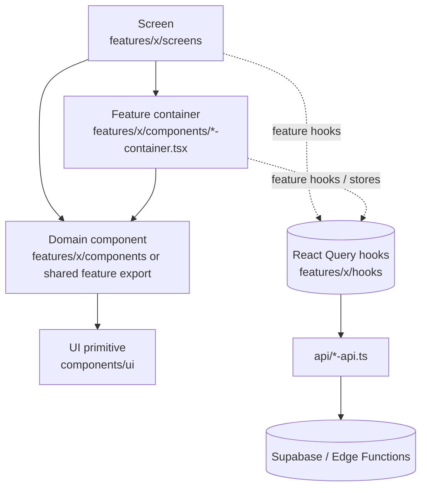
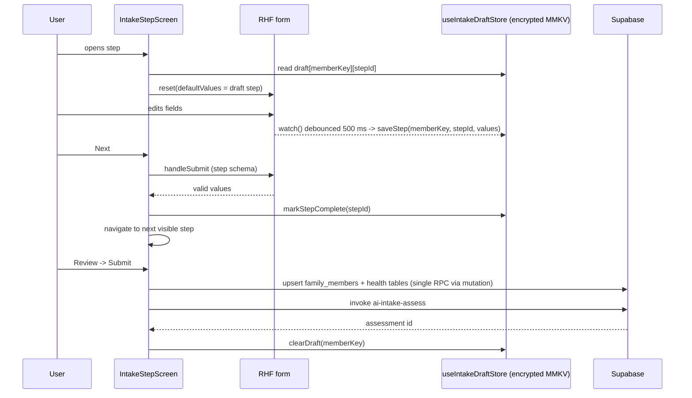
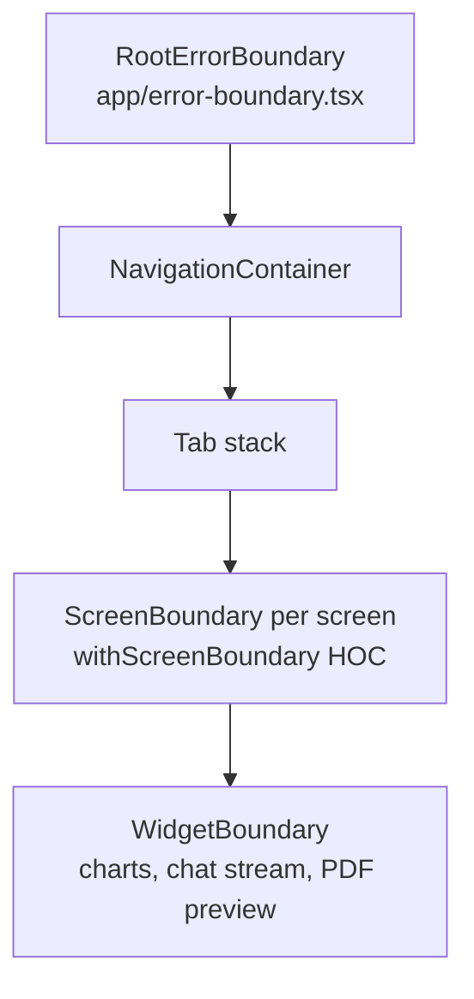

# 08 · Component Architecture

> **Status:** Approved for implementation (v1) · **Owner:** Mobile Platform · **Deliverable:** 7
>
> **Related docs:** `00-foundations.md`, `02-ux-specification.md` (screens and flows), `03-design-system.md` (tokens, typography, color, RTL), `07-react-native-folder-structure.md`, `09-state-management.md`, `12-ai-agent-architecture.md`, `15-family-health-modules.md`, `17-subscription-architecture.md`, `21-testing-strategy.md`

## Table of contents

1. [Layering](#1-layering)
2. [Data flow rules](#2-data-flow-rules)
3. [Screen anatomy](#3-screen-anatomy)
4. [UI primitives catalog](#4-ui-primitives-catalog)
5. [Domain components catalog](#5-domain-components-catalog)
6. [Form architecture](#6-form-architecture)
7. [Multi-step intake wizard](#7-multi-step-intake-wizard)
8. [List performance](#8-list-performance)
9. [Error boundaries](#9-error-boundaries)
10. [Theming with NativeWind: dark mode and RTL](#10-theming-with-nativewind-dark-mode-and-rtl)
11. [Accessibility patterns](#11-accessibility-patterns)
12. [Storybook](#12-storybook)
13. [Testing hooks and testID conventions](#13-testing-hooks-and-testid-conventions)
14. [Acceptance criteria](#14-acceptance-criteria)

---

## 1. Layering



| Layer | Location | May use | May not use | Example |
|---|---|---|---|---|
| **Screen** | `features/<f>/screens/*-screen.tsx` | Navigation params, feature hooks (queries and mutations), stores, containers, domain components, primitives | Direct `supabase` calls, raw `fetch`, inline styles with literal colors | `PlanWeekScreen` |
| **Feature container** | `features/<f>/components/*-container.tsx` | Feature hooks for **one** sub-area, stores, domain components | Navigation (receives callbacks), screen layout | `HydrationQuickLogContainer` |
| **Domain component** | `features/<f>/components/*.tsx` | Props only, primitives, `useTranslation`, `useThemeColors`, local `useState` for UI-only state | Queries, mutations, global stores, navigation | `MealCard`, `ThuluthMeter` |
| **UI primitive** | `components/ui/*.tsx` | NativeWind classes, `@/theme/*`, Reanimated, gesture handler | i18n of domain copy (labels come as props), stores, data | `Button`, `Sheet` |

Rules:

1. Dependencies point downward only. A primitive never imports a domain component; a domain component never imports a container.
2. Containers exist only when a screen would otherwise own more than about three independent queries, or when a block is reused on two screens with its own data (for example the hydration quick-log bar appears on Today and Hydration). Otherwise the screen calls hooks directly.
3. Domain components that more than one feature uses are exported from their owning feature's `index.ts` (for example `SourceCitationChip` from `features/knowledge`). They are not moved to `components/ui`.

## 2. Data flow rules

1. **Screens own queries via feature hooks.** A screen calls `useDailyMeals(planId, date)` and passes data down. Hooks wrap React Query with keys from `lib/query/query-keys.ts` (see `09-state-management.md` §3).
2. **Presentational components are pure.** Same props, same output. They receive data and callbacks (`onPress`, `onChange`), never IDs to fetch with. This makes them Storybook- and snapshot-friendly.
3. **Mutations are triggered by screens or containers**, never by domain components. A `MealServingRow` calls `onStatusChange(status)`; the screen calls `useUpdateServingStatus().mutate(...)`.
4. **Loading, empty and error states are decided at the screen.** Domain components accept a `loading?: boolean` only when they render their own skeleton shape (charts, rings).
5. **Entitlement checks** happen through `PremiumGate` or `useEntitlement()` at the screen or container. Domain components accept `locked?: boolean` when they render a teaser state.
6. **Formatting** (money, units, dates) happens in domain components through `lib/i18n/format.ts` helpers, using the raw metric and minor-unit values from props. Screens never pre-format.
7. **Active household and member** come from `useActiveHouseholdStore` in screens; domain components receive `member: FamilyMemberSummary`.
8. **No prop drilling beyond two levels.** If a value needs to go deeper, use a container or composition (`children`, render props).

## 3. Screen anatomy

```tsx
// features/hydration/screens/hydration-today-screen.tsx
import { useTranslation } from 'react-i18next';
import { Screen } from '@/components/ui/screen';
import { ErrorState } from '@/components/ui/error-state';
import { Skeleton } from '@/components/ui/skeleton';
import { useActiveHouseholdStore } from '@/stores/use-active-household-store';
import { useHydrationTarget } from '../hooks/use-hydration-target';
import { useHydrationLogs } from '../hooks/use-hydration-logs';
import { useLogHydration } from '../hooks/use-log-hydration';
import { HydrationRing } from '../components/hydration-ring';
import { HydrationQuickLogContainer } from '../components/hydration-quick-log-container';
import type { HydrationStackScreenProps } from '@/navigation/types';

export function HydrationTodayScreen({ route }: HydrationStackScreenProps<'HydrationToday'>) {
  const { t } = useTranslation('hydration');
  const activeMemberId = useActiveHouseholdStore((s) => s.activeMemberId);
  const memberId = route.params?.memberId ?? activeMemberId;   // screen is only reachable with an active member
  const target = useHydrationTarget(memberId!);
  const logs = useHydrationLogs(memberId!, route.params?.date);

  if (target.isPending || logs.isPending) return <Screen testID="hydration-today.loading"><Skeleton variant="ring" /></Screen>;
  if (target.isError || logs.isError) {
    return <ErrorState error={target.error ?? logs.error} onRetry={() => { void target.refetch(); void logs.refetch(); }} />;
  }

  return (
    <Screen title={t('today.title')} testID="hydration-today.screen">
      <HydrationRing consumedMl={logs.data.totalMl} targetMl={target.data.daily_ml} windows={target.data.schedule.windows} />
      <HydrationQuickLogContainer memberId={memberId} />
    </Screen>
  );
}
```

## 4. UI primitives catalog

All primitives:

- accept `className?: string` merged with `cn()` (`tailwind-merge` + `clsx`), and `testID?: string`;
- forward `ref` where the underlying native view is focusable;
- never hard-code colors: they use tokens from `03-design-system.md` (`bg-surface`, `text-ink`, `border-line`, `bg-primary`, `text-danger`, ...);
- accept already-translated strings (`label: string`), never i18n keys.

```ts
// components/ui/types.ts
import type { ReactNode } from 'react';
import type { AccessibilityRole } from 'react-native';

export type Size = 'sm' | 'md' | 'lg';
export type Tone = 'neutral' | 'primary' | 'success' | 'warning' | 'danger' | 'info';
export interface BaseProps { className?: string; testID?: string }
export type IconName = string; // keys of the icon set registered in components/ui/icon.tsx
export type Slot = ReactNode;
export interface A11yOverride { accessibilityLabel?: string; accessibilityHint?: string; accessibilityRole?: AccessibilityRole }
```

### 4.1 Button

```ts
export interface ButtonProps extends BaseProps, A11yOverride {
  label: string;
  onPress: () => void;
  variant?: 'primary' | 'secondary' | 'ghost' | 'destructive' | 'link';   // default 'primary'
  size?: Size;                                                            // default 'md' (min height 48)
  leftIcon?: IconName;
  rightIcon?: IconName;            // auto-mirrored in RTL when the icon is directional
  loading?: boolean;               // shows spinner, sets accessibilityState.busy, blocks presses
  disabled?: boolean;
  fullWidth?: boolean;
  haptic?: 'light' | 'medium' | 'none';  // default 'light'; disabled when sensory-calm mode is on
}
```

### 4.2 Text

```ts
export interface TextProps extends BaseProps {
  children: React.ReactNode;
  variant?: 'display' | 'title' | 'heading' | 'body' | 'bodyStrong' | 'caption' | 'label' | 'overline';
  tone?: Tone | 'muted' | 'inverse';
  script?: 'ui' | 'arabic';        // 'arabic' forces Amiri/KFGQPC + writingDirection 'rtl' for scripture (00 §9)
  align?: 'start' | 'center' | 'end';   // logical, never 'left'/'right'
  numberOfLines?: number;
  selectable?: boolean;
  maxFontSizeMultiplier?: number;  // default 1.6 (body), 1.3 (display)
  accessibilityRole?: 'header' | 'text' | 'link';
}
```

Urdu line height: when the active locale is `ur`, `Text` applies the Nastaliq line-height multiplier from `03-design-system.md` (Nastaliq glyphs need roughly 1.8x line height to avoid clipping).

### 4.3 Input

```ts
export interface InputProps extends BaseProps, Omit<import('react-native').TextInputProps, 'style' | 'onChange'> {
  label: string;
  value: string;
  onChangeText: (text: string) => void;
  helperText?: string;
  errorText?: string;              // when set: border-danger, accessibilityState invalid, announced
  leftIcon?: IconName;
  rightAccessory?: React.ReactNode;   // unit toggle, clear button
  unit?: string;                   // suffix like "kg", "ml", rendered on the logical end side
  variant?: 'text' | 'numeric' | 'otp' | 'multiline' | 'search';
  required?: boolean;
}
```

`variant="otp"` renders six cells, sets `textContentType="oneTimeCode"` and `autoComplete="sms-otp"` and accepts paste (see `11-authentication.md` §3).

### 4.4 Card

```ts
export interface CardProps extends BaseProps {
  children: React.ReactNode;
  variant?: 'elevated' | 'outlined' | 'filled';
  padding?: 'none' | 'sm' | 'md' | 'lg';
  onPress?: () => void;            // makes the card a single button target
  accessibilityLabel?: string;     // required when onPress is set (lint rule)
  header?: React.ReactNode;
  footer?: React.ReactNode;
}
```

### 4.5 Sheet

Built on `@gorhom/bottom-sheet` `BottomSheetModal`.

```ts
export interface SheetProps extends BaseProps {
  open: boolean;
  onClose: () => void;
  title?: string;
  snapPoints?: Array<string | number>;   // default ['50%', '90%']
  dismissible?: boolean;           // default true; false for blocking flows (re-auth)
  children: React.ReactNode;
  footer?: React.ReactNode;        // sticky actions, kept above keyboard
  scrollable?: boolean;            // uses BottomSheetScrollView / BottomSheetFlashList
}
```

### 4.6 Chip

```ts
export interface ChipProps extends BaseProps {
  label: string;
  selected?: boolean;
  onPress?: () => void;
  onRemove?: () => void;           // shows trailing remove icon with its own a11y label
  icon?: IconName;
  tone?: Tone;
  size?: 'sm' | 'md';
  mode?: 'filter' | 'choice' | 'input' | 'assist';  // maps to accessibilityRole: checkbox | radio | button | button
}
```

### 4.7 Avatar

```ts
export interface AvatarProps extends BaseProps {
  name: string;                    // initials fallback and a11y label
  imageUri?: string | null;        // signed URL from family_members.avatar_path
  size?: 'xs' | 'sm' | 'md' | 'lg' | 'xl';
  badge?: { icon: IconName; tone: Tone; label: string };   // e.g. module badge "Autism support"
  ring?: Tone;                     // highlight for active member
}
```

### 4.8 ProgressRing

```ts
export interface ProgressRingProps extends BaseProps {
  value: number;                   // 0..1, values above 1 render a full ring plus an overflow arc
  size?: number;                   // px, default 120
  strokeWidth?: number;            // default 10
  tone?: Tone;
  segments?: Array<{ value: number; tone: Tone; label: string }>;  // stacked arcs (ThuluthMeter uses this)
  centerSlot?: React.ReactNode;
  accessibilityLabel: string;      // required, e.g. "Water: 1.2 of 1.8 litres"
  animate?: boolean;               // default true; false when reduce motion or sensory-calm
}
```

### 4.9 Skeleton

```ts
export interface SkeletonProps extends BaseProps {
  variant?: 'line' | 'block' | 'circle' | 'card' | 'ring' | 'list-row' | 'chart';
  width?: number | `${number}%`;
  height?: number;
  lines?: number;                  // for 'line'
  count?: number;                  // repeat for lists
}
```

Shimmer is disabled when reduce motion or sensory-calm mode is on; a static muted fill is shown instead. Skeletons are `accessibilityElementsHidden` and the container announces "Loading".

### 4.10 EmptyState

```ts
export interface EmptyStateProps extends BaseProps {
  illustration?: 'plate' | 'water' | 'family' | 'grocery' | 'chat' | 'growth' | 'moon';
  title: string;
  body?: string;
  primaryAction?: { label: string; onPress: () => void };
  secondaryAction?: { label: string; onPress: () => void };
}
```

### 4.11 ErrorState

```ts
import type { AppError } from '@/lib/supabase/edge';

export interface ErrorStateProps extends BaseProps {
  error: AppError | Error | null;
  onRetry?: () => void;
  variant?: 'screen' | 'inline' | 'card';
  /** Maps error.code to localized copy via errors namespace; falls back to errors:generic. */
  titleOverride?: string;
  showSupportLink?: boolean;       // default true for 'screen'
}
```

`AppError` is the parsed Edge Function envelope `{ code, message, details }` (00 §4.2). `ErrorState` uses `t('errors:' + code, { defaultValue: t('errors:generic') })` and never renders the raw `message` from the server to the user in production.

### 4.12 Toast

```ts
export interface ToastOptions {
  message: string;
  tone?: 'neutral' | 'success' | 'warning' | 'danger';
  durationMs?: number;             // default 4000; minimum 4000 when an action is present
  action?: { label: string; onPress: () => void };   // e.g. "Undo"
  id?: string;                     // dedupe key
}
export interface ToastApi {
  show(options: ToastOptions): string;
  dismiss(id: string): void;
}
export declare function useToast(): ToastApi;
```

Toasts are announced with `AccessibilityInfo.announceForAccessibility` and are never the only feedback for a destructive or failed action.

### 4.13 Supporting primitives

| Primitive | Props summary |
|---|---|
| `Screen` | `title?`, `scroll?: boolean`, `edges?`, `headerRight?`, `testID`, `children`; applies safe area, background, keyboard avoidance |
| `Icon` | `name: IconName`, `size?`, `tone?`, `mirrorInRtl?: boolean` (default true for arrows/chevrons), `accessibilityLabel?` (decorative when absent) |
| `SegmentedControl` | `options: {value,label}[]`, `value`, `onChange` |
| `Switch` | `label`, `value`, `onValueChange`, `description?` |
| `Divider`, `Spacer`, `Badge`, `Banner` | trivial layout and status primitives |

## 5. Domain components catalog

Shared domain types used below (all derive from generated DB types in `@shared/db`):

```ts
// features/_types/domain.ts (re-exported from the owning features)
import type { Tables, Enums } from '@shared/db';

export type MealType = Enums<'meal_type'>;
export type MealStatus = Enums<'meal_status'>;
export type AcceptanceScore = Enums<'acceptance_score'>;
export type ExposureStage = Enums<'exposure_stage'>;
export type Texture = Enums<'texture'>;
export type SourceKind = Enums<'source_kind'>;
export type SourceTradition = Enums<'source_tradition'>;
export type LifeStage = Enums<'life_stage'>;

export interface FamilyMemberSummary {
  id: string;
  name: string;
  lifeStage: LifeStage;
  ageMonths: number;
  avatarUri: string | null;
  specialModules: Enums<'special_module'>[];
  isChild: boolean;                // ageMonths < 216; drives no-restriction rendering everywhere
}

export interface PlateSplit { veg: number; protein: number; carb: number }   // fractions summing to 1
export interface Money { amountMinor: number; currency: string }
```

### 5.1 PlateDiagram

Visualizes the plate method (00 §2 rule 1).

```ts
export interface PlateDiagramProps extends BaseProps {
  split: PlateSplit;               // actual or planned
  target?: PlateSplit;             // default { veg: 0.5, protein: 0.25, carb: 0.25 }
  size?: number;
  showLabels?: boolean;
  interactive?: boolean;           // tap a segment to call onSegmentPress
  onSegmentPress?: (segment: keyof PlateSplit) => void;
  accessibilityLabel?: string;     // generated if absent: "Half vegetables, a quarter protein, a quarter grains"
}
```

### 5.2 ThuluthMeter

Shows the three thirds (food, drink, space) as a **guidance visual for adults only**.

```ts
export interface ThuluthMeterProps extends BaseProps {
  mode: 'adult' | 'child';
  /** adult: self-reported fullness 1..10 after the meal (meal_logs.fullness_after). */
  fullnessAfter?: number | null;
  /** adult: fluid in the pre-meal and with-meal windows (hydration_logs.timing). */
  drinkWindowMl?: number | null;
  onCheckIn?: () => void;          // opens the "Could I eat more if I had to?" check
}
```

Child-safety rule: when `mode === 'child'` the component renders **rhythm** content only (meal time, sat at the table, Bismillah, pace) and never a fullness bar or "stop" message. Passing `fullnessAfter` with `mode === 'child'` is a TypeScript error (discriminated union in implementation) and a runtime no-op.

### 5.3 HydrationRing

```ts
export interface HydrationRingProps extends BaseProps {
  consumedMl: number;
  targetMl: number;
  windows?: Array<{ mealType: MealType; startsAt: string; endsAt: string; kind: 'pre_meal' | 'post_meal' }>;
  nextWindow?: { label: string; startsAt: string } | null;
  unit: 'metric' | 'imperial';
  fasting?: boolean;               // shows "Fasting: hydrate between iftar and suhoor" state
  loading?: boolean;
}
```

### 5.4 GrowthChart

```ts
export interface GrowthPoint { measuredOn: string; ageMonths: number; value: number; percentile: number | null; z: number | null }

export interface GrowthChartProps extends BaseProps {
  indicator: 'weight_for_age' | 'height_for_age' | 'bmi_for_age' | 'head_circumference_for_age';
  sex: Enums<'sex_at_birth'>;
  reference: 'who_2006' | 'who_2007' | 'cdc_2000';
  points: GrowthPoint[];
  percentileCurves: Array<{ percentile: 3 | 15 | 50 | 85 | 97; series: Array<{ ageMonths: number; value: number }> }>;
  unit: 'metric' | 'imperial';
  locked?: boolean;                // free tier: latest value only, chart blurred with PremiumGate teaser (00 §8)
  onPointPress?: (point: GrowthPoint) => void;
  loading?: boolean;
}
```

Rendered with `victory-native` (Skia). An accessible data table alternative is available via an "As table" toggle. No weight-loss framing for children: copy describes patterns and recommends a clinician for red flags (00 §10.2).

### 5.5 MealCard

```ts
export interface MealCardProps extends BaseProps {
  mealType: MealType;
  title: string;
  scheduledTime?: string | null;   // 'HH:mm' in household TZ
  imageUri?: string | null;
  plateSplit?: PlateSplit;
  servings: Array<{ member: FamilyMemberSummary; status: MealStatus; adapted: boolean }>;
  tags?: Array<'kid_friendly' | 'autism_friendly' | 'sunnah_food' | 'ramadan_suitable' | 'budget'>;
  waterReminder?: string | null;   // "Water 20 to 30 min before" (00 §2 rule 2)
  onPress: () => void;
  onSwap?: () => void;
}
```

### 5.6 MealServingRow

```ts
export interface MealServingRowProps extends BaseProps {
  member: FamilyMemberSummary;
  portionLabel: string;            // portions.household_measure, e.g. "1 small roti, ½ katori daal"
  adaptation: 'none' | 'autism' | 'picky' | 'allergy' | 'pregnancy';
  adaptedMealTitle?: string | null;
  status: MealStatus;
  acceptance?: AcceptanceScore | null;
  showAcceptance: boolean;         // true when member has picky_eater or autism module
  onStatusChange: (status: MealStatus) => void;
  onAcceptanceChange?: (score: AcceptanceScore) => void;
  disabled?: boolean;              // viewer role
}
```

### 5.7 AcceptanceScorePicker

```ts
export interface AcceptanceScorePickerProps extends BaseProps {
  value: AcceptanceScore | null;
  onChange: (score: AcceptanceScore) => void;
  variant?: 'faces' | 'steps';     // faces for quick logging; steps for exposure ladders
  size?: Size;
  /** Copy is always neutral and encouraging: 0_refused reads as "Not today", never failure. */
}
```

### 5.8 ExposureLadder

```ts
export interface ExposureLadderStepView {
  stepNo: number;
  stage: ExposureStage;
  foodLabel: string;
  criteria: string;
  completedOn: string | null;
  bridgeFromLabel?: string | null; // food chaining bridge
}

export interface ExposureLadderProps extends BaseProps {
  targetFoodLabel: string;
  strategy: 'exposure_ladder' | 'food_chaining';
  steps: ExposureLadderStepView[];
  currentStep: number;
  onStepPress?: (step: ExposureLadderStepView) => void;
  onLogExposure?: (step: ExposureLadderStepView) => void;
  orientation?: 'vertical' | 'horizontal';
  locked?: boolean;                // premium (00 §8)
}
```

### 5.9 SensoryProfileEditor

Controlled component mirroring `sensory_profiles`.

```ts
export interface SensoryProfileValue {
  textureLikes: Texture[];
  textureAvoids: Texture[];
  colorSensitivities: string[];
  presentationPrefs: { separateFoods: boolean; samePlateOk: boolean; cutShapes: Array<'sticks' | 'cubes' | 'rounds' | 'whole'>; dividedPlate: boolean };
  temperaturePrefs: 'cold' | 'room' | 'warm' | 'hot' | 'no_preference';
  brandRigidity: boolean;
}

export interface SensoryProfileEditorProps extends BaseProps {
  value: SensoryProfileValue;
  onChange: (value: SensoryProfileValue) => void;
  errors?: Partial<Record<keyof SensoryProfileValue, string>>;
  disabled?: boolean;
}
```

A texture cannot be in both likes and avoids; selecting it in one removes it from the other.

### 5.10 SourceCitationChip

```ts
export interface SourceCitationChipProps extends BaseProps {
  source: {
    id: string;                    // islamic_sources.id
    kind: SourceKind;
    tradition: SourceTradition;
    citationText: string;          // "Tirmidhi 2380"
    grade?: Enums<'evidence_grade_hadith'> | null;
    verified: true;                // type-level guarantee: only verified sources reach the UI (00 §10.5)
  };
  onPress: (sourceId: string) => void;   // opens knowledge source sheet
  compact?: boolean;
}

export interface EvidenceChipProps extends BaseProps {
  evidence: { id: string; citation: string; grade: Enums<'evidence_grade_science'> };
  onPress: (id: string) => void;
}
```

### 5.11 BudgetBar

```ts
export interface BudgetBarProps extends BaseProps {
  budget: Money;
  spent: Money;
  estimated?: Money;               // planned but not yet spent
  strictness: 'flexible' | 'target' | 'hard_cap';
  categories?: Array<{ code: string; label: string; spent: Money; allocated: Money }>;
  periodLabel: string;             // "October 2026"
  onCategoryPress?: (code: string) => void;
}
```

Tone thresholds: below 85 percent `success`, 85 to 100 `warning`, over 100 `danger` (over 100 with `hard_cap` also shows a banner).

### 5.12 GroceryItemRow

```ts
export interface GroceryItemRowProps extends BaseProps {
  item: {
    id: string;
    label: string;
    quantity: number;
    unit: string;
    estimated: Money | null;
    actual: Money | null;
    isChecked: boolean;
    isFresh: boolean;
    aisle: string | null;
    substitutionFor?: string | null;   // label of the original item
  };
  mode: 'planning' | 'shopping';   // shopping: larger hit area, actual price entry, swipe to check
  onToggle: (id: string, checked: boolean) => void;
  onActualPriceChange?: (id: string, amountMinor: number) => void;
  onSubstitute?: (id: string) => void;
  disabled?: boolean;
}
```

### 5.13 ChatMessageBubble

```ts
import type { AiChatStreamEvent } from '@shared/contracts';

export interface ChatAttachmentView {
  kind: 'image' | 'audio';
  uri: string;
  durationMs?: number;
  transcript?: string | null;
}

export interface ChatMessageBubbleProps extends BaseProps {
  role: 'user' | 'assistant';
  content: string;                 // markdown subset: bold, italic, lists, links
  attachments?: ChatAttachmentView[];
  status: 'sending' | 'streaming' | 'sent' | 'failed';
  citations?: SourceCitationChipProps['source'][];
  evidence?: EvidenceChipProps['evidence'][];
  safetyNotice?: { kind: 'clinician_referral' | 'scholar_referral' | 'disclaimer'; text: string } | null;
  mealAnalysis?: MealAnalysisCardProps['analysis'] | null;
  createdAt: string;
  onRetry?: () => void;
  onCitationPress: (sourceId: string) => void;
  onFeedback?: (value: 'up' | 'down') => void;
}
```

`safetyNotice` with `clinician_referral` renders as a non-dismissible banner above the content (00 §10.2).

### 5.14 ChatComposer (text, voice, photo)

```ts
export interface ChatComposerProps extends BaseProps {
  value: string;
  onChangeText: (text: string) => void;
  onSend: (payload: { text: string; attachments: ChatComposerAttachment[] }) => void;
  attachments: ChatComposerAttachment[];
  onAddPhoto: (source: 'camera' | 'library') => void;
  onRemoveAttachment: (localId: string) => void;
  voice: {
    state: 'idle' | 'recording' | 'transcribing' | 'error';
    elapsedMs: number;
    onStart: () => void;           // hold-to-record or tap-to-toggle per a11y setting
    onStop: () => void;
    onCancel: () => void;
  };
  capabilities: { voice: boolean; photo: boolean };   // false on free tier: buttons show PremiumGate (00 §8)
  disabled?: boolean;
  sending?: boolean;
  quotaRemaining?: number | null;  // shows "3 messages left today" under 5
  maxLength?: number;              // default 4000
}

export interface ChatComposerAttachment {
  localId: string;
  kind: 'image' | 'audio';
  uri: string;
  mimeType: string;
  bytes: number;
  uploadState: 'pending' | 'uploading' | 'uploaded' | 'failed';
  storagePath?: string;
}
```

Composer state lives in `useChatComposerStore` (`09-state-management.md` §5.5). Images are resized to max 1600 px long edge and JPEG quality 0.8 before upload.

### 5.15 MealAnalysisCard

```ts
export interface MealAnalysisCardProps extends BaseProps {
  analysis: {
    items: Array<{ label: string; estimatedGrams: number; confidence: number; halalNote?: string | null }>;
    plateSplit: PlateSplit;
    nutrition: { kcal: number; protein_g: number; carbs_g: number; fat_g: number; fiber_g: number } | null;
    thuluthFeedback: string;
    confidence: 'low' | 'medium' | 'high';
  };
  memberIsChild: boolean;          // true: hide kcal, show plate and variety feedback only (00 §10.3)
  onEditItem?: (index: number) => void;
  onSaveToLog?: () => void;
  onDiscard?: () => void;
}
```

### 5.16 FollowUpChips

```ts
export interface FollowUpChipsProps extends BaseProps {
  suggestions: Array<{ id: string; label: string; prompt: string }>;   // max 4 rendered
  onSelect: (prompt: string) => void;
  disabled?: boolean;
}
```

### 5.17 PaywallSheet

```ts
import type { PurchasesPackage } from 'react-native-purchases';

export interface PaywallSheetProps extends BaseProps {
  open: boolean;
  onClose: () => void;
  trigger: 'chat_quota' | 'voice' | 'photo' | 'growth_chart' | 'exposure_ladder' | 'ramadan_plan' | 'export' | 'settings' | 'onboarding';
  packages: PurchasesPackage[];    // from Purchases.getOfferings(); container passes them
  selectedPackageId: string | null;
  onSelectPackage: (id: string) => void;
  onPurchase: () => void;
  onRestore: () => void;
  purchasing: boolean;
  restoring: boolean;
  error?: string | null;
  legal: { termsUrl: string; privacyUrl: string };
}
```

The `PaywallContainer` in `features/subscription` owns RevenueCat calls and analytics; see `17-subscription-architecture.md`.

### 5.18 PremiumGate

```ts
export interface PremiumGateProps extends BaseProps {
  feature: PaywallSheetProps['trigger'];
  children: React.ReactNode;       // rendered when entitled
  fallback?: 'teaser' | 'hidden' | 'lock-badge' | React.ReactNode;   // default 'teaser'
  teaserTitle?: string;
  teaserBody?: string;
}
```

`PremiumGate` reads `useEntitlementStore(selectIsPremium)`. It is a UX device only; enforcement is server-side (00 §8).

### 5.19 FamilyMemberSwitcher

```ts
export interface FamilyMemberSwitcherProps extends BaseProps {
  members: FamilyMemberSummary[];
  activeMemberId: string | null;
  onChange: (memberId: string) => void;
  includeAll?: boolean;            // "Whole family" option for meal views
  onAddMember?: () => void;        // hidden for viewer role
  variant?: 'avatars' | 'dropdown';
}
```

### 5.20 IntakeStep

Shell used by every intake step (section 7).

```ts
export interface IntakeStepProps extends BaseProps {
  stepId: IntakeStepId;
  title: string;
  description?: string;
  index: number;                   // 1-based
  total: number;
  children: React.ReactNode;       // form fields bound to the step's RHF form
  onBack?: () => void;
  onNext: () => void;              // triggers validation
  onSkip?: () => void;             // only for optional steps
  nextLabel?: string;
  submitting?: boolean;
  savedAt?: number | null;         // shows "Draft saved" timestamp
}
```

## 6. Form architecture

Stack: `react-hook-form` v7, `@hookform/resolvers/zod`, schemas from `@shared/domain/*` when the server validates the same shape, otherwise from `features/<f>/schemas`.

Rules:

1. One `useForm` per screen or wizard step. Form type is `z.input<typeof schema>`; submit handler receives `z.output<typeof schema>`.
2. `mode: 'onTouched'`, `reValidateMode: 'onChange'`, `shouldFocusError: true`.
3. Field components in `components/form/` wrap primitives with `useController` and map `fieldState.error.message` (an i18n key) through `t()`.
4. Zod error messages are **i18n keys**, not prose: `z.string().min(1, 'validation:required')`.
5. Units: forms collect values in the user's units (`users.units`), the schema `transform`s to metric before submit (00 §4.1).
6. Server errors returned as the envelope with `details.fieldErrors` are mapped back with `setError` for each field.

```ts
// packages/shared/src/domain/family-member.ts
import { z } from 'zod';
import { SEX_AT_BIRTH, ACTIVITY_LEVELS, SPECIAL_MODULES } from '../enums.ts';

export const familyMemberBasicsSchema = z.object({
  name: z.string().trim().min(1, 'validation:required').max(60, 'validation:too_long'),
  date_of_birth: z.string().date('validation:invalid_date')
    .refine((d) => new Date(d) <= new Date(), 'validation:future_date'),
  sex_at_birth: z.enum(SEX_AT_BIRTH),
  activity_level: z.enum(ACTIVITY_LEVELS),
  special_modules: z.array(z.enum(SPECIAL_MODULES)).default([]),
});
export type FamilyMemberBasicsInput = z.input<typeof familyMemberBasicsSchema>;
```

```tsx
// components/form/form-text-field.tsx
import { useController, type Control, type FieldPath, type FieldValues } from 'react-hook-form';
import { useTranslation } from 'react-i18next';
import { Input, type InputProps } from '@/components/ui/input';

interface FormTextFieldProps<T extends FieldValues> extends Omit<InputProps, 'value' | 'onChangeText' | 'errorText'> {
  control: Control<T>;
  name: FieldPath<T>;
}

export function FormTextField<T extends FieldValues>({ control, name, ...rest }: FormTextFieldProps<T>) {
  const { t } = useTranslation();
  const { field, fieldState } = useController({ control, name });
  return (
    <Input
      {...rest}
      value={field.value ?? ''}
      onChangeText={field.onChange}
      onBlur={field.onBlur}
      errorText={fieldState.error?.message ? t(fieldState.error.message) : undefined}
      testID={rest.testID ?? `field.${String(name)}`}
    />
  );
}
```

## 7. Multi-step intake wizard

The intake collects everything `ai-intake-assess` needs per family member. Copy, step order and branching rules for each screen are in `02-ux-specification.md`; this section defines the mechanism.

### 7.1 Steps and schemas

```ts
// packages/shared/src/domain/intake.ts
import { z } from 'zod';

export const INTAKE_STEPS = [
  'basics',          // name, DOB, sex at birth, relationship
  'body',            // height, weight, activity level (weight optional for children if unknown)
  'schedule',        // work/school schedule, sleep schedule
  'health',          // medical conditions, medications, supplements
  'allergies',       // allergies and intolerances with severity
  'preferences',     // likes, dislikes, safe foods
  'modules',         // pregnancy, breastfeeding, autism, adhd, picky_eater
  'sensory',         // only if autism or picky_eater selected
  'pregnancy',       // only if pregnancy selected
  'goals',           // goals filtered by life stage: no weight_loss for <18
  'review',
] as const;
export type IntakeStepId = (typeof INTAKE_STEPS)[number];

export const intakeGoalsSchema = (ctx: { ageYears: number }) =>
  z.object({
    goals: z.array(z.object({
      goal_type: z.enum(['weight_loss','weight_gain','maintain','child_growth','energy','digestive_health',
        'pregnancy_support','breastfeeding_support','blood_sugar','heart_health']),
      is_primary: z.boolean(),
    })).min(1, 'validation:pick_one'),
  }).superRefine((v, c) => {
    if (ctx.ageYears < 18 && v.goals.some((g) => g.goal_type === 'weight_loss' || g.goal_type === 'weight_gain')) {
      c.addIssue({ code: 'custom', path: ['goals'], message: 'validation:child_no_weight_goal' });  // 00 §2.5, §10.3
    }
  });

export const intakeStepSchemas = {
  basics: familyMemberBasicsSchema,
  body: intakeBodySchema,
  schedule: intakeScheduleSchema,
  health: intakeHealthSchema,
  allergies: intakeAllergiesSchema,
  preferences: intakePreferencesSchema,
  modules: intakeModulesSchema,
  sensory: intakeSensorySchema,
  pregnancy: intakePregnancySchema,
  goals: intakeGoalsSchema,       // factory, called with member context
  review: z.object({ confirmed: z.literal(true) }),
} as const;
```

(The individual step schemas are defined in the same file following the column lists in 00 §6.)

### 7.2 Branching

```ts
// features/intake/utils/visible-steps.ts
export function visibleSteps(draft: IntakeDraft): IntakeStepId[] {
  const modules = draft.modules?.special_modules ?? [];
  const ageYears = draft.basics?.date_of_birth ? ageInYears(draft.basics.date_of_birth) : null;
  return INTAKE_STEPS.filter((s) => {
    if (s === 'sensory') return modules.includes('autism') || modules.includes('picky_eater');
    if (s === 'pregnancy') return modules.includes('pregnancy') && ageYears !== null && ageYears >= 18;
    return true;
  });
}
```

Under-18 members cannot select `pregnancy` or `breastfeeding` modules in the app (the step hides them); this is a product scope decision, and clinician referral copy is shown instead.

### 7.3 Draft persistence



- Drafts are keyed by `memberKey` = existing `family_member_id`, or a client UUID for a new member.
- Drafts survive app kill and sign-in refresh, are encrypted at rest (health data), and are **deleted on sign-out** and after successful submit.
- Drafts older than 30 days are discarded on load with a toast.
- Store contract in `09-state-management.md` §5.4.

### 7.4 Wizard controller

```tsx
// features/intake/hooks/use-intake-step.ts
export function useIntakeStep<S extends IntakeStepId>(memberKey: string, stepId: S, ctx: IntakeContext) {
  const draft = useIntakeDraftStore((s) => s.drafts[memberKey]);
  const saveStep = useIntakeDraftStore((s) => s.saveStep);
  const schema = resolveStepSchema(stepId, ctx);
  const form = useForm({
    resolver: zodResolver(schema),
    defaultValues: (draft?.steps[stepId] ?? defaultsFor(stepId)) as z.input<typeof schema>,
    mode: 'onTouched',
  });

  useEffect(() => {
    const sub = form.watch(debounce((values) => saveStep(memberKey, stepId, values), 500));
    return () => sub.unsubscribe();
  }, [form, memberKey, stepId, saveStep]);

  const steps = visibleSteps(draft?.steps ?? {});
  const index = steps.indexOf(stepId);
  return { form, steps, index, total: steps.length, next: steps[index + 1], prev: steps[index - 1] };
}
```

## 8. List performance

Use `@shopify/flash-list` v2 for every list that can exceed 20 rows or contains images: daily meals per week, recipes, grocery items, chat messages, hydration history, exposure logs, notifications.

| List | Notes |
|---|---|
| Chat messages | FlashList with `inverted={false}`, `maintainVisibleContentPosition` and `startRenderingFromBottom` (v2 API). Streaming bubble is a separate item keyed `streaming`. |
| Grocery list | Sectioned by aisle: flatten to `[{type:'header'},{type:'item'}]` and use `getItemType`. |
| Week plan | Seven day sections, each a `MealCard` row; `getItemType` distinguishes day header and meal. |
| Recipes | Two-column grid with `numColumns={2}`, images via `expo-image` with `recyclingKey`. |

Rules:

1. Row components are wrapped in `React.memo` and receive primitive or stable props; callbacks are created with `useCallback` in the screen and take an ID argument (`onToggle(id)`), never closures per row.
2. `keyExtractor` returns the row's database `id`.
3. No inline object or array literals as props inside `renderItem`.
4. Images: `expo-image` with `cachePolicy="memory-disk"` and signed URLs cached in React Query for 50 minutes (URLs expire at 60).
5. Lists inside sheets use `BottomSheetFlashList`.
6. Each list screen has a reassure performance test (21-testing-strategy.md §13).

## 9. Error boundaries



| Boundary | Catches | Fallback | Reset |
|---|---|---|---|
| `RootErrorBoundary` | Provider and navigator crashes | Unthemed, i18n-safe screen (English plus Urdu static text) with "Restart" (`expo-updates` `reloadAsync`) | Restart |
| `ScreenBoundary` | Render errors in one screen | `ErrorState variant="screen"` with retry and back | `resetKeys = [route.key]`; retry also calls `queryClient.resetQueries` for keys used by the screen via `QueryErrorResetBoundary` |
| `WidgetBoundary` | Isolated heavy components | `ErrorState variant="card"` | Retry button |

```tsx
// app/error-boundary.tsx (shape)
import * as Sentry from '@sentry/react-native';
import { ErrorBoundary, type FallbackProps } from 'react-error-boundary';
import { QueryErrorResetBoundary } from '@tanstack/react-query';

export function withScreenBoundary<P extends object>(Screen: React.ComponentType<P>, name: string) {
  return function Bounded(props: P) {
    return (
      <QueryErrorResetBoundary>
        {({ reset }) => (
          <ErrorBoundary
            onReset={reset}
            onError={(error, info) => Sentry.captureException(error, { tags: { screen: name }, extra: { componentStack: info.componentStack } })}
            FallbackComponent={ScreenFallback}
          >
            <Screen {...props} />
          </ErrorBoundary>
        )}
      </QueryErrorResetBoundary>
    );
  };
}
```

React Query `throwOnError` is `false` by default; screens render `ErrorState` for query errors. Boundaries are for unexpected render errors. Errors are reported to Sentry with PII scrubbed (`lib/sentry/scrub.ts`).

## 10. Theming with NativeWind: dark mode and RTL

### 10.1 Tokens

`packages/config/tailwind/preset.js` defines semantic color tokens as CSS variables so dark mode is a variable swap, not a class duplication. Token names and values are specified in `03-design-system.md`.

```js
// packages/config/tailwind/preset.js (shape)
module.exports = {
  darkMode: 'class',
  theme: {
    extend: {
      colors: {
        surface: 'rgb(var(--color-surface) / <alpha-value>)',
        'surface-raised': 'rgb(var(--color-surface-raised) / <alpha-value>)',
        ink: 'rgb(var(--color-ink) / <alpha-value>)',
        'ink-muted': 'rgb(var(--color-ink-muted) / <alpha-value>)',
        line: 'rgb(var(--color-line) / <alpha-value>)',
        primary: 'rgb(var(--color-primary) / <alpha-value>)',
        'on-primary': 'rgb(var(--color-on-primary) / <alpha-value>)',
        success: 'rgb(var(--color-success) / <alpha-value>)',
        warning: 'rgb(var(--color-warning) / <alpha-value>)',
        danger: 'rgb(var(--color-danger) / <alpha-value>)',
        info: 'rgb(var(--color-info) / <alpha-value>)',
        'plate-veg': 'rgb(var(--color-plate-veg) / <alpha-value>)',
        'plate-protein': 'rgb(var(--color-plate-protein) / <alpha-value>)',
        'plate-carb': 'rgb(var(--color-plate-carb) / <alpha-value>)',
        water: 'rgb(var(--color-water) / <alpha-value>)',
      },
      fontFamily: { ui: ['Inter'], urdu: ['NotoNastaliqUrdu'], arabic: ['Amiri'] },
    },
  },
};
```

### 10.2 Dark mode

- `usePreferencesStore.theme` is `'system' | 'light' | 'dark'`. `ThemeProvider` calls NativeWind `colorScheme.set(theme)`.
- `theme/use-theme-colors.ts` returns resolved token hex values for SVG, charts and React Navigation theme.
- Sensory-calm mode (`usePreferencesStore.sensoryCalm`) adds the `calm` class at the root: lower saturation palette, no shimmer, no haptics, no confetti, reduced motion regardless of OS setting.

### 10.3 RTL

- `ur` (MVP) and `ar` (Phase 2) are RTL. `lib/i18n/rtl.ts` calls `I18nManager.allowRTL(true)` and `I18nManager.forceRTL(isRtl)`; when direction changes, it persists the locale and calls `Updates.reloadAsync()` (RN requires a reload to flip layout).
- Use **logical** utilities only: `ps-*`, `pe-*`, `ms-*`, `me-*`, `start-*`, `end-*`, `text-start`, `text-end`, `rounded-s-*`, `rounded-e-*`, `border-s`, `border-e`. ESLint rule (custom, in `@thuluth/config/eslint`) forbids `pl-`, `pr-`, `ml-`, `mr-`, `left-`, `right-`, `text-left`, `text-right` in className strings.
- Directional icons (`chevron`, `arrow`, `back`) use `Icon mirrorInRtl`. Non-directional icons (clock, check, plate) never flip.
- Numbers: Urdu UI uses Western Arabic digits by default (common in Pakistani apps); a preference for Urdu digits is Phase 2. Phone numbers, quantities and prices render in an LTR isolate (`⁦...⁩`).
- Arabic scripture (`Text script="arabic"`) always renders RTL with Amiri, independent of UI locale.
- Charts (`GrowthChart`, `BudgetBar`) keep time flowing left to right in both directions (a deliberate convention, matching common practice for charts in RTL apps); axis labels and legends move to logical positions.

## 11. Accessibility patterns

Target: WCAG 2.2 AA equivalent on mobile, plus autism-friendly considerations.

| Pattern | Rule |
|---|---|
| Touch targets | Minimum 48 x 48 dp; `hitSlop` to reach it on small icons. |
| Labels | Every interactive element has `accessibilityLabel` (from props or visible text). Icon-only buttons require it (TypeScript: `IconButtonProps.accessibilityLabel: string`). |
| Roles and states | `accessibilityRole` on all controls; `accessibilityState` for `selected`, `checked`, `disabled`, `busy`, `expanded`. |
| Dynamic type | Text scales with OS font size up to `maxFontSizeMultiplier`; layouts tested at 200 percent. |
| Contrast | 4.5:1 for body text, 3:1 for large text and UI glyphs, in light, dark and calm palettes (verified in `03-design-system.md`). |
| Motion | Respect `AccessibilityInfo.isReduceMotionEnabled` via `useReducedMotion`; sensory-calm mode forces reduced motion. |
| Announcements | Async results (plan generated, item checked, error) announced via `announceForAccessibility`. |
| Focus | On screen mount, focus moves to the screen title (`accessibilityRole="header"`). Sheets trap focus and return it on close. |
| Grouping | Cards with one primary action use `accessible` on the container with a composed label; secondary actions exposed through `accessibilityActions`. |
| Charts and rings | Provide summary label and a "view as table" alternative. |
| Forms | Error text linked via label; first invalid field focused on submit. |
| Language | Text in a different language from the UI (Arabic scripture in an English UI) sets `accessibilityLanguage` (`'ar'`) so screen readers switch voice. |
| Autism-friendly | Predictable layouts, no surprise sounds, no auto-playing animation, literal copy, optional visual schedules in the autism module. |

Lint: `eslint-plugin-react-native-a11y` (`has-valid-accessibility-role`, `has-accessibility-hint` warnings, `no-nested-touchables`).

## 12. Storybook

- `@storybook/react-native` v8 on-device, toggled by `EXPO_PUBLIC_STORYBOOK=1` in the development build profile. `index.ts` swaps the root component when the flag is set.
- Stories colocated: `button.stories.tsx` next to `button.tsx`. Every primitive and every domain component in section 5 has stories covering: default, loading, empty, error, locked (where applicable), long text, RTL (`ur`), dark mode, and child mode for `ThuluthMeter` and `MealAnalysisCard`.
- Global decorators in `.storybook/preview.tsx`: `ThemeProvider`, `I18nProvider`, safe area, and toolbar args for `locale` (`en`/`ur`), `theme` (`light`/`dark`), `calm` (`on`/`off`).
- Stories double as test fixtures: `composeStories` from `@storybook/react` (portable stories) is used in Jest to render each story for snapshot and a11y assertions (`21-testing-strategy.md` §5).

```tsx
// components/ui/button.stories.tsx
import type { Meta, StoryObj } from '@storybook/react';
import { Button } from './button';

const meta = { component: Button, args: { label: 'Generate plan', onPress: () => {} } } satisfies Meta<typeof Button>;
export default meta;
type Story = StoryObj<typeof meta>;

export const Primary: Story = {};
export const Loading: Story = { args: { loading: true } };
export const Destructive: Story = { args: { variant: 'destructive', label: 'Delete account' } };
export const LongUrdu: Story = { args: { label: 'ہفتہ وار کھانے کا منصوبہ بنائیں' }, parameters: { locale: 'ur' } };
```

## 13. Testing hooks and testID conventions

### 13.1 testID format

`<scope>.<element>[.<qualifier>]`, lowercase kebab inside segments, dot-separated.

| Element | Pattern | Example |
|---|---|---|
| Screen root | `<feature>-<screen>.screen` | `plan-week.screen` |
| Loading state | `<feature>-<screen>.loading` | `hydration-today.loading` |
| Primary button | `<feature>-<screen>.<action>-button` | `intake-basics.next-button` |
| Form field | `field.<name>` (auto from `FormTextField`) | `field.date_of_birth` |
| List row | `<list>.row.<id>` | `grocery-list.row.4b1c...` |
| Row sub-control | `<list>.row.<id>.<control>` | `grocery-list.row.4b1c.checkbox` |
| Tab | `tab.<name>` | `tab.chat` |
| Sheet | `sheet.<name>` | `sheet.paywall` |
| Toast | `toast.<tone>` | `toast.success` |

Rules:

1. Every screen root, primary action, form field, tab and sheet has a testID. Maestro flows rely on them (`21-testing-strategy.md` §10); text matching is a fallback only, since copy changes and Urdu runs must pass.
2. Primitives accept `testID` and derive sub-IDs: `Button` passes `${testID}` to the pressable and `${testID}.spinner` to the spinner; `Input` adds `${testID}.error`.
3. testIDs are stable across locales and themes and never contain user data except database UUIDs.
4. Production builds keep testIDs (Maestro runs against release-like `preview` builds).

### 13.2 Test utilities

```tsx
// src/test/render.tsx
export function renderWithProviders(ui: React.ReactElement, opts: {
  locale?: 'en' | 'ur';
  theme?: 'light' | 'dark';
  premium?: boolean;
  queryClient?: QueryClient;
  activeHousehold?: { householdId: string; memberId?: string; role?: 'owner' | 'caregiver' | 'viewer' | 'coach' };
} = {}) { /* wraps I18n, Theme, QueryClient (retry: false), NavigationContainer, seeds stores */ }
```

Hooks are tested with `renderHook` from `@testing-library/react-native` inside the same wrapper, with MSW intercepting PostgREST and Edge Function calls.

## 14. Acceptance criteria

1. Every component in sections 4 and 5 exists with the exact props interface (names and types), a story set per section 12 and at least one unit test.
2. ESLint blocks queries, mutations, store access and navigation inside `components/ui` and inside files named as domain components (enforced by `boundaries` element types).
3. No physical direction classes (`pl-`, `mr-`, `text-left`, ...) in the codebase; RTL snapshot suite passes for `ur`.
4. All screens are wrapped with `withScreenBoundary`; an injected render error shows the screen fallback and reports to Sentry with the `screen` tag.
5. `ThuluthMeter`, `MealAnalysisCard`, `GrowthChart` and the goals intake step never render calorie targets, fullness stop messages or weight-loss options for a member under 18 (unit tests per component, plus AI eval coverage for generated content).
6. Intake drafts restore after force-quit at every step, and are gone after sign-out.
7. Lists in section 8 hold 55+ fps on a Pixel 6a while scrolling 200 rows (Flashlight score per `21-testing-strategy.md` §13).
