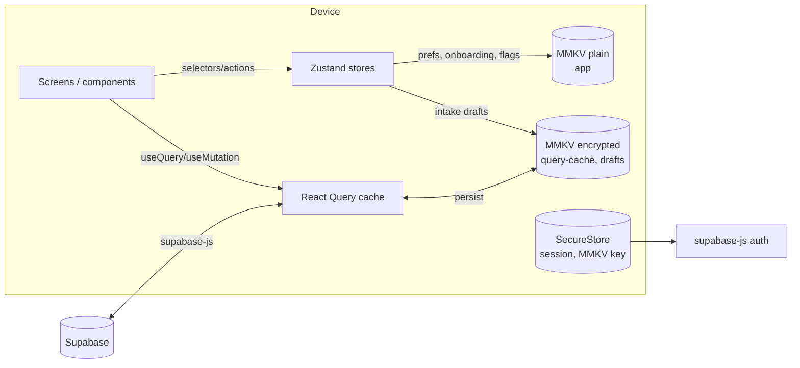
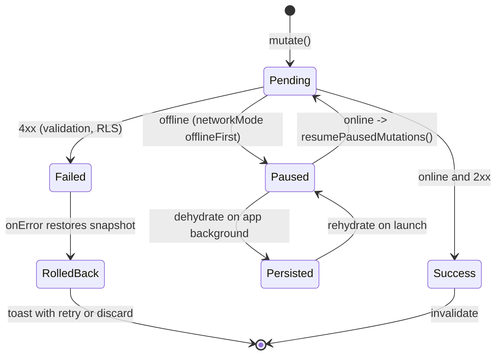
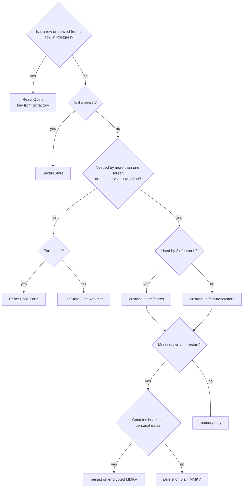

# 09 · State Management

> **Status:** Approved for implementation (v1) · **Owner:** Mobile Platform · **Deliverable:** 8 (Zustand Store Design)
>
> **Related docs:** `00-foundations.md`, `05-database-schema.md`, `06-api-specification.md`, `07-react-native-folder-structure.md`, `08-component-architecture.md`, `11-authentication.md`, `16-security-architecture.md`, `17-subscription-architecture.md`, `21-testing-strategy.md`

## Table of contents

1. [Principles and the server/client split](#1-principles-and-the-serverclient-split)
2. [React Query setup](#2-react-query-setup)
3. [Query key factory](#3-query-key-factory)
4. [Mutation patterns, optimistic updates and the offline queue](#4-mutation-patterns-optimistic-updates-and-the-offline-queue)
5. [Zustand stores](#5-zustand-stores)
6. [Persistence: MMKV, versioning, migrations, never-persisted data](#6-persistence-mmkv-versioning-migrations-never-persisted-data)
7. [Selectors, slices and devtools](#7-selectors-slices-and-devtools)
8. [Reset on sign-out and household switch](#8-reset-on-sign-out-and-household-switch)
9. [Testing stores and queries](#9-testing-stores-and-queries)
10. [Decision rules: where state goes](#10-decision-rules-where-state-goes)
11. [Acceptance criteria](#11-acceptance-criteria)
12. [Additions beyond 00-foundations](#12-additions-beyond-00-foundations)

---

## 1. Principles and the server/client split

| Kind of state | Owner | Examples | Persistence |
|---|---|---|---|
| **Server state** (anything with a row in Postgres) | TanStack React Query v5 | meal plans, daily meals, servings, hydration logs, grocery items, chat messages, family members, subscription row | React Query cache persisted to **encrypted** MMKV for offline reads |
| **Client state** (device- or session-local, not a database row) | Zustand v5 | active household, theme, locale, onboarding progress, intake drafts, composer text, shopping mode UI, entitlement mirror | Selected stores persisted to MMKV via `persist` |
| **Form state** | React Hook Form | field values, validation | Not persisted, except intake drafts (via `useIntakeDraftStore`) |
| **Ephemeral component state** | `useState` / `useReducer` | sheet open, segment selected, animation | None |
| **Navigation state** | React Navigation | current route, params | Not persisted in v1 |
| **Secrets** | `expo-secure-store` only | Supabase session (access + refresh token), MMKV encryption key | Keychain / Keystore |

Hard rules:

1. **Never copy server data into Zustand.** If a component needs server data, it uses a query hook. The only exceptions are explicit mirrors listed in section 5 (`useEntitlementStore`, `useFeatureFlagStore`) whose purpose is synchronous reads during startup; both are refreshed from the server and never written back.
2. **Zustand never holds tokens.** `useSessionStore` holds status and user id only; the Supabase client owns the session through the secure storage adapter (`11-authentication.md` §7).
3. **Every query is household-scoped in its key** when the data is household-scoped, so switching households never shows the previous household's cached data.
4. **Health data at rest is encrypted.** The persisted query cache and intake drafts use an encrypted MMKV instance; plain MMKV holds only preferences and non-sensitive flags.



## 2. React Query setup

```ts
// apps/mobile/src/lib/query/query-client.ts
import { QueryClient, MutationCache, QueryCache, onlineManager, focusManager } from '@tanstack/react-query';
import NetInfo from '@react-native-community/netinfo';
import { AppState, type AppStateStatus } from 'react-native';
import * as Sentry from '@sentry/react-native';
import { isAppError } from '@/lib/supabase/edge';
import { registerOfflineMutationDefaults } from './offline-mutations';

onlineManager.setEventListener((setOnline) =>
  NetInfo.addEventListener((s) => setOnline(Boolean(s.isConnected && s.isInternetReachable !== false))),
);

AppState.addEventListener('change', (status: AppStateStatus) => focusManager.setFocused(status === 'active'));

export const queryClient = new QueryClient({
  queryCache: new QueryCache({
    onError: (error, query) => {
      if (isAppError(error) && error.code === 'UNAUTHENTICATED') return; // handled by auth provider
      Sentry.captureException(error, { tags: { queryKey: String(query.queryKey[0]) } });
    },
  }),
  mutationCache: new MutationCache({
    onError: (error, _v, _c, mutation) =>
      Sentry.captureException(error, { tags: { mutationKey: String(mutation.options.mutationKey?.[0]) } }),
  }),
  defaultOptions: {
    queries: {
      staleTime: 60_000,                 // 1 minute default; overridden per resource below
      gcTime: 1000 * 60 * 60 * 24 * 7,   // 7 days, must be >= persister maxAge for offline reads
      retry: (count, error) => !(isAppError(error) && ['FORBIDDEN', 'NOT_FOUND', 'VALIDATION_FAILED'].includes(error.code)) && count < 2,
      networkMode: 'offlineFirst',
      refetchOnWindowFocus: true,        // = app foreground via focusManager
    },
    mutations: { networkMode: 'offlineFirst', retry: 0 },
  },
});

registerOfflineMutationDefaults(queryClient);
```

Persistence:

```ts
// apps/mobile/src/lib/query/persister.ts
import { createAsyncStoragePersister } from '@tanstack/query-async-storage-persister';
import type { MMKV } from 'react-native-mmkv';

export function createQueryPersister(store: MMKV) {
  return createAsyncStoragePersister({
    key: 'rq-cache',
    throttleTime: 1000,
    storage: {
      getItem: async (k) => store.getString(k) ?? null,
      setItem: async (k, v) => store.set(k, v),
      removeItem: async (k) => store.delete(k),
    },
  });
}
```

```tsx
// apps/mobile/src/app/providers/query-provider.tsx (shape)
<PersistQueryClientProvider
  client={queryClient}
  persistOptions={{
    persister,                           // created after the MMKV key is read from SecureStore
    maxAge: 1000 * 60 * 60 * 24 * 7,
    buster: `${APP_VERSION}:${SCHEMA_CACHE_VERSION}`,   // bump SCHEMA_CACHE_VERSION when row shapes change
    dehydrateOptions: {
      shouldDehydrateQuery: (q) => q.state.status === 'success' && q.meta?.persist !== false,
      shouldDehydrateMutation: (m) => m.state.isPaused,   // keep paused offline mutations
    },
  }}
  onSuccess={() => queryClient.resumePausedMutations().then(() => queryClient.invalidateQueries())}
>
```

Queries with `meta: { persist: false }`: signed storage URLs, chat streaming state, offerings from RevenueCat, prices freshness checks.

Per-resource `staleTime` defaults:

| Resource group | staleTime | Reason |
|---|---|---|
| Global catalog (ingredients, recipes, allergens, islamic sources, recommendations, coaching tips, budget categories) | 24 h | Admin-managed, changes rarely |
| Plans, daily meals, grocery lists | 5 min | Edited by other household members; Realtime invalidation keeps them fresh |
| Servings, hydration logs, fasting logs, meal logs, shopping items | 30 s | High-frequency logging, multi-caregiver |
| Chat sessions list | 1 min | |
| Chat messages | `Infinity` while the thread is open; updated by stream events | |
| Subscription, feature flags | 5 min | Also refreshed on foreground |
| Profile, household, members | 5 min | |

Realtime: `features/household/hooks/use-household-realtime.ts` subscribes to Postgres changes for the active household on `daily_meal_servings`, `shopping_items`, `hydration_logs`, `meal_plans` (filter `household_id=eq.<id>`) and calls `queryClient.invalidateQueries({ queryKey: qk.household(id).<resource>() })`. It never writes payloads into the cache directly (RLS-checked refetch is the source of truth).

## 3. Query key factory

One factory for the entire app. Keys are arrays starting with a scope, so invalidation can target a household, a member, or a single resource.

```ts
// apps/mobile/src/lib/query/query-keys.ts
type Id = string;
type IsoDate = string; // 'YYYY-MM-DD'

export const qk = {
  // ---------- identity ----------
  me: () => ['me'] as const,
  profile: () => [...qk.me(), 'profile'] as const,                      // users row
  consents: () => [...qk.me(), 'consents'] as const,
  devices: () => [...qk.me(), 'devices'] as const,
  subscription: () => [...qk.me(), 'subscription'] as const,            // subscriptions row
  aiUsageToday: () => [...qk.me(), 'ai-usage', 'today'] as const,       // quota counter
  notificationPrefs: () => [...qk.me(), 'notification-preferences'] as const,
  notifications: (filter: { unreadOnly?: boolean } = {}) => [...qk.me(), 'notifications', filter] as const,
  households: () => [...qk.me(), 'households'] as const,                // memberships list with role
  exports: () => [...qk.me(), 'exports'] as const,

  // ---------- household-scoped ----------
  household: (hid: Id) => {
    const base = ['household', hid] as const;
    return {
      all: () => base,
      detail: () => [...base, 'detail'] as const,
      members: () => [...base, 'household-members'] as const,
      invitations: () => [...base, 'invitations'] as const,
      familyMembers: () => [...base, 'family-members'] as const,
      budgetProfile: () => [...base, 'budget-profile'] as const,
      budgetEntries: (month: string) => [...base, 'budget-entries', month] as const,      // 'YYYY-MM'
      budgetSummary: (month: string) => [...base, 'budget-summary', month] as const,
      assessments: (memberId?: Id) => [...base, 'ai-assessments', memberId ?? 'household'] as const,
      mealPlans: (filter: { status?: string } = {}) => [...base, 'meal-plans', filter] as const,
      mealPlan: (planId: Id) => [...base, 'meal-plans', 'detail', planId] as const,
      activePlan: () => [...base, 'meal-plans', 'active'] as const,
      dailyMeals: (planId: Id, date: IsoDate) => [...base, 'daily-meals', planId, date] as const,
      dailyMealsWeek: (planId: Id, weekStart: IsoDate) => [...base, 'daily-meals', planId, 'week', weekStart] as const,
      servings: (dailyMealId: Id) => [...base, 'daily-meal-servings', dailyMealId] as const,
      planRecommendations: (planId: Id) => [...base, 'plan-recommendations', planId] as const,
      groceryLists: (filter: { status?: string } = {}) => [...base, 'grocery-lists', filter] as const,
      groceryList: (listId: Id) => [...base, 'grocery-lists', 'detail', listId] as const,
      shoppingItems: (listId: Id) => [...base, 'shopping-items', listId] as const,
      ramadanPlans: () => [...base, 'ramadan-plans'] as const,
      ramadanPlan: (hijriYear: number) => [...base, 'ramadan-plans', hijriYear] as const,
      chatSessions: () => [...base, 'chat-sessions'] as const,
      chatMessages: (sessionId: Id) => [...base, 'chat-messages', sessionId] as const,
      todaySummary: (date: IsoDate) => [...base, 'today', date] as const,   // composed view hook
    };
  },

  // ---------- family-member-scoped (always under household for isolation) ----------
  member: (hid: Id, mid: Id) => {
    const base = ['household', hid, 'member', mid] as const;
    return {
      all: () => base,
      detail: () => [...base, 'detail'] as const,
      medicalConditions: () => [...base, 'medical-conditions'] as const,
      allergies: () => [...base, 'allergies'] as const,
      medications: () => [...base, 'medications'] as const,
      supplements: () => [...base, 'supplements'] as const,
      foodPreferences: () => [...base, 'food-preferences'] as const,
      foodDislikes: () => [...base, 'food-dislikes'] as const,
      nutritionGoals: () => [...base, 'nutrition-goals'] as const,
      pregnancyProfile: () => [...base, 'pregnancy-profile'] as const,
      sensoryProfile: () => [...base, 'sensory-profile'] as const,
      hydrationTarget: () => [...base, 'hydration-target'] as const,
      hydrationLogs: (date: IsoDate) => [...base, 'hydration-logs', date] as const,
      hydrationRange: (from: IsoDate, to: IsoDate) => [...base, 'hydration-logs', 'range', from, to] as const,
      fastingLogs: (from: IsoDate, to: IsoDate) => [...base, 'fasting-logs', from, to] as const,
      activeFast: () => [...base, 'fasting-logs', 'active'] as const,
      mealLogs: (date: IsoDate) => [...base, 'meal-logs', date] as const,
      growth: () => [...base, 'growth-tracking'] as const,
      growthCurves: (indicator: string, reference: string) => [...base, 'growth-curves', indicator, reference] as const,
      weight: () => [...base, 'weight-tracking'] as const,
      journal: (date: IsoDate) => [...base, 'nutrition-journal', date] as const,
      exposures: (filter: { ingredientId?: Id } = {}) => [...base, 'food-exposures', filter] as const,
      ladders: () => [...base, 'exposure-ladders'] as const,
      ladder: (ladderId: Id) => [...base, 'exposure-ladders', ladderId] as const,
      memories: () => [...base, 'ai-memories'] as const,
    };
  },

  // ---------- global catalog (not household-scoped) ----------
  catalog: {
    all: () => ['catalog'] as const,
    ingredients: (q: { search?: string; category?: string } = {}) => ['catalog', 'ingredients', q] as const,
    ingredient: (id: Id) => ['catalog', 'ingredients', 'detail', id] as const,
    allergens: () => ['catalog', 'allergens'] as const,
    recipes: (q: { mealType?: string; search?: string; tags?: string[] } = {}) => ['catalog', 'recipes', q] as const,
    recipe: (id: Id) => ['catalog', 'recipes', 'detail', id] as const,
    meal: (id: Id) => ['catalog', 'meals', id] as const,
    portions: (mealOrRecipeId: Id) => ['catalog', 'portions', mealOrRecipeId] as const,
    mealAlternatives: (mealId: Id) => ['catalog', 'meal-alternatives', mealId] as const,
    budgetCategories: () => ['catalog', 'budget-categories'] as const,
    regions: (country: string) => ['catalog', 'regions', country] as const,
    seasonalProduce: (regionId: Id, month: number) => ['catalog', 'seasonal-produce', regionId, month] as const,
    priceProfile: (regionId: Id, city?: string) => ['catalog', 'price-profiles', regionId, city ?? 'region'] as const,
    coachingTips: (module: string, ageMonths: number) => ['catalog', 'coaching-tips', module, ageMonths] as const,
    growthReference: (ref: string, indicator: string, sex: string) => ['catalog', 'growth-reference-lms', ref, indicator, sex] as const,
  },

  knowledge: {
    all: () => ['knowledge'] as const,
    source: (islamicSourceId: Id) => ['knowledge', 'islamic-sources', islamicSourceId] as const,
    recommendation: (id: Id) => ['knowledge', 'recommendations', id] as const,
    recommendationEvidence: (id: Id) => ['knowledge', 'recommendation-evidence', id] as const,
    scientificEvidence: (id: Id) => ['knowledge', 'scientific-evidence', id] as const,
  },

  featureFlags: () => ['feature-flags'] as const,
  storageUrl: (bucket: string, path: string) => ['storage-url', bucket, path] as const,   // meta.persist = false
} as const;
```

Coverage check: every table in 00 §6 that the client reads maps to a key above. Admin-only tables (`ai_model_routes`, `prompt_templates`, `ai_usage` rows, `audit_log`, `analytics_events`, `source_verifications`, `price_observations` writes) are not queried by the client except the derived `aiUsageToday` counter.

Hook example:

```ts
// features/hydration/hooks/use-hydration-logs.ts
export function useHydrationLogs(memberId: string, date = todayInHouseholdTz()) {
  const hid = useActiveHouseholdStore(selectActiveHouseholdId)!;
  return useQuery({
    queryKey: qk.member(hid, memberId).hydrationLogs(date),
    queryFn: () => hydrationApi.listLogs({ householdId: hid, memberId, date }),
    staleTime: 30_000,
    select: (rows) => ({ rows, totalMl: rows.reduce((a, r) => a + r.volume_ml, 0) }),
  });
}
```

## 4. Mutation patterns, optimistic updates and the offline queue

### 4.1 Which mutations are offline-capable

| Mutation key | Table / function | Offline | Optimistic | Conflict rule |
|---|---|---|---|---|
| `['hydration','log']` | insert `hydration_logs` | Yes | Yes | Insert-only, client UUID, idempotent |
| `['hydration','delete']` | soft delete `hydration_logs` | Yes | Yes | Last write wins |
| `['serving','status']` | update `daily_meal_servings.status, acceptance, logged_at` | Yes | Yes | Last write wins by `logged_at` |
| `['meal-log','create']` (manual) | insert `meal_logs` | Yes | Yes | Insert-only, client UUID |
| `['shopping-item','toggle']` | update `shopping_items.is_checked` | Yes | Yes | Last write wins |
| `['shopping-item','actual-price']` | update `shopping_items.actual_minor` | Yes | Yes | Last write wins |
| `['fasting','start'|'end']` | insert / update `fasting_logs` | Yes | Yes | One open fast per member per date (unique index), server rejects duplicates |
| `['exposure','log']` | insert `food_exposures` | Yes | Yes | Insert-only |
| `['journal','upsert']` | upsert `nutrition_journal` | Yes | Yes | Unique `(family_member_id, journal_date)` |
| `['growth','measure']` | insert `growth_tracking` then `growth-compute` | Insert offline; compute on reconnect | Partial (raw value only) | Insert-only |
| AI functions (`ai-*`), `grocery-generate`, `export-pdf`, `ramadan-generate`, `household-invite`, purchases, account actions | Edge Functions | **No** (require network, show offline banner) | No | n/a |

### 4.2 Client-generated IDs

Offline inserts generate `id = Crypto.randomUUID()` (`expo-crypto`) on the device and send it with the insert. Inserts use `upsert(..., { onConflict: 'id', ignoreDuplicates: true })` so a replayed mutation is idempotent.

### 4.3 Resumable mutation defaults

Paused mutations are dehydrated with their variables only; functions cannot be serialized. Therefore every offline-capable mutation registers its `mutationFn` and optimistic handlers by key at startup, so a mutation restored after an app kill can resume.

```ts
// apps/mobile/src/lib/query/offline-mutations.ts
import type { QueryClient } from '@tanstack/react-query';
import { qk } from './query-keys';
import { hydrationApi } from '@/features/hydration/api/hydration-api';   // lib -> features import allowed only in this registry file (eslint override)
import type { HydrationLogInsert, HydrationLogRow } from '@shared/db';

type LogVars = HydrationLogInsert & { household_id: string; family_member_id: string; id: string; logged_at: string };

export function registerOfflineMutationDefaults(qc: QueryClient) {
  qc.setMutationDefaults(['hydration', 'log'], {
    mutationFn: (v: LogVars) => hydrationApi.insertLog(v),
    onMutate: async (v: LogVars) => {
      const key = qk.member(v.household_id, v.family_member_id).hydrationLogs(v.logged_at.slice(0, 10));
      await qc.cancelQueries({ queryKey: key });
      const previous = qc.getQueryData<HydrationLogRow[]>(key);
      qc.setQueryData<HydrationLogRow[]>(key, (old = []) => [...old, { ...v, created_at: v.logged_at, updated_at: v.logged_at, deleted_at: null } as HydrationLogRow]);
      return { previous, key };
    },
    onError: (_e, _v, ctx) => { if (ctx) qc.setQueryData(ctx.key, ctx.previous); },
    onSettled: (_d, _e, v: LogVars) =>
      qc.invalidateQueries({ queryKey: qk.member(v.household_id, v.family_member_id).hydrationLogs(v.logged_at.slice(0, 10)) }),
    retry: 3,
  });

  // ... same pattern for: ['hydration','delete'], ['serving','status'], ['meal-log','create'],
  // ['shopping-item','toggle'], ['shopping-item','actual-price'], ['fasting','start'], ['fasting','end'],
  // ['exposure','log'], ['journal','upsert'], ['growth','measure']
}
```

Feature hook:

```ts
// features/hydration/hooks/use-log-hydration.ts
export function useLogHydration() {
  return useMutation<HydrationLogRow, AppError, LogVars>({ mutationKey: ['hydration', 'log'] });
}
// call site: logHydration.mutate({ id: randomUUID(), household_id, family_member_id, volume_ml: 250, beverage: 'water', timing: 'pre_meal', logged_at: new Date().toISOString() })
```

### 4.4 Offline queue behaviour



- Mutations run serially per key scope using `scope: { id: 'household:<hid>' }` (React Query v5 mutation scopes), so ordering is preserved per household.
- The UI shows a small "Saved on this device, will sync" indicator (`useIsMutating({ predicate: m => m.state.isPaused })`) in the Today header.
- Paused mutations older than 7 days are dropped on rehydrate with a toast (the persister `maxAge`).
- On sign-out, paused mutations are discarded after a confirmation dialog if any exist (`11-authentication.md` §11).
- A 401 during replay triggers a session refresh; a 403 (RLS, e.g. role changed to viewer) rolls back and shows `errors:FORBIDDEN`.

### 4.5 Online-only mutations

Edge Function mutations (`ai-generate-plan`, `ai-adjust-plan`, `grocery-generate`, `export-pdf`, ...) use `networkMode: 'online'`, show a pending state, and invalidate the related household keys on success. Plan generation is asynchronous: the mutation returns `meal_plan_id` with status `generating`, and `qk.household(hid).mealPlan(id)` is polled with `refetchInterval: (q) => q.state.data?.status === 'generating' ? 3000 : false` until `active` or `failed` (row changes on Realtime channel `plan:{meal_plan_id}`, which carry `meal_plans.generation_progress`, also invalidate).

## 5. Zustand stores

Common setup:

```ts
// apps/mobile/src/lib/storage/zustand-storage.ts
import { createJSONStorage, type StateStorage } from 'zustand/middleware';
import type { MMKV } from 'react-native-mmkv';
import { appStorage } from './mmkv';

export const mmkvStateStorage = (store: MMKV = appStorage): StateStorage => ({
  getItem: (name) => store.getString(name) ?? null,
  setItem: (name, value) => store.set(name, value),
  removeItem: (name) => store.delete(name),
});

export const appJsonStorage = createJSONStorage(() => mmkvStateStorage(appStorage));
```

Store factory with devtools in development only:

```ts
// apps/mobile/src/stores/create-store.ts
import { create, type StateCreator } from 'zustand';
import { devtools } from 'zustand/middleware';

export const resetters = new Set<() => void>();   // used by resetAllStores() on sign-out (section 8)

export function createStore<T>(name: string, initializer: StateCreator<T, [['zustand/devtools', never]], []>) {
  return create<T>()(devtools(initializer, { name, enabled: __DEV__ }));
}
```

Persisted stores compose `devtools(persist(...))`. Each store below registers its reset function in `resetters` if it is user-specific.

Summary:

| Store | File | Persisted | Storage | Reset on sign-out | Reset on household switch |
|---|---|---|---|---|---|
| `useSessionStore` | `stores/use-session-store.ts` | No | none | Yes | No |
| `useActiveHouseholdStore` | `stores/use-active-household-store.ts` | Yes (v2) | plain MMKV | Yes | n/a (it is the switch) |
| `useOnboardingStore` | `features/onboarding/store/use-onboarding-store.ts` | Yes (v1) | plain MMKV | Yes | No |
| `useIntakeDraftStore` | `features/intake/store/use-intake-draft-store.ts` | Yes (v1) | **encrypted** MMKV | Yes | Drafts keyed by household; kept |
| `useChatComposerStore` | `features/chat/store/use-chat-composer-store.ts` | Partially (draft text only, v1) | **encrypted** MMKV | Yes | Yes |
| `usePreferencesStore` | `stores/use-preferences-store.ts` | Yes (v3) | plain MMKV | No (device preference) | No |
| `useHydrationQuickLogStore` | `features/hydration/store/use-hydration-quick-log-store.ts` | Yes (v1) | plain MMKV | Yes | No |
| `useGroceryShoppingModeStore` | `features/grocery/store/use-grocery-shopping-mode-store.ts` | Yes (v1) | plain MMKV | Yes | Yes |
| `useEntitlementStore` | `stores/use-entitlement-store.ts` | Yes (v1) | plain MMKV | Yes | No |
| `useFeatureFlagStore` | `stores/use-feature-flag-store.ts` | Yes (v1) | plain MMKV | No (re-evaluated for new user) | No |

### 5.1 useSessionStore

Holds auth **status** for routing; tokens live in SecureStore via supabase-js.

```ts
// apps/mobile/src/stores/use-session-store.ts
export type SessionStatus =
  | 'initializing'        // reading SecureStore, refreshing if needed
  | 'signed_out'
  | 'needs_age_gate'      // signed in, users.age_attested_at is null (11 §13)
  | 'needs_onboarding'    // signed in, users.onboarding_completed_at is null
  | 'signed_in';

export interface SessionState {
  status: SessionStatus;
  userId: string | null;
  email: string | null;
  providers: Array<'email' | 'google' | 'apple'>;
  lastAuthenticatedAt: number | null;   // epoch ms of most recent sign-in or re-auth (from JWT amr), for sensitive actions
  locked: boolean;                       // biometric app lock engaged (11 §14)
  pendingInviteToken: string | null;     // parked deep-link token until signed in (11 §12); memory only
}

export interface SessionActions {
  setInitializing(): void;
  setSignedIn(p: { userId: string; email: string | null; providers: SessionState['providers']; lastAuthenticatedAt: number; profile: { ageAttested: boolean; onboarded: boolean } }): void;
  setSignedOut(): void;
  markAgeAttested(): void;
  markOnboarded(): void;
  setLastAuthenticatedAt(ms: number): void;
  setLocked(locked: boolean): void;
  setPendingInviteToken(token: string | null): void;
  reset(): void;
}

const initialSession: SessionState = {
  status: 'initializing', userId: null, email: null, providers: [], lastAuthenticatedAt: null, locked: false, pendingInviteToken: null,
};

export const useSessionStore = createStore<SessionState & SessionActions>('session', (set) => ({
  ...initialSession,
  setInitializing: () => set({ status: 'initializing' }),
  setSignedIn: ({ userId, email, providers, lastAuthenticatedAt, profile }) =>
    set({
      userId, email, providers, lastAuthenticatedAt,
      status: !profile.ageAttested ? 'needs_age_gate' : !profile.onboarded ? 'needs_onboarding' : 'signed_in',
    }),
  setSignedOut: () => set({ ...initialSession, status: 'signed_out' }),
  markAgeAttested: () => set((s) => ({ status: s.status === 'needs_age_gate' ? 'needs_onboarding' : s.status })),
  markOnboarded: () => set({ status: 'signed_in' }),
  setLastAuthenticatedAt: (ms) => set({ lastAuthenticatedAt: ms }),
  setLocked: (locked) => set({ locked }),
  setPendingInviteToken: (pendingInviteToken) => set({ pendingInviteToken }),
  reset: () => set({ ...initialSession, status: 'signed_out' }),
}));

export const selectIsSignedIn = (s: SessionState) => s.status === 'signed_in';
export const selectRecentlyAuthenticated = (windowMs = 5 * 60_000) => (s: SessionState) =>
  s.lastAuthenticatedAt !== null && Date.now() - s.lastAuthenticatedAt < windowMs;
```

Not persisted: the Supabase client restores the session itself; status is recomputed on every launch (`11-authentication.md` §8). `pendingInviteToken` is memory-only so a token never sits on disk.

### 5.2 useActiveHouseholdStore

```ts
export interface ActiveHouseholdState {
  activeHouseholdId: string | null;
  activeRole: 'owner' | 'caregiver' | 'viewer' | 'coach' | null;   // cached from household_members; re-validated on load
  activeMemberId: string | null;            // family_members.id selected in member-scoped screens
  lastMemberByHousehold: Record<string, string>;   // remembers member selection per household
}

export interface ActiveHouseholdActions {
  setActiveHousehold(householdId: string, role: ActiveHouseholdState['activeRole']): void;
  setActiveMember(memberId: string | null): void;
  reconcile(memberships: Array<{ household_id: string; role: ActiveHouseholdState['activeRole'] }>, members: Array<{ id: string }>): void;
  reset(): void;
}

const initialActive: ActiveHouseholdState = { activeHouseholdId: null, activeRole: null, activeMemberId: null, lastMemberByHousehold: {} };

export const useActiveHouseholdStore = create<ActiveHouseholdState & ActiveHouseholdActions>()(
  devtools(
    persist(
      (set, get) => ({
        ...initialActive,
        setActiveHousehold: (householdId, role) =>
          set({ activeHouseholdId: householdId, activeRole: role, activeMemberId: get().lastMemberByHousehold[householdId] ?? null }),
        setActiveMember: (memberId) => {
          const hid = get().activeHouseholdId;
          set((s) => ({
            activeMemberId: memberId,
            lastMemberByHousehold: hid && memberId ? { ...s.lastMemberByHousehold, [hid]: memberId } : s.lastMemberByHousehold,
          }));
        },
        reconcile: (memberships, members) => {
          const { activeHouseholdId, activeMemberId } = get();
          const current = memberships.find((m) => m.household_id === activeHouseholdId) ?? memberships[0];
          if (!current) return set(initialActive);
          set({
            activeHouseholdId: current.household_id,
            activeRole: current.role,                                   // server role always wins
            activeMemberId: members.some((m) => m.id === activeMemberId) ? activeMemberId : members[0]?.id ?? null,
          });
        },
        reset: () => set(initialActive),
      }),
      {
        name: 'store.active-household',
        version: 2,
        storage: appJsonStorage,
        partialize: (s) => ({ activeHouseholdId: s.activeHouseholdId, activeMemberId: s.activeMemberId, lastMemberByHousehold: s.lastMemberByHousehold }),
        migrate: (persisted, version) => {
          const p = persisted as Record<string, unknown>;
          if (version < 2) return { ...p, lastMemberByHousehold: {} };   // v1 had no per-household memory
          return p as never;
        },
      },
    ),
    { name: 'active-household', enabled: __DEV__ },
  ),
);

export const selectActiveHouseholdId = (s: ActiveHouseholdState) => s.activeHouseholdId;
export const selectCanEdit = (s: ActiveHouseholdState) => s.activeRole === 'owner' || s.activeRole === 'caregiver';
export const selectIsOwner = (s: ActiveHouseholdState) => s.activeRole === 'owner';
```

`activeRole` is deliberately **not persisted**; it is refilled by `reconcile` from the `qk.households()` query after launch. UI permission checks are hints; RLS is the enforcement (`11-authentication.md` §12).

Household switch side effects (in `features/household/hooks/use-switch-household.ts`): `setActiveHousehold`, reset `useChatComposerStore` and `useGroceryShoppingModeStore`, and `queryClient.removeQueries({ queryKey: ['household', previousId] })` only if the cache exceeds 20 MB; otherwise previous household data stays cached under its own key.

### 5.3 useOnboardingStore

```ts
export type OnboardingStep = 'welcome' | 'locale' | 'tradition' | 'consents' | 'household' | 'first_member' | 'notifications' | 'paywall_intro' | 'done';

export interface OnboardingState {
  currentStep: OnboardingStep;
  completedSteps: OnboardingStep[];
  householdDraft: { name: string; country_code: string; city: string | null; currency: string; timezone: string } | null;
  createdHouseholdId: string | null;       // so a crash after creation does not create a duplicate
  notificationPromptShown: boolean;
  startedAt: number | null;
}

export interface OnboardingActions {
  goTo(step: OnboardingStep): void;
  complete(step: OnboardingStep): void;
  setHouseholdDraft(d: OnboardingState['householdDraft']): void;
  setCreatedHouseholdId(id: string): void;
  setNotificationPromptShown(): void;
  reset(): void;
}

const initialOnboarding: OnboardingState = {
  currentStep: 'welcome', completedSteps: [], householdDraft: null, createdHouseholdId: null, notificationPromptShown: false, startedAt: null,
};
// persist: name 'store.onboarding', version 1, storage appJsonStorage, partialize: everything.
// The server flag users.onboarding_completed_at is the source of truth for "done"; this store only resumes the flow.
```

Consents are not stored here; each consent is written to `consents` immediately when accepted.

### 5.4 useIntakeDraftStore

```ts
import type { IntakeStepId } from '@shared/domain/intake';

export interface IntakeDraft {
  memberKey: string;                        // family_member_id or client UUID for a new member
  householdId: string;
  isNewMember: boolean;
  steps: Partial<Record<IntakeStepId, unknown>>;   // raw z.input values per step
  completed: IntakeStepId[];
  currentStep: IntakeStepId;
  updatedAt: number;
  schemaVersion: number;                    // INTAKE_SCHEMA_VERSION from @shared/domain/intake
}

export interface IntakeDraftState { drafts: Record<string, IntakeDraft> }

export interface IntakeDraftActions {
  start(p: { memberKey: string; householdId: string; isNewMember: boolean; prefill?: IntakeDraft['steps'] }): void;
  saveStep(memberKey: string, step: IntakeStepId, values: unknown): void;
  markStepComplete(memberKey: string, step: IntakeStepId): void;
  setCurrentStep(memberKey: string, step: IntakeStepId): void;
  clearDraft(memberKey: string): void;
  pruneStale(maxAgeMs?: number): number;    // returns number pruned; default 30 days
  reset(): void;
}
```

Persistence config:

```ts
persist(initializer, {
  name: 'store.intake-drafts',
  version: 1,
  storage: createJSONStorage(() => mmkvStateStorage(sensitive.drafts)),   // encrypted instance, see 07 §9.5
  partialize: (s) => ({ drafts: s.drafts }),
  onRehydrateStorage: () => (state) => { state?.pruneStale(); },
  migrate: (p, v) => p as IntakeDraftState,  // v1 baseline; per-draft schemaVersion mismatch -> draft dropped with toast
});
```

Because the encrypted instance is created after reading the key from SecureStore, this store is created lazily by `getIntakeDraftStore()` after `SplashGate` has the key; components use the exported hook `useIntakeDraftStore`, which throws in development if used before initialization.

### 5.5 useChatComposerStore

```ts
import type { ChatComposerAttachment } from '@/features/chat/chat.types';

export interface ChatComposerState {
  textBySession: Record<string, string>;   // 'new' for a not-yet-created session
  attachments: ChatComposerAttachment[];   // current composer only
  voice: { state: 'idle' | 'recording' | 'transcribing' | 'error'; startedAt: number | null; uri: string | null };
  streaming: { sessionId: string; assistantMessageId: string | null; text: string; abort: (() => void) | null } | null;
  followUps: Array<{ id: string; label: string; prompt: string }>;
}

export interface ChatComposerActions {
  setText(sessionId: string, text: string): void;
  addAttachment(a: ChatComposerAttachment): void;
  updateAttachment(localId: string, patch: Partial<ChatComposerAttachment>): void;
  removeAttachment(localId: string): void;
  clearComposer(sessionId: string): void;
  startRecording(): void;
  stopRecording(uri: string): void;
  setVoiceState(state: ChatComposerState['voice']['state']): void;
  beginStream(sessionId: string, abort: () => void): void;
  appendStream(delta: string, assistantMessageId?: string): void;
  endStream(): void;
  setFollowUps(f: ChatComposerState['followUps']): void;
  reset(): void;
}
// persist: name 'store.chat-composer', version 1, encrypted MMKV,
// partialize: (s) => ({ textBySession: s.textBySession })   // attachments, voice, streaming are never persisted
```

The streaming buffer lives here (not in React Query) so token deltas re-render only the streaming bubble via a narrow selector. On the stream's final `done` event, the completed message is written into `qk.household(hid).chatMessages(sessionId)` with `setQueryData` and the buffer is cleared.

### 5.6 usePreferencesStore

```ts
export interface PreferencesState {
  theme: 'system' | 'light' | 'dark';
  locale: 'en' | 'ur';                    // Phase 2 adds 'ar' and others (00 §9)
  units: 'metric' | 'imperial';           // mirrors users.units; server copy synced on change
  traditionPreference: 'shared' | 'sunni' | 'shia';   // mirrors users.tradition_preference (source_tradition)
  sensoryCalm: boolean;                   // low-stimulation palette (ThemeProvider applies the calm variable set with NativeWind vars(), 03 §11.5; no calm class), no motion, no haptics, no sounds
  haptics: boolean;
  biometricLock: { enabled: boolean; timeout: 'immediate' | '1m' | '5m' };
  showArabicWithTranslation: boolean;
  hijriDateDisplay: boolean;
  lastSyncedAt: number | null;            // last time units/tradition/locale were pushed to users row
}

export interface PreferencesActions {
  setTheme(t: PreferencesState['theme']): void;
  setLocale(l: PreferencesState['locale']): void;           // triggers RTL apply + reload when direction flips
  setUnits(u: PreferencesState['units']): void;
  setTraditionPreference(t: PreferencesState['traditionPreference']): void;
  setSensoryCalm(on: boolean): void;
  setHaptics(on: boolean): void;
  setBiometricLock(v: PreferencesState['biometricLock']): void;
  hydrateFromProfile(p: { locale: string; units: 'metric' | 'imperial'; tradition_preference: PreferencesState['traditionPreference'] }): void;
  markSynced(): void;
}

export const initialPreferences: PreferencesState = {
  theme: 'system',
  locale: 'en',                           // overwritten on first launch from expo-localization if 'ur'
  units: 'metric',
  traditionPreference: 'shared',
  sensoryCalm: false,
  haptics: true,
  biometricLock: { enabled: false, timeout: '1m' },
  showArabicWithTranslation: true,
  hijriDateDisplay: true,
  lastSyncedAt: null,
};
```

Persistence: `name: 'store.preferences'`, `version: 3`, plain MMKV.

```ts
migrate: (persisted: any, version) => {
  if (version < 2) persisted.traditionPreference = persisted.tradition ?? 'shared';   // v1 field renamed
  if (version < 3) {
    persisted.biometricLock = { enabled: Boolean(persisted.appLock), timeout: '1m' }; // v2 had boolean appLock
    delete persisted.appLock;
    delete persisted.tradition;
  }
  return persisted;
},
```

Sync rule: `locale`, `units` and `traditionPreference` are server-backed (`users` row). The store is the instant local value; a mutation `['profile','update']` pushes changes; on sign-in `hydrateFromProfile` overwrites local values with the server row (server wins across devices). `theme`, `sensoryCalm`, `haptics`, `biometricLock` are device-only. Preferences are **not** reset on sign-out except `biometricLock`, which is turned off (a new user on the device must opt in again).

`traditionPreference` controls which `source_tradition` values the knowledge UI shows (`shared` shows shared sources plus both labelled traditions; `sunni` shows shared + sunni; `shia` shows shared + shia), per 00 §10.5.

### 5.7 useHydrationQuickLogStore

```ts
export interface HydrationQuickLogState {
  presetsMl: number[];                    // default [150, 250, 330, 500]
  defaultBeverage: 'water' | 'milk' | 'laban' | 'juice' | 'tea' | 'other';
  lastVolumeByMember: Record<string, number>;
  undo: { logId: string; memberId: string; expiresAt: number } | null;   // 5-second undo window, not persisted
}

export interface HydrationQuickLogActions {
  setPresets(ml: number[]): void;        // validated: 1..2000, max 6 presets, sorted
  setDefaultBeverage(b: HydrationQuickLogState['defaultBeverage']): void;
  rememberVolume(memberId: string, ml: number): void;
  setUndo(u: HydrationQuickLogState['undo']): void;
  reset(): void;
}
// persist: 'store.hydration-quick-log', v1, plain MMKV, partialize excludes `undo`.
// Displayed in user units: presets stored in ml always (00 §4.1).
```

The timing (`pre_meal`, `with_meal`, `post_meal`, `other`) is computed at log time from today's `daily_meals.scheduled_time` and `hydration_targets.schedule`, not stored here.

### 5.8 useGroceryShoppingModeStore

```ts
export interface GroceryShoppingModeState {
  activeListId: string | null;
  isShopping: boolean;                    // mirrors grocery_lists.status = 'shopping' for this device's UI
  startedAt: number | null;
  sortBy: 'aisle' | 'category' | 'alphabetical';
  hideChecked: boolean;
  collapsedAisles: string[];
  keepAwake: boolean;                     // expo-keep-awake while shopping
  runningTotalMinor: number;              // derived cache for quick header display; recomputed from query on open
}

export interface GroceryShoppingModeActions {
  start(listId: string): void;            // also mutates grocery_lists.status -> 'shopping'
  finish(): void;                         // status -> 'done', prompts to record a budget_entries row
  setSortBy(s: GroceryShoppingModeState['sortBy']): void;
  toggleHideChecked(): void;
  toggleAisle(aisle: string): void;
  setKeepAwake(on: boolean): void;
  setRunningTotal(minor: number): void;
  reset(): void;
}
// persist: 'store.grocery-shopping-mode', v1, plain MMKV, partialize all but runningTotalMinor.
```

Item check state is server state (`shopping_items.is_checked`, offline mutation `['shopping-item','toggle']`), so two caregivers shopping at once see each other's checks via Realtime.

### 5.9 useEntitlementStore

Mirrors RevenueCat `CustomerInfo` and the server `subscriptions` row so the UI can decide gating synchronously at launch. Server checks (`has_premium(user_id)`) remain authoritative (00 §8).

```ts
export interface EntitlementState {
  tier: 'free' | 'premium';
  source: 'none' | 'revenuecat' | 'server' | 'both';
  rc: { active: boolean; productId: string | null; expiresAt: string | null; willRenew: boolean | null; checkedAt: number | null };
  server: { tier: 'free' | 'premium'; status: 'active' | 'in_grace' | 'in_billing_retry' | 'cancelled' | 'expired' | 'paused' | null; currentPeriodEnd: string | null; checkedAt: number | null };
  chatQuota: { limit: number; usedToday: number; resetsAt: string | null };   // from FREE_LIMITS / PREMIUM_LIMITS + aiUsageToday
}

export interface EntitlementActions {
  applyCustomerInfo(info: import('react-native-purchases').CustomerInfo): void;
  applyServerSubscription(row: { tier: 'free' | 'premium'; status: EntitlementState['server']['status']; current_period_end: string | null } | null): void;
  setChatUsage(usedToday: number, resetsAt: string): void;
  reset(): void;
}

export const initialEntitlement: EntitlementState = {
  tier: 'free', source: 'none',
  rc: { active: false, productId: null, expiresAt: null, willRenew: null, checkedAt: null },
  server: { tier: 'free', status: null, currentPeriodEnd: null, checkedAt: null },
  chatQuota: { limit: 20, usedToday: 0, resetsAt: null },
};
```

Resolution rule (`resolveTier`):

1. If server says `premium` with status in (`active`, `in_grace`, `in_billing_retry`) → `premium`.
2. Else if RevenueCat entitlement `premium` is active and the server row was checked more than 60 seconds ago or is missing (webhook lag right after purchase) → `premium` (optimistic), and schedule a server refetch at 5 s, 15 s and 60 s.
3. Else → `free`.

Persisted: `'store.entitlement'`, v1, plain MMKV, only `tier`, `server`, `rc` (no receipts or user identifiers). On launch the persisted tier is used until RevenueCat and the server respond (max 5 seconds). Listener `Purchases.addCustomerInfoUpdateListener` calls `applyCustomerInfo`. See `17-subscription-architecture.md`.

### 5.10 useFeatureFlagStore

```ts
export interface FeatureFlagState {
  flags: Record<string, boolean>;         // evaluated for this user on the server
  fetchedAt: number | null;
  overrides: Record<string, boolean>;     // dev menu only; ignored in production builds
}

export interface FeatureFlagActions {
  setFlags(flags: Record<string, boolean>): void;
  setOverride(key: string, value: boolean | null): void;
  reset(): void;
}

export const selectFlag = (key: FeatureFlagKey, fallback = false) => (s: FeatureFlagState) =>
  (__DEV__ ? s.overrides[key] : undefined) ?? s.flags[key] ?? fallback;

export type FeatureFlagKey =
  | 'chat.voice' | 'chat.photo' | 'meal_log.photo_ai' | 'ramadan.planner' | 'growth.alerts'
  | 'autism.food_chaining' | 'exports.pdf' | 'grocery.price_reports' | 'paywall.annual_first';
```

Source: `feature_flags` table (`key`, `enabled`, `rules jsonb`). Evaluation of `rules` happens server-side in an RPC `evaluate_feature_flags()` returning `{ key: boolean }` for `auth.uid()` (country, app version, percentage rollout by hashed user id). Persisted `'store.feature-flags'`, v1, plain MMKV, `partialize` excludes `overrides` in production. Refreshed on launch and every foreground after 15 minutes.

## 6. Persistence: MMKV, versioning, migrations, never-persisted data

### 6.1 Storage map

| Storage | Instance / key | Contents | Encrypted |
|---|---|---|---|
| SecureStore | `thuluth.auth.*` (chunked) | Supabase session JSON (access token, refresh token, user) | Yes (Keychain / Keystore), `AFTER_FIRST_UNLOCK_THIS_DEVICE_ONLY` |
| SecureStore | `thuluth.mmkv-key` | 256-bit random key for encrypted MMKV | Yes |
| MMKV `thuluth.query-cache` | `rq-cache` | Dehydrated React Query cache and paused mutations | Yes (AES via MMKV encryptionKey) |
| MMKV `thuluth.drafts` | `store.intake-drafts`, `store.chat-composer` | Intake drafts, chat draft text | Yes |
| MMKV `thuluth.app` | `store.preferences`, `store.active-household`, `store.onboarding`, `store.hydration-quick-log`, `store.grocery-shopping-mode`, `store.entitlement`, `store.feature-flags`, `i18n.locale` | Non-sensitive preferences and IDs | No |

### 6.2 Never persisted

| Data | Why | Where it lives instead |
|---|---|---|
| Access and refresh tokens | Secrets | SecureStore via supabase-js adapter |
| `pendingInviteToken` | Bearer secret for an invitation | Memory only |
| RevenueCat receipts, offerings | Re-fetched; large | RevenueCat SDK cache |
| Signed storage URLs | Expire in 60 min | React Query memory, `meta.persist = false` |
| Chat streaming buffer, voice recording URIs, attachments in progress | Transient | Memory |
| Biometric auth result | Must be re-proven each unlock | Memory (`useSessionStore.locked`) |
| Server role (`activeRole`) | Authorization must come from server | Recomputed from query |
| Health data in plain MMKV | Privacy | Only in encrypted instances |

### 6.3 Versioning rules

1. Every persisted store has `version` (integer, starts at 1) and a `migrate` function covering every prior version.
2. A field rename or type change bumps the version and adds a migration step. Removing a field also bumps the version (the migration deletes it).
3. Migrations are pure functions exported from the store file as `migrate<StoreName>` and unit-tested with fixtures of every prior version (`__tests__/fixtures/preferences.v1.json`, `.v2.json`).
4. If `migrate` throws, the store falls back to its initial state and reports to Sentry with tag `store_migration_failed`; it never crashes the app.
5. The React Query cache uses `buster` instead of migrations: bump `SCHEMA_CACHE_VERSION` in `lib/query/persister.ts` whenever generated DB types change in a way that affects cached rows (CI warns when `database.types.ts` changes without a buster bump).

### 6.4 Hydration timing

Plain MMKV reads are synchronous, so `usePreferencesStore` and `useActiveHouseholdStore` are hydrated before first render (no flash of wrong theme or locale). Encrypted stores and the query cache wait for the SecureStore key read in `SplashGate` (typically under 50 ms).

## 7. Selectors, slices and devtools

### 7.1 Selectors

- Components always select the narrowest value: `useActiveHouseholdStore((s) => s.activeHouseholdId)`. Selecting the whole store is a lint error (custom rule `no-full-store-select`).
- Selecting multiple values uses `useShallow` from `zustand/react/shallow`:

```ts
const { sortBy, hideChecked } = useGroceryShoppingModeStore(useShallow((s) => ({ sortBy: s.sortBy, hideChecked: s.hideChecked })));
```

- Reusable selectors are exported as `selectXxx` from the store file.
- Derived values computed from multiple stores live in a hook in `hooks/` (for example `useCanUsePremiumFeature(feature)` combines entitlement and feature flags).

### 7.2 Slices

Stores stay small (one concern each). When a store grows past about 8 actions, split into slices composed in one `create` call:

```ts
type ChatStore = ComposerSlice & StreamSlice & VoiceSlice;
export const useChatComposerStore = create<ChatStore>()(
  devtools(persist((...a) => ({ ...createComposerSlice(...a), ...createStreamSlice(...a), ...createVoiceSlice(...a) }), persistConfig), { name: 'chat' }),
);
```

### 7.3 Devtools

- `devtools` middleware is enabled only when `__DEV__`. In development builds it connects through the React Native DevTools / Redux DevTools bridge when available; otherwise it is a no-op.
- Action names: pass the third `set` argument (`set(partial, false, 'grocery/toggleAisle')`) so traces are readable.
- A development-only "Stores" panel in the dev menu (`features/settings/screens/dev-menu-screen.tsx`) lists each store's state, allows reset, and toggles feature flag overrides. It is excluded from production builds by `APP_ENV` check.

## 8. Reset on sign-out and household switch

```ts
// apps/mobile/src/stores/reset-all-stores.ts
export function resetAllStores() {
  useSessionStore.getState().reset();
  useActiveHouseholdStore.getState().reset();
  useOnboardingStore.getState().reset();
  getIntakeDraftStore()?.getState().reset();
  useChatComposerStore.getState().reset();
  useHydrationQuickLogStore.getState().reset();
  useGroceryShoppingModeStore.getState().reset();
  useEntitlementStore.getState().reset();
  useFeatureFlagStore.getState().reset();
  usePreferencesStore.getState().setBiometricLock({ enabled: false, timeout: '1m' });
  // persisted keys are rewritten by reset(); encrypted MMKV instances are additionally cleared with clearAll()
}
```

Full sign-out sequence (including `queryClient.clear()`, persister removal, OneSignal and RevenueCat logout) is in `11-authentication.md` §11.

## 9. Testing stores and queries

### 9.1 Store tests

- Each store file exports its `initialState` and its `migrate` function.
- Jest setup mocks `react-native-mmkv` with an in-memory map (`jest.mock('react-native-mmkv', () => require('@/test/mocks/mmkv'))`).
- Reset between tests: `beforeEach(() => useXxxStore.setState(initialXxx, true))`. A global helper `resetStoresForTest()` resets all stores.

```ts
// features/grocery/store/__tests__/use-grocery-shopping-mode-store.test.ts
import { useGroceryShoppingModeStore, initialShoppingMode } from '../use-grocery-shopping-mode-store';

beforeEach(() => useGroceryShoppingModeStore.setState(initialShoppingMode, true));

test('toggleAisle collapses and expands', () => {
  const { toggleAisle } = useGroceryShoppingModeStore.getState();
  toggleAisle('produce_veg');
  expect(useGroceryShoppingModeStore.getState().collapsedAisles).toEqual(['produce_veg']);
  toggleAisle('produce_veg');
  expect(useGroceryShoppingModeStore.getState().collapsedAisles).toEqual([]);
});

test('preferences v1 -> v3 migration keeps tradition and app lock', () => {
  const v1 = { theme: 'dark', tradition: 'shia', appLock: true };
  expect(migratePreferences(v1, 1)).toMatchObject({ traditionPreference: 'shia', biometricLock: { enabled: true, timeout: '1m' } });
});
```

### 9.2 Query and mutation tests

- MSW (`msw/native`) intercepts PostgREST (`/rest/v1/*`) and Edge Functions (`/functions/v1/*`).
- `createTestQueryClient()` sets `retry: false`, `gcTime: Infinity`.
- Optimistic tests assert the cache before the network resolves, then after a forced 500 to confirm rollback.
- Offline tests set `onlineManager.setOnline(false)`, mutate, dehydrate, create a new client, hydrate, set online, and assert the request is sent once (idempotency via client UUID).

### 9.3 Query key tests

`query-keys.test.ts` asserts: every household key starts with `['household', hid]`, member keys start with `['household', hid, 'member', mid]`, and invalidating `qk.household(hid).all()` matches every household resource key (prefix property test with fast-check).

## 10. Decision rules: where state goes



Quick rules:

1. Server-owned facts go in React Query, always.
2. A Zustand store must never be the only copy of something the server needs. Push it with a mutation.
3. Do not mirror query data into Zustand to "share" it; call the same query hook in both places.
4. URL-like state (selected date, plan id) goes in navigation params, not in a store, so deep links work.
5. Preferences that should follow the user across devices are server-backed and mirrored (locale, units, tradition); device-only preferences are local.
6. If you are unsure, start with `useState` and lift only when a second consumer appears.

## 11. Acceptance criteria

1. No Zustand store contains a field holding an access token, refresh token, invitation token on disk, or a copy of a server table list.
2. Every persisted store has `version`, `migrate`, `partialize` and a migration test per prior version.
3. Switching households never renders the previous household's data (Maestro flow `08-switch-household.yaml` plus key tests).
4. Logging water, marking a serving eaten and checking a grocery item in airplane mode, then force-quitting and relaunching online, results in exactly one server row or update each.
5. After sign-out, `thuluth.query-cache` and `thuluth.drafts` MMKV instances are empty and all user-specific stores equal their initial state.
6. Premium UI unlocks within 2 seconds after a successful purchase even if the RevenueCat webhook has not landed yet, and reverts if the server reports `free` after 60 seconds.

## 12. Additions beyond 00-foundations

| Addition | Description |
|---|---|
| RPC `evaluate_feature_flags()` | `security definer` function returning `jsonb` of flag keys to booleans for `auth.uid()`, evaluating `feature_flags.rules`. Define in `10-supabase-structure.md`. |
| Column `users.age_attested_at timestamptz` | Referenced by `useSessionStore` status `needs_age_gate`; specified in `11-authentication.md` §13. |
