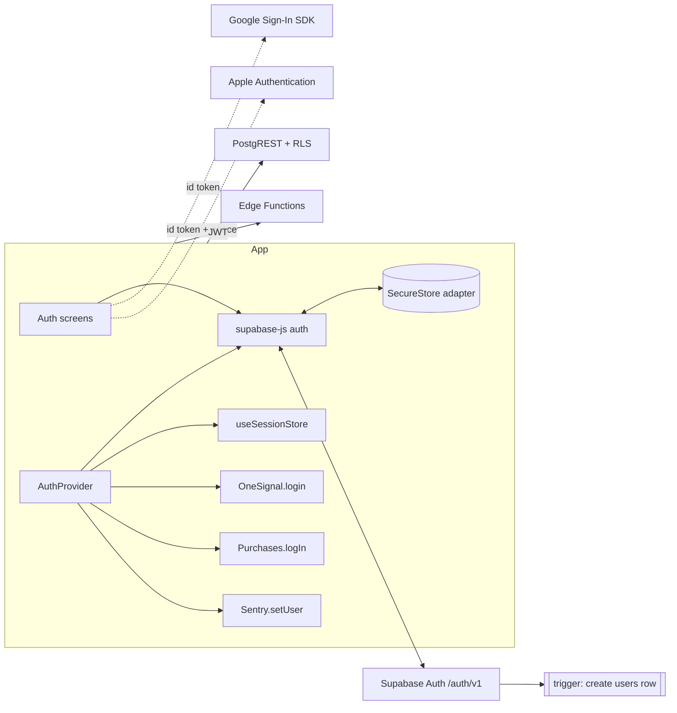
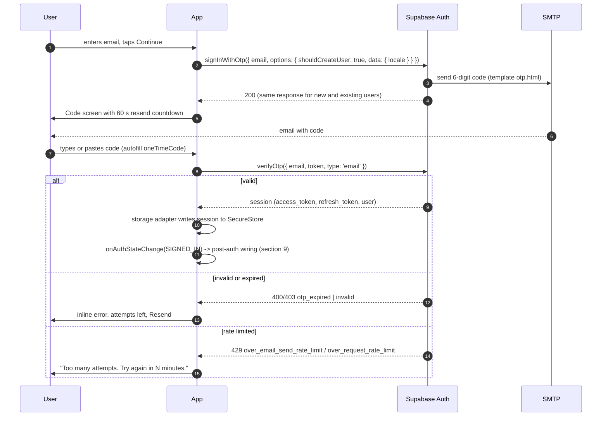
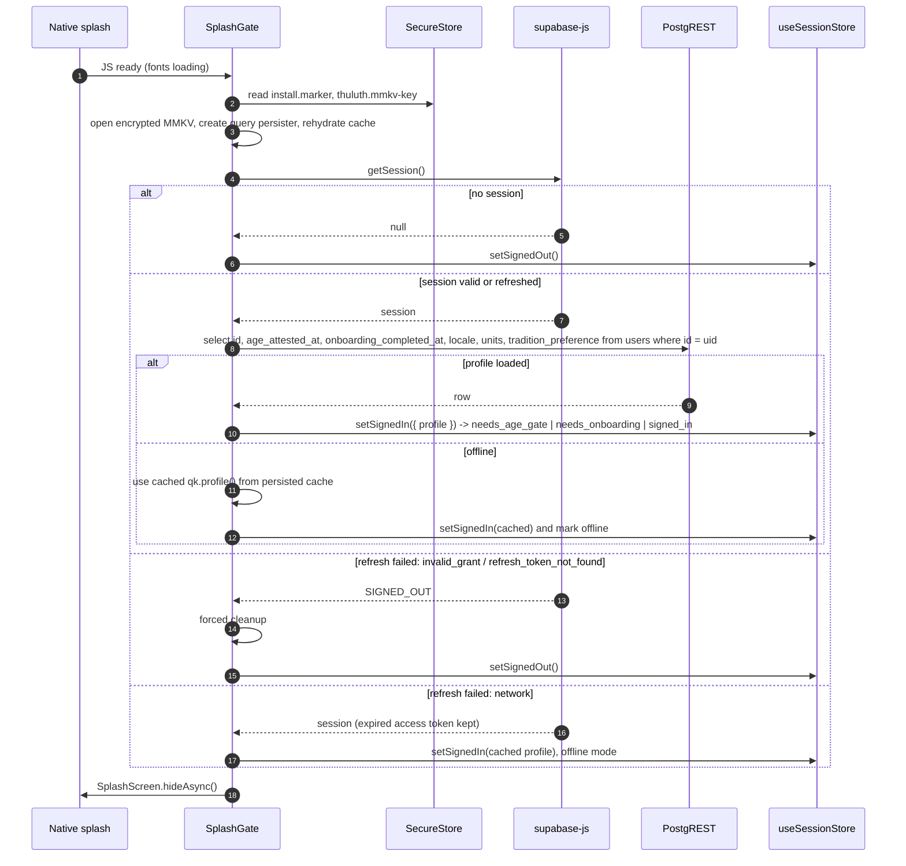
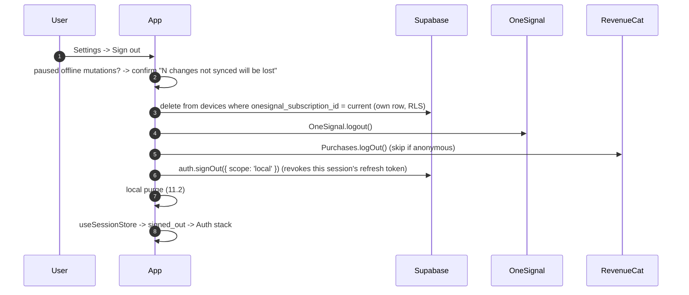
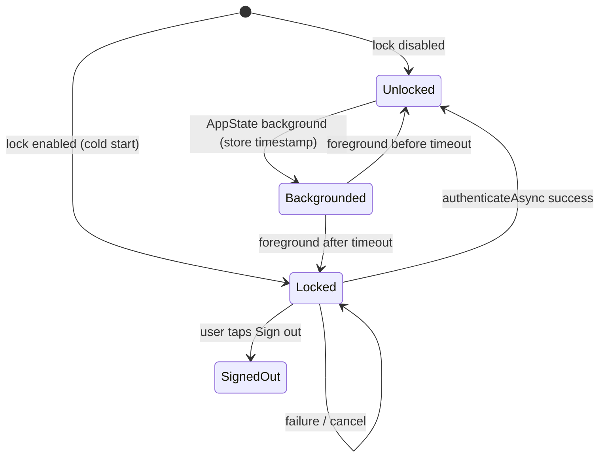
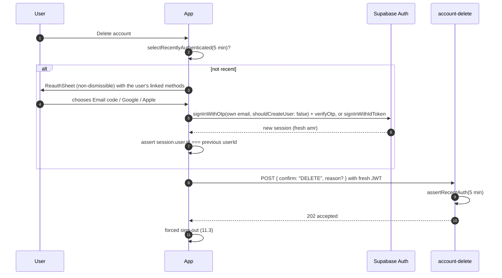

# 11 · Authentication Design

> **Status:** Approved for implementation (v1) · **Owner:** Mobile Platform + Backend · **Deliverable:** 10
>
> **Related docs:** `00-foundations.md`, `05-database-schema.md` (users, households, household_members, household_invitations, consents, devices), `06-api-specification.md` (`household-invite`, `account-delete`, `account-export`), `07-react-native-folder-structure.md`, `09-state-management.md`, `10-supabase-structure.md`, `16-security-architecture.md`, `17-subscription-architecture.md`, `21-testing-strategy.md`

## Table of contents

1. [Overview](#1-overview)
2. [Providers and Supabase Auth configuration](#2-providers-and-supabase-auth-configuration)
3. [Email OTP](#3-email-otp)
4. [Google sign-in (native)](#4-google-sign-in-native)
5. [Apple sign-in](#5-apple-sign-in)
6. [Account linking and identity merging](#6-account-linking-and-identity-merging)
7. [JWT lifecycle and secure token storage](#7-jwt-lifecycle-and-secure-token-storage)
8. [Session restore on launch](#8-session-restore-on-launch)
9. [Post-authentication wiring](#9-post-authentication-wiring)
10. [Roles and RLS mapping](#10-roles-and-rls-mapping)
11. [Sign-out and device cleanup](#11-sign-out-and-device-cleanup)
12. [Household invitation acceptance via deep link](#12-household-invitation-acceptance-via-deep-link)
13. [Age gate and parental consent](#13-age-gate-and-parental-consent)
14. [Biometric app lock](#14-biometric-app-lock)
15. [Re-authentication for sensitive actions](#15-re-authentication-for-sensitive-actions)
16. [Error states](#16-error-states)
17. [Acceptance criteria](#17-acceptance-criteria)
18. [Additions beyond 00-foundations](#18-additions-beyond-00-foundations)

---

## 1. Overview

- **Identity provider:** Supabase Auth. No passwords in v1. Sign-in methods: email one-time code (6 digits), Google (native), Apple (native, iOS).
- **Who has accounts:** adults only (18+). Children exist only as `family_members` rows owned by a household (00 §6). There is no child login.
- **Authorization:** the JWT `sub` is `users.id`; every table is guarded by RLS using `is_household_member(household_id)` and role checks against `household_members.role` (section 10).
- **Tokens on device:** in `expo-secure-store` only (Keychain / Android Keystore), never in MMKV, AsyncStorage, Zustand or logs.
- **Third-party identity wiring:** after sign-in the user id becomes the OneSignal `external_id`, the RevenueCat `app_user_id` and the Sentry user id (id only, no email).



## 2. Providers and Supabase Auth configuration

| Method | iOS | Android | Notes |
|---|---|---|---|
| Email OTP | Yes | Yes | Default and universal fallback. |
| Google | Yes | Yes | Native SDK `@react-native-google-signin/google-signin`, `signInWithIdToken`. |
| Apple | Yes | No (v1) | Required on iOS because Google is offered (App Store Review Guideline 4.8, Login Services). Android users who registered with Apple sign in with email OTP to the same address (works with Apple private relay addresses because relay forwards mail). Apple web flow on Android is Phase 2. |

`supabase/config.toml` (local; mirrored in the hosted projects `thuluth-dev`, `thuluth-staging`, `thuluth-prod` through the dashboard or Management API, see `19-deployment-architecture.md`):

```toml
[auth]
enabled = true
site_url = "https://thuluth.app"
additional_redirect_urls = ["thuluth://auth-callback", "https://thuluth.app/auth-callback"]
jwt_expiry = 3600                       # access token lifetime: 1 hour
enable_refresh_token_rotation = true
refresh_token_reuse_interval = 10       # seconds; reuse after this revokes the session family
enable_signup = true
enable_anonymous_sign_ins = false
enable_manual_linking = true            # needed for linkIdentity (section 6)

[auth.rate_limit]
email_sent = 30                         # emails per hour, project-wide (custom SMTP raises the ceiling)
token_verifications = 30                # OTP verifications per 5 minutes per IP
token_refresh = 150                     # refreshes per 5 minutes per IP
sign_in_sign_ups = 30                   # sign-in/sign-up requests per 5 minutes per IP

[auth.email]
enable_signup = true
enable_confirmations = false            # OTP verification itself proves email ownership
double_confirm_changes = true
secure_password_change = true
otp_length = 6
otp_expiry = 600                        # 10 minutes
max_frequency = "60s"                   # minimum interval between OTP emails to one address

[auth.email.template.magic_link]
subject = "Your Thuluth sign-in code"
content_path = "./supabase/templates/otp.html"   # renders {{ .Token }}, not a link

[auth.external.google]
enabled = true
client_id = "env(GOOGLE_WEB_CLIENT_ID),env(GOOGLE_IOS_CLIENT_ID),env(GOOGLE_ANDROID_CLIENT_ID)"
secret = "env(GOOGLE_CLIENT_SECRET)"
skip_nonce_check = true                 # iOS Google SDK embeds a nonce the app cannot read; see 4.3

[auth.external.apple]
enabled = true
client_id = "app.thuluth.mobile,app.thuluth.mobile.staging,app.thuluth.mobile.dev"
secret = "env(APPLE_SIGNIN_SECRET)"     # only needed for the web flow; native id tokens are verified by audience

[auth.sms]
enable_signup = false
```

Production email uses a custom SMTP provider with SPF, DKIM and DMARC on `thuluth.app` (see `16-security-architecture.md`). The OTP template exists in English and Urdu; the app passes `options.data.locale` and the template switches on it. If the hosted template engine cannot switch on user metadata, default to a bilingual template (English first, Urdu second).

## 3. Email OTP

### 3.1 Rules

| Parameter | Value | Enforced by |
|---|---|---|
| Code length | 6 digits | Supabase `otp_length` |
| Expiry | 10 minutes | Supabase `otp_expiry` |
| Resend cooldown | 60 seconds | Supabase `max_frequency` and client countdown |
| Max resends per session on client | 5 per 30 minutes, then "Try again later" with the remaining time | Client (`useOtpFlow`) |
| Wrong code attempts | After 5 wrong codes for one sent code, the client disables input and requires a resend | Client; server `token_verifications` rate limit per IP |
| Email normalization | `trim().toLowerCase()`, validated with `z.string().email()` | Client and Supabase |
| New vs existing account | `shouldCreateUser: true`: one screen handles both | supabase-js |

### 3.1.1 Store reviewer account

App Store and Play reviewers cannot read an inbox, so production has one dedicated reviewer account, `reviewer@thuluth.app` (`00-foundations.md` section 11). Supabase test OTPs apply to phone numbers only, so this account signs in with a password: an admin sets it in the `thuluth-prod` dashboard, the login screen reveals a password field only when that exact address is typed, and a Supabase "before user created" Auth hook rejects every password-based sign-up so no other account can use this path. Sprint 0 verifies the hook blocks password sign-up through the public API. The account is a normal user with a sample household and premium through a promotional entitlement (`17-subscription-architecture.md`). Controls: the password is stored in the team password manager and in the review notes only (`22-mvp-roadmap.md` §7.5), the normal `token_verifications` rate limit applies, sign-ins for the address are written to `audit_log`, and the password is rotated after each review cycle. Dev and staging do not enable the password path.

### 3.2 Flow



### 3.3 Implementation

```ts
// features/auth/api/otp-api.ts
import { supabase } from '@/lib/supabase/client';
import { toAppError } from '@/lib/supabase/edge';

export async function requestEmailOtp(email: string, locale: 'en' | 'ur') {
  const { error } = await supabase.auth.signInWithOtp({
    email: email.trim().toLowerCase(),
    options: { shouldCreateUser: true, data: { locale } },
  });
  if (error) throw toAppError(error);   // maps AuthApiError.code to AUTH_* codes (section 16)
}

export async function verifyEmailOtp(email: string, token: string) {
  const { data, error } = await supabase.auth.verifyOtp({ email: email.trim().toLowerCase(), token, type: 'email' });
  if (error) throw toAppError(error);
  return data.session!;
}
```

```ts
// features/auth/hooks/use-otp-flow.ts (state contract)
export interface OtpFlowState {
  email: string;
  sentAt: number | null;
  resendAvailableAt: number | null;      // sentAt + 60_000
  sendsInWindow: number[];               // timestamps, window 30 min, max 5
  wrongAttempts: number;                 // reset on each send, max 5
  status: 'idle' | 'sending' | 'code_sent' | 'verifying' | 'locked' | 'error';
  error: AppError | null;
}
```

UI rules: the code input (`Input variant="otp"`) auto-submits when 6 digits are present; the email is shown with "Change email"; we never reveal whether an account exists.

## 4. Google sign-in (native)

### 4.1 Configuration

- Google Cloud project with three OAuth clients: **Web** (its client id is passed as `webClientId` so the id token audience matches Supabase), **iOS** (bundle ids per environment), **Android** (package + SHA-1 of the EAS upload key and Play App Signing key).
- Supabase Google provider lists all client ids (section 2).

```ts
// apps/mobile/src/lib/auth/google.ts
import { GoogleSignin, isErrorWithCode, isSuccessResponse, statusCodes } from '@react-native-google-signin/google-signin';
import { supabase } from '@/lib/supabase/client';
import { env } from '@/lib/env';
import { AppError } from '@/lib/supabase/edge';

GoogleSignin.configure({
  webClientId: env.GOOGLE_WEB_CLIENT_ID,
  iosClientId: env.GOOGLE_IOS_CLIENT_ID,
  scopes: ['email', 'profile'],
  offlineAccess: false,
});

export async function signInWithGoogle() {
  try {
    await GoogleSignin.hasPlayServices({ showPlayServicesUpdateDialog: true });
    const res = await GoogleSignin.signIn();
    if (!isSuccessResponse(res)) throw new AppError('AUTH_CANCELLED');
    const idToken = res.data.idToken;
    if (!idToken) throw new AppError('AUTH_PROVIDER_NO_TOKEN');
    const { data, error } = await supabase.auth.signInWithIdToken({ provider: 'google', token: idToken });
    if (error) throw error;
    return data.session;
  } catch (e) {
    if (isErrorWithCode(e)) {
      if (e.code === statusCodes.IN_PROGRESS) throw new AppError('AUTH_IN_PROGRESS');
      if (e.code === statusCodes.PLAY_SERVICES_NOT_AVAILABLE) throw new AppError('AUTH_PLAY_SERVICES_UNAVAILABLE');
    }
    throw e;
  }
}
```

### 4.2 Flow

```mermaid
sequenceDiagram
  autonumber
  participant U as User
  participant App
  participant G as Google SDK
  participant SA as Supabase Auth
  U->>App: Continue with Google
  App->>G: hasPlayServices(), signIn()
  G->>U: account chooser
  U->>G: picks account
  G-->>App: idToken (aud = web client id)
  App->>SA: signInWithIdToken({ provider: 'google', token })
  SA->>SA: verify signature (Google JWKS), aud, exp; find or create user; auto-link by verified email
  SA-->>App: session
```

### 4.3 Nonce note

The iOS Google SDK includes a nonce in the id token that the app cannot obtain in raw form, so Supabase's Google nonce check is disabled (`skip_nonce_check = true`), following Supabase's documented guidance for native Google sign-in. Replay risk is bounded by the id token's short lifetime (about one hour), audience restriction, and TLS. Revisit if the SDK exposes a custom nonce on both platforms.

## 5. Apple sign-in

```ts
// apps/mobile/src/lib/auth/apple.ts
import * as AppleAuthentication from 'expo-apple-authentication';
import * as Crypto from 'expo-crypto';
import { supabase } from '@/lib/supabase/client';
import { AppError } from '@/lib/supabase/edge';

export async function signInWithApple() {
  const rawNonce = Crypto.randomUUID() + Crypto.randomUUID();          // 72 chars of randomness
  const hashedNonce = await Crypto.digestStringAsync(Crypto.CryptoDigestAlgorithm.SHA256, rawNonce);

  let credential: AppleAuthentication.AppleAuthenticationCredential;
  try {
    credential = await AppleAuthentication.signInAsync({
      requestedScopes: [AppleAuthentication.AppleAuthenticationScope.FULL_NAME, AppleAuthentication.AppleAuthenticationScope.EMAIL],
      nonce: hashedNonce,                    // Apple embeds SHA-256(raw) in the id token
    });
  } catch (e: any) {
    if (e?.code === 'ERR_REQUEST_CANCELED') throw new AppError('AUTH_CANCELLED');
    throw e;
  }
  if (!credential.identityToken) throw new AppError('AUTH_PROVIDER_NO_TOKEN');

  const { data, error } = await supabase.auth.signInWithIdToken({
    provider: 'apple',
    token: credential.identityToken,
    nonce: rawNonce,                         // Supabase hashes and compares with the token's nonce claim
  });
  if (error) throw error;

  // Apple returns the name only on the very first authorization. Persist it immediately.
  const fullName = [credential.fullName?.givenName, credential.fullName?.familyName].filter(Boolean).join(' ');
  if (fullName) {
    await supabase.from('users').update({ display_name: fullName }).eq('id', data.user!.id).is('display_name', null);
  }
  return data.session;
}
```

Rules:

- The Apple button uses `AppleAuthentication.AppleAuthenticationButton` (Apple Human Interface Guidelines) and is shown only when `AppleAuthentication.isAvailableAsync()` resolves true.
- Button order on iOS: Apple, Google, Email. On Android: Google, Email.
- **Credential revocation:** if a user revokes the app in Apple ID settings, Apple sends a server-to-server notification. v1 handles it passively: the next `signInWithIdToken` fails and the user is signed out on the next refresh failure. Account deletion (section 15) must call Apple's token revocation endpoint if Apple is a linked identity (App Store requirement for apps offering account deletion with Sign in with Apple). That call happens inside `account-delete`. We do not store Apple refresh tokens; instead, at deletion time the app asks the user to re-authenticate with Apple (section 15), which yields a fresh `authorizationCode`. The client sends it to `account-delete`, which exchanges it for a refresh token at Apple's token endpoint and immediately revokes it.

```mermaid
sequenceDiagram
  autonumber
  participant App
  participant AA as Apple (iOS)
  participant SA as Supabase Auth
  App->>App: rawNonce = random; hashed = SHA256(rawNonce)
  App->>AA: signInAsync({ scopes: [FULL_NAME, EMAIL], nonce: hashed })
  AA-->>App: identityToken (nonce = hashed), authorizationCode, fullName? (first time only)
  App->>SA: signInWithIdToken({ provider: 'apple', token, nonce: rawNonce })
  SA->>SA: verify JWKS, aud in client_id list, SHA256(rawNonce) == token.nonce
  SA-->>App: session
  App->>SA: update users.display_name if first-time fullName present
```

## 6. Account linking and identity merging

### 6.1 Automatic linking

Supabase automatically links a new identity to an existing user when both have the **same verified email**. Consequences:

| Scenario | Result |
|---|---|
| Signed up with email OTP `a@gmail.com`, later uses Google with `a@gmail.com` | Same user, two identities. |
| Signed up with Apple sharing real email `a@icloud.com`, later uses email OTP `a@icloud.com` | Same user. |
| Signed up with Apple **Hide My Email** (`xyz@privaterelay.appleid.com`), later uses Google `a@gmail.com` | **Two separate users.** Section 6.3 applies. |

### 6.2 Manual linking (Settings → Sign-in methods)

The screen lists `supabase.auth.getUserIdentities()` and offers "Link Google", "Link Apple" (iOS) and shows email.

```ts
// features/settings/api/identities-api.ts
export async function linkGoogle() {
  const res = await GoogleSignin.signIn();
  if (!isSuccessResponse(res) || !res.data.idToken) throw new AppError('AUTH_CANCELLED');
  // ID-token linking. Requires a supabase-js version whose linkIdentity accepts { provider, token };
  // pin that version in apps/mobile/package.json. Fallback if unavailable: OAuth browser flow via
  // linkIdentity({ provider: 'google', options: { redirectTo: 'thuluth://auth-callback', skipBrowserRedirect: true } })
  // opened with expo-web-browser's openAuthSessionAsync, then exchangeCodeForSession.
  const { error } = await supabase.auth.linkIdentity({ provider: 'google', token: res.data.idToken });
  if (error) throw toAppError(error);       // identity_already_exists -> AUTH_IDENTITY_IN_USE
}

export async function unlink(identity: UserIdentity) {
  const { identities } = (await supabase.auth.getUserIdentities()).data!;
  if (identities.length < 2) throw new AppError('AUTH_LAST_IDENTITY');
  const { error } = await supabase.auth.unlinkIdentity(identity);
  if (error) throw toAppError(error);
}
```

Linking and unlinking are sensitive actions and require recent authentication (section 15). Each change writes `audit_log` (`action = 'identity.linked' | 'identity.unlinked'`) via a database trigger on `auth.identities` defined in `10-supabase-structure.md`.

### 6.3 Merging two existing accounts

v1 does **not** merge data between two Supabase users automatically (risk of mixing households and health data, and conflicting subscriptions). When linking fails with `AUTH_IDENTITY_IN_USE`, the app explains the situation and offers two supported paths:

1. **Share the household:** sign in with the other method, open Household → Invite, and invite this account's email as a caregiver. Both accounts then see the same family data.
2. **Retire one account:** sign in with the unused account and delete it (Settings → Delete account), then link the method to the remaining account.

Subscriptions stay with the RevenueCat `app_user_id` (the Supabase user id) that purchased. "Restore purchases" on the other account transfers per RevenueCat's configured transfer behaviour (`17-subscription-architecture.md`). A support-assisted household ownership transfer tool is Phase 2.

## 7. JWT lifecycle and secure token storage

### 7.1 Token facts

| Token | Lifetime | Storage | Refresh |
|---|---|---|---|
| Access token (JWT, `sub` = user id, `role` = `authenticated`, `amr`, `session_id`) | 1 hour (`jwt_expiry`) | SecureStore (inside session JSON) | supabase-js refreshes about 1 minute before expiry while auto-refresh is running |
| Refresh token (opaque) | Until used or revoked; rotation on each use, reuse window 10 s | SecureStore | Exchanged by supabase-js |
| Provider id tokens (Google, Apple) | Used once | Never stored | n/a |

### 7.2 Secure session storage adapter

`expo-secure-store` values may fail above roughly 2 KB on some platforms, and a Supabase session JSON can exceed that (user metadata, identities). The adapter chunks values.

```ts
// apps/mobile/src/lib/supabase/secure-session-storage.ts
import * as SecureStore from 'expo-secure-store';

const CHUNK = 1800;
const OPTS: SecureStore.SecureStoreOptions = {
  keychainAccessible: SecureStore.AFTER_FIRST_UNLOCK_THIS_DEVICE_ONLY,   // background refresh works; not in iCloud backup
};
const safe = (k: string) => k.replace(/[^A-Za-z0-9._-]/g, '_');

export const secureSessionStorage = {
  async getItem(key: string): Promise<string | null> {
    const k = safe(key);
    const count = await SecureStore.getItemAsync(`${k}.n`, OPTS);
    if (!count) return null;
    const parts = await Promise.all(Array.from({ length: Number(count) }, (_, i) => SecureStore.getItemAsync(`${k}.${i}`, OPTS)));
    if (parts.some((p) => p === null)) return null;        // partial write: treat as signed out
    return parts.join('');
  },
  async setItem(key: string, value: string): Promise<void> {
    const k = safe(key);
    const prev = Number((await SecureStore.getItemAsync(`${k}.n`, OPTS)) ?? 0);
    const chunks = value.match(new RegExp(`.{1,${CHUNK}}`, 'gs')) ?? [''];
    await Promise.all(chunks.map((c, i) => SecureStore.setItemAsync(`${k}.${i}`, c, OPTS)));
    await SecureStore.setItemAsync(`${k}.n`, String(chunks.length), OPTS);
    for (let i = chunks.length; i < prev; i++) await SecureStore.deleteItemAsync(`${k}.${i}`, OPTS);
  },
  async removeItem(key: string): Promise<void> {
    const k = safe(key);
    const n = Number((await SecureStore.getItemAsync(`${k}.n`, OPTS)) ?? 0);
    await SecureStore.deleteItemAsync(`${k}.n`, OPTS);
    for (let i = 0; i < n; i++) await SecureStore.deleteItemAsync(`${k}.${i}`, OPTS);
  },
};
```

Notes:

- `requireAuthentication` (biometric-gated SecureStore reads) is **not** used for the session, because auto-refresh must read the refresh token without user interaction. The biometric lock is a UI lock (section 14).
- iOS Keychain items survive app uninstall. On first launch after install, `AuthProvider` checks an MMKV flag `install.marker`; if missing, it clears `thuluth.auth.*` and `thuluth.mmkv-key` from SecureStore before restoring, so a reinstall never resurrects an old session.
- The same module manages `thuluth.mmkv-key` (32 random bytes from `expo-crypto`, base64) used for encrypted MMKV (`09-state-management.md` §6).

### 7.3 Auto refresh and AppState

```ts
// apps/mobile/src/app/providers/auth-provider.tsx (excerpt)
useEffect(() => {
  const sub = AppState.addEventListener('change', (state) => {
    if (state === 'active') supabase.auth.startAutoRefresh();
    else supabase.auth.stopAutoRefresh();
  });
  if (AppState.currentState === 'active') supabase.auth.startAutoRefresh();
  return () => sub.remove();
}, []);
```

- In the background the timer is stopped (RN timers are unreliable there); on foreground, `startAutoRefresh` immediately refreshes if the token expires within the margin.
- Edge Function and PostgREST calls made right after foreground await `supabase.auth.getSession()` first (supabase-js does this internally for its own requests; `invokeEdge` and `streamEdge` use the client so they inherit it).
- A `401` from an Edge Function with code `UNAUTHENTICATED` triggers one `refreshSession()` and a single retry; a second 401 signs out (section 11, forced path).

### 7.4 Auth events handled

| `onAuthStateChange` event | Handling |
|---|---|
| `INITIAL_SESSION` | Part of restore (section 8). |
| `SIGNED_IN` | Post-auth wiring (section 9). Also fires after re-auth and identity sign-in. |
| `TOKEN_REFRESHED` | Update `useSessionStore` if `amr` changed; nothing else. |
| `USER_UPDATED` | Invalidate `qk.profile()`. |
| `SIGNED_OUT` | If not initiated by the user (refresh token revoked, reused, user deleted), run forced cleanup (section 11.3) and show "You have been signed out" toast. |

Callbacks never `await` other supabase calls inline (documented supabase-js deadlock risk); they schedule work with `setTimeout(fn, 0)`.

## 8. Session restore on launch



- Target: splash hidden within 1.5 s of JS start with a cached session (measured in `21-testing-strategy.md` §13). If restore exceeds 4 s, show the app shell with skeletons rather than holding the splash.
- `RootNavigator` chooses stacks purely from `useSessionStore.status`: `initializing` (splash), `signed_out` (Auth stack), `needs_age_gate` (Age gate screen), `needs_onboarding` (Onboarding stack), `signed_in` (Main tabs).
- Offline mode: cached reads and offline mutations work; online-only actions show the offline banner (`09-state-management.md` §4).

## 9. Post-authentication wiring

Runs on `SIGNED_IN` and after a successful restore, idempotently:

| Step | Call | Failure handling |
|---|---|---|
| 1 | Ensure `users` row exists (created by trigger on `auth.users` insert; client retries select 3 times at 300 ms if missing) | After retries, error screen `AUTH_PROFILE_MISSING` with retry |
| 2 | `usePreferencesStore.hydrateFromProfile(row)`; apply locale and RTL if changed | |
| 3 | `Sentry.setUser({ id: userId })` | Never include email |
| 4 | `Purchases.logIn(userId)` then `applyCustomerInfo` | Non-blocking; retried on next foreground |
| 5 | `OneSignal.login(userId)` | Non-blocking |
| 6 | Upsert `devices` (`user_id`, `platform`, `onesignal_subscription_id`, `app_version`, `last_seen_at`) | Non-blocking |
| 7 | Fetch `qk.households()`, `useActiveHouseholdStore.reconcile(...)` | |
| 8 | Fetch feature flags (`evaluate_feature_flags()`), subscription row | |
| 9 | If `pendingInviteToken` is set, run invitation acceptance (section 12) | |
| 10 | `track('auth_signed_in', { method })` into `analytics_events` | |

The `users` row trigger also seeds `locale` from `raw_user_meta_data.locale`, `display_name` from provider metadata (`full_name` / `name`), and `country_code` / `timezone` remain null until onboarding.

## 10. Roles and RLS mapping

### 10.1 Capability matrix

| Capability | owner | caregiver | viewer | coach (Phase 2) |
|---|---|---|---|---|
| Read household, family members, health profile, plans, logs | Yes | Yes | Yes | Yes (members granted) |
| Log meals, servings, hydration, fasting, exposures, journal | Yes | Yes | No | No |
| Edit family members and health profile | Yes | Yes | No | No |
| Generate or adjust plans, grocery lists | Yes | Yes | No | Suggest only |
| Manage budget | Yes | Yes | No | No |
| AI chat in household context | Yes | Yes | Yes (read-only advice) | Yes |
| Invite / remove members, change roles | Yes | No | No | No |
| Edit household settings, delete household | Yes | No | No | No |
| Exports (PDF) | Yes (premium) | Yes (premium) | No | Yes (Phase 2) |

MVP invitations support `caregiver` and `viewer`. `household-invite` rejects `coach` with `ROLE_NOT_AVAILABLE` until Phase 2. Exactly one `owner` per household.

Premium gating is per **user** (`has_premium(user_id)`, 00 §8). A caregiver without premium in a premium owner's household gets premium household features that are evaluated against the household owner; AI chat quotas remain per user. The precise rule lives in `17-subscription-architecture.md`.

### 10.2 SQL helpers and policy pattern

`is_household_member(household_id)` is canonical (00 §4.1). Role checks use one more helper:

```sql
-- Addition beyond 00-foundations (define in 05/10 if not already present)
create or replace function public.has_household_role(p_household_id uuid, p_roles household_role[])
returns boolean
language sql
stable
security definer
set search_path = public
as $$
  select exists (
    select 1 from household_members hm
    where hm.household_id = p_household_id
      and hm.user_id = auth.uid()
      and hm.role = any (p_roles)
  );
$$;
revoke all on function public.has_household_role(uuid, household_role[]) from public;
grant execute on function public.has_household_role(uuid, household_role[]) to authenticated;
```

Standard policy set for a household-scoped tracking table (example `hydration_logs`):

```sql
alter table hydration_logs enable row level security;

create policy hydration_logs_select on hydration_logs
  for select to authenticated
  using (deleted_at is null and is_household_member(household_id));

create policy hydration_logs_insert on hydration_logs
  for insert to authenticated
  with check (has_household_role(household_id, array['owner','caregiver']::household_role[]));

create policy hydration_logs_update on hydration_logs
  for update to authenticated
  using (has_household_role(household_id, array['owner','caregiver']::household_role[]))
  with check (has_household_role(household_id, array['owner','caregiver']::household_role[]));

-- no delete policy: soft delete via update of deleted_at
```

Owner-only tables and actions: `household_invitations` (all), `household_members` insert/update/delete (except a member deleting their own row to leave), `households` update. The full per-table policy list is in `05-database-schema.md`; RLS tests per role are in `21-testing-strategy.md` §6.

The client mirrors roles only for UI (`selectCanEdit`); RLS is the enforcement. A role change takes effect on the next request; Realtime on `household_members` invalidates `qk.households()` so the UI updates.

## 11. Sign-out and device cleanup

### 11.1 User-initiated sign-out



### 11.2 Local purge (shared by all sign-out paths)

```ts
// apps/mobile/src/lib/auth/sign-out.ts
export async function purgeLocalUserData() {
  await queryClient.cancelQueries();
  queryClient.getMutationCache().clear();
  queryClient.clear();
  await persister.removeClient();
  sensitive.queryCache.clearAll();
  sensitive.drafts.clearAll();
  resetAllStores();                                     // 09 §8
  Sentry.setUser(null);
  await GoogleSignin.signOut().catch(() => {});        // so the account chooser appears next time
  await Image.clearDiskCache(); Image.clearMemoryCache(); // expo-image: meal photos, avatars
  await FileSystem.deleteAsync(`${FileSystem.cacheDirectory}thuluth/`, { idempotent: true }); // voice notes, PDFs
  await secureSessionStorage.removeItem('thuluth.auth'); // belt and braces after signOut
}
```

Kept after sign-out: device preferences (theme, locale, sensory-calm), `install.marker`, the MMKV encryption key (a fresh key is not required because the instances are cleared).

### 11.3 Forced sign-out

Triggered by `SIGNED_OUT` not initiated by the user, a second consecutive 401, or `account-delete` success. Server calls are skipped (they would fail); `OneSignal.logout()` and `Purchases.logOut()` still run (local SDK operations), then `purgeLocalUserData()`.

### 11.4 Sign out of all devices

Settings → Security → "Sign out everywhere" calls `supabase.auth.signOut({ scope: 'global' })` (revokes all refresh tokens for the user), deletes all `devices` rows for the user, then runs the local purge. Other devices are signed out at their next refresh (within 1 hour).

## 12. Household invitation acceptance via deep link

### 12.1 Invitation creation (owner)

`household-invite` with `{ action: 'create', household_id, email, role }`: generates a 32-byte random token, stores `token_hash = encode(digest(token, 'sha256'), 'hex')`, `expires_at = now() + interval '7 days'`, emails a link `https://thuluth.app/invite/<token>`. Contract in `06-api-specification.md`.

### 12.2 Link handling

- Universal link (iOS `applinks:thuluth.app`) and Android App Link (`autoVerify`) open the app at route `InviteAccept` with `token` (07 §9.6). The custom scheme `thuluth://invite/<token>` is not accepted: another app can register the scheme and intercept the token (S7-SEC-11, PO decision 2026-10-06). The app swallows such a link without storing the token.
- If the app is not installed, `https://thuluth.app/invite/<token>` serves a web page with store badges and "Open in app". Deferred deep linking is not in v1: after installing, the user taps the email link again.
- The token is held **in memory only** (`useSessionStore.pendingInviteToken`) and never logged (Sentry breadcrumbs scrub `/invite/` paths).

### 12.3 Flow

```mermaid
sequenceDiagram
  autonumber
  participant U as Invitee
  participant App
  participant ST as useSessionStore
  participant EF as household-invite
  participant DB as Postgres
  U->>App: taps https://thuluth.app/invite/TOKEN
  App->>ST: setPendingInviteToken(TOKEN)
  alt not signed in
    App->>U: Auth stack with banner "Sign in with the email this invite was sent to"
    U->>App: completes OTP / Google / Apple
    App->>App: age gate if needed (section 13)
  end
  App->>EF: POST { action: 'accept', token: TOKEN }
  EF->>DB: find invitation by sha256(token), accepted_at is null
  EF->>EF: check expires_at > now(); lower(email) = lower(auth email)
  EF->>DB: insert household_members(household_id, user_id, role); set accepted_at; audit_log
  EF-->>App: { household_id, role }
  App->>ST: setPendingInviteToken(null)
  App->>App: invalidate qk.households(); setActiveHousehold(household_id, role)
  App->>U: "You joined the Ahmed family as a caregiver"
  Note over App: If the invitee has not onboarded, onboarding skips the "create household" step
```

### 12.4 Errors

| Code | Cause | UI |
|---|---|---|
| `INVITE_NOT_FOUND` | Unknown or revoked token | "This invite link is not valid. Ask for a new one." |
| `INVITE_EXPIRED` | Past `expires_at` | Same, with "Invites last 7 days." |
| `INVITE_ALREADY_ACCEPTED` | `accepted_at` set | If the current user is already a member, open the household; otherwise "already used". |
| `INVITE_EMAIL_MISMATCH` | Signed-in email differs | Shows the masked invited address (`a***@gmail.com`) and offers "Sign out and use that email". |
| `ALREADY_MEMBER` | User already in the household | Switch to that household silently. |
| `ROLE_NOT_AVAILABLE` | Coach role in MVP | Shown to owner at create time only. |

## 13. Age gate and parental consent

### 13.1 Adult-only accounts

- Immediately after the first successful sign-in, if `users.age_attested_at is null`, the app shows the **Age gate** screen: "Thuluth is for parents and adults aged 18 or over. Are you 18 or older?" with "Yes, I am 18+" and "No".
- **Yes:** update `users.age_attested_at = now()` (Addition beyond 00-foundations) and continue to onboarding. The attestation is also recorded in `audit_log` (`action = 'age.attested'`).
- **No:** show a kind explanation, call `account-delete` with `{ reason: 'under_age', immediate: true }` (no data exists yet), then forced sign-out. The device stores `age_gate.declined_at` in plain MMKV and shows the same screen without a sign-in option for 24 hours (a light deterrent, not identity verification).
- The app never collects the account holder's date of birth.
- Store listings: age rating appropriate for a general-audience health app, with the declaration that accounts are for adults and children's data is entered by parents.

### 13.2 Children as family members

- Children (and any person under 18) exist only as `family_members` rows. `family_members.linked_user_id` may reference only an app user (who is an attested adult).
- Before the **first** family member under 18 is added, the adult grants consent `consents(kind = 'child_data', version = <current>)` on a dedicated screen explaining what is stored, why (meal planning, growth tracking), who can see it (household members by role), and how to delete it.
- Before any intake or AI processing, the user grants `health_data` and `ai_processing` consents (onboarding). Withdrawing `ai_processing` disables AI features (server-enforced in Edge Functions) but keeps trackers working.
- Server enforcement: an insert trigger on `family_members` raises `CHILD_DATA_CONSENT_REQUIRED` if the computed age is under 18 and the inserting user has no active `child_data` consent of the current version. Version bumps require re-consent on next launch (blocking modal).
- Child-safety product rules (no calorie targets, no weight-loss goals, fasting limits) are enforced independently in intake schemas (08 §7), plan validation and AI guardrails (00 §10.3).

### 13.3 Consent versions

Consent text versions are constants in `packages/shared/src/constants/consents.ts` (`CONSENT_VERSIONS = { terms: '2026-10', privacy: '2026-10', health_data: '2026-10', child_data: '2026-10', ai_processing: '2026-10', marketing: '2026-10' }`). On launch, the client compares granted versions (`qk.consents()`) with current ones and blocks with a re-consent modal for required kinds (`terms`, `privacy`, `health_data`, and `child_data` if the household has a minor).

## 14. Biometric app lock

Optional, off by default, set in Settings → Security (`usePreferencesStore.biometricLock`).

| Aspect | Rule |
|---|---|
| Availability | Shown only if `LocalAuthentication.hasHardwareAsync()` and `isEnrolledAsync()` are true. |
| Enable | Requires a successful `authenticateAsync` to turn on. |
| Disable | Requires a successful `authenticateAsync` (or device passcode fallback). |
| Lock triggers | Cold start; returning to foreground after the timeout (`immediate`, `1m`, `5m`) measured from `background` timestamp. |
| Unlock | `authenticateAsync({ promptMessage: t('auth:unlock_prompt'), disableDeviceFallback: false, cancelLabel })`. Device passcode fallback allowed. |
| Failure | After cancel or failure, the lock screen stays with "Try again" and "Sign out" (sign-out wipes local data, section 11). |
| Privacy screen | When `AppState` becomes `inactive` (app switcher), an opaque overlay with the logo covers content regardless of lock setting, so health data is not visible in the task switcher snapshot. |
| Relationship to tokens | UI lock only; tokens are not biometric-bound (section 7.2). Network refresh and push handling continue while locked. |
| Notifications | Push notification content for health data uses generic text when the lock is enabled ("You have a meal reminder") per `notification_preferences`. |



## 15. Re-authentication for sensitive actions

### 15.1 Sensitive actions

| Action | Where enforced | Window |
|---|---|---|
| Account deletion (`account-delete`) | Edge Function | 5 minutes |
| Data export (`account-export`) | Edge Function | 5 minutes |
| Link / unlink sign-in method | Client gate + Supabase manual linking | 5 minutes |
| Change account email | Supabase `double_confirm_changes` + client gate | 5 minutes |
| Remove a household member or transfer ownership | `household-invite` (owner actions) | 15 minutes |
| Disable biometric lock | Local biometric check (not server re-auth) | n/a |

### 15.2 Mechanism

The access token's `amr` claim lists authentication methods with timestamps (`[{ "method": "otp", "timestamp": 1791234567 }]`). Token refresh does not change it; a new sign-in does. Edge Functions check recency:

```ts
// supabase/functions/_shared/auth.ts (excerpt)
export function assertRecentAuth(jwtPayload: { amr?: Array<{ method: string; timestamp: number }> }, maxAgeSec = 300) {
  const latest = Math.max(0, ...(jwtPayload.amr ?? []).map((a) => a.timestamp));
  if (Date.now() / 1000 - latest > maxAgeSec) {
    throw new HttpError(401, 'REAUTH_REQUIRED', 'Please confirm it is you to continue.');
  }
}
```

Client flow:



- The OTP email field in `ReauthSheet` is fixed to the current account's email.
- **Different account guard:** if a Google or Apple re-auth returns a different user id (user picked another account), the app signs out locally, explains what happened, and returns to the Auth stack. This is rare and safe (no action ran).
- Apple-linked accounts: during deletion re-auth the app prefers Apple sign-in to obtain a fresh `authorizationCode`, which is sent to `account-delete` so the function can revoke the Apple token (section 5).
- Data export returns a signed URL valid for 24 hours to a zip (`exports` row, kind per `18-exports-and-analytics.md`).

## 16. Error states

All auth errors are normalized to `AppError` codes and localized in `locales/*/errors.json`.

| Code | Source | User message (en, abridged) | Recovery |
|---|---|---|---|
| `AUTH_INVALID_EMAIL` | client validation | "Enter a valid email address." | Fix input |
| `AUTH_OTP_INVALID` | `verifyOtp` 400/403 | "That code is not right. N attempts left." | Retry; resend after 5 |
| `AUTH_OTP_EXPIRED` | `otp_expired` | "This code has expired." | Resend |
| `AUTH_RATE_LIMITED` | 429 `over_email_send_rate_limit`, `over_request_rate_limit` | "Too many attempts. Try again in N minutes." | Wait (countdown) |
| `AUTH_CANCELLED` | provider cancel | none (silent) | |
| `AUTH_IN_PROGRESS` | Google SDK | none; ignore duplicate tap | |
| `AUTH_PLAY_SERVICES_UNAVAILABLE` | Android | "Google sign-in needs Google Play services. Use email instead." | Email OTP |
| `AUTH_PROVIDER_NO_TOKEN` | missing id token | "Sign-in did not complete. Please try again." | Retry |
| `AUTH_PROVIDER_ERROR` | `signInWithIdToken` failure | "We could not sign you in with Google/Apple." | Retry or email |
| `AUTH_IDENTITY_IN_USE` | link conflict | "This Google account is already used by another Thuluth account." | Section 6.3 |
| `AUTH_LAST_IDENTITY` | unlink last method | "You need at least one way to sign in." | |
| `AUTH_NETWORK` | fetch failure | "No connection. Check your internet." | Retry |
| `AUTH_SESSION_EXPIRED` | forced sign-out | "You have been signed out. Please sign in again." | Auth stack |
| `AUTH_PROFILE_MISSING` | users row not created | "We are setting up your account." | Retry |
| `REAUTH_REQUIRED` | Edge Function | ReauthSheet opens | Re-auth |
| `UNAUTHENTICATED` | 401 | Silent refresh then retry; else session expired | |
| `FORBIDDEN` | RLS / role | "You do not have permission to do this in this household." | |
| `CHILD_DATA_CONSENT_REQUIRED` | trigger | Opens child data consent screen | Consent |
| `INVITE_*`, `ALREADY_MEMBER`, `ROLE_NOT_AVAILABLE` | `household-invite` | Section 12.4 | |
| `AGE_GATE_DECLINED` | client | Explanation screen, no sign-in for 24 h | |

## 17. Acceptance criteria

1. New user can sign up with email OTP in under 60 seconds; code expires at 10 minutes; resend is disabled for 60 seconds; the sixth wrong attempt is blocked client-side.
2. Google sign-in works on iOS and Android dev, preview and production builds; Apple sign-in works on iOS; the Apple button is present on every iOS screen that shows Google.
3. Same verified email across OTP and Google yields one `users` row with two identities.
4. Tokens never appear in MMKV, AsyncStorage, logs, Sentry events or analytics (verified by a test that greps the MMKV dump and Sentry `beforeSend` fixtures for JWT patterns).
5. Killing the app for more than 1 hour and relaunching online restores the session without user action; relaunching offline shows cached data.
6. Reinstalling the app on iOS does not restore a previous session.
7. Sign-out removes the `devices` row, logs out OneSignal and RevenueCat, clears encrypted MMKV and resets stores; a subsequent push to the user does not reach the device.
8. Opening an invite link while signed out, signing in with the invited email, completes membership with the invited role; a mismatched email shows `INVITE_EMAIL_MISMATCH`.
9. Declining the age gate deletes the just-created auth user and blocks re-sign-in on that device for 24 hours.
10. Adding a member under 18 without a current `child_data` consent fails server-side with `CHILD_DATA_CONSENT_REQUIRED`.
11. `account-delete` and `account-export` return `REAUTH_REQUIRED` when the latest `amr` timestamp is older than 5 minutes.
12. pgTAP suite proves each role's allowed and denied operations per section 10.1 (`21-testing-strategy.md` §6).

## 18. Additions beyond 00-foundations

| Addition | Definition |
|---|---|
| `users.age_attested_at timestamptz null` | Set when the account holder attests to being 18+. |
| SQL function `has_household_role(uuid, household_role[])` | Role check helper for RLS policies (section 10.2). |
| Trigger on `auth.users` insert creating the `users` row | Name per `10-supabase-structure.md`; seeds locale and display name. |
| Trigger on `family_members` insert enforcing `child_data` consent | Raises `CHILD_DATA_CONSENT_REQUIRED`. |
| Trigger on `auth.identities` writing `audit_log` | Identity link/unlink auditing. |
| `household-invite` actions `create`, `accept`, `revoke`, `remove_member` | Action names inside the canonical function. |
| Password sign-in for `reviewer@thuluth.app` only | Store review access (section 3.1.1), guarded by a before-user-created Auth hook. |
| Error codes `REAUTH_REQUIRED`, `INVITE_*`, `ALREADY_MEMBER`, `ROLE_NOT_AVAILABLE`, `CHILD_DATA_CONSENT_REQUIRED` | Envelope codes per 00 §4.2. |
