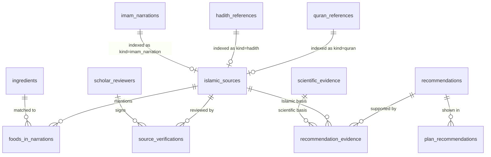
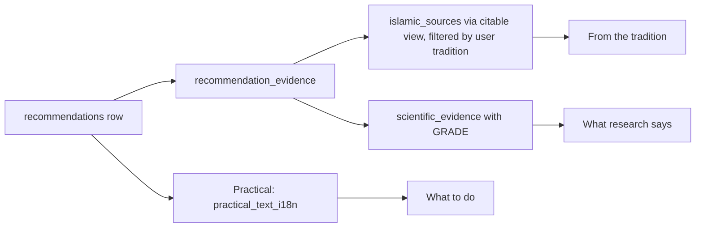
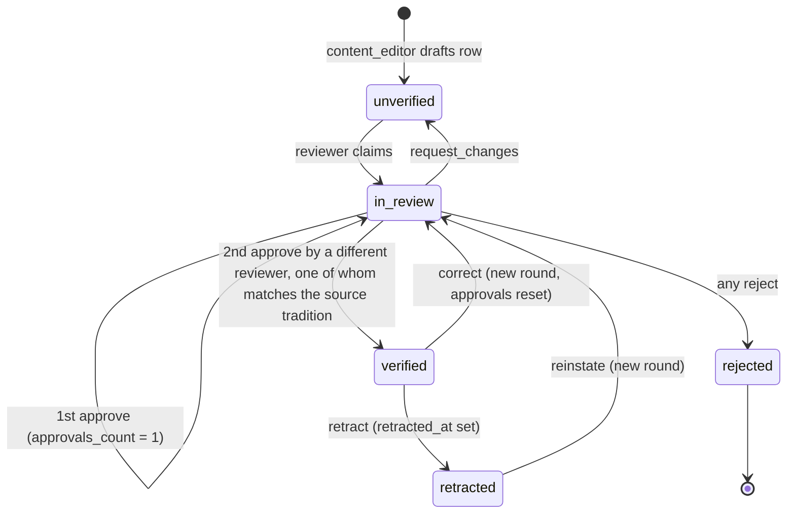
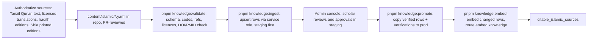

# 13 · Islamic Knowledge Module

> **Status:** Draft for v1 implementation · **Owner:** Content and Scholarship (with AI Platform) · **Deliverable:** Islamic Knowledge Module
>
> **Related:** `00-foundations.md` (sections 2, 5, 6, 10), `05-database-schema.md` (DDL and RLS), `12-ai-agent-architecture.md` (Islamic Knowledge Engine, citation check), `02-ux-specification.md` (source cards, recommendation cards), `03-design-system.md` (Arabic typography), `14-meal-planning-and-grocery.md` (Sunnah foods in plans), `15-family-health-modules.md` (Ramadan and fasting), `16-security-architecture.md` (admin roles, audit)

---

## Table of contents

1. [Goals](#1-goals)
2. [Scholarly principles](#2-scholarly-principles)
3. [Data model](#3-data-model)
4. [Example rows (SQL)](#4-example-rows-sql)
5. [Evidence rating systems and display](#5-evidence-rating-systems-and-display)
6. [The three-part recommendation rule](#6-the-three-part-recommendation-rule)
7. [Tradition handling](#7-tradition-handling)
8. [Source verification workflow](#8-source-verification-workflow)
9. [Content ingestion pipeline](#9-content-ingestion-pipeline)
10. [Initial curated seed set](#10-initial-curated-seed-set)
11. [Copy rules](#11-copy-rules)
12. [Acceptance criteria](#12-acceptance-criteria)
13. [Additions beyond 00-foundations](#13-additions-beyond-00-foundations)

---

## 1. Goals

| # | Goal | Measure |
|---|---|---|
| G1 | Ground every piece of Islamic guidance in a real, verified source that the user can inspect (Arabic text, translation, reference, grading, tradition). | 100 percent of citations shown to users resolve to an `islamic_sources` row with `verification_status = 'verified'` and two approving reviewers. |
| G2 | Pair tradition with honest science. Health claims rest on `scientific_evidence` with a GRADE rating, never on a narration. | Every published `recommendations` row has at least one Islamic source link and at least one scientific evidence link. |
| G3 | Serve Sunni and Shia families respectfully, each with sources from their tradition plus the shared Qur'anic base, with no comparison or polemic. | Zero content items that rank or criticise a tradition (review checklist item). |
| G4 | Keep the agent from inventing sources. Retrieval is restricted to verified rows; outputs are validated (`12-ai-agent-architecture.md` section 13.6). | Zero unresolved citations reaching clients in production. |
| G5 | Make correction and retraction fast and visible. | A retraction removes a source from every user-facing surface within 5 minutes. |
| G6 | Never issue fatwas and never make cure claims. | Enforced by copy rules (section 11), review checklist and output guardrails. |

Out of scope for v1: tafsir commentary beyond short context notes, fiqh rulings, audio recitation, hadith chain (isnad) visualisation, user-submitted sources.

---

## 2. Scholarly principles

1. **Qur'an first, then authentic Sunnah, then narrations of the Ahl al-Bayt (A.S.) for users of the Shia tradition.** The Qur'an is shared by all Muslims and forms the common base for every user.
2. **Authenticity before relevance.** A weak narration that fits a topic perfectly is not used as the basis of a recommendation. Sunni hadith graded `daif` or `mawdu`, and Shia narrations graded `daif_shia`, are not citable as the basis of guidance. A `daif` or `daif_shia` item may appear only as `relationship = 'context'`, clearly labelled, and only with explicit approval from both reviewers; `mawdu` items are never shown.
3. **Faithful presentation.** Arabic text is reproduced from an authenticated digital corpus and never typed by hand or generated. Translations are attributed. Paraphrase is never presented in quotation marks as a translation.
4. **Exact references or an explicit flag.** Every reference carries collection, book or volume, and number (or volume and page). Where the team is not certain of an exact number, the row is created with `verification_status = 'unverified'` and the `needs_verification` reason in its verification record, and it cannot be shown to users until verified.
5. **Numbering editions are stated.** Sunni hadith numbers follow: Sahih al-Bukhari (Fath al-Bari / sunnah.com numbering), Sahih Muslim (Muhammad Fu'ad 'Abd al-Baqi numbering), Sunan al-Tirmidhi, Abi Dawud, Ibn Majah, al-Nasa'i in the common 'Abd al-Baqi and Shakir-derived numbering used by sunnah.com. Shia references use volume and page of named printed editions (for al-Kafi: Dar al-Kutub al-Islamiyya, Tehran, 8 volumes), plus the hadith number within the chapter. The edition is stored in `book` / `volume` metadata (section 3).
6. **Guidance, not medicine.** Narrations about foods are presented as part of the Prophetic and Ahl al-Bayt tradition of eating, valued by Muslims. They are not presented as treatments. Any health statement must come from the linked scientific evidence and be worded at the strength the evidence supports.
7. **No fatwas.** The module cites; it does not rule. Questions of halal and haram, obligations of fasting, validity of fasts and similar rulings are referred to a qualified scholar of the user's tradition.
8. **Children are never restricted.** Sources on moderation (including the rule of thirds) are taught to children as rhythm, gratitude and mindful eating, never as eating less (`00-foundations.md` section 2.5).
9. **Respect for both traditions.** Content is reviewed by a scholar of the relevant tradition. Labels are factual ("Sunni source", "Shia source", "Qur'an"). No content contrasts traditions.

---

## 3. Data model

Full DDL, indexes and RLS live in `05-database-schema.md`. This section explains the purpose and rules of each table, and states the additions this module needs. All Islamic knowledge tables are **global** (no `household_id`), readable by authenticated users only through the citable view or through joins from it, and writable only by the service role and the `content_admin` / `scholar_reviewer` admin roles (`16-security-architecture.md`).



### 3.1 `quran_references`

One row per cited passage (a single ayah or a contiguous range).

| Column | Notes |
|---|---|
| `surah smallint`, `ayah_start smallint`, `ayah_end smallint` | `check (surah between 1 and 114 and ayah_end >= ayah_start)` |
| `arabic_text text` | Copied from `quran_text` (edition `tanzil-uthmani`) at insert by the ingestion script. Never edited by hand; a trigger rejects updates that do not match the concatenated `quran_text` rows. |
| `translation_i18n jsonb` | `{ "en": { "text": "...", "translator": "Mustafa Khattab, The Clear Quran", "license": "licensed-2026" }, "ur": { ... } }` |
| `translator text` | Default (English) translator, for quick display |
| `topic_tags text[]` | Controlled vocabulary (section 9.4) |

Rule: Qur'an rows always get `tradition = 'shared'` in `islamic_sources`.

### 3.2 `hadith_references`

Sunni hadith collections (and any hadith of the Prophet (peace be upon him) recorded in Sunni collections).

| Column | Notes |
|---|---|
| `collection text` | `'bukhari','muslim','tirmidhi','abu_dawud','ibn_majah','nasai','ahmad','malik','darimi'` |
| `book text` | Book (kitab) name in transliteration, for example `'Kitab al-At'ima'` |
| `number text` | Text, not integer: supports `'2380'`, `'5376'`, and suffixes like `'2033b'` |
| `arabic_text text` | From a licensed or permitted corpus; checked by reviewer |
| `translation_i18n jsonb` | Same shape as Qur'an |
| `narrator text` | Companion narrator, for example `'Miqdam ibn Ma'dikarib'` |
| `grade evidence_grade_hadith` | Sunni values `sahih`, `hasan`, `daif`, `mawdu` |
| `graded_by text` | `'al-Bukhari'`, `'Muslim'`, `'al-Tirmidhi'`, `'al-Albani'`, `'Shu'ayb al-Arna'ut'` |
| `tradition source_tradition` | `'sunni'` by default; `'shared'` only for a narration that a Shia reviewer has also confirmed is transmitted with equivalent meaning in Shia sources, recorded in its verification notes |

**Addition beyond 00-foundations:** `edition text` (numbering scheme, default `'sunnah.com'`), `also_in jsonb` (parallel references, for example `[{ "collection": "ibn_majah", "number": "3349" }]`).

### 3.3 `imam_narrations`

Narrations from the Twelve Imams (A.S.) in Shia collections.

| Column | Notes |
|---|---|
| `imam text` | Controlled values: `'ali'`, `'hasan'`, `'husayn'`, `'zayn_al_abidin'`, `'al_baqir'`, `'al_sadiq'`, `'al_kazim'`, `'al_rida'`, `'al_jawad'`, `'al_hadi'`, `'al_askari'`, `'al_mahdi'` |
| `collection text` | `'al_kafi'`, `'tibb_al_aimma'`, `'al_mahasin'`, `'bihar_al_anwar'`, `'wasail_al_shia'`, `'man_la_yahduruhu_al_faqih'`, `'al_khisal'`, `'uyun_akhbar_al_rida'`, `'nahj_al_balagha'` |
| `volume text`, `page text`, `number text` | Edition-specific; edition named in `edition` (addition) |
| `grade evidence_grade_hadith` | Shia values `sahih_shia`, `muwaththaq`, `hasan_shia`, `daif_shia`, or `ungraded` |
| `graded_by text` | For example `'al-Majlisi, Mir'at al-'Uqul'` or `'reviewer assessment'` |

**Addition beyond 00-foundations:** `edition text` (for example `'Dar al-Kutub al-Islamiyya, Tehran'`), `chapter text` (bab name, for example `'Bab al-Rumman'`), `also_in jsonb`.

Note on `ungraded` Shia narrations: many food narrations (especially in Tibb al-A'imma) have chains that classical grading would not rate highly, while scholars may still transmit them as part of the tradition. Policy: `ungraded` narrations are citable only as `relationship = 'context'` (never `supports`), with two Shia reviewers approving and the display label "Grading not established".

### 3.4 `islamic_sources`

A polymorphic index that gives every source one id, one stable citation code, a tradition, an embedding and a current verification status. Everything else in the system (recommendations, plan recommendations, chat citations, the agent) refers to `islamic_sources.id` or `islamic_sources.code`.

| Column | Notes |
|---|---|
| `kind source_kind`, `ref_id uuid` | Points to `quran_references`, `hadith_references` or `imam_narrations` (or a `scholarly` note row; see below). Unique `(kind, ref_id)`. |
| `tradition source_tradition` | Derived from the underlying row; Qur'an always `shared`, `imam_narration` always `shia` |
| `citation_text text` | Human-readable reference, for example `'Jami' al-Tirmidhi 2380; Sunan Ibn Majah 3349'` |
| `embedding vector(1536)` | Section 9.3 |

**Additions beyond 00-foundations:**

```sql
alter table islamic_sources
  add column code                text not null unique,           -- stable citation token, e.g. 'hadith.tirmidhi.2380'
  add column verification_status verification_status not null default 'unverified',  -- denormalised current status
  add column approvals_count     smallint not null default 0,    -- distinct approving reviewers in the current round
  add column retracted_at        timestamptz,
  add column retraction_reason   text,
  add column search_tsv          tsvector generated always as (
      to_tsvector('simple', coalesce(code,'') || ' ' || coalesce(citation_text,''))) stored;
create index islamic_sources_tsv_idx on islamic_sources using gin (search_tsv);
create index islamic_sources_embedding_idx on islamic_sources using hnsw (embedding vector_cosine_ops);
alter table islamic_sources add constraint islamic_sources_code_format
  check (code ~ '^(quran|hadith|imam|scholarly)\.[a-z0-9_.]+$');
```

`scholarly` kind: short scholarly notes (for example a summary of the common understanding that the rule of thirds is about moderation) are stored in a small table `scholarly_notes` (addition: `id, title_i18n, body_i18n, author_name, author_credentials, tradition, created_at, updated_at`), indexed in `islamic_sources` with `kind = 'scholarly'`. Scholarly notes are never presented as Qur'an or hadith.

**Citable view (addition):**

```sql
create view citable_islamic_sources with (security_invoker = true) as
select s.*
from islamic_sources s
where s.verification_status = 'verified'
  and s.approvals_count >= 2
  and s.retracted_at is null
  and s.embedding is not null;
```

The client, the agent tools and the plan rationale renderer read only through this view (or through `recommendation_evidence` joined to it).

### 3.5 `source_verifications`

Append-only review history. One row per reviewer decision.

| Column | Notes |
|---|---|
| `islamic_source_id uuid` | |
| `status verification_status` | The decision this row records: `in_review` (claimed), `verified` (approve), `rejected` |
| `reviewer_name text`, `reviewer_credentials text` | Copied from `scholar_reviewers` at signing time (snapshot for audit) |
| `reviewed_on date`, `method text`, `notes text` | `method`: `'checked_against_printed_edition'`, `'checked_against_digital_corpus'`, `'grading_confirmed_from_cited_authority'`, `'translation_reviewed'` (comma-separated when several) |

**Additions beyond 00-foundations:** `reviewer_id uuid references scholar_reviewers(id)`, `round smallint not null default 1` (incremented on correction), `action text check (action in ('claim','approve','reject','request_changes','correct','retract','reinstate'))`, `checklist jsonb` (section 8.3).

A trigger `source_verifications_apply()` recomputes `islamic_sources.verification_status` and `approvals_count` after each insert: `approvals_count = count(distinct reviewer_id) where action = 'approve' and round = current_round`; status becomes `verified` when approvals reach 2 with at least one reviewer whose `traditions` include the source's tradition (for `shared` Qur'an rows any qualified reviewer counts), `rejected` on any `reject`, `in_review` otherwise. `retract` sets `retracted_at`.

### 3.6 `scholar_reviewers` (addition beyond 00-foundations)

```sql
create table scholar_reviewers (
  id               uuid primary key default gen_random_uuid(),
  user_id          uuid unique references users(id),          -- admin console account
  full_name        text not null,
  credentials      text not null,                               -- e.g. 'Alim course (Dars-e-Nizami), Jamia ..., 2012; 10 years teaching hadith'
  institution      text,
  traditions       source_tradition[] not null,                 -- which traditions they may verify
  competencies     text[] not null default '{}',                -- 'quran','hadith_grading','rijal','arabic_translation','urdu_translation'
  languages        text[] not null default '{ar,en}',
  is_active        boolean not null default true,
  approved_by      uuid references users(id),                   -- product owner approval
  agreement_signed_on date,                                     -- reviewer agreement incl. conflict of interest
  created_at       timestamptz not null default now(),
  updated_at       timestamptz not null default now()
);
```

### 3.7 `foods_in_narrations`

Links sources to foods so the planner and the UI can show "this food appears in the tradition" without free-text search.

| Column | Notes |
|---|---|
| `islamic_source_id`, `ingredient_id null`, `food_label` | `food_label` keeps the original term (for example `'tamr'`, `'ruṭab'`, `'dubba''`, `'talbina'`, `'shuniz'`) |
| `context` | `'recommended'` (praised or encouraged), `'mentioned'` (eaten or described), `'cautioned'` (a caution, for example moderation) |

Rule: `ingredients.is_sunnah_food = true` is set by a nightly job when the ingredient has at least one `foods_in_narrations` row whose source is citable. The planner's Sunnah-food soft constraint (`14-meal-planning-and-grocery.md`) uses that flag.

### 3.8 `scientific_evidence`

| Column | Notes |
|---|---|
| `title`, `citation` | Vancouver-style citation |
| `doi`, `pmid` | Validated against Crossref and PubMed at ingestion (section 9.2) |
| `study_type` | `'meta_analysis'`, `'systematic_review'`, `'rct'`, `'cohort'`, `'case_control'`, `'cross_sectional'`, `'guideline'`, `'narrative_review'`, `'food_composition'` |
| `grade evidence_grade_science` | GRADE: `high`, `moderate`, `low`, `very_low`, `expert_opinion` |
| `summary` | Two to four plain-language sentences written by the nutrition reviewer; this is what users read |
| `population` | For example `'adults with overweight'`, `'children 2-5 years'` |

**Additions beyond 00-foundations:** `code text unique not null` (for example `'sci.eating_rate.robinson_2014'`), `reviewed_by text`, `reviewed_on date`, `summary_i18n jsonb`, `retracted_at timestamptz`.

### 3.9 `recommendations` and `recommendation_evidence`

`recommendations` is the reusable guidance unit that plans and chat display: a title, the practical text, who it applies to and contraindications. `recommendation_evidence` links it to Islamic and scientific evidence with a `relationship`:

| `relationship` | Meaning | Display |
|---|---|---|
| `supports` | The source is a basis for the recommendation | Shown first |
| `context` | Background or related tradition; not the basis | Shown under "More from the tradition" or "Background" |
| `caution` | A source or study that limits the recommendation (for example honey counts as free sugar; no honey before 12 months) | Shown as a caution line in the practical section |

**Additions beyond 00-foundations:** `recommendations.review_status verification_status not null default 'unverified'`, `recommendations.version int not null default 1`, `recommendations.tradition_scope source_tradition[] not null default '{shared,sunni,shia}'`.

**Publish rule (enforced by trigger `recommendations_publish_check` on transition to `review_status = 'verified'`):**

1. At least one `recommendation_evidence` row with `islamic_source_id` pointing to a citable source with `relationship in ('supports','context')`.
2. At least one row with `scientific_evidence_id` (any GRADE level, including `expert_opinion` for etiquette-type items).
3. `practical_text_i18n` has `en` and `ur`.
4. For each tradition in `tradition_scope`, at least one linked citable source is visible to that tradition (a `shared` source satisfies all), so no user sees a recommendation with an empty tradition section.

`applies_to` example: `{ "life_stages": ["child","teen","adult","older_adult"], "modules": [], "goals": [], "min_age_months": 12 }`. `contraindications` example: `{ "conditions": ["diabetes"], "note_i18n": { "en": "Count dates as part of carbohydrate allowance." }, "max_age_months_exclusive": null }`.

### 3.10 `plan_recommendations`

Instances of recommendations shown to a household in a plan or chat message, so the UI can render them and so a retraction can find every place a source was shown.

### 3.11 Staging table for Qur'an text (addition beyond 00-foundations)

```sql
create table quran_text (
  surah      smallint not null,
  ayah       smallint not null,
  edition    text not null,     -- 'tanzil-uthmani', 'en.khattab', 'ur.jalandhry', 'en.pickthall'
  text       text not null,
  source_sha256 text not null,  -- checksum of the imported source file
  created_at timestamptz not null default now(),
  updated_at timestamptz not null default now(),
  primary key (surah, ayah, edition)
);
```

---

## 4. Example rows (SQL)

These inserts are taken from `supabase/seed/islamic/001_core.sql`. Arabic Qur'anic text is copied from `quran_text` (loaded from Tanzil by the ingestion script), never typed. Hadith Arabic text is loaded from the reviewed corpus file `content/islamic/hadith/*.yaml` and is elided here as `:arabic` placeholders resolved by the seed generator. English translations of hadith are the project's own working translations, approved in review.

### 4.1 Rule of thirds: a complete chain

```sql
-- 1. The hadith row
insert into hadith_references
  (collection, book, number, edition, arabic_text, translation_i18n, narrator, grade, graded_by, tradition, also_in)
values
  ('tirmidhi', 'Abwab al-Zuhd', '2380', 'sunnah.com', :arabic_tirmidhi_2380,
   jsonb_build_object(
     'en', jsonb_build_object(
       'text', 'The son of Adam fills no vessel worse than his stomach. It is sufficient for the son of Adam to eat a few morsels to keep his back straight. If he must, then one third for his food, one third for his drink and one third for his breath.',
       'translator', 'Thuluth working translation (reviewed)', 'license', 'own'),
     'ur', jsonb_build_object(
       'text', :urdu_tirmidhi_2380, 'translator', 'Thuluth working translation (reviewed)', 'license', 'own')),
   'al-Miqdam ibn Ma''dikarib', 'sahih', 'al-Albani', 'sunni',
   '[{"collection":"ibn_majah","number":"3349"}]'::jsonb);

-- 2. Index it as a citable source
insert into islamic_sources (kind, ref_id, tradition, citation_text, code)
select 'hadith', h.id, 'sunni', 'Jami'' al-Tirmidhi 2380; Sunan Ibn Majah 3349', 'hadith.tirmidhi.2380'
from hadith_references h where h.collection = 'tirmidhi' and h.number = '2380';

-- 3. Two reviewer approvals (round 1). The trigger moves the source to 'verified'.
insert into source_verifications
  (islamic_source_id, status, action, round, reviewer_id, reviewer_name, reviewer_credentials, reviewed_on, method, notes, checklist)
select s.id, 'verified', 'approve', 1, r.id, r.full_name, r.credentials, date '2026-11-02',
       'checked_against_digital_corpus,grading_confirmed_from_cited_authority',
       'Wording matches; al-Albani grades sahih in Sahih al-Tirmidhi.',
       '{"arabic_matches":true,"reference_correct":true,"grade_confirmed":true,"translation_faithful":true,"no_cure_claim":true}'::jsonb
from islamic_sources s, scholar_reviewers r
where s.code = 'hadith.tirmidhi.2380' and r.full_name in (:reviewer_sunni_1, :reviewer_sunni_2);

-- 4. Qur'an 7:31 (shared) with Arabic and translations copied from the staging table
insert into quran_references (surah, ayah_start, ayah_end, arabic_text, translation_i18n, translator, topic_tags)
select 7, 31, 31,
       (select text from quran_text where surah = 7 and ayah = 31 and edition = 'tanzil-uthmani'),
       jsonb_build_object(
         'en', jsonb_build_object('text', (select text from quran_text where surah = 7 and ayah = 31 and edition = 'en.khattab'),
                                  'translator', 'Mustafa Khattab, The Clear Quran', 'license', 'licensed'),
         'ur', jsonb_build_object('text', (select text from quran_text where surah = 7 and ayah = 31 and edition = 'ur.jalandhry'),
                                  'translator', 'Fateh Muhammad Jalandhari', 'license', 'pending_legal_review')),
       'Mustafa Khattab, The Clear Quran',
       array['moderation','eating','drinking','israf'];

insert into islamic_sources (kind, ref_id, tradition, citation_text, code)
select 'quran', q.id, 'shared', 'Qur''an, al-A''raf 7:31', 'quran.7.31'
from quran_references q where q.surah = 7 and q.ayah_start = 31;

-- 5. Scientific evidence
insert into scientific_evidence (code, title, citation, doi, pmid, study_type, grade, summary, population)
values
 ('sci.eating_rate.robinson_2014',
  'A systematic review and meta-analysis examining the effect of eating rate on energy intake and hunger',
  'Robinson E, Almiron-Roig E, Rutters F, et al. Am J Clin Nutr. 2014;100(1):123-151.',
  '10.3945/ajcn.113.081745', null, 'meta_analysis', 'moderate',
  'In controlled studies, eating more slowly led people to eat somewhat less at that meal without feeling hungrier afterwards.',
  'adults (laboratory studies)'),
 ('sci.water_preload.dennis_2010',
  'Water consumption increases weight loss during a hypocaloric diet intervention in middle-aged and older adults',
  'Dennis EA, Dengo AL, Comber DL, et al. Obesity (Silver Spring). 2010;18(2):300-307.',
  '10.1038/oby.2009.235', null, 'rct', 'low',
  'In one 12-week trial, adults on a reduced-energy diet who drank about 500 ml of water before meals lost a little more weight than those who did not.',
  'adults 55-75 years with overweight');
-- DOI and PMID values are confirmed by the ingestion validator (section 9.2) before the row can be linked;
-- the validator fills pmid from PubMed and rejects mismatched titles.

-- 6. The recommendation and its three-part evidence links
insert into recommendations (code, title_i18n, practical_text_i18n, applies_to, contraindications, tradition_scope)
values ('rec.thuluth.core',
  '{"en":"Eat in thirds","ur":"تین حصوں میں کھائیں"}',
  '{"en":"Adults: fill the plate half with vegetables and fruit, a quarter protein, a quarter whole grains. Drink a glass of water 20-30 minutes before the meal, sip during, drink freely 30-60 minutes after. Take about 20 minutes, and stop at about 70-80% full by asking: could I eat more if I had to? Children: keep regular meal times and eat together slowly; children may always have seconds when hungry.",
    "ur":"بڑے: پلیٹ کا آدھا حصہ سبزی اور پھل، چوتھائی پروٹین، چوتھائی سالم اناج۔ کھانے سے 20-30 منٹ پہلے ایک گلاس پانی، کھانے کے دوران چند گھونٹ، اور 30-60 منٹ بعد کھل کر پانی۔ تقریباً 20 منٹ میں آرام سے کھائیں اور 70-80 فیصد پیٹ بھرنے پر رک جائیں۔ بچے: کھانے کے وقت مقرر رکھیں اور سب مل کر آہستہ کھائیں؛ بھوک ہو تو بچے دوبارہ لے سکتے ہیں۔"}',
  '{"life_stages":["toddler","child","teen","adult","older_adult"],"modules":[],"goals":[]}',
  '{}', '{shared,sunni,shia}');

insert into recommendation_evidence (recommendation_id, islamic_source_id, scientific_evidence_id, relationship)
select r.id, s.id, null, x.rel
from recommendations r
join (values ('hadith.tirmidhi.2380','supports'), ('quran.7.31','supports')) as x(code, rel) on true
join islamic_sources s on s.code = x.code
where r.code = 'rec.thuluth.core';

insert into recommendation_evidence (recommendation_id, islamic_source_id, scientific_evidence_id, relationship)
select r.id, null, e.id, 'supports'
from recommendations r, scientific_evidence e
where r.code = 'rec.thuluth.core'
  and e.code in ('sci.eating_rate.robinson_2014','sci.water_preload.dennis_2010');
```

### 4.2 A Shia narration row flagged "needs verification"

```sql
insert into imam_narrations
  (imam, collection, edition, volume, chapter, page, number, arabic_text, translation_i18n, grade, graded_by)
values
  ('al_sadiq', 'al_kafi', 'Dar al-Kutub al-Islamiyya, Tehran', '6', 'Bab al-Rumman (Kitab al-At''ima)',
   null, null,                                -- page and number unknown: must be filled by the reviewer
   null,                                      -- Arabic text loaded only after the reviewer locates it in the edition
   jsonb_build_object('en', jsonb_build_object(
     'text', 'Narrations in this chapter praise eating pomegranate, including its inner membrane. Exact wording to be supplied from the edition.',
     'translator', 'placeholder', 'license', 'own')),
   'ungraded', null);

insert into islamic_sources (kind, ref_id, tradition, citation_text, code)
select 'imam_narration', n.id, 'shia', 'al-Kafi, vol. 6, Kitab al-At''ima, Bab al-Rumman (page and number pending verification)',
       'imam.al_kafi.v6.rumman.01'
from imam_narrations n where n.collection = 'al_kafi' and n.chapter like 'Bab al-Rumman%';

insert into source_verifications (islamic_source_id, status, action, round, reviewer_name, reviewer_credentials, reviewed_on, method, notes)
select id, 'unverified', 'request_changes', 1, 'Content team', 'n/a', current_date, 'needs_verification',
       'Needs a Shia hadith reviewer to locate the narration in the printed edition, supply Arabic, page, number and grading.'
from islamic_sources where code = 'imam.al_kafi.v6.rumman.01';
-- verification_status stays 'unverified'; the row is invisible to users and to the agent until two
-- Shia reviewers approve a corrected round.
```

### 4.3 A caution link (honey and infants)

```sql
insert into scientific_evidence (code, title, citation, doi, pmid, study_type, grade, summary, population) values
 ('sci.free_sugars.who_2015', 'Guideline: Sugars intake for adults and children',
  'World Health Organization. Guideline: sugars intake for adults and children. Geneva: WHO; 2015.',
  null, null, 'guideline', 'moderate',
  'WHO recommends keeping free sugars, which include honey, below 10% of daily energy, and ideally below 5%.',
  'adults and children'),
 ('sci.infant_botulism.honey', 'Honey and infant botulism',
  'Centers for Disease Control and Prevention / American Academy of Pediatrics guidance: do not give honey to infants under 12 months.',
  null, null, 'guideline', 'expert_opinion',
  'Honey can carry spores that cause infant botulism, so it should not be given to babies under 12 months, even in cooking or on a dummy.',
  'infants under 12 months');

insert into recommendation_evidence (recommendation_id, scientific_evidence_id, relationship)
select r.id, e.id, 'caution'
from recommendations r, scientific_evidence e
where r.code = 'rec.food.honey' and e.code in ('sci.free_sugars.who_2015','sci.infant_botulism.honey');
```

---

## 5. Evidence rating systems and display

### 5.1 Sunni hadith grading

| Enum value | Meaning (plain language shown on tap) | Citable as `supports` | Badge text (en) |
|---|---|---|---|
| `sahih` | Authentic: an unbroken chain of trustworthy, precise narrators, free of hidden defects | yes | "Sahih (authentic)" |
| `hasan` | Good: like sahih but a narrator's precision is slightly lower; accepted as evidence | yes | "Hasan (good)" |
| `daif` | Weak: a defect in the chain or narrators | no (context only, two approvals, labelled) | "Da'if (weak)" |
| `mawdu` | Fabricated | never shown | n/a |

The badge always names the grader: "Sahih, al-Albani" or "Sahih, in Sahih al-Bukhari". When graders differ, `graded_by` lists the authority the reviewers relied on and the notes record the difference; the UI shows the relied-on grade with "Gradings differ among scholars" on tap.

### 5.2 Shia rijal grading

| Enum value | Meaning (plain language) | Citable as `supports` | Badge text (en) |
|---|---|---|---|
| `sahih_shia` | Sahih: every narrator is an Imami who is explicitly declared trustworthy | yes | "Sahih" |
| `muwaththaq` | Reliable: narrators are declared trustworthy, but one or more is not Imami | yes | "Muwaththaq (reliable)" |
| `hasan_shia` | Hasan: Imami narrators who are praised, without an explicit declaration of trustworthiness for every one | yes | "Hasan (good)" |
| `daif_shia` | Weak: does not meet the above | no (context only) | "Da'if (weak)" |
| `ungraded` | No established grading recorded | no (context only) | "Grading not established" |

The tradition label is shown next to the grade so a Shia "Sahih" is never confused with a Sunni "Sahih": "Shia source · al-Kafi · Sahih (al-Majlisi)".

### 5.3 GRADE for scientific evidence

| `evidence_grade_science` | Strength words used in copy (en) | ur | Visual |
|---|---|---|---|
| `high` | "Strong evidence" | "مضبوط شواہد" | 4 filled dots |
| `moderate` | "Good evidence" | "اچھے شواہد" | 3 dots |
| `low` | "Some evidence" | "کچھ شواہد" | 2 dots |
| `very_low` | "Early or limited evidence" | "ابتدائی یا محدود شواہد" | 1 dot |
| `expert_opinion` | "Expert guidance" | "ماہرین کی رہنمائی" | outlined icon, no dots |

Copy must use the strength word that matches the grade. The agent receives the grade with each evidence item and the system prompt requires matching strength words; the output classifier flags overstatement (for example "proven" for `low`).

### 5.4 Display components

Specified visually in `02-ux-specification.md` and `03-design-system.md`; data rules here:

- `SourceCard`: Arabic text (Amiri / KFGQPC, right-aligned, regardless of locale), translation in the user's locale with translator credit, reference (`citation_text`), grade badge with grader, tradition chip ("Qur'an", "Sunni source", "Shia source"), and a "Report an issue" link that opens a content feedback form (creates an `audit_log` entry and a review ticket).
- `EvidenceStrength`: GRADE dots, strength words, the two-to-four-sentence `summary`, the citation, and a DOI link.
- Neither component renders a source that is not in `citable_islamic_sources` at render time (the client re-fetches by id; a retracted source renders "This source has been withdrawn for review").

---

## 6. The three-part recommendation rule

Every recommendation stores and shows three things: the Islamic source, the scientific evidence and the practical recommendation (`00-foundations.md` section 6, `recommendation_evidence`).



UI behaviour (`RecommendationCard`, used in plan rationale, daily meal detail, chat cards and the Learn section):

| Section | Content | Order rules |
|---|---|---|
| **What to do** (shown first, always expanded) | `practical_text_i18n` for the user's locale; age-specific variants when `applies_to` includes children (the child variant always uses rhythm framing) | Caution evidence appears here as a short line with an info icon (for example "Not for babies under 12 months") |
| **From the tradition** | One to three `SourceCard`s with `relationship = 'supports'` first, then `context`, filtered to the user's tradition preference (section 7) | Qur'an first, then hadith or Imam narrations |
| **What research says** | One to two `EvidenceStrength` blocks, highest GRADE first | Never phrased as proving the narration; phrased as what research found about the practice or food |

A fixed footer line on every card: "Islamic sources are shared as guidance and tradition. Health information comes from the research shown, not from the narration." (en) and its Urdu equivalent.

In chat, the agent writes a short explanation and the server attaches the `RecommendationCard` for any recommendation code returned by `search_islamic_sources` (each result carries `recommendationCodes`), so the three parts are always shown in full by the client rather than paraphrased by the model.

---

## 7. Tradition handling

### 7.1 User preference

`users.tradition_preference` is set during onboarding with the question "Which sources would you like to see?" and three options:

| Option label (en) | Value | What the user sees |
|---|---|---|
| "Qur'an and sources shared by all Muslims" | `shared` | Qur'an rows and any `shared` rows; recommendations whose only support is tradition-specific show the practical and scientific parts with "From the tradition: see Qur'anic guidance" when a shared source exists, otherwise the tradition section is hidden |
| "Sunni sources" | `sunni` | `shared` + `sunni` |
| "Shia sources (Ahl al-Bayt)" | `shia` | `shared` + `shia` |

The preference can be changed any time in Settings. It is per user, not per household: two parents with different preferences each see their own. Exports (PDF) use the exporting user's preference.

The default when skipped is `shared`. The onboarding copy states that both traditions are supported and that the choice only changes which sources are displayed, not the nutrition guidance.

### 7.2 Rules

1. **Never pit traditions against each other.** No content compares, ranks or comments on the practices or sources of another tradition. No "Sunnis do X, Shias do Y" content anywhere, including chat. The agent's system prompt and the output classifier enforce this (`12-ai-agent-architecture.md` sections 9 and 13.9).
2. **Same practical guidance for everyone.** Nutrition advice does not change by tradition; only the cited sources do.
3. **Labels are factual and neutral.** "Sunni source", "Shia source", "Qur'an". Honorifics follow the source: "(peace be upon him)" for the Prophet, "(A.S.)" for the Imams in Shia-sourced content.
4. **Coverage parity.** Every published recommendation must have at least one source visible to each tradition in its `tradition_scope` (publish rule 4). Where Shia sources are still awaiting verification, `tradition_scope` is set to `{shared,sunni}` and the recommendation still appears for Shia users via its shared Qur'anic source if one exists. Content operations tracks parity as a metric (section 8.6).
5. **Fiqh differences are out of scope.** Where traditions differ on rulings (for example iftar timing details, what breaks a fast), the app does not state a ruling; it supports the user's chosen times and refers rulings to their scholar. Ramadan times use the user's chosen calculation method (`15-family-health-modules.md`).

---

## 8. Source verification workflow

### 8.1 Roles

| Role | Who | Permissions |
|---|---|---|
| `content_editor` | Content team member | Create draft source rows, translations, food links, recommendations; cannot approve |
| `scholar_reviewer` | Registered in `scholar_reviewers` with credentials and signed agreement | Claim, approve, reject, request changes, correct and retract sources within their `traditions` and `competencies` |
| `nutrition_reviewer` | Registered dietitian or nutrition scientist | Approve `scientific_evidence` rows and the scientific framing of recommendations |
| `content_admin` | Product owner (Tafseer) or delegate | Approve reviewers, publish recommendations, emergency retraction |

Admin roles are implemented as Supabase custom claims on admin accounts and checked by RLS on the knowledge tables (`16-security-architecture.md`).

### 8.2 Reviewer credentials

A scholar reviewer must have at least one of: completion of a recognised traditional curriculum (for example Dars-e-Nizami / 'Alimiyya, or hawza studies at the level of sath or above), or a university degree in Islamic studies or hadith sciences, plus demonstrable experience teaching or researching hadith or tafsir. Shia-source reviewers must have rijal competency (`competencies` includes `'rijal'`). Credentials and the approving content admin are recorded; reviewers are named publicly on the "Our scholars" page with their consent.

### 8.3 Two-reviewer rule and checklist



Checklist recorded in `source_verifications.checklist` on each approval (all must be true):

| Key | Check |
|---|---|
| `arabic_matches` | Arabic text matches the named edition or authenticated corpus exactly |
| `reference_correct` | Collection, book or volume, page and number are correct for the stated edition |
| `grade_confirmed` | The grade and grader are correctly attributed (or `ungraded` is accurate) |
| `translation_faithful` | Translation is faithful; no added claims; paraphrase not presented as quotation |
| `context_correct` | The use in linked recommendations matches the narration's meaning and context |
| `no_cure_claim` | No linked copy implies cure or treatment |
| `tradition_label_correct` | Tradition assignment is correct |

The two approvers must be different people; the same reviewer cannot both draft and approve; at least one approver must list the source's tradition in `traditions` (for Shia narrations, both approvers must be Shia-source reviewers).

### 8.4 Audit trail

- `source_verifications` is append-only (no update or delete policy; a trigger raises on update).
- Every edit to `quran_references`, `hadith_references`, `imam_narrations`, `islamic_sources`, `recommendations` and `recommendation_evidence` writes `audit_log` (`action = 'content.update'`, `entity`, `entity_id`, `diff`).
- Any content edit to a verified source's text, translation, reference or grade automatically opens a new round (`action = 'correct'`, approvals reset to 0), which removes it from the citable view until re-approved. Edits to `topic_tags` only do not reset approvals.

### 8.5 Corrections and retraction

| Situation | Action | User-facing effect |
|---|---|---|
| Typo in a translation | `correct` round; source is hidden until two approvals; urgent corrections can be re-approved the same day | Source card temporarily hidden; recommendation still shows other sources |
| Wrong reference number | `correct` round | Same |
| Grade found to be weak | `correct` round with new grade; if it falls below citable thresholds, linked `supports` relationships are downgraded to `context` or removed by the reviewer | Recommendation re-reviewed; may lose `verified` status if publish rule fails |
| Narration found unreliable or misattributed | `retract` with `retraction_reason` | Disappears from citable view immediately; existing `plan_recommendations` and chat citations render "This source has been withdrawn for review"; affected recommendations are moved to `in_review`; an in-app note is added to active plans that showed it |
| User report via "Report an issue" | Creates a review task in the admin console; reviewer triages within 5 business days | Reporter receives an in-app acknowledgement |

Caches: the client caches source rows for at most 1 hour (React Query `staleTime`), and the agent tool reads live, so a retraction reaches all surfaces within the 5-minute target once caches revalidate on app foreground.

### 8.6 Content operations metrics

Weekly view `v_knowledge_status`: sources by status and tradition, median days in review, recommendations by tradition coverage, open user reports, retractions in the last 90 days.

---

## 9. Content ingestion pipeline



### 9.1 Sources and licensing of texts and translations

| Content | Source | Licence position | Default for v1 |
|---|---|---|---|
| Qur'an Arabic | Tanzil (Uthmani text) | Free to use with attribution and without modification; attribution shown on the About and source screens | Tanzil Uthmani, imported verbatim with checksum |
| Qur'an English translation | The Clear Quran (Dr Mustafa Khattab) | Copyrighted; requires written permission | Seek licence in Sprint 1; if not granted by Sprint 4, use Pickthall (1930, public domain in the US; legal confirms other markets) |
| Qur'an Urdu translation | Fateh Muhammad Jalandhari | Status varies by publisher and jurisdiction; legal review required | Use after legal review; fallback is a licensed modern Urdu translation |
| Hadith Arabic | Printed editions checked against permitted digital corpora | Arabic classical texts are public domain; specific digital editions may carry database rights, so the import uses a corpus whose terms permit reuse or our own transcription verified by reviewers | Own reviewed transcription for the seed set |
| Hadith translations (Sunni) | Commercial translations are copyrighted | Do not copy | Thuluth working translations written by the content team and approved by reviewers (`translation_faithful`) |
| Shia narrations Arabic | Printed editions (al-Kafi, al-Mahasin, Tibb al-A'imma, al-Khisal, Wasa'il al-Shi'a) | Classical texts public domain; specific digital editions may carry rights | Own reviewed transcription |
| Shia narration translations | Published translations are copyrighted | Do not copy without permission | Thuluth working translations, reviewed |
| Scientific evidence | Journal articles, guidelines | We store citations and our own summaries only, never abstracts or full text | Own summaries |

The `license` key in each `translation_i18n` locale object records the basis (`own`, `licensed`, `public_domain`, `pending_legal_review`); rows with `pending_legal_review` are excluded from production by the promote step.

### 9.2 Content files and validation

```yaml
# content/islamic/hadith/tirmidhi-2380.yaml
code: hadith.tirmidhi.2380
kind: hadith
tradition: sunni
collection: tirmidhi
book: Abwab al-Zuhd
number: "2380"
edition: sunnah.com
also_in: [{ collection: ibn_majah, number: "3349" }]
narrator: al-Miqdam ibn Ma'dikarib
grade: sahih
graded_by: al-Albani
arabic_file: arabic/tirmidhi-2380.txt          # UTF-8, NFC-normalised
translations:
  en: { text_file: en/tirmidhi-2380.txt, translator: "Thuluth working translation (reviewed)", license: own }
  ur: { text_file: ur/tirmidhi-2380.txt, translator: "Thuluth working translation (reviewed)", license: own }
topic_tags: [moderation, rule_of_thirds, eating, drinking]
foods: []
needs_verification: false
```

`pnpm knowledge:validate` checks: YAML schema (Zod); unique codes matching the code format; Qur'an references exist in `quran_text`; Arabic files are NFC-normalised and contain Arabic script; every locale has a licence value; science entries resolve via Crossref (DOI to title similarity ≥ 0.9) and PubMed (PMID to DOI match), filling `pmid` automatically; rows with `needs_verification: true` are ingested as `unverified` and can never be promoted without a verification round.

### 9.3 Embedding

- Embedded text per source: `"{citation_text}\n{topic_tags joined}\n{English translation}\n{food labels}\n{titles of linked recommendations}"`, maximum 2,000 characters. Arabic is not embedded in v1 (queries are in English or Urdu; Urdu queries are translated to English by the agent before calling `search_islamic_sources`, which the tool description instructs).
- Model: route `embed.knowledge` (OpenAI `text-embedding-3-large`, `dimensions: 1536`).
- Re-embedding: a trigger sets `embedding = null` when any embedded field changes; `pnpm knowledge:embed` embeds rows with null embeddings (also run nightly by a CI scheduled workflow against prod using the service role). Rows with null embeddings are excluded by the citable view, so a stale vector is never served.
- Changing the embedding model requires re-embedding all rows into a new column, switching the view, then dropping the old column (`00-foundations.md`: "re-embed on change").

### 9.4 Topic vocabulary

`moderation`, `rule_of_thirds`, `etiquette`, `gratitude`, `bismillah`, `eating_together`, `waste`, `drinking`, `water`, `milk`, `fasting`, `suhoor`, `iftar`, `ramadan`, `halal_tayyib`, `dates`, `honey`, `barley`, `talbina`, `olive_oil`, `pomegranate`, `gourd`, `vinegar`, `black_seed`, `figs`, `grapes`, `cucumber`, `meat`, `children`, `pregnancy`, `illness_comfort`, `generosity`.

---

## 10. Initial curated seed set

The launch seed contains **34 recommendations** built on **53 sources** (14 Qur'an, 25 Sunni hadith, 14 Shia narrations). Status column meanings:

- **Ready**: reference given with confidence; still requires the standard two-reviewer approval before display, like every row.
- **Verify number**: the narration is well known but the exact number or grade must be confirmed by a reviewer.
- **Needs verification**: the source is described by collection and chapter only; Arabic text, page, number and grading must be supplied by a Shia hadith reviewer. Hidden until verified.

All hadith numbers follow the editions in section 2.5. Qur'an translations in this table are short descriptions of meaning, not quotations; the app displays the licensed translation from the database.

### 10.1 Sources

**Qur'an (tradition `shared`)**

| Code | Reference | Meaning (description) | Tags | Status |
|---|---|---|---|---|
| `quran.7.31` | al-A'raf 7:31 | Eat and drink, but do not be excessive; Allah does not love the excessive | moderation | Ready |
| `quran.2.168` | al-Baqarah 2:168 | Eat of what is on earth, lawful and good (halalan tayyiban) | halal_tayyib | Ready |
| `quran.2.172` | al-Baqarah 2:172 | Eat of the good things provided, and be grateful to Allah | gratitude, halal_tayyib | Ready |
| `quran.20.81` | Ta-Ha 20:81 | Eat of the good things provided, and do not transgress in it | moderation | Ready |
| `quran.80.24-32` | 'Abasa 80:24-32 | Let man look at his food: grain, grapes, herbs, olives, date palms, gardens, fruit and pasture | grapes, olive_oil, dates, gratitude | Ready |
| `quran.16.69` | al-Nahl 16:69 | Bees produce a drink of varying colours in which there is healing for people | honey | Ready (copy rule: context only, section 11) |
| `quran.16.66` | al-Nahl 16:66 | Pure milk, palatable to those who drink it, from between digested food and blood | milk | Ready |
| `quran.95.1` | al-Tin 95:1 | By the fig and the olive | figs, olive_oil | Ready |
| `quran.24.35` | al-Nur 24:35 | A blessed olive tree whose oil would almost glow | olive_oil | Ready |
| `quran.55.68` | al-Rahman 55:68 | In both gardens are fruit, date palms and pomegranates | dates, pomegranate | Ready |
| `quran.6.141` | al-An'am 6:141 | Gardens, date palms, olives and pomegranates; eat of their fruit, give its due on harvest day, and do not be excessive | pomegranate, olive_oil, moderation, generosity | Ready |
| `quran.19.25-26` | Maryam 19:25-26 | Maryam told to shake the palm trunk so ripe dates fall, and to eat, drink and be comforted | dates, pregnancy | Ready |
| `quran.2.183-185` | al-Baqarah 2:183-185 | Fasting prescribed so you may attain taqwa; Ramadan; Allah intends ease for you, not hardship | fasting, ramadan | Ready |
| `quran.2.187` | al-Baqarah 2:187 | Eat and drink until the white thread of dawn becomes distinct from the black thread, then complete the fast until night | suhoor, fasting | Ready |

**Sunni hadith (tradition `sunni`)**

| Code | Reference | Content (working description) | Grade / grader | Status |
|---|---|---|---|---|
| `hadith.tirmidhi.2380` | Tirmidhi 2380; Ibn Majah 3349 | The rule of thirds (full text in section 4.1) | sahih / al-Albani | Ready |
| `hadith.bukhari.5376` | Bukhari 5376; Muslim 2022 | "O boy, mention the name of Allah, eat with your right hand, and eat from what is in front of you." ('Umar ibn Abi Salamah) | sahih / al-Bukhari, Muslim | Ready |
| `hadith.muslim.2020` | Muslim 2020 | Eat and drink with the right hand (Ibn 'Umar) | sahih / Muslim | Ready |
| `hadith.bukhari.5409` | Bukhari 5409; Muslim 2064 | The Prophet (peace be upon him) never criticised food: if he liked it he ate it, otherwise he left it (Abu Hurayrah) | sahih | Ready |
| `hadith.muslim.2028` | Muslim 2028 | He would breathe three times while drinking (outside the vessel), saying it is more thirst-quenching, more wholesome and more pleasant (Anas) | sahih | Ready |
| `hadith.bukhari.5392` | Bukhari 5392 | Food for two is enough for three, and food for three is enough for four (Abu Hurayrah) | sahih | Ready |
| `hadith.muslim.2059` | Muslim 2059 | Food for one is enough for two, for two enough for four, for four enough for eight (Jabir) | sahih | Ready |
| `hadith.bukhari.5393` | Bukhari 5393; Muslim 2060 | The believer eats in one intestine (Ibn 'Umar); understood by scholars as encouragement to moderation | sahih | Ready |
| `hadith.abu_dawud.3764` | Abu Dawud 3764; Ibn Majah 3286 | Gather together for your food and mention Allah's name; it will be blessed for you (Wahshi ibn Harb) | hasan per some scholars | Verify number and grade |
| `hadith.muslim.2033` | Muslim 2033 | If a morsel falls, remove what is on it and eat it; do not leave it (Jabir) | sahih | Verify number |
| `hadith.muslim.2046` | Muslim 2046 | A household without dates: its people are hungry ('A'ishah) | sahih | Ready |
| `hadith.bukhari.5440` | Bukhari 5440; Muslim 2043 | The Prophet (peace be upon him) ate fresh dates with cucumber ('Abdullah ibn Ja'far) | sahih | Ready |
| `hadith.bukhari.5445` | Bukhari 5445; Muslim 2047 | Seven 'ajwa dates in the morning and no poison or magic will harm that day (Sa'd) | sahih | Ready, `relationship = 'context'` only (cure-claim guard, section 11) |
| `hadith.bukhari.5684` | Bukhari 5684; Muslim 2217 | A man's brother had a stomach complaint; the Prophet (peace be upon him) said to give him honey (Abu Sa'id) | sahih | Ready, context only |
| `hadith.bukhari.5688` | Bukhari 5688; Muslim 2215 | In the black seed there is healing for every disease except death (Abu Hurayrah) | sahih | Ready, context only |
| `hadith.muslim.2052` | Muslim 2052 | What an excellent condiment vinegar is (Jabir) | sahih | Ready |
| `hadith.bukhari.5379` | Bukhari 5379; Muslim 2041 | Anas saw the Prophet (peace be upon him) seeking out the gourd in the dish, and loved gourd from that day | sahih | Ready |
| `hadith.bukhari.5417` | Bukhari 5417 (also 5689) | 'A'ishah recommended talbina for the sick and the grieving, reporting that it comforts the heart and eases some grief | sahih | Ready |
| `hadith.bukhari.5413` | Bukhari 5413 | In the Prophet's household barley was ground and the husk blown away, without sieves (Sahl ibn Sa'd) | sahih | Verify number |
| `hadith.tirmidhi.1851` | Tirmidhi 1851; Ibn Majah 3319 | Eat olive oil and anoint yourselves with it, for it is from a blessed tree ('Umar) | graded acceptable by al-Albani | Verify grade |
| `hadith.tirmidhi.3455` | Tirmidhi 3455 | Supplication when given milk: "O Allah, bless it for us and give us more of it" (Ibn 'Abbas) | hasan / al-Tirmidhi | Verify grade |
| `hadith.bukhari.1923` | Bukhari 1923; Muslim 1095 | Take suhoor, for in suhoor there is blessing (Anas) | sahih | Ready |
| `hadith.bukhari.1921` | Bukhari 1921 | Suhoor was taken close to Fajr: about the time of reciting fifty verses (Zayd ibn Thabit) | sahih | Ready |
| `hadith.bukhari.1957` | Bukhari 1957; Muslim 1098 | People remain upon goodness as long as they hasten to break the fast (Sahl ibn Sa'd) | sahih | Ready |
| `hadith.abu_dawud.2356` | Abu Dawud 2356; Tirmidhi 696 | He broke his fast with fresh dates, otherwise dried dates, otherwise a few sips of water (Anas) | hasan / al-Tirmidhi | Verify grade |

**Shia narrations (tradition `shia`), all "Needs verification" for page, number, Arabic and grading**

| Code | Source description | Content (description, to be confirmed against the edition) | Status |
|---|---|---|---|
| `imam.al_kafi.v6.rumman.01` | al-Kafi vol. 6, Kitab al-At'ima, chapter on pomegranate | Imam narrations praising pomegranate, including eating it with its inner membrane | Needs verification |
| `imam.al_kafi.v6.khall.01` | al-Kafi vol. 6, chapter on vinegar | Narration from Imam al-Sadiq (A.S.) praising vinegar in the home | Needs verification |
| `imam.al_kafi.v6.tamr.01` | al-Kafi vol. 6, chapter on dates | Narrations praising dates, including specific varieties | Needs verification |
| `imam.al_kafi.v6.asal.01` | al-Kafi vol. 6, chapter on honey | Narrations valuing honey | Needs verification, context only |
| `imam.al_kafi.v6.laban.01` | al-Kafi vol. 6, chapter on milk | Narrations valuing milk | Needs verification |
| `imam.al_kafi.v6.zayt.01` | al-Kafi vol. 6, chapter on olive oil | Narrations valuing olive oil | Needs verification |
| `imam.al_kafi.v6.qar.01` | al-Kafi vol. 6, chapter on gourd (qar') | Narrations attributing to the Imams a fondness for gourd | Needs verification |
| `imam.al_kafi.v6.israf.01` | al-Kafi vol. 6, chapters on overeating and on eating moderately | Narrations discouraging eating to excess and eating when full | Needs verification |
| `imam.al_kafi.v6.thuluth.01` | al-Kafi vol. 6 or al-Mahasin, Kitab al-Ma'akil | A narration from Imam al-Sadiq (A.S.) describing the stomach as divided into thirds for food, drink and breath | Needs verification (if confirmed, provides Shia coverage for `rec.thuluth.core`) |
| `imam.al_kafi.v4.suhur.01` | al-Kafi vol. 4, Kitab al-Siyam, chapter on suhoor | Encouragement to take suhoor, even if only a sip of water | Needs verification |
| `imam.al_kafi.v4.iftar.01` | al-Kafi vol. 4, Kitab al-Siyam, chapter on what to break the fast with | Breaking the fast with dates, or water, or sweet food | Needs verification |
| `imam.tibb_al_aimma.shuniz.01` | Tibb al-A'imma (Ibn Bistam), section on black seed (shuniz) | Narrations valuing black seed | Needs verification, context only |
| `imam.al_mahasin.shair.01` | al-Mahasin (al-Barqi), Kitab al-Ma'akil, chapter on barley | Narrations valuing barley and barley bread | Needs verification |
| `imam.al_khisal.ali.adab.01` | al-Khisal (al-Saduq), advice of Imam 'Ali (A.S.) to Imam al-Hasan (A.S.) | Sit to eat only when hungry, rise while still wanting a little more, chew well | Needs verification |

### 10.2 Scientific evidence seed

| Code | Citation (to be validated by the ingestion step) | Type | GRADE |
|---|---|---|---|
| `sci.eating_rate.robinson_2014` | Robinson E, et al. Am J Clin Nutr. 2014: eating rate and energy intake, meta-analysis | meta_analysis | moderate |
| `sci.water_preload.dennis_2010` | Dennis EA, et al. Obesity. 2010;18(2):300-307: water before meals during a reduced-energy diet | rct | low |
| `sci.family_meals.hammons_2011` | Hammons AJ, Fiese BH. Pediatrics. 2011;127(6):e1565-e1574: family meal frequency and child nutritional health | meta_analysis | low (observational) |
| `sci.repeated_exposure.wardle_2003` | Wardle J, et al. Appetite. 2003;40(2):155-162: parent-led repeated exposure increased vegetable acceptance | rct | moderate |
| `sci.pressure_to_eat.galloway_2006` | Galloway AT, et al. Appetite. 2006;46(3):318-323: pressure to eat reduced intake and increased negative comments | rct | low |
| `sci.division_of_responsibility.satter` | Ellyn Satter Institute: Division of Responsibility in Feeding; endorsed in paediatric feeding practice | guideline | expert_opinion |
| `sci.olive_oil.predimed_2018` | Estruch R, et al. N Engl J Med. 2018;378:e34: Mediterranean diet supplemented with extra-virgin olive oil or nuts and cardiovascular events | rct | moderate |
| `sci.barley_beta_glucan.abumweis_2010` | AbuMweis SS, et al. Eur J Clin Nutr. 2010;64:1472-1480: barley beta-glucan lowers LDL cholesterol, meta-analysis | meta_analysis | moderate |
| `sci.free_sugars.who_2015` | WHO Guideline: Sugars intake for adults and children, 2015 | guideline | moderate |
| `sci.infant_botulism.honey` | CDC / AAP guidance: no honey under 12 months | guideline | expert_opinion |
| `sci.dates_composition.alfarsi_2008` | Al-Farsi MA, Lee CY. Crit Rev Food Sci Nutr. 2008;48(10):877-887: nutritional properties of dates | narrative_review | expert_opinion |
| `sci.vinegar_glycemia.shishehbor_2017` | Shishehbor F, et al. Diabetes Res Clin Pract. 2017;127:1-9: vinegar and postprandial glucose, meta-analysis | meta_analysis | low |
| `sci.black_seed.review` | A recent systematic review of Nigella sativa on cardiometabolic markers (specific review selected and validated by the nutrition reviewer) | systematic_review | low (needs selection) |
| `sci.pomegranate_bp.sahebkar_2017` | Sahebkar A, et al. Pharmacol Res. 2017;115:149-161: pomegranate juice and blood pressure, meta-analysis | meta_analysis | low |
| `sci.whole_fruit_t2d.muraki_2013` | Muraki I, et al. BMJ. 2013;347:f5001: whole fruit (including grapes) and type 2 diabetes risk; fruit juice associated with higher risk | cohort | low |
| `sci.veg_energy_density.ledoux_2011` | Ledoux TA, Hingle MD, Baranowski T. Obes Rev. 2011;12(5):e143-e150: fruit and vegetable intake and adiposity | systematic_review | low |
| `sci.dairy_calcium.iom_2011` | Institute of Medicine. Dietary Reference Intakes for Calcium and Vitamin D. 2011 | guideline | high |
| `sci.ramadan_body_comp.fernando_2019` | Fernando HA, et al. Nutrients. 2019;11(2):478: Ramadan fasting and body composition, meta-analysis | meta_analysis | low |
| `sci.diabetes_ramadan.idf_dar_2021` | IDF-DAR Diabetes and Ramadan Practical Guidelines 2021 | guideline | expert_opinion |
| `sci.tea_iron.hurrell_1999` | Hurrell RF, et al. Br J Nutr. 1999;81(4):289-295: polyphenol beverages inhibit non-haem iron absorption | rct | moderate |
| `sci.water_needs.efsa_2010` | EFSA Panel on Dietetic Products. Scientific Opinion on Dietary Reference Values for water. EFSA J. 2010;8(3):1459 | guideline | moderate |
| `sci.food_waste.fao_2019` | FAO. The State of Food and Agriculture 2019: food loss and waste | guideline | expert_opinion |
| `sci.mindful_eating.children` | AAP / WHO responsive feeding guidance: recognising hunger and fullness cues | guideline | expert_opinion |
| `sci.fibre_intake.reynolds_2019` | Reynolds A, et al. Lancet. 2019;393:434-445: carbohydrate quality, fibre and whole grains and health outcomes | meta_analysis | moderate |

### 10.3 Recommendations (34)

Each row: code, Islamic sources (`S` supports, `C` context), scientific evidence, practical recommendation (abridged English; full en and ur text lives in `content/islamic/recommendations/*.yaml`), and scope.

| # | Code | Islamic sources | Scientific evidence | Practical recommendation | Scope |
|---|---|---|---|---|---|
| 1 | `rec.thuluth.core` | S `hadith.tirmidhi.2380`, S `quran.7.31`, S `imam.al_kafi.v6.thuluth.01` (when verified) | eating_rate.robinson_2014, water_preload.dennis_2010 | Plate half veg and fruit, quarter protein, quarter whole grain; water before, sips during, drink after; 20 minutes; stop at 70-80% full (adults). Children: rhythm, togetherness, seconds when hungry. | all ages |
| 2 | `rec.thuluth.fullness_check` | S `hadith.tirmidhi.2380`, C `imam.al_khisal.ali.adab.01` | eating_rate.robinson_2014 | Adults pause before seconds and ask "Could I eat more if I had to?" Wait 15 minutes before a second serving. Not used for children. | adults |
| 3 | `rec.thuluth.slow_eating` | S `quran.7.31`, C `imam.al_khisal.ali.adab.01` | eating_rate.robinson_2014 | Put the spoon or roti down between bites, chew well, aim for about 20 minutes per meal. For children: sit together, no screens, no rush. | all ages |
| 4 | `rec.thuluth.fluid_timing` | S `hadith.tirmidhi.2380`, S `hadith.muslim.2028` | water_preload.dennis_2010, water_needs.efsa_2010 | Glass of water 20-30 minutes before meals, small sips during, drink freely 30-60 minutes after. Children: water at the table; milk after meals, not before. | all ages |
| 5 | `rec.etiquette.bismillah_right_hand` | S `hadith.bukhari.5376`, S `hadith.muslim.2020` | mindful_eating.children | Start each meal with Bismillah, eat with the right hand, eat from what is in front of you. A calm first habit for children. | all ages, `{shared,sunni}` until Shia source verified |
| 6 | `rec.etiquette.no_criticising_food` | S `hadith.bukhari.5409` | pressure_to_eat.galloway_2006, division_of_responsibility.satter | Family script: "No thank you" is allowed, "yuck" is not. Never force a child to finish; leave disliked food without comment. | all ages |
| 7 | `rec.etiquette.drink_in_breaths` | S `hadith.muslim.2028` | water_needs.efsa_2010 | Drink seated, in three sips with breaths outside the cup; slows drinking and builds the fluid habit. | all ages |
| 8 | `rec.etiquette.eat_together` | S `hadith.abu_dawud.3764` | family_meals.hammons_2011 | Eat at least one meal a day together at the table, with Bismillah and conversation, screens away. | all ages |
| 9 | `rec.moderation.share_food` | S `hadith.bukhari.5392`, S `hadith.muslim.2059`, S `quran.6.141` | food_waste.fao_2019 | Serve modestly from the pot, share and invite others; cook what the family will eat. | adults |
| 10 | `rec.moderation.one_intestine` | C `hadith.bukhari.5393`, S `quran.20.81`, S `imam.al_kafi.v6.israf.01` (when verified) | eating_rate.robinson_2014 | Treat meals as nourishment, not competition; avoid eating past comfortable fullness. Adults only. | adults |
| 11 | `rec.waste.no_waste` | S `hadith.muslim.2033`, S `quran.7.31` | food_waste.fao_2019 | Plan leftovers on purpose (cook once, eat twice); serve small and refill rather than scrape plates into the bin. | all ages |
| 12 | `rec.halal_tayyib.whole_foods` | S `quran.2.168`, S `quran.2.172` | fibre_intake.reynolds_2019 | Choose halal and wholesome: home-cooked, whole grains, fresh produce; limit ultra-processed snacks and sugary drinks. | all ages |
| 13 | `rec.gratitude.look_at_food` | S `quran.80.24-32`, S `quran.2.172` | mindful_eating.children | Before eating, name one thing on the plate and where it came from; a gratitude and mindful-eating moment for children. | all ages |
| 14 | `rec.food.dates_daily` | S `hadith.muslim.2046`, S `quran.55.68`, C `imam.al_kafi.v6.tamr.01` | dates_composition.alfarsi_2008, free_sugars.who_2015 (caution) | Use dates as the family's natural sweetener: 2-3 a day for adults, 1-2 for children, chopped small for under-5s (choking). Count them as carbohydrate in diabetes. | 12 months+ |
| 15 | `rec.food.dates_with_cucumber` | S `hadith.bukhari.5440` | dates_composition.alfarsi_2008 | Pair sweet foods with water-rich vegetables: dates with cucumber or salad at snack time. | 12 months+ |
| 16 | `rec.food.dates_ajwa_context` | C `hadith.bukhari.5445` | dates_composition.alfarsi_2008 | Ajwa dates are treasured in the tradition; enjoy them as food. No protective or medical effect is claimed. | 12 months+ |
| 17 | `rec.food.honey` | C `quran.16.69`, C `hadith.bukhari.5684`, C `imam.al_kafi.v6.asal.01` | free_sugars.who_2015 (caution), infant_botulism.honey (caution) | Honey in measured teaspoons (1 tsp adults, half tsp children) in yogurt or talbina; it counts as sugar. **Never for babies under 12 months.** | 12 months+ |
| 18 | `rec.food.talbina` | S `hadith.bukhari.5417`, S `imam.al_mahasin.shair.01` | barley_beta_glucan.abumweis_2010 | A weekly barley talbina breakfast: 2-3 tbsp roasted barley flour per person simmered in milk and water, sweetened with dates. A comforting, fibre-rich food. | 12 months+ (smooth texture for toddlers) |
| 19 | `rec.food.barley_in_atta` | S `hadith.bukhari.5413`, S `imam.al_mahasin.shair.01` | barley_beta_glucan.abumweis_2010, fibre_intake.reynolds_2019 | Mix 10-20% barley flour into roti atta; add barley to soups and haleem. | all ages |
| 20 | `rec.food.olive_oil` | S `quran.24.35`, S `quran.95.1`, S `hadith.tirmidhi.1851`, C `imam.al_kafi.v6.zayt.01` | olive_oil.predimed_2018 | Use olive oil raw on salads, chana and daal; keep total cooking oil measured (about 1 tsp per person per dish). | all ages |
| 21 | `rec.food.milk` | S `quran.16.66`, S `hadith.tirmidhi.3455`, C `imam.al_kafi.v6.laban.01` | dairy_calcium.iom_2011 | Milk and yogurt as the main calcium source; say the milk du'a with children; give milk after meals so it does not fill them up first. Whole cow's milk as a drink from 12 months. | 12 months+ |
| 22 | `rec.food.pomegranate_whole` | S `quran.55.68`, S `quran.6.141`, C `imam.al_kafi.v6.rumman.01` | pomegranate_bp.sahebkar_2017, whole_fruit_t2d.muraki_2013 | Prefer the whole fruit (arils in fruit chaat or raita) over juice. Seeds are a choking risk under 4 years unless crushed. | 12 months+ |
| 23 | `rec.food.gourd_weekly` | S `hadith.bukhari.5379`, C `imam.al_kafi.v6.qar.01` | veg_energy_density.ledoux_2011 | Include lauki, kaddu or other gourds weekly: low-cost, water-rich vegetables that add volume to meals; a good first vegetable for picky eaters in a smooth curry or soup. | all ages |
| 24 | `rec.food.vinegar_condiment` | S `hadith.muslim.2052`, C `imam.al_kafi.v6.khall.01` | vinegar_glycemia.shishehbor_2017 | Dress kachumber and salads with vinegar and lemon instead of creamy dressings. | adults and older children |
| 25 | `rec.food.black_seed_culinary` | C `hadith.bukhari.5688`, C `imam.tibb_al_aimma.shuniz.01` | black_seed.review | A culinary pinch of kalonji in tarka, eggs and yogurt. No medical benefit is claimed; no concentrated oil or capsules, especially for children, pregnancy or people on medication. | culinary use all ages |
| 26 | `rec.food.figs` | S `quran.95.1` | fibre_intake.reynolds_2019 | Soaked dried figs as a fibre-rich snack (1-2 for children, chopped). | 12 months+ |
| 27 | `rec.food.grapes_whole` | S `quran.80.24-32`, S `quran.6.141` | whole_fruit_t2d.muraki_2013 | Whole grapes rather than juice; **quarter grapes lengthwise for under-5s** (choking). | 12 months+ |
| 28 | `rec.fasting.suhoor_blessing` | S `hadith.bukhari.1923`, S `quran.2.187`, C `imam.al_kafi.v4.suhur.01` | ramadan_body_comp.fernando_2019, water_needs.efsa_2010 | Never skip suhoor: protein, whole grains and fluids (for example eggs, roti, yogurt, water) to carry the day. | fasting members only |
| 29 | `rec.fasting.late_suhoor` | S `hadith.bukhari.1921` | water_needs.efsa_2010 | Take suhoor close to Fajr (within the household's chosen timetable) to shorten the fasting gap. | fasting members only |
| 30 | `rec.fasting.iftar_dates_water` | S `hadith.abu_dawud.2356`, S `hadith.bukhari.1957`, C `imam.al_kafi.v4.iftar.01` | dates_composition.alfarsi_2008, water_needs.efsa_2010 | Break the fast promptly with 1-3 dates and water, pray Maghrib, then a balanced plate; go easy on fried pakoras and sugary sherbet. | fasting members only |
| 31 | `rec.fasting.ease_and_exemption` | S `quran.2.183-185` | diabetes_ramadan.idf_dar_2021 | Allah intends ease. If pregnant, breastfeeding, ill, on insulin or sulfonylureas, or a young child, decide with your clinician and scholar; the app supports whatever you decide. (No ruling given.) | all |
| 32 | `rec.fasting.children_practice` | S `quran.2.183-185` | water_needs.efsa_2010, mindful_eating.children | No fasting under 7. From 7 to puberty, optional short practice fasts chosen by parents, with water and a meal the moment the child is dizzy, unusually tired or upset. | children 7+ |
| 33 | `rec.pregnancy.dates_late_pregnancy` | C `quran.19.25-26` | dates_composition.alfarsi_2008 | Dates are a nourishing snack in pregnancy as part of normal meals; in gestational diabetes count them in the carbohydrate plan agreed with your clinician. No effect on labour is claimed. | pregnancy |
| 34 | `rec.iron.tea_timing` | S `quran.2.168` (halal_tayyib framing), C `hadith.muslim.2046` | tea_iron.hurrell_1999 | Have chai at least an hour after meals, and pair iron-rich foods (beef, lentils, chickpeas, spinach) with vitamin C (lemon, guava, tomato). | teens and adults |

Rows 5 and similar etiquette rows have `tradition_scope = {shared,sunni}` until verified Shia sources on the same practice are added; Shia users still receive the practical recommendation where a shared source exists, and content operations tracks the gap. Row 34 uses a Qur'anic framing source as `supports` only for the halal-and-wholesome principle; reviewers may decide a better source fits and adjust before publishing.

---

## 11. Copy rules

These rules apply to every surface: seed content, recommendation text, plan rationales, notifications, chat, exports and marketing.

| # | Rule | Do | Don't |
|---|---|---|---|
| 1 | No cure, treatment or prevention claims for any food or narration | "Black seed is valued in the Prophetic tradition. Research on it is early, so we use it as a seasoning." | "Black seed cures every disease." / "Honey heals stomach problems." |
| 2 | Narrations that mention healing are shown only as `context`, verbatim with reference, followed by the evidence-based framing | Source card + "Research on honey shows ... (some evidence)" | Paraphrasing a narration into a health promise |
| 3 | Health benefits come only from linked `scientific_evidence`, worded at its GRADE strength (section 5.3) | "Some evidence suggests vinegar with a meal can modestly lower the rise in blood sugar afterwards." | "Proven to control diabetes." |
| 4 | No fatwas | "Whether you should fast while pregnant is a question for your doctor and a scholar you trust. Whatever you decide, here is how we can help." | "You don't have to fast." / "This is halal." / "Your fast is still valid." |
| 5 | No halal certification claims by the app | "Check for a trusted halal certification or butcher." | "This brand is halal." |
| 6 | Children: no restriction framing | "The rule of thirds for children is about rhythm: regular meals, eating together, slowing down." | "Teach your child to stop at two-thirds full." |
| 7 | Accurate attribution | "The Prophet (peace be upon him) said, as reported by al-Tirmidhi ..." with source card | Quoting without a source card; attributing a saying of a scholar to the Prophet |
| 8 | Quotation marks only for approved translations | Paraphrase as "He encouraged ..." | Quoting a paraphrase |
| 9 | Neutral tradition labels; no comparison | "Shia source · al-Kafi" | "Unlike Sunnis, Shias ..." |
| 10 | No guilt or spiritual pressure about food | "Seconds are fine when you're still hungry." | "Overeating is a sin." |
| 11 | Honorifics | "the Prophet (peace be upon him)" in prose; ﷺ allowed in UI copy; "(A.S.)" for Imams | Omitting honorifics in source cards |
| 12 | Food safety overrides tradition | "Honey is not for babies under 12 months." | Recommending honey, whole grapes or whole nuts for infants and toddlers |
| 13 | Supplements and medicinal preparations | Culinary amounts only | Recommending black seed oil capsules, honey doses for illness, or herbal remedies |

Examples in Urdu follow the same rules and are reviewed by an Urdu-speaking scholar reviewer and an Urdu copy editor.

The output guardrails in `12-ai-agent-architecture.md` section 13.8 implement rules 1, 3, 4 and 6 automatically for agent output; the review checklist (`no_cure_claim`) implements them for curated content.

---

## 12. Acceptance criteria

1. Only rows in `citable_islamic_sources` are returned by `search_islamic_sources`, the recommendation APIs and the source card endpoint; an integration test inserts an unverified and a retracted source and asserts neither is returned.
2. A source reaches `verified` only after two approvals by different reviewers, at least one of whom covers its tradition (Shia narrations: both); a test verifies the trigger logic for all transitions in section 8.3.
3. Editing the translation of a verified source removes it from the citable view until re-approved.
4. Publishing a recommendation without both an Islamic source and a scientific evidence link fails with a clear error from `recommendations_publish_check`.
5. A user with `tradition_preference = 'sunni'` never sees `shia` sources and vice versa; `shared` users see only `shared` sources unless they explicitly request a tradition in chat.
6. The seed set loads cleanly in staging with 14 Qur'an rows, 25 Sunni hadith rows and 14 Shia narration rows, with all "Needs verification" rows at `unverified`.
7. Every `RecommendationCard` renders all three parts (what to do, from the tradition, what research says) with grade badges and the fixed footer line.
8. A retraction is reflected in the app within 5 minutes of the reviewer action (cache revalidation test).
9. No seed or recommendation text matches the cure-claim lexicon (CI lint over `content/islamic/**`).
10. Qur'an Arabic text in `quran_references` matches the Tanzil import byte for byte (checksum test).

---

## 13. Additions beyond 00-foundations

| Addition | Type |
|---|---|
| `islamic_sources.code`, `verification_status`, `approvals_count`, `retracted_at`, `retraction_reason`, `search_tsv` | columns |
| View `citable_islamic_sources` | view |
| `hadith_references.edition`, `also_in`; `imam_narrations.edition`, `chapter`, `also_in` | columns |
| `source_verifications.reviewer_id`, `round`, `action`, `checklist` | columns |
| `scholar_reviewers` | table |
| `scholarly_notes` | table (backs `source_kind = 'scholarly'`) |
| `quran_text` | staging table for Tanzil and licensed translations |
| `scientific_evidence.code`, `reviewed_by`, `reviewed_on`, `summary_i18n`, `retracted_at` | columns |
| `recommendations.review_status`, `version`, `tradition_scope` | columns |
| Triggers `source_verifications_apply()`, `recommendations_publish_check` | functions |
| Admin roles `content_editor`, `scholar_reviewer`, `nutrition_reviewer`, `content_admin` | auth claims |
| Scripts `pnpm knowledge:validate`, `knowledge:ingest`, `knowledge:promote`, `knowledge:embed` | tooling (no new Edge Function) |
| View `v_knowledge_status` | view |
