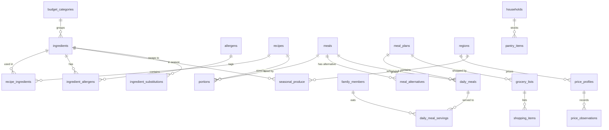

# 14 · Meal Planning Engine and Grocery System

> **Status:** Draft v1 for build · **Owner:** Planning and Grocery squad · **Related:** `00-foundations.md`, `05-database-schema.md`, `06-api-specification.md`, `12-ai-agent-architecture.md`, `13-islamic-knowledge-module.md`, `15-family-health-modules.md`, `17-subscription-architecture.md`, `18-exports-and-analytics.md`, `21-testing-strategy.md`
>
> This document specifies how Thuluth turns a household's profile into a weekly or monthly plan of meals with per-member portions, and how that plan becomes a priced, budget-aware grocery list. Table, enum and Edge Function names are those of `00-foundations.md`. Anything new is labelled **Addition beyond 00-foundations** and collected in [section 22](#22-additions-beyond-00-foundations).

## Table of contents

1. [Scope and design principles](#1-scope-and-design-principles)
2. [Data model overview](#2-data-model-overview)
3. [TypeScript domain types](#3-typescript-domain-types)
4. [Nutritional profile storage and computation](#4-nutritional-profile-storage-and-computation)
5. [Meal types and daily schedule](#5-meal-types-and-daily-schedule)
6. [Portions by life stage and household measures](#6-portions-by-life-stage-and-household-measures)
7. [Autism and picky-eater adaptations as data](#7-autism-and-picky-eater-adaptations-as-data)
8. [Plan generation algorithm](#8-plan-generation-algorithm)
9. [Validation gates](#9-validation-gates)
10. [Grocery list generation](#10-grocery-list-generation)
11. [Budget optimization](#11-budget-optimization)
12. [Price tracking](#12-price-tracking)
13. [Substitution engine](#13-substitution-engine)
14. [Seasonal recommendations](#14-seasonal-recommendations)
15. [Seed: Punjab seasonal produce by month](#15-seed-punjab-seasonal-produce-by-month)
16. [Seed: Pakistan pricing profile (Lahore, October 2026)](#16-seed-pakistan-pricing-profile-lahore-october-2026)
17. [Seed: reference meal library (Lahore family template)](#17-seed-reference-meal-library-lahore-family-template)
18. [Edge Function contracts](#18-edge-function-contracts)
19. [Free vs premium behaviour](#19-free-vs-premium-behaviour)
20. [Performance budgets](#20-performance-budgets)
21. [Acceptance criteria](#21-acceptance-criteria)
22. [Additions beyond 00-foundations](#22-additions-beyond-00-foundations)

---

## 1. Scope and design principles

| Principle | What it means for the engine |
|---|---|
| **One base family meal, many adaptations** | A `daily_meals` row is one pot. Each member gets a `daily_meal_servings` row with their portion and, where needed, an adaptation (`autism`, `picky`, `allergy`, `pregnancy`). We never plan separate children's menus. |
| **Deterministic core, AI on the edges** | Candidate selection, constraint checks, nutrient roll-up, portions and grocery math are deterministic TypeScript in `packages/shared/src/planning/`. The AI (`plan.generate`, `plan.adjust` routes) writes the plan brief (weights, themes, preferences parsed from intake) and the rationale, and may propose new recipes, which still pass every gate. See `12-ai-agent-architecture.md`. |
| **Children are never restricted** | No calorie targets for under-18s, child portions are a *starting* serving with seconds always allowed. Enforced in gate G3 ([section 9](#9-validation-gates)). |
| **Thuluth plate** | Adult plate: half vegetables and fruit, a quarter protein, a quarter whole grain. Children: roughly equal quarters protein, grain, vegetables, fruit or dairy, more on request. |
| **Halal and Tayyib first** | Haram ingredients never enter a plan. `mashbooh` and `depends_on_source` ingredients are flagged (for example "buy halal-certified chicken") and excludable per household. |
| **Cook once, eat twice** | Dinners are cooked at 1.5x and become the next day's lunch or lunchbox. Batch nights (shami kebabs, haleem) feed the freezer. |
| **Seasonal and budget aware** | Seasonal produce scores higher and costs less; budget strictness drives substitutions. |
| **Predictable rhythm** | Weekday protein rhythm and weekday breakfast rotation help autistic children and simplify shopping. |

Out of scope here: the intake wizard UI (`02-ux-specification.md`), the prompt text (`12-ai-agent-architecture.md`), Islamic citations attached to plan items (`13-islamic-knowledge-module.md`), growth, hydration and fasting rules (`15-family-health-modules.md`).

---

## 2. Data model overview



Key relationships, using the canonical tables:

| Concept | Table(s) | Notes |
|---|---|---|
| Ingredient | `ingredients`, `ingredient_allergens`, `allergens` | Global catalog, per-100 g nutrients, halal status, textures, colour. |
| Recipe | `recipes`, `recipe_ingredients` | Steps, servings, computed `per_serving_nutrition`. |
| Meal | `meals` | Composition of recipes and sides (`components`), `plate_split`. This is what plans schedule. |
| Portion | `portions` | Per life stage grams and household measure, for a `meal_id` or a `recipe_id`. |
| Alternative | `meal_alternatives` | Pre-authored swaps per reason (`allergy`, `budget`, `autism`, `picky`, `season`, `preference`). |
| Allergen | `allergens` | EU-14 + US Big-9 superset (sesame included). |
| Budget category | `budget_categories` | Ten codes; each ingredient maps to one. |

### 2.1 Column additions used by this document

All marked **Addition beyond 00-foundations**. DDL belongs in a migration owned by this squad and should be reflected in `05-database-schema.md`.

```sql
-- Addition beyond 00-foundations: cooking yield factors and shelf life on ingredients
alter table ingredients
  add column yield_factors jsonb not null default '{}'::jsonb,  -- {"boiled":2.8,"pressure_cooked":2.5,"roasted":0.72}
  add column shelf_life_days smallint,                           -- at home, typical storage; null = shelf stable (>90 d)
  add column purchase_units jsonb not null default '[]'::jsonb,  -- [{"unit":"dozen","grams":660},{"unit":"kg","grams":1000}]
  add column aisle text;                                         -- 'sabzi','fruit','meat','dairy','dry_goods','spices','other'

-- Addition beyond 00-foundations: tiered child portions (start / ideal / extra)
alter table portions
  add column tier text not null default 'standard'
    check (tier in ('standard','start','ideal','extra'));

-- Addition beyond 00-foundations: leftover and batch links between planned meals
alter table daily_meals
  add column batch_multiplier numeric(3,1) not null default 1.0 check (batch_multiplier between 0.5 and 4.0),
  add column source_daily_meal_id uuid null references daily_meals(id) on delete set null, -- this slot eats leftovers of that slot
  add column is_lunchbox boolean not null default false;

-- Addition beyond 00-foundations: weekly themes on a plan
alter table meal_plans
  add column weekly_themes jsonb not null default '[]'::jsonb;   -- [{"week":1,"key":"rhythm_bismillah","title_i18n":{...},"body_i18n":{...}}]

-- Addition beyond 00-foundations: outlier status on observations
alter table price_observations
  add column status text not null default 'accepted'
    check (status in ('pending','accepted','rejected_outlier','rejected_manual')),
  add column unit_grams numeric(8,1);   -- grams represented by `unit` at observation time (e.g. 1 dozen eggs = 660)
```

New tables:

```sql
-- Addition beyond 00-foundations: household pantry for deduction
create table pantry_items (
  id uuid primary key default gen_random_uuid(),
  household_id uuid not null references households(id) on delete cascade,
  ingredient_id uuid null references ingredients(id),
  label text not null,
  grams numeric(9,1) not null check (grams >= 0),
  expires_on date null,
  updated_by uuid not null references users(id),
  created_at timestamptz not null default now(),
  updated_at timestamptz not null default now(),
  deleted_at timestamptz null
);
create index pantry_items_household_idx on pantry_items (household_id) where deleted_at is null;
alter table pantry_items enable row level security;
create policy pantry_rw on pantry_items for all
  using (is_household_member(household_id) and deleted_at is null)
  with check (is_household_member(household_id));

-- Addition beyond 00-foundations: substitution rules (global, admin-managed)
create table ingredient_substitutions (
  id uuid primary key default gen_random_uuid(),
  from_ingredient_id uuid not null references ingredients(id),
  to_ingredient_id uuid not null references ingredients(id),
  reason text not null check (reason in ('allergy','budget','season','availability','halal','preference')),
  ratio numeric(5,3) not null default 1.000,         -- grams of `to` per gram of `from`
  nutrient_similarity numeric(4,3) not null,          -- 0..1, computed (section 13.2)
  culinary_fit smallint not null check (culinary_fit between 1 and 3), -- curator judgement
  notes_i18n jsonb not null default '{}'::jsonb,
  region_codes text[] null,                           -- null = everywhere
  created_at timestamptz not null default now(),
  updated_at timestamptz not null default now(),
  unique (from_ingredient_id, to_ingredient_id, reason)
);
```

Materialized view (Addition beyond 00-foundations) for current prices, refreshed by `prices-refresh`; defined in [section 12.4](#124-current-price-computation-prices-refresh).

---

## 3. TypeScript domain types

These live in `packages/shared/src/domain/food.ts` and mirror the tables. Zod schemas with the same names plus `Schema` suffix live in `packages/shared/src/contracts/food.ts` and are the source for both client and Edge Function validation.

```ts
// packages/shared/src/domain/enums.ts (generated from 00-foundations section 5)
export type MealType = 'suhoor' | 'breakfast' | 'lunch' | 'snack' | 'dinner' | 'iftar';
export type LifeStage = 'infant' | 'toddler' | 'child' | 'teen' | 'adult' | 'older_adult';
export type Texture = 'smooth' | 'soft' | 'crunchy' | 'chewy' | 'crispy' | 'mixed' | 'lumpy' | 'wet' | 'dry';
export type Severity = 'mild' | 'moderate' | 'severe' | 'anaphylactic';
export type MealStatus = 'planned' | 'eaten' | 'partly_eaten' | 'skipped' | 'swapped';
export type PlanKind = 'standard' | 'ramadan' | 'growth' | 'weight_management' | 'custom';
export type PlanStatus = 'draft' | 'generating' | 'active' | 'completed' | 'archived' | 'failed';
export type PriceSource = 'seed' | 'user_report' | 'admin' | 'partner_feed';
export type VerificationStatus = 'unverified' | 'in_review' | 'verified' | 'rejected';

export type HalalStatus = 'halal' | 'haram' | 'mashbooh' | 'depends_on_source';
export type BudgetCategoryCode =
  | 'staples' | 'protein_animal' | 'protein_plant' | 'dairy' | 'produce_veg'
  | 'produce_fruit' | 'oils_fats' | 'spices' | 'beverages' | 'snacks';
export type AlternativeReason = 'allergy' | 'budget' | 'autism' | 'picky' | 'season' | 'preference';
export type Adaptation = 'none' | 'autism' | 'picky' | 'allergy' | 'pregnancy';
export type I18nText = Partial<Record<'en' | 'ur' | 'ar' | 'fr' | 'tr' | 'ms' | 'id' | 'bn', string>>;
```

```ts
// packages/shared/src/domain/food.ts
import type { Texture, MealType, LifeStage, HalalStatus, BudgetCategoryCode,
  AlternativeReason, VerificationStatus, I18nText } from './enums';

/** Per-100 g nutrient vector. Keys match ingredients columns exactly. */
export interface Nutrients {
  kcal: number; protein_g: number; carbs_g: number; fiber_g: number; sugar_g: number;
  fat_g: number; sat_fat_g: number; sodium_mg: number; iron_mg: number; calcium_mg: number;
  zinc_mg: number; vitamin_a_mcg: number; vitamin_c_mg: number; vitamin_d_mcg: number;
  b12_mcg: number; folate_mcg: number; potassium_mg: number; omega3_g: number;
}
export const NUTRIENT_KEYS = [
  'kcal','protein_g','carbs_g','fiber_g','sugar_g','fat_g','sat_fat_g','sodium_mg','iron_mg',
  'calcium_mg','zinc_mg','vitamin_a_mcg','vitamin_c_mg','vitamin_d_mcg','b12_mcg','folate_mcg',
  'potassium_mg','omega3_g',
] as const satisfies readonly (keyof Nutrients)[];

export type CookingMethod = 'raw' | 'boiled' | 'pressure_cooked' | 'steamed' | 'roasted'
  | 'tawa' | 'shallow_fried' | 'baked' | 'simmered';

export interface PurchaseUnit { unit: 'kg' | 'g' | 'L' | 'ml' | 'dozen' | 'piece' | 'bunch' | 'lot' | 'bottle' | 'pack'; grams: number }

export interface Ingredient {
  id: string;
  name: string;
  nameI18n: I18nText;
  category: string;                 // free taxonomy: 'vegetable','fruit','grain','legume','meat','fish','egg','dairy','nut','seed','oil','spice','sweetener','condiment','beverage'
  budgetCategoryId: string;
  defaultUnit: string;
  per100g: Nutrients;
  halalStatus: HalalStatus;
  isSunnahFood: boolean;
  fdcId: number | null;
  textures: Texture[];
  color: string | null;             // 'beige','white','yellow','orange','red','green','purple','brown'
  yieldFactors: Partial<Record<CookingMethod, number>>; // Addition
  shelfLifeDays: number | null;     // Addition
  purchaseUnits: PurchaseUnit[];    // Addition
  aisle: string | null;             // Addition
  allergenCodes: string[];          // joined from ingredient_allergens
}

export interface Allergen { id: string; code: string; nameI18n: I18nText }

export interface BudgetCategory { id: string; code: BudgetCategoryCode; nameI18n: I18nText }

export interface RecipeIngredient {
  id: string;
  recipeId: string;
  ingredientId: string;
  quantity: number;
  unit: string;
  grams: number;                    // raw edible grams after normalization
  optional: boolean;
  prepNote: string | null;
  cookingMethod?: CookingMethod;    // parsed from prep_note or steps; default per recipe
}

export interface RecipeStep { n: number; textI18n: I18nText; durationMin?: number; childTask?: boolean }

export interface PerServingNutrition extends Nutrients {
  servings: number;
  totalCookedG: number;
  servingCookedG: number;
  per100gCooked: Nutrients;
  computedAt: string;               // ISO instant
  calcVersion: number;              // bump when the algorithm changes; triggers recompute
  completeness: number;             // 0..1 share of recipe grams with full nutrient data
}

export interface Recipe {
  id: string;
  title: string;
  titleI18n: I18nText;
  cuisine: string;                  // 'pakistani_punjabi','pakistani_sindhi','arab_gulf','levantine','turkish','british','generic'
  regionTags: string[];
  mealTypes: MealType[];
  servings: number;
  prepMin: number;
  cookMin: number;
  steps: RecipeStep[];
  textureProfile: Texture[];
  colors: string[];
  kidFriendly: boolean;
  autismFriendly: boolean;
  ramadanSuitable: boolean;
  costTier: 1 | 2 | 3;
  perServingNutrition: PerServingNutrition | null;
  imagePath: string | null;
  source: 'curated' | 'ai_generated' | 'user';
  reviewStatus: VerificationStatus;
  ingredients: RecipeIngredient[];
}

export interface PlateSplit { veg: number; protein: number; carb: number } // fractions summing to 1 (+/- 0.05)

export type MealComponent =
  | { kind: 'recipe'; recipeId: string; role: 'main' | 'side' | 'bread' | 'rice' | 'salad' | 'dip' | 'fruit' | 'drink'; servingsShare: number }
  | { kind: 'ingredient'; ingredientId: string; role: 'side' | 'fruit' | 'drink' | 'garnish'; gramsPerAdult: number };

export interface Meal {
  id: string;
  title: string;
  titleI18n: I18nText;
  mealType: MealType;
  components: MealComponent[];
  plateSplit: PlateSplit;
  tags: string[];                   // derived: 'protein','fiber','healthy_fat','fruit_veg','sunnah:dates', ...
}

export interface Portion {
  id: string;
  mealId: string | null;
  recipeId: string | null;
  lifeStage: LifeStage;
  tier: 'standard' | 'start' | 'ideal' | 'extra';   // Addition
  grams: number;
  householdMeasure: string;         // i18n key or literal per locale, e.g. "1 roti + 1 katori salan"
  householdMeasureI18n?: I18nText;
  kcal: number;                     // stored for adults; never shown to children (see 15)
}

export interface MealAlternative {
  id: string;
  mealId: string;
  alternativeMealId: string;
  reason: AlternativeReason;
  notes: string | null;
}
```

Plan-side types:

```ts
// packages/shared/src/domain/plan.ts
export interface MealPlan {
  id: string; householdId: string; kind: PlanKind; status: PlanStatus;
  startDate: string; endDate: string; weekCount: number;
  generatedByAssessmentId: string | null; budgetProfileId: string | null;
  rationale: string | null; version: number; parentPlanId: string | null;
  weeklyThemes: WeeklyTheme[];      // Addition
}
export interface WeeklyTheme { week: number; key: string; titleI18n: I18nText; bodyI18n: I18nText }

export interface DailyMeal {
  id: string; mealPlanId: string; householdId: string; planDate: string;
  mealType: MealType; mealId: string; scheduledTime: string | null; notes: string | null;
  batchMultiplier: number;          // Addition
  sourceDailyMealId: string | null; // Addition: leftovers of
  isLunchbox: boolean;              // Addition
}

export interface DailyMealServing {
  id: string; dailyMealId: string; householdId: string; familyMemberId: string;
  portionId: string | null; adaptation: Adaptation; adaptedMealId: string | null;
  status: MealStatus; acceptance: AcceptanceScore | null; loggedAt: string | null;
  presentation?: ServingPresentation;   // stored in daily_meal_servings via adapted meal or notes; see section 7
}
export type AcceptanceScore = '0_refused' | '1_tolerated' | '2_touched' | '3_tasted' | '4_ate_some' | '5_ate_well';
```

---

## 4. Nutritional profile storage and computation

### 4.1 Storage

| Level | Where | Basis |
|---|---|---|
| Ingredient | `ingredients` per-100 g columns | **Raw, edible portion** (after peeling or boning). Source priority: USDA FoodData Central (`fdc_id`), then Pakistan Food Composition Table (2001, Aga Khan University / NIH Pakistan) for local items such as atta, desi ghee and local daals, then manufacturer labels. Source is recorded in the admin tool's audit trail. |
| Recipe | `recipes.per_serving_nutrition` jsonb | Computed, never hand-entered. Shape is `PerServingNutrition`. |
| Meal | Computed on read from components; cached in React Query and in the plan snapshot | A meal is a thin composition. |
| Portion | `portions.kcal` stored; other nutrients computed `grams x per100gCooked / 100` | Adult kcal shown only to adults who enable it. |
| Daily total per member | Computed in plan validation; stored in `meal_plans` snapshot for G-gates | Not stored per day as a table in v1. |

### 4.2 Recipe roll-up

For each recipe ingredient *i* with raw grams *g_i* and per-100 g nutrient vector *n_i*:

```
totalNutrients = Σ_i (g_i / 100) × n_i × r_i
```

where *r_i* is a retention factor for heat-labile vitamins (vitamin C, folate, B12) by cooking method, from the USDA Table of Nutrient Retention Factors, Release 6. Defaults used in v1 (applied to vitamin C and folate only; other nutrients `r = 1`):

| Method | Vitamin C retention | Folate retention |
|---|---|---|
| raw | 1.00 | 1.00 |
| steamed | 0.80 | 0.75 |
| boiled (water kept, as in curries, daal, shorba) | 0.70 | 0.70 |
| boiled (water drained) | 0.50 | 0.50 |
| pressure_cooked | 0.75 | 0.70 |
| simmered (long, more than 45 min) | 0.50 | 0.55 |
| roasted, tawa, baked | 0.75 | 0.80 |
| shallow_fried | 0.70 | 0.70 |

Optional ingredients are excluded from the default roll-up and reported separately as `optionalNutrients` in the admin view.

### 4.3 Cooking yield factors

Yield factor = cooked weight / raw weight, per ingredient and method, stored in `ingredients.yield_factors`. The cooked weight of a recipe is:

```
totalCookedG = Σ_i g_i × y_i(method_i) + addedWaterRetainedG
```

`addedWaterRetainedG` is zero unless the recipe declares broth or gravy water explicitly (step metadata `retainedWaterMl`). Reference values seeded in v1:

| Ingredient | Method | Yield |
|---|---|---|
| Rice, sella or basmati | boiled / pulao | 2.80 |
| Brown rice | boiled | 2.60 |
| Masoor, moong daal | simmered | 2.50 (with gravy water declared separately) |
| Kabuli chana, rajma (dry) | pressure_cooked | 2.30 |
| Chicken with bone | simmered (curry) | 0.75 |
| Beef curry cut | simmered | 0.65 |
| Beef mince | tawa / bhuna | 0.72 |
| Fish (rohu) | tawa | 0.80 |
| Whole-wheat atta to roti | tawa (dough water lost) | 1.35 (35 g atta yields about 47 g roti) |
| Spinach | simmered | 0.55 |
| Lauki, pumpkin | simmered | 0.85 |
| Oats | boiled in milk and water | 4.00 (includes liquid; milk counted as its own ingredient) |
| Eggs | boiled | 1.00 |

### 4.4 Per serving and per portion

```ts
// packages/shared/src/planning/nutrition.ts
export const CALC_VERSION = 3;

export function computeRecipeNutrition(
  recipe: Pick<Recipe, 'servings' | 'ingredients'>,
  catalog: Map<string, Ingredient>,
  defaultMethod: CookingMethod = 'simmered',
): PerServingNutrition {
  const total = zeroNutrients();
  let cooked = 0, gramsKnown = 0, gramsAll = 0;
  for (const ri of recipe.ingredients) {
    if (ri.optional) continue;
    const ing = catalog.get(ri.ingredientId);
    gramsAll += ri.grams;
    if (!ing) continue;
    const method = ri.cookingMethod ?? defaultMethod;
    const y = ing.yieldFactors[method] ?? ing.yieldFactors.raw ?? 1;
    cooked += ri.grams * y;
    gramsKnown += ri.grams;
    for (const k of NUTRIENT_KEYS) {
      const r = retention(k, method);
      total[k] += (ri.grams / 100) * ing.per100g[k] * r;
    }
  }
  const servings = Math.max(1, recipe.servings);
  const perServing = scale(total, 1 / servings);
  const per100gCooked = cooked > 0 ? scale(total, 100 / cooked) : zeroNutrients();
  return {
    ...round(perServing),
    servings,
    totalCookedG: Math.round(cooked),
    servingCookedG: Math.round(cooked / servings),
    per100gCooked: round(per100gCooked),
    computedAt: new Date().toISOString(),
    calcVersion: CALC_VERSION,
    completeness: gramsAll > 0 ? gramsKnown / gramsAll : 0,
  };
}

export function portionNutrients(portionGrams: number, n: PerServingNutrition): Nutrients {
  return round(scale(n.per100gCooked, portionGrams / 100));
}
```

Recomputation triggers:

```sql
-- Mark recipes stale when an ingredient's nutrients or yield change, or when recipe_ingredients change.
create or replace function mark_recipe_nutrition_stale() returns trigger language plpgsql as $$
begin
  if tg_table_name = 'ingredients' then
    update recipes r set per_serving_nutrition = per_serving_nutrition || '{"stale":true}'::jsonb
    where exists (select 1 from recipe_ingredients ri where ri.recipe_id = r.id and ri.ingredient_id = new.id);
  else
    update recipes set per_serving_nutrition = coalesce(per_serving_nutrition,'{}'::jsonb) || '{"stale":true}'::jsonb
    where id = coalesce(new.recipe_id, old.recipe_id);
  end if;
  return null;
end $$;
```

A nightly `pg_cron` job calls the admin Edge route used by the catalog tool (part of `prices-refresh` scheduling, see `10-supabase-structure.md`) to recompute all `stale` recipes with `computeRecipeNutrition`. Recipes with `completeness < 0.9` cannot be set `review_status = 'verified'`.

### 4.5 Daily member totals and targets

Energy and macro targets come from `ai_assessments.energy_targets` and `macro_targets` (see `12-ai-agent-architecture.md`). The planner uses them as **adult soft targets** and as **child floors**:

| Life stage | How targets are used |
|---|---|
| adult, older_adult | Daily planned energy within plus or minus 10 percent of target; protein at or above target; fiber at or above 25 g (women) or 30 g (men). Weight-loss goals: deficit no larger than 500 kcal/day and never below 1,200 kcal (women) or 1,500 kcal (men). |
| pregnancy, breastfeeding | No deficit. Pregnancy trimester 2 adds about 340 kcal, trimester 3 about 450 kcal; breastfeeding adds about 330 to 400 kcal (IOM 2005 / NASEM). |
| teen, child, toddler | **Floor only.** The planned *start* servings must meet at least 85 percent of the reference energy and 100 percent of protein, calcium and iron references; there is no upper bound. Targets are never displayed in child-facing UI (see `15-family-health-modules.md`). |
| infant | Out of planning scope under 6 months (milk feeding). From 6 to 12 months only complementary food suggestions, never a plan with portions in grams. |

---

## 5. Meal types and daily schedule

`meal_type` enum: `suhoor`, `breakfast`, `lunch`, `snack`, `dinner`, `iftar`.

| Plan kind | Default slots per day | Notes |
|---|---|---|
| `standard` | breakfast, lunch, snack, dinner | Optional second snack for children under 8 (toddlers often need 2). |
| `ramadan` | suhoor, iftar, dinner (or "iftar-dinner" combined), optional snack after Taraweeh | Non-fasting members (children under 7, exempt adults) keep breakfast and lunch slots, generated in the same plan. See `15-family-health-modules.md` section on Ramadan. |
| voluntary fast day inside a `standard` plan | breakfast becomes suhoor, dinner stays (per the reference program: "no making up at iftar") | Only for the fasting adult's serving; the family meal stays the same. |

Scheduled times derive from `family_members.work_schedule`, `sleep_schedule` and school times, then prayer times in Ramadan:

```ts
export interface SlotTimingRule {
  mealType: MealType;
  defaultTime: string;          // 'HH:mm' household local
  minGapFromPrevMin: number;    // e.g. snack at least 150 min after lunch
  minGapToNextMin: number;      // snack at least 120 min before dinner (appetite protection)
}
export const DEFAULT_TIMING: SlotTimingRule[] = [
  { mealType: 'breakfast', defaultTime: '07:15', minGapFromPrevMin: 0,   minGapToNextMin: 180 },
  { mealType: 'lunch',     defaultTime: '13:30', minGapFromPrevMin: 180, minGapToNextMin: 150 },
  { mealType: 'snack',     defaultTime: '16:30', minGapFromPrevMin: 150, minGapToNextMin: 120 },
  { mealType: 'dinner',    defaultTime: '19:45', minGapFromPrevMin: 120, minGapToNextMin: 0 },
];
```

The Thuluth fluid timing (water 20 to 30 minutes before, sips during, freely from 30 to 60 minutes after) is attached to each slot as hydration schedule windows by the hydration engine (`15-family-health-modules.md`), not stored on `daily_meals`.

---

## 6. Portions by life stage and household measures

### 6.1 Life stage mapping

`life_stage` is derived from age at plan start (see `05-database-schema.md` for the trigger). The planner assumes:

| life_stage | Age | Portion approach |
|---|---|---|
| infant | 0 to 11 months | No portions; complementary food notes only from 6 months. |
| toddler | 12 to 35 months | Start serving about one quarter to one third of adult; divided plate; choking-safe textures. |
| child | 3 to 12 years | Three tiers: `start`, `ideal`, `extra`. Start is what is served; seconds always allowed. |
| teen | 13 to 17 years | Adult-like portions, `ideal` plus `extra`; never a deficit. |
| adult | 18 to 64 | `standard`, scaled to the member's energy target. |
| older_adult | 65 and above | `standard` scaled, protein emphasis (1.0 to 1.2 g/kg), softer textures on request. |

### 6.2 Household measures

Household measures are the primary UI unit; grams are secondary and hidden for children. Seeded measure dictionary (`packages/shared/src/planning/measures.ts`), from the reference Lahore program:

| Measure key | en | ur | Grams or ml |
|---|---|---|---|
| `roti` | 1 roti (6 to 7 inch whole wheat) | ایک روٹی | 35 to 40 g atta, about 47 g cooked, about 100 to 120 kcal |
| `roti_half` | ½ roti | آدھی روٹی | about 24 g cooked |
| `katori` | 1 katori (small bowl) | ایک کٹوری | 200 ml |
| `katori_half` | ½ katori | آدھی کٹوری | 100 ml |
| `cup` | 1 cup | ایک کپ | 240 ml |
| `glass` | 1 glass | ایک گلاس | 200 to 250 ml (default 220) |
| `palm_protein` | 1 palm of protein (adult) | ایک ہتھیلی | 90 to 120 g cooked meat or fish |
| `fist_veg` | 1 fist of vegetables | ایک مٹھی | about 80 g |
| `cupped_hand_carb` | 1 cupped hand | ایک چلو | about 75 g cooked rice |
| `thumb_fat` | 1 thumb of fat | ایک انگوٹھا | 1 tsp oil or ghee (5 g), or 1 tbsp nut butter |
| `tbsp` / `tsp` | tablespoon / teaspoon | چمچ / چائے کا چمچ | 15 ml / 5 ml |

Measures are rendered by `formatHouseholdMeasure(grams, foodKind, locale, lifeStage)` which picks the nearest friendly fraction (¼, ⅓, ½, ¾, 1, 1¼, 1½) and never prints grams for child-facing views.

### 6.3 Portion rows per meal

Each curated meal ships portion rows for `adult` (standard), `older_adult` (standard), `teen` (ideal, extra), `child` (start, ideal, extra) and `toddler` (start, extra). Example from the reference library, meal "Chicken and Lauki Salan + Roti + Kachumber" (D1):

| life_stage | tier | household_measure | grams (cooked, whole plate) |
|---|---|---|---|
| adult (weight-loss husband) | standard | 1½ roti + 1¼ katori salan (1½ palms chicken) + large kachumber | 560 |
| adult (wife) | standard | 1 roti + 1 katori salan + kachumber | 430 |
| child (son, 8) | start | ½ roti + ⅓ katori salan | 160 |
| child | ideal | 1 roti + ½ katori salan (1 drumstick) + cucumber | 280 |
| child | extra | +½ roti and more salan | 120 (added) |
| toddler / child with autism adaptation | start | ½ roti + soft boneless chicken pieces + soft lauki cubes, separate; cucumber sticks | 150 |

### 6.4 Adult scaling

```ts
export function adultPortionMultiplier(memberKcal: number, referenceKcal: number): number {
  // reference portions are authored for 2,000 kcal (adult) / 1,800 kcal (older adult)
  const m = memberKcal / referenceKcal;
  return Math.min(1.4, Math.max(0.75, Math.round(m * 4) / 4)); // quarter steps, clamped
}
```

Weight-loss adults get the multiplier applied to the carbohydrate and fat components only, with vegetables at or above 1.0 and protein at or above 1.0 (the "bigger salad, palm-and-a-half protein, smaller roti" pattern). Children and teens never get a multiplier below 1.0.

---

## 7. Autism and picky-eater adaptations as data

Adaptations are first-class data, not free text, so the planner, the grocery list and analytics all see them.

### 7.1 Representation

| Mechanism | Storage | Used for |
|---|---|---|
| **Adapted meal** | A `meals` row authored as the adapted version (for example "D1-A: deconstructed chicken, lauki and roti strips"), linked by `meal_alternatives(reason='autism' or 'picky')`; the serving points to it with `daily_meal_servings.adapted_meal_id` and `adaptation='autism'` | Different composition or texture. |
| **Deconstructed serving** | Adapted meal `components` with `role` per component and presentation metadata in `meals.components[].presentation` | "Lift her chicken and lauki out before adding chilli; serve deconstructed." |
| **Safe-food side** | `food_preferences.is_safe_food = true` rows for the member; the planner adds one safe food as a `side` component to that member's serving | "One section always holds a safe food." |
| **Learning plate item** | Exposure target from an active `exposure_ladders` row; added as a `learning` component with no portion expectation | Weekly exposure foods (see `15-family-health-modules.md`). |
| **Presentation preferences** | `sensory_profiles.presentation_prefs` | Divided plate, foods not touching, same cut shape, sauce on side, same cup. |

Presentation metadata shape (inside `meals.components[]` of adapted meals, and copied to the serving snapshot):

```ts
export interface ServingPresentation {
  separateComponents: boolean;           // foods never touching
  plate: 'divided_3' | 'divided_4' | 'regular' | 'bowl';
  sauceOnSide: boolean;
  cutShape?: 'strips' | 'coins' | 'cubes' | 'halves' | 'pinwheels' | 'whole';
  textureTarget?: Texture;               // e.g. 'smooth' => blend
  spiceLevel: 0 | 1 | 2;                 // 0 = remove before chilli is added
  temperature?: 'warm' | 'lukewarm' | 'room';
  safeFoodIngredientId?: string;
  learningFoodIngredientId?: string;     // exposure, no expectation
  childTaskKey?: string;                 // 'top_own_bowl','squeeze_lemon','peel_egg','roll_energy_bites'
  noteI18n?: I18nText;
}
```

### 7.2 Adaptation selection rules

```ts
export function chooseAdaptation(member: MemberContext, meal: Meal, catalog: Catalog): ServingPlan {
  // 1. Allergy always wins: if any component contains an allergen of this member, pick
  //    meal_alternatives(reason='allergy') that is allergen-free, else component-level removal
  //    if the allergen is only in an optional/side component, else fail -> planner must reselect base meal.
  // 2. Autism module active: if meal texture/colour not in member's sensory 'likes' or contains an 'avoid',
  //    pick meal_alternatives(reason='autism'); if none, generate deconstructed variant automatically:
  //      - split components, sauceOnSide=true, spiceLevel=0, textureTarget=closest liked texture
  // 3. Picky module active: keep the family meal, add safe-food side, apply childTaskKey and
  //    "familiar + new" pairing; use meal_alternatives(reason='picky') only if no safe food is available.
  // 4. Always add one safe food for members with autism or picky modules.
  // 5. Pregnancy: swap components failing pregnancy safety (undercooked egg, raw sprouts, high-mercury fish,
  //    unpasteurised dairy) via substitutions(reason='preference') with note.
}
```

Automatic deconstruction is only allowed when every component is individually palatable plain (curated flag `components[].servablePlain = true`). Otherwise the planner must use a curated alternative or choose a different base meal for that day.

---

## 8. Plan generation algorithm

### 8.1 Pipeline

```mermaid
sequenceDiagram
  participant App
  participant GEN as ai-generate-plan (Edge)
  participant DB as Postgres
  participant LLM as plan.generate route
  App->>GEN: POST {householdId, kind, startDate, weekCount}
  GEN->>DB: insert meal_plans(status='generating')
  GEN-->>App: 202 {mealPlanId}
  GEN->>DB: load household context (members, health, prefs, sensory, budget, region, season, prices)
  GEN->>LLM: plan brief request (structured output)
  LLM-->>GEN: PlanBrief {weights, themes, mustInclude, avoid, notes}
  GEN->>GEN: candidate filter (hard constraints)
  GEN->>GEN: weekly solver (scoring, variety, leftovers)
  GEN->>GEN: per-member servings and adaptations
  GEN->>GEN: validation gates G1..G14
  alt all gates pass
    GEN->>LLM: rationale request (optional, plan.generate)
    GEN->>DB: insert daily_meals, daily_meal_servings, plan_recommendations; status='active'
  else gate fails after 3 repair attempts
    GEN->>DB: status='failed', error details
  end
  DB-->>App: Realtime update on meal_plans row
```

The AI never writes rows directly. It returns a `PlanBrief` (Zod-validated):

```ts
export interface PlanBrief {
  themeKeys: string[];                       // e.g. ['rhythm_bismillah','slow_down','fullness_check','make_it_ours']
  weights: Partial<ScoreWeights>;            // bounded overrides, each in [0, 2]
  mustIncludeIngredientIds: string[];        // e.g. favourites from intake
  avoidIngredientIds: string[];              // dislikes parsed from free text
  proteinRhythm?: Partial<Record<Weekday, ProteinGroup>>;
  proposedRecipes?: ProposedRecipe[];        // stored as recipes(source='ai_generated', review_status='unverified')
  notes: string[];                           // passed to rationale, not used for logic
}
```

AI-proposed recipes are usable in the requesting household's plan only after passing gates G1, G2, G6 and G12 and nutrition completeness of at least 0.9; they remain invisible to other households until an admin sets `review_status='verified'`.

### 8.2 Inputs

| Input | Source |
|---|---|
| Members, ages, life stages, activity | `family_members` |
| Allergies, intolerances | `allergies` + `ingredient_allergens` |
| Conditions and medications | `medical_conditions`, `medications.food_interaction_flags` (for example `warfarin_vitamin_k_consistency`, `maoi_tyramine`, `metformin_b12`) |
| Preferences, safe foods, dislikes | `food_preferences`, `food_dislikes` |
| Sensory profile | `sensory_profiles` |
| Goals | `nutrition_goals`, `ai_assessments` |
| Budget | `budget_profiles` (`monthly_amount_minor`, `strictness`, `category_split`) |
| Region, season, prices | `households.region` to `regions`, `seasonal_produce`, `mv_current_prices` |
| Exposure targets | `exposure_ladders` active rows |
| Leftover tolerance and cooking capacity | intake answers in `households` settings jsonb (see `05-database-schema.md`), default: cook once a day on weekdays, batch on weekend |

### 8.3 Hard constraints (candidate filter)

A meal is a candidate for a slot only if all hold:

1. `meal_type` matches the slot (or the meal's recipes list it in `meal_types`).
2. No ingredient is `halal_status = 'haram'`. `mashbooh` excluded unless household setting `allow_mashbooh = true` (default false). `depends_on_source` allowed with a sourcing note (for example meat, gelatin, cheese rennet).
3. No ingredient carries an allergen with `severity in ('severe','anaphylactic')` for **any** member (household-wide exclusion to avoid cross-contact). Allergens with `mild` or `moderate` severity exclude the meal for that member only, requiring an allergy adaptation (section 7.2).
4. No ingredient in any member's `food_dislikes` with `reason = 'religious'` (household-wide).
5. Prep time fits the day: weekday `prep_min + cook_min <= household.weekday_cook_limit_min` (default 45), weekend 180.
6. Medication interactions: meals violating an active flag are excluded for that member (adaptation) or household-wide if the meal is a shared main.
7. Children under 5: no whole nuts, whole peanuts, whole grapes, hard raw carrot chunks, popcorn in their serving (choking gate, G9, enforced by adaptation not exclusion where possible).
8. Recipes with `review_status in ('verified')`, or `ai_generated` from this household's own brief (rule above), or `source='user'` owned by this household.

### 8.4 Scoring

```ts
export interface ScoreWeights {
  nutritionFit: number;   // default 1.0
  preference: number;     // 0.8
  cost: number;           // 0.7 (1.2 when strictness='hard_cap')
  season: number;         // 0.5
  variety: number;        // 1.0 (penalty)
  prepFit: number;        // 0.4
  leftoverSynergy: number;// 0.6
  sunnahFood: number;     // 0.3
  childAcceptance: number;// 0.8 when any child has picky or autism module, else 0.3
  exposureFit: number;    // 0.4
}

export function scoreMeal(m: Candidate, ctx: SlotContext, w: ScoreWeights): number {
  return (
    w.nutritionFit   * nutritionFit(m, ctx)        // 0..1: closeness to remaining daily targets, plate split
  + w.preference     * preference(m, ctx)          // -1..1: likes (+strength/3), dislikes (-1), favourites
  + w.cost           * costScore(m, ctx)           // 0..1: 1 - estCost / slotBudget, clamped
  + w.season         * seasonScore(m, ctx)         // 0..1: mean availability of produce (peak 1, available 0.6, scarce 0.1)
  - w.variety        * varietyPenalty(m, ctx)      // 0..∞ : see 8.5
  + w.prepFit        * prepFit(m, ctx)             // 0..1
  + w.leftoverSynergy* leftoverSynergy(m, ctx)     // 0..1: produces a usable lunch tomorrow
  + w.sunnahFood     * sunnahScore(m)              // 0..1: share of components with is_sunnah_food
  + w.childAcceptance* acceptanceProbability(m, ctx) // 0..1 from acceptance history (15)
  + w.exposureFit    * exposureFit(m, ctx)         // 0..1: contains this week's exposure target in a safe pairing
  );
}
```

`acceptanceProbability` uses the member's last 90 days of `daily_meal_servings.acceptance` and `food_exposures` for the meal's main ingredients, with a Beta(2,2) prior, mapped from the 0 to 5 scale (4 or 5 counts as accepted).

### 8.5 Variety rules

| Rule | Value | Enforcement |
|---|---|---|
| Same dinner or lunch meal | Not within 7 days (14 days for monthly plans when the library allows) | Penalty 10 (effectively hard) |
| Breakfast rotation | Weekday rotation allowed and encouraged (Monday oats, Tuesday omelette, Saturday talbina) | No penalty if same weekday; penalty 2 if same breakfast on consecutive days |
| Protein rhythm (default, overridable) | Mon chicken, Tue daal, Wed fish, Thu beef, Fri legumes, Sat chicken one-pot, Sun batch dish | Bonus 0.3 when matched |
| Red meat dinners | At most 3 per week | Hard |
| Fish | At least 1 per week unless allergy or dislike | Soft, penalty 1.5 if missing at week end |
| Legume meals | At least 3 per week | Soft |
| Distinct plant foods | Target 30 per week (grains, legumes, vegetables, fruit, nuts, seeds, herbs and spices count) | Soft, reported in plan summary |
| Deep-fried mains | At most 1 per week | Hard |
| Same main ingredient on consecutive dinners | Penalty 1 | Soft |

### 8.6 Plate split

`meals.plate_split` is authored for the adult plate. Gate G5 checks adult plates have `veg >= 0.40`, `protein in [0.20, 0.35]`, `carb in [0.20, 0.35]`. Meals that are soups or one-pots declare `plate_split` including their side salad. For child servings the target is quarters, checked across the day, not per meal.

### 8.7 Leftovers and cook-once-eat-twice

```
for each dinner slot d on day t:
  if d.meal.leftoverFriendly and household.packedLunches > 0:
     d.batch_multiplier = 1.5
     create lunch slot on day t+1 with meal = d.meal.leftoverMeal (e.g. D1 -> L2 "chicken roti wrap")
       source_daily_meal_id = d.id; is_lunchbox = member has school/work flag
  if d.meal.isBatchNight (shami, haleem, koftas):
     d.batch_multiplier = 2.0 .. 3.0
     register freezer stock (virtual pantry) for lunchbox slots in days t+1 .. t+21
```

`meals.components[].leftoverMealId` (authored) names the canonical "next day" meal. The grocery generator multiplies only the source slot by `batch_multiplier` and does **not** buy ingredients for slots with `source_daily_meal_id` set. Food safety rules apply: cooked food eaten within 2 to 3 days or frozen; reheated once only (shown in the meal card).

### 8.8 Weekly themes

Default theme sequence for 4-week plans (from the reference program), stored in `meal_plans.weekly_themes`:

| Week | key | Title | Body |
|---|---|---|---|
| 1 | `rhythm_bismillah` | Rhythm and Bismillah | Fixed meal and snack times, eat together, start every meal with Bismillah. Adults practise the 20-minute meal. |
| 2 | `slow_down` | Slow Down | Put the spoon or roti down between bites, chew well, adults pause 15 minutes before any second serving. |
| 3 | `fullness_check` | The Fullness Check | Before getting up, ask "Could I eat more if I had to?" If yes but no longer hungry, stop (adults). |
| 4 | `make_it_ours` | Make It Ours | Keep what worked, note favourites, plan next month's rotation together. |

Ramadan plans use the themes in `15-family-health-modules.md`.

### 8.9 Solver pseudocode

```text
function generatePlan(ctx, brief):
  weights = mergeBounded(DEFAULT_WEIGHTS, brief.weights)
  slots   = buildSlots(ctx.startDate, ctx.weekCount, ctx.kind, ctx.members)
  plan    = []
  for week in 1..weekCount:
    weekBudget = ctx.budget.monthly * 7/30.4 (minus monthly staples share, section 11)
    order slots: batch nights first, then dinners, then lunches (leftover-linked filled automatically),
                 then breakfasts (weekday rotation), then snacks
    for slot in orderedSlots(week):
      if slot is leftover-linked: plan.push(linkedLeftover(slot)); continue
      C = candidates(slot)                      # hard constraints 8.3
      if C empty: C = relaxSoft(slot)           # drop prep limit, then season, never allergy/halal
      if C empty: fail('NO_CANDIDATES', slot)
      scored = sortDesc(C, m => scoreMeal(m, slotCtx(plan, slot), weights))
      pick   = beamSelect(scored.top(8), beamWidth=4, lookahead=same-week-dinners)
      plan.push(assign(slot, pick))
      updateRunningTotals(plan, slot)
    weekRepair(plan, week)                      # swap to satisfy fish/legume/plant-diversity minima
  servings = for each slot, for each member: portionFor(member, slot.meal) + chooseAdaptation(...)
  result = runGates(plan, servings)             # section 9
  attempts = 0
  while result.failed and attempts < 3:
    plan = repair(plan, result.failures)        # targeted reselect of offending slots
    result = runGates(plan, servings); attempts++
  return result.failed ? Failure(result) : Success(plan, servings, summary(plan))
```

`beamSelect` keeps the four best partial weekly dinner sequences to avoid greedy dead ends (for example using the only fish meal on Monday when the protein rhythm wants it Wednesday). Complexity is bounded: at most 7 x 8 x 4 evaluations per week for dinners.

### 8.10 Plan adjustment (`ai-adjust-plan`)

A natural-language change ("no fish this week, my son has exams, cheaper please") becomes a `PlanAdjustment` from the `plan.adjust` route: `{ scope: {from, to, mealTypes?}, addAvoid, removeAvoid, weightDeltas, budgetDelta, lockSlots }`. The engine copies the plan to a new `meal_plans` row with `version + 1` and `parent_plan_id`, keeps locked and past slots, and re-runs 8.9 on the scope. Logged servings in the past are never altered.

---

## 9. Validation gates

Every generated or adjusted plan must pass these gates before `status = 'active'`. Gates live in `packages/shared/src/planning/gates.ts`, are pure functions, and are unit-tested with fixtures in `21-testing-strategy.md`.

| Gate | Rule | Failure action |
|---|---|---|
| **G1 Halal** | No `haram` ingredient; `mashbooh` only if allowed; `depends_on_source` items carry a sourcing note | Hard fail, repair |
| **G2 Allergy** | No member serving contains an allergen they have; severe or anaphylactic allergens absent from the whole household plan | Hard fail, repair |
| **G3 Child non-restriction** | For members under 18: no kcal targets in serving data exposed to client, no `weight_loss` goal applied, start portions meet floors (section 4.5), every child serving has `tier='start'` with an `extra` available | Hard fail, repair |
| **G4 Adult energy band** | Adults within plus or minus 10 percent of target daily; weight-loss deficit at most 500 kcal and above floors; pregnancy and breastfeeding no deficit | Hard fail, repair |
| **G5 Plate split** | Adult plates per section 8.6; children quarters across the day | Soft: repair once, else warn |
| **G6 Nutrient completeness** | Every recipe used has `completeness >= 0.9` and fresh (`stale` false) nutrition | Hard fail (recompute then retry) |
| **G7 Variety** | Rules in 8.5 marked hard | Hard fail, repair |
| **G8 Budget** | Estimated cost within budget per strictness: `hard_cap` at most 100 percent, `target` at most 110 percent, `flexible` no gate but warning above 125 percent | Run budget optimizer (section 11), then fail with `BUDGET_INFEASIBLE` including the minimum feasible cost |
| **G9 Choking safety** | Under-5 servings exclude listed choking hazards or carry the required modification (ground nuts, thin nut butter, halved grapes, soft-cooked carrot) | Hard fail, repair adaptation |
| **G10 Safe food present** | Members with autism or picky modules have at least one safe food in every meal serving | Hard fail, repair adaptation |
| **G11 Medication interactions** | Flags respected; for `warfarin_vitamin_k_consistency`, weekly vitamin K variance under threshold (leafy greens evenly spread) | Hard fail, repair |
| **G12 Pregnancy safety** | No raw or undercooked eggs, meat or fish, no unpasteurised dairy (loose milk must be boiled, shown as a step), no high-mercury fish (shark, swordfish, king mackerel), liver at most once a week (vitamin A) | Hard fail, repair |
| **G13 Ramadan** | No fasting slots for members under 7; suhoor and iftar present for fasting members; non-fasting members have day meals; diabetes on insulin or sulfonylureas blocks fasting plan generation pending clinician confirmation (red flag, `15-family-health-modules.md`) | Hard fail |
| **G14 Free tier scope** | Free users: one active weekly plan, curated templates only (section 19) | Hard fail with `PREMIUM_REQUIRED` |

Gate results are stored on the plan in `meal_plans.rationale` (human text) and in the generation job log (`ai_usage` row metadata and Sentry breadcrumb), never including health values in logs.

---

## 10. Grocery list generation

`grocery-generate` builds a `grocery_lists` row and its `shopping_items` from a plan (or ad hoc).

### 10.1 Algorithm

```text
function generateGroceryList(planId, period, options):
  slots = daily_meals where meal_plan_id = planId and plan_date in period and source_daily_meal_id is null
  need  = Map<ingredientId, grams>
  for slot in slots:
    for serving in daily_meal_servings(slot):
      meal = serving.adapted_meal_id ?? slot.meal_id
      grams = portionGrams(serving) * slot.batch_multiplier     # cooked grams per member
      for component in meal.components:
        rawGramsByIngredient = scaleRecipeToCookedGrams(component, grams * component.share)
        accumulate(need, rawGramsByIngredient)
  need = applyWasteFactor(need)              # +5% produce trim, +0% dry goods
  need = deductPantry(need, pantry_items)    # section 10.3
  items = []
  for (ingredient, grams) in need:
    unit  = choosePurchaseUnit(ingredient, grams)          # section 10.2
    price = currentPrice(region, city, ingredient, unit)   # section 12.4
    items.push({ingredient, qty: roundUp(grams/unit.grams, step), unit, estimated_minor: qty*price,
                is_fresh: isFresh(ingredient), aisle: ingredient.aisle})
  split items into weekly (is_fresh) and monthly lists per options.period (section 10.4)
  if premium: runBudgetOptimizer(items, budget_profile)     # section 11
  persist grocery_lists + shopping_items; estimated_total_minor = Σ estimated_minor
```

Scaling a recipe to cooked grams uses the recipe's `totalCookedG`: `rawGrams_i = g_i × (servingGrams / totalCookedG)`.

### 10.2 Unit normalization

All internal math is in grams (liquids: ml with density, milk 1.03 g/ml, oil 0.92 g/ml). Purchase units come from `ingredients.purchase_units`:

| Ingredient | Purchase units (grams) | Rounding step |
|---|---|---|
| Eggs | dozen (660), piece (55) | 1 dozen when need above 8, else pieces |
| Bananas | dozen (1,400) | ½ dozen |
| Milk | L (1,030) | 1 L |
| Chicken whole with bone | kg | 0.5 kg |
| Atta | kg; bag 10 kg, 20 kg | 5 kg for monthly |
| Green chillies, coriander, mint | lot (one weekly bunch set) | 1 lot |
| Spices refill | lot | 1 lot per month |
| Oils | L (920) | 0.5 L, 1 L, 3 L, 5 L tins |

`choosePurchaseUnit` picks the unit that minimizes `(waste grams × price per gram) + (pack count × 0.01)` and prefers the household's `region` common unit (Pakistan: kg, dozen, L; UK: packs; per price profile).

### 10.3 Pantry deduction

```ts
export function deductPantry(need: Map<string, number>, pantry: PantryItem[], today: string): Map<string, number> {
  const out = new Map(need);
  for (const p of pantry) {
    if (!p.ingredientId) continue;
    if (p.expiresOn && p.expiresOn < today) continue;           // expired stock does not count
    const n = out.get(p.ingredientId); if (n == null) continue;
    out.set(p.ingredientId, Math.max(0, n - p.grams));
  }
  for (const [k, v] of out) if (v < 1) out.delete(k);
  return out;
}
```

When a list is marked `done`, checked items with an `ingredient_id` increment `pantry_items` by purchased grams; at plan day end, consumption decrements pantry by planned grams for eaten or partly eaten servings (`partly_eaten` counts 50 percent). Pantry is premium-only in v1 for automatic tracking; free users can tick "I already have this" per item, which sets `quantity = 0` on that item for the current list only.

### 10.4 Fresh weekly vs monthly purchasing

| Rule | Value |
|---|---|
| `is_fresh = true` | `shelf_life_days <= 10` or aisle in (`sabzi`, `fruit`, `meat`, `dairy`) |
| Weekly list | All fresh items for that plan week, generated per week with `period = 'weekly'` |
| Monthly list (premium) | Non-fresh staples (atta, rice, daals, oils, spices, dry fruits, tea) for 4 weeks in one `period='monthly'` list, plus weekly fresh lists |
| Meat and fish | Weekly by default; option "buy monthly and freeze" moves them to the monthly list with freezer instructions |
| Freeze-when-cheap | Tomatoes, peas, spinach flagged with a tip when `seasonal_produce.availability = 'peak'` (for example "freeze tomato puree when cheap") |
| Market hints (Pakistan) | Weekly bazaar (Itwar bazaar) for produce, sabzi mandi for 5 kg onions, potatoes and tomatoes, chakki for barley and atta (from the reference program) |

---

## 11. Budget optimization

Premium only (free users see the estimated total and a single "over budget" notice).

### 11.1 Budget envelope

`budget_profiles.monthly_amount_minor` with `category_split` (fractions per `budget_categories.code`). Default Pakistan split for a family of four, derived from the reference Lahore list:

| Category | Share |
|---|---|
| staples | 0.14 |
| protein_animal | 0.33 |
| protein_plant | 0.06 |
| dairy | 0.18 |
| produce_veg | 0.12 |
| produce_fruit | 0.08 |
| oils_fats | 0.04 |
| spices | 0.02 |
| beverages | 0.01 |
| snacks (nuts, dry fruit, dates) | 0.02 |

### 11.2 Optimizer

A greedy marginal-savings optimizer with nutrient guardrails:

```text
function optimize(items, plan, budget, strictness):
  target = budget * (strictness == 'hard_cap' ? 1.00 : strictness == 'target' ? 1.00 : 1.10)
  if total(items) <= target: return items
  candidates = []
  for swap in SWAP_RULES (section 11.3) ∪ substitutions(reason='budget' or 'season'):
    if swap violates allergy/halal/preference(strength 3)/sensory safe food: skip
    Δcost  = savings(swap, items)
    Δnutr  = nutrientLoss(swap, plan)          # weighted: protein 3, iron 3, calcium 2, fiber 2, others 1
    if Δcost <= 0: skip
    candidates.push({swap, ratio: Δcost / (1 + 10*Δnutr)})
  sort candidates by ratio desc
  for c in candidates:
    apply c; recompute
    if gates G2,G3,G4,G7,G12 fail: revert; continue
    if total <= target: break
  return items, appliedSwaps (shown to user as "Savings applied" with undo)
```

### 11.3 Seed swap rules (from the reference program "lean swaps", PKR per month, family of four)

| Code | Swap | Typical saving (PKR/month) |
|---|---|---|
| `beef_to_chana_egg` | Replace one beef dinner a week with a chana daal and egg curry | 1,300 |
| `fish_alternate_egg` | Fish every other week, alternate with egg curry | 1,125 |
| `nuts_to_peanuts_chana` | Walnuts and almonds to peanuts and roasted chana only | 1,200 |
| `fruit_bazaar_seasonal` | Fruit only from the weekly bazaar, seasonal only | 700 |
| `cheese_to_paneer` | Cheese to homemade paneer only | 600 |
| `olive_oil_drizzle_only` | Olive oil for two drizzles a week; canola or mustard oil otherwise | 450 |
| `halve_adult_chai` | Halve adult chai (also better for iron absorption) | 470 |
| `bulk_onion_tomato_potato` | Buy onions, tomatoes, potatoes by the 5 kg at the sabzi mandi | 500 |
| `oats_half_dalia` | Replace half the oats with dalia (cracked wheat), about a third of the price | 350 |
| `farm_eggs_not_desi` | Farm eggs instead of desi eggs (similar nutrition, about half the price) | variable |

Savings figures are recomputed live from current prices; the table values are seed display defaults.

### 11.4 Budget tracking

Actual spend comes from `budget_entries` (manual entry, or `actual_minor` on checked `shopping_items`, summed per category on list completion). The budget dashboard (see `02-ux-specification.md`) shows month-to-date versus envelope per category, cost per person per day, and the swaps applied.

---

## 12. Price tracking

### 12.1 Model

`price_profiles` is a regional price book (`region_id`, `city`, `currency`, `effective_from`). `price_observations` are individual data points. Money is `amount_minor bigint` in the currency's minor unit (PKR has an ISO 4217 exponent of 2, so PKR 120 is stored as `12000`).

### 12.2 Sources and trust

| `price_source` | Trust weight | Notes |
|---|---|---|
| `seed` | 0.3 | Curated launch values (section 16). Decays to zero influence once 5 or more accepted non-seed observations exist in 60 days. |
| `user_report` | 0.5 (0.7 for reporters with 10 or more accepted reports and under 10 percent rejected) | From the "price looks wrong?" control on shopping items and from `actual_minor` entry (opt-in "share my prices anonymously"). |
| `admin` | 1.0 | Ops team market surveys. |
| `partner_feed` | 0.9 | Phase 2 partner feeds. |

User reports store `reporter_user_id`, but the published price never exposes it. Reports are rate-limited to 50 per user per day (RPC check).

### 12.3 Outlier rejection

On insert (trigger calling `price_observation_screen()`), a report is compared to the trailing 60-day accepted observations for the same `(price_profile_id, ingredient_id)` normalized to price per kg (via `unit_grams`):

```sql
create or replace function price_observation_screen() returns trigger language plpgsql as $$
declare med numeric; mad numeric; ppk numeric; n int;
begin
  if new.unit_grams is null or new.unit_grams <= 0 then
    new.status := 'rejected_manual'; return new;
  end if;
  ppk := new.amount_minor * 1000.0 / new.unit_grams;
  select percentile_cont(0.5) within group (order by po.amount_minor * 1000.0 / po.unit_grams), count(*)
    into med, n
  from price_observations po
  where po.price_profile_id = new.price_profile_id and po.ingredient_id = new.ingredient_id
    and po.status = 'accepted' and po.observed_on >= new.observed_on - 60;
  if n < 5 then
    new.status := case when new.source in ('admin','partner_feed') then 'accepted' else 'pending' end;
    return new;
  end if;
  select percentile_cont(0.5) within group (order by abs(po.amount_minor * 1000.0 / po.unit_grams - med))
    into mad
  from price_observations po
  where po.price_profile_id = new.price_profile_id and po.ingredient_id = new.ingredient_id
    and po.status = 'accepted' and po.observed_on >= new.observed_on - 60;
  -- modified z-score (Iglewicz and Hoaglin); 3.5 threshold; also hard band +/-60%
  if (mad > 0 and abs(0.6745 * (ppk - med) / mad) > 3.5) or ppk > med * 1.6 or ppk < med * 0.4 then
    new.status := case when new.source = 'admin' then 'accepted' else 'rejected_outlier' end;
  else
    new.status := 'accepted';
  end if;
  return new;
end $$;

create trigger price_observation_screen_trg before insert on price_observations
for each row execute function price_observation_screen();
```

`pending` observations (thin data) are accepted by `prices-refresh` when at least 2 independent reporters agree within 15 percent, or by an admin.

Seasonal shocks (for example tomato prices tripling in a shortage) are handled by the hard band using a 14-day window when the `seasonal_produce.availability` for the month is `scarce`, so the median moves faster.

### 12.4 Current price computation (`prices-refresh`)

Runs every 6 hours. Recency-weighted median per ingredient per profile, half-life 21 days:

```sql
-- Addition beyond 00-foundations
create materialized view mv_current_prices as
with obs as (
  select po.price_profile_id, po.ingredient_id,
         po.amount_minor * 1000.0 / po.unit_grams as price_per_kg_minor,
         case po.source when 'admin' then 1.0 when 'partner_feed' then 0.9
                        when 'user_report' then 0.5 else 0.3 end
         * power(0.5, (current_date - po.observed_on) / 21.0) as w
  from price_observations po
  where po.status = 'accepted' and po.observed_on >= current_date - 120
),
ranked as (
  select *, sum(w) over (partition by price_profile_id, ingredient_id order by price_per_kg_minor) as cw,
            sum(w) over (partition by price_profile_id, ingredient_id) as tw
  from obs
)
select distinct on (price_profile_id, ingredient_id)
       price_profile_id, ingredient_id,
       round(price_per_kg_minor)::bigint as price_per_kg_minor,
       tw as total_weight, now() as refreshed_at
from ranked
where cw >= tw / 2
order by price_profile_id, ingredient_id, price_per_kg_minor;

create unique index mv_current_prices_pk on mv_current_prices (price_profile_id, ingredient_id);
```

`prices-refresh` runs `refresh materialized view concurrently mv_current_prices` and writes a staleness metric (ingredients with `total_weight < 0.5`) to logs.

### 12.5 Regional profiles and fallback

`currentPrice(region, city, ingredient)` resolution order:

1. Profile for `(region, city)` with the latest `effective_from <= today`.
2. Profile for `(region, city is null)`.
3. Sibling city in the same country, adjusted by the city multiplier table (section 16.3).
4. No price: item shows "price unknown" and is excluded from the total with a count of unknown items.

---

## 13. Substitution engine

### 13.1 Priority of reasons

When several reasons apply, rules are applied in this order; a later rule may not undo an earlier one:

1. **allergy** (safety)
2. **halal** (religious requirement)
3. **availability** (not sold in the region or out of stock reported)
4. **season** (scarce this month)
5. **budget**
6. **preference** (dislike, sensory)

### 13.2 Similarity

```ts
export function nutrientSimilarity(a: Nutrients, b: Nutrients): number {
  // cosine similarity on a z-scaled vector of key nutrients per 100 kcal
  const keys = ['protein_g','fiber_g','fat_g','iron_mg','calcium_mg','vitamin_c_mg','vitamin_a_mcg','zinc_mg'] as const;
  const va = keys.map(k => perKcal(a, k) / REF_SD[k]);
  const vb = keys.map(k => perKcal(b, k) / REF_SD[k]);
  return cosine(va, vb);   // 0..1 after clamping negatives to 0
}
```

### 13.3 Rule examples (seed)

| From | To | Reason | Ratio | Note |
|---|---|---|---|---|
| Peanuts | Roasted chana (bhuna chana) | allergy (peanut) | 1.0 | Also replaces peanut butter with sunflower or roasted chana paste |
| Walnuts | Pumpkin seeds or flaxseed | allergy (tree nut) | 0.8 | |
| Wheat roti | Rice, bajra roti, makai roti | allergy (wheat, gluten) | 1.0 by cooked weight | Coeliac: also barley and oats unless certified gluten-free |
| Cow milk | Not substituted by default for children | allergy (milk) | n/a | Requires calcium plan; planner flags "talk to your paediatrician or dietitian about a fortified alternative" |
| Eggs (binding in kebabs) | Besan slurry | allergy (egg) | 15 g besan per egg | |
| Fish | Chicken or chana daal + egg | allergy (fish) | 1.0 protein-equivalent | Omega-3 note: flaxseed, walnuts |
| Gelatin (unspecified) | Agar-agar | halal | 0.5 | |
| Cheese with animal rennet of unknown source | Homemade paneer | halal | 1.0 | |
| Vanilla extract (alcohol-based) | Vanilla powder | halal | per recipe | Flag only; scholarly views differ, user setting |
| Meat with unknown slaughter | "Halal-certified" sourcing note | halal | n/a | Never substituted silently |
| Guava (scarce Feb to Jul) | Orange, kinnow (winter) or mango, melon (summer) | season | 1.0 | Vitamin C preserved |
| Spinach (scarce summer) | Bottle gourd with methi, or frozen spinach | season | 1.0 | |
| Turnip (out of season) | Bottle gourd or pumpkin | season | 1.0 | |
| Beef curry cut | Chicken with bone, or chana daal + egg | budget | protein-equivalent | |
| Rolled oats | Dalia (cracked wheat), half and half | budget | 1.0 | |
| Olive oil (cooking) | Canola or sunflower oil | budget | 1.0 | Keep olive oil raw for drizzles |
| Walnuts, almonds | Peanuts, roasted chana | budget | 1.0 | |

### 13.4 Engine

```ts
export function findSubstitute(
  ingredientId: string, reasons: SubstitutionReason[], ctx: SubstitutionContext,
): Substitution | null {
  const ordered = [...reasons].sort(byPriority);
  let pool = ctx.rules.filter(r => r.fromIngredientId === ingredientId && ordered.includes(r.reason));
  pool = pool.filter(r => {
    const to = ctx.catalog.get(r.toIngredientId)!;
    return isHalalAllowed(to, ctx) && !hasMemberAllergen(to, ctx.members)
      && !isReligiousDislike(to, ctx) && isAvailable(to, ctx.region, ctx.month)
      && (!r.regionCodes || r.regionCodes.includes(ctx.regionCode));
  });
  return pool.sort((a, b) =>
      priority(a.reason) - priority(b.reason)
   || (b.culinaryFit * 0.5 + b.nutrientSimilarity) - (a.culinaryFit * 0.5 + a.nutrientSimilarity)
   || priceOf(a.toIngredientId, ctx) - priceOf(b.toIngredientId, ctx)
  )[0] ?? null;
}
```

Substituted shopping items set `shopping_items.substitution_for_item_id` to the replaced item (kept as a hidden row with quantity 0 for transparency and undo).

---

## 14. Seasonal recommendations

| Feature | Rule |
|---|---|
| Season score in planning | Availability for the plan month: peak 1.0, available 0.6, scarce 0.1, no row 0 (excluded unless frozen form exists) |
| Price index | `seasonal_produce.price_index` (1.0 = annual average) multiplies seed prices before observations exist |
| Home card "In season this month" | Top 8 peak items for the household region with one recipe each, Sunnah foods tagged |
| Freeze-when-cheap tips | Peak items with `freezable = true` in ingredient metadata |
| Summer swap list | When month enters May, plans flip guava, turnip, carrot, spinach, sweet potato to summer items (lauki, tinda, okra, mango, melon) |
| Region coverage | v1 seeds Punjab (applies to Lahore and Islamabad). Karachi uses the Sindh adjustments in section 15.3. |

---

## 15. Seed: Punjab seasonal produce by month

Legend: **P** peak, **A** available, **S** scarce, **·** not normally in market (no row seeded). Source: curated from Punjab agricultural calendars and Lahore market experience; to be validated by the ops team against Lahore Market Committee rate lists during Sprint 1. Seed `region_code = 'PK-PB'`.

### 15.1 Vegetables

| Item (`ingredients.name`) | Jan | Feb | Mar | Apr | May | Jun | Jul | Aug | Sep | Oct | Nov | Dec |
|---|---|---|---|---|---|---|---|---|---|---|---|---|
| Cauliflower (gobhi) | P | P | A | S | S | S | S | S | S | A | P | P |
| Cabbage (band gobhi) | P | P | A | S | S | S | S | S | S | A | P | P |
| Carrot (gajar) | P | P | A | S | · | · | · | · | · | S | A | P |
| Turnip (shalgam) | P | A | S | · | · | · | · | · | · | A | P | P |
| Radish (mooli) | P | P | A | S | S | S | S | S | S | A | P | P |
| Spinach (palak) | P | P | A | S | S | S | S | S | S | A | P | P |
| Mustard greens (sarson) | P | P | A | · | · | · | · | · | · | · | A | P |
| Fenugreek leaves (methi) | P | P | A | S | · | · | · | · | · | A | P | P |
| Peas (matar) | P | P | A | S | · | · | · | · | · | S | A | P |
| Potato (aloo) | P | P | P | A | A | A | A | A | A | A | P | P |
| Onion (pyaz) | A | A | A | P | P | P | A | A | A | A | P | P |
| Tomato (tamatar) | A | A | P | P | P | A | S | S | S | P | P | P |
| Sweet potato (shakarkandi) | P | A | S | · | · | · | · | · | · | A | P | P |
| Pumpkin (kaddu) | S | S | S | S | S | A | A | A | P | P | P | A |
| Bottle gourd (lauki) | S | S | A | A | P | P | P | P | P | P | A | S |
| Okra (bhindi) | · | · | S | A | P | P | P | P | A | S | · | · |
| Bitter gourd (karela) | · | · | S | A | P | P | P | P | A | A | · | · |
| Apple gourd (tinda) | · | · | · | A | P | P | P | A | A | · | · | · |
| Ridge gourd (turai) | · | · | · | S | A | P | P | P | P | A | · | · |
| Eggplant (baingan) | A | A | A | A | A | P | P | P | P | P | P | A |
| Cucumber (kheera) | S | S | A | P | P | P | P | P | P | A | A | S |
| Taro (arvi) | · | · | · | · | · | S | A | P | P | P | A | · |
| Corn on cob (chhalli) | · | · | · | · | · | S | P | P | P | A | · | · |
| Capsicum (shimla mirch) | A | A | A | S | S | S | S | S | S | A | A | A |
| Coriander (dhania) | P | P | P | A | S | S | S | S | A | P | P | P |
| Mint (podina) | A | A | A | P | P | P | P | P | P | A | A | A |
| Lemon (lemu) | A | A | A | S | S | S | A | P | P | P | P | A |
| Garlic, ginger (largely imported) | A | A | A | A | A | A | A | A | A | A | A | A |

### 15.2 Fruits

| Item | Jan | Feb | Mar | Apr | May | Jun | Jul | Aug | Sep | Oct | Nov | Dec |
|---|---|---|---|---|---|---|---|---|---|---|---|---|
| Guava (amrood) | A | S | S | S | S | S | S | A | A | P | P | P |
| Kinnow | P | P | A | S | · | · | · | · | · | · | A | P |
| Musambi (sweet orange) | A | S | · | · | · | · | · | · | A | P | P | P |
| Banana (kela, Sindh supply) | P | P | P | A | A | A | A | A | A | P | P | P |
| Apple (seb, cold store Dec to Jul) | A | A | A | S | S | S | S | A | P | P | P | A |
| Pomegranate (anaar) | S | S | · | · | · | · | · | A | P | P | P | A |
| Papaya (papita) | A | A | A | A | A | A | A | A | A | A | A | A |
| Persimmon (japani phal) | · | · | · | · | · | · | · | · | S | P | P | S |
| Strawberry | A | P | P | A | · | · | · | · | · | · | · | S |
| Loquat (lokat) | · | · | S | P | A | · | · | · | · | · | · | · |
| Mango (aam) | · | · | · | · | A | P | P | P | A | · | · | · |
| Melon (kharbooza) | · | · | · | A | P | P | P | A | · | · | · | · |
| Watermelon (tarbooz) | · | · | · | A | P | P | P | A | · | · | · | · |
| Lychee | · | · | · | · | S | P | A | · | · | · | · | · |
| Apricot (khubani) | · | · | · | · | A | P | P | · | · | · | · | · |
| Peach (aaru) | · | · | · | · | S | P | P | A | · | · | · | · |
| Plum (aloo bukhara) | · | · | · | · | · | P | P | A | · | · | · | · |
| Jamun | · | · | · | · | · | P | P | · | · | · | · | · |
| Pear (nashpati) | · | · | · | · | · | · | P | P | A | A | · | · |
| Grapes (angoor, Quetta) | · | · | · | · | · | A | P | P | P | A | · | · |
| Fresh dates (dang, doka) | · | · | · | · | · | A | P | P | · | · | · | · |
| Dried dates (Aseel, pantry) | A | A | A | A | A | A | A | A | A | A | A | A |

### 15.3 Karachi (Sindh) adjustments

Karachi uses the Punjab table with these overrides (`region_code = 'PK-SD'`): bananas and papaya P all year; tomato and onion P from October to January (Sindh crop); mango P from mid-May (Sindhri) to July; guava A from November to February; leafy greens one level lower (P to A) in winter; seafood (pomfret, surmai, prawns) A all year with P from September to March. Islamabad uses the Punjab table with fruits from KP and Gilgit-Baltistan (apples, apricots, peaches) one level higher in their season.

### 15.4 Seed format

```sql
-- supabase/seed/seasonal_produce_pk_pb.sql (generated by scripts/seed/seasonal.ts from the tables above)
insert into seasonal_produce (region_id, ingredient_id, month, availability, price_index)
select r.id, i.id, s.month, s.availability, s.price_index
from (values
  ('guava', 10, 'peak', 0.75), ('guava', 11, 'peak', 0.70), ('guava', 12, 'peak', 0.75),
  ('guava', 1, 'available', 0.95), ('guava', 2, 'scarce', 1.40),
  ('turnip', 11, 'peak', 0.70), ('pumpkin', 10, 'peak', 0.60)
  -- ... one row per non-dot cell
) as s(ingredient_code, month, availability, price_index)
join regions r on r.country_code = 'PK' and r.region_code = 'PK-PB'
join ingredients i on i.name_i18n->>'code' = s.ingredient_code;
```

Default `price_index` by availability when not curated: peak 0.75, available 1.00, scarce 1.45.

---

## 16. Seed: Pakistan pricing profile (Lahore, October 2026)

### 16.1 Profile

```sql
insert into price_profiles (id, region_id, city, currency, effective_from)
select '7f3c0000-0000-4000-8000-00000000a001', r.id, 'Lahore', 'PKR', date '2026-10-01'
from regions r where r.country_code = 'PK' and r.region_code = 'PK-PB';
```

### 16.2 Seed prices

Approximate Lahore retail, October 2026 estimates from the reference program (`data.py`). Stored as `source = 'seed'`, `observed_on = '2026-10-01'`. `amount_minor` is PKR x 100.

| Ingredient | Unit | unit_grams | PKR | amount_minor | Budget category | Fresh |
|---|---|---|---|---|---|---|
| Onions | kg | 1000 | 120 | 12000 | produce_veg | yes |
| Tomatoes | kg | 1000 | 175 | 17500 | produce_veg | yes |
| Potatoes | kg | 1000 | 90 | 9000 | produce_veg | yes |
| Garlic | kg | 1000 | 400 | 40000 | produce_veg | yes |
| Ginger | kg | 1000 | 400 | 40000 | produce_veg | yes |
| Green chillies, coriander, mint | lot (weekly) | 600 | 600 per month (150 per week) | 60000 | produce_veg | yes |
| Lemons | kg | 1000 | 150 | 15000 | produce_veg | yes |
| Bottle gourd (lauki) | kg | 1000 | 160 | 16000 | produce_veg | yes |
| Pumpkin (kaddu) | kg | 1000 | 60 | 6000 | produce_veg | yes |
| Spinach (palak) | kg | 1000 | 100 | 10000 | produce_veg | yes |
| Carrots | kg | 1000 | 130 | 13000 | produce_veg | yes |
| Turnips (shalgam) | kg | 1000 | 90 | 9000 | produce_veg | yes |
| Cucumbers | kg | 1000 | 110 | 11000 | produce_veg | yes |
| Cabbage | kg | 1000 | 130 | 13000 | produce_veg | yes |
| Peas (fresh or frozen) | kg | 1000 | 250 | 25000 | produce_veg | yes |
| Sweet potato (shakarkandi) | kg | 1000 | 100 | 10000 | produce_veg | yes |
| Radish (mooli) | kg | 1000 | 80 | 8000 | produce_veg | yes |
| Bananas | dozen | 1400 | 180 | 18000 | produce_fruit | yes |
| Guava (amrood) | kg | 1000 | 200 | 20000 | produce_fruit | yes |
| Apples | kg | 1000 | 280 | 28000 | produce_fruit | yes |
| Papaya | kg | 1000 | 280 | 28000 | produce_fruit | yes |
| Pomegranate (anaar) | kg | 1000 | 350 | 35000 | produce_fruit | yes |
| Oranges, musambi, kinnow (from November) | dozen | 2400 | 200 | 20000 | produce_fruit | yes |
| Chicken, whole, cut with bone | kg | 1000 | 570 | 57000 | protein_animal | yes |
| Beef, curry cut with bone | kg | 1000 | 1300 | 130000 | protein_animal | yes |
| Beef mince (lean) | kg | 1000 | 1400 | 140000 | protein_animal | yes |
| Mutton with bone | kg | 1000 | 2200 | 220000 | protein_animal | yes |
| Fish, whole (rohu, thaila) | kg | 1000 | 750 | 75000 | protein_animal | yes |
| Eggs (farm) | dozen | 660 | 315 | 31500 | protein_animal | yes |
| Fresh milk (loose, boil before use) | L | 1030 | 210 | 21000 | dairy | yes |
| Cheese block (cheddar or mozzarella) | kg | 1000 | 2400 | 240000 | dairy | no |
| Masoor daal | kg | 1000 | 300 | 30000 | protein_plant | no |
| Moong daal | kg | 1000 | 390 | 39000 | protein_plant | no |
| Chana daal | kg | 1000 | 310 | 31000 | protein_plant | no |
| Kabuli chana (white chickpeas) | kg | 1000 | 380 | 38000 | protein_plant | no |
| Rajma (red kidney beans) | kg | 1000 | 550 | 55000 | protein_plant | no |
| Besan (gram flour) | kg | 1000 | 320 | 32000 | protein_plant | no |
| Bhuna chana (roasted chickpeas) | kg | 1000 | 600 | 60000 | snacks | no |
| Chakki atta (whole wheat) | kg | 1000 | 135 | 13500 | staples | no |
| Whole barley (jau), chakki-ground | kg | 1000 | 260 | 26000 | staples | no |
| Rolled oats (loose) | kg | 1000 | 700 | 70000 | staples | no |
| Brown rice | kg | 1000 | 550 | 55000 | staples | no |
| Sella rice | kg | 1000 | 420 | 42000 | staples | no |
| Daliya (cracked wheat) | kg | 1000 | 200 | 20000 | staples | no |
| Olive oil (extra virgin, raw use) | L | 920 | 3600 | 360000 | oils_fats | no |
| Canola or sunflower oil | L | 920 | 575 | 57500 | oils_fats | no |
| Desi ghee | kg | 1000 | 3400 | 340000 | oils_fats | no |
| Flaxseed (alsi) | kg | 1000 | 600 | 60000 | oils_fats | no |
| Dates (local Aseel) | kg | 1000 | 600 | 60000 | snacks | no |
| Peanuts, shelled | kg | 1000 | 900 | 90000 | snacks | no |
| Walnut kernels | kg | 1000 | 3000 | 300000 | snacks | no |
| Almonds (desi or kaghzi kernels) | kg | 1000 | 3600 | 360000 | snacks | no |
| Raisins | kg | 1000 | 1600 | 160000 | snacks | no |
| Dried figs (anjeer) | kg | 1000 | 4000 | 400000 | snacks | no |
| Kalonji (black seed) | kg | 1000 | 900 | 90000 | spices | no |
| Spice refill (haldi, zeera, dhania, mirch, garam masala, kali mirch, darchini, chaat masala) | lot (monthly) | 600 | 900 | 90000 | spices | no |
| Iodised salt | kg | 1000 | 60 | 6000 | spices | no |
| Honey (local, pure) | kg | 1000 | 2600 | 260000 | snacks | no |
| Vinegar (sirka) | bottle | 800 | 220 | 22000 | spices | no |
| Tea leaves | kg | 1000 | 2350 | 235000 | beverages | no |
| Sugar | kg | 1000 | 250 | 25000 | staples | no |

Generated as SQL by `scripts/seed/prices-pk.ts` into `supabase/seed/price_observations_pk_lahore_2026_10.sql`:

```sql
insert into price_observations (price_profile_id, ingredient_id, unit, unit_grams, amount_minor, observed_on, source, status)
select '7f3c0000-0000-4000-8000-00000000a001', i.id, v.unit, v.unit_grams, v.amount_minor, date '2026-10-01', 'seed', 'accepted'
from (values
  ('onion','kg',1000,12000), ('tomato','kg',1000,17500), ('potato','kg',1000,9000),
  ('chicken_whole_bone','kg',1000,57000), ('beef_curry_bone','kg',1000,130000),
  ('egg_farm','dozen',660,31500), ('milk_fresh_loose','L',1030,21000),
  ('atta_chakki','kg',1000,13500), ('masoor_daal','kg',1000,30000)
  -- ... remaining rows from the table
) as v(code, unit, unit_grams, amount_minor)
join ingredients i on i.name_i18n->>'code' = v.code;
```

Seed triggers bypass `price_observation_screen` because `n < 5` on an empty profile and `source='seed'` is inserted with explicit `status='accepted'` through a `security definer` seed function only.

**Reference basket check.** The reference 4-week Lahore list for a family of four (two adults, children 8 and 4) totals roughly PKR 75,000 to 80,000 at these prices before lean swaps, and about PKR 7,000 less with all eight lean swaps. The grocery generator's estimate for the seeded "Lahore family of four" template plan must land within plus or minus 8 percent of the reference list total (acceptance test AC-G4).

### 16.3 Karachi and Islamabad notes

Until each city has 5 or more accepted observations per ingredient, its profile is derived from Lahore with category multipliers (stored as `source='seed'` observations generated at seed time):

| Category | Karachi | Islamabad / Rawalpindi |
|---|---|---|
| produce_veg (Punjab-grown) | 1.08 | 1.10 |
| produce_veg (Sindh-grown: tomato, onion Oct to Jan) | 0.95 | 1.10 |
| produce_fruit | 1.05 (bananas 0.90) | 1.08 (apples, apricots in season 0.95) |
| protein_animal (meat, chicken) | 1.05 | 1.08 |
| Fish | Sea fish replaces river fish: pomfret, surmai, rohu less common; multiplier 0.85 for local sea fish | 1.15 (river fish) |
| dairy (loose milk) | 1.10 | 1.12 |
| staples, protein_plant, spices, oils | 1.02 | 1.04 |
| snacks (dry fruit) | 1.00 | 0.98 |

Karachi profile `region_code = 'PK-SD'`, Islamabad `region_code = 'PK-IS'` (Islamabad Capital Territory) using the Punjab seasonal table. Prices must be reviewed monthly by ops until user reports dominate; Pakistan food inflation is volatile, so `prices-refresh` raises a staleness alert if a profile's median observation age exceeds 45 days.

---

## 17. Seed: reference meal library (Lahore family template)

The curated launch library imports the reference 4-week program: 8 breakfasts (B1 to B8), 9 snacks (S1 to S9), 12 lunches (L0, L1, L1b, L1c, L2, L3, L3b, L4 to L7) and 23 dinners (D1 to D25, minus unused numbers). Each becomes a `meals` row with recipes, portions per life stage and tier, an autism-adapted meal linked via `meal_alternatives(reason='autism')`, a picky-eater serving note (`childTaskKey` and presentation), fluid-timing text keys and a Thuluth reminder key.

Mapping from the reference fields:

| Reference field | Target |
|---|---|
| `name`, `foods` | `meals.title`, recipe `steps` and `recipe_ingredients` |
| `H` (husband), `W` (wife) | `portions` adult `standard` rows (two variants via multiplier 1.25 and 1.0) |
| `S` tuple (son minimum, ideal, extra) | `portions` child `start`, `ideal`, `extra` |
| `D` (daughter) | adapted meal (autism) portion `start` for child and toddler |
| `son` | picky presentation note and `childTaskKey` |
| `dau` | `ServingPresentation` of the autism adapted meal |
| `fluid` | hydration schedule hint key (`15-family-health-modules.md`) |
| `thul` | Thuluth reminder i18n key shown on the meal card (adults) |
| `save` | budget tip i18n key |
| `tags` | derived tags, verified by gate (every meal has protein, fiber, healthy fat, fruit or vegetable) |
| `sunnah` | ingredient `is_sunnah_food` links and `foods_in_narrations` (`13-islamic-knowledge-module.md`) |
| `PLAN` (4-week grid) | template `meal_plans` for the "Lahore family of four" demo and free-tier curated templates |
| `EXPOSURE` | example `exposure_ladders` in `15-family-health-modules.md` |

Leftover links seeded: D1 to L2 (chicken wrap), D2 to L3 (daal-atta roti), D3 or D10 to L4 (fish roll), D4 or D11 to L5 (curry with roti), D5 or D12 to L6 (legume bowl), D6 to L7 (fried rice), D7 to L1 (shami rolls, freezer), D9 to L3b (khichdi bowl), D14 to L1b (haleem bowl), D21 to L1c (mutton shorba).

---

## 18. Edge Function contracts

Full HTTP specs are in `06-api-specification.md`; the shapes the engine depends on:

```ts
// packages/shared/src/contracts/plan.ts
export const GeneratePlanRequest = z.object({
  householdId: z.string().uuid(),
  kind: z.enum(['standard','ramadan','growth','weight_management','custom']),
  startDate: z.string().regex(/^\d{4}-\d{2}-\d{2}$/),
  weekCount: z.number().int().min(1).max(4),
  templateMealPlanId: z.string().uuid().optional(),   // free tier path
  options: z.object({
    packedLunches: z.boolean().default(true),
    batchDay: z.enum(['saturday','sunday','none']).default('sunday'),
    allowMashbooh: z.boolean().default(false),
  }).partial().default({}),
});
export const GeneratePlanResponse = z.object({ mealPlanId: z.string().uuid(), status: z.literal('generating') });

// packages/shared/src/contracts/grocery.ts
export const GroceryGenerateRequest = z.object({
  householdId: z.string().uuid(),
  mealPlanId: z.string().uuid().nullable(),
  period: z.enum(['weekly','monthly','adhoc']),
  startsOn: z.string(), endsOn: z.string(),
  optimizeBudget: z.boolean().default(true),           // ignored for free tier
  usePantry: z.boolean().default(true),                // ignored for free tier
});
export const GroceryGenerateResponse = z.object({
  groceryListIds: z.array(z.string().uuid()),          // monthly + weekly lists when period='monthly'
  estimatedTotalMinor: z.number().int(), currency: z.string().length(3),
  unknownPriceCount: z.number().int(),
  appliedSwaps: z.array(z.object({ code: z.string(), savingMinor: z.number().int(), undoToken: z.string() })),
  budgetStatus: z.enum(['under','near','over','infeasible']),
});
```

Error codes: `NO_CANDIDATES`, `GATE_FAILED` (details list gate ids), `BUDGET_INFEASIBLE` (details `minFeasibleMinor`), `PREMIUM_REQUIRED`, `PLAN_ALREADY_ACTIVE`, `SAFETY_ESCALATION` (error catalog in `06-api-specification.md` section 2.3; from the health modules, plan generation stops).

---

## 19. Free vs premium behaviour

Per `00-foundations.md` section 8:

| Capability | Free | Premium |
|---|---|---|
| Plan generation | One active weekly plan from curated templates, light AI personalization (brief limited to weights and avoid list, no proposed recipes, Haiku-class route allowed for the brief) | Unlimited, 1 to 4 weeks, full brief including proposed recipes, adjustments |
| Adaptations | Safe-food side and allergy adaptation always (safety is never paywalled) | Full autism adapted meals, exposure-fit scoring, learning-plate items |
| Grocery | Basic list from plan, aggregated and unit normalized, estimated total | Budget optimization, substitutions, monthly purchasing split, pantry, price tracking and reports |
| Price reporting | Can submit reports | Same, plus price trend charts |

---

## 20. Performance budgets

| Operation | Budget (p95) |
|---|---|
| Weekly plan solve (deterministic part, family of 6) | 1.5 s CPU in Edge Function |
| End-to-end plan generation including AI brief and rationale | 45 s (async, progress via Realtime) |
| Grocery list generation (4 weeks) | 2 s |
| `mv_current_prices` refresh | 60 s at 1M observations |
| Recipe nutrition recompute (all recipes) | 5 min nightly |

---

## 21. Acceptance criteria

| ID | Criterion |
|---|---|
| AC-P1 | A household with a member who has an anaphylactic peanut allergy never receives a plan containing any ingredient tagged peanut, in any member's serving, across 1,000 randomized fixture runs. |
| AC-P2 | No plan for a member under 18 includes a `weight_loss` goal effect, a kcal value in the client payload for that member, or a start portion below the floor. |
| AC-P3 | Haram ingredients never appear; `depends_on_source` items show a sourcing note in the meal card and grocery list. |
| AC-P4 | The same lunch or dinner meal does not repeat within 7 days; breakfasts follow weekday rotation when the library allows. |
| AC-P5 | Every dinner flagged leftover-friendly is cooked at 1.5x and the linked lunch exists next day, and the grocery list does not double-buy it. |
| AC-P6 | A member with the autism module has a safe food and a presentation spec in every serving. |
| AC-P7 | Plan generation for a 4-week Lahore family of four completes in under 45 s p95 in staging. |
| AC-G1 | Grocery totals equal the sum of item estimates; units are normalized to purchase units; quantities never negative. |
| AC-G2 | Pantry deduction reduces quantities and ignores expired stock. |
| AC-G3 | A user report 3x the median is stored with `status = 'rejected_outlier'` and does not change `mv_current_prices`. |
| AC-G4 | The seeded Lahore template plan's 4-week grocery estimate is within plus or minus 8 percent of the reference list total. |
| AC-G5 | Budget optimizer with `hard_cap` either brings the estimate under budget without breaking gates G2, G3, G4, G7, G12, or returns `BUDGET_INFEASIBLE` with `minFeasibleMinor`. |
| AC-G6 | In February the planner scores guava as scarce and suggests kinnow; in June it suggests mango and melon. |

---

## 22. Additions beyond 00-foundations

| Addition | Kind | Purpose |
|---|---|---|
| `ingredients.yield_factors`, `shelf_life_days`, `purchase_units`, `aisle` | Columns | Cooked yields, fresh vs monthly, unit normalization, store aisles |
| `portions.tier` | Column | Child start / ideal / extra portions |
| `daily_meals.batch_multiplier`, `source_daily_meal_id`, `is_lunchbox` | Columns | Cook once eat twice, leftovers, lunchboxes |
| `meal_plans.weekly_themes` | Column | Weekly coaching themes |
| `price_observations.status`, `unit_grams` | Columns | Outlier screening, per-kg normalization |
| `pantry_items` | Table | Pantry deduction |
| `ingredient_substitutions` | Table | Substitution rules |
| `mv_current_prices` | Materialized view | Current recency-weighted median price |
| `price_observation_screen()` trigger function, `mark_recipe_nutrition_stale()` | Functions | Outlier rejection, nutrition recompute |
| Household settings keys `allow_mashbooh`, `weekday_cook_limit_min`, `packed_lunches`, `batch_day` | jsonb keys on `households` settings (location per `05-database-schema.md`) | Planner options |
