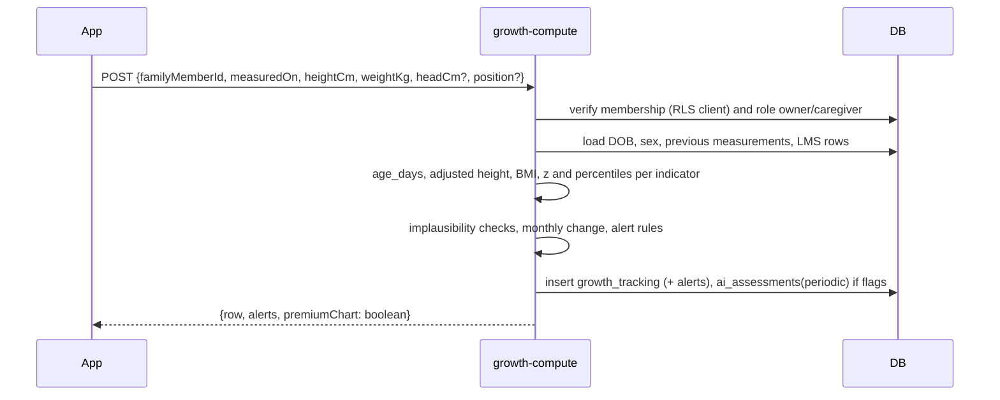

# 15 · Family Health Modules

> **Status:** Draft v1 for build · **Owner:** Family Health squad · **Related:** `00-foundations.md`, `05-database-schema.md`, `06-api-specification.md`, `12-ai-agent-architecture.md`, `13-islamic-knowledge-module.md`, `14-meal-planning-and-grocery.md`, `16-security-architecture.md`, `18-exports-and-analytics.md`, `21-testing-strategy.md`
>
> Specifies the Growth, Autism, Picky Eater, Ramadan and Fasting, and Hydration modules, plus meal tracking and the nutrition journal. Every module lists the tables it uses, its rules, its red flags and its free versus premium split. Names follow `00-foundations.md`; anything new is marked **Addition beyond 00-foundations** and listed in [section 10](#10-additions-beyond-00-foundations).
>
> Safety baseline for all modules: Thuluth is a wellness and education product, not a medical device. Red flags stop planning, explain why in plain language and recommend a clinician (`00-foundations.md` section 10). Children are never restricted.

## Table of contents

1. [Shared conventions](#1-shared-conventions)
2. [Growth tracking](#2-growth-tracking)
3. [Autism module](#3-autism-module)
4. [Picky Eater module](#4-picky-eater-module)
5. [Ramadan and fasting module](#5-ramadan-and-fasting-module)
6. [Hydration engine](#6-hydration-engine)
7. [Meal tracking and the nutrition journal](#7-meal-tracking-and-the-nutrition-journal)
8. [Red flag registry](#8-red-flag-registry)
9. [Acceptance criteria](#9-acceptance-criteria)
10. [Additions beyond 00-foundations](#10-additions-beyond-00-foundations)

---

## 1. Shared conventions

### 1.1 Code locations

| Concern | Location |
|---|---|
| Pure computation (z-scores, ladders, hydration targets, fasting calendar) | `packages/shared/src/health/` (`growth.ts`, `sensory.ts`, `ladder.ts`, `chaining.ts`, `acceptance.ts`, `hydration.ts`, `fasting-calendar.ts`, `ramadan.ts`) |
| Server execution | Edge Functions `growth-compute`, `ramadan-generate`, `ai-intake-assess` (hydration target), `ai-generate-plan` (adaptations) |
| Client features | `apps/mobile/src/features/{growth,autism,picky,ramadan,fasting,hydration,journal}/` (see `07-react-native-folder-structure.md`) |
| Red flag evaluation | `packages/shared/src/health/red-flags.ts`, shared by Edge Functions and the AI guardrail layer (`12-ai-agent-architecture.md`) |

### 1.2 Red flag result type

```ts
export type RedFlagCode =
  | 'growth_faltering_two_lines' | 'weight_for_age_below_p3' | 'child_rapid_weight_loss'
  | 'severe_thinness' | 'stunting_severe' | 'implausible_measurement'
  | 'feeding_fewer_than_20_foods' | 'feeding_losing_foods' | 'feeding_choking_gagging_vomiting'
  | 'feeding_long_distressed_meals' | 'constipation_persistent' | 'eating_disorder_signal'
  | 'dehydration_signs' | 'pregnancy_warning_sign' | 'diabetes_fasting_high_risk'
  | 'hypoglycaemia_threshold' | 'severe_allergy_reaction';

export interface RedFlag {
  code: RedFlagCode;
  severity: 'info' | 'see_clinician' | 'urgent';
  familyMemberId: string;
  detectedAt: string;
  evidence: Record<string, number | string | boolean>;  // never free-text health notes
  stopsPlanning: boolean;
  messageKey: string;                                    // i18n key, e.g. 'redflag.growth_faltering.body'
}
```

Red flags are persisted to `ai_assessments` (`kind='periodic'`, `risk_flags` = codes) so the AI agent sees them, shown as a banner on the member profile, and (for `urgent`) pushed as an in-app notification. They are never sent to analytics with values (see `18-exports-and-analytics.md`).

### 1.3 Child-facing language

For members under 18 the UI never shows kcal, never shows "too much", and uses rhythm language ("happy-full", "listen to your tummy"). Percentiles and z-scores are shown only to adults in the household with role `owner` or `caregiver` (and `coach` in Phase 2 when granted).

---

## 2. Growth tracking

### 2.1 Data used

| Table | Use |
|---|---|
| `family_members` | `date_of_birth`, `sex_at_birth`, `life_stage` |
| `growth_tracking` | Measurements and computed z-scores and percentiles for under-18s |
| `growth_reference_lms` | WHO 2006 (0 to 60 months) and WHO 2007 (61 to 228 months) LMS tables; CDC 2000 optional per household setting |
| `weight_tracking` | Adults (18 and over): weight, waist, BMI |
| `ai_assessments` | Red flags written as `risk_flags` |
| `notifications` | Measurement reminders, alerts |

Columns added (**Addition beyond 00-foundations**):

```sql
alter table growth_tracking
  add column age_days integer not null,                      -- at measurement, computed server-side
  add column measurement_position text null check (measurement_position in ('recumbent','standing')),
  add column alerts text[] not null default '{}',            -- RedFlagCode values raised by this row
  add column entered_by uuid not null references users(id),
  add column head_circumference_z numeric(5,2) null,
  add column head_circumference_percentile numeric(5,2) null;
```

### 2.2 Inputs and units

| Field | Rules |
|---|---|
| `measured_on` | Not in the future; not before date of birth |
| `height_cm` | 40.0 to 220.0. Under 24 months record length (recumbent). If a standing height is entered under 24 months, add 0.7 cm before computing; if recumbent length is entered at 24 months or older, subtract 0.7 cm (WHO convention). |
| `weight_kg` | 1.0 to 200.0 |
| `head_circumference_cm` | Optional, under 60 months only |
| Imperial input | Converted on the client per `users.units`; stored metric |

### 2.3 Reference selection

| Age | Reference | Indicators available |
|---|---|---|
| 0 to 60 months (0 to 1,856 days) | `who_2006` | weight-for-age, length/height-for-age, BMI-for-age, head circumference-for-age |
| 61 to 120 months | `who_2007` | weight-for-age, height-for-age, BMI-for-age |
| 121 to 228 months | `who_2007` | height-for-age, BMI-for-age (WHO 2007 provides no weight-for-age beyond 10 years) |
| Over 228 months (19 years) | none | Adult BMI in `weight_tracking` |

`growth_reference_lms.age_months` holds integer months; the engine interpolates linearly between adjacent months using `ageMonths = age_days / 30.4375`. Weight-for-length and weight-for-height are not used in v1 because the reference table is keyed by age; BMI-for-age is the WHO-endorsed equivalent for screening.

### 2.4 LMS z-score formula

For measurement *X* with reference values *L*, *M*, *S* at the child's age and sex:

```
z = ((X / M)^L - 1) / (L × S)      if L ≠ 0
z = ln(X / M) / S                  if L = 0
```

WHO restricted application for weight-based indicators (weight-for-age and BMI-for-age; not height-for-age): when |z| > 3 the tails are linearised.

```
SD3pos  = M × (1 + L × S × 3)^(1/L)
SD2pos  = M × (1 + L × S × 2)^(1/L)
SD23pos = SD3pos - SD2pos
if z > 3:  z* = 3 + (X - SD3pos) / SD23pos

SD3neg  = M × (1 + L × S × (-3))^(1/L)
SD2neg  = M × (1 + L × S × (-2))^(1/L)
SD23neg = SD2neg - SD3neg
if z < -3: z* = -3 + (X - SD3neg) / SD23neg
```

Percentile = Φ(z) × 100 where Φ is the standard normal CDF.

### 2.5 Implementation

```ts
// packages/shared/src/health/growth.ts
export type Indicator = 'wfa' | 'hfa' | 'bmi' | 'hcfa';
export interface Lms { l: number; m: number; s: number }

export function lmsZ(x: number, { l, m, s }: Lms, restricted: boolean): number {
  let z = Math.abs(l) < 1e-7 ? Math.log(x / m) / s : (Math.pow(x / m, l) - 1) / (l * s);
  if (!restricted || Math.abs(z) <= 3) return round2(z);
  const sd = (k: number) => m * Math.pow(1 + l * s * k, 1 / l);
  if (z > 3) {
    const sd3 = sd(3), sd23 = sd3 - sd(2);
    z = 3 + (x - sd3) / sd23;
  } else {
    const sd3 = sd(-3), sd23 = sd(-2) - sd3;
    z = -3 + (x - sd3) / sd23;
  }
  return round2(z);
}

/** Standard normal CDF via Abramowitz-Stegun 7.1.26 erf approximation (|error| < 1.5e-7). */
export function normalCdf(z: number): number {
  const t = 1 / (1 + 0.3275911 * Math.abs(z) / Math.SQRT2);
  const y = 1 - (((((1.061405429 * t - 1.453152027) * t) + 1.421413741) * t - 0.284496736) * t + 0.254829592)
              * t * Math.exp(-(z * z) / 2);
  return z >= 0 ? (1 + y) / 2 : (1 - y) / 2;
}
export const percentile = (z: number) => Math.round(normalCdf(z) * 10000) / 100;

export function interpolateLms(rows: { ageMonths: number; l: number; m: number; s: number }[], ageMonths: number): Lms {
  const lo = rows.filter(r => r.ageMonths <= ageMonths).at(-1);
  const hi = rows.find(r => r.ageMonths >= ageMonths);
  if (!lo || !hi) throw new Error('AGE_OUT_OF_RANGE');
  if (lo.ageMonths === hi.ageMonths) return lo;
  const f = (ageMonths - lo.ageMonths) / (hi.ageMonths - lo.ageMonths);
  return { l: lo.l + f * (hi.l - lo.l), m: lo.m + f * (hi.m - lo.m), s: lo.s + f * (hi.s - lo.s) };
}

export function adjustedHeight(heightCm: number, ageDays: number, position?: 'recumbent' | 'standing'): number {
  if (ageDays < 731 && position === 'standing') return heightCm + 0.7;
  if (ageDays >= 731 && position === 'recumbent') return heightCm - 0.7;
  return heightCm;
}

export const bmi = (kg: number, cm: number) => Math.round((kg / ((cm / 100) ** 2)) * 10) / 10;
```

Validation fixtures in `packages/shared/src/health/__fixtures__/who-anthro-cases.json` hold cases cross-checked against the WHO Anthro and AnthroPlus software outputs (tolerance 0.01 z).

### 2.6 `growth-compute` flow



`sex_at_birth = 'unspecified'` computes nothing and returns `SEX_REQUIRED_FOR_REFERENCE`, explaining that WHO references are sex-specific.

### 2.7 Monthly changes

For each new measurement, compared with the previous one at least 21 days earlier:

| Metric | Formula |
|---|---|
| Weight velocity | `(w2 - w1) / days × 30.4375` kg per month |
| Height velocity | `(h2 - h1) / days × 30.4375` cm per month (only if 60 or more days apart, to limit measurement noise) |
| Δz per indicator | `z2 - z1` |
| Percentile band change | Count of major WHO percentile lines crossed (3rd, 15th, 50th, 85th, 97th; z = -1.88, -1.04, 0, 1.04, 1.88) |

### 2.8 Alert rules

| Code | Rule | Severity | Stops planning |
|---|---|---|---|
| `implausible_measurement` | WHO flags: HFA z < -6 or > 6; WFA z < -6 or > 5; BMI z < -5 or > 5; or height decreased by more than 1.5 cm | info (prompt to re-measure) | No (row stored with alert, excluded from charts until confirmed) |
| `weight_for_age_below_p3` | WFA z < -1.88 | see_clinician | Yes, for growth plans; standard plans continue with energy-dense emphasis only after the parent acknowledges |
| `growth_faltering_two_lines` | WFA or BMI-for-age crosses two or more major lines downward across measurements within 12 months | see_clinician | Yes |
| `child_rapid_weight_loss` | Weight down more than 5 percent within 90 days, or any weight decrease in a child under 24 months across two measurements 30 or more days apart | urgent | Yes |
| `severe_thinness` | BMI-for-age z < -3 (any age) | urgent | Yes |
| (thinness, info) | BMI-for-age z < -2 | see_clinician | No; planner emphasises energy and protein density |
| `stunting_severe` | HFA z < -3 | see_clinician | No |
| (stunting, info) | HFA z < -2 | info with clinician suggestion | No |
| (overweight, info) | BMI-for-age z > 2 (under 5 years) or > 1 (5 to 19 years) | info only: family-habit tips, never restriction, no weight-loss goal (gate G3 in `14-meal-planning-and-grocery.md`) | No |
| Head circumference | HC z < -2 or > 2 | see_clinician | No |

Growth alerts are never framed as the child's fault. Example copy key `redflag.growth_faltering.body` (en): "Ali's recent measurements show his weight has dropped across two lines on the growth chart. This can have many causes and is worth checking with your paediatrician soon. We've paused new growth plans until then; his everyday meals stay the same."

### 2.9 Child growth dashboard data

The dashboard (premium) is served by an RPC returning a single JSON document:

```ts
export interface GrowthDashboard {
  member: { id: string; name: string; sex: 'female' | 'male'; ageMonths: number };
  reference: 'who_2006' | 'who_2007' | 'cdc_2000';
  indicators: Array<{
    key: 'wfa' | 'hfa' | 'bmi' | 'hcfa';
    curves: Array<{ z: -3 | -2 | -1 | 0 | 1 | 2 | 3; points: Array<[ageMonths: number, value: number]> }>; // every 1 month (<60), 3 months (>=60)
    measurements: Array<{ measuredOn: string; ageMonths: number; value: number; z: number; percentile: number; flagged: boolean }>;
    latest?: { value: number; z: number; percentile: number; deltaZ?: number; velocityPerMonth?: number };
  }>;
  alerts: RedFlag[];
  nextMeasurementDue: string;   // under 12 months: monthly; 1-2 years: every 2 months; 2-5: every 3 months; 5+: every 6 months
  tipsKeys: string[];           // coaching_tips module 'general' for the age band
}
```

```sql
create or replace function growth_dashboard(p_member uuid) returns jsonb
language sql stable security invoker as $$
  -- RLS on growth_tracking/family_members restricts to household members; curves from growth_reference_lms
  select jsonb_build_object(
    'member', (select jsonb_build_object('id', fm.id, 'name', fm.name, 'sex', fm.sex_at_birth,
               'ageMonths', floor(extract(epoch from age(current_date, fm.date_of_birth)) / 2629746))
               from family_members fm where fm.id = p_member),
    'measurements', (select coalesce(jsonb_agg(to_jsonb(g) order by g.measured_on), '[]'::jsonb)
                     from growth_tracking g where g.family_member_id = p_member and g.deleted_at is null)
  );
$$;
```

Curves are computed client-side from cached LMS rows (about 30 KB per sex and reference, cached in MMKV), so the RPC returns measurements and alerts only. Free users get `latest` for each indicator without curves, z or percentile (they see "measurement saved" and value only) per `00-foundations.md` section 8.

### 2.10 Adults

`weight_tracking` logs weight and optional waist. BMI is computed and shown with Asian cut-offs offered for South Asian users (overweight 23.0, obesity 27.5, WHO expert consultation 2004) alongside the standard WHO cut-offs (25, 30), with the explanation. Waist-to-height ratio above 0.5 shows an info card. Weight loss faster than 1 kg per week sustained over 3 weeks triggers an `eating_disorder_signal` check prompt (info) and slows the plan.

### 2.11 Free vs premium

| Free | Premium |
|---|---|
| Log measurements, see latest value; red flags still shown (safety is never paywalled) | Percentile charts, z-scores, trends, velocity, alerts history, growth reports (PDF via `export-pdf`, see `18-exports-and-analytics.md`) |

---

## 3. Autism module

Activated when `family_members.special_modules` contains `autism`. The app does not diagnose; the module is available to any child whose parent selects it.

### 3.1 Data used

| Table | Use |
|---|---|
| `sensory_profiles` | Texture likes and avoids, colour sensitivities, presentation prefs, temperature, brand rigidity |
| `food_preferences` | Safe foods (`is_safe_food = true`), strength 1 to 3 |
| `food_dislikes` | Rejections with `reason` (`texture`, `smell`, `color`, `taste`, `other`) |
| `food_exposures` | Every exposure attempt with stage and acceptance |
| `exposure_ladders`, `exposure_ladder_steps` | Ladders and food chains |
| `daily_meal_servings` | Adapted meals and acceptance per meal |
| `meal_alternatives` | Curated autism alternatives |
| `coaching_tips` | Module `autism` content |
| `ingredients.textures`, `ingredients.color`, `recipes.texture_profile`, `recipes.colors` | Matching |

### 3.2 Collection (intake and ongoing)

The collection flow (screens in `02-ux-specification.md`) asks parents, in plain language, with photo cards:

| Question group | Stored as |
|---|---|
| Textures the child enjoys / refuses (cards for each `texture` enum value with local examples: smooth = yogurt, blended daal; crunchy = roti chips, cucumber; lumpy = khichdi with whole grains) | `sensory_profiles.texture_likes`, `texture_avoids` |
| Colours accepted / refused (beige, white, yellow, orange, red, green, brown, mixed) | `sensory_profiles.color_sensitivities` as `'avoid:green'`, `'prefer:beige'` |
| Safe foods (searchable ingredient and recipe picker; minimum 3 recommended) | `food_preferences` with `is_safe_food = true`, `strength` |
| Brand or exact-item rigidity ("only this biscuit brand", "only mother's roti") | `sensory_profiles.brand_rigidity`, `food_preferences.label` |
| Rejections and why | `food_dislikes` with `reason` |
| Presentation: foods touching, divided plate, same cup or plate, cut shapes, sauce on side, mixed dishes | `sensory_profiles.presentation_prefs` |
| Temperature | `sensory_profiles.temperature_prefs` (`warm`, `lukewarm`, `room`, `cold`) |
| Mealtime context: seat, picture schedule use, transition warning, therapy team | `presentation_prefs.context` |

`presentation_prefs` schema (Zod in `packages/shared/src/contracts/sensory.ts`):

```ts
export const PresentationPrefs = z.object({
  separateFoods: z.boolean(),                     // never touching
  plate: z.enum(['divided_3','divided_4','regular','bowl']),
  sameUtensils: z.boolean(),
  cutShapes: z.record(z.string(), z.enum(['strips','coins','cubes','halves','pinwheels','whole'])), // ingredientId -> shape
  sauceOnSide: z.boolean(),
  mixedDishesOk: z.boolean(),
  visibleFlecksOk: z.boolean(),                   // herbs or vegetable flecks visible
  context: z.object({
    pictureSchedule: z.boolean(), transitionWarningMin: z.number().int().min(0).max(15),
    fixedSeat: z.boolean(), therapyTeam: z.array(z.enum(['ot','slt','dietitian','psychologist'])),
  }).partial(),
});
```

### 3.3 Sensory profile generation

The sensory profile is the structured summary the planner and AI use. It combines declared preferences with observed acceptance:

```ts
export interface SensoryProfileSummary {
  memberId: string;
  textureScores: Record<Texture, number>;   // -1 (avoid) .. +1 (like)
  colorScores: Record<string, number>;      // same scale
  textureLadderStep: 1 | 2 | 3 | 4 | 5 | 6; // section 3.5
  safeFoods: Array<{ ingredientId?: string; recipeId?: string; label: string; strength: 1 | 2 | 3 }>;
  presentation: PresentationPrefs;
  temperature: 'warm' | 'lukewarm' | 'room' | 'cold' | null;
  acceptedFoodCount: number;                // distinct foods with acceptance >= 4 at least twice in 60 days, plus safe foods
  confidence: number;                       // 0..1, rises with observations
}

export function buildSensoryProfile(p: SensoryProfileRow, exposures: FoodExposure[], servings: ServingObs[], catalog: Catalog): SensoryProfileSummary {
  // 1. Declared: likes +0.8, avoids -0.8.
  // 2. Observed (last 90 days): for each exposure/serving, for each texture/colour of the food,
  //    add (acceptanceNumeric - 2.5) / 2.5 * 0.1, decayed by 0.5^(ageDays/30).
  // 3. Clamp to [-1, 1]; declared avoids never rise above -0.3 from observation alone (parent confirms change).
  // 4. textureLadderStep = highest step whose representative textures score >= 0.3.
  // 5. confidence = min(1, observations / 40).
}
```

The summary is recomputed on write of exposures or servings (debounced, Edge-side job in `ai-generate-plan` preload, and nightly) and cached in `sensory_profiles.presentation_prefs.summary` (no new table).

### 3.4 Alternative meal generation

Uses the adaptation rules of `14-meal-planning-and-grocery.md` section 7. Autism specifics:

1. Prefer a curated `meal_alternatives(reason='autism')` whose components all have `textureScores >= 0` and `colorScores >= 0`.
2. Else auto-deconstruct: separate components, `sauceOnSide`, `spiceLevel = 0` (lift portion before chillies are added), blend to the child's ladder step texture when the recipe allows (`servablePlain`), apply cut shapes from `presentation.cutShapes`, apply temperature.
3. Always add a safe food from the same texture step; rotate among safe foods with strength 3 first, but keep the same safe food at the same weekday meal if `brand_rigidity` is true (predictability).
4. Add at most one learning-plate food from the active ladder (section 3.5), never more than one new item per meal.
5. Difficult sensory day mode (parent taps "hard day"): for the next 24 hours, servings become safe foods only, usual times and plate, no learning items, no ladder progression; this is logged and not counted as a regression.

Difficult-day default menu (from the reference program): breakfast smooth oats porridge with mashed banana and milk, or plain yogurt with roti strips and egg white; lunch smooth khichdi with yogurt, or plain rice with mashed daal and banana; snack banana-date milk, or paneer cubes with apple slices; dinner shami kebab pieces with roti strips, or plain haleem or yakhni rice from the freezer.

### 3.5 Texture ladder and food exposure ladders

Texture ladder (from the reference protocol):

| Step | Texture class | Examples |
|---|---|---|
| 1 | Smooth | Yogurt, blended daal, smooth talbina, banana milk |
| 2 | Thick smooth | Khichdi, haleem, mashed pumpkin or sweet potato |
| 3 | Soft mashable | Banana, papaya, paneer, soft egg, boiled potato |
| 4 | Soft solid | Roti strips, shami kebab, fish cutlet, rice |
| 5 | Crisp dissolvable | Roti chips, cheela edges |
| 6 | Firm or mixed | Apple slices, cucumber, chicken pieces, mixed curries |

Exposure ladder stages use the `exposure_stage` enum: `tolerate_on_table` → `look` → `touch` → `smell` → `lick` → `taste` → `chew_spit` → `eat_small` → `eat_portion`.

Progression rule (per step):

```ts
export const STAGE_PASS: Record<ExposureStage, AcceptanceScore> = {
  tolerate_on_table: '1_tolerated', look: '1_tolerated', touch: '2_touched', smell: '2_touched',
  lick: '3_tasted', taste: '3_tasted', chew_spit: '3_tasted', eat_small: '4_ate_some', eat_portion: '5_ate_well',
};

export function nextLadderAction(step: LadderStep, recent: FoodExposure[]): 'advance' | 'stay' | 'step_back' | 'pause' {
  const atStage = recent.filter(e => e.stage === step.stage).slice(-5);
  const passes = atStage.filter(e => score(e.acceptance) >= score(STAGE_PASS[step.stage]) && !e.distress);
  const distress = atStage.filter(e => e.distress).length;
  if (recent.some(e => e.context === 'hard_day')) return 'pause';
  if (distress >= 2) return 'step_back';
  const lastThree = atStage.slice(-3);
  if (lastThree.length === 3 && lastThree.every(e => passes.includes(e))) return 'advance';
  return 'stay';
}
```

`distress` is stored in `food_exposures.context` as a structured tag (`'distress'`, `'hard_day'`, `'learning_plate'`, `'cooking_together'`, `'school'`). The app suggests offering the exposure 3 to 5 times a week; a ladder typically needs 8 to 15 calm exposures overall. Parents always confirm advancement; the app proposes, never auto-advances silently.

### 3.6 Food chaining

Food chaining moves from a safe food to a target food by small sensory steps. Each food has a feature vector:

```ts
export interface FoodFeatures {
  texture: Texture[];           // from ingredient or recipe
  color: string;
  flavor: 'sweet' | 'salty' | 'savory' | 'sour' | 'bitter' | 'mild';
  shape: 'strip' | 'coin' | 'cube' | 'round' | 'mash' | 'liquid' | 'irregular';
  temperature: 'warm' | 'room' | 'cold';
  ladderStep: 1 | 2 | 3 | 4 | 5 | 6;
}

export function chainDistance(a: FoodFeatures, b: FoodFeatures, profile: SensoryProfileSummary): number {
  return 1.5 * textureDistance(a, b)                 // Jaccard distance on textures + |stepA - stepB| / 5
       + 1.0 * (a.color === b.color ? 0 : colorBridgeCost(a.color, b.color, profile))
       + 0.8 * (a.flavor === b.flavor ? 0 : 1)
       + 0.4 * (a.shape === b.shape ? 0 : 1)
       + 0.3 * (a.temperature === b.temperature ? 0 : 1);
}

/** Dijkstra over the catalog graph, edges only where chainDistance <= MAX_HOP (1.2),
 *  nodes restricted to foods that are halal, allergen-safe and not in hard rejections. */
export function planFoodChain(safe: Food[], target: Food, catalog: Food[], profile: SensoryProfileSummary): Food[] | null;
```

Colour bridge order (from the reference protocol): beige → yellow (egg yolk, daal, banana) → orange (pumpkin, sweet potato, carrot) → red (apple, mild tomato) → green (peeled cucumber, then spinach blended into a familiar gravy). `colorBridgeCost` is 0.5 per bridge step, 1.5 for skipping steps, plus 0.5 if the destination colour is in the child's avoid list. Natural colour only; no artificial colourings are ever suggested.

A chain becomes an `exposure_ladders` row with `strategy = 'food_chaining'` and one `exposure_ladder_steps` row per chain food, each with its own exposure stage progression compressed to `look → touch → taste → eat_small` for intermediate foods (they are similar to accepted ones).

### 3.7 Worked example: Fatima, 4 years, autism module

Inputs (from the reference Lahore program, daughter aged 4):

| Field | Value |
|---|---|
| Texture likes | smooth, soft |
| Texture avoids | lumpy, mixed |
| Colours | prefer beige and white; avoid green; orange unknown |
| Safe foods (strength 3) | plain whole-wheat roti, plain rice, banana, plain yogurt, boiled egg, smooth oats porridge, paneer cubes, peeled apple slices, smooth khichdi, shami kebab, milk in her cup |
| Presentation | divided 4-section plate, foods never touching, same cup and spoon, egg in strips, roti in strips, apple in thin slices, sauce on side, no visible flecks |
| Temperature | lukewarm |
| Accepted food count | 14 (below 20, see red flag `feeding_fewer_than_20_foods`, info severity with a suggestion to involve a feeding team; planning continues) |

Generated sensory profile summary: `textureLadderStep = 3`, `colorScores.beige = 0.9`, `colorScores.green = -0.8`, `colorScores.orange = 0`.

Target chosen with the parent: carrot (vitamin A, a weekly family vegetable in season October to March). Chain computed:

| # | Food | Why it is one step | Stages |
|---|---|---|---|
| 0 | Smooth oats porridge with mashed banana (safe) | Start: beige, smooth, sweet, warm | n/a |
| 1 | Sweet potato mash in a separate section, same spoon (week 2 target in the reference program) | Smooth, sweet; first orange | look → touch → taste → eat_small |
| 2 | Pumpkin mash (orange "bridge" colour) | Same texture and colour as step 1, slightly less sweet | look → touch → taste → eat_small |
| 3 | Carrot blended into besan cheela batter (uniform colour, no flecks) | Familiar soft-solid shape (strip), orange tint | touch → taste → eat_small |
| 4 | Soft-cooked carrot sticks on the side of lunch | Target: soft solid, orange, strip shape matching her roti strips | tolerate_on_table → look → touch → smell → lick → taste → chew_spit → eat_small → eat_portion |

Weekly plan integration: soft carrot sticks appear as a learning-plate item beside lunch every weekday ("look, touch, smell only" in week 1, as in the reference program), never more than one learning item per meal, always next to a safe food. The parent logs each exposure with one tap (stage reached plus acceptance). After three calm `touch` passes the app proposes moving to `smell`.

Parallel ladder (week 3 of the reference program): peeled cucumber "coins" moving from look to touch to lick, as a green colour step, started only once orange items reach `taste`.

### 3.8 Rules

1. Never force, bribe or reward with food. Celebrate the step ("You touched the carrot!").
2. Maximum one new food per meal; never on a hard day.
3. A safe food on every plate (gate G10 in `14-meal-planning-and-grocery.md`).
4. Natural colours only (turmeric, pumpkin, beetroot, spinach). No artificial colouring in any recipe tagged `autism_friendly`.
5. Restrictive diets (gluten-free and casein-free) are not suggested without a medical diagnosis requiring them; the AI declines to build one for autism alone and explains the evidence.
6. Choking safety under 5: ground nuts or thin nut butter only, no whole nuts, grapes or hard raw carrot chunks.
7. Constipation watch: fibre increases slowly with fluids; the journal's digestion field drives a prompt (section 7).

### 3.9 Red flags

| Code | Trigger | Severity |
|---|---|---|
| `feeding_fewer_than_20_foods` | `acceptedFoodCount < 20` | see_clinician (info card, planning continues) |
| `feeding_losing_foods` | A safe food with strength 3 drops to acceptance at or below 1 on 4 of the last 5 servings, or accepted count falls by 3 or more in 60 days | see_clinician |
| `feeding_choking_gagging_vomiting` | Parent logs choking, frequent gagging or vomiting at meals (structured tag) twice in 14 days | urgent |
| `feeding_long_distressed_meals` | Meals routinely longer than 30 to 40 minutes with distress (4 of 7 days) | see_clinician |
| `constipation_persistent` | Journal digestion "hard or fewer than 3 stools a week" for 2 consecutive weeks | see_clinician |
| Growth flags | From section 2.8 | per section 2.8 |

Message: "These signs are worth discussing with your paediatrician, who may refer you to a feeding team (paediatric dietitian, occupational therapist, speech and language therapist)."

### 3.10 Free vs premium

| Free | Premium |
|---|---|
| Safe-food list, safe food added to every plate, allergy and choking safety, difficult-day menu, red flags | Sensory profile, adapted meals in plans, exposure ladders, food chaining, acceptance analytics, coaching tips series |

---

## 4. Picky Eater module

Activated when `special_modules` contains `picky_eater`. Default stance: Ellyn Satter's Division of Responsibility, repeated low-pressure exposure, family modelling.

### 4.1 Data used

`food_preferences` (safe foods), `food_dislikes`, `food_exposures`, `exposure_ladders` (strategy `exposure_ladder` or `food_chaining`), `daily_meal_servings.acceptance`, `coaching_tips` (module `picky`), `nutrition_journal`, `growth_tracking`.

### 4.2 Division of Responsibility as product rules

| Parents decide (the app supports) | Child decides (the app protects) |
|---|---|
| **What** is offered: the family meal always includes one food the child usually accepts | **Whether** to eat what is offered |
| **When**: 3 meals plus 1 to 2 planned snacks, 2.5 to 3 hours apart; kitchen "closes" between | **How much** to eat of it |
| **Where**: at the table, together, screens off | May leave food without comment; may ask for more |

Encoded as:

- Plans always include a safe food for picky members (gate G10).
- Snack timing rules (snack at least 2 hours before dinner; no milk or juice in the hour before meals) are in `14-meal-planning-and-grocery.md` section 5 and the hydration engine.
- Child portions are `start` tier with `extra` available; the UI never shows "finished/not finished" as success. Acceptance is logged as information, not as a grade.
- The AI guardrails decline to produce bribery, reward-with-dessert or "just one more bite" scripts and offer alternatives (`12-ai-agent-architecture.md`).
- Etiquette bridge: "The Prophet (peace be upon him) never criticised food: if he liked it he ate it, otherwise he left it" (Bukhari 5409; Muslim 2064). Family script: "'No thank you' is allowed; 'yuck' is not."

### 4.3 Exposure tracking

Every learning-plate item or new food served creates a `food_exposures` row when logged:

| Field | Value |
|---|---|
| `stage` | Highest stage reached this time |
| `acceptance` | `acceptance_score` |
| `context` | `learning_plate`, `family_meal`, `cooking_together`, `taste_test_game`, `school` |

The Saturday "taste test game" (from the reference program): three small pieces, the child rates each thumbs up, sideways or down; every rating is accepted. The UI offers a child-friendly rating screen that maps thumbs to acceptance (`up = 4`, `sideways = 3`, `down = 1` if tasted, else `2`).

### 4.4 Safe food management

| Rule | Detail |
|---|---|
| Minimum | At least 3 safe foods recommended; planner warns below 3 |
| Stock check | Safe foods are pinned in grocery lists as "always in stock" (never substituted for budget) |
| Rotation | Rotate safe foods across days to avoid food jags (same food every meal for days, then sudden rejection), except when autism brand rigidity is set |
| Food jag watch | Same safe food served at 3 or more meals a day for 4 or more days triggers a coaching tip on rotation |
| Upgrade | When a new food reaches acceptance 4 or more on 3 occasions, the app suggests adding it to safe foods |

### 4.5 New-food progression

```text
new food lifecycle: introduced -> exposing (n exposures) -> tasting -> accepted | paused
  introduced: placed on learning plate beside a safe food, paired with a familiar food
              (reference: "Pumpkin beside roti and plain chickpeas; guava beside his favourite banana")
  exposing:   3-5 exposures/week; any stage counts as an exposure
  tasting:    acceptance >= 3 at least twice
  accepted:   acceptance >= 4 on 3 occasions within 30 days -> suggest safe food
  paused:     2 distress events or 15 exposures without reaching tasting -> pause 2 weeks, try a chain
weekly new foods: max 2 for picky (reference program cadence), max 1 for autism
```

Weekly new foods and pairings for the reference family (seeded as the example programme):

| Week | Son (picky, 8): new foods | Pairing | Daughter (autism, 4): exposure target |
|---|---|---|---|
| 1 | Pumpkin (in chana-pumpkin curry); guava slices with a pinch of salt | Pumpkin beside roti and plain chickpeas; guava beside banana | Soft-cooked carrot sticks on the side of every lunch: look, touch, smell only |
| 2 | Fish cutlets; roasted sweet potato "fries" | Fish cutlet next to roti and raita; sweet potato fries next to his usual snack | Pumpkin or sweet potato mash in a small separate section, same spoon |
| 3 | Turnip (shalgam gosht); spinach in palak chana | One turnip piece beside meat and roti; green gravy blended smooth, plain chickpeas available | Peeled cucumber coins moving from look to touch or lick |
| 4 | Pomegranate seeds; koftas with grated lauki | Pomegranate next to paneer cubes; koftas with roti and plain rice | Fish cutlet as a "new shape" beside safe shami kebab or roti |

### 4.6 Parent coaching content

`coaching_tips` rows (module `picky`, age-banded) are scheduled one per day during the first 4 weeks, then weekly. Each tip links an `evidence_id` (`scientific_evidence`) and, where relevant, an Islamic source via `recommendations` (`13-islamic-knowledge-module.md`). Seed topics:

| Key | Age band (months) | Summary |
|---|---|---|
| `dor_basics` | 24 to 216 | Parents decide what, when, where; child decides whether and how much |
| `no_pressure` | 24 to 216 | Pressure ("just one more bite") lowers liking over time; describe food instead |
| `exposure_8_15` | 24 to 216 | New foods often need 8 to 15 calm exposures; looking and touching count |
| `familiar_plus_new` | 24 to 216 | Always pair a new food with a familiar one |
| `dipping` | 24 to 144 | Dips raise vegetable intake; offer yogurt-mint dip |
| `appetite_protection` | 24 to 216 | No milk or juice in the hour before meals; milk 400 to 500 ml a day total |
| `involve_kids` | 36 to 216 | Washing vegetables, rolling energy bites, squeezing lemon, peeling eggs |
| `food_language` | 24 to 216 | "Crunchy", "sweet like a date" instead of "good boy for finishing" |
| `no_food_rewards` | 24 to 216 | Dessert as a reward raises preference for dessert and lowers it for vegetables |
| `nutrient_density` | 24 to 216 | Half to one teaspoon ghee or olive oil on roti, peanut butter, egg, date in lassi |
| `adab_no_criticism` | 36 to 216 | The Prophet (peace be upon him) never criticised food; "no thank you" is allowed |
| `school_lunchbox` | 60 to 216 | Pack a small portion he can finish; a full box coming home is information |

### 4.7 Meal acceptance scoring and analytics

Numeric mapping: `0_refused = 0`, `1_tolerated = 1`, `2_touched = 2`, `3_tasted = 3`, `4_ate_some = 4`, `5_ate_well = 5`.

| Metric | Definition |
|---|---|
| Food acceptance index (per food) | Exponentially weighted mean of acceptance over the last 90 days, half-life 21 days, scaled to 0 to 100 |
| Accepted food count | Distinct ingredients or recipes with acceptance at least 4 on 2 or more occasions in 60 days, union safe foods |
| New foods accepted (period) | Foods moving to `accepted` in the period |
| Meal acceptance rate | Share of planned servings with acceptance at least 4 |
| Exposure adherence | Exposures logged / exposures planned (learning-plate items) |
| Variety score | Distinct plant foods eaten (acceptance at least 3) per week |
| Time to acceptance | Median exposures until `accepted` |

SQL (premium analytics, per member):

```sql
create or replace function picky_acceptance_summary(p_member uuid, p_days int default 30)
returns table (accepted_food_count int, meal_acceptance_rate numeric, exposures int, new_accepted int)
language sql stable security invoker as $$
  with s as (
    select dms.acceptance, dm.plan_date
    from daily_meal_servings dms join daily_meals dm on dm.id = dms.daily_meal_id
    where dms.family_member_id = p_member and dm.plan_date >= current_date - p_days and dms.acceptance is not null
  ), e as (
    select ingredient_id, acceptance, exposed_on from food_exposures
    where family_member_id = p_member and exposed_on >= current_date - 60
  )
  select
    (select count(*) from (select ingredient_id from e where acceptance >= '4_ate_some'
                           group by ingredient_id having count(*) >= 2) a)::int
      + (select count(*) from food_preferences where family_member_id = p_member and is_safe_food and deleted_at is null)::int,
    round(avg(case when s.acceptance >= '4_ate_some' then 1 else 0 end)::numeric, 3),
    (select count(*) from food_exposures where family_member_id = p_member and exposed_on >= current_date - p_days)::int,
    (select count(*) from exposure_ladders where family_member_id = p_member and status = 'accepted'
       and updated_at >= now() - make_interval(days => p_days))::int
  from s;
$$;
```

Enum comparison relies on declaration order of `acceptance_score` (ordinal by label order), which is defined from `0_refused` to `5_ate_well`.

### 4.8 Red flags

Same feeding red flags as section 3.9, plus: growth flags (section 2.8); signs of ARFID (extreme restriction with weight loss, fear of choking or vomiting, fewer than 20 foods) produce `see_clinician`; pale, very tired child with low iron intake estimate produces an info card suggesting the paediatrician check iron.

### 4.9 Free vs premium

| Free | Premium |
|---|---|
| Division of Responsibility guide, exposure log, safe foods in plans | Coaching plans (scheduled tips), acceptance analytics, new-food progression engine, food chaining |

---

## 5. Ramadan and fasting module

### 5.1 Data used

| Table | Use |
|---|---|
| `ramadan_plans` | Household Ramadan settings and link to the `meal_plans` row (`kind='ramadan'`) |
| `meal_plans`, `daily_meals`, `daily_meal_servings` | Suhoor, iftar and dinner slots, plus day meals for non-fasting members |
| `fasting_logs` | Every fast (Ramadan, voluntary, qada), completion, exemptions |
| `hydration_targets`, `hydration_logs` | Fasting-window hydration schedule |
| `medical_conditions`, `medications`, `pregnancy_profiles` | Safety rules |
| `notifications` | Suhoor and iftar reminders |
| `coaching_tips` | Module `ramadan` |
| `hadith_references`, `recommendations` | Verified sources only (`13-islamic-knowledge-module.md`) |

Columns and objects added (**Addition beyond 00-foundations**):

```sql
alter table ramadan_plans
  add column calc_params jsonb not null default '{}'::jsonb;
  -- {"method":"Karachi","madhab":"hanafi","latitude":31.5204,"longitude":74.3587,
  --  "imsakOffsetMin":10,"iftarOffsetMin":0,"highLatitudeRule":"middle_of_the_night","tradition":"sunni"}

alter table households
  add column hijri_offset_days smallint not null default 0 check (hijri_offset_days between -2 and 2);
  -- local moon-sighting adjustment against Umm al-Qura

alter table fasting_logs
  add column hijri_date text null,             -- 'YYYY-MM-DD' Hijri, for voluntary-fast and qada logic
  add column qada_for_hijri_year smallint null; -- which Ramadan this qada fast makes up
```

`fasting_logs.exemption_reason` values (check constraint): `travel`, `illness`, `menstruation`, `postpartum`, `pregnancy`, `breastfeeding`, `age`, `chronic_condition`, `other`. This field is sensitive: it is visible only to the member themself (if they have an account) and to the household `owner` by default, configurable per member, and it is never sent to analytics or AI providers unless the user explicitly asks the assistant about it (`16-security-architecture.md`).

### 5.2 Prayer times and the daily schedule

`ramadan-generate` computes times per day for the household's coordinates using the `adhan` library (`npm:adhan`, pinned) inside the Edge Function. City coordinates come from `households.city` geocoded at onboarding (stored in `calc_params`).

| Setting | Default by country | Notes |
|---|---|---|
| Calculation method | Pakistan: University of Islamic Sciences, Karachi (Fajr 18°, Isha 18°); Saudi Arabia: Umm al-Qura; UAE: Dubai; UK: Moonsighting Committee; US and Canada: ISNA (North America); otherwise Muslim World League | User-changeable |
| Asr school | Hanafi for Pakistan Sunni default; Shafi'i elsewhere | Only affects Asr reminders |
| Shia (Ja'fari) preference | `tradition_preference = 'shia'` uses Fajr 16°, Isha 14°, Maghrib at 4° below horizon (Leva Institute, Qum parameters; `adhan` custom parameters with `maghribAngle`) | Iftar at Maghrib per Ja'fari practice, which is several minutes after sunset |
| Imsak | Fajr minus 10 minutes (display and reminder only; the fast begins at Fajr) | Configurable 0 to 20 |
| High latitude | `middle_of_the_night` rule above 48° latitude | UK and Canada summers |
| Hijri date | `Intl.DateTimeFormat('en-u-ca-islamic-umalqura')` plus `households.hijri_offset_days` | Start and end of Ramadan confirmed by the user ("Has Ramadan started in your community?") because moon sighting varies |

Generated family schedule for each Ramadan day:

| Time anchor | Event |
|---|---|
| Fajr - 60 min | Suhoor reminder (configurable 30 to 90) |
| Fajr - 45 to Fajr - 15 | Suhoor slot (`meal_type='suhoor'`), water sips |
| Imsak | Last-sips reminder |
| Dhuhr | Children on practice fasts: check-in |
| Maghrib | Iftar: dates and water, then Maghrib prayer |
| Maghrib + 20 to 30 min | Main iftar meal (`meal_type='iftar'`) or light iftar then `dinner` after Taraweeh |
| Isha + Taraweeh end | Optional snack (fruit, milk, yogurt) |
| Hourly between iftar and bed | Hydration nudges (section 5.4) |
| Day | Non-fasting members: normal `breakfast`, `lunch`, `snack` slots, cooked from the same pots where possible |

Sources displayed with the schedule (verified via `13-islamic-knowledge-module.md`): "Take suhoor, for in suhoor there is blessing" (Bukhari 1923; Muslim 1095). The Prophet (peace be upon him) broke his fast with fresh dates, or if not then dried dates, or if not then a few sips of water (Abu Dawud 2356; also reported by al-Tirmidhi). The app labels these as guidance, not medical claims.

### 5.3 Suhoor and iftar plans

| Meal | Composition rule | Example (Lahore) |
|---|---|---|
| Suhoor | Slow-release carbohydrate (whole grains, oats, barley), protein (eggs, yogurt, daal), fluid-rich foods (yogurt, cucumber, fruit), moderate salt, no deep-fried items; 2 to 3 glasses of fluid spread across the meal | Oats dalia with banana and dates plus boiled egg; talbina with egg; whole-wheat roti with omelette and yogurt; daal-atta roti with yogurt |
| Iftar opening | 1 to 3 dates and water (plus or minus laban), then pray | Dates, water, a glass of lassi or laban for adults |
| Iftar main | Thuluth plate with soup or salad first; fried items limited to one small portion a week (pakora and samosa culture is acknowledged, not banned) | Chicken yakhni shorba, fruit chaat with yogurt, chana chaat, then chicken and lauki salan with roti |
| After Taraweeh | Light: fruit, milk, yogurt | Fruit chaat; milk with dates |

Thuluth at iftar: the planner sets the iftar portion at the adult's normal dinner portion (no "making up" for the day) and spaces it into dates and water, then the main meal after 20 to 30 minutes.

### 5.4 Hydration plan between iftar and suhoor

The member's daily fluid target (section 6) is distributed across the non-fasting window. For a window from Maghrib (18:00) to Fajr (04:45) with a 2,400 ml adult target:

| Window | Volume | Note |
|---|---|---|
| Iftar opening | 250 ml | Water with dates, sipped |
| Iftar main meal | 150 ml sips + soup | Soup counts |
| Maghrib + 60 to Isha | 400 ml | Two glasses, spaced |
| During Taraweeh break / after | 400 ml | |
| Before sleep | 250 ml | |
| Suhoor | 500 ml | Spread across the meal; avoid drinking a litre at once |
| Remaining to target | 450 ml | Spread over waking hours as 150 ml every 45 minutes |

```ts
export function fastingHydrationSchedule(targetMl: number, iftar: Date, suhoorEnd: Date, sleep: { from: Date; to: Date }): HydrationSlot[] {
  // 1. Fixed anchors: iftar 250, suhoor 500 (adults; children on practice fasts: 150 and 300).
  // 2. Remaining volume split into awake windows excluding sleep, in 200-250 ml portions at least 45 min apart.
  // 3. Max 1,000 ml per hour; if infeasible, return the feasible max plus a warning 'TARGET_UNREACHABLE_IN_WINDOW'.
  // 4. Caffeinated drinks limited to 2 cups and not within 1 hour of suhoor end; they count at 80 percent.
}
```

### 5.5 Child participation guidance by age

| Age | Product behaviour |
|---|---|
| Under 7 | **No fasting plans** (`00-foundations.md` section 10). Participation through family rituals: joining suhoor optionally, opening with a date at iftar, helping set the iftar table, a "Ramadan good deeds" chart. Normal meals continue. |
| 7 to puberty | **Practice fasts only**, chosen by the parent: "fast until Dhuhr", "fast until Asr", or occasional full fasts on weekends for older children, at most 3 practice fasts per week by default. Suhoor required. Stop rules shown to parents: dizziness, headache, unusual tiredness, not passing urine for 6 or more hours, dark urine, irritability beyond normal, vomiting: break the fast, give water and food. School-day and hot-weather caution (Lahore summer temperatures above 40 °C: suggest shortening). |
| From puberty | Fasting is an obligation in Islamic law; the app supports full fasts for teens with the same safety stop rules and growth-protective suhoor and iftar portions (never reduced). When puberty is uncertain, the app does not decide; it shows the parent's choice and suggests asking a scholar. |

Religious rulings (age of obligation, exemptions, qada versus fidya) are not issued by the app; they are cited from verified sources and directed to a scholar (`00-foundations.md` section 10).

### 5.6 Pregnancy and breastfeeding adjustments

| Rule | Detail |
|---|---|
| Decision | Deferred to the user's clinician and scholar; the app supports either choice without judgement |
| If fasting | No caloric deficit; suhoor protein-rich and as late as possible; iftar plus a third meal after Taraweeh; fluid target per section 6 including pregnancy (+300 ml total water) or breastfeeding (+700 ml) |
| Warning signs (pregnancy, `pregnancy_warning_sign`, urgent) | Reduced fetal movements, dizziness or fainting, headache, contractions or abdominal pain, vaginal bleeding, very dark urine or not passing urine, vomiting: break the fast and contact the clinician |
| Gestational diabetes (`pregnancy_profiles.gestational_diabetes = true`) | Treated as `diabetes_fasting_high_risk`: no fasting plan generated without clinician confirmation |
| Breastfeeding | Watch infant wet nappies (at least 6 a day after the first week) and feeding; reduced output prompts breaking the fast and seeing a clinician |
| Stored in | `ramadan_plans.pregnancy_adjustments` jsonb: `{ memberId, decision: 'fasting'|'not_fasting'|'partial', clinicianConfirmed: boolean, notes }` |

### 5.7 Diabetes caution

Risk categories follow the IDF-DAR Practical Guidelines (2021) in simplified form:

| Condition | Category | App behaviour |
|---|---|---|
| Type 1 diabetes; insulin of any kind; sulfonylureas (glibenclamide, gliclazide, glimepiride); gestational diabetes; history of severe hypoglycaemia or DKA in last 3 months; CKD stage 4 or 5 | High risk | `diabetes_fasting_high_risk` red flag: **no fasting plan** for that member until the user confirms a clinician has approved and adjusted medication. Shows a pre-Ramadan checklist (see clinician 6 to 8 weeks before Ramadan). |
| Type 2 on metformin, DPP-4 inhibitors, SGLT2 inhibitors (dehydration caution), GLP-1 agonists | Moderate | Caution banner; glucose check reminders; extra hydration emphasis (SGLT2) |
| Prediabetes, diet-controlled | Low | Standard plan with low-glycaemic suhoor |

Break-the-fast thresholds shown to all users with diabetes (IDF-DAR): blood glucose below 70 mg/dL (3.9 mmol/L) or above 300 mg/dL (16.7 mmol/L), or symptoms of hypoglycaemia, dehydration or acute illness. The tracker lets them log a reading; values outside the thresholds trigger `hypoglycaemia_threshold` (urgent) with a "break your fast now" message. Glucose readings are stored in `fasting_logs.notes` only if the user enters them; v1 does not chart glucose.

### 5.8 Fasting tracker

Covers Ramadan and voluntary fasts (`fast_kind`): `ramadan`, `sunnah_monday_thursday`, `ayyam_al_bid`, `arafah`, `ashura`, `qada`, `nafl`, `intermittent`.

Calendar generation (`packages/shared/src/health/fasting-calendar.ts`):

```ts
export interface FastSuggestion { date: string; hijri: string; kind: FastKind; labelKey: string; tradition: 'shared' | 'sunni' | 'shia'; note?: string }

export function suggestedFasts(from: string, to: string, opts: { hijriOffset: number; tradition: 'sunni' | 'shia' | 'both' }): FastSuggestion[] {
  // Mondays and Thursdays: weekday 1 and 4 (household timezone) -> 'sunnah_monday_thursday' (tradition 'sunni';
  //   Shia sources also report recommended fasts on certain days, e.g. first and last Thursday of the month and
  //   middle Wednesday; shown when tradition is 'shia' as 'nafl' with labelKey 'fast.shia_monthly_three', pending scholar verification).
  // Ayyam al-Bid: Hijri 13, 14, 15 of each month except Ramadan; 13 Dhu al-Hijjah excluded for Sunni users (Ayyam al-Tashriq).
  // Arafah: 9 Dhu al-Hijjah (for those not performing Hajj) -> 'arafah', tradition 'shared'.
  // Ashura: 10 Muharram -> 'ashura' with 9 or 11 Muharram suggested alongside, tradition 'sunni'.
  //   For tradition 'shia', Ashura is shown as a day of mourning without a fasting suggestion; many Shia scholars
  //   discourage fasting on that day and recommend abstaining from food until the afternoon (faqa). Text pending scholar review.
  // Excluded (never suggested, and logging shows a notice): 1 Shawwal (Eid al-Fitr), 10 Dhu al-Hijjah (Eid al-Adha),
  //   and for Sunni users 11-13 Dhu al-Hijjah. The app does not block logging; it shows the notice.
}
```

Rules:

- A fast log records `started_at` (Fajr) and `ended_at` (Maghrib) by default; `completed` set by the user at Maghrib via notification action ("Alhamdulillah, completed" or "I broke it").
- Intermittent fasting (`intermittent`) is offered only to adults without red flags, never to under-18s, pregnant or breastfeeding members, or anyone with an `eating_disorder_signal` history. Default windows: 14:10 or 16:8, never more than 24 hours.
- Children's practice fasts are logged with kind `nafl` and a `notes` tag `practice_until_dhuhr` or `practice_until_asr`; they are celebrated as steps, not scored.

### 5.9 Qada tracking

Qada balance per member per Hijri year (**Addition beyond 00-foundations**, view):

```sql
create view v_qada_balance with (security_invoker = true) as
select fl.household_id, fl.family_member_id,
       r.hijri_year,
       count(*) filter (where fl.kind = 'ramadan' and (fl.completed = false or fl.exemption_reason is not null)) as missed,
       (select count(*) from fasting_logs q
         where q.family_member_id = fl.family_member_id and q.kind = 'qada'
           and q.completed and q.qada_for_hijri_year = r.hijri_year and q.deleted_at is null) as made_up
from fasting_logs fl
join ramadan_plans r on r.household_id = fl.household_id and fl.fast_date between r.start_date and r.end_date
where fl.deleted_at is null
group by fl.household_id, fl.family_member_id, r.hijri_year;
```

The UI shows "missed", "made up", "remaining" per year and lets the user plan qada days (suggested on Mondays and Thursdays when tradition is Sunni). Whether a missed fast requires qada, fidya or kaffara depends on the reason and school of thought; the app records only what the user chooses and links to a scholar note. Members with permanent exemption (`chronic_condition`, `age`) see a fidya note instead of a qada counter, labelled "ask your scholar".

### 5.10 Ramadan themes

| Week | Key | Theme |
|---|---|---|
| 1 | `ramadan_rhythm` | Suhoor every day, dates and water at iftar, then pray |
| 2 | `ramadan_thuluth_iftar` | A Thuluth iftar: soup or salad first, normal dinner portion, wait 20 minutes |
| 3 | `ramadan_hydration` | Spread water between iftar and suhoor; fewer salty and fried foods |
| 4 | `ramadan_last_ten` | Lighter meals for night worship; plan Eid without overeating |

### 5.11 Red flags

`diabetes_fasting_high_risk`, `hypoglycaemia_threshold`, `pregnancy_warning_sign`, `dehydration_signs` (journal or check-in: dark urine, dizziness, headache, confusion, little urine), `eating_disorder_signal` (fasting used to compensate for eating, repeated multi-day fasts, intermittent fasting extended beyond 24 hours), any child under 7 logged as fasting (info: the app explains and suggests a ritual alternative), growth flags for children on practice fasts (fasting suggestions paused).

### 5.12 Free vs premium

| Free | Premium |
|---|---|
| Generic suhoor and iftar tips, fasting tracker (all kinds), qada counter, prayer-time reminders for suhoor and iftar, red flags | Full family Ramadan plan via `ramadan-generate` with per-member schedules, child practice-fast plans, hydration schedule, Ramadan pack PDF (`18-exports-and-analytics.md`) |

---

## 6. Hydration engine

### 6.1 Data used

`hydration_targets` (per member: `daily_ml`, `schedule`, `basis`), `hydration_logs`, `family_members`, `pregnancy_profiles`, `regions.climate_zone`, `daily_meals.scheduled_time`, `fasting_logs`, `ramadan_plans`.

### 6.2 Targets

Daily **total water** adequate intakes follow EFSA (2010); the app's `daily_ml` target is **beverage** fluid, taken as 80 percent of total water (about 20 percent comes from food).

| Group | EFSA total water | Beverage target `daily_ml` (base) |
|---|---|---|
| 0 to 5 months | Breast milk or formula only | **0 (no water)**; card: "Breast milk or formula meets your baby's needs; no water or other drinks before 6 months." |
| 6 to 11 months | 0.8 to 1.0 L | Up to 120 to 240 ml water a day in an open cup with meals (AAP guidance); milk feeds separate |
| 1 to 2 years | 1.1 to 1.2 L | 900 |
| 2 to 3 years | 1.3 L | 1,050 |
| 4 to 8 years | 1.6 L | 1,300 |
| 9 to 13 boys / girls | 2.1 / 1.9 L | 1,700 / 1,500 |
| 14 to 17 boys / girls | 2.5 / 2.0 L (adult values) | 2,000 / 1,600 |
| Adult men / women | 2.5 / 2.0 L | 2,000 / 1,600 |
| Pregnancy | +0.3 L | +250 |
| Breastfeeding | +0.7 L | +550 |

Adjustments:

```ts
// packages/shared/src/health/hydration.ts
export interface HydrationBasis {
  ageMonths: number; sex: 'female' | 'male' | 'unspecified'; weightKg?: number;
  climate: 'temperate' | 'warm' | 'hot' | 'very_hot';      // from regions.climate_zone + month normals
  activity: ActivityLevel; activeMinutesToday?: number;
  pregnant?: boolean; breastfeeding?: boolean; fasting?: boolean;
}

export function dailyFluidTargetMl(b: HydrationBasis): number {
  if (b.ageMonths < 6) return 0;
  if (b.ageMonths < 12) return 180;
  let ml = baseBeverageMl(b.ageMonths, b.sex);                 // table above
  const adult = b.ageMonths >= 216;
  if (adult && b.weightKg) {
    const ref = b.sex === 'male' ? 70 : 60;
    ml *= clamp(b.weightKg / ref, 0.85, 1.25);                 // weight scaling for adults only
  }
  const climateUplift = { temperate: 0, warm: 0.10, hot: 0.20, very_hot: 0.30 }[b.climate];
  ml *= 1 + climateUplift * (adult ? 1 : 0.9);               // children get 90% of the adult uplift
  ml += adult
    ? { sedentary: 0, light: 0, moderate: 250, active: 500, very_active: 750 }[b.activity]
    : { sedentary: 0, light: 0, moderate: 150, active: 250, very_active: 350 }[b.activity];
  if (b.activeMinutesToday) ml += Math.round((b.activeMinutesToday / 60) * (adult ? 500 : 250));
  if (b.pregnant) ml += 250;
  if (b.breastfeeding) ml += 550;
  return roundTo(ml, 50);
}
```

Climate mapping for Lahore by month (seeded in region metadata): November to February `temperate`, March and October `warm`, April and September `hot`, May to August `very_hot`. Fasting does not change the daily target; it changes the schedule (section 5.4) and warns when unreachable. The reference program's family targets (husband 2.5 to 3 L, wife 2 to 2.5 L, son 1.2 to 1.5 L including 400 to 500 ml milk or yogurt, daughter 1 to 1.2 L) fall inside these computed ranges for Lahore's warm months, which is the validation fixture.

Milk, laban and lassi count fully; juice counts but is limited (children at most 120 to 180 ml occasionally); tea counts at 80 percent; soups and yogurt are tracked as "food fluid" bonus, shown but not required.

### 6.3 The Thuluth fluid timing

`hydration_targets.schedule` holds windows generated from the member's meal times:

```ts
export interface HydrationWindow {
  kind: 'on_waking' | 'pre_meal' | 'with_meal' | 'post_meal' | 'between' | 'before_sleep';
  start: string; end: string;           // 'HH:mm' local
  targetMl: number;
  mealType?: MealType;
}
```

| Window | Adults | Children |
|---|---|---|
| On waking | 1 glass (220 ml) | ½ glass |
| Pre-meal | 1 glass 20 to 30 minutes before lunch and dinner (and breakfast optional) | Water at the table; **no milk or juice in the hour before meals** |
| With meal | Small sips only, seated, in three breaths (Muslim 2028) | Water available, sips |
| Post-meal | Drink freely from 30 to 60 minutes after | Milk after the meal, not before |
| Chai (adults) | At least 1 hour after eating (tea tannins reduce iron absorption) | n/a |
| Before sleep | 1 glass after Isha | Small cup if desired |

Notifications for windows are opt-in per member and respect `notification_preferences.quiet_hours`.

### 6.4 Family hydration score

Per member per day (members with targets above 0 and logging enabled):

```
volume_i  = min(1, logged_ml_i / target_ml_i)
timing_i  = (pre-meal windows with a log of at least 150 ml in window) / (pre-meal windows scheduled)    [adults]
timing_i  = (meals without milk or juice logged in the prior 60 min) / (meals scheduled)                 [children]
member_i  = 100 × (0.7 × volume_i + 0.3 × timing_i)
family    = round( Σ_i w_i × member_i / Σ_i w_i ),  w_i = 1 (equal weight per member)
```

Days without any log for a member are excluded from the family score rather than counted as zero, with a coverage indicator ("3 of 4 members logged"). A member logging more than 1 L in one hour or more than twice their target in a day sees a gentle safety note (overhydration risk), and the score is capped at 100.

### 6.5 Red flags

`dehydration_signs` from check-ins or the journal (dark urine, dizziness, headache, dry mouth with little urine; for infants and toddlers: fewer wet nappies, no tears, sunken eyes, lethargy) produces `urgent` for under-5s and `see_clinician` otherwise. Infant water logging under 6 months shows a safety card. Heat alerts in `very_hot` months raise targets and send a reminder.

### 6.6 Free vs premium

Hydration tracking, targets, Thuluth timing windows and the family score are free for all (`00-foundations.md` section 8). Premium adds hydration analytics history beyond 30 days and inclusion in PDF reports.

---

## 7. Meal tracking and the nutrition journal

### 7.1 Data used

`daily_meal_servings` (planned meals: `status`, `acceptance`, `logged_at`), `meal_logs` (unplanned meals, photo AI), `nutrition_journal`, `food_exposures`, `hydration_logs`.

### 7.2 Meal tracking

| Path | Writes | Notes |
|---|---|---|
| Planned meal check-off | `daily_meal_servings.status` (`eaten`, `partly_eaten`, `skipped`, `swapped`), `acceptance` for children with picky or autism modules, `logged_at` | One tap per member from the Today screen; bulk "everyone ate" action |
| Swap | `status='swapped'` plus a `meal_logs` row describing what was eaten | Swaps feed preference learning |
| Unplanned meal, manual | `meal_logs(source='manual')` with description, meal type, optional fullness | |
| Photo | `ai-analyze-meal` returns estimated foods, portions, nutrition and Thuluth feedback; stored in `meal_logs(source='photo_ai', estimated_nutrition)` | Premium; image stripped of EXIF location before upload (`16-security-architecture.md`). Child photos: Thuluth feedback uses rhythm language only, no portion criticism. |
| Fullness | `fullness_before`, `fullness_after` on a 0 to 10 scale (start eating at 3 to 4, adults stop at 6 to 7) | Adults only; children get a three-face "hungry / happy-full / too full" scale stored as 2 / 6 / 9 |

`estimated_nutrition` shape: `{ items: [{label, grams, confidence}], nutrients: Nutrients, plateSplit: {veg, protein, carb}, thuluthFeedbackKey, modelRoute, promptVersion }`.

### 7.3 Nutrition journal

One row per member per day in `nutrition_journal`:

| Field | Scale | Prompt |
|---|---|---|
| `mood` | 1 to 5 faces | "How was your day?" |
| `energy` | 1 to 5 | "Energy through the day" |
| `digestion` | enum-like smallint: 1 comfortable, 2 bloated, 3 constipated or hard stools, 4 loose, 5 other | Constipation trend feeds autism and picky red flags |
| `thuluth_adherence` | 0 to 3: one point each for food third (stopped at satisfied), fluid third (water before meals), space third (paced meal, no heaviness) | Adults; computed suggestion pre-filled from logs, user confirms |
| `notes` | free text | Encrypted at rest as a sensitive health note (`16-security-architecture.md`) |

For children, the journal is completed by a parent and replaces `thuluth_adherence` with a "rhythm" checklist (ate at the table, Bismillah, screens off, meal around 20 minutes), stored in the same smallint as a count of rhythm items 0 to 3 with `notes` flag `rhythm_mode`. The UI never presents it as adherence to a restriction.

Pre-fill logic for adults:

```ts
export function suggestThuluthAdherence(day: DayLogs): 0 | 1 | 2 | 3 {
  const food  = day.meals.filter(m => m.fullnessAfter != null).every(m => m.fullnessAfter! <= 7) ? 1 : 0;
  const fluid = day.preMealWindowsHit / Math.max(1, day.preMealWindows) >= 0.5 ? 1 : 0;
  const space = day.meals.some(m => m.fullnessAfter != null && m.fullnessAfter >= 9) ? 0 : 1;
  return (food + fluid + space) as 0 | 1 | 2 | 3;
}
```

### 7.4 Weekly insights

Computed by the `analytics-rollup` views (`18-exports-and-analytics.md`) and summarised by the AI on request: meal adherence (eaten or partly eaten / planned), Thuluth adherence average, hydration score average, new foods accepted, journal mood and energy trends. Insights never compare siblings and never praise amounts eaten by children.

### 7.5 Red flags

`eating_disorder_signal` (adults and teens): repeated logs of skipped meals plus fullness 0 to 2, compensatory fasting, rapid weight loss (section 2.10), or chat content classified by `classify.safety` (`12-ai-agent-architecture.md`). Response: stop weight-focused planning, show supportive message and helplines for the user's country (curated table in the help center).

### 7.6 Free vs premium

| Free | Premium |
|---|---|
| Planned meal tracking, manual meal logs, journal | Photo meal analysis, long-term insights, journal trends beyond 30 days, nutrition report PDF |

---

## 8. Red flag registry

| Code | Module | Severity | Stops planning | Clinician message key |
|---|---|---|---|---|
| `growth_faltering_two_lines` | Growth | see_clinician | Yes | `redflag.growth_faltering` |
| `weight_for_age_below_p3` | Growth | see_clinician | Growth plans | `redflag.wfa_low` |
| `child_rapid_weight_loss` | Growth | urgent | Yes | `redflag.child_weight_loss` |
| `severe_thinness` | Growth | urgent | Yes | `redflag.severe_thinness` |
| `stunting_severe` | Growth | see_clinician | No | `redflag.stunting` |
| `implausible_measurement` | Growth | info | No | `redflag.remeasure` |
| `feeding_fewer_than_20_foods` | Autism, Picky | see_clinician | No | `redflag.feeding_limited` |
| `feeding_losing_foods` | Autism, Picky | see_clinician | No | `redflag.feeding_losing` |
| `feeding_choking_gagging_vomiting` | Autism, Picky | urgent | Yes (texture progression) | `redflag.feeding_choking` |
| `feeding_long_distressed_meals` | Autism, Picky | see_clinician | No | `redflag.feeding_distress` |
| `constipation_persistent` | Autism, Picky, Journal | see_clinician | No | `redflag.constipation` |
| `eating_disorder_signal` | Journal, Fasting, Growth (adults) | see_clinician | Weight-focused plans | `redflag.ed_support` |
| `dehydration_signs` | Hydration, Ramadan | urgent (under 5) / see_clinician | Fasting plans | `redflag.dehydration` |
| `pregnancy_warning_sign` | Ramadan | urgent | Fasting plans | `redflag.pregnancy` |
| `diabetes_fasting_high_risk` | Ramadan | see_clinician | Fasting plans | `redflag.diabetes_fasting` |
| `hypoglycaemia_threshold` | Ramadan | urgent | Fasting today | `redflag.break_fast_now` |
| `severe_allergy_reaction` | All (chat, logs) | urgent | Yes, until allergy profile updated | `redflag.allergy_reaction` |

All messages: plain language, no blame, no diagnosis, "worth checking with your doctor or paediatrician", local emergency number for urgent (from `regions` metadata: Pakistan 1122 Rescue, UAE 998 ambulance, UK 999, US and Canada 911).

---

## 9. Acceptance criteria

| ID | Criterion |
|---|---|
| AC-H1 | `lmsZ` matches WHO Anthro reference fixtures within 0.01 for all indicators, including restricted tails beyond plus or minus 3. |
| AC-H2 | A child whose weight-for-age falls from the 60th to the 10th percentile (crossing the 50th and 15th lines) within 12 months gets `growth_faltering_two_lines`, growth plan generation returns `RED_FLAG_ESCALATION`. |
| AC-H3 | No percentile, z-score or kcal is rendered on any screen when the active profile is a child account or child-facing mode. |
| AC-H4 | Autism ladders never auto-advance without parent confirmation; a hard day pauses progression for 24 hours. |
| AC-H5 | `planFoodChain` returns a chain with every hop distance at or below 1.2 and no allergen or haram node, or `null`. |
| AC-H6 | `ramadan-generate` refuses fasting schedules for members under 7 and for members with `diabetes_fasting_high_risk` until clinician confirmation is recorded. |
| AC-H7 | For Lahore on 1 March 2026 the Karachi-method Fajr and Maghrib times match a reference timetable (adhan-js output pinned in fixtures) within 1 minute. |
| AC-H8 | Suggested fasts never include 1 Shawwal or 10 Dhu al-Hijjah, and show Ashura per tradition setting. |
| AC-H9 | `dailyFluidTargetMl` returns 0 under 6 months and matches the table values for base groups in temperate climate. |
| AC-H10 | Family hydration score excludes members with no logs and matches the formula on fixtures. |
| AC-H11 | `exemption_reason` never appears in `analytics_events.props` or any AI provider payload in integration tests. |

---

## 10. Additions beyond 00-foundations

| Addition | Kind | Purpose |
|---|---|---|
| `growth_tracking.age_days`, `measurement_position`, `alerts`, `entered_by`, `head_circumference_z`, `head_circumference_percentile` | Columns | Accurate WHO computation, alerts, audit |
| `ramadan_plans.calc_params` | Column | Prayer-time calculation settings |
| `households.hijri_offset_days` | Column | Local moon-sighting offset |
| `fasting_logs.hijri_date`, `qada_for_hijri_year`; check constraint on `exemption_reason` values | Columns | Voluntary-fast and qada logic |
| `v_qada_balance` | View | Qada balance per member and year |
| `growth_dashboard(uuid)`, `picky_acceptance_summary(uuid, int)` | SQL functions | Dashboard and analytics RPCs |
| `food_exposures.context` structured tags (`distress`, `hard_day`, `learning_plate`, `cooking_together`, `taste_test_game`, `school`, `family_meal`) | Value convention | Ladder logic |
| `exposure_ladders.status` values `active`, `paused`, `accepted`, `abandoned` | Value convention | Progression |
| `sensory_profiles.presentation_prefs.summary` | jsonb key | Cached sensory summary |
