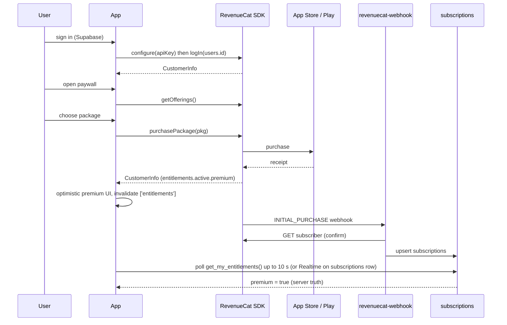

# 17 · Subscription Architecture

> **Status:** Draft v1 for build (Deliverable 13) · **Owner:** Growth and Platform · **Related:** `00-foundations.md`, `01-product-requirements.md`, `02-ux-specification.md`, `05-database-schema.md`, `06-api-specification.md`, `09-state-management.md`, `11-authentication.md`, `16-security-architecture.md`, `18-exports-and-analytics.md`, `19-deployment-architecture.md`
>
> Thuluth monetises with a single `premium` entitlement sold as monthly and annual auto-renewing subscriptions through the App Store and Google Play, managed by RevenueCat. The server is the source of truth: RevenueCat webhooks write the `subscriptions` table and every premium capability is enforced server-side through `has_premium()`. Anything new is marked **Addition beyond 00-foundations** and listed in [section 17](#17-additions-beyond-00-foundations).

## Table of contents

1. [Principles](#1-principles)
2. [Products, entitlement, offerings and packages](#2-products-entitlement-offerings-and-packages)
3. [Regional pricing](#3-regional-pricing)
4. [Trials and introductory offers](#4-trials-and-introductory-offers)
5. [Paywall placement and triggers](#5-paywall-placement-and-triggers)
6. [Client SDK flow](#6-client-sdk-flow)
7. [Server truth: revenuecat-webhook to subscriptions](#7-server-truth-revenuecat-webhook-to-subscriptions)
8. [has_premium() and household premium](#8-has_premium-and-household-premium)
9. [Entitlement enforcement points](#9-entitlement-enforcement-points)
10. [Grace periods, billing retry and downgrade behaviour](#10-grace-periods-billing-retry-and-downgrade-behaviour)
11. [Restore purchases and account changes](#11-restore-purchases-and-account-changes)
12. [Family sharing](#12-family-sharing)
13. [Refunds](#13-refunds)
14. [Promo codes for coaches and madrasas](#14-promo-codes-for-coaches-and-madrasas)
15. [Metrics](#15-metrics)
16. [Testing and acceptance criteria](#16-testing-and-acceptance-criteria)
17. [Additions beyond 00-foundations](#17-additions-beyond-00-foundations)

---

## 1. Principles

1. **Safety is never paywalled.** Allergy adaptations, red flags, clinician escalations, choking safety, hydration tracking, fasting tracking and meal logging are free (`00-foundations.md` section 8).
2. **Server is truth.** The client's `CustomerInfo` drives UI only; Edge Functions and triggers check `has_premium()`.
3. **One entitlement.** `premium` unlocks everything premium. Phase 2 adds `thuluth_family_coach_monthly` for coaches, mapped to a separate entitlement `coach` (Phase 2).
4. **Fair regional pricing.** Purchasing-power-adjusted prices per storefront, Pakistan first.
5. **Honest paywalls.** No dark patterns: clear price, renewal terms, how to cancel, trial end date, and a visible close button. Complies with App Store Review Guideline 3.1.2 and Google Play subscription policies.
6. **Data is never held hostage.** Expiry never deletes data; premium-only views become read-only or hidden, and exports already generated remain until expiry.

---

## 2. Products, entitlement, offerings and packages

### 2.1 Store products

| Product id (both stores) | Type | Duration | Entitlement |
|---|---|---|---|
| `thuluth_premium_monthly` | Auto-renewable subscription | 1 month | `premium` |
| `thuluth_premium_annual` | Auto-renewable subscription | 1 year | `premium` |
| `thuluth_family_coach_monthly` (Phase 2) | Auto-renewable subscription | 1 month | `coach` (plus `premium`) |

App Store: one subscription group `Thuluth Premium` containing monthly (level 2) and annual (level 1, higher level = better value for upgrade ordering). Google Play: one subscription `thuluth_premium` with base plans `monthly` and `annual` (product ids above are configured as RevenueCat product identifiers `thuluth_premium:monthly` and `thuluth_premium:annual` on Play; the code always refers to RevenueCat package identifiers, not raw store ids).

### 2.2 RevenueCat configuration

| Object | Value |
|---|---|
| Project | `Thuluth` |
| Apps | iOS (`app.thuluth.mobile`), Android (`app.thuluth.mobile`) |
| Entitlement | `premium` (attached to both products on both stores) |
| App User ID | `users.id` (Supabase auth uid). Purchases configured only after sign-in; no anonymous purchases. |
| Restore behaviour | "Keep with original App User ID" (section 11) |
| Webhook | `https://<project>.functions.supabase.co/revenuecat-webhook`, authorization header `Bearer <RC_WEBHOOK_SECRET>`, all event types, both environments (sandbox events flagged) |
| Subscriber attributes | `$onesignalId` (OneSignal subscription id), `country_code`, `locale`, `household_count`; never health data |

### 2.3 Offerings and packages

| Offering id | Packages | When served |
|---|---|---|
| `default` | `$rc_annual` (`thuluth_premium_annual`, with intro trial), `$rc_monthly` (`thuluth_premium_monthly`) | Everyone by default |
| `ramadan` | `$rc_annual` with promotional offer (section 4.3), `$rc_monthly` | Sha'ban 15 to Ramadan 20 via RevenueCat Targeting rule (date window set yearly) |
| `winback` | `$rc_annual` with win-back promotional offer, `$rc_monthly` | Lapsed subscribers (expired more than 30 days) via Targeting audience |
| `pk_launch` | `$rc_annual`, `$rc_monthly` (same products; copy variant only) | Pakistan storefront during the first 90 days post-launch (paywall copy experiment) |

The paywall reads `offering.metadata` for copy keys and the highlighted package:

```json
{ "highlight": "$rc_annual", "headline_key": "paywall.headline.default", "badge_key": "paywall.badge.save_40", "show_trial_timeline": true }
```

RevenueCat Experiments are used for price or copy tests only after 1,000 weekly paywall views per variant; Pakistan and GCC are tested separately.

---

## 3. Regional pricing

Prices are set per storefront in App Store Connect and Play Console (both support local currency price points and taxes). Targets below are list prices including VAT where the store includes it. The annual plan is priced at roughly 7 months of monthly (about 40 percent saving).

| Market | Currency | Monthly | Annual | Annual per month | Rationale |
|---|---|---|---|---|---|
| Pakistan | PKR | 699 | 4,999 | 417 | About the cost of one bazaar halwa-puri breakfast for four; PPP-adjusted (roughly one quarter of the US price in USD terms) |
| UAE | AED | 24.99 | 169.99 | 14.17 | GCC parity with KSA |
| Saudi Arabia | SAR | 24.99 | 169.99 | 14.17 | |
| Qatar, Kuwait, Bahrain, Oman | USD tier (store default local equivalent) | 6.99 | 46.99 | 3.92 | Store auto-conversion from the USD tier, reviewed quarterly |
| United Kingdom | GBP | 5.99 | 39.99 | 3.33 | Inclusive of VAT |
| Eurozone | EUR | 6.99 | 44.99 | 3.75 | Inclusive of VAT; stores adjust per country VAT |
| United States | USD | 6.99 | 44.99 | 3.75 | Excluding sales tax (store adds) |
| Canada | CAD | 8.99 | 59.99 | 5.00 | |
| India, Bangladesh, Indonesia, Malaysia, Turkey, Egypt (store availability; marketing Phase 2) | Local | About 30 to 45 percent of the USD price via PPP tiers | | | Set at Phase 2 locale launch |

Rules:

- Prices are display-only in code: the paywall always renders `package.product.priceString` and `pricePerMonthString` from the SDK, never hard-coded amounts.
- Price changes for existing subscribers follow store rules (Apple price increase consent where required; Play price change notifications). We do not raise prices for existing subscribers in the first 12 months.
- Currency for analytics is normalized to USD using RevenueCat's `price_in_purchased_currency` and `takehome_percentage` from webhook payloads.

---

## 4. Trials and introductory offers

### 4.1 Free trial

| Item | Value |
|---|---|
| Product | Annual only |
| Length | 7 days |
| Eligibility | New subscribers per store rules (Apple: once per subscription group per Apple ID; Play: once per account per subscription) |
| Eligibility check | `Purchases.checkTrialOrIntroductoryPriceEligibility` (iOS); Play eligibility reflected in `product.subscriptionOptions` |
| Reminder | Local notification 2 days before trial end (opt-in, `notification_preferences.kind = 'trial_ending'`), plus Apple's and Google's own reminders |
| Paywall timeline | "Today: full access. Day 5: reminder. Day 7: trial ends, annual plan starts at PKR 4,999. Cancel any time in your store settings." |

Monthly has no trial; it starts immediately so users who want a short commitment can pay for one month.

### 4.2 Reverse trial (not in v1)

Considered and rejected for v1: granting premium automatically on sign-up and downgrading after 7 days confuses free-tier limits for families. Revisit with data.

### 4.3 Promotional offers

| Offer | Store mechanism | Who |
|---|---|---|
| Ramadan offer: 30 percent off the first year of annual | Apple promotional offer (signed by RevenueCat) and Play developer-determined offer with eligibility tag `ramadan` | Users who never subscribed or expired more than 60 days ago, during the `ramadan` offering window |
| Win-back: first month at 50 percent | Apple win-back offer and Play win-back offer | Lapsed subscribers |
| Retention offer on cancel intent | RevenueCat Customer Center retention offer (if adopted) or in-app "Before you go" screen offering a 1-month 50 percent discount (promotional offer) | Users tapping "Manage subscription" from settings |

---

## 5. Paywall placement and triggers

The paywall component is `PaywallScreen` (`apps/mobile/src/features/subscription/screens/paywall-screen.tsx`), a custom React Native screen (not RevenueCat's hosted paywall) to support Urdu RTL, our design system and Islamic visual language. It is presented as a modal route `Paywall` with a required `trigger` param.

### 5.1 Placements

| Trigger id | Where | Type | Notes |
|---|---|---|---|
| `onboarding_plan_preview` | After the first AI plan preview is shown at the end of onboarding | Soft (dismissible), once | Shows what the full plan includes; free users continue with their weekly plan |
| `plan_multi_week` | Selecting 2 to 4 weeks or a second plan | Hard gate | |
| `plan_adjust` | "Adjust my plan" natural-language change | Hard gate (free users get one adjustment per week as a teaser) | Teaser limit configurable via `feature_flags` |
| `chat_quota` | 21st AI message of the day (free) | Hard gate with countdown to reset | |
| `chat_voice`, `chat_photo` | Mic or camera in chat; meal photo analysis | Hard gate | |
| `growth_chart` | Opening percentile charts | Hard gate with blurred preview of the child's real chart shape | Values hidden in the preview |
| `autism_ladder`, `picky_coaching` | Exposure ladders, food chaining, coaching plans | Hard gate | Safe-food list remains free |
| `ramadan_full_plan` | Generate a family Ramadan plan | Hard gate | Generic tips free |
| `grocery_budget` | Budget optimization, monthly list, substitutions, price trends | Hard gate | Basic list free |
| `export_pdf` | Any PDF export | Hard gate | |
| `second_household`, `member_limit` | Creating household 2 or member 7 | Hard gate | |
| `analytics` | Family analytics and coaching dashboards | Hard gate | |
| `settings_upgrade` | Settings > Subscription | User-initiated | |

### 5.2 Frequency and fairness rules

- Soft paywalls: at most one per 72 hours and never in the first 2 minutes of a session.
- Hard gates always show the specific feature that triggered them first (contextual hero), then the general benefits.
- Never shown on red-flag screens, clinician escalation screens, or during an active iftar or suhoor reminder flow.
- Never shown to members viewing a premium household as caregivers (they already have household premium, section 8).
- The close button is visible immediately.

### 5.3 Paywall content

1. Contextual hero for the trigger.
2. Benefits list (5 items, localized): full AI plans, unlimited adjustments, growth charts, autism and picky-eater programmes, Ramadan family planner, budget-optimized groceries, PDF exports, voice and photo chat.
3. Packages: annual highlighted with per-month price and saving badge; monthly.
4. Trial timeline (if eligible).
5. Legal: auto-renewal terms, price per period, cancellation instructions, links to Terms and Privacy, "Restore purchases".

---

## 6. Client SDK flow

Libraries: `react-native-purchases` (pinned), configured in `apps/mobile/src/features/subscription/revenuecat.ts`. Store: `useSubscriptionStore` (Zustand, `09-state-management.md`) holds the client view; React Query key `['entitlements', userId]` holds the server view.



```ts
// apps/mobile/src/features/subscription/revenuecat.ts
import Purchases, { LOG_LEVEL, type CustomerInfo, type PurchasesPackage } from 'react-native-purchases';
import { Platform } from 'react-native';
import { env } from '@/config/env';

let configured = false;

export async function initPurchases(userId: string): Promise<CustomerInfo> {
  if (!configured) {
    Purchases.setLogLevel(__DEV__ ? LOG_LEVEL.DEBUG : LOG_LEVEL.WARN);
    Purchases.configure({ apiKey: Platform.OS === 'ios' ? env.RC_IOS_KEY : env.RC_ANDROID_KEY, appUserID: userId });
    configured = true;
    Purchases.addCustomerInfoUpdateListener(onCustomerInfo);
  } else {
    await Purchases.logIn(userId);
  }
  return Purchases.getCustomerInfo();
}

export async function purchase(pkg: PurchasesPackage, trigger: PaywallTrigger) {
  track('paywall_purchase_started', { trigger, package: pkg.identifier });
  try {
    const { customerInfo } = await Purchases.purchasePackage(pkg);
    const active = customerInfo.entitlements.active['premium'] != null;
    track(active ? 'paywall_purchase_succeeded' : 'paywall_purchase_pending', { trigger, package: pkg.identifier });
    await queryClient.invalidateQueries({ queryKey: ['entitlements'] });
    return active;
  } catch (e: any) {
    if (e?.userCancelled) { track('paywall_purchase_cancelled', { trigger }); return false; }
    track('paywall_purchase_failed', { trigger, code: String(e?.code ?? 'unknown') });
    throw e;
  }
}

export async function signOutPurchases() { if (configured) await Purchases.logOut(); }
```

Client entitlement resolution (UI only):

```ts
export function useIsPremium(householdId?: string): { premium: boolean; source: 'server' | 'client' | 'none' } {
  const server = useQuery({ queryKey: ['entitlements', userId, householdId], queryFn: () => rpc('get_my_entitlements', { p_household: householdId }), staleTime: 60_000 });
  const client = useSubscriptionStore(s => s.clientPremium);           // from CustomerInfo listener
  if (server.data) return { premium: server.data.premium || client, source: server.data.premium ? 'server' : client ? 'client' : 'none' };
  return { premium: client, source: client ? 'client' : 'none' };
}
```

The client may show premium UI optimistically for up to 10 minutes after a successful purchase before the webhook lands; server calls in that window that return `PREMIUM_REQUIRED` trigger `syncEntitlement` (section 7.5) and retry once.

Pending purchases (Play "pending" payment methods common in Pakistan, such as carrier billing or cash top-up flows) show "Purchase pending; premium unlocks when payment completes." The webhook activates premium when the transaction completes.

---

## 7. Server truth: revenuecat-webhook to subscriptions

### 7.1 Table usage

`subscriptions` (`00-foundations.md`): `user_id`, `tier`, `status`, `product_id`, `store ('app_store'|'play_store'|'promotional')`, `rc_app_user_id`, `current_period_end`, `will_renew`, `raw_event`.

Additions (**Addition beyond 00-foundations**):

```sql
alter table subscriptions
  add column entitlement text not null default 'premium',
  add column period_type text null check (period_type in ('trial','intro','normal','promotional')),
  add column grace_period_expires_at timestamptz null,
  add column original_transaction_id text null,
  add column environment text not null default 'production' check (environment in ('production','sandbox')),
  add column last_event_at timestamptz not null default now(),
  add column refunded_at timestamptz null,
  add column country_code char(2) null;
create unique index subscriptions_user_store_entitlement on subscriptions (user_id, store, entitlement);

create table revenuecat_events (
  event_id text primary key,                 -- RevenueCat event.id
  type text not null,
  app_user_id text not null,
  event_timestamp timestamptz not null,
  environment text not null,
  received_at timestamptz not null default now(),
  processed_at timestamptz null,
  error text null,
  payload jsonb not null
);
alter table revenuecat_events enable row level security;  -- no policies: service role only
```

### 7.2 Webhook handler

```ts
// supabase/functions/revenuecat-webhook/index.ts
import { timingSafeEqual } from 'jsr:@std/crypto/timing-safe-equal';
import { admin } from '../_shared/admin.ts';

Deno.serve(async (req) => {
  const expected = new TextEncoder().encode(`Bearer ${Deno.env.get('RC_WEBHOOK_SECRET')}`);
  const got = new TextEncoder().encode(req.headers.get('authorization') ?? '');
  if (got.length !== expected.length || !timingSafeEqual(got, expected)) return json(401, err('UNAUTHORIZED'));

  const body = RevenueCatWebhookSchema.parse(await req.json());        // Zod: { api_version, event: {...} }
  const ev = body.event;
  const { error: dupErr } = await admin.from('revenuecat_events').insert({
    event_id: ev.id, type: ev.type, app_user_id: ev.app_user_id,
    event_timestamp: new Date(ev.event_timestamp_ms).toISOString(), environment: ev.environment, payload: body,
  });
  if (dupErr?.code === '23505') return json(200, { ok: true, duplicate: true });   // idempotent replay

  if (ev.type === 'TEST') return json(200, { ok: true });

  // Source of truth: re-fetch subscriber so out-of-order events cannot regress state.
  const subscriber = await fetchSubscriber(ev.app_user_id);            // GET /v1/subscribers/{id} with RC secret key
  const userId = await resolveUserId(ev);                              // app_user_id or aliases -> users.id (uuid check)
  const rows = deriveSubscriptionRows(userId, subscriber, ev);         // one row per store with premium entitlement
  for (const r of rows) await admin.from('subscriptions').upsert(r, { onConflict: 'user_id,store,entitlement' });
  await admin.from('revenuecat_events').update({ processed_at: new Date().toISOString() }).eq('event_id', ev.id);
  await admin.from('audit_log').insert({ actor_user_id: null, action: 'subscription_event', entity: 'subscriptions',
    entity_id: rows[0]?.id ?? null, diff: { type: ev.type, product: ev.product_id, period_end: rows[0]?.current_period_end } });
  await enqueueAnalytics(userId, ev);                                  // subscription_* events (18)
  return json(200, { ok: true });
});
```

If processing fails after the insert, the function returns 500 and RevenueCat retries (it retries with backoff up to 5 times); on retry the duplicate check sees an unprocessed event and reprocesses it (check `processed_at is null` instead of returning early).

### 7.3 Event to status mapping

`deriveSubscriptionRows` uses the refetched subscriber's `entitlements.premium` (`expires_date`, `grace_period_expires_date`, `product_identifier`, `period_type`, `store`, `unsubscribe_detected_at`, `billing_issues_detected_at`, `refunded_at`). The event type is used for analytics and edge cases:

| RevenueCat event | Resulting `status` | `will_renew` | Notes |
|---|---|---|---|
| `INITIAL_PURCHASE` | `active` | true | `period_type` trial or normal |
| `RENEWAL` | `active` | true | Trial conversion when previous period type was trial |
| `PRODUCT_CHANGE` | `active` | true | Monthly to annual; product updated at effective date |
| `CANCELLATION` (unsubscribe) | `cancelled` | false | Premium continues until `current_period_end` |
| `CANCELLATION` with `cancel_reason = 'CUSTOMER_SUPPORT'` (refund) | `expired` | false | `refunded_at` set; entitlement revoked (expires_date in the past) |
| `UNCANCELLATION` | `active` | true | |
| `BILLING_ISSUE` | `in_grace` if `grace_period_expires_date` in future, else `in_billing_retry` | true | |
| `SUBSCRIPTION_PAUSED` (Play) | `paused` | true | Premium ends at period end; resumes on `RENEWAL` |
| `EXPIRATION` | `expired` | false | |
| `SUBSCRIPTION_EXTENDED` | `active` | unchanged | Store-granted extension |
| `TEMPORARY_ENTITLEMENT_GRANT` | `active` with `period_type='normal'`, short expiry | true | RevenueCat outage protection |
| `NON_RENEWING_PURCHASE` | n/a (no such products in v1); logged | | |
| `TRANSFER` | Recompute both old and new app user ids | | With "keep with original" behaviour, transfers occur only via support |
| Promotional grant (our `promo-redeem` or RevenueCat dashboard) | `active`, `store='promotional'` | false | `current_period_end` = grant end |

Status precedence when deriving: if `expires_date > now()` and `refunded_at is null` then `active`, `cancelled` (if unsubscribed) or `in_grace`; else `in_billing_retry` (billing issue, no grace), `paused`, or `expired`.

### 7.4 Ordering and clock skew

Every upsert sets `last_event_at = event_timestamp`; the upsert is skipped when an existing row has a later `last_event_at` unless the refetched subscriber data differs (the refetch is authoritative). `current_period_end` comparisons use database `now()`.

### 7.5 On-demand sync

`get_my_entitlements()` is the RPC the client uses (security definer, returns only the caller's data). When the client believes it has premium but the server does not, it calls the `revenuecat-webhook` function's authenticated sub-route `POST /revenuecat-webhook/sync` (**Addition beyond 00-foundations**: a JWT-authenticated route in the same function) which refetches the caller's subscriber from RevenueCat and upserts. Rate-limited to 6 per hour per user.

---

## 8. has_premium() and household premium

```sql
create or replace function public.has_premium(p_user uuid)
returns boolean language sql stable security definer set search_path = '' as $$
  select exists (
    select 1 from public.subscriptions s
    where s.user_id = p_user
      and s.entitlement = 'premium'
      and s.environment = 'production'
      and s.refunded_at is null
      and (
        (s.status in ('active','cancelled') and s.current_period_end > now())
        or (s.status = 'in_grace' and coalesce(s.grace_period_expires_at, s.current_period_end) > now())
      )
  );
$$;

-- Addition beyond 00-foundations: premium shared with every member of a household owned by a premium user
create or replace function public.household_has_premium(p_household uuid)
returns boolean language sql stable security definer set search_path = '' as $$
  select exists (
    select 1 from public.households h
    where h.id = p_household and public.has_premium(h.owner_user_id)
  );
$$;

-- Addition beyond 00-foundations: effective premium for the caller in a household context
create or replace function public.premium_for(p_household uuid default null)
returns boolean language sql stable security definer set search_path = '' as $$
  select public.has_premium(auth.uid())
      or (p_household is not null and public.is_household_member(p_household) and public.household_has_premium(p_household));
$$;

create or replace function public.get_my_entitlements(p_household uuid default null)
returns jsonb language sql stable security definer set search_path = '' as $$
  select jsonb_build_object(
    'premium', public.premium_for(p_household),
    'personalPremium', public.has_premium(auth.uid()),
    'householdPremium', p_household is not null and public.household_has_premium(p_household),
    'status', (select s.status from public.subscriptions s where s.user_id = auth.uid() and s.entitlement = 'premium'
               order by s.current_period_end desc nulls last limit 1),
    'currentPeriodEnd', (select max(s.current_period_end) from public.subscriptions s where s.user_id = auth.uid()),
    'willRenew', (select bool_or(s.will_renew) from public.subscriptions s where s.user_id = auth.uid())
  );
$$;
grant execute on function public.get_my_entitlements(uuid), public.premium_for(uuid) to authenticated;
revoke execute on function public.has_premium(uuid), public.household_has_premium(uuid) from authenticated, anon;
```

`has_premium(user_id)` is the canonical check named in `00-foundations.md`. Edge Functions acting in a household context call `premium_for(household_id)` with the user's JWT, or `has_premium(userId) or household_has_premium(householdId)` with the admin client after verifying membership. Sandbox subscriptions grant premium only in `thuluth-dev` and `thuluth-staging` (the environment filter is relaxed there by a `feature_flags` row `allow_sandbox_premium`).

---

## 9. Entitlement enforcement points

| Capability | Enforcement point | Check | Error |
|---|---|---|---|
| More than 1 household per user | `before insert on households` trigger | `has_premium(new.owner_user_id)` or count = 0 | `PLAN_LIMIT_REACHED` |
| More than 6 members (free) / 20 (premium) per household | `before insert on family_members` trigger | count vs `household_has_premium(household_id)` | `PLAN_LIMIT_REACHED` |
| Multi-week plans, more than 1 active plan, AI-proposed recipes | `ai-generate-plan` | `premium_for(householdId)` | `PREMIUM_REQUIRED` |
| Plan adjustments beyond teaser | `ai-adjust-plan` | premium or weekly teaser counter | `PREMIUM_REQUIRED` |
| Chat quota (20 free, 200 premium fair use) | `ai-chat` | count of today's user messages in `chat_messages` (household timezone day) | `QUOTA_EXCEEDED` with `resetAt` |
| Voice, photo in chat; meal photo analysis | `ai-transcribe`, `ai-chat` attachments, `ai-analyze-meal` | premium | `PREMIUM_REQUIRED` |
| Long-term memory | `ai-chat` memory writer | premium (free sessions do not write `ai_memories`) | silent |
| Budget optimization, substitutions, monthly lists, pantry | `grocery-generate` | premium; free path returns basic list | downgraded response |
| Price trends | RPC `price_trends()` | `premium_for` | `PREMIUM_REQUIRED` |
| Growth charts and trends | `growth-compute` response (`premiumChart`), RPC `growth_dashboard` returns curves only when premium | `premium_for(household)` | values withheld |
| Autism ladders, food chaining, picky coaching, acceptance analytics | Insert trigger on `exposure_ladders` (premium required for new rows), RPC `picky_acceptance_summary` | `premium_for` | `PREMIUM_REQUIRED` |
| Full Ramadan plan | `ramadan-generate` | premium | `PREMIUM_REQUIRED` |
| PDF exports | `export-pdf` | premium | `PREMIUM_REQUIRED` |
| Analytics dashboards (family) | RPCs over materialized views | premium | `PREMIUM_REQUIRED` |

Client gating (`<PremiumGate feature="growth_chart">`) only decides whether to show the paywall; it never replaces the server check.

---

## 10. Grace periods, billing retry and downgrade behaviour

### 10.1 Store settings

| Store | Setting |
|---|---|
| App Store | Billing Grace Period enabled, 16 days for all renewals; billing retry up to 60 days handled by Apple |
| Google Play | Grace period 7 days (monthly) and 14 days (annual); account hold 30 days after grace |

### 10.2 App behaviour

| State | Premium | UX |
|---|---|---|
| `in_grace` | Yes | Banner "Your payment didn't go through. Update it in your store settings to keep premium." with deep link to the store subscription page; push once at start and 3 days before grace ends |
| `in_billing_retry` (Apple after grace) / account hold (Play) | No | Paywall variant "Fix payment" with store link; data intact |
| `cancelled` (will not renew) | Yes until period end | Settings show end date; one gentle reminder 3 days before end |
| `paused` (Play) | No after period end | "Resumes on <date>" |
| `expired` | No | Downgrade rules below |

### 10.3 Downgrade rules (data preserved)

| Area | On losing premium |
|---|---|
| Households beyond 1 | User picks one active household; others become read-only (no new plans, logs still allowed for safety tracking: hydration, fasting, meals) |
| Members beyond 6 | All remain visible; members 7+ excluded from new plans until upgrade or until the user archives others |
| Plans | Current active plan continues to its end; next plan generated from curated templates (free path) |
| Growth | Measurements kept and loggable; charts and history hidden (latest value visible) |
| Autism, picky | Ladders paused (read-only), safe-food list and safe foods in plans continue |
| Chat | Free quota; memories retained but not used until re-subscription (deleted after 12 months of non-subscription, with notice) |
| Exports | Existing files available until `expires_at`; no new exports |
| Grocery | Basic list from plan |

---

## 11. Restore purchases and account changes

| Scenario | Behaviour |
|---|---|
| "Restore purchases" button (paywall and settings) | `Purchases.restorePurchases()`; then `sync` route; success toast or "No purchases found for this Apple ID / Google account" |
| Same store account, different Thuluth account | RevenueCat restore behaviour "Keep with original App User ID": the purchase stays with the account that bought it. The app explains: "This subscription belongs to another Thuluth account. Sign in with that account, or ask its owner to invite you to their household (premium is shared with household members)." |
| Reinstall or new device, same Thuluth account | `logIn(users.id)` restores entitlements automatically; no restore tap needed |
| Sign out | `Purchases.logOut()`; local premium state cleared |
| Account deletion | `account-delete` reminds the user to cancel in the store; RevenueCat subscriber deleted via REST after deletion (`16-security-architecture.md`); `subscriptions` rows kept as anonymised billing records where tax law requires |
| Support transfer | Admin tool calls RevenueCat transfer API after identity verification; audited |

---

## 12. Family sharing

| Mechanism | v1 decision |
|---|---|
| In-app household sharing | **Primary mechanism.** A premium user's households are premium for all their members (`household_has_premium`). A spouse or grandparent invited as `caregiver` or `viewer` gets premium features inside that household without buying. Their personal second household (if any) is not premium unless they subscribe. |
| Apple Family Sharing | Enabled on both products in App Store Connect. A family member who receives the subscription via Family Sharing gets a RevenueCat entitlement on their own App User ID (RevenueCat reports `ownership_type = FAMILY_SHARED`), so their own `has_premium` is true. |
| Google Play | Play does not offer an equivalent family sharing for our subscriptions; household sharing covers Android families. |
| Abuse limit | Household premium extends to at most 20 members (the premium member cap) and up to 6 app accounts (`household_members` with app accounts) per premium household; beyond that, invitations require their own subscription. Enforced in `household-invite`. |

Paywall copy: "One subscription covers your whole family in Thuluth."

---

## 13. Refunds

| Store | Process | Our handling |
|---|---|---|
| App Store | User requests refund from Apple (reportaproblem.apple.com); Apple decides. Optional Consumption API: we respond to `CONSUMPTION_REQUEST` notifications via RevenueCat's handling with usage data **without health data** (only "customer consented", "play time" bucket, account tenure), or decline to send if not configured. | `CANCELLATION` with refund reason: revoke immediately, set `refunded_at`, `status='expired'`, downgrade rules apply, analytics `subscription_refunded` |
| Google Play | User requests within the Play refund window, or we refund via RevenueCat dashboard ("Refund and revoke") on support request | Same webhook handling |
| Support policy | Accidental purchase within 48 h, duplicate subscriptions across stores, or service failure: support assists or refunds on Play; for Apple, guides the user to Apple | Logged in support tool |

Refund abuse signal: more than 2 refunds per user lifetime blocks trial eligibility via a RevenueCat Targeting audience.

---

## 14. Promo codes for coaches and madrasas

### 14.1 Mechanisms

| Need | Mechanism |
|---|---|
| Individual free months for influencers, reviewers, nutrition coaches | Apple offer codes (custom code, for example `COACH2027`, redeemed in App Store) and Google Play promo codes for subscriptions; tracked by RevenueCat as normal purchases with `offer_code` |
| Organisation grants (madrasas, schools, community centres, clinics) without app-store payment | **Promotional entitlement** via our own code system: user enters a code in Settings > Redeem code; `promo-redeem` validates and grants premium through RevenueCat's promotional entitlement API so SDK and server agree |
| Phase 2 madrasa group plans | Same system with bulk seats and an organisation admin portal (`23-phase-2-roadmap.md`) |

### 14.2 Tables and function (Addition beyond 00-foundations)

```sql
create table promo_campaigns (
  id uuid primary key default gen_random_uuid(),
  name text not null,                               -- 'Jamia Ashrafia Lahore pilot', 'Coach programme 2027'
  org_kind text not null check (org_kind in ('coach','madrasa','school','clinic','community','partner','internal')),
  grant_days smallint not null check (grant_days between 7 and 366),
  max_redemptions int not null,
  redeemed_count int not null default 0,
  starts_at timestamptz not null, ends_at timestamptz not null,
  allowed_countries char(2)[] null,
  created_by uuid not null references users(id),
  created_at timestamptz not null default now(), updated_at timestamptz not null default now()
);
create table promo_codes (
  id uuid primary key default gen_random_uuid(),
  campaign_id uuid not null references promo_campaigns(id),
  code_hash text not null unique,                   -- sha256(upper(code) || pepper)
  single_use boolean not null default true,
  redeemed_at timestamptz null,
  created_at timestamptz not null default now(), updated_at timestamptz not null default now()
);
create table promo_redemptions (
  id uuid primary key default gen_random_uuid(),
  promo_code_id uuid not null references promo_codes(id),
  user_id uuid not null references users(id),
  granted_until timestamptz not null,
  created_at timestamptz not null default now(), updated_at timestamptz not null default now(),
  unique (promo_code_id, user_id)
);
alter table promo_campaigns enable row level security;
alter table promo_codes enable row level security;
alter table promo_redemptions enable row level security;
create policy promo_redemptions_own on promo_redemptions for select to authenticated using (user_id = (select auth.uid()));
```

`promo-redeem` Edge Function (**Addition beyond 00-foundations**):

1. `requireUser`; rate limit 5 attempts per hour per user and per IP (code brute-force protection).
2. Hash the code; lock the row (`select ... for update`); check campaign window, country, remaining redemptions, single-use, user not already redeemed in this campaign, user has no active store subscription (otherwise offer to queue the grant after the store period ends).
3. Call RevenueCat `POST /v1/subscribers/{app_user_id}/entitlements/premium/promotional` with a duration matching `grant_days` (RevenueCat supports fixed durations; we pick the nearest not exceeding `grant_days`: weekly, monthly, two_month, three_month, six_month, yearly).
4. Insert `promo_redemptions`, upsert `subscriptions` (`store='promotional'`, `period_type='promotional'`, `current_period_end`), increment `redeemed_count`, audit log, analytics `promo_redeemed` with `org_kind` only.

Codes are generated by an admin script (`scripts/promo/generate.ts`) as 10-character Crockford base32 with a check character, exported to CSV for the organisation, and only hashes are stored.

---

## 15. Metrics

Sources: RevenueCat Charts (revenue, MRR, churn, trial conversion), `subscriptions` and `revenuecat_events` (server truth), `analytics_events` (paywall funnel). Definitions (SQL in `18-exports-and-analytics.md`):

| Metric | Definition |
|---|---|
| Paywall view rate | Users with `paywall_viewed` / active users, by trigger |
| Paywall conversion | `paywall_purchase_succeeded` / `paywall_viewed` within the same session, by trigger, package, country |
| Trial start rate | Trials started / annual paywall views where eligible |
| Trial to paid conversion | Trials reaching `RENEWAL` / trials started (cohort by start week) |
| MRR | Sum of active subscriptions' normalized monthly price in USD (annual / 12), net of store fees using `takehome_percentage` for net MRR |
| ARPPU by region | Net revenue / paying users, by `country_code` |
| Churn (monthly) | Subscriptions expiring without renewal in month / active at month start |
| Grace recovery rate | `in_grace` subscriptions returning to `active` / entering `in_grace` |
| Refund rate | Refunds / purchases (30-day window) |
| Household premium reach | Users with premium through household only / all premium-capable users |
| Promo activation | Redemptions / codes issued, and promo to paid conversion after grant end |

Targets for the first 6 months (planning assumptions, revisit monthly): paywall conversion 3 to 5 percent in GCC, UK, US; 1.5 to 3 percent in Pakistan; trial to paid 35 to 45 percent; monthly churn under 8 percent.

---

## 16. Testing and acceptance criteria

Testing: RevenueCat sandbox (StoreKit configuration file for local iOS, App Store sandbox testers, Play license testers), webhook fixtures for each event type in `supabase/functions/revenuecat-webhook/__fixtures__/`, contract tests for `deriveSubscriptionRows`, and end-to-end Maestro flows for purchase, restore and expiry (`21-testing-strategy.md`).

| ID | Criterion |
|---|---|
| AC-SUB1 | Purchasing annual in sandbox results in `subscriptions.status = 'active'` and `has_premium = true` within 10 s of RevenueCat's webhook, and the app reflects it without restart. |
| AC-SUB2 | Replaying the same webhook event id does not create duplicate rows or audit entries. |
| AC-SUB3 | Out-of-order delivery (`EXPIRATION` arriving before a later `RENEWAL`) ends in the correct `active` state because of the subscriber refetch. |
| AC-SUB4 | A refunded subscription loses premium immediately; downgrade rules apply; no data is deleted. |
| AC-SUB5 | A caregiver in a premium owner's household gets premium features in that household only. |
| AC-SUB6 | Every premium Edge Function returns `PREMIUM_REQUIRED` for a free user even when the client sends a forged "premium" flag. |
| AC-SUB7 | `in_grace` users keep premium and see the payment banner; `in_billing_retry` users do not keep premium. |
| AC-SUB8 | Paywall prices render from the SDK in the storefront currency (PKR for Pakistan) with correct renewal text, in en and ur (RTL). |
| AC-SUB9 | A promo code can be redeemed once, grants the configured duration in both RevenueCat and `subscriptions`, and brute-force attempts are rate-limited. |
| AC-SUB10 | Safety features (allergy adaptations, red flags, hydration and fasting tracking, meal logging) work identically for free and premium users. |

---

## 17. Additions beyond 00-foundations

| Addition | Kind | Purpose |
|---|---|---|
| `subscriptions.entitlement`, `period_type`, `grace_period_expires_at`, `original_transaction_id`, `environment`, `last_event_at`, `refunded_at`, `country_code`; unique index `(user_id, store, entitlement)` | Columns | Accurate lifecycle state |
| `revenuecat_events` | Table | Idempotency and replay |
| `household_has_premium(uuid)`, `premium_for(uuid)`, `get_my_entitlements(uuid)` | SQL functions | Household premium and client entitlement RPC |
| `POST /revenuecat-webhook/sync` | Authenticated sub-route | On-demand entitlement sync |
| `promo_campaigns`, `promo_codes`, `promo_redemptions` | Tables | Organisation and coach promo codes |
| `promo-redeem` | Edge Function | Code redemption and promotional entitlement grant |
| `coach` entitlement (Phase 2) | RevenueCat entitlement | Coach accounts |
| `notification_preferences.kind = 'trial_ending'` | Value | Trial reminder |
