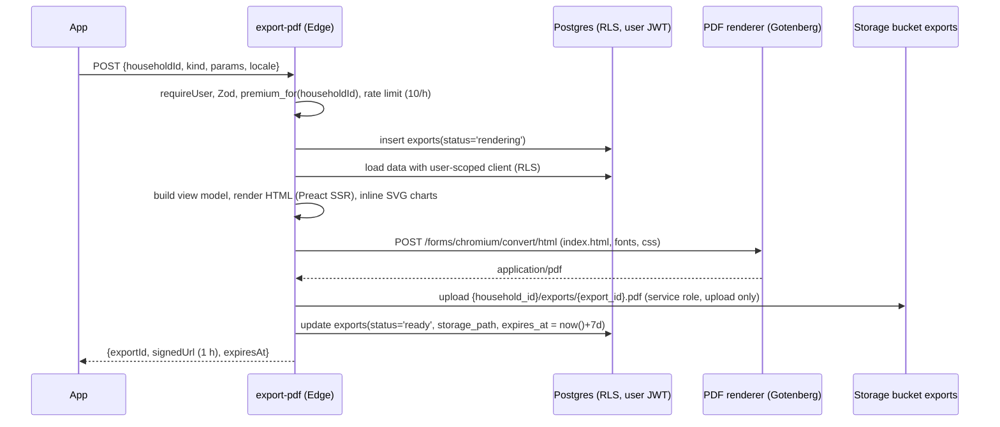

# 18 · Exports and Analytics

> **Status:** Draft v1 for build · **Owner:** Platform and Data · **Related:** `00-foundations.md`, `03-design-system.md`, `05-database-schema.md`, `06-api-specification.md`, `10-supabase-structure.md`, `14-meal-planning-and-grocery.md`, `15-family-health-modules.md`, `16-security-architecture.md`, `17-subscription-architecture.md`, `19-deployment-architecture.md`
>
> Part A specifies PDF exports rendered by the `export-pdf` Edge Function. Part B specifies first-party product analytics: the `analytics_events` taxonomy, metric definitions with SQL, materialized views refreshed by `analytics-rollup`, dashboards and privacy rules. Anything new is marked **Addition beyond 00-foundations** and listed in [section 16](#16-additions-beyond-00-foundations).

## Table of contents

**Part A: Exports**

1. [Export kinds and entitlements](#1-export-kinds-and-entitlements)
2. [Rendering pipeline](#2-rendering-pipeline)
3. [Template structure](#3-template-structure)
4. [Per-export content specifications](#4-per-export-content-specifications)
5. [Localization and RTL in PDFs](#5-localization-and-rtl-in-pdfs)
6. [Storage, signed URLs and retention](#6-storage-signed-urls-and-retention)
7. [Export acceptance criteria](#7-export-acceptance-criteria)

**Part B: Analytics**

8. [Architecture](#8-architecture)
9. [Event taxonomy](#9-event-taxonomy)
10. [Client and server instrumentation](#10-client-and-server-instrumentation)
11. [Metric definitions with SQL](#11-metric-definitions-with-sql)
12. [Materialized views and refresh](#12-materialized-views-and-refresh)
13. [Dashboards](#13-dashboards)
14. [Privacy rules for analytics](#14-privacy-rules-for-analytics)
15. [Analytics acceptance criteria](#15-analytics-acceptance-criteria)
16. [Additions beyond 00-foundations](#16-additions-beyond-00-foundations)

---

# Part A: Exports

## 1. Export kinds and entitlements

`exports.kind` values from `00-foundations.md`:

| Kind | Content summary | Tier | MVP |
|---|---|---|---|
| `meal_plan` | Weekly or monthly plan with per-member portions, adaptations, fluid timing, weekly theme, batch prep | Premium | Yes |
| `grocery_list` | Weekly and monthly lists by aisle with quantities, estimated prices, checkboxes, swaps | Premium | Yes |
| `nutrition_report` | Per member or household: adherence, nutrient coverage estimates (adults), hydration, journal trends, Thuluth adherence | Premium | Phase 2 (template built in Sprint 6 if time allows) |
| `growth_report` | Child growth charts (WHO), measurement table, alerts, notes for the paediatrician | Premium | Phase 2 (charts available in-app in MVP) |
| `ramadan_pack` | Family Ramadan schedule with suhoor and iftar times, menus, hydration plan, children's practice-fast chart, du'a page with verified sources | Premium | Phase 2 (early, before Ramadan 2027) |
| `family_summary` | One-page fridge summary: members, safe foods, allergies, routines, Thuluth fridge card | Premium | Phase 2 |

Per `00-foundations.md` section 8 there are no PDF exports on the free tier. Account data exports (`account-export`) are a legal right and are free; they are specified in `16-security-architecture.md`.

## 2. Rendering pipeline

Edge Functions on Deno cannot run a headless browser, so `export-pdf` renders HTML and sends it to a **private PDF rendering service** (Gotenberg 8, Chromium engine) running as a container in the same cloud region (EU), reachable only with a bearer token over TLS (canonical in `00-foundations.md` section 3; Cloud Run infrastructure in `04-system-architecture.md` and `19-deployment-architecture.md`). Chromium gives correct Urdu Nastaliq and Arabic shaping, bidi and CSS paged media.



| Step | Detail |
|---|---|
| Data loading | Always with the caller's JWT so RLS applies; the service role is used only for the storage upload |
| View model | `buildViewModel(kind, data, locale)` in `supabase/functions/export-pdf/view-models/`; pure, unit-tested, no I/O |
| HTML | Preact components rendered with `preact-render-to-string` (`npm:` pinned); all user text escaped by Preact |
| Charts | Server-side SVG from `packages/shared/src/charts/` (growth curves, adherence bars), no JavaScript in the PDF |
| Renderer request | Multipart: `index.html`, `styles.css`, font files (from `export-pdf/assets/fonts/`); options `paperWidth/Height` per locale (A4 default; US Letter for `en-US`), `preferCssPageSize=true`, `printBackground=true`, `emulatedMediaType=print`, `waitDelay=0`, `failOnConsoleExceptions=true` |
| Network isolation | Renderer runs with outbound network disabled (all assets are inlined or uploaded with the request), so injected `` cannot exfiltrate data |
| Timeouts | Renderer 20 s; function total 45 s; on timeout `exports.status='failed'` and `EXPORT_TIMEOUT` |
| Size guard | Monthly meal plan for 20 members capped at 60 pages; larger requests split into per-week PDFs |
| Metadata | PDF title, author "Thuluth", subject, `lang`; no user email or ids in metadata |
| Observability | Duration and page count logged; no content logged |

`exports.status` values: `rendering`, `ready`, `failed`, `expired` (check constraint; **Addition** of the value set).

Request contract (`packages/shared/src/contracts/export.ts`):

```ts
export const ExportRequest = z.discriminatedUnion('kind', [
  z.object({ kind: z.literal('meal_plan'), householdId: z.string().uuid(), mealPlanId: z.string().uuid(),
             weeks: z.array(z.number().int().min(1).max(4)).optional(), memberIds: z.array(z.string().uuid()).optional(),
             includeRecipes: z.boolean().default(false), locale: Locale }),
  z.object({ kind: z.literal('grocery_list'), householdId: z.string().uuid(), groceryListIds: z.array(z.string().uuid()).min(1).max(5),
             showPrices: z.boolean().default(true), locale: Locale }),
  z.object({ kind: z.literal('nutrition_report'), householdId: z.string().uuid(), memberId: z.string().uuid().nullable(),
             from: IsoDate, to: IsoDate, locale: Locale }),
  z.object({ kind: z.literal('growth_report'), householdId: z.string().uuid(), memberId: z.string().uuid(),
             includeNotesForClinician: z.boolean().default(true), locale: Locale }),
  z.object({ kind: z.literal('ramadan_pack'), householdId: z.string().uuid(), ramadanPlanId: z.string().uuid(), locale: Locale }),
  z.object({ kind: z.literal('family_summary'), householdId: z.string().uuid(), locale: Locale }),
]);
export const ExportResponse = z.object({ exportId: z.string().uuid(), signedUrl: z.string().url(), expiresAt: z.string() });
```

## 3. Template structure

```
supabase/functions/export-pdf/
  index.ts                         # handler: auth, validation, orchestration
  render.ts                        # Preact SSR + renderer client
  renderer-client.ts               # Gotenberg multipart call with token
  view-models/
    meal-plan.ts  grocery-list.ts  nutrition-report.ts  growth-report.ts  ramadan-pack.ts  family-summary.ts
  templates/
    layout/
      Document.tsx                 # <html lang dir>, <head>, fonts, print CSS
      CoverPage.tsx  Header.tsx  Footer.tsx  Disclaimer.tsx  SourceBadge.tsx  QrToApp.tsx
    meal-plan/
      MealPlanPdf.tsx  WeekOverview.tsx  DayPage.tsx  MealCard.tsx  MemberPortionTable.tsx
      AdaptationBlock.tsx  FluidTiming.tsx  BatchPrep.tsx  ThemeBanner.tsx
    grocery-list/
      GroceryListPdf.tsx  AisleSection.tsx  ItemRow.tsx  BudgetSummary.tsx  SwapsApplied.tsx
    nutrition-report/  growth-report/  ramadan-pack/  family-summary/
  styles/
    base.css  print.css  rtl.css  tokens.css   # tokens generated from 03-design-system.md
  assets/fonts/
    Inter-*.woff2  NotoNastaliqUrdu-*.woff2  NotoNaskhArabic-*.woff2  Amiri-*.woff2
  i18n/
    en.json  ur.json               # export-specific strings; shared keys from packages/shared/i18n
```

Common layout rules:

| Element | Rule |
|---|---|
| Page | A4 portrait, margins 14 mm (12 mm for grocery lists), `@page { size: A4; margin: 14mm }` |
| Header | Household name, document title, date range (Gregorian plus Hijri for Ramadan pack) |
| Footer | Page `n / N` via Chromium header/footer templates, "Generated by Thuluth on <date>", short disclaimer |
| Disclaimer page | Every health-related export ends with the clinician disclaimer (`00-foundations.md` section 10) and a note that Islamic references are for further reading and should be checked with a scholar |
| Badges | "Sunnah practice", "Evidence-based", "Sunnah and evidence agree" (from the reference binder), colour plus text label (not colour alone) |
| Islamic citations | Only verified sources (`verification_status='verified'`), with collection and number, tradition label per user preference (`13-islamic-knowledge-module.md`) |
| Child data | No kcal, z-scores or percentiles on pages a child might see (meal plan, family summary); growth report is parent-facing and marked "For parents and your paediatrician" |
| QR code | Optional deep link `thuluth://plan/<id>` encoded as SVG; contains no personal data |
| Accessibility | Tagged PDF output (`generateTaggedPdf` option), logical heading order, minimum 9 pt body, 4.5:1 contrast |

Meal plan template skeleton:

```tsx
// templates/meal-plan/DayPage.tsx
export function DayPage({ day, members, t, dir }: DayPageProps) {
  return (
    <section class="page day" dir={dir}>
      <Header title={t('export.meal_plan.day_title', { date: day.dateLabel })} />
      <ThemeBanner theme={day.theme} />
      {day.slots.map(slot => (
        <MealCard key={slot.id} title={slot.mealTitle} time={slot.timeLabel} badges={slot.badges}>
          <p class="foods">{slot.foodsText}</p>
          <MemberPortionTable rows={slot.servings.map(s => ({
            name: s.memberName,
            portion: s.householdMeasure,              // never grams or kcal for children
            adaptation: s.adaptationText,             // "Deconstructed, sauce on side, egg in strips"
            safeFood: s.safeFoodLabel, learningFood: s.learningFoodLabel,
          }))} />
          <FluidTiming text={slot.fluidText} />
          {slot.thuluthReminder && <p class="thuluth">{slot.thuluthReminder}</p>}
          {slot.leftoverNote && <p class="leftover">{slot.leftoverNote}</p>}
        </MealCard>
      ))}
      <Footer />
    </section>
  );
}
```

## 4. Per-export content specifications

### 4.1 `meal_plan`

1. Cover: household name, plan dates, members (names or nicknames), weekly themes.
2. "How to use" page (from the reference binder), fridge card (Thuluth routine 10 steps).
3. Week overview grid: days by slots with meal titles, protein rhythm icons.
4. Day pages: per slot, meal card with foods, member portion table (adults: household measure; adults who opted in may see kcal; children: start / ideal / extra household measures), autism and picky adaptation blocks, learning-plate item, fluid timing, Thuluth reminder (adults), budget tip, leftover link.
5. Batch prep page per week (from `14-meal-planning-and-grocery.md` batch nights), storage rules.
6. Optional recipes appendix.
7. Disclaimer and sources.

### 4.2 `grocery_list`

1. Header with period, budget envelope, estimated total and currency.
2. Sections by aisle (`sabzi`, `fruit`, `meat`, `dairy`, `dry_goods`, `spices`, `other`); each row: checkbox, item (localized), quantity and unit, estimated price, fresh or monthly marker, note (for example "Freeze puree when cheap").
3. Swaps applied with savings; unknown-price count.
4. Market tips for the region (Pakistan: weekly bazaar, sabzi mandi, chakki).
5. Compact mode option: two columns, no prices.

### 4.3 `nutrition_report`

Adults: adherence (planned meals eaten), average Thuluth adherence, hydration score, protein and fibre estimates versus targets, plant diversity count, journal mood, energy and digestion trends, notes. Children: rhythm checklist trends, new foods accepted, variety, hydration; no calorie or nutrient-target comparisons. Data from the materialized views in section 12, filtered to the household.

### 4.4 `growth_report`

Per child: WHO charts (weight-for-age, height-for-age, BMI-for-age, head circumference under 5) as SVG with the child's points, measurement table with z-scores and percentiles, velocity, alerts with dates, measurement method notes, parent-entered questions for the clinician (if `includeNotesForClinician`), reference used (`who_2006` or `who_2007`). Marked "Screening information, not a diagnosis".

### 4.5 `ramadan_pack`

Calendar of 29 or 30 days with suhoor end (Fajr), imsak, iftar (Maghrib) for the city and calculation method, daily menu, hydration schedule between iftar and suhoor, children's practice-fast chart (ages 7 and above; children under 7 get a "Ramadan good deeds" chart instead), diabetes and pregnancy safety cards when relevant to the household (without naming conditions on shared pages), du'a for breaking the fast with verified source, Eid planning page, qada tracker page.

### 4.6 `family_summary`

One page: members (names, ages), allergies (with severity icon), safe foods, sensory presentation notes, meal and snack times, hydration windows, the Thuluth fridge card. Designed for carers, grandparents or school staff; explicitly omits medical conditions, medications and growth data.

## 5. Localization and RTL in PDFs

| Concern | Rule |
|---|---|
| Direction | `<html lang="ur" dir="rtl">` for `ur` (and `ar` in Phase 2); layout uses CSS logical properties (`margin-inline-start`, `padding-inline-end`, `text-align: start`), so one stylesheet serves both directions; `rtl.css` only for exceptions (icons that imply direction, chart axes) |
| Fonts | Latin: Inter. Urdu: Noto Nastaliq Urdu (line-height 2.0 to 2.2 to avoid clipping Nastaliq ascenders and descenders). Arabic scripture: Amiri or KFGQPC, always `dir="rtl"` and `lang="ar"` regardless of locale (`00-foundations.md` section 9). All fonts embedded and subset by Chromium |
| Mixed text | User-entered names and English food names inside Urdu text wrapped in `<bdi>`; numbers with units kept together with `&nbsp;` (for example `1&nbsp;katori`) |
| Numerals | Default Western Arabic digits (0 to 9) for Urdu, matching common Pakistani usage; household setting may switch to Eastern Arabic-Indic digits (Urdu style ۰ to ۹) via `Intl.NumberFormat('ur-PK-u-nu-arabext')` |
| Dates | Gregorian via `Intl.DateTimeFormat(locale)`; Hijri via `islamic-umalqura` calendar plus `households.hijri_offset_days` (`15-family-health-modules.md`) |
| Currency | `Intl.NumberFormat(locale, { style: 'currency', currency })` with minor units from `amount_minor` (PKR shown without decimals) |
| Charts | Growth chart x-axis stays left to right (age increases rightward) in both directions, as is standard for clinical charts; labels translated |
| Strings | Export strings in `export-pdf/i18n/*.json`, keys shared with the app where possible; missing key fails CI (`i18n:check`) |
| Tables | Column order mirrors in RTL automatically via `dir`; checkbox column at inline-start |
| Testing | Visual regression: render fixtures for en and ur per kind, compare PNG snapshots of pages 1 to 3 (`pdftoppm`) with a tolerance in CI (`21-testing-strategy.md`) |

## 6. Storage, signed URLs and retention

| Item | Rule |
|---|---|
| Bucket | `exports` (private) |
| Path | `{household_id}/exports/{export_id}.pdf` (storage RLS checks the household folder, `16-security-architecture.md`) |
| Row | `exports`: `household_id`, `user_id`, `kind`, `status`, `storage_path`, `expires_at` |
| Retention | `expires_at = created_at + 7 days`; a daily `pg_cron` job deletes expired objects and sets `status='expired'` |
| Signed URLs | `createSignedUrl(path, 3600)`; the app requests a fresh URL from `export-pdf` (`GET ?exportId=`) when the old one lapses, after re-checking membership |
| Sharing | The app uses the OS share sheet with the downloaded file (`expo-sharing`); we do not create public links |
| Re-generation | Same parameters within 10 minutes return the existing ready export (dedupe on a hash of the request) |
| Account deletion | Exports deleted with the household purge |

## 7. Export acceptance criteria

| ID | Criterion |
|---|---|
| AC-E1 | A 1-week meal plan PDF for a family of four renders in under 8 s p95 and under 20 pages. |
| AC-E2 | A free user calling `export-pdf` receives `PREMIUM_REQUIRED` and no `exports` row is left in `rendering`. |
| AC-E3 | Urdu PDFs render Nastaliq without clipped glyphs and with RTL table order (visual snapshot). |
| AC-E4 | No child kcal, z-score or percentile appears in `meal_plan` or `family_summary` exports (text extraction test). |
| AC-E5 | A user from another household cannot obtain a signed URL for the export (403). |
| AC-E6 | Expired exports are removed from storage within 24 h of `expires_at`. |
| AC-E7 | HTML injection in a meal note (``) is escaped and the renderer makes no outbound request. |

---

# Part B: Analytics

## 8. Architecture

Per `00-foundations.md`, analytics is first-party: events in `analytics_events` (partitioned monthly), aggregated in Postgres materialized views by the `analytics-rollup` cron Edge Function. No third-party analytics SDK in v1.

```mermaid
flowchart LR
  A[App: track()] -->|batched every 30 s or 20 events| RPC[RPC track_events]
  EF[Edge Functions: server events] --> AE
  RPC --> AE[(analytics_events\npartitioned by month)]
  AE --> RU[analytics-rollup cron]
  DOM[(Domain tables:\ndaily_meal_servings, hydration_logs,\ngrowth_tracking, subscriptions...)] --> RU
  RU --> MV[(analytics schema\nmaterialized views)]
  MV --> FAM[Family insights RPCs\npremium, RLS-checked]
  MV --> INT[Internal dashboards\nMetabase, read-only role]
```

Two kinds of metrics:

1. **Behavioural** (from events): DAU, retention, funnels, paywall conversion.
2. **Outcome** (from domain tables, not events): meal adherence, plan completion, food acceptance, hydration compliance, growth coverage. Computing outcomes from domain tables avoids duplicating health data into events.

`analytics_events` columns (from `00-foundations.md`): `user_id`, `household_id`, `event`, `props jsonb`, `occurred_at`, `app_version`, `platform`. Additions (**Addition beyond 00-foundations**): `session_id uuid`, `received_at timestamptz default now()`, `locale text`, `country_code char(2)`, `event_id uuid unique` (client-generated for dedupe).

```sql
create table analytics_events (
  id bigint generated always as identity,
  event_id uuid not null,
  user_id uuid null,
  household_id uuid null,
  session_id uuid null,
  event text not null,
  props jsonb not null default '{}'::jsonb,
  occurred_at timestamptz not null,
  received_at timestamptz not null default now(),
  app_version text null, platform text null check (platform in ('ios','android','web','server')),
  locale text null, country_code char(2) null,
  created_at timestamptz not null default now(),
  updated_at timestamptz not null default now(),
  primary key (id, occurred_at)
) partition by range (occurred_at);
create unique index analytics_events_dedupe on analytics_events (event_id, occurred_at);
create index analytics_events_event_time on analytics_events (event, occurred_at);
create index analytics_events_user_time on analytics_events (user_id, occurred_at);
-- monthly partitions created 3 months ahead by analytics-rollup; partitions older than 13 months dropped
alter table analytics_events enable row level security;   -- no select policy for users
```

## 9. Event taxonomy

Naming: `object_action` in snake_case, past tense for completed actions (`plan_generated`), present for views (`screen_viewed`). Every event carries implicit context: `user_id`, `household_id` (when in a household context), `session_id`, `platform`, `app_version`, `locale`, `country_code`, `occurred_at`. Props are allowlisted per event in `packages/shared/src/analytics/events.ts`; unknown props are dropped on the client and rejected by the RPC.

Prop conventions: enum values only (no free text); counts as integers; durations in ms; `member_life_stage` instead of member ids; `trigger` from closed lists.

### 9.1 Lifecycle and onboarding

| Event | When | Props |
|---|---|---|
| `app_opened` | App foregrounded (debounced 30 min) | `cold_start: boolean` |
| `session_started` | New session (30 min inactivity rule) | none |
| `signup_completed` | Account created | `method: 'email_otp'|'google'|'apple'` |
| `login_completed` | Sign in | `method` |
| `logout_completed` | Sign out | `scope: 'local'|'global'` |
| `onboarding_step_completed` | Each intake wizard step | `step: string (enum of step keys)`, `step_index: int` |
| `onboarding_completed` | Intake finished | `members_count: int`, `modules: special_module[]`, `duration_ms: int` |
| `consent_updated` | Consent toggled | `kind: consent kind`, `granted: boolean` |
| `household_created` | New household | `family_size: int`, `country_code` |
| `member_added` | Family member added | `member_life_stage`, `modules_count: int` |
| `invite_sent` / `invite_accepted` | Household invitation | `role: household_role` |
| `screen_viewed` | Screen focus | `screen: string (route name enum)` |
| `notification_opened` | Push opened | `kind: notification kind` |
| `notification_settings_changed` | Preference changed | `kind`, `enabled: boolean` |
| `locale_changed` | Language changed | `from`, `to` |

### 9.2 Assessment and plans

| Event | When | Props |
|---|---|---|
| `assessment_requested` | `ai-intake-assess` called (server) | `kind: 'intake'|'periodic'` |
| `assessment_completed` | Assessment stored (server) | `kind`, `red_flags_count: int`, `latency_ms` |
| `plan_generation_started` | `ai-generate-plan` accepted (server) | `plan_kind`, `week_count`, `template: boolean` |
| `plan_generated` | Plan active (server) | `plan_kind`, `week_count`, `members_count`, `adaptations_count`, `latency_ms`, `repair_attempts` |
| `plan_generation_failed` | Plan failed (server) | `plan_kind`, `error_code` |
| `plan_viewed` | Plan screen | `plan_kind`, `week_index` |
| `plan_adjust_requested` | Adjustment submitted (server) | `scope_days: int` |
| `plan_adjusted` | New version created (server) | `changed_slots: int` |
| `meal_swapped` | User swaps a planned meal | `meal_type`, `reason: alternative reason` |
| `recipe_viewed` | Recipe opened | `recipe_source`, `meal_type` |
| `serving_logged` | Serving status set | `meal_type`, `status: meal_status`, `member_life_stage`, `adaptation`, `has_acceptance: boolean` |
| `meal_logged` | Free-form meal log | `meal_type`, `source: 'manual'|'photo_ai'|'plan'`, `has_fullness: boolean` |
| `meal_photo_analyzed` | Photo analysis returned (server) | `latency_ms`, `items_count`, `confidence_bucket: 'low'|'medium'|'high'` |
| `journal_entry_saved` | Journal saved | `fields_filled: int`, `rhythm_mode: boolean` |

### 9.3 Grocery and budget

| Event | When | Props |
|---|---|---|
| `grocery_list_generated` | `grocery-generate` success (server) | `period`, `items_count`, `unknown_price_count`, `budget_status`, `swaps_applied: int` |
| `grocery_item_checked` | Item checked (debounced per list) | `aisle`, `is_fresh` |
| `grocery_list_completed` | Status done | `period`, `checked_ratio_pct: int` |
| `grocery_swap_undone` | Swap undone | `swap_code` |
| `price_reported` | Price report submitted | `status: 'accepted'|'pending'|'rejected_outlier'` |
| `budget_set` | Budget profile saved | `strictness`, `currency` |
| `spend_logged` | Budget entry added | `category_code` |

### 9.4 Health modules

| Event | When | Props |
|---|---|---|
| `growth_measurement_logged` | `growth-compute` success (server) | `member_life_stage`, `has_head_circumference: boolean`, `alerts_count: int` (no values) |
| `growth_chart_viewed` | Charts opened | `indicator` |
| `red_flag_raised` | Any red flag (server) | `code: RedFlagCode`, `severity` (no evidence values) |
| `red_flag_acknowledged` | User acknowledges | `code` |
| `safe_food_added` | Safe food added | `module: 'autism'|'picky'` |
| `exposure_logged` | Exposure logged | `stage: exposure_stage`, `acceptance: acceptance_score`, `context` |
| `ladder_created` | Ladder created | `strategy` |
| `ladder_step_advanced` | Parent confirms advance | `strategy`, `step_no` |
| `hard_day_toggled` | Hard sensory day on | none |
| `coaching_tip_viewed` | Tip opened | `module`, `tip_key` |
| `hydration_logged` | Water log | `beverage`, `timing`, `volume_bucket: '<150'|'150-300'|'>300'` |
| `hydration_target_reached` | Member reaches daily target (server, once per day) | `member_life_stage` |
| `fast_logged` | Fast started or logged | `kind: fast_kind` |
| `fast_completed` | Completed at Maghrib | `kind`, `completed: boolean` |
| `ramadan_plan_generated` | `ramadan-generate` success (server) | `fasting_members: int`, `practice_fast_children: int` |
| `qada_planned` | Qada day scheduled | none |

`exemption_reason`, conditions, allergen names, measurements and journal values never appear in props.

### 9.5 AI chat

| Event | When | Props |
|---|---|---|
| `chat_session_started` | New chat session | `entry_point: string enum` |
| `chat_message_sent` | User message (server-side count) | `modality: 'text'|'voice'|'photo'`, `length_bucket` |
| `chat_response_completed` | Assistant finished (server) | `route_key`, `latency_ms`, `tool_calls: int`, `safety_flagged: boolean` |
| `chat_feedback_given` | Thumbs up or down | `rating: 'up'|'down'`, `reason: enum` |
| `chat_quota_reached` | Free quota hit | none |
| `chat_tool_proposal_accepted` | User accepts a proposed change | `tool: string enum` |

### 9.6 Monetisation and exports

| Event | When | Props |
|---|---|---|
| `paywall_viewed` | Paywall shown | `trigger`, `offering_id`, `trial_eligible: boolean` |
| `paywall_dismissed` | Closed without purchase | `trigger`, `seconds_visible: int` |
| `paywall_package_selected` | Package tapped | `trigger`, `package` |
| `paywall_purchase_started` / `_succeeded` / `_pending` / `_cancelled` / `_failed` | Purchase flow | `trigger`, `package`, `code` (failed only) |
| `restore_purchases_tapped` | Restore | `result: 'restored'|'none'|'error'` |
| `subscription_started` | Webhook INITIAL_PURCHASE (server) | `product_id`, `period_type`, `store`, `country_code` |
| `subscription_renewed` | RENEWAL (server) | `product_id`, `was_trial: boolean` |
| `subscription_cancelled` | CANCELLATION non-refund (server) | `product_id`, `cancel_reason` |
| `subscription_expired` | EXPIRATION (server) | `product_id` |
| `subscription_billing_issue` | BILLING_ISSUE (server) | `in_grace: boolean` |
| `subscription_refunded` | Refund (server) | `product_id` |
| `promo_redeemed` | Promo grant (server) | `org_kind`, `grant_days` |
| `export_requested` | `export-pdf` called (server) | `kind` |
| `export_completed` | Ready (server) | `kind`, `pages: int`, `duration_ms` |
| `export_failed` | Failed (server) | `kind`, `error_code` |
| `export_shared` | Share sheet completed | `kind` |

### 9.7 Errors and performance

| Event | When | Props |
|---|---|---|
| `api_error_shown` | User-visible error | `code` (error envelope code), `screen` |
| `offline_mode_entered` | Network lost | none |
| `app_start_timing` | Cold start | `tti_ms` |

Crash and performance detail lives in Sentry, not here.

## 10. Client and server instrumentation

```ts
// packages/shared/src/analytics/events.ts
export const EventSchemas = {
  serving_logged: z.object({
    meal_type: MealTypeEnum, status: MealStatusEnum, member_life_stage: LifeStageEnum,
    adaptation: AdaptationEnum, has_acceptance: z.boolean(),
  }).strict(),
  paywall_viewed: z.object({ trigger: PaywallTriggerEnum, offering_id: z.string().max(40), trial_eligible: z.boolean() }).strict(),
  // ... one entry per event in section 9
} as const;
export type EventName = keyof typeof EventSchemas;
export type EventProps<E extends EventName> = z.infer<(typeof EventSchemas)[E]>;
```

```ts
// apps/mobile/src/lib/analytics.ts
export function track<E extends EventName>(event: E, props: EventProps<E>) {
  if (useSettingsStore.getState().analyticsOptOut) return;
  const parsed = EventSchemas[event].safeParse(props);
  if (!parsed.success) { if (__DEV__) console.warn('analytics props invalid', event, parsed.error); return; }
  queue.push({ event_id: uuidv4(), event, props: parsed.data, occurred_at: new Date().toISOString(),
               session_id: session.id, household_id: currentHouseholdId() });
  if (queue.length >= 20) flush();
}
// flush every 30 s, on background, persisted in MMKV (max 500 events, oldest dropped)
```

RPC (server validates again; trusted context fields set server-side):

```sql
create or replace function public.track_events(p_events jsonb)
returns int language plpgsql security definer set search_path = '' as $$
declare e jsonb; n int := 0;
begin
  if (select analytics_opt_out from public.users where id = auth.uid()) then return 0; end if;
  if jsonb_array_length(p_events) > 50 then raise exception 'TOO_MANY_EVENTS'; end if;
  for e in select * from jsonb_array_elements(p_events) loop
    if not exists (select 1 from public.analytics_event_catalog c where c.event = e->>'event' and c.enabled) then continue; end if;
    if (e->>'household_id') is not null and not public.is_household_member((e->>'household_id')::uuid) then continue; end if;
    insert into public.analytics_events (event_id, user_id, household_id, session_id, event, props, occurred_at,
                                         app_version, platform, locale, country_code)
    values ((e->>'event_id')::uuid, auth.uid(), (e->>'household_id')::uuid, (e->>'session_id')::uuid, e->>'event',
            public.analytics_filter_props(e->>'event', coalesce(e->'props','{}'::jsonb)),
            least(greatest((e->>'occurred_at')::timestamptz, now() - interval '7 days'), now()),
            current_setting('request.headers', true)::jsonb->>'x-app-version',
            current_setting('request.headers', true)::jsonb->>'x-platform',
            (select locale from public.users where id = auth.uid()),
            (select country_code from public.users where id = auth.uid()))
    on conflict do nothing;
    n := n + 1;
  end loop;
  return n;
end $$;
```

`analytics_event_catalog (event text primary key, allowed_props text[], enabled boolean, owner text, added_in text)` (**Addition beyond 00-foundations**) is generated from `events.ts` by a migration script, and `analytics_filter_props(event, props)` keeps only allowed keys with scalar values and strings at most 40 characters. Server events are inserted by Edge Functions through `_shared/analytics.ts` with `platform='server'`.

Rate limit: 600 events per user per hour (excess dropped and counted).

## 11. Metric definitions with SQL

All dates use the household or user time zone where the metric is about daily behaviour (`households.timezone`, falling back to `users.timezone`). Internal metrics exclude internal and test accounts (`users.is_internal`, **Addition**) and sandbox subscriptions.

### 11.1 DAU, WAU, MAU and stickiness

Active user: at least one of `app_opened`, `serving_logged`, `meal_logged`, `hydration_logged`, `chat_message_sent`, `fast_logged`, `plan_viewed` in the day (local time). Notification deliveries do not count.

```sql
create materialized view analytics.mv_dau as
select (ae.occurred_at at time zone coalesce(u.timezone, 'UTC'))::date as day,
       count(distinct ae.user_id) as dau,
       count(distinct ae.user_id) filter (where ae.platform = 'ios') as dau_ios,
       count(distinct ae.user_id) filter (where ae.platform = 'android') as dau_android,
       u.country_code
from public.analytics_events ae
join public.users u on u.id = ae.user_id and not u.is_internal
where ae.event in ('app_opened','serving_logged','meal_logged','hydration_logged','chat_message_sent','fast_logged','plan_viewed')
  and ae.occurred_at >= now() - interval '400 days'
group by 1, u.country_code;
create unique index on analytics.mv_dau (day, country_code);
```

WAU and MAU use rolling windows over a per-user active-days view (`analytics.mv_user_active_days(user_id, day)`); stickiness = average DAU / MAU over the trailing 28 days.

### 11.2 Meal adherence

Share of past planned servings logged as eaten or partly eaten (partly counts 0.5). Denominator excludes servings for members whose household had no logging at all that day (to separate "didn't log" from "didn't eat"), reported alongside the logging coverage.

```sql
create materialized view analytics.mv_meal_adherence_daily as
select dm.household_id, dm.plan_date as day, fm.life_stage,
       count(*) as planned,
       count(*) filter (where dms.status <> 'planned') as logged,
       sum(case dms.status when 'eaten' then 1 when 'partly_eaten' then 0.5 when 'swapped' then 1 else 0 end) as adhered
from public.daily_meal_servings dms
join public.daily_meals dm on dm.id = dms.daily_meal_id
join public.family_members fm on fm.id = dms.family_member_id
where dm.plan_date < current_date and dm.plan_date >= current_date - 400
group by 1, 2, 3;
create unique index on analytics.mv_meal_adherence_daily (household_id, day, life_stage);

-- adherence rate (platform level, last 28 days, households that logged that day)
select sum(adhered) / nullif(sum(planned) filter (where logged > 0), 0) as meal_adherence,
       sum(logged)::numeric / nullif(sum(planned), 0) as logging_coverage
from analytics.mv_meal_adherence_daily where day >= current_date - 28;
```

### 11.3 Plan completion

A plan is **completed** when its `end_date` has passed and at least 70 percent of its days have at least one logged serving; **engaged-complete** when meal adherence across the plan is at least 60 percent.

```sql
create materialized view analytics.mv_plan_completion as
select mp.id as meal_plan_id, mp.household_id, mp.kind, mp.start_date, mp.end_date,
       (mp.end_date - mp.start_date + 1) as days,
       count(distinct a.day) filter (where a.logged > 0) as days_logged,
       sum(a.adhered) / nullif(sum(a.planned), 0) as adherence,
       (count(distinct a.day) filter (where a.logged > 0))::numeric / (mp.end_date - mp.start_date + 1) >= 0.7 as completed,
       coalesce(sum(a.adhered) / nullif(sum(a.planned), 0), 0) >= 0.6 as engaged_complete
from public.meal_plans mp
left join analytics.mv_meal_adherence_daily a on a.household_id = mp.household_id and a.day between mp.start_date and mp.end_date
where mp.end_date < current_date and mp.status in ('active','completed') and mp.parent_plan_id is null
group by mp.id;
create unique index on analytics.mv_plan_completion (meal_plan_id);
```

Adjusted versions (`parent_plan_id` not null) roll up to their root plan by a recursive CTE in the refresh script (simplified above).

### 11.4 Retention cohorts

Cohort = ISO week of `signup_completed`. Retained in week N = active (11.1 definition) in week N after signup.

```sql
create materialized view analytics.mv_retention_weekly as
with cohort as (
  select user_id, date_trunc('week', min(occurred_at))::date as cohort_week
  from public.analytics_events where event = 'signup_completed' group by user_id
), activity as (
  select distinct user_id, date_trunc('week', day)::date as active_week from analytics.mv_user_active_days
)
select c.cohort_week,
       ((a.active_week - c.cohort_week) / 7) as week_n,
       count(distinct a.user_id) as retained,
       (select count(*) from cohort c2 where c2.cohort_week = c.cohort_week) as cohort_size
from cohort c join activity a on a.user_id = c.user_id and a.active_week >= c.cohort_week
group by 1, 2;
create unique index on analytics.mv_retention_weekly (cohort_week, week_n);
```

Also reported: D1, D7, D30 retention (daily granularity), and premium versus free cohort splits via `subscriptions`.

### 11.5 Food acceptance

For members with picky or autism modules: mean acceptance (0 to 5) of servings with an acceptance value, and new foods accepted (ladders reaching `accepted`) per week.

```sql
create materialized view analytics.mv_food_acceptance_weekly as
select dms.household_id, dms.family_member_id,
       date_trunc('week', dm.plan_date)::date as week,
       avg(array_position(enum_range(null::public.acceptance_score), dms.acceptance) - 1) as mean_acceptance,
       count(*) filter (where dms.acceptance >= '4_ate_some') as servings_accepted,
       count(*) as servings_scored,
       (select count(*) from public.food_exposures fe
         where fe.family_member_id = dms.family_member_id
           and fe.exposed_on >= date_trunc('week', dm.plan_date) and fe.exposed_on < date_trunc('week', dm.plan_date) + interval '7 days') as exposures
from public.daily_meal_servings dms
join public.daily_meals dm on dm.id = dms.daily_meal_id
where dms.acceptance is not null
group by 1, 2, 3;
create unique index on analytics.mv_food_acceptance_weekly (family_member_id, week);
```

Platform metric: share of picky or autism members whose 8-week mean acceptance rose by at least 0.5, and median new foods accepted per member per month. These platform metrics are computed only over aggregates with at least 10 members.

### 11.6 Hydration compliance

Member-day compliant when logged volume reaches at least 80 percent of `hydration_targets.daily_ml` (members with a target above 0 and at least one log that day).

```sql
create materialized view analytics.mv_hydration_daily as
select hl.household_id, hl.family_member_id,
       (hl.logged_at at time zone h.timezone)::date as day,
       sum(case when hl.beverage = 'tea' then hl.volume_ml * 0.8 else hl.volume_ml end) as volume_ml,
       max(ht.daily_ml) as target_ml,
       count(*) filter (where hl.timing = 'pre_meal') as pre_meal_logs
from public.hydration_logs hl
join public.households h on h.id = hl.household_id
join public.hydration_targets ht on ht.family_member_id = hl.family_member_id and ht.daily_ml > 0
where hl.logged_at >= now() - interval '400 days' and hl.deleted_at is null
group by 1, 2, 3;
create unique index on analytics.mv_hydration_daily (family_member_id, day);

select avg((volume_ml >= 0.8 * target_ml)::int) as hydration_compliance
from analytics.mv_hydration_daily where day >= current_date - 28;
```

The family hydration score shown in-app is computed per `15-family-health-modules.md` section 6.4 from the same view.

### 11.7 Growth progress

Platform-level growth metrics are about **engagement with monitoring**, not body outcomes (we never optimise children's weight):

| Metric | Definition |
|---|---|
| Growth coverage | Children (under 18) with a measurement within the recommended interval for their age / all children |
| Alert follow-through | Children with a `see_clinician` or `urgent` growth flag who log a follow-up measurement within 90 days / children flagged |
| Stable or improving after flag | Among flagged children with a follow-up, share whose relevant z-score did not decline further |

```sql
create materialized view analytics.mv_growth_coverage_monthly as
select date_trunc('month', current_date)::date as month, fm.household_id,
       count(*) as children,
       count(*) filter (where g.last_measured_on >= current_date - (case
           when age(current_date, fm.date_of_birth) < interval '1 year' then 31
           when age(current_date, fm.date_of_birth) < interval '2 years' then 62
           when age(current_date, fm.date_of_birth) < interval '5 years' then 92
           else 183 end)) as covered
from public.family_members fm
left join lateral (select max(measured_on) as last_measured_on from public.growth_tracking gt
                   where gt.family_member_id = fm.id and gt.deleted_at is null) g on true
where fm.deleted_at is null and fm.date_of_birth > current_date - interval '18 years'
group by fm.household_id;
create unique index on analytics.mv_growth_coverage_monthly (month, household_id);
```

### 11.8 Subscription and paywall metrics

Paywall funnel from events (`paywall_viewed` to `paywall_purchase_succeeded` in the same `session_id`, by `trigger` and `country_code`); revenue and churn from `subscriptions` and `revenuecat_events` (`17-subscription-architecture.md` section 15).

```sql
create materialized view analytics.mv_paywall_funnel_daily as
select (v.occurred_at at time zone 'UTC')::date as day, v.props->>'trigger' as trigger, v.country_code,
       count(distinct v.session_id) as views,
       count(distinct p.session_id) as purchases
from public.analytics_events v
left join public.analytics_events p on p.session_id = v.session_id and p.event = 'paywall_purchase_succeeded'
  and p.occurred_at between v.occurred_at and v.occurred_at + interval '30 minutes'
where v.event = 'paywall_viewed' and v.occurred_at >= now() - interval '400 days'
group by 1, 2, 3;
create unique index on analytics.mv_paywall_funnel_daily (day, trigger, country_code);
```

## 12. Materialized views and refresh

All views live in schema `analytics` (not exposed through PostgREST). `analytics-rollup` runs via `pg_cron` calling the Edge Function with the cron secret.

| View | Refresh | Concurrency | Used by |
|---|---|---|---|
| `mv_user_active_days` | Hourly | `concurrently` | DAU, retention |
| `mv_dau` | Hourly | `concurrently` | Internal dashboard |
| `mv_meal_adherence_daily` | Hourly | `concurrently` | Family insights, internal |
| `mv_plan_completion` | Nightly 02:00 UTC | `concurrently` | Internal |
| `mv_retention_weekly` | Nightly | `concurrently` | Internal |
| `mv_food_acceptance_weekly` | Nightly | `concurrently` | Family insights (premium), internal |
| `mv_hydration_daily` | Hourly | `concurrently` | Family score history, internal |
| `mv_growth_coverage_monthly` | Nightly | `concurrently` | Internal |
| `mv_paywall_funnel_daily` | Hourly | `concurrently` | Internal |
| `mv_family_weekly_summary` | Nightly plus on-demand for the requesting household | `concurrently` | Weekly insights card, nutrition report export |

```sql
create materialized view analytics.mv_family_weekly_summary as
select a.household_id, date_trunc('week', a.day)::date as week,
       sum(a.adhered) / nullif(sum(a.planned), 0) as meal_adherence,
       (select avg(least(1, h.volume_ml / nullif(h.target_ml, 0))) from analytics.mv_hydration_daily h
         where h.household_id = a.household_id and date_trunc('week', h.day) = date_trunc('week', a.day)) as hydration_ratio,
       (select avg(nj.thuluth_adherence) from public.nutrition_journal nj
         join public.family_members fm on fm.id = nj.family_member_id and fm.life_stage in ('adult','older_adult')
         where nj.household_id = a.household_id and date_trunc('week', nj.journal_date) = date_trunc('week', a.day)) as adult_thuluth_avg,
       (select count(*) from public.exposure_ladders el where el.household_id = a.household_id and el.status = 'accepted'
         and date_trunc('week', el.updated_at) = date_trunc('week', a.day)) as new_foods_accepted
from analytics.mv_meal_adherence_daily a
group by a.household_id, date_trunc('week', a.day);
create unique index on analytics.mv_family_weekly_summary (household_id, week);
```

Family-facing access is through a security definer RPC that checks membership and premium, because materialized views do not support RLS:

```sql
create or replace function public.get_family_insights(p_household uuid, p_weeks int default 8)
returns setof analytics.mv_family_weekly_summary
language plpgsql stable security definer set search_path = '' as $$
begin
  if not public.is_household_member(p_household) then raise exception 'FORBIDDEN' using errcode = '42501'; end if;
  if not public.premium_for(p_household) then raise exception 'PREMIUM_REQUIRED' using errcode = 'P0001'; end if;
  return query select * from analytics.mv_family_weekly_summary s
    where s.household_id = p_household and s.week >= date_trunc('week', current_date) - make_interval(weeks => p_weeks)
    order by s.week;
end $$;
```

`analytics-rollup` also: creates future `analytics_events` partitions, drops partitions older than 13 months, and records refresh durations. Refresh failures alert via Sentry (`thuluth-edge`).

## 13. Dashboards

### 13.1 Family dashboards (in-app, premium)

| Card | Source | Notes |
|---|---|---|
| This week at a glance | `get_family_insights` | Meal adherence, hydration, adult Thuluth average, new foods accepted |
| Hydration score trend | `mv_hydration_daily` via RPC | Family score per `15-family-health-modules.md` |
| Picky and autism progress | `mv_food_acceptance_weekly` via RPC (per member) | Acceptance trend, exposures, accepted foods; celebratory framing |
| Budget | `budget_entries` vs `budget_profiles` | Free users see month total only |
| Growth | `growth_dashboard` RPC | See `15-family-health-modules.md` |

No sibling comparisons, no leaderboards, no child calorie data.

### 13.2 Internal dashboards (Metabase, self-hosted in EU, SSO)

Metabase connects with a read-only Postgres role `analytics_reader` granted `select` on schema `analytics` only (no access to `public` tables).

| Dashboard | Charts |
|---|---|
| Growth and engagement | DAU, WAU, MAU, stickiness by country and platform; onboarding funnel (step completion); time to first plan |
| Retention | Weekly cohort heatmap; D1, D7, D30; free versus premium |
| Core value | Meal adherence, logging coverage, plan completion, hydration compliance, food acceptance improvement share, growth coverage and alert follow-through |
| AI | Chat messages per active user, route latency p50 and p95, safety-flag rate, thumbs-down rate, cost per active user (`ai_usage`) |
| Monetisation | Paywall views and conversion by trigger and country, trial starts and conversion, MRR, churn, refunds, grace recovery |
| Grocery and prices | Lists generated, swaps applied, price report volume and rejection rate, price staleness by city |
| Quality | Plan generation failures by error code, repair attempts, export failures, API error rates |

All internal charts suppress groups with fewer than 10 distinct users (k-anonymity threshold, enforced in the view layer with `having count(distinct user_id) >= 10` on breakdown views).

## 14. Privacy rules for analytics

1. **No special category values in events.** Props never contain allergens, conditions, medications, measurements, z-scores, exemption reasons, journal text, chat text, meal descriptions, or free text of any kind. Enforced by strict Zod schemas, the catalog allowlist, `analytics_filter_props`, and a CI test that scans `events.ts` for forbidden prop names (`allerg`, `condition`, `medic`, `weight`, `height`, `bmi`, `z_`, `percentile`, `exemption`, `notes`, `text`, `description`).
2. **Pseudonymous identifiers.** Events carry `user_id` and `household_id` (uuids); no emails, names, device advertising ids, IP addresses (not stored), or precise location (country only).
3. **Children.** No events identify a child member; only `member_life_stage`. Child-facing screens (taste-test rating) emit only aggregate events under the parent's session.
4. **Opt-out.** Settings > Privacy > "Share usage analytics" toggles `users.analytics_opt_out` (**Addition beyond 00-foundations**, default false under legitimate interests; default true where local law or the user's consent choices require it). Opt-out stops client tracking and the RPC drops events; outcome metrics computed from domain tables still power the user's own in-app insights (that is service functionality, not analytics), but opted-out users are excluded from internal outcome dashboards via a filter on `users.analytics_opt_out`.
5. **Processing restriction and deletion.** `users.processing_restricted` (`16-security-architecture.md`) behaves like opt-out. Account deletion deletes the user's `analytics_events` rows (by `user_id`) during the purge; aggregates already computed are non-personal and retained.
6. **Retention.** Raw events 13 months (partition drop); materialized views recomputed from retained raw data, so they age out too except non-personal aggregate snapshots exported monthly to an internal metrics table without user ids (`analytics.metric_snapshots`, **Addition**).
7. **Access.** Only the data team and product owner have Metabase access; no raw `analytics_events` access outside break-glass. Exports of dashboard data are aggregates only.
8. **No third parties.** No analytics, attribution or advertising SDKs; app store analytics (App Store Connect, Play Console) are used at the aggregate level only.
9. **Purpose limitation.** Analytics are used to improve the product and measure outcomes; never for advertising, never sold, never used to price-discriminate individuals.
10. **Transparency.** The privacy notice lists the event categories in plain language, and the settings screen links to it.

## 15. Analytics acceptance criteria

| ID | Criterion |
|---|---|
| AC-A1 | Every event in `events.ts` has a catalog row, a strict schema and documentation in this file; CI fails on drift. |
| AC-A2 | An event with an unknown prop or a forbidden prop name is rejected in CI and dropped at runtime. |
| AC-A3 | Opted-out users produce zero new `analytics_events` rows (integration test). |
| AC-A4 | `analytics-rollup` refreshes hourly views in under 2 minutes at 10 million events. |
| AC-A5 | `get_family_insights` returns `FORBIDDEN` for non-members and `PREMIUM_REQUIRED` for free households. |
| AC-A6 | Internal breakdown views never return groups with fewer than 10 users. |
| AC-A7 | Account deletion removes the user's raw events within the 30-day purge. |
| AC-A8 | Meal adherence, hydration compliance and retention SQL return the expected values on the seeded fixture dataset (`supabase/tests/analytics/fixtures.sql`). |

---

## 16. Additions beyond 00-foundations

| Addition | Kind | Purpose |
|---|---|---|
| PDF renderer service (Gotenberg, private, EU) | Infrastructure | HTML to PDF for `export-pdf` |
| `exports.status` value set (`rendering`, `ready`, `failed`, `expired`) | Check constraint | Export lifecycle |
| `analytics_events.event_id`, `session_id`, `received_at`, `locale`, `country_code` | Columns | Dedupe, sessions, segmentation |
| `analytics_event_catalog` | Table | Event and prop allowlist |
| `track_events(jsonb)`, `analytics_filter_props(text, jsonb)` | SQL functions | Event ingestion |
| `analytics` schema with `mv_user_active_days`, `mv_dau`, `mv_meal_adherence_daily`, `mv_plan_completion`, `mv_retention_weekly`, `mv_food_acceptance_weekly`, `mv_hydration_daily`, `mv_growth_coverage_monthly`, `mv_paywall_funnel_daily`, `mv_family_weekly_summary`, `metric_snapshots` | Schema, materialized views, table | Metrics |
| `get_family_insights(uuid, int)` | SQL function | Premium family dashboards |
| `users.analytics_opt_out`, `users.is_internal` | Columns | Opt-out and internal account exclusion |
| `analytics_reader` role, Metabase (self-hosted) | Infrastructure | Internal dashboards |
