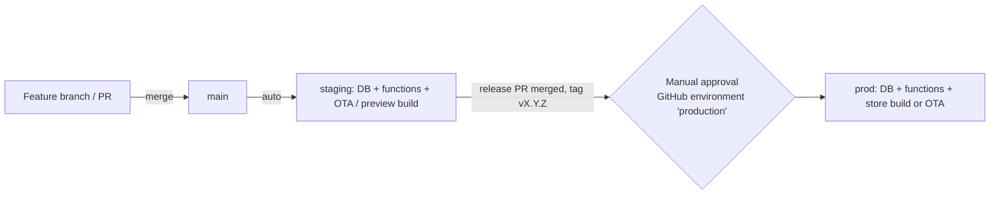

# 19 · Deployment Architecture

> **Status:** Draft for implementation (v1 / MVP) · **Owner:** Platform · **Deliverable:** 14. Deployment Architecture
>
> **Related:** `00-foundations.md` (identifiers, projects), `04-system-architecture.md` (containers, regions, cost model), `06-api-specification.md` (function auth, internal routes), `10-supabase-structure.md` (repo layout of `supabase/`), `11-authentication.md` (OAuth and OTP config), `16-security-architecture.md` (secrets policy, incident response), `17-subscription-architecture.md` (store products), `20-ci-cd-pipeline.md` (automation of everything below), `21-testing-strategy.md`.

## Table of contents

1. [Environments](#1-environments)
2. [App configuration and variants](#2-app-configuration-and-variants)
3. [EAS Build profiles and eas.json](#3-eas-build-profiles-and-easjson)
4. [EAS Update channels and runtime versioning](#4-eas-update-channels-and-runtime-versioning)
5. [App store release trains](#5-app-store-release-trains)
6. [Supabase project per environment](#6-supabase-project-per-environment)
7. [Edge Function deployment](#7-edge-function-deployment)
8. [Secrets](#8-secrets)
9. [DNS, universal links and app links](#9-dns-universal-links-and-app-links)
10. [Backups and disaster recovery](#10-backups-and-disaster-recovery)
11. [Feature flags](#11-feature-flags)
12. [Rollout playbooks](#12-rollout-playbooks)
13. [Rollback playbooks](#13-rollback-playbooks)
14. [Cost and scaling](#14-cost-and-scaling)
15. [Additions beyond 00-foundations](#15-additions-beyond-00-foundations)

---

## 1. Environments

| Env | Purpose | Supabase project | Region | Mobile variant | EAS channel | OneSignal app | Sentry environment | Data |
|---|---|---|---|---|---|---|---|---|
| `local` | Engineer and agent workstations, CI | `supabase start` (Docker) | n/a | `development` build pointing at LAN IP | none | `Thuluth Dev` | `local` (disabled by default) | Seed fixtures (`supabase/seed.sql` + `scripts/seed/*`) |
| `dev` | Shared integration, feature branches, preview OTA updates | `thuluth-dev` | `eu-central-1` | `development` | `development`, `pr-*` branches | `Thuluth Dev` | `dev` | Synthetic only, reset at will |
| `staging` | Release candidates, internal testers, QA, Maestro E2E | `thuluth-staging` | `eu-central-1` | `preview` | `staging` | `Thuluth Dev` | `staging` | Synthetic + anonymised catalog; never production user data |
| `prod` | Public users | `thuluth-prod` | `eu-central-1` | `production` | `production` | `Thuluth Prod` | `production` | Real user data |

Rules:
- Production user data never leaves `thuluth-prod` (no prod-to-staging copies). Catalog and knowledge data (ingredients, recipes, Islamic sources, price books) flows **upward** from seed files in git through every environment.
- Every environment runs the same migrations and the same function code; differences are only configuration and secrets.
- AI providers: dev and staging use separate API keys with low monthly spend caps ($100 dev, $300 staging) configured in each provider console.
- RevenueCat: one RevenueCat project with sandbox purchases for dev/staging builds and production purchases for production builds; the webhook for each environment points to its own Supabase project and ignores the other environment's events (see `06-api-specification.md` section 5.2). Two webhooks are configured in RevenueCat, one per backend, using the integration's environment filter.



## 2. App configuration and variants

One `app.config.ts` produces three variants from `APP_VARIANT`. Native identifiers differ per variant so all three can be installed side by side.

```ts
// apps/mobile/app.config.ts
import type { ExpoConfig, ConfigContext } from 'expo/config';

type Variant = 'development' | 'preview' | 'production';
const VARIANT = (process.env.APP_VARIANT ?? 'development') as Variant;

const byVariant = {
  development: { name: 'Thuluth Dev', id: 'app.thuluth.mobile.dev', scheme: 'thuluth-dev', domain: 'dev.thuluth.app', icon: './assets/icon-dev.png' },
  preview:     { name: 'Thuluth Beta', id: 'app.thuluth.mobile.preview', scheme: 'thuluth-preview', domain: 'staging.thuluth.app', icon: './assets/icon-preview.png' },
  production:  { name: 'Thuluth', id: 'app.thuluth.mobile', scheme: 'thuluth', domain: 'thuluth.app', icon: './assets/icon.png' },
}[VARIANT];

export default ({ config }: ConfigContext): ExpoConfig => ({
  ...config,
  name: byVariant.name,
  slug: 'thuluth',
  scheme: byVariant.scheme,
  version: process.env.APP_VERSION ?? '1.0.0',          // marketing version, from apps/mobile/package.json via changesets
  orientation: 'portrait',
  icon: byVariant.icon,
  userInterfaceStyle: 'automatic',
  newArchEnabled: true,
  runtimeVersion: { policy: 'fingerprint' },
  updates: {
    url: `https://u.expo.dev/${process.env.EAS_PROJECT_ID}`,
    checkAutomatically: 'ON_LOAD',
    fallbackToCacheTimeout: 0,                          // never block launch on an update download
  },
  ios: {
    bundleIdentifier: byVariant.id,
    supportsTablet: false,
    associatedDomains: [`applinks:${byVariant.domain}`, `webcredentials:${byVariant.domain}`],
    usesAppleSignIn: true,
    infoPlist: {
      NSCameraUsageDescription: 'Take photos of meals to estimate nutrition.',
      NSPhotoLibraryUsageDescription: 'Choose meal photos to analyse.',
      NSMicrophoneUsageDescription: 'Record voice questions for your nutrition companion.',
      ITSAppUsesNonExemptEncryption: false,
    },
  },
  android: {
    package: byVariant.id,
    adaptiveIcon: { foregroundImage: './assets/adaptive-icon.png', backgroundColor: '#0F5132' },
    intentFilters: [{
      action: 'VIEW',
      autoVerify: true,
      data: [{ scheme: 'https', host: byVariant.domain, pathPrefix: '/invite' }, { scheme: 'https', host: byVariant.domain, pathPrefix: '/plan' }, { scheme: 'https', host: byVariant.domain, pathPrefix: '/r' }],
      category: ['BROWSABLE', 'DEFAULT'],
    }],
    permissions: ['CAMERA', 'RECORD_AUDIO', 'POST_NOTIFICATIONS'],
  },
  plugins: [
    'expo-localization',
    'expo-apple-authentication',
    ['@sentry/react-native/expo', { organization: process.env.SENTRY_ORG, project: 'thuluth-mobile' }],
    ['onesignal-expo-plugin', { mode: VARIANT === 'production' ? 'production' : 'development' }],
    ['expo-build-properties', { android: { minSdkVersion: 24 }, ios: { deploymentTarget: '15.1' } }],
    'react-native-mmkv',
  ],
  extra: {
    appVariant: VARIANT,
    supabaseUrl: process.env.EXPO_PUBLIC_SUPABASE_URL,
    supabasePublishableKey: process.env.EXPO_PUBLIC_SUPABASE_PUBLISHABLE_KEY,
    oneSignalAppId: process.env.EXPO_PUBLIC_ONESIGNAL_APP_ID,
    revenueCatIosKey: process.env.EXPO_PUBLIC_REVENUECAT_IOS_KEY,
    revenueCatAndroidKey: process.env.EXPO_PUBLIC_REVENUECAT_ANDROID_KEY,
    sentryDsn: process.env.EXPO_PUBLIC_SENTRY_DSN,
    eas: { projectId: process.env.EAS_PROJECT_ID },
  },
});
```

Only public values (`EXPO_PUBLIC_*`, publishable keys, DSNs) reach the bundle. No secret key, AI key or webhook secret is ever an app environment variable (enforced by a CI grep, see `20-ci-cd-pipeline.md`).

Minimum OS: iOS 15.1, Android 7.0 (API 24). These cover the long tail of mid-range Android phones common in Pakistan; revisit at each Expo SDK upgrade.

## 3. EAS Build profiles and eas.json

```json
{
  "cli": {
    "version": ">= 16.0.0",
    "appVersionSource": "remote",
    "promptToConfigurePushNotifications": false
  },
  "build": {
    "base": {
      "node": "22.11.0",
      "pnpm": "9.12.0",
      "env": {
        "EAS_PROJECT_ID": "00000000-0000-0000-0000-000000000000",
        "SENTRY_ORG": "thuluth"
      },
      "android": { "image": "latest" },
      "ios": { "image": "latest", "resourceClass": "m-medium" }
    },
    "development": {
      "extends": "base",
      "developmentClient": true,
      "distribution": "internal",
      "channel": "development",
      "environment": "development",
      "env": { "APP_VARIANT": "development" },
      "android": { "buildType": "apk" }
    },
    "development-simulator": {
      "extends": "development",
      "ios": { "simulator": true }
    },
    "preview": {
      "extends": "base",
      "distribution": "internal",
      "channel": "staging",
      "environment": "preview",
      "env": { "APP_VARIANT": "preview" },
      "android": { "buildType": "apk" }
    },
    "e2e": {
      "extends": "preview",
      "withoutCredentials": true,
      "ios": { "simulator": true },
      "android": { "buildType": "apk" },
      "env": { "APP_VARIANT": "preview", "EXPO_PUBLIC_E2E": "1" }
    },
    "staging-store": {
      "extends": "base",
      "distribution": "store",
      "channel": "staging",
      "environment": "preview",
      "autoIncrement": true,
      "env": { "APP_VARIANT": "preview" }
    },
    "production": {
      "extends": "base",
      "distribution": "store",
      "channel": "production",
      "environment": "production",
      "autoIncrement": true,
      "env": { "APP_VARIANT": "production" },
      "android": { "buildType": "app-bundle" }
    }
  },
  "submit": {
    "staging-store": {
      "ios": { "ascAppId": "PREVIEW_ASC_APP_ID", "appleTeamId": "APPLE_TEAM_ID" },
      "android": { "serviceAccountKeyPath": "./secrets/play-service-account.json", "track": "internal", "releaseStatus": "completed" }
    },
    "production": {
      "ios": { "ascAppId": "PROD_ASC_APP_ID", "appleTeamId": "APPLE_TEAM_ID" },
      "android": { "serviceAccountKeyPath": "./secrets/play-service-account.json", "track": "production", "releaseStatus": "draft" }
    }
  }
}
```

Profile usage:

| Profile | Who | Backend | Distribution | Trigger |
|---|---|---|---|---|
| `development` | Engineers and agents on physical devices | dev | Internal (ad hoc / APK) | Manual, when native deps change |
| `development-simulator` | iOS simulator work, agents in CI with simulators | dev | Simulator | Manual |
| `preview` | Product owner, QA, family beta testers | staging | Internal (ad hoc / APK) | `main` when fingerprint changes |
| `e2e` | Maestro flows | staging | Simulator / emulator artifacts | `main` nightly and release branches |
| `staging-store` | TestFlight internal and Play internal testing | staging | Store (beta apps `app.thuluth.mobile.preview`) | Optional, for testers who prefer TestFlight |
| `production` | Public | prod | Store | Release tag when fingerprint changed |

`environment` maps to EAS environment variables (`eas env:create --environment production ...`) so `EXPO_PUBLIC_SUPABASE_URL`, keys and DSNs are managed in EAS, not in the repo. `secrets/play-service-account.json` is written at job time from a GitHub secret and is in `.gitignore`.

Build numbers: `appVersionSource: remote` with `autoIncrement` lets EAS own `buildNumber` / `versionCode`; the marketing version comes from `apps/mobile/package.json` (changesets, see `20-ci-cd-pipeline.md`).

## 4. EAS Update channels and runtime versioning

### 4.1 Channels and branches

| Channel (in binary) | Default branch | Who publishes | Notes |
|---|---|---|---|
| `development` | `development` | Engineers, PR workflow publishes `pr-{number}` branches that testers load via the dev client's update picker | Never used by store builds |
| `staging` | `staging` | `main` workflow | Internal testers receive every merge |
| `production` | `production` | Release workflow after approval | Progressive rollout (12.2) |

Channel to branch mapping is set once (`eas channel:create production`, `eas channel:edit production --branch production`); rollouts use EAS update rollout percentages on the `production` branch.

### 4.2 Runtime version policy

- `runtimeVersion: { policy: 'fingerprint' }`. The fingerprint hashes native-relevant inputs (native dependencies, config plugins, `app.config.ts` native fields, Expo SDK). An OTA update is only delivered to binaries with the same fingerprint, so a JS bundle that expects a native module the binary lacks can never be installed.
- CI computes the fingerprint on every PR (`npx expo-updates fingerprint:generate --platform ios` and `android`) and labels the PR `native-change` if it differs from the latest production build's fingerprint (stored as an EAS build artifact and looked up with `eas build:list --json`). A `native-change` PR implies the next release needs a store build.
- **What may ship by OTA**: JS and asset changes, copy and translation fixes, UI changes, bug fixes, new screens that use only existing native modules, contract-compatible API usage.
- **What must ship by store build**: new or upgraded native modules, config plugin changes, permission strings, Expo SDK upgrades, app icon or splash changes, anything needing store review disclosure (new data collection, new purchase products).
- **Policy limits**: OTA updates must not change a feature's purpose or add paid features in a way that would require store review (App Store guideline 3.3.1 / 2.5.2 interpretation and Google Play policy on dynamic code). Paywall content changes are allowed; new IAP products require a store build.
- **Update hygiene**: every update message is `vX.Y.Z+ota.N: summary`; the Sentry release tag `eas_update_id` is set in `Sentry.init` from `Updates.updateId` so crashes are attributable to an update group.
- **Critical updates**: the app checks `Updates.checkForUpdateAsync()` on launch and on foreground after 4 h; when the config flag `app.critical_update` (value `{ "update_group_ids": [...] }`) lists an update group newer than the running one, the app downloads it and reloads (`Updates.reloadAsync()`) once the user is idle on a non-input screen.

### 4.3 Version support window

- `feature_flags['app.min_supported_version']` (rules `{ "ios": "1.2.0", "android": "1.2.0" }`) is checked at launch and by Edge Functions (`UPGRADE_REQUIRED`).
- Support window: the two latest minor versions on each platform. Raising the minimum requires that the newer version has been at 100 percent in stores for 14 days.

## 5. App store release trains

| Item | Policy |
|---|---|
| Cadence | Store release every 2 weeks at sprint end (aligned with `24-sprint-plan.md`), cut Thursday, submitted Thursday evening PKT, phased release starting Monday. OTA patches any day except Friday after 12:00 PKT and the Ramadan iftar window (17:00 to 20:00 PKT). |
| Versioning | Semver marketing version. Minor per sprint (`1.3.0`), patch for hotfix store builds (`1.3.1`), OTA patches do not change the marketing version. |
| Release branch | None by default (trunk-based). A `release/X.Y` branch is cut only if a hotfix must ship while `main` contains unreleasable work. |
| iOS | TestFlight internal group "Core" (automatic), external group "Family beta" (up to 200 testers, Pakistan, UK) for 2 to 3 days, then App Store phased release over 7 days. "Release automatically after approval: No" (manual release by the product owner). |
| Android | Internal testing track (automatic) → closed testing "Family beta" → production staged rollout 10 percent → 25 → 50 → 100 over 5 to 7 days. |
| Store review buffers | Submit at least 3 working days before any date-bound feature (Ramadan planner must be in stores 3 weeks before the expected start of Ramadan). |
| Ramadan freeze | No store releases from 7 days before the expected start of Ramadan until Eid al-Fitr + 3 days, except hotfixes. OTA fixes allowed outside the iftar window. |
| Store metadata | Managed with EAS metadata (`store.config.json`) for iOS; Play listing managed in Play Console. Localized for `en` and `ur`. |
| Privacy declarations | App Store privacy nutrition label and Play Data safety form maintained in `docs/compliance/` (owned by `16-security-architecture.md`); any new data type requires updating both before release. |

Release checklist (automated where possible, see `20-ci-cd-pipeline.md`):
1. Release PR (changesets) merged; tag `vX.Y.Z` created.
2. Production DB migrations and functions deployed and smoke tests green.
3. Store build (if `native-change`) or OTA (otherwise) produced.
4. Sentry release created, source maps uploaded, commits associated.
5. Product owner approves the GitHub `production` environment, then releases in stores.
6. Watch crash-free sessions and error rates for 24 h before advancing rollout.

## 6. Supabase project per environment

| Setting | dev | staging | prod |
|---|---|---|---|
| Project | `thuluth-dev` | `thuluth-staging` | `thuluth-prod` |
| Plan | Pro org (shared) | Pro org | Pro org |
| Compute | Micro | Small | Large at launch, XL by 50 k MAU |
| Custom domain | none | `api.staging.thuluth.app` | `api.thuluth.app` |
| PITR | off | off | on, 7 days |
| Daily backups | yes (plan default) | yes | yes |
| Auth providers | Email OTP, Google, Apple (dev client ids) | same with staging ids | prod ids |
| Auth redirect URLs | `thuluth-dev://*`, `https://dev.thuluth.app/*` | `thuluth-preview://*`, `https://staging.thuluth.app/*` | `thuluth://*`, `https://thuluth.app/*` |
| SMTP | Postmark sandbox server | Postmark staging server | Postmark production server |
| Network restrictions | none | none | DB direct connections allowed only from CI runner egress and admin IPs; API through gateway |
| SSL enforcement | on | on | on |
| Spend cap | on | on | off (to avoid hard outages), with billing alerts |
| Log retention | plan default | plan default | plan default + Sentry |

Project bootstrap (once per environment, scripted in `scripts/infra/bootstrap-project.sh`):

```bash
supabase link --project-ref "$PROJECT_REF"
supabase db push                                   # all migrations
supabase secrets set --env-file ./.env.functions.$ENV   # from 1Password, never committed
supabase functions deploy                          # all functions
psql "$DB_URL" -f supabase/bootstrap/cron.sql      # pg_cron schedules (env-specific URLs)
psql "$DB_URL" -c "select vault.create_secret('$INTERNAL_CRON_SECRET', 'internal_cron_secret');"
pnpm seed:catalog --env "$ENV"                     # ingredients, recipes, sources, price books (idempotent upserts)
```

Migrations:
- Timestamped SQL in `supabase/migrations/`; generated with `supabase migration new <name>` or `supabase db diff -f <name>` from local changes.
- **Forward-only.** No down migrations in prod. Reverts are new migrations.
- **Expand and contract** for breaking schema changes: (1) add new column/table, deploy code that writes both, (2) backfill, (3) switch reads, (4) after the oldest supported app version no longer reads the old shape, drop it. Apps in the wild read PostgREST directly, so a column drop must wait for the support window (4.3).
- Long-running operations (index builds) use `create index concurrently` in their own migration file (no transaction) and are run outside peak hours.
- Seeds for catalog data live in `supabase/seed/catalog/*.sql` generated from `scripts/seed/` and are applied by a separate idempotent job, not as migrations.

## 7. Edge Function deployment

- Source: `supabase/functions/{name}/index.ts`, shared code in `supabase/functions/_shared/`, import map `supabase/functions/deno.json`.
- Config in `supabase/config.toml`:

```toml
[functions.ai-chat]
verify_jwt = false          # auth verified in code (_shared/auth.ts), see 04 ADR-0015
[functions.ai-intake-assess]
verify_jwt = false
[functions.ai-generate-plan]
verify_jwt = false
[functions.ai-adjust-plan]
verify_jwt = false
[functions.ai-analyze-meal]
verify_jwt = false
[functions.ai-transcribe]
verify_jwt = false
[functions.grocery-generate]
verify_jwt = false
[functions.growth-compute]
verify_jwt = false
[functions.ramadan-generate]
verify_jwt = false
[functions.export-pdf]
verify_jwt = false
[functions.household-invite]
verify_jwt = false
[functions.account-export]
verify_jwt = false
[functions.account-delete]
verify_jwt = false
[functions.revenuecat-webhook]
verify_jwt = false
[functions.notifications-dispatch]
verify_jwt = false
[functions.prices-refresh]
verify_jwt = false
[functions.analytics-rollup]
verify_jwt = false
```

- Deploy: `supabase functions deploy --project-ref $REF` deploys all functions atomically per function (each function is versioned by Supabase; there is no cross-function atomicity). Deploy order in pipelines: **migrations first, then functions, then app**. Functions must tolerate the previous schema version for one release (expand/contract).
- Each deploy injects `GIT_SHA` and `APP_ENV` via `supabase secrets set` before deployment; `_shared/sentry.ts` uses `GIT_SHA` as the release.
- `packages/ai-core` and `packages/shared` are imported from source via the import map; a CI check (`pnpm check:edge-imports`) ensures those packages contain no Node-only APIs.
- Smoke test after every deploy: `scripts/smoke/edge.ts` calls `growth-compute` with a fixed synthetic member in a synthetic household owned by a smoke-test user (exists in every environment), `ai-chat` with a fixed prompt on staging only, and checks `revenuecat-webhook` returns 401 without the secret.

## 8. Secrets

| Secret | Where stored | Consumed by | Rotation |
|---|---|---|---|
| Supabase secret API key (`sb_secret_...`) | Supabase (auto-injected into functions as `SUPABASE_SECRET_KEY` / legacy service role env) | Edge Functions | On suspicion; keys are revocable individually |
| `SUPABASE_ACCESS_TOKEN` (CLI) | GitHub environment secrets (`staging`, `production`) | CI deploys | 90 days |
| `SUPABASE_DB_PASSWORD` | GitHub environment secrets | CI `db push` | 90 days |
| `ANTHROPIC_API_KEY`, `OPENAI_API_KEY`, `GOOGLE_AI_API_KEY` | Supabase function secrets per env | `packages/ai-core` | 90 days, separate keys per env |
| `REVENUECAT_WEBHOOK_SECRET`, `REVENUECAT_SECRET_API_KEY` | Supabase function secrets | `revenuecat-webhook`, entitlement lazy sync, account delete | 180 days |
| `ONESIGNAL_APP_ID`, `ONESIGNAL_REST_API_KEY` | Supabase function secrets | `notifications-dispatch`, `account-delete` | 180 days |
| `POSTMARK_SERVER_TOKEN` | Supabase function secrets; SMTP credentials in Supabase Auth settings | `household-invite`, `account-export`, Auth | 180 days |
| `GOTENBERG_URL`, `GOTENBERG_TOKEN` | Supabase function secrets | `export-pdf` | 180 days |
| `INTERNAL_CRON_SECRET` | Supabase function secrets and Supabase Vault (`internal_cron_secret`) | Cron and worker auth | 90 days (dual-secret window, 8.1) |
| `LOG_SALT`, `SENTRY_SALT` | Supabase function secrets / EAS env (salt only) | Hashing ids in logs | Never rotated casually (breaks correlation) |
| `SENTRY_DSN` (edge), `EXPO_PUBLIC_SENTRY_DSN` | Function secrets / EAS env | Sentry | n/a (public-ish) |
| `SENTRY_AUTH_TOKEN` | GitHub secrets, EAS secret env | Source map upload | 180 days |
| `EXPO_TOKEN` | GitHub secrets | EAS CLI in CI | 180 days |
| Apple ASC API key, Play service account JSON | EAS credentials (iOS) / GitHub secret (Play JSON) | EAS Submit | Yearly |
| Google and Apple OAuth client secrets | Supabase Auth settings | Auth | Apple key yearly |
| Master copy of all secrets | 1Password vault "Thuluth Platform" | Humans only | n/a |

Rules:
- No secret in git, in `app.config.ts`, in EAS `env` blocks, or in logs. `gitleaks` runs in CI on every PR.
- Agents never receive production secrets; production deploy jobs run in GitHub's `production` environment with required reviewers.
- Function code reads secrets only through `_shared/env.ts`, which validates presence with Zod at cold start and fails fast.

### 8.1 Rotating `INTERNAL_CRON_SECRET` without downtime

1. Set `INTERNAL_CRON_SECRET_NEXT` in function secrets; `requireInternal` accepts either value.
2. Update the Vault secret used by pg_cron to the new value.
3. After 24 h, promote: set `INTERNAL_CRON_SECRET` to the new value and remove `_NEXT`.

## 9. DNS, universal links and app links

### 9.1 DNS (Cloudflare, zone `thuluth.app`)

| Record | Type | Target | Purpose |
|---|---|---|---|
| `thuluth.app` | CNAME (flattened) | Cloudflare Pages project `thuluth-web` | Marketing site, legal pages, `.well-known` files, invite landing page |
| `www` | CNAME | `thuluth.app` | Redirect to apex |
| `dev`, `staging` | CNAME | Pages preview deployments | Variant link domains |
| `api` | CNAME | Supabase custom domain target for `thuluth-prod` | API, Auth, Storage, Functions |
| `api.staging` | CNAME | Supabase custom domain target for `thuluth-staging` | |
| `mail` | CNAME / TXT | Postmark return-path and DKIM records | Transactional email |
| `@` | TXT | `v=spf1 include:spf.mtasv.net -all` | SPF |
| `_dmarc` | TXT | `v=DMARC1; p=quarantine; rua=mailto:dmarc@thuluth.app` | DMARC |
| `status` | CNAME | Status page provider | Public status page |

Supabase custom domains require the CNAME plus a TXT verification record; Auth OAuth callback URLs then use `https://api.thuluth.app/auth/v1/callback`, which must be registered with Google and Apple (see `11-authentication.md`). DNS records for `api` are not proxied through Cloudflare (DNS only), to keep WebSocket and SSE behaviour and Supabase's TLS management simple.

### 9.2 Universal links (iOS)

Served at `https://thuluth.app/.well-known/apple-app-site-association` with `Content-Type: application/json`, no redirect, no file extension.

```json
{
  "applinks": {
    "details": [
      {
        "appIDs": ["APPLETEAMID.app.thuluth.mobile"],
        "components": [
          { "/": "/invite/*", "comment": "Household invitation acceptance" },
          { "/": "/plan/*", "comment": "Open a shared meal plan inside the app" },
          { "/": "/r/*", "comment": "Recipe deep links" },
          { "/": "/legal/*", "exclude": true, "comment": "Legal pages open in the browser" }
        ]
      }
    ]
  },
  "webcredentials": {
    "apps": ["APPLETEAMID.app.thuluth.mobile"]
  }
}
```

`dev.thuluth.app` and `staging.thuluth.app` serve the same file with `app.thuluth.mobile.dev` and `app.thuluth.mobile.preview` respectively.

### 9.3 App links (Android)

Served at `https://thuluth.app/.well-known/assetlinks.json`:

```json
[
  {
    "relation": ["delegate_permission/common.handle_all_urls", "delegate_permission/common.get_login_creds"],
    "target": {
      "namespace": "android_app",
      "package_name": "app.thuluth.mobile",
      "sha256_cert_fingerprints": [
        "PLAY_APP_SIGNING_KEY_SHA256_FINGERPRINT",
        "EAS_UPLOAD_KEY_SHA256_FINGERPRINT"
      ]
    }
  }
]
```

The Play App Signing fingerprint comes from Play Console (App integrity); the upload key fingerprint from `eas credentials`. Both are listed so internal and production installs verify.

### 9.4 Deep link routing in the app

React Navigation `linking` config (in `apps/mobile/src/navigation/linking.ts`, see `07-react-native-folder-structure.md`):

| URL | Screen | Auth required |
|---|---|---|
| `https://thuluth.app/invite/{token}` (universal / app link only; `thuluth://invite` is ignored, S7-SEC-11) | `InviteAccept` | Yes (deferred: stored, then resumed after sign-in) |
| `thuluth://today?meal={daily_meal_id}` | `Today` with meal sheet | Yes |
| `https://thuluth.app/plan/{meal_plan_id}` | `PlanDetail` | Yes, and household membership |
| `https://thuluth.app/r/{recipe_id}` | `RecipeDetail` | No (catalog), prompts sign-in for actions |
| `thuluth://paywall?source={x}` | `Paywall` | Yes |

The invite landing page at `https://thuluth.app/invite/{token}` (for users without the app) shows store badges and passes the token through the store using a copy-to-clipboard fallback; no token is ever logged by the website.

## 10. Backups and disaster recovery

### 10.1 Objectives

| Scenario | RPO | RTO |
|---|---|---|
| Accidental data deletion or bad migration (prod DB) | ≤ 5 minutes (PITR) | ≤ 2 hours |
| Supabase regional outage | ≤ 24 hours (offsite logical dump) or ≤ 5 minutes if Supabase recovers the project | ≤ 8 hours to a new project in another EU region |
| Loss of Supabase account or organization | ≤ 24 hours | ≤ 24 hours |
| Storage object loss | ≤ 7 days for media (weekly sync), exports are regenerable | ≤ 24 hours |
| Edge Function bad deploy | n/a | ≤ 15 minutes (redeploy previous tag) |
| Mobile bad OTA | n/a | ≤ 15 minutes (republish previous update group) |

### 10.2 Backup layers

1. **Supabase daily backups** (plan default retention) and **PITR (7 days)** on prod.
2. **Nightly offsite logical dump** by GitHub Action `backup-nightly.yml` (`20-ci-cd-pipeline.md`): `supabase db dump --linked` for roles, schema and data (data dump uses `--data-only` with `--use-copy`), encrypted with `age` to a public key whose private key is held offline by the product owner, uploaded to a Google Cloud Storage bucket in `europe-west3` with object versioning, lifecycle 35 days, and bucket lock (retention policy) so backups cannot be deleted early.
3. **Weekly Storage sync** of private buckets via `rclone` (S3-compatible Supabase Storage endpoint) to the same GCS bucket under `storage/` with the same encryption at rest (CMEK) and retention.
4. **Git** holds schema, functions, seeds, catalog, prompts (`prompt_templates` seeds) and configuration, so everything except user data is reproducible.

### 10.3 Restore procedures

| Procedure | Steps |
|---|---|
| PITR restore (data corruption) | 1. Declare incident, enable maintenance flag `app.maintenance = true` (app shows maintenance screen, functions return `FEATURE_DISABLED`). 2. In Supabase dashboard, restore to timestamp just before the incident (restores in place, causes downtime proportional to size). 3. Re-run migrations newer than restore point if they were not the cause. 4. Disable maintenance. 5. Reconcile RevenueCat by replaying webhooks from the RevenueCat dashboard for the affected window. |
| Partial restore (one household's rows) | Restore PITR into a **new** project at the timestamp, export the affected rows with `copy (select ...)`, import into prod in a transaction, audit-log the action. |
| Region or account loss | 1. Create `thuluth-prod-dr` in `eu-west-1` (Ireland) or `eu-west-2` (London). 2. `supabase db push` migrations, then restore the latest offsite dump. 3. Deploy functions and secrets. 4. Repoint `api.thuluth.app` CNAME to the new project's custom domain (TTL 300 s). 5. Update RevenueCat webhook URL, Supabase Auth OAuth settings. 6. Restore storage from GCS. App binaries keep working because they use `api.thuluth.app`, which is why the custom domain is mandatory in prod. |

DR drills: quarterly PITR restore into a scratch project with a row-count and checksum comparison script (`scripts/dr/verify-restore.ts`); annual full region-loss drill on staging.

### 10.4 Incident response hooks

- Severity levels and contacts in `16-security-architecture.md`.
- Personal data breach: assessment within 24 h, supervisory authority notification within 72 h where GDPR / UK GDPR applies, user notification when high risk.
- Status page updated for any SEV1/SEV2.

## 11. Feature flags

Stored in `feature_flags` (`key`, `enabled`, `rules jsonb`). Read by the app via PostgREST (cached, refreshed on foreground and every 5 minutes) and by functions (60 s isolate cache). Evaluation logic is one shared function so app and server agree.

```ts
// packages/shared/src/flags/evaluate.ts
export interface FlagRules {
  platforms?: Array<'ios' | 'android'>;
  min_app_version?: string;               // semver
  countries?: string[];                    // ISO 3166-1 alpha-2, from households.country_code
  tiers?: Array<'free' | 'premium'>;
  percent?: number;                        // 0..100, sticky by user
  user_ids?: string[];                     // allowlist (testers)
  household_ids?: string[];
  value?: unknown;                         // for config flags (e.g. min_supported_version per platform)
}

export interface FlagContext { userId: string; householdId?: string; platform: 'ios' | 'android'; appVersion: string; country?: string; tier: 'free' | 'premium' }

export function isEnabled(flag: { key: string; enabled: boolean; rules: FlagRules | null }, ctx: FlagContext): boolean {
  if (!flag.enabled) return false;
  const r = flag.rules ?? {};
  if (r.user_ids?.includes(ctx.userId)) return true;
  if (ctx.householdId && r.household_ids?.includes(ctx.householdId)) return true;
  if (r.platforms && !r.platforms.includes(ctx.platform)) return false;
  if (r.min_app_version && semverLt(ctx.appVersion, r.min_app_version)) return false;
  if (r.countries && (!ctx.country || !r.countries.includes(ctx.country))) return false;
  if (r.tiers && !r.tiers.includes(ctx.tier)) return false;
  if (r.percent !== undefined) return bucket(`${flag.key}:${ctx.userId}`) < r.percent;   // murmurhash3 mod 100
  return true;
}
```

Initial flags:

| Key | Type | Default | Purpose |
|---|---|---|---|
| `app.min_supported_version` | config (`value: {ios, android}`) | `1.0.0` | Forced upgrade |
| `app.maintenance` | kill switch | off | Maintenance screen, functions return `FEATURE_DISABLED` |
| `ai.chat.enabled` | kill switch | on | Disable chat (curated content fallback) |
| `ai.vision.enabled` | kill switch | on | Disable photo analysis |
| `ai.voice.enabled` | kill switch | on | Disable voice input |
| `plan.generate.enabled` | kill switch | on | Disable AI plan generation (templates only) |
| `ramadan.planner.enabled` | release flag | off until 6 weeks before Ramadan | Show Ramadan planner |
| `exports.kinds` | config (`value: ['meal_plan','grocery_list']`) | MVP kinds | Enable more export kinds |
| `paywall.variant` | experiment (`percent`) | `a` | Paywall copy test |
| `catalog_version` | config (`value: integer`) | 1 | Busts client catalog caches after a seed release |
| `chat.free_route` | config | off | Switch free chat to `chat.free` route if enabled (see `04-system-architecture.md` 11.2) |
| `app.critical_update` | config (`value: {update_group_ids}`) | empty | Forces an immediate OTA reload for critical fixes (4.2) |

Flag lifecycle: release flags are removed within two releases of reaching 100 percent; kill switches are permanent; every flag has an owner and an expiry noted in the migration that creates it.

## 12. Rollout playbooks

### 12.1 Backend (DB + functions) release

1. Release workflow runs `supabase db push --dry-run` against prod and posts the plan to the job summary.
2. Approver reviews the migration list (destructive statements are flagged by `scripts/ci/migration-guard.ts`: `drop`, `alter ... type`, `rename`, non-concurrent index on large tables).
3. Apply migrations (`supabase db push`), deploy functions, run smoke tests.
4. Watch Sentry `thuluth-edge` error rate and p95 latency for 30 minutes.

### 12.2 OTA update rollout (no native change)

```bash
# Publish to production branch at 10 percent
eas update --branch production --environment production \
  --message "v1.3.0+ota.2: fix grocery total rounding" --rollout-percentage 10
# After 2 h with crash-free sessions >= baseline and no new Sentry issues:
eas update:edit --branch production --rollout-percentage 50
# After a further 12 h:
eas update:edit --branch production --rollout-percentage 100
```

Gates between steps: crash-free sessions for the update group within 0.2 points of the previous group; no new Sentry issue with more than 20 users; no spike in `QUOTA_EXCEEDED`/`INTERNAL` errors from the new update's `X-App-Version`.

### 12.3 Store binary rollout

| Day | iOS | Android |
|---|---|---|
| 0 | Submit for review (build already in TestFlight for 2+ days) | Promote from closed testing to production at 10 percent |
| 1 to 2 | Approved, manual release, phased release day 1 (1 percent) | 10 percent |
| 3 | Phased release continues (2 to 5 percent) | 25 percent |
| 4 | 10 percent | 50 percent |
| 5 to 7 | 20, 50, 100 percent | 100 percent |

Pause criteria: crash-free sessions below 99.3 percent, a SEV2 issue, or store review rejection. iOS phased release can be paused for up to 30 days; Android staged rollout can be halted.

### 12.4 Feature rollout via flags

Internal testers (`user_ids`) → 5 percent → 25 percent → 100 percent, with each step lasting at least 48 h and gated on the feature's analytics events and Sentry issues.

## 13. Rollback playbooks

| What broke | Rollback action | Time |
|---|---|---|
| OTA update | `eas update:republish --group {previous_group_id} --branch production` (republishes the last good update as the newest); or `eas update:edit --rollout-percentage 0` while rolled out partially | Minutes; users get it on next launch |
| OTA update causes crash on launch | expo-updates automatically falls back to the embedded or previous update after a failed launch; still republish the previous group to stop new downloads | Minutes |
| Store binary | iOS: pause phased release; submit hotfix build (expedited review request). Android: halt staged rollout, then roll forward with a higher `versionCode` (Play cannot roll back). Meanwhile ship an OTA fix if the bug is in JS. | Hours to 1 to 2 days |
| Edge Functions | Re-run release workflow `deploy-functions` job on the previous tag (`workflow_dispatch` with `ref: vX.Y.Z-1`) | 5 to 15 minutes |
| Migration (non-destructive) | New forward migration reverting the change, deployed through the normal pipeline (hotfix PR with expedited review) | 30 to 60 minutes |
| Migration (destructive data loss) | PITR restore (10.3) | 1 to 2 hours |
| AI model regression | Change `ai_model_routes` (disable new row, re-enable previous) or roll back `prompt_templates.is_active` to the previous version via SQL in a migration or admin script; no deploy needed | Minutes |
| Bad feature | Flip feature flag or kill switch | Seconds to 5 minutes (cache) |

Each rollback is followed by a blameless incident note in `docs/incidents/YYYY-MM-DD-title.md` within 5 working days.

## 14. Cost and scaling

Monthly cost model and capacity estimates are in `04-system-architecture.md` sections 10 and 11. Deployment-specific notes:

| Lever | When | Action |
|---|---|---|
| Prod compute | CPU > 70 percent sustained at evening peak, or > 60 percent two weeks before Ramadan | Upgrade one size (Large → XL → 2XL) in a low-traffic window (03:00 to 05:00 PKT); compute changes restart the database for a few minutes |
| Disk | > 70 percent | Supabase disk autoscaling is on; review `analytics_events` partition detachment |
| Read replica | Analytics refresh or catalog search > 20 percent of primary CPU | Add replica in same region; point `analytics-rollup` at it |
| Staging and dev | Always | Keep on Micro/Small; pause dev project compute when idle is not supported on paid compute, so keep it minimal |
| EAS | Build minutes | Builds only when fingerprint changes; OTA otherwise; `e2e` builds nightly instead of per merge |
| Sentry | Volume | Performance sampling 10 percent in prod, 100 percent in staging; replay disabled (privacy) |
| Gotenberg | Idle | Cloud Run min instances 0, max 5, concurrency 4; cold start about 3 s is acceptable for exports |
| AI | Spend | Per-env provider spend caps; production cost controls in `04-system-architecture.md` 11.2 |

Ramadan readiness checklist (start 6 weeks before the expected start of Ramadan): upgrade prod compute one size for the month; load test iftar traffic on staging at 10x normal peak (k6 script `scripts/load/iftar.js`); pre-warm `prayer_times_cache` for all supported cities for the whole month; confirm AI provider rate limits and request increases; enable `ramadan.planner.enabled` for testers, then all users 3 weeks before.

## 15. Additions beyond 00-foundations

| Addition | Purpose |
|---|---|
| Variant identifiers `app.thuluth.mobile.dev`, `app.thuluth.mobile.preview`, schemes `thuluth-dev`, `thuluth-preview`, link domains `dev.thuluth.app`, `staging.thuluth.app` | Side-by-side installs per environment |
| Custom domains `api.thuluth.app`, `api.staging.thuluth.app` | Stable API host for DR and branded OAuth callbacks |
| Feature flag keys listed in section 11 | Kill switches and config |
| GCS offsite backup bucket and `backup-nightly` workflow | DR beyond Supabase |
| Gotenberg Cloud Run service | PDF rendering (see `04-system-architecture.md`) |
| Postmark | Email provider |
