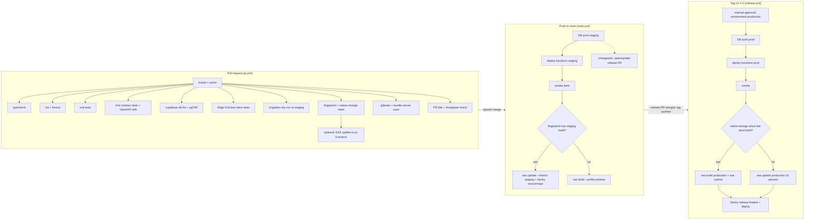

# 20 · CI/CD Pipeline

> **Status:** Draft for implementation (v1 / MVP) · **Owner:** Platform · **Deliverable:** 15. CI/CD Pipeline
>
> **Related:** `00-foundations.md` (monorepo, projects), `04-system-architecture.md`, `06-api-specification.md` (contracts, OpenAPI generation), `07-react-native-folder-structure.md`, `10-supabase-structure.md`, `19-deployment-architecture.md` (environments, EAS profiles, secrets, rollout and rollback), `21-testing-strategy.md` (what each test layer covers), `24-sprint-plan.md` (release cadence).

## Table of contents

1. [Pipeline overview](#1-pipeline-overview)
2. [Repository conventions](#2-repository-conventions)
3. [Shared setup action](#3-shared-setup-action)
4. [PR checks workflow](#4-pr-checks-workflow)
5. [Main branch workflow (staging)](#5-main-branch-workflow-staging)
6. [Versioning workflow (changesets)](#6-versioning-workflow-changesets)
7. [Release workflow (production)](#7-release-workflow-production)
8. [Maestro E2E](#8-maestro-e2e)
9. [Nightly jobs](#9-nightly-jobs)
10. [Branch protection and required checks](#10-branch-protection-and-required-checks)
11. [Secret handling in CI](#11-secret-handling-in-ci)
12. [Sentry releases and source maps](#12-sentry-releases-and-source-maps)
13. [Rollback via the pipeline](#13-rollback-via-the-pipeline)
14. [Supporting scripts](#14-supporting-scripts)
15. [Additions beyond 00-foundations](#15-additions-beyond-00-foundations)

---

## 1. Pipeline overview



Principles:
- **Trunk-based**: short-lived branches, squash merges into `main`, `main` is always deployable to staging.
- **Same artifacts promote**: functions and migrations deployed to prod are the exact commit that ran on staging (the tag points at a `main` commit that already passed the main workflow).
- **Agents and humans use the same gates**. Agentic engineers open PRs like any contributor; no bypass permissions.
- **Production requires a human**: the GitHub `production` environment has the product owner as required reviewer.

## 2. Repository conventions

### 2.1 Layout relevant to CI

```text
.github/
  actions/setup/action.yml          # composite: pnpm, node, cache, install
  workflows/pr.yml
  workflows/main.yml
  workflows/version.yml
  workflows/release.yml
  workflows/e2e-nightly.yml
  workflows/backup-nightly.yml
  workflows/rollback.yml
  CODEOWNERS
  pull_request_template.md
.eas/workflows/e2e.yml              # EAS Workflows: build + Maestro
.changeset/config.json
apps/mobile/                        # Expo app (package @thuluth/mobile, private)
apps/mobile/.maestro/               # Maestro flows
packages/shared/                    # contracts, enums, flags (package @thuluth/shared)
packages/ai-core/                   # AI gateway (package @thuluth/ai-core)
supabase/                           # migrations, functions, tests, config.toml
scripts/ci/                         # CI helper scripts (section 14)
turbo.json
pnpm-workspace.yaml
```

### 2.2 Conventional commits

PR titles (which become squash commit messages) follow Conventional Commits, validated in CI:

| Type | Use | Changeset needed |
|---|---|---|
| `feat` | User-visible feature | Yes |
| `fix` | Bug fix | Yes |
| `perf` | Performance | Yes |
| `refactor`, `chore`, `test`, `docs`, `ci`, `build`, `style` | No user-visible change | No (add `.changeset` empty file if needed: `pnpm changeset --empty`) |
| `revert` | Revert | Yes if reverting a released change |

Scopes: `mobile`, `shared`, `ai`, `db`, `edge`, `ci`, `deps`, `i18n`, `docs`, or a feature name (`chat`, `plan`, `grocery`, `growth`, `ramadan`, `subscription`). Breaking contract changes use `!` (`feat(edge)!: ...`) and require a note on the `X-Api-Version` strategy (`06-api-specification.md` section 2.6).

### 2.3 Turborepo tasks

```json
{
  "$schema": "https://turbo.build/schema.json",
  "tasks": {
    "typecheck": { "dependsOn": ["^typecheck"], "outputs": [] },
    "lint": { "outputs": [] },
    "test": { "dependsOn": ["^build"], "outputs": ["coverage/**"] },
    "test:contracts": { "outputs": [] },
    "build": { "dependsOn": ["^build"], "outputs": ["dist/**"] },
    "openapi:generate": { "outputs": ["openapi/**"] }
  }
}
```

## 3. Shared setup action

```yaml
# .github/actions/setup/action.yml
name: Setup
description: Checkout-independent setup of pnpm, Node and dependencies with caching
inputs:
  install:
    description: Run pnpm install
    default: 'true'
runs:
  using: composite
  steps:
    - uses: pnpm/action-setup@v4
      with:
        version: 9.12.0
    - uses: actions/setup-node@v4
      with:
        node-version: 22.11.0
        cache: pnpm
    - name: Cache Turborepo
      uses: actions/cache@v4
      with:
        path: .turbo
        key: turbo-${{ runner.os }}-${{ github.job }}-${{ github.sha }}
        restore-keys: |
          turbo-${{ runner.os }}-${{ github.job }}-
    - name: Install
      if: inputs.install == 'true'
      shell: bash
      run: pnpm install --frozen-lockfile
```

## 4. PR checks workflow

```yaml
# .github/workflows/pr.yml
name: PR checks

on:
  pull_request:
    branches: [main, 'release/**']
    types: [opened, synchronize, reopened, edited, labeled, unlabeled]

concurrency:
  group: pr-${{ github.event.pull_request.number }}
  cancel-in-progress: true

permissions:
  contents: read
  pull-requests: write

env:
  TURBO_TELEMETRY_DISABLED: 1
  SUPABASE_CLI_VERSION: 2.48.3

jobs:
  pr-title:
    name: PR title (conventional commits)
    runs-on: ubuntu-latest
    steps:
      - uses: amannn/action-semantic-pull-request@v5
        env:
          GITHUB_TOKEN: ${{ secrets.GITHUB_TOKEN }}
        with:
          types: |
            feat
            fix
            perf
            refactor
            chore
            test
            docs
            ci
            build
            style
            revert
          requireScope: false

  changeset:
    name: Changeset present
    runs-on: ubuntu-latest
    if: ${{ !contains(github.event.pull_request.labels.*.name, 'skip-changeset') }}
    steps:
      - uses: actions/checkout@v4
        with: { fetch-depth: 0 }
      - uses: ./.github/actions/setup
      - name: Require changeset for feat/fix/perf
        run: node scripts/ci/require-changeset.mjs "${{ github.event.pull_request.title }}" origin/${{ github.base_ref }}

  typecheck:
    name: Typecheck
    runs-on: ubuntu-latest
    steps:
      - uses: actions/checkout@v4
      - uses: ./.github/actions/setup
      - run: pnpm turbo run typecheck

  lint:
    name: Lint and format
    runs-on: ubuntu-latest
    steps:
      - uses: actions/checkout@v4
      - uses: ./.github/actions/setup
      - run: pnpm turbo run lint
      - run: pnpm prettier --check .
      - name: i18n keys in sync (en, ur)
        run: pnpm --filter @thuluth/mobile i18n:check

  unit:
    name: Unit tests
    runs-on: ubuntu-latest
    steps:
      - uses: actions/checkout@v4
      - uses: ./.github/actions/setup
      - run: pnpm turbo run test -- --coverage
      - uses: actions/upload-artifact@v4
        if: always()
        with:
          name: coverage
          path: '**/coverage/lcov.info'
          retention-days: 7

  contracts:
    name: Zod contract tests + OpenAPI drift
    runs-on: ubuntu-latest
    steps:
      - uses: actions/checkout@v4
      - uses: ./.github/actions/setup
      - run: pnpm --filter @thuluth/shared test:contracts
      - name: OpenAPI is regenerated and committed
        run: |
          pnpm --filter @thuluth/shared openapi:generate
          git diff --exit-code -- packages/shared/openapi/ || (echo "::error::Run pnpm --filter @thuluth/shared openapi:generate and commit" && exit 1)

  db:
    name: Supabase db lint + pgTAP
    runs-on: ubuntu-latest
    timeout-minutes: 20
    steps:
      - uses: actions/checkout@v4
      - uses: ./.github/actions/setup
      - uses: supabase/setup-cli@v1
        with:
          version: ${{ env.SUPABASE_CLI_VERSION }}
      - name: Start database only
        run: supabase db start
      - name: Apply migrations and seed from scratch
        run: supabase db reset
      - name: Lint schema (plpgsql_check)
        run: supabase db lint --level warning --fail-on error
      - name: pgTAP tests (RLS, triggers, RPCs)
        run: supabase test db
      - name: Generated types are up to date
        run: |
          supabase gen types typescript --local > packages/shared/src/db/database.types.ts
          git diff --exit-code -- packages/shared/src/db/database.types.ts || (echo "::error::Regenerate DB types" && exit 1)
      - name: Migration guard (destructive statements)
        run: node scripts/ci/migration-guard.mjs origin/${{ github.base_ref }}

  edge:
    name: Edge Function deno tests
    runs-on: ubuntu-latest
    timeout-minutes: 25
    steps:
      - uses: actions/checkout@v4
      - uses: ./.github/actions/setup
      - uses: denoland/setup-deno@v2
        with:
          deno-version: v2.x
      - uses: supabase/setup-cli@v1
        with:
          version: ${{ env.SUPABASE_CLI_VERSION }}
      - name: Deno fmt, lint, check
        working-directory: supabase/functions
        run: |
          deno fmt --check
          deno lint
          deno check **/index.ts
      - name: Edge imports are Deno-safe
        run: pnpm check:edge-imports
      - name: Start local stack (no studio)
        run: supabase start -x studio,imgproxy,logflare,vector
      - name: Serve functions with test env
        run: |
          supabase functions serve --env-file supabase/functions/.env.test > /tmp/functions.log 2>&1 &
          npx wait-on -t 60000 tcp:127.0.0.1:54321
      - name: Unit and integration tests (AI providers mocked)
        working-directory: supabase/functions
        env:
          SUPABASE_URL: http://127.0.0.1:54321
          AI_PROVIDER_MODE: mock
        run: deno test --allow-env --allow-net=127.0.0.1,localhost --allow-read --coverage=cov/
      - name: Function logs on failure
        if: failure()
        run: cat /tmp/functions.log

  migration-dry-run:
    name: Migration dry run (staging)
    runs-on: ubuntu-latest
    if: ${{ github.event.pull_request.head.repo.full_name == github.repository }}
    environment: staging-readonly
    steps:
      - uses: actions/checkout@v4
      - uses: supabase/setup-cli@v1
        with:
          version: ${{ env.SUPABASE_CLI_VERSION }}
      - name: Link and dry run
        env:
          SUPABASE_ACCESS_TOKEN: ${{ secrets.SUPABASE_ACCESS_TOKEN }}
          SUPABASE_DB_PASSWORD: ${{ secrets.SUPABASE_DB_PASSWORD }}
        run: |
          supabase link --project-ref "${{ vars.SUPABASE_PROJECT_REF }}"
          supabase db push --dry-run | tee dry-run.txt
          {
            echo "### Staging migration dry run"
            echo '```'
            cat dry-run.txt
            echo '```'
          } >> "$GITHUB_STEP_SUMMARY"

  security:
    name: Secret scanning
    runs-on: ubuntu-latest
    steps:
      - uses: actions/checkout@v4
        with: { fetch-depth: 0 }
      - uses: gitleaks/gitleaks-action@v2
        env:
          GITHUB_TOKEN: ${{ secrets.GITHUB_TOKEN }}
      - name: No server secrets in the mobile app
        run: node scripts/ci/scan-app-secrets.mjs apps/mobile

  fingerprint:
    name: Native fingerprint
    runs-on: ubuntu-latest
    steps:
      - uses: actions/checkout@v4
      - uses: ./.github/actions/setup
      - uses: expo/expo-github-action@v8
        with:
          eas-version: latest
          token: ${{ secrets.EXPO_TOKEN }}
      - name: Compare runtime version with latest production builds
        id: fp
        working-directory: apps/mobile
        env:
          APP_VARIANT: production
        run: node ../../scripts/ci/fingerprint-diff.mjs --channel production >> "$GITHUB_OUTPUT"
      - name: Label native-change
        if: steps.fp.outputs.native_change == 'true'
        uses: actions-ecosystem/action-add-labels@v1
        with:
          labels: native-change
      - name: Remove label when JS-only
        if: steps.fp.outputs.native_change == 'false'
        uses: actions-ecosystem/action-remove-labels@v1
        with:
          labels: native-change

  preview-update:
    name: EAS update to pr branch (opt-in)
    runs-on: ubuntu-latest
    needs: [typecheck, fingerprint]
    if: ${{ contains(github.event.pull_request.labels.*.name, 'preview') && github.event.pull_request.head.repo.full_name == github.repository }}
    steps:
      - uses: actions/checkout@v4
      - uses: ./.github/actions/setup
      - uses: expo/expo-github-action@v8
        with:
          eas-version: latest
          token: ${{ secrets.EXPO_TOKEN }}
      - name: Publish to pr-N branch (dev backend)
        working-directory: apps/mobile
        env:
          APP_VARIANT: development
        run: eas update --branch "pr-${{ github.event.pull_request.number }}" --environment development --message "${{ github.event.pull_request.title }}" --non-interactive
      - uses: marocchino/sticky-pull-request-comment@v2
        with:
          message: |
            Preview update published to branch `pr-${{ github.event.pull_request.number }}`.
            Open the Thuluth Dev client, then Extensions, then pick this branch.
```

Notes:
- `supabase db lint` uses `plpgsql_check` and reports issues in functions and triggers.
- `supabase test db` runs pgTAP files in `supabase/tests/*.sql`; the RLS isolation suite (two users, two households, every table) is mandatory and defined in `21-testing-strategy.md`.
- Edge tests run AI calls in `AI_PROVIDER_MODE=mock`, where `packages/ai-core` returns recorded fixtures from `supabase/functions/_shared/ai/fixtures/` keyed by prompt key and version. Live provider evals run nightly (section 9), never on PRs.
- `migration-dry-run` uses a read-only-intent environment `staging-readonly` that holds a CLI token; it runs `db push --dry-run` only. PRs from forks skip it (repository is private, so this is rare).

## 5. Main branch workflow (staging)

```yaml
# .github/workflows/main.yml
name: Main (deploy staging)

on:
  push:
    branches: [main]
  workflow_dispatch:

concurrency:
  group: deploy-staging
  cancel-in-progress: false

permissions:
  contents: read

env:
  SUPABASE_CLI_VERSION: 2.48.3

jobs:
  checks:
    name: Re-run fast checks on merge commit
    runs-on: ubuntu-latest
    steps:
      - uses: actions/checkout@v4
      - uses: ./.github/actions/setup
      - run: pnpm turbo run typecheck lint test

  deploy-backend:
    name: Deploy DB + functions to staging
    needs: checks
    runs-on: ubuntu-latest
    environment: staging
    steps:
      - uses: actions/checkout@v4
      - uses: ./.github/actions/setup
      - uses: supabase/setup-cli@v1
        with:
          version: ${{ env.SUPABASE_CLI_VERSION }}
      - name: Link
        env:
          SUPABASE_ACCESS_TOKEN: ${{ secrets.SUPABASE_ACCESS_TOKEN }}
          SUPABASE_DB_PASSWORD: ${{ secrets.SUPABASE_DB_PASSWORD }}
        run: supabase link --project-ref "${{ vars.SUPABASE_PROJECT_REF }}"
      - name: Push migrations
        env:
          SUPABASE_ACCESS_TOKEN: ${{ secrets.SUPABASE_ACCESS_TOKEN }}
          SUPABASE_DB_PASSWORD: ${{ secrets.SUPABASE_DB_PASSWORD }}
        run: supabase db push
      - name: Apply catalog seeds (idempotent upserts)
        env:
          DATABASE_URL: ${{ secrets.SUPABASE_DB_URL }}
        run: pnpm seed:catalog --env staging
      - name: Set release metadata secrets
        env:
          SUPABASE_ACCESS_TOKEN: ${{ secrets.SUPABASE_ACCESS_TOKEN }}
        run: supabase secrets set GIT_SHA=${{ github.sha }} APP_ENV=staging --project-ref "${{ vars.SUPABASE_PROJECT_REF }}"
      - name: Deploy all Edge Functions
        env:
          SUPABASE_ACCESS_TOKEN: ${{ secrets.SUPABASE_ACCESS_TOKEN }}
        run: supabase functions deploy --project-ref "${{ vars.SUPABASE_PROJECT_REF }}"
      - name: Sentry release for edge
        uses: getsentry/action-release@v1
        env:
          SENTRY_AUTH_TOKEN: ${{ secrets.SENTRY_AUTH_TOKEN }}
          SENTRY_ORG: ${{ vars.SENTRY_ORG }}
          SENTRY_PROJECT: thuluth-edge
        with:
          environment: staging
          version: ${{ github.sha }}
      - name: Smoke tests
        env:
          SMOKE_BASE_URL: ${{ vars.API_BASE_URL }}
          SMOKE_PUBLISHABLE_KEY: ${{ vars.SUPABASE_PUBLISHABLE_KEY }}
          SMOKE_USER_EMAIL: ${{ secrets.SMOKE_USER_EMAIL }}
          SMOKE_USER_PASSWORD: ${{ secrets.SMOKE_USER_PASSWORD }}
        run: pnpm smoke:edge --env staging --include-ai

  mobile:
    name: Mobile (OTA or preview build)
    needs: deploy-backend
    runs-on: ubuntu-latest
    environment: staging
    steps:
      - uses: actions/checkout@v4
      - uses: ./.github/actions/setup
      - uses: expo/expo-github-action@v8
        with:
          eas-version: latest
          token: ${{ secrets.EXPO_TOKEN }}
      - name: Is there a compatible staging build for this fingerprint?
        id: compat
        working-directory: apps/mobile
        env:
          APP_VARIANT: preview
        run: node ../../scripts/ci/fingerprint-diff.mjs --channel staging >> "$GITHUB_OUTPUT"
      - name: EAS update to staging channel
        if: steps.compat.outputs.native_change == 'false'
        working-directory: apps/mobile
        env:
          APP_VARIANT: preview
          SENTRY_AUTH_TOKEN: ${{ secrets.SENTRY_AUTH_TOKEN }}
          SENTRY_ORG: ${{ vars.SENTRY_ORG }}
          SENTRY_PROJECT: thuluth-mobile
        run: |
          eas update --branch staging --environment preview \
            --message "$(git log -1 --pretty=%s) (${GITHUB_SHA::7})" --non-interactive
          npx sentry-expo-upload-sourcemaps dist
      - name: EAS build preview (native change)
        if: steps.compat.outputs.native_change == 'true'
        working-directory: apps/mobile
        run: eas build --profile preview --platform all --non-interactive --no-wait --message "main ${GITHUB_SHA::7}"

  e2e:
    name: Maestro smoke on EAS
    needs: mobile
    runs-on: ubuntu-latest
    steps:
      - uses: actions/checkout@v4
      - uses: ./.github/actions/setup
      - uses: expo/expo-github-action@v8
        with:
          eas-version: latest
          token: ${{ secrets.EXPO_TOKEN }}
      - name: Trigger EAS workflow (android smoke)
        working-directory: apps/mobile
        run: eas workflow:run .eas/workflows/e2e.yml --non-interactive
```

Staging build distribution: EAS internal distribution links are posted by EAS to the team; testers with the `preview` build receive OTA updates on the `staging` channel automatically.

## 6. Versioning workflow (changesets)

```json
// .changeset/config.json
{
  "$schema": "https://unpkg.com/@changesets/config@3.0.0/schema.json",
  "changelog": ["@changesets/changelog-github", { "repo": "thuluth/qanun-al-thuluth" }],
  "commit": false,
  "fixed": [["@thuluth/mobile", "@thuluth/shared", "@thuluth/ai-core"]],
  "access": "restricted",
  "baseBranch": "main",
  "privatePackages": { "version": true, "tag": false },
  "updateInternalDependencies": "patch"
}
```

All three packages move together (`fixed`), so one version number describes the app, contracts and AI gateway. The mobile marketing version is `apps/mobile/package.json#version`, injected into `app.config.ts` as `APP_VERSION`.

```yaml
# .github/workflows/version.yml
name: Version (release PR and tag)

on:
  push:
    branches: [main]

concurrency:
  group: version
  cancel-in-progress: false

permissions:
  contents: write
  pull-requests: write

jobs:
  version:
    runs-on: ubuntu-latest
    steps:
      - name: Release bot token (so the tag push triggers release.yml)
        id: app-token
        uses: actions/create-github-app-token@v1
        with:
          app-id: ${{ vars.RELEASE_BOT_APP_ID }}
          private-key: ${{ secrets.RELEASE_BOT_PRIVATE_KEY }}
      - uses: actions/checkout@v4
        with:
          token: ${{ steps.app-token.outputs.token }}
          fetch-depth: 0
      - uses: ./.github/actions/setup
      - name: Create release PR or tag
        uses: changesets/action@v1
        with:
          title: 'chore(release): version packages'
          commit: 'chore(release): version packages'
          version: pnpm changeset version
          publish: node scripts/ci/tag-release.mjs
          createGithubReleases: false
        env:
          GITHUB_TOKEN: ${{ steps.app-token.outputs.token }}
```

`scripts/ci/tag-release.mjs` reads `apps/mobile/package.json#version`, and if tag `v{version}` does not exist, creates an annotated tag on `HEAD` and pushes it, then creates a GitHub Release with the aggregated changelog. Because the push uses the release bot's token (a GitHub App), it triggers `release.yml`; a push with the default `GITHUB_TOKEN` would not.

Hotfix: branch `release/X.Y` from the tag, PR the fix into it (same checks), add a patch changeset, merge; `version.yml` also runs on `release/**` (add the branch filter when first needed), producing `vX.Y.(Z+1)`. Cherry-pick the fix into `main`.

## 7. Release workflow (production)

```yaml
# .github/workflows/release.yml
name: Release (production)

on:
  push:
    tags: ['v*.*.*']
  workflow_dispatch:
    inputs:
      ref:
        description: Tag to (re)deploy
        required: true
      skip_mobile:
        description: Deploy backend only
        type: boolean
        default: false

concurrency:
  group: deploy-production
  cancel-in-progress: false

permissions:
  contents: read

env:
  SUPABASE_CLI_VERSION: 2.48.3
  REF: ${{ github.event.inputs.ref || github.ref_name }}

jobs:
  verify:
    name: Verify tag is on main and passed staging
    runs-on: ubuntu-latest
    steps:
      - uses: actions/checkout@v4
        with: { ref: '${{ env.REF }}', fetch-depth: 0 }
      - name: Tag commit is an ancestor of main or a release branch
        run: |
          git merge-base --is-ancestor HEAD origin/main || git branch -r --contains HEAD | grep -q 'origin/release/'
      - name: Staging workflow succeeded for this commit
        env:
          GH_TOKEN: ${{ secrets.GITHUB_TOKEN }}
        run: node scripts/ci/assert-staging-green.mjs "$(git rev-parse HEAD)"

  plan:
    name: Production migration plan
    needs: verify
    runs-on: ubuntu-latest
    environment: production-readonly
    steps:
      - uses: actions/checkout@v4
        with: { ref: '${{ env.REF }}' }
      - uses: supabase/setup-cli@v1
        with: { version: '${{ env.SUPABASE_CLI_VERSION }}' }
      - env:
          SUPABASE_ACCESS_TOKEN: ${{ secrets.SUPABASE_ACCESS_TOKEN }}
          SUPABASE_DB_PASSWORD: ${{ secrets.SUPABASE_DB_PASSWORD }}
        run: |
          supabase link --project-ref "${{ vars.SUPABASE_PROJECT_REF }}"
          supabase db push --dry-run | tee plan.txt
          { echo "### Production migration plan"; echo '```'; cat plan.txt; echo '```'; } >> "$GITHUB_STEP_SUMMARY"

  deploy-backend:
    name: Deploy DB + functions to production
    needs: plan
    runs-on: ubuntu-latest
    environment: production          # required reviewer: product owner; wait timer 0
    steps:
      - uses: actions/checkout@v4
        with: { ref: '${{ env.REF }}' }
      - uses: ./.github/actions/setup
      - uses: supabase/setup-cli@v1
        with: { version: '${{ env.SUPABASE_CLI_VERSION }}' }
      - name: Link
        env:
          SUPABASE_ACCESS_TOKEN: ${{ secrets.SUPABASE_ACCESS_TOKEN }}
          SUPABASE_DB_PASSWORD: ${{ secrets.SUPABASE_DB_PASSWORD }}
        run: supabase link --project-ref "${{ vars.SUPABASE_PROJECT_REF }}"
      - name: Push migrations
        env:
          SUPABASE_ACCESS_TOKEN: ${{ secrets.SUPABASE_ACCESS_TOKEN }}
          SUPABASE_DB_PASSWORD: ${{ secrets.SUPABASE_DB_PASSWORD }}
        run: supabase db push
      - name: Catalog seeds
        env:
          DATABASE_URL: ${{ secrets.SUPABASE_DB_URL }}
        run: pnpm seed:catalog --env prod
      - name: Release metadata and deploy functions
        env:
          SUPABASE_ACCESS_TOKEN: ${{ secrets.SUPABASE_ACCESS_TOKEN }}
        run: |
          SHA=$(git rev-parse HEAD)
          supabase secrets set GIT_SHA=$SHA APP_ENV=prod --project-ref "${{ vars.SUPABASE_PROJECT_REF }}"
          supabase functions deploy --project-ref "${{ vars.SUPABASE_PROJECT_REF }}"
      - name: Smoke tests (no AI spend)
        env:
          SMOKE_BASE_URL: ${{ vars.API_BASE_URL }}
          SMOKE_PUBLISHABLE_KEY: ${{ vars.SUPABASE_PUBLISHABLE_KEY }}
          SMOKE_USER_EMAIL: ${{ secrets.SMOKE_USER_EMAIL }}
          SMOKE_USER_PASSWORD: ${{ secrets.SMOKE_USER_PASSWORD }}
        run: pnpm smoke:edge --env prod
      - name: Sentry edge release
        uses: getsentry/action-release@v1
        env:
          SENTRY_AUTH_TOKEN: ${{ secrets.SENTRY_AUTH_TOKEN }}
          SENTRY_ORG: ${{ vars.SENTRY_ORG }}
          SENTRY_PROJECT: thuluth-edge
        with:
          environment: production
          version: ${{ github.sha }}
          set_commits: auto

  mobile:
    name: Mobile release
    needs: deploy-backend
    if: ${{ github.event.inputs.skip_mobile != 'true' }}
    runs-on: ubuntu-latest
    environment: production
    steps:
      - uses: actions/checkout@v4
        with: { ref: '${{ env.REF }}', fetch-depth: 0 }
      - uses: ./.github/actions/setup
      - uses: expo/expo-github-action@v8
        with:
          eas-version: latest
          token: ${{ secrets.EXPO_TOKEN }}
      - name: Native change since the last production build?
        id: compat
        working-directory: apps/mobile
        env:
          APP_VARIANT: production
        run: node ../../scripts/ci/fingerprint-diff.mjs --channel production >> "$GITHUB_OUTPUT"
      - name: Write Play service account
        if: steps.compat.outputs.native_change == 'true'
        working-directory: apps/mobile
        run: |
          mkdir -p secrets
          echo '${{ secrets.PLAY_SERVICE_ACCOUNT_JSON }}' > secrets/play-service-account.json
      - name: Store build + submit
        if: steps.compat.outputs.native_change == 'true'
        working-directory: apps/mobile
        env:
          SENTRY_AUTH_TOKEN: ${{ secrets.SENTRY_AUTH_TOKEN }}
        run: |
          eas build --profile production --platform all --non-interactive --auto-submit \
            --message "${{ env.REF }}"
      - name: OTA update (JS-only release) at 10 percent
        if: steps.compat.outputs.native_change == 'false'
        working-directory: apps/mobile
        env:
          APP_VARIANT: production
          SENTRY_AUTH_TOKEN: ${{ secrets.SENTRY_AUTH_TOKEN }}
          SENTRY_ORG: ${{ vars.SENTRY_ORG }}
          SENTRY_PROJECT: thuluth-mobile
        run: |
          eas update --branch production --environment production \
            --message "${{ env.REF }}+ota" --rollout-percentage 10 --non-interactive
          npx sentry-expo-upload-sourcemaps dist
      - name: Summary
        run: |
          echo "### Mobile" >> "$GITHUB_STEP_SUMMARY"
          echo "native_change=${{ steps.compat.outputs.native_change }}" >> "$GITHUB_STEP_SUMMARY"
          echo "Advance OTA rollout or store phased release per 19-deployment-architecture.md section 12." >> "$GITHUB_STEP_SUMMARY"
```

- `--auto-submit` uses the `production` submit profile from `eas.json`: iOS to App Store Connect (the product owner submits for review and releases manually), Android to the production track as a draft (the product owner starts the staged rollout).
- OTA rollout advancement (10 → 50 → 100 percent) is a manual `workflow_dispatch` of `rollback.yml` with action `advance` (section 13), so every step has an audit trail.

## 8. Maestro E2E

### 8.1 Flows

Flows live in `apps/mobile/.maestro/` and use stable `testID` props (`08-component-architecture.md`). The `e2e` build sets `EXPO_PUBLIC_E2E=1`, which disables animations, uses a fixed clock seed for "today", and signs in with a staging test account via a hidden test-only email/password path compiled out of non-e2e builds.

| Flow | File | Covers |
|---|---|---|
| Smoke: sign in and Today | `smoke/01-sign-in-today.yaml` | Auth (test path), Today renders meals for seeded plan |
| Log water offline then sync | `smoke/02-hydration-offline.yaml` | Airplane mode toggle (Android), mutation queue replay |
| Mark meal eaten | `smoke/03-meal-status.yaml` | Serving status update |
| Grocery tick | `smoke/04-grocery.yaml` | Shopping list toggle |
| Chat send (staging AI with fixture route) | `full/05-chat.yaml` | SSE rendering, citations |
| Paywall renders (sandbox) | `full/06-paywall.yaml` | RevenueCat offerings load |
| Urdu RTL layout | `full/07-urdu-rtl.yaml` | Locale switch, RTL mirroring |
| Onboarding wizard | `full/08-onboarding.yaml` | New household, members, intake |

```yaml
# apps/mobile/.maestro/smoke/03-meal-status.yaml
appId: app.thuluth.mobile.preview
tags: [smoke]
---
- launchApp:
    clearState: false
- tapOn:
    id: "today-meal-card-lunch"
- tapOn:
    id: "serving-status-eaten-member-0"
- assertVisible:
    id: "serving-status-badge-eaten-member-0"
- back
- assertVisible: "Lunch"
```

### 8.2 EAS Workflows (default runner)

```yaml
# .eas/workflows/e2e.yml
name: e2e
# No 'on' trigger: started from GitHub Actions with `eas workflow:run` (section 5) to avoid duplicate runs.

jobs:
  build_android_e2e:
    name: Build Android e2e
    type: build
    params:
      platform: android
      profile: e2e

  maestro_android_smoke:
    name: Maestro smoke (Android)
    needs: [build_android_e2e]
    type: maestro
    params:
      build_id: ${{ needs.build_android_e2e.outputs.build_id }}
      flow_path: ['.maestro/smoke']

  build_ios_e2e:
    name: Build iOS simulator e2e
    type: build
    params:
      platform: ios
      profile: e2e

  maestro_ios_smoke:
    name: Maestro smoke (iOS)
    needs: [build_ios_e2e]
    type: maestro
    params:
      build_id: ${{ needs.build_ios_e2e.outputs.build_id }}
      flow_path: ['.maestro/smoke']
```

The EAS workflow is started from GitHub (`eas workflow:run`, see section 5) so results appear in both places. `.eas/workflows/e2e-full.yml` is identical except that `flow_path` is `['.maestro/smoke', '.maestro/full']`; it runs nightly (section 9). If EAS Workflows capacity or features are insufficient, the fallback is Maestro Cloud from GitHub Actions:

```yaml
      - uses: mobile-dev-inc/action-maestro-cloud@v1
        with:
          api-key: ${{ secrets.MAESTRO_CLOUD_API_KEY }}
          app-file: build/app-e2e.apk
          workspace: apps/mobile/.maestro
          include-tags: smoke
```

Release gating: the `full` suite must have passed on the release commit (nightly or manual run) before the production approval; the approver checks the linked run.

## 9. Nightly jobs

```yaml
# .github/workflows/e2e-nightly.yml
name: Nightly (E2E full + AI evals)

on:
  schedule:
    - cron: '30 21 * * *'          # 02:30 PKT
  workflow_dispatch:

jobs:
  e2e-full:
    runs-on: ubuntu-latest
    steps:
      - uses: actions/checkout@v4
      - uses: ./.github/actions/setup
      - uses: expo/expo-github-action@v8
        with: { eas-version: latest, token: '${{ secrets.EXPO_TOKEN }}' }
      - working-directory: apps/mobile
        run: eas workflow:run .eas/workflows/e2e-full.yml --non-interactive

  ai-evals:
    name: AI evals against staging routes
    runs-on: ubuntu-latest
    environment: staging
    steps:
      - uses: actions/checkout@v4
      - uses: ./.github/actions/setup
      - name: Run eval suites (safety, child rules, citations, plan validity)
        env:
          EVAL_BASE_URL: ${{ vars.API_BASE_URL }}
          EVAL_USER_EMAIL: ${{ secrets.SMOKE_USER_EMAIL }}
          EVAL_USER_PASSWORD: ${{ secrets.SMOKE_USER_PASSWORD }}
          EVAL_MAX_SPEND_USD: '15'
        run: pnpm --filter @thuluth/ai-core eval --suite nightly --report evals-report.json
      - uses: actions/upload-artifact@v4
        with: { name: evals-report, path: evals-report.json, retention-days: 30 }
```

```yaml
# .github/workflows/backup-nightly.yml
name: Nightly offsite backup (prod)

on:
  schedule:
    - cron: '0 23 * * *'           # 04:00 PKT, lowest traffic
  workflow_dispatch:

permissions:
  contents: read
  id-token: write                  # GCP workload identity federation

jobs:
  backup:
    runs-on: ubuntu-latest
    environment: production-backup
    steps:
      - uses: actions/checkout@v4
      - uses: supabase/setup-cli@v1
        with: { version: 2.48.3 }
      - uses: google-github-actions/auth@v2
        with:
          workload_identity_provider: ${{ vars.GCP_WIF_PROVIDER }}
          service_account: ${{ vars.GCP_BACKUP_SA }}
      - uses: google-github-actions/setup-gcloud@v2
      - name: Install age
        run: sudo apt-get update && sudo apt-get install -y age
      - name: Dump roles, schema, data
        env:
          SUPABASE_DB_URL: ${{ secrets.SUPABASE_DB_URL }}
        run: |
          STAMP=$(date -u +%Y%m%dT%H%M%SZ)
          supabase db dump --db-url "$SUPABASE_DB_URL" --role-only -f roles.sql
          supabase db dump --db-url "$SUPABASE_DB_URL" -f schema.sql
          supabase db dump --db-url "$SUPABASE_DB_URL" --data-only --use-copy -f data.sql
          tar czf "thuluth-prod-$STAMP.tgz" roles.sql schema.sql data.sql
          age -r "${{ vars.BACKUP_AGE_PUBLIC_KEY }}" -o "thuluth-prod-$STAMP.tgz.age" "thuluth-prod-$STAMP.tgz"
          gcloud storage cp "thuluth-prod-$STAMP.tgz.age" "gs://${{ vars.BACKUP_BUCKET }}/db/"
          rm -f roles.sql schema.sql data.sql "thuluth-prod-$STAMP.tgz"
```

A weekly variant of the backup workflow syncs private Storage buckets with `rclone` (Supabase Storage S3 endpoint) to `gs://{bucket}/storage/` (see `19-deployment-architecture.md` section 10).

## 10. Branch protection and required checks

Configured as a GitHub repository ruleset on `main` (and `release/**`):

| Rule | Setting |
|---|---|
| Require pull request | Yes; 1 approving review; dismiss stale approvals on push; CODEOWNERS review required for `supabase/migrations/**`, `supabase/functions/_shared/auth.ts`, `packages/ai-core/src/guardrails/**`, `.github/**` |
| Merge method | Squash only; linear history |
| Required status checks (strict, up to date with base) | `PR title (conventional commits)`, `Changeset present`, `Typecheck`, `Lint and format`, `Unit tests`, `Zod contract tests + OpenAPI drift`, `Supabase db lint + pgTAP`, `Edge Function deno tests`, `Migration dry run (staging)`, `Secret scanning`, `Native fingerprint` |
| Force push / deletion | Blocked |
| Bypass | None (no admin bypass), including agents and the product owner |
| Signed commits | Recommended, not required in MVP |
| Tag ruleset `v*` | Only the release bot GitHub App may create; no updates or deletion |
| Merge queue | Enabled when more than ~10 PRs per day merge; required checks run on `merge_group` events too (add `merge_group:` trigger to `pr.yml`) |

GitHub environments:

| Environment | Protection | Secrets / vars |
|---|---|---|
| `staging-readonly` | Branch filter: any; no reviewers | `SUPABASE_ACCESS_TOKEN` (staging), `SUPABASE_DB_PASSWORD`, var `SUPABASE_PROJECT_REF` |
| `staging` | Deploy only from `main` | Staging deploy secrets, smoke user, Sentry token |
| `production-readonly` | Tags `v*` only | Prod CLI token for dry runs |
| `production` | Tags `v*` and `release/**`; required reviewer: product owner (Tafseer); prevent self-review | Prod deploy secrets, Play service account JSON, Sentry token |
| `production-backup` | Scheduled workflow on `main` only | DB URL (read-only backup role), GCP WIF vars |

```text
# .github/CODEOWNERS
*                                         @thuluth/maintainers
/supabase/migrations/                     @thuluth/db-owners
/supabase/functions/_shared/auth.ts       @thuluth/security-owners
/packages/ai-core/src/guardrails/         @thuluth/ai-safety-owners
/.github/                                 @thuluth/platform-owners
```

## 11. Secret handling in CI

- Secrets live in GitHub **environment** secrets, scoped to the narrowest environment; repository-level secrets are limited to `EXPO_TOKEN` (read-mostly) and `RELEASE_BOT_PRIVATE_KEY`.
- No secrets are exposed to `pull_request` jobs from forks; jobs needing secrets check `github.event.pull_request.head.repo.full_name == github.repository`.
- `pull_request_target` is not used anywhere.
- Function runtime secrets (AI keys, RevenueCat, OneSignal, Postmark, Gotenberg) are **not** stored in GitHub. They are set in Supabase per environment from 1Password by a maintainer (`supabase secrets set --env-file`), and CI only sets non-sensitive metadata (`GIT_SHA`, `APP_ENV`).
- EAS environment variables hold public mobile config per environment; `SENTRY_AUTH_TOKEN` is an EAS secret-visibility variable for builds.
- `scripts/ci/scan-app-secrets.mjs` fails if `apps/mobile` contains patterns `sb_secret_`, `service_role`, `sk-ant-`, `sk-proj-`, `AIza` outside allowlisted test fixtures, or any `process.env.X` that is not `EXPO_PUBLIC_*` or `APP_VARIANT`/`APP_VERSION`/`EAS_PROJECT_ID`/`SENTRY_ORG` in `app.config.ts`.
- Third-party actions are pinned to a major version in this document; in the repository they are pinned to full commit SHAs and updated by Dependabot (`.github/dependabot.yml` for `github-actions` and `npm`, weekly).
- GCP access uses workload identity federation (OIDC); no long-lived GCP keys.
- Logs: `set -x` is banned in workflow steps that use secrets; Supabase CLI output of `secrets list` shows digests only.

## 12. Sentry releases and source maps

| Artifact | Release name | How source maps get to Sentry |
|---|---|---|
| Store build (EAS Build) | `app.thuluth.mobile@{version}+{buildNumber}` with `dist = buildNumber` | `@sentry/react-native/expo` config plugin uploads Hermes bundles and maps during the EAS build when `SENTRY_AUTH_TOKEN` is present |
| OTA update (EAS Update) | Same release as the binary it targets, tagged with `eas_update_id` | `npx sentry-expo-upload-sourcemaps dist` right after `eas update` (the export lives in `apps/mobile/dist`) |
| Edge Functions | `{git sha}` | `getsentry/action-release` creates the release, associates commits (`set_commits: auto`) and records a deploy per environment; Deno stack traces map to source paths because functions are deployed from TypeScript source |

The app sets the release explicitly so OTA crashes group correctly:

```ts
// apps/mobile/src/lib/telemetry/sentry.ts
import * as Sentry from '@sentry/react-native';
import * as Updates from 'expo-updates';
import * as Application from 'expo-application';
import Constants from 'expo-constants';

Sentry.init({
  dsn: Constants.expoConfig?.extra?.sentryDsn,
  environment: Constants.expoConfig?.extra?.appVariant === 'production' ? 'production' : 'staging',
  release: `${Application.applicationId}@${Application.nativeApplicationVersion}+${Application.nativeBuildVersion}`,
  dist: Application.nativeBuildVersion ?? undefined,
  tracesSampleRate: 0.1,
  sendDefaultPii: false,
  beforeSend: scrubEvent,                  // removes emails, names, health values, request bodies
});
Sentry.setTag('eas_update_id', Updates.updateId ?? 'embedded');
Sentry.setTag('eas_channel', Updates.channel ?? 'none');
```

## 13. Rollback via the pipeline

```yaml
# .github/workflows/rollback.yml
name: Rollback / rollout control

on:
  workflow_dispatch:
    inputs:
      action:
        type: choice
        options: [advance-ota, republish-ota, redeploy-functions]
        required: true
      percent:
        description: For advance-ota (10..100)
        default: '50'
      group_id:
        description: For republish-ota, the last good update group id
      ref:
        description: For redeploy-functions, the last good tag (vX.Y.Z)

concurrency:
  group: deploy-production
  cancel-in-progress: false

jobs:
  run:
    runs-on: ubuntu-latest
    environment: production
    steps:
      - uses: actions/checkout@v4
        with: { ref: '${{ github.event.inputs.ref || github.ref }}' }
      - uses: ./.github/actions/setup
      - uses: expo/expo-github-action@v8
        if: startsWith(github.event.inputs.action, 'advance') || startsWith(github.event.inputs.action, 'republish')
        with: { eas-version: latest, token: '${{ secrets.EXPO_TOKEN }}' }
      - name: Advance OTA rollout
        if: github.event.inputs.action == 'advance-ota'
        working-directory: apps/mobile
        run: eas update:edit --branch production --rollout-percentage "${{ github.event.inputs.percent }}" --non-interactive
      - name: Republish last good OTA
        if: github.event.inputs.action == 'republish-ota'
        working-directory: apps/mobile
        run: eas update:republish --group "${{ github.event.inputs.group_id }}" --branch production --message "rollback to ${{ github.event.inputs.group_id }}" --non-interactive
      - uses: supabase/setup-cli@v1
        if: github.event.inputs.action == 'redeploy-functions'
        with: { version: 2.48.3 }
      - name: Redeploy functions from last good tag
        if: github.event.inputs.action == 'redeploy-functions'
        env:
          SUPABASE_ACCESS_TOKEN: ${{ secrets.SUPABASE_ACCESS_TOKEN }}
        run: |
          supabase secrets set GIT_SHA=$(git rev-parse HEAD) --project-ref "${{ vars.SUPABASE_PROJECT_REF }}"
          supabase functions deploy --project-ref "${{ vars.SUPABASE_PROJECT_REF }}"
```

Not automated by design: database rollbacks (new forward migration through a hotfix PR, or PITR per `19-deployment-architecture.md` section 10.3), store binary rollbacks (pause phased release in the store consoles), and AI route or prompt rollbacks (SQL change to `ai_model_routes` / `prompt_templates` through a migration PR, or an emergency admin SQL with an audit log entry).

## 14. Supporting scripts

| Script | Purpose | Output / exit |
|---|---|---|
| `scripts/ci/require-changeset.mjs <title> <base>` | Fails if the PR type is `feat`, `fix` or `perf` (or has `!`) and no new `.changeset/*.md` exists vs base | exit 1 with message |
| `scripts/ci/migration-guard.mjs <base>` | Parses new migration files; flags `drop table`, `drop column`, `alter column ... type`, `rename`, `create index` without `concurrently` on tables in a large-table list, `truncate`; requires a `-- guard: approved <reason>` comment to pass | exit 1 and annotations |
| `scripts/ci/fingerprint-diff.mjs --channel <c>` | Resolves the runtime version for iOS and Android (`npx expo-updates runtimeversion:resolve --platform <p>`), queries `eas build:list --channel <c> --runtime-version <v> --status finished --json --limit 1 --non-interactive`; prints `native_change=true|false` | GitHub output lines |
| `scripts/ci/scan-app-secrets.mjs <dir>` | See section 11 | exit 1 on match |
| `scripts/ci/tag-release.mjs` | Creates and pushes `v{version}` tag and GitHub Release if missing | idempotent |
| `scripts/ci/assert-staging-green.mjs <sha>` | Uses `gh api` to confirm `main.yml` succeeded for the commit | exit 1 otherwise |
| `scripts/smoke/edge.ts` (`pnpm smoke:edge`) | Signs in the smoke user, calls `growth-compute` on a synthetic member, checks `revenuecat-webhook` 401 without secret, checks `feature_flags` readable; `--include-ai` also sends one `ai-chat` turn on staging | exit 1 on failure |
| `pnpm check:edge-imports` | Asserts `packages/shared` and `packages/ai-core` import no Node built-ins and type-check under Deno | exit 1 |
| `pnpm seed:catalog --env <e>` | Idempotent upserts of catalog, knowledge and price seed data | exit 1 on failure |

## 15. Additions beyond 00-foundations

| Addition | Purpose |
|---|---|
| Package names `@thuluth/mobile`, `@thuluth/shared`, `@thuluth/ai-core` | Workspace and changesets naming |
| GitHub environments `staging-readonly`, `staging`, `production-readonly`, `production`, `production-backup` | Scoped secrets and approvals |
| Release bot GitHub App | Tag pushes that trigger the release workflow |
| EAS build profiles `e2e`, `staging-store` | E2E artifacts and TestFlight / Play internal builds |
| Smoke-test user and synthetic household in every environment | Post-deploy verification |
