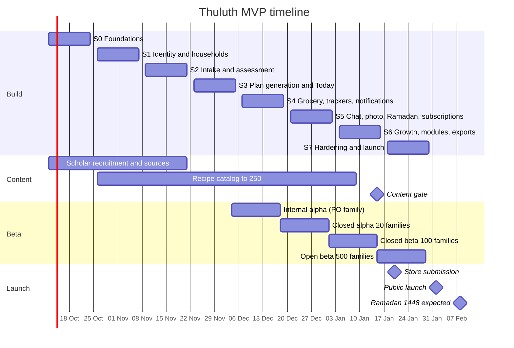

# 22 · MVP Roadmap

> **Status:** Draft v1.0 · **Owner:** Product (Tafseer) · **Last updated:** 2026-10-06
>
> **Related:** `01-product-requirements.md` (scope and FR IDs), `24-sprint-plan.md` (story-level plan), `23-phase-2-roadmap.md`, `16-security-architecture.md`, `17-subscription-architecture.md`, `19-deployment-architecture.md`, `20-ci-cd-pipeline.md`, `21-testing-strategy.md`

## Table of contents

1. [Summary](#1-summary)
2. [MVP scope](#2-mvp-scope)
3. [Timeline](#3-timeline)
4. [Milestones and exit criteria](#4-milestones-and-exit-criteria)
5. [Content track](#5-content-track)
6. [Beta plan](#6-beta-plan)
7. [Launch checklist](#7-launch-checklist)
8. [Success gates](#8-success-gates)
9. [Launch-window risks](#9-launch-window-risks)
10. [Post-launch first 30 days](#10-post-launch-first-30-days)

---

## 1. Summary

The MVP delivers a complete family nutrition loop for Pakistani and English-speaking Muslim families: register, describe the family, receive a safe AI-generated weekly plan built on the rule of thirds, shop from a priced grocery list, track meals, water and fasts, ask the AI consultant with sourced answers, and support children's growth, picky eating and autism, with a full Ramadan planner and a premium subscription.

- **Build window:** Sprint 0 (foundations) plus Sprints 1 to 6, from 12 October 2026 to 15 January 2027.
- **Hardening and beta:** Sprint 7, 18 to 29 January 2027.
- **Public launch:** Monday 1 February 2027 in Pakistan and English-speaking markets (UK, US, Canada, Australia, UAE, Saudi Arabia in English).
- **Why this date:** Ramadan 1448 is expected to begin around 8 February 2027 (subject to moon sighting). Launching one week before Ramadan with a working Ramadan planner is the single biggest acquisition opportunity of the year. The plan keeps a fallback (section 9).

## 2. MVP scope

### 2.1 In scope

Every feature below is specified with IDs in `01-product-requirements.md`. Tiers follow `00-foundations.md` section 8.

| Area | MVP capability | FR groups |
|---|---|---|
| Auth | Email OTP, Google, Apple, consents, invitations | FR-AUTH |
| Onboarding | Steps 1 to 6 with resumable state | FR-ONB |
| Households and members | Households, family members, roles (`owner`, `caregiver`, `viewer`), invites, limits | FR-HH |
| Health profile and intake | Conditions, allergies, medications, supplements, pregnancy, breastfeeding, sensory profile, goals, special modules, red-flag screening | 01 section 7 |
| AI assessment | `ai-intake-assess` with deterministic calculators and red flags | FR-AI |
| AI plan generation and adjustment | `ai-generate-plan`, `ai-adjust-plan`, template plans for free tier | FR-PLAN, FR-AI |
| Daily meals and recipes | Today, plan views, recipes, swaps, per-member portions and adaptations | FR-PLAN, FR-DASH |
| Meal tracking | Planned servings status, manual logs, photo AI logs, journal, adult weight | FR-TRK |
| Grocery and budget | Priced lists (Lahore, Karachi, Islamabad), optimisation, monthly purchasing, budget dashboard | FR-GRO |
| Hydration | Targets, Thuluth fluid timing schedule, logging | FR-HYD |
| Fasting | Ramadan and voluntary fasts, qada counter, child and safety rules | FR-FAST |
| AI chat | Text (free), voice and photo (premium), memory (premium), tools, citations | FR-CHAT |
| Growth | WHO percentiles, charts, alerts, reminders | FR-GRW |
| Picky eater (core) | Division of Responsibility guide, exposure log, coaching plans, acceptance analytics | FR-PCK |
| Autism (core) | Safe foods, sensory profile, exposure ladders, food chaining, alternatives | FR-AUT |
| Ramadan planner (core) | Full family plan, schedules, pregnancy and breastfeeding support | FR-RAM |
| Islamic knowledge | Verified sources, recommendation cards (source, science, action), tradition preference | FR-ISL |
| Notifications | OneSignal reminders, preferences, inbox | FR-NOT |
| Exports | PDF meal plan, grocery list, growth report | FR-EXP |
| Subscription | RevenueCat monthly and annual, paywall, server entitlements | FR-SUB |
| Settings and help | Profile, privacy, consents, data export, account deletion, help center | FR-SET, FR-HELP |
| Analytics | First-party events and KPI rollups | FR-ANL |
| Locales | `en`, `ur` (RTL Nastaliq) | FR-L10N |

### 2.2 Explicitly deferred to Phase 2

Arabic and other locales, non-Pakistan price books, coach accounts and dashboard, madrasa group plans, wearables, barcode scanning, advanced analytics and family coaching programs, partner price feeds, offline-first sync expansion beyond the MVP outbox, web companion, multi-agent architecture, Ramadan pack / nutrition report / family summary PDFs if not finished in Sprint 6. See `23-phase-2-roadmap.md`.

### 2.3 MVP cut line

If the schedule slips, cut in this order (lowest value first) without moving launch:

1. Should-priority FRs (FR-PLAN-17, FR-GRO-10, FR-HYD-06, FR-FAST-08, FR-TRK-07, FR-CHAT-12, FR-SUB-07).
2. Growth report PDF (keep meal plan and grocery PDFs).
3. Food chaining suggestions (keep exposure ladders manual).
4. AI long-term memory (keep session context).
5. Voice input (keep photo).

Never cut: safety guardrails, red-flag escalation, child rules, verified-only sources, account deletion, consent capture, RLS, Ramadan planner core, subscription purchase and restore.

## 3. Timeline



## 4. Milestones and exit criteria

Each milestone closes at the end of its sprint demo. Exit criteria are binary; a milestone with an unmet criterion carries the item into the next sprint as its first-priority story, and the PO decides whether the next milestone is at risk.

### M0 Foundations ready (end of Sprint 0, 23 Oct 2026)

- [ ] Monorepo builds; `apps/mobile` dev builds install on Android reference device and iOS.
- [ ] Navigation shell with five tabs; light and dark themes; `en` and `ur` with RTL mirroring.
- [ ] Supabase `thuluth-dev`, `thuluth-staging`, `thuluth-prod` exist; base migration with all canonical enums, `users`, `households`, `household_members`, RLS helpers applied on dev and staging.
- [ ] CI required checks (typecheck, lint, unit, pgTAP, Deno, secret scan) block merges on `main`.
- [ ] CD deploys to dev on merge; EAS Update `development` channel works.
- [ ] `packages/ai-core` resolves routes from `ai_model_routes`, calls one provider from an Edge Function, writes `ai_usage`.
- [ ] Sentry receives a test error from mobile and Edge with PII scrubbing verified.
- [ ] Scholar reviewer recruitment started with at least one Sunni and one Shia candidate in conversation.

### M1 Identity and household (end of Sprint 1, 6 Nov 2026)

- [ ] Sign up and sign in via email OTP, Google and Apple on real devices.
- [ ] Consents recorded with versions; child-data consent captured on first minor.
- [ ] Onboarding steps 1 to 4 complete and resumable.
- [ ] Invitations: create, email, accept via deep link; roles enforced by RLS.
- [ ] pgTAP RLS suite covers every Sprint 1 table for owner, caregiver, viewer, and non-member; all green.
- [ ] Free limits (1 household, 6 members) enforced server-side with correct error codes.
- [ ] Food catalog and Islamic knowledge schemas migrated; 150 ingredients seeded.

### M2 Intake and assessment (end of Sprint 2, 20 Nov 2026)

- [ ] Full intake questionnaire per `01-product-requirements.md` section 7, adaptive by age and sex.
- [ ] Under-18 weight goals rejected at the database and API.
- [ ] `ai-intake-assess` returns targets for the Usman fixture in under 20 s p90; calculators unit-tested.
- [ ] Red-flag fixtures each produce the correct `risk_flags` and a clinician card.
- [ ] Eval suite in CI: child-restriction 100 percent, fiqh-refusal at least 97 percent, red-flag 100 percent.
- [ ] 40 verified Islamic sources, 30 recommendations with complete evidence; retrieval returns only verified rows.
- [ ] 100 recipes seeded with computed nutrition.

### M3 First plan, internal alpha (end of Sprint 3, 4 Dec 2026)

- [ ] Onboarding step 6 produces an active weekly plan for the fixture household in under 90 s p90; template fallback works.
- [ ] Property test: 500 plans with zero allergen and zero non-halal violations; autism members have a safe food at every meal; child servings contain no restriction.
- [ ] Today, Plan, Recipe screens work offline from cache.
- [ ] Meal status logging, swaps, and premium plan adjustment working.
- [ ] Internal alpha: PO's family uses the app for 7 consecutive days; Sev-1 count is zero at exit.

### M4 Daily loop, closed alpha (end of Sprint 4, 18 Dec 2026)

- [ ] Grocery list from plan with Lahore price estimate within ±10 percent of the reference basket.
- [ ] Budget dashboard numbers equal SQL aggregates.
- [ ] Hydration and fasting trackers work offline and sync without duplicates.
- [ ] Prayer times for Lahore, Karachi, Islamabad, London, Toronto, Dubai match the reference library within 1 minute.
- [ ] Notifications: on-time rate at least 99 percent in staging over 72 hours; quiet hours and daily cap respected; deep links verified.
- [ ] 20 alpha families onboarded; crash-free sessions at least 99 percent.

### M5 Closed beta (end of Sprint 5, 1 Jan 2027)

- [ ] AI chat streaming with first token p50 under 2.5 s; tools require confirmation; quotas enforced by tier.
- [ ] Grounding eval: zero unverified citations in 200 sampled answers; crisis eval 100 percent.
- [ ] Voice (en, ur) and photo meal analysis working for premium; free photo trial of 3.
- [ ] Ramadan planner generates a family plan for Ramadan 1448 for all fixture personas, with child and pregnancy/breastfeeding rules; suhoor and iftar notifications scheduled.
- [ ] Purchases, restores and webhook updates work in App Store and Play sandboxes; server gating verified by tampering test.
- [ ] TestFlight external beta approved by Apple beta review; Play closed track live; 100 families invited.

### M6 Feature complete, open beta (end of Sprint 6, 15 Jan 2027)

- [ ] All FRs with priority M in `01-product-requirements.md` implemented (behind flags where needed).
- [ ] Growth percentiles match WHO reference to two decimal places of z for fixtures.
- [ ] Picky-eater and autism modules complete; copy lint finds no pressure language.
- [ ] PDF exports (meal plan, grocery list, growth report) in en and ur.
- [ ] Account export and deletion verified end to end, including grace cancellation.
- [ ] Content gate passed (section 5).
- [ ] Open beta live with at least 300 active beta households.

### M7 Launch ready (end of Sprint 7, 29 Jan 2027)

- [ ] All success gates in section 8 met.
- [ ] Both stores approved v1.0.0.
- [ ] Production environment live with backups, PITR, alerts, on-call rota and runbook.
- [ ] Launch checklist (section 7) complete and signed off by PO.

## 5. Content track

Content gates the launch as much as code. The content track runs in parallel from Sprint 0, owned by the PO.

| Content | Launch minimum | Review | Milestone checkpoint |
|---|---|---|---|
| Islamic sources (Qur'an, hadith, imam narrations) | 80 verified | One credentialed reviewer per tradition; recorded in `source_verifications` | 40 at M2, 80 at M6 |
| Recommendations (with source, science, action) | 60 verified, each with complete `recommendation_evidence` | Scholar for Islamic framing, dietitian for practical and science | 30 at M2, 60 at M6 |
| Scientific evidence entries | 60 with GRADE | Dietitian | 30 at M2, 60 at M6 |
| Recipes | 250 verified; 100 kid-friendly, 60 autism-friendly, 40 Ramadan, 120 cost tier 1 | Dietitian + home-cook testing | 100 at M2, 200 at M3, 250 at M6 |
| Ingredients | 400 with `en`/`ur` names, nutrients, halal status, textures, allergens | Backend + dietitian | 150 at M1, 400 at M4 |
| Price books | Lahore, Karachi, Islamabad, 400 ingredients | PO field check | M4 |
| Coaching tips | 40 age-banded | Dietitian, feeding therapist for autism tips | M6 |
| Help articles | 30 in en and ur | PO | M6 |
| Crisis and red-flag copy | All templates | Clinician | M5 |

Reviewer compensation and promotional premium entitlements (`subscriptions.store = 'promotional'`) are arranged by the PO in Sprint 0 and 1.

## 6. Beta plan

### 6.1 Phases

| Phase | Dates | Size | Who | Distribution | Focus |
|---|---|---|---|---|---|
| Internal alpha | 4 to 18 Dec 2026 | 1 to 3 households | PO's family and close contacts | EAS internal distribution | Core plan quality, daily usability, safety rules on real family data |
| Closed alpha | 18 Dec 2026 to 1 Jan 2027 | 20 households | Lahore families recruited personally: at least 5 with picky eaters, 3 with autistic children, 3 with a pregnant or breastfeeding mother, 3 with a diabetic adult | EAS internal / Play internal testing, TestFlight internal | Grocery prices, hydration and fasting flows, Urdu, notifications |
| Closed beta | 1 to 15 Jan 2027 | 100 households | 70 Pakistan, 30 UK/US/Canada/UAE; recruitment via mosques, parenting groups, dietitian network | TestFlight external, Play closed testing | Chat, photo, Ramadan planner, subscription flows (sandbox and promotional) |
| Open beta | 15 to 29 Jan 2027 | 500 households | Public waitlist | TestFlight public link, Play open testing | Scale, performance, crash-free rate, onboarding funnel, AI cost per user |

### 6.2 Recruitment and consent

- Beta testers sign a beta agreement covering health data use, the wellness-not-medical position, and feedback use.
- All beta testers receive promotional premium for 3 months so premium features are exercised; 20 percent of the closed beta cohort is kept on free to measure free experience and upgrade intent (paywall views, with no real purchases required).

### 6.3 Feedback channels

- In-app feedback button on every screen (screenshot plus note, stored as `analytics_events` `beta_feedback` with a Storage attachment).
- Thumbs up/down on AI messages (FR-CHAT-12).
- WhatsApp community for alpha and closed beta (PO moderated); weekly 15-minute calls with 5 families.
- Weekly beta survey: SUS score, plan satisfaction (1 to 5), "would you be disappointed if Thuluth disappeared?"

### 6.4 Triage

| Severity | Definition | Response |
|---|---|---|
| Sev-1 | Safety failure (child restriction, unverified citation, missed red flag, allergen in plan), data leak, crash on launch, purchase failure | Fix within 24 h; stop-ship |
| Sev-2 | Broken core flow (plan generation, logging, grocery) or major Urdu defect | Fix in current sprint |
| Sev-3 | Minor bug, copy issue | Triage weekly |
| Sev-4 | Enhancement | Backlog; Phase 2 candidate |

### 6.5 Beta exit criteria

Beta exit equals the success gates in section 8.

## 7. Launch checklist

Owner abbreviations: PO (product owner), lead, be (backend), mob (mobile), ai, des (design), qa.

### 7.1 Legal, brand and accounts

| # | Item | Owner | Done |
|---|---|---|---|
| L1 | Trademark search for "Thuluth" in Pakistan, UK, US; App Store and Play name availability; fallback "Thuluth: Family Meal Planner" (Q-14) | PO | [ ] |
| L2 | Domain `thuluth.app` with universal links (`apple-app-site-association`, `assetlinks.json`) | be | [ ] |
| L3 | Terms of Service, Privacy Policy, Medical Disclaimer, Content Sources page, published at `thuluth.app/legal` | PO | [ ] |
| L4 | Data processing agreements with Supabase, AI providers (zero retention / no training where available), OneSignal, Sentry, RevenueCat, email provider | PO | [ ] |
| L5 | Record of processing and DPIA for health and child data (UK GDPR) | PO | [ ] |
| L6 | Scholar and clinician reviewer credits approved for About screen | PO | [ ] |
| L7 | Developer accounts: Apple (organization, D-U-N-S), Google Play (organization, verified), tax and banking for payouts in Pakistan | PO | [ ] |

### 7.2 Store listings

| # | Item | Owner | Done |
|---|---|---|---|
| S1 | App name "Thuluth: Family Nutrition", subtitle (iOS, 30 chars) "Halal family meal planner", short description (Play, 80 chars) | PO + des | [ ] |
| S2 | Long description in English and Urdu; no medical claims ("plan", "track", "learn", never "treat" or "cure") | PO | [ ] |
| S3 | Screenshots: 6.7" and 5.5" iPhone, iPad (if supported), Play phone; en and ur sets; captions show family plan, grocery in PKR, Ramadan, chat with sources, growth | des | [ ] |
| S4 | App preview video (optional, 30 s) | des | [ ] |
| S5 | Keywords (iOS): halal, meal planner, family, Ramadan, suhoor, iftar, sunnah, nutrition, picky eater, autism, grocery, budget | PO | [ ] |
| S6 | Category: Health & Fitness (primary), Food & Drink (secondary) on iOS; Health & Fitness on Play | PO | [ ] |
| S7 | Age rating: 4+ (iOS) / Everyone (Play) content, with account holders 18+ in terms; questionnaire answers recorded | PO | [ ] |
| S8 | Support URL, marketing URL, privacy policy URL | PO | [ ] |
| S9 | Subscription products `thuluth_premium_monthly`, `thuluth_premium_annual` configured with localized prices (FR-SUB-08), subscription group, 7-day annual trial, review screenshot of paywall | PO | [ ] |
| S10 | Promotional text and "What's new" for v1.0.0 | PO | [ ] |

### 7.3 Apple privacy nutrition labels

Declare data **linked to the user**, not used for tracking (no third-party tracking SDKs; App Tracking Transparency prompt not needed):

| Data type (Apple category) | Collected | Purpose |
|---|---|---|
| Contact Info: Email Address, Name | Yes | App Functionality |
| Health & Fitness: Health, Fitness | Yes (height, weight, conditions, allergies, medications, pregnancy, growth, meals, hydration, fasting) | App Functionality |
| User Content: Photos, Audio Data, Other User Content | Yes (meal photos, voice notes, chat messages) | App Functionality |
| Identifiers: User ID, Device ID (OneSignal subscription id) | Yes | App Functionality |
| Purchases: Purchase History | Yes | App Functionality |
| Usage Data: Product Interaction | Yes (first-party analytics) | Analytics, App Functionality |
| Diagnostics: Crash Data, Performance Data | Yes (Sentry) | App Functionality |
| Location: Coarse Location | No (city entered manually; prayer times from city) | |
| Financial info, Contacts, Browsing History, Search History, Sensitive Info (beyond health) | No | |

Note: religious tradition preference is stored. It is declared under "Other Data Types" with purpose App Functionality; PO confirms the exact category with legal before submission.

### 7.4 Google Play data safety form

| Section | Answer |
|---|---|
| Data collected | Personal info (name, email), Health and fitness (health info, fitness info), Photos and videos, Audio (voice notes), App activity (app interactions, in-app search not collected), App info and performance (crash logs, diagnostics), Device or other IDs, Financial info: purchase history |
| Data shared | No data shared with third parties for their own purposes. Processors (Supabase, AI providers, OneSignal, Sentry, RevenueCat) act on our behalf and are declared as "not shared" per Play's service-provider exemption |
| Encrypted in transit | Yes |
| Users can request deletion | Yes (in-app and web form at `thuluth.app/delete-account`) |
| Optional vs required | Health data required for core functionality; voice, photos, analytics optional |
| Families policy | App is not designed for children; target audience 18+ on Play Console target audience form; children's data is entered by parents |
| Health apps declaration | Complete the Play Console Health apps declaration: categories "Nutrition and weight management", "Health and fitness"; not a medical device |
| Account deletion URL | `https://thuluth.app/delete-account` |

### 7.5 Health-app review notes (App Store Review Information and Play notes)

Paste into review notes, adapted per store:

```text
Thuluth is a wellness and education app for family meal planning, hydration,
meal and fasting tracking. It is not a medical device and does not diagnose or
treat any condition. Every plan shows a disclaimer advising users to consult a
clinician.

Safety design:
- No calorie targets or weight-loss goals are ever shown for anyone under 18.
- Users who report red-flag conditions (e.g. insulin-treated diabetes with an
  intention to fast, pregnancy complications, eating-disorder signals, faltering
  child growth) receive a referral to a clinician and no plan for that issue.
- AI responses are generated server-side, grounded in a curated recipe catalog
  and verified sources, and filtered by safety classifiers.

Religious content: Qur'an and hadith citations are shown only after review by
named, credentialed scholars (listed in About). The app does not issue
religious rulings.

Demo account: reviewer@thuluth.app (sign in with email OTP; the code for this
account is fixed at 123456 in production for review only and rate-limited).
The account has a sample household with premium enabled via a promotional
entitlement.

Account deletion: Settings > Privacy > Delete account.
Subscriptions: auto-renewing; terms and restore on the paywall.
Sign in with Apple is offered alongside Google sign-in.
```

Guideline references the team checks: App Store Review Guidelines 1.4.1 (physical harm, health claims), 2.1 (completeness, demo account), 3.1.1 and 3.1.2 (in-app purchase, subscriptions), 4.8 (Sign in with Apple), 5.1.1 (data collection, account deletion), 5.1.3 (health data, no advertising use). Google Play: Health apps policy and declaration, User Data policy, Families policy (not targeting children), Subscriptions policy, Account deletion requirement.

The fixed review OTP requires a dedicated, audited code path for one allow-listed email; the alternative (a magic-link inbox the reviewer cannot access) causes rejections. `11-authentication.md` defines the mechanism.

### 7.6 Technical readiness

| # | Item | Owner | Done |
|---|---|---|---|
| T1 | Production Supabase: migrations applied, RLS verified, PITR on, daily backups tested by restore drill | be | [ ] |
| T2 | Edge Function secrets in prod; AI provider spend limits and alerts set | be + ai | [ ] |
| T3 | `ai_model_routes` and `prompt_templates` prod rows reviewed; fallbacks tested | ai | [ ] |
| T4 | OneSignal prod app; APNs and FCM credentials; Ramadan load test (suhoor burst) | be | [ ] |
| T5 | RevenueCat production; webhook secret; products approved in stores | be | [ ] |
| T6 | Sentry release health, alerts to on-call; source maps uploaded by EAS | mob | [ ] |
| T7 | Performance budgets met on reference devices (`01` section 9.1) | qa | [ ] |
| T8 | Accessibility audit WCAG 2.2 AA passed | des + qa | [ ] |
| T9 | Pen test findings: no open high or critical | be | [ ] |
| T10 | Full eval suite pass; red-team sign-off by PO and clinician | qa + ai | [ ] |
| T11 | Feature flags set for prod (Ramadan planner on from launch) | lead | [ ] |
| T12 | EAS Update channels: `production` pinned to v1.0.0 runtime; rollback tested | lead | [ ] |
| T13 | Status page and support inbox `support@thuluth.app` monitored | PO | [ ] |
| T14 | Analytics dashboards and KPI alerts live | be | [ ] |

### 7.7 Go-to-market

| # | Item | Owner |
|---|---|---|
| G1 | Landing page with waitlist conversion to store links | PO |
| G2 | Ramadan launch campaign: mosque partnerships in Lahore, Karachi, Islamabad; UK community groups; dietitian and mom influencer outreach | PO |
| G3 | Press kit (en, ur) | PO + des |
| G4 | Referral: beta households get a shareable invite code (promotional 1-month premium) | PO + be |

## 8. Success gates

Launch proceeds only when every gate is green, measured over the last 7 days of open beta unless noted. The PO records the go/no-go decision on 29 January 2027.

| Gate | Metric | Threshold |
|---|---|---|
| G-SAFE-1 | Child-restriction violations in validated outputs (evals + production sampling of 500 plans and 500 chat answers) | 0 |
| G-SAFE-2 | Unverified Islamic citations shown | 0 |
| G-SAFE-3 | Red-flag fixtures correctly escalated | 100 percent |
| G-SAFE-4 | Allergen or non-halal ingredient in any generated plan (property tests + beta sampling) | 0 |
| G-QUAL-1 | Crash-free sessions (open beta) | at least 99.5 percent |
| G-QUAL-2 | Plan generation success without fallback | at least 95 percent |
| G-QUAL-3 | Open Sev-1 bugs / open Sev-2 bugs | 0 / at most 3 with workarounds |
| G-PERF-1 | Cold start p75 on Android reference | at most 2.5 s |
| G-PERF-2 | Plan generation p90 | at most 90 s |
| G-PERF-3 | Chat first token p50 | at most 2.5 s |
| G-UX-1 | Onboarding completion (beta signups) | at least 60 percent |
| G-UX-2 | Median time to first plan | at most 8 min |
| G-UX-3 | Beta SUS score | at least 75 |
| G-UX-4 | "Very disappointed" share (Sean Ellis test, closed + open beta) | at least 30 percent |
| G-ENG-1 | Beta households active on at least 3 days in their first week | at least 40 percent |
| G-COST-1 | AI cost per active beta user per week (premium promotional users) | at most USD 0.35 |
| G-OPS-1 | Notification on-time rate | at least 99 percent |
| G-STORE-1 | Store approval | Both stores approved |
| G-CONTENT-1 | Content gate (section 5) | Met |

**If a gate fails:** safety gates (G-SAFE) are stop-ship without exception. Other gates allow a PO-approved launch with a dated remediation plan, provided no more than two non-safety gates are amber (within 20 percent of threshold) and none is red.

## 9. Launch-window risks

| Risk | Trigger | Fallback |
|---|---|---|
| Store rejection close to launch | Rejection after 22 Jan | Submit by 20 Jan; respond within 24 h; prepare an expedited review request citing Ramadan timing; Android can launch independently |
| Schedule slip of 1 sprint | M6 not met by 15 Jan | Launch 1 Feb with the cut line (section 2.3) applied; Ramadan planner and safety are never cut |
| Schedule slip beyond 1 sprint | M6 not met by 29 Jan | "Ramadan Companion" soft launch in Pakistan only: fasting tracker, hydration, Ramadan planner, chat; full launch after Eid al-Fitr (around 9 to 10 March 2027) |
| AI provider instability during Ramadan peak | Error rate above 2 percent | Fallback routes in `ai_model_routes`; template plans; queue plan generation off-peak |
| Suhoor notification burst overload | Dispatch latency above 2 min | Pre-schedule Ramadan notifications with OneSignal delivery-time options a day ahead |

## 10. Post-launch first 30 days

| Week | Focus |
|---|---|
| Week 1 (Ramadan begins) | Daily triage, hotfix cadence via EAS Update, monitor safety sampling, AI cost, suhoor/iftar notification timing |
| Week 2 | Onboarding funnel review; fix top drop-off step; respond to all store reviews |
| Week 3 | First retention cohort (D7); paywall conversion by trigger; price book refresh for Ramadan inflation |
| Week 4 | Phase 2 prioritisation review with real metrics (`23-phase-2-roadmap.md` triggers); Eid transition content live |
