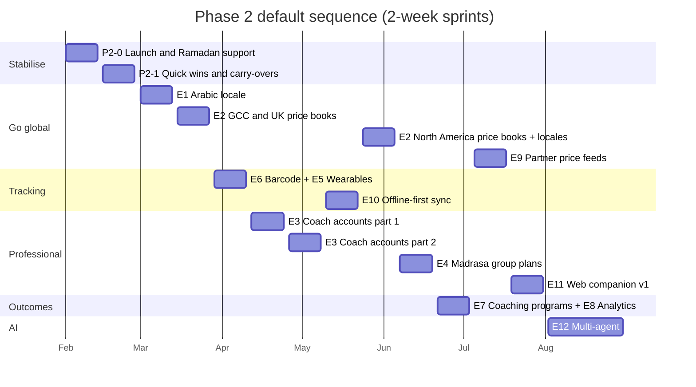
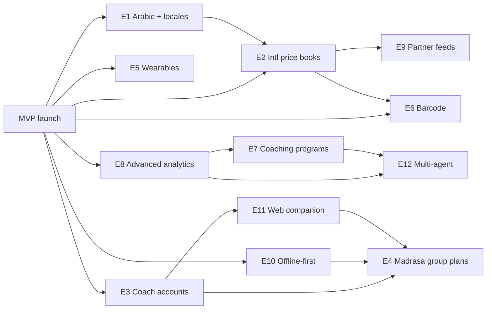

# 23 · Phase 2 Roadmap

> **Status:** Draft v1.0 (to be re-prioritised with launch data in week 4 after launch) · **Owner:** Product (Tafseer) · **Last updated:** 2026-10-06
>
> **Related:** `01-product-requirements.md`, `22-mvp-roadmap.md`, `24-sprint-plan.md` (section 15, Phase 2 sprint outline), `25-future-multi-agent-architecture.md`, `14-meal-planning-and-grocery.md`, `17-subscription-architecture.md`, `18-exports-and-analytics.md`, `09-state-management.md`

## Table of contents

1. [Purpose and principles](#1-purpose-and-principles)
2. [Themes](#2-themes)
3. [Epics](#3-epics)
4. [Sequencing](#4-sequencing)
5. [Dependency map](#5-dependency-map)
6. [Metric triggers](#6-metric-triggers)
7. [Data model implications](#7-data-model-implications)
8. [What Phase 2 will not do](#8-what-phase-2-will-not-do)
9. [Review cadence](#9-review-cadence)

---

## 1. Purpose and principles

Phase 2 begins the week after the MVP launch (1 February 2027) and runs roughly six months. Its job is to grow beyond Pakistan, open two new customer types (nutrition coaches and religious schools), deepen engagement for existing families, and prepare the AI layer to scale.

Principles:

1. **Metrics decide order.** Each epic has a trigger metric (section 6). An epic starts when its trigger fires or the PO overrides with a written reason.
2. **Safety rules do not relax.** Every new market, locale, role and data source inherits the safety position in `00-foundations.md` section 10. New locales require their own eval sets before release.
3. **Additive data model.** New tables and enum values are additive only (`00-foundations.md` section 4.1). Proposed additions are listed in section 7.
4. **Same entitlement backbone.** Coach and institution offerings extend RevenueCat and `subscriptions`; `has_premium()` remains the server gate for family premium.

## 2. Themes

| Theme | Goal | Epics |
|---|---|---|
| T1 Go global | Make Thuluth native in GCC, UK, Europe and North America | E1 Arabic and more locales, E2 International price books, E9 Partner price feeds |
| T2 Professional and institutional | Serve dietitians, coaches and madrasas | E3 Coach accounts and dashboard, E4 Madrasa group plans, E11 Web companion |
| T3 Effortless tracking | Reduce logging friction | E5 Wearables, E6 Barcode scanning, E10 Offline-first sync |
| T4 Outcomes and coaching | Turn data into progress | E7 Family coaching programs, E8 Advanced analytics |
| T5 AI at scale | Better quality at lower cost per user | E12 Multi-agent architecture |

## 3. Epics

Each epic lists rationale, scope, key requirements (new IDs use the `FR-P2-<EPIC>-NN` pattern and will be folded into `01-product-requirements.md` when scheduled), dependencies, the trigger metric and the success metric.

### E1 Arabic locale and additional languages

| Field | Detail |
|---|---|
| Rationale | GCC is the second launch region; Arabic speakers expect a native RTL experience. MVP RTL work for Urdu makes Arabic incremental. Further locales (French, Turkish, Malay, Indonesian, Bengali) unlock Europe, Southeast Asia and Bangladesh diaspora. |
| Scope | `ar` locale (Noto Naskh Arabic UI font; scripture remains Amiri / KFGQPC), Arabic translations of all strings, recipes, recommendations, help; Arabic AI responses and Arabic eval set; Arabic voice transcription; then phased French, Turkish, Malay, Indonesian, Bengali. Translation memory and glossary for food and religious terms. |
| Key requirements | FR-P2-E1-01 Arabic UI with full RTL parity to Urdu. FR-P2-E1-02 Arabic AI eval set (child safety, fiqh refusal, grounding) passes at MVP thresholds. FR-P2-E1-03 Scripture translations sourced from licensed translations with attribution in `quran_references.translator`. FR-P2-E1-04 Each new locale ships only when 100 percent of strings and all safety copy are human-reviewed. |
| Dependencies | MVP i18n and RTL (S0, S1); content translation budget; native reviewers. |
| Trigger | Non-Pakistan installs above 25 percent of weekly installs for 2 consecutive weeks, or a GCC partnership signed. Each additional locale: 2,000+ MAU with that device language using English. |
| Success metric | Arabic-locale D30 retention within 3 points of English; Arabic chat thumbs-up at least 78 percent. |

### E2 International price books (UAE, Saudi Arabia, UK, US, Canada)

| Field | Detail |
|---|---|
| Rationale | Budget-aware planning is a core differentiator, and outside Pakistan MVP users must enter prices manually. The Dubai budget family persona depends on this. |
| Scope | `regions`, `price_profiles`, `price_observations` and `seasonal_produce` for Dubai, Abu Dhabi, Sharjah, Riyadh, Jeddah, London, Birmingham, Manchester, New York metro, Chicago, Houston, Toronto, Mississauga, Calgary; regional recipe tags (Gulf, British-Pakistani, North American halal); store-brand availability notes; halal certification bodies per market for processed foods. |
| Key requirements | FR-P2-E2-01 Price estimates within ±12 percent of a monthly field-checked basket per city. FR-P2-E2-02 Seasonal produce calendars per climate zone. FR-P2-E2-03 Budget optimisation works with each currency (AED, SAR, GBP, USD, CAD). |
| Dependencies | E9 optional (partner feeds improve accuracy); `prices-refresh` scaling. |
| Trigger | A city reaches 500 MAU households, or user-reported price observations in a city exceed 1,000 per month (crowd data ready to seed). |
| Success metric | Budget adherence in new markets at least 55 percent; grocery list usage within 10 points of Pakistan. |

### E3 Nutrition coach accounts and coach dashboard

| Field | Detail |
|---|---|
| Rationale | Dietitians (persona Dr. Hira) want to supervise AI plans for client families; coaches bring paying families and professional credibility. The `coach` role exists in `household_role` from day one. |
| Scope | Coach onboarding with credential verification; client roster (households where the coach holds `household_members.role = 'coach'`); plan approval gate (plans for coached households stay `draft` until approved); coach notes on plans; adherence and progress overview across clients; messaging via structured notes (not free chat in Phase 2); billing via `thuluth_family_coach_monthly`; coach-sponsored premium for clients. |
| Key requirements | FR-P2-E3-01 Coach access requires explicit household consent and can be revoked by the owner at any time. FR-P2-E3-02 Coach sees only households they are members of (RLS via `is_household_member()`). FR-P2-E3-03 Approval gate: AI plans for coached households require coach approval before `active`. FR-P2-E3-04 Coach dashboard lists clients with last activity, adherence, red flags. FR-P2-E3-05 Audit log of every coach view of health data. |
| Dependencies | E11 (dashboard on web is preferable); `17-subscription-architecture.md` coach product; credential verification process. |
| Trigger | Coach waitlist reaches 50 sign-ups, or 3 dietitian practices commit to a pilot. |
| Success metric | 30 paying coaches within 3 months of release; coached households D90 retention at least 1.5x uncoached. |

### E4 Religious school (madrasa) group plans

| Field | Detail |
|---|---|
| Rationale | Madrasas and Islamic schools feed hundreds of children on fixed budgets (persona Maulana Abdul Rahman). Group plans have high social impact and donor-facing value. |
| Scope | Institution households; cohort members (for example "Boys 8 to 11, 45 students") instead of individuals; cohort portions by `life_stage`; bulk grocery scaling with wholesale units; kitchen prep sheets; Ramadan schedules for older students; donor-friendly PDF report; no individual health data by default; optional allergy register per institution. |
| Key requirements | FR-P2-E4-01 Plans scale portions by cohort counts with child growth rules (no restriction). FR-P2-E4-02 Grocery quantities in wholesale units (maund, 40 kg bag, crate) for Pakistan. FR-P2-E4-03 Cost per child per day reported. FR-P2-E4-04 Institution pricing (annual licence, or free for registered charities with a donor sponsorship option). |
| Dependencies | E11 for administrator use on desktop; export templates in `18-exports-and-analytics.md`; data model additions (section 7). |
| Trigger | 5 institutions commit to a pilot, or a funding partner (zakat/sadaqah organization) sponsors development. |
| Success metric | 10 institutions active, cost per child per day within institution budget for 3 consecutive months. |

### E5 Wearables (Apple Health and Health Connect)

| Field | Detail |
|---|---|
| Rationale | Reduces manual logging of weight, activity and water for adults; improves energy estimates. |
| Scope | Read weight, steps, active energy, water; write water and nutrition (optional); per-member link only for the account holder's own member profile (`family_members.linked_user_id`). |
| Key requirements | FR-P2-E5-01 Explicit per-data-type permissions. FR-P2-E5-02 No child data written to or read from wearables. FR-P2-E5-03 Imported weights land in `weight_tracking` with a source tag. |
| Dependencies | Native modules and an EAS native build; store review updates (HealthKit usage descriptions). |
| Trigger | Feature requests for wearables in the top 3 of in-app votes, or adult weight logging below 1 per week among weight-goal users. |
| Success metric | Weight-goal users logging weekly rises by 25 percent. |

### E6 Barcode scanning

| Field | Detail |
|---|---|
| Rationale | Packaged foods matter more outside Pakistan; halal status of processed food is a frequent question. |
| Scope | Scan to product (Open Food Facts plus curated halal certification data), nutrition per serving, allergens, halal certification body if known, `mashbooh` ingredient warnings (for example gelatin, certain E-numbers) with clear "verify certification" messaging; log to `meal_logs`; add to grocery list. |
| Key requirements | FR-P2-E6-01 The app never declares a product halal without a certification source; it shows "certified by X" or "ingredients flagged" or "unknown". FR-P2-E6-02 Allergen warnings respect member allergies. |
| Dependencies | E2 markets (packaged-food relevance); product data licence. |
| Trigger | Non-Pakistan MAU share above 35 percent, or "is this halal" chat intents above 5 percent of chat volume. |
| Success metric | 20 percent of non-PK weekly active users scan at least once a week. |

### E7 Family coaching programs

| Field | Detail |
|---|---|
| Rationale | Structured programs drive outcomes and retention more than open-ended tools. MVP modules (picky eater, autism, weight, Ramadan) become guided journeys. |
| Scope | 8-week "Happy Plates" picky-eater program; 12-week "Weight journey in thirds" for adults; "Sensory-friendly table" autism program; "Ramadan readiness" 4-week pre-Ramadan program; "First foods" for infants 6 to 12 months. Each with weekly lessons, tasks, check-ins, progress, and sourced recommendations. |
| Key requirements | FR-P2-E7-01 Every lesson resolves to verified recommendations. FR-P2-E7-02 Child programs never include restriction. FR-P2-E7-03 Programs adapt pacing from logs (exposures, acceptance, adherence). |
| Dependencies | E8 for progress analytics; content production with dietitian and feeding therapist. |
| Trigger | Premium D60 retention below 55 percent, or module usage (picky/autism) above 30 percent of premium households. |
| Success metric | Program completion at least 35 percent; enrolled households' premium churn 30 percent lower than non-enrolled. |

### E8 Advanced analytics

| Field | Detail |
|---|---|
| Rationale | Families want to see progress; coaches need cohort views; the product team needs deeper outcome analysis. |
| Scope | Family insights v2: nutrient adequacy trends for adults, food-group variety for children, hydration patterns, fasting consistency, exposure progress, budget trends; monthly family summary PDF; internal outcome dashboards; experimentation framework (feature-flag-based A/B with `analytics_events`). |
| Key requirements | FR-P2-E8-01 No kcal or weight framing in children's insights. FR-P2-E8-02 A/B assignments stored in `feature_flags.rules` with exposure events. |
| Dependencies | `analytics-rollup` scale; partitioning review. |
| Trigger | Insights screen weekly usage above 25 percent of premium households, or the need to run 3+ concurrent experiments. |
| Success metric | Premium conversion lift of 10 percent attributable to insights teasers (A/B). |

### E9 Partner grocery price feeds

| Field | Detail |
|---|---|
| Rationale | Accurate, current prices improve budget plans; partners (supermarkets, delivery apps) offer distribution. |
| Scope | Ingest partner feeds into `price_observations` with `source = 'partner_feed'`; ingredient matching; freshness SLAs; optional deep link to partner basket (no checkout in-app in Phase 2). |
| Key requirements | FR-P2-E9-01 Partner prices labelled; never mixed with user reports without weighting. FR-P2-E9-02 No user data shared with partners without explicit consent. |
| Dependencies | E2; signed commercial agreement. |
| Trigger | A partner signs a data agreement. |
| Success metric | Price estimate error below ±7 percent in partner cities. |

### E10 Offline-first sync expansion

| Field | Detail |
|---|---|
| Rationale | MVP offers cached reads and an outbox for logs. Users with unreliable connectivity (load-shedding in Pakistan, travel during Hajj and Umrah) need full offline plan editing and grocery collaboration. |
| Scope | Local database with bidirectional sync for plans, servings, grocery lists, logs; conflict resolution rules per table; background sync. Default technology: PowerSync (Supabase-supported Postgres sync) with SQLite; alternative WatermelonDB evaluated in a spike. Decision recorded in `09-state-management.md`. |
| Key requirements | FR-P2-E10-01 All tracking and grocery features fully usable offline for 7 days. FR-P2-E10-02 Deterministic conflict resolution with user-visible merge for plan edits. |
| Dependencies | Schema stability; RLS-compatible sync rules. |
| Trigger | Offline outbox error or retry rate above 2 percent of writes, or sessions starting offline above 15 percent in any market. |
| Success metric | Sync conflicts requiring user action below 0.1 percent of writes. |

### E11 Web companion

| Field | Detail |
|---|---|
| Rationale | Coaches and madrasa administrators work on desktops; families like planning and printing on larger screens. |
| Scope | Web app (React, sharing `packages/shared` contracts and Zod schemas; framework decision in `04-system-architecture.md` revision) with plan view and edit, grocery list, exports, coach dashboard, institution admin, content review console for scholars (replacing Supabase Studio use). Auth via the same Supabase project. |
| Key requirements | FR-P2-E11-01 Same RLS and entitlements as mobile. FR-P2-E11-02 WCAG 2.2 AA. FR-P2-E11-03 No AI keys in the browser; all AI via Edge Functions. |
| Dependencies | E3 and E4 needs; design system web tokens. |
| Trigger | E3 or E4 started, or content reviewer volume makes Studio a bottleneck (more than 50 items per week in review). |
| Success metric | 70 percent of coach sessions on web; content review cycle time halved. |

### E12 Multi-agent architecture

| Field | Detail |
|---|---|
| Rationale | One agent with many tools becomes costly and harder to evaluate as features grow. Specialised agents (planner, nutrition analyst, Islamic knowledge, pediatric feeding, budget, safety supervisor) improve quality and allow cheaper models per task. |
| Scope | As defined in `25-future-multi-agent-architecture.md`: orchestrator, specialist agents, shared memory, supervisor safety agent, evaluation harness per agent. |
| Key requirements | FR-P2-E12-01 No regression on any MVP eval. FR-P2-E12-02 Blended AI cost per MAU reduced by at least 25 percent at equal or better quality. |
| Dependencies | Mature eval suite; `ai_usage` data for cost baselines. |
| Trigger | AI cost per MAU above USD 0.40 for 4 consecutive weeks, or chat thumbs-up below 78 percent, or tool count in `ai-chat` exceeds 15. |
| Success metric | As FR-P2-E12-02 and chat thumbs-up at least 82 percent. |

## 4. Sequencing

The default sequence assumes triggers fire as forecast; the sprint outline is in `24-sprint-plan.md` section 15.

Rationale for the default order:

1. **Stabilise first (P2-0, P2-1).** Launch coincides with Ramadan; reliability and the funnel matter more than new features for the first month.
2. **Arabic and GCC/UK next (E1, E2).** The largest addressable growth after Pakistan, and the MVP i18n investment makes it fast.
3. **Low-friction tracking (E5, E6)** before professional features because it lifts engagement for all users.
4. **Coaches (E3)** before madrasas (E4) because coaches bring revenue and their requirements (roles, approvals, dashboards) are reused by institutions.
5. **Offline-first (E10)** before institutions because madrasa kitchens and many households face connectivity gaps.
6. **Web companion (E11)** lands when coach and institution demand is proven; a minimal coach web view may be pulled earlier if E3 pilots require it.
7. **Multi-agent (E12)** last, once cost and quality baselines from six months of production data exist.

## 5. Dependency map

| Epic | Hard dependencies | Soft dependencies |
|---|---|---|
| E1 | MVP i18n, native reviewers | |
| E2 | Price data sourcing per city | E1 (Arabic names for GCC catalog), E9 |
| E3 | Coach product in stores, credential verification | E11 |
| E4 | Data model additions (section 7), E3 role patterns | E10, E11 |
| E5 | Native build, store health permissions review | |
| E6 | Product database licence, halal certification data | E2 |
| E7 | Content production | E8 |
| E8 | Analytics rollup scale | |
| E9 | Partner agreement | E2 |
| E10 | Sync technology decision | |
| E11 | Web framework decision, web tokens | E3 |
| E12 | Eval coverage, cost baselines | E7, E8 |

## 6. Metric triggers

Triggers are evaluated in the monthly Phase 2 review from `analytics_events` materialized views (`18-exports-and-analytics.md`).

| Epic | Trigger metric (any one fires) | Source |
|---|---|---|
| E1 | Non-PK weekly installs above 25 percent for 2 weeks; GCC partnership; per-locale 2,000+ MAU on English with that device language | `analytics_events` (`app_opened` props `device_locale`, `country`) |
| E2 | City with 500+ MAU households; 1,000+ monthly user price observations in a city | `households`, `price_observations` |
| E3 | Coach waitlist 50+; 3 committed practices | Waitlist form, CRM |
| E4 | 5 pilot institutions; sponsor funding | CRM |
| E5 | Top-3 feature vote; weight-goal users logging less than weekly | Feedback, `weight_tracking` |
| E6 | Non-PK MAU above 35 percent; "is this halal" intents above 5 percent of chat | `chat_messages` intent labels, `analytics_events` |
| E7 | Premium D60 retention below 55 percent; module usage above 30 percent of premium households | Retention views |
| E8 | Insights weekly usage above 25 percent of premium; 3+ concurrent experiments needed | Views, product backlog |
| E9 | Signed partner | Commercial |
| E10 | Outbox retry rate above 2 percent; offline-start sessions above 15 percent | Client telemetry events |
| E11 | E3 or E4 started; review queue above 50 per week | Backlog, `source_verifications` |
| E12 | AI cost per MAU above USD 0.40 for 4 weeks; chat thumbs-up below 78 percent; more than 15 tools in `ai-chat` | `ai_usage`, `chat_feedback` events |

Counter-triggers (pause an epic): a safety incident (any Sev-1 safety bug) pauses all non-safety epics until resolved; crash-free sessions below 99 percent pauses feature work in favour of stability.

## 7. Data model implications

These are **proposed additions beyond 00-foundations** for Phase 2. They are not part of the MVP schema; `05-database-schema.md` will adopt them (or equivalents) when an epic is scheduled.

| Epic | Proposed addition | Notes |
|---|---|---|
| E1 | New locale keys in existing `*_i18n jsonb` columns | No schema change |
| E2 | New rows in `regions`, `price_profiles`, `seasonal_produce` | No schema change |
| E3 | `coach_profiles` (user_id, credentials, verified_at, practice_name) (Addition beyond 00-foundations) | Coach-household link reuses `household_members.role = 'coach'` |
| E3 | `plan_approvals` (meal_plan_id, household_id, coach_user_id, status, notes, decided_at) (Addition beyond 00-foundations) | Alternatively a `meal_plans.approved_by` column; decision in `05` |
| E4 | `households.kind` text check (`'family'`, `'institution'`), default `'family'` (Addition beyond 00-foundations) | |
| E4 | `family_members.cohort_size integer null` (Addition beyond 00-foundations) | A member row with `cohort_size` represents a group of the same life stage |
| E5 | `health_integrations` (user_id, provider, scopes, connected_at, last_sync_at) (Addition beyond 00-foundations) | |
| E6 | `packaged_products` (barcode, name, brand, nutrition jsonb, halal_certifier, halal_status, source) (Addition beyond 00-foundations) | |
| E7 | `coaching_programs`, `program_lessons`, `program_enrollments` (Addition beyond 00-foundations) | Lessons link to `recommendations` |
| E9 | `price_partners` (name, region_id, feed_url, last_ingested_at) (Addition beyond 00-foundations) | Uses existing `price_source = 'partner_feed'` |
| E12 | Possibly new `ai_model_routes` keys per agent | Data only |
| Billing | Store product `thuluth_family_coach_monthly` already named in `00-foundations.md`; institution licence product to be named (default `thuluth_institution_annual`, Addition beyond 00-foundations) | |

## 8. What Phase 2 will not do

- In-app checkout or grocery delivery fulfilment.
- Medical nutrition therapy, insulin dosing, or diagnosis.
- Accounts for under-18s or social feeds.
- Religious rulings. The scholar-referral model stays.
- Third-party advertising or selling data.

## 9. Review cadence

| Review | When | Inputs | Output |
|---|---|---|---|
| Post-launch prioritisation | Week 4 after launch (end of February 2027) | Launch KPIs vs `01-product-requirements.md` section 10, trigger table | Re-ordered epic list, P2-2 onward confirmed |
| Monthly Phase 2 review | First Monday of each month | Trigger metrics, epic success metrics, costs | Start, continue, pause or stop decisions |
| Quarterly strategy | End of Q2 2027 | Market data, revenue, partnerships | Phase 3 outline |
