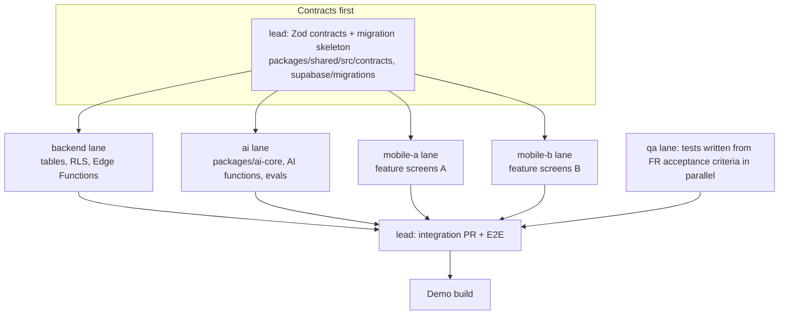

# 24 · Development Sprint Plan

> **Status:** Draft v1.0 · **Owner:** Product (Tafseer) with the Claude Code tech-lead agent · **Last updated:** 2026-10-06
>
> **Related:** `01-product-requirements.md` (FR IDs referenced by every story), `22-mvp-roadmap.md` (milestones and gates), `23-phase-2-roadmap.md`, `07-react-native-folder-structure.md`, `05-database-schema.md`, `06-api-specification.md`, `12-ai-agent-architecture.md`, `20-ci-cd-pipeline.md`, `21-testing-strategy.md`
>
> This plan turns the MVP scope into eight two-week sprints (Sprint 0 to Sprint 7) and outlines Phase 2. Every story references the functional requirements it satisfies. Story acceptance criteria are the FR acceptance criteria in `01-product-requirements.md` unless the story adds more.

## Table of contents

1. [Planning assumptions](#1-planning-assumptions)
2. [Team, roles and capacity](#2-team-roles-and-capacity)
3. [Calendar](#3-calendar)
4. [Working agreements](#4-working-agreements)
   1. [Definition of ready](#41-definition-of-ready)
   2. [Definition of done](#42-definition-of-done)
   3. [Story template](#43-story-template)
   4. [Estimation](#44-estimation)
   5. [Branching, review and release cadence](#45-branching-review-and-release-cadence)
   6. [Sprint ceremonies](#46-sprint-ceremonies)
5. [Parallelizing stories with a Claude Code agent team](#5-parallelizing-stories-with-a-claude-code-agent-team)
6. [Sprint 0: Foundations](#sprint-0-foundations)
7. [Sprint 1: Identity, households and app shell](#sprint-1-identity-households-and-app-shell)
8. [Sprint 2: Intake, assessment and knowledge base](#sprint-2-intake-assessment-and-knowledge-base)
9. [Sprint 3: Plan generation and the Today screen](#sprint-3-plan-generation-and-the-today-screen)
10. [Sprint 4: Grocery, budget, hydration, fasting, notifications](#sprint-4-grocery-budget-hydration-fasting-notifications)
11. [Sprint 5: AI chat, photo analysis, Ramadan, subscriptions](#sprint-5-ai-chat-photo-analysis-ramadan-subscriptions)
12. [Sprint 6: Growth, picky eater, autism, exports, account rights](#sprint-6-growth-picky-eater-autism-exports-account-rights)
13. [Sprint 7: Hardening, beta and launch](#sprint-7-hardening-beta-and-launch)
14. [FR coverage matrix](#14-fr-coverage-matrix)
15. [Phase 2 sprint outline](#15-phase-2-sprint-outline)

---

## 1. Planning assumptions

- One product owner (Tafseer) plus an agentic Claude Code engineering team. Two-week sprints, Monday to Friday of the following week.
- MVP = Sprint 0 (foundations) + Sprints 1 to 6 (12 weeks of build) + Sprint 7 (two weeks of hardening, beta and store submission). Public launch in Pakistan and English-speaking markets at the end of Sprint 7.
- Sprint 0 starts Monday 12 October 2026. Launch target Monday 1 February 2027. Ramadan 1448 is expected to begin around 8 February 2027 (subject to moon sighting), which is why the Ramadan planner lands in Sprint 5 so it is beta-tested before launch.
- Canonical names, enums, tables, Edge Functions and tiers come from `00-foundations.md`. Stories never invent table names; additions go through the schema owner and are recorded in `05-database-schema.md`.
- Islamic content verification (scholar review) and recipe catalog curation have long lead times and run as a parallel content track from Sprint 0, owned by the product owner with design and AI agents preparing drafts.

## 2. Team, roles and capacity

| Role (owner tag) | Who | Responsibilities |
|---|---|---|
| `PO` | Tafseer (human) | Priorities, acceptance, scholar and clinician liaison, store accounts, final copy approval |
| `lead` | Claude Code tech-lead agent | Breaks epics into stories, assigns lanes, reviews PRs, guards architecture and `00-foundations.md` conformance, merges |
| `mobile` | 2 Claude Code agents (`mobile-a`, `mobile-b`) | Expo app: screens, navigation, stores, hooks, offline, i18n |
| `backend` | 1 to 2 Claude Code agents | SQL migrations, RLS, PostgREST, non-AI Edge Functions, cron, RevenueCat, OneSignal |
| `ai` | 1 Claude Code agent | `packages/ai-core`, AI Edge Functions, prompts, evals, guardrails |
| `design` | 1 Claude Code agent + PO approval | Tokens, component specs, copy, Urdu strings with native review, illustrations brief |
| `qa` | 1 Claude Code agent | Test plans, Maestro E2E flows, RLS tests, eval runs, regression, release checklists |
| `content` | PO + external scholars, dietitian; drafts by `ai`/`design` agents | Islamic sources, recommendations, recipes, coaching tips, help articles |

**Capacity.** Planning velocity is 90 points per sprint across all agent lanes (Sprint 0: 70; Sprint 7: 60, mostly fixes). Points are relative complexity, not hours. The PO's review bandwidth is the real constraint: no more than about 25 stories reach "ready for PO acceptance" per sprint, so stories are sized 2 to 8 points and 13-point stories are split before Sprint Planning.

## 3. Calendar

| Sprint | Dates | Theme | Milestone (see `22-mvp-roadmap.md`) |
|---|---|---|---|
| Sprint 0 | 12 Oct to 23 Oct 2026 | Foundations | M0 Foundations ready |
| Sprint 1 | 26 Oct to 6 Nov 2026 | Identity, households, shell | M1 Identity and household |
| Sprint 2 | 9 Nov to 20 Nov 2026 | Intake, assessment, knowledge base | M2 Intake and assessment |
| Sprint 3 | 23 Nov to 4 Dec 2026 | Plan generation, Today | M3 First plan, internal alpha |
| Sprint 4 | 7 Dec to 18 Dec 2026 | Grocery, budget, hydration, fasting, notifications | M4 Daily loop, closed alpha |
| Sprint 5 | 21 Dec 2026 to 1 Jan 2027 | Chat, photo, Ramadan, subscriptions | M5 Closed beta |
| Sprint 6 | 4 Jan to 15 Jan 2027 | Growth, picky, autism, exports, account rights | M6 Feature complete, open beta |
| Sprint 7 | 18 Jan to 29 Jan 2027 | Hardening, beta, store submission | M7 Launch ready |
| Launch | 1 Feb 2027 | Public launch (Pakistan + English markets) | |

The PO's availability over 25 December to 1 January is reduced; Sprint 5 front-loads PO decisions (pricing, paywall copy, Ramadan content) into its first week.

## 4. Working agreements

### 4.1 Definition of ready

A story may enter a sprint only when all of these are true:

1. It has an ID (`S<sprint>-<nn>`), title, owner role, points, and at least one FR ID from `01-product-requirements.md` (or `NFR` / `TECH` tag for enabling work).
2. Acceptance criteria are testable and copied or referenced from the FR.
3. Data touched is named with canonical table, column, enum and Edge Function names from `00-foundations.md`; any addition is marked and agreed with `lead`.
4. API contract (Zod schema name and path in `packages/shared/src/contracts/`) exists or is part of the story.
5. UX: screen spec reference in `02-ux-specification.md` exists, and user-facing copy keys are listed (English draft; Urdu can follow within the sprint).
6. Dependencies are done or scheduled earlier in the same sprint with a clear hand-off point.
7. Size is 8 points or less.
8. Test approach named (unit, integration, RLS, E2E, eval).

### 4.2 Definition of done

A story is done when:

1. Code merged to `main` via PR approved by `lead` (and by `qa` for stories touching safety, payments, RLS or AI output).
2. CI green: typecheck (`tsc --noEmit` strict), ESLint (including no JSX string literals), unit tests, SQL migration test (`supabase db reset` + pgTAP RLS tests), Edge Function tests (Deno), AI eval suite if prompts or guardrails changed (`20-ci-cd-pipeline.md`).
3. Acceptance criteria demonstrated on a dev build on Android reference device class and iOS simulator or device, in `en` and `ur`.
4. Accessibility checks for new screens: labels, roles, contrast, 200 percent font scale, RTL mirroring.
5. Analytics events from FR-ANL-02 emitted where relevant, with Zod-validated props.
6. Sentry: no new unhandled errors in the dev environment for the flow.
7. Docs updated if the story changed a contract (`06-api-specification.md`) or schema (`05-database-schema.md`), via a docs PR reviewed by `lead`.
8. Feature flag added for user-visible features that may need to be dark-launched (`feature_flags`).
9. PO accepted the demo (for user-facing stories).

### 4.3 Story template

Stories live as GitHub issues using this template (`.github/ISSUE_TEMPLATE/story.md`):

```markdown
### S<sprint>-<nn> · <Title>

**Owner role:** mobile | backend | ai | design | qa | content
**Points:** 1 | 2 | 3 | 5 | 8
**FR / NFR:** FR-XXX-NN, FR-XXX-NN
**Depends on:** S<sprint>-<nn>, ...
**Parallel lane:** <lane name from section 5>

#### User story
As a <persona/role>, I want <capability> so that <outcome>.

#### Scope
- Files and paths expected to change (e.g. `apps/mobile/src/features/hydration/...`, `supabase/migrations/...`, `supabase/functions/<fn>/...`)
- Tables / enums / functions touched (canonical names only)
- Contracts: `packages/shared/src/contracts/<name>.ts`

#### Acceptance criteria
- [ ] Given ..., when ..., then ...
- [ ] (FR acceptance criteria referenced: FR-XXX-NN)

#### Test plan
- Unit: ...
- Integration / RLS: ...
- E2E (Maestro flow name): ...
- Eval (AI): ...

#### Out of scope
- ...

#### Notes for the agent
- Constraints, gotchas, links to doc sections.
```

### 4.4 Estimation

Fibonacci points (1, 2, 3, 5, 8). Reference stories:

| Points | Reference |
|---|---|
| 1 | Add a notification kind with copy keys and a preference toggle |
| 2 | A simple CRUD screen on an existing table with RLS already in place |
| 3 | A new table with RLS, pgTAP tests and a typed query hook |
| 5 | A non-AI Edge Function with Zod contract, tests and client hook |
| 8 | An AI Edge Function with prompt template, guardrails, eval set and client flow |

### 4.5 Branching, review and release cadence

| Topic | Rule |
|---|---|
| Branching | Trunk-based. `main` is always releasable to `thuluth-dev`. Short-lived branches named `<type>/<story-id>-<slug>`, for example `feat/S3-04-plan-generation-job`, `fix/S7-12-urdu-clipping`. Branches live under 3 days. |
| Commits | Conventional Commits (`feat:`, `fix:`, `chore:`, `test:`, `docs:`, `db:`), story ID in the subject: `feat(plan): S3-04 async plan generation job`. |
| Pull requests | One story per PR (split large stories into stacked PRs). PR template requires FR IDs, screenshots in `en` and `ur` for UI, migration notes, and test evidence. Max about 600 changed lines excluding generated files and snapshots. |
| Reviews | `lead` reviews every PR within 4 working hours. Second reviewer `qa` required for labels `safety`, `rls`, `payments`, `ai-output`, `migration`. The PO reviews UI and copy on the demo build, not in PR diffs. |
| Migrations | Forward-only timestamped files in `supabase/migrations/`. One migration per PR. Destructive changes need an expand-and-contract plan. Generated types (`supabase gen types`) committed in the same PR. |
| Feature flags | User-visible features ship behind `feature_flags` keys (for example `ramadan_planner`, `photo_meal_analysis`) and are enabled per environment. |
| Environments | Merge to `main` deploys migrations and Edge Functions to `thuluth-dev` and publishes an EAS Update to the `development` channel. Weekly Thursday cut to `thuluth-staging` and the `preview` channel (internal testers). Production deploys only from release tags `v<semver>` after Sprint 7 (`19-deployment-architecture.md`, `20-ci-cd-pipeline.md`). |
| Native builds | EAS Build for native changes (new native module, SDK bump, config plugin); otherwise EAS Update. A native build is cut at least every sprint for the alpha and beta tracks. |
| Hotfixes | `fix/` branch from `main`, fast-tracked review, tag patch release. |

### 4.6 Sprint ceremonies

| Ceremony | When | Who | Output |
|---|---|---|---|
| Sprint planning | Day 1, 60 min | PO, lead | Sprint goal, committed stories, lane assignment |
| Daily async stand-up | Each morning | All agents post to the sprint tracking issue | Done, doing, blocked; lead re-plans lanes |
| Mid-sprint check | Day 5 | PO, lead | Scope adjust; content track status |
| Demo | Day 10, 45 min | PO, lead, qa | Demo script (listed per sprint below) run on staging build |
| Retro | Day 10, 20 min | PO, lead | 1 to 3 process changes, recorded in the sprint issue |
| Backlog refinement | Day 7 | PO, lead | Next sprint stories meet definition of ready |

## 5. Parallelizing stories with a Claude Code agent team

### 5.1 Lane model

Each sprint is split into **lanes**: independent streams of stories that touch disjoint parts of the repository. One agent works one lane at a time, in its own git worktree, on its own short-lived branch. The `lead` agent owns the integration points.



### 5.2 Rules for parallel work

1. **Contracts first.** On day 1 of each sprint, `lead` (or `backend`) merges the Zod contracts and migration skeletons for the sprint's features. Mobile agents then build against typed mocks (MSW-style fetch mocks in `apps/mobile/test/mocks/`) while backend and AI agents implement the real thing.
2. **Disjoint file ownership.** Each lane declares its directories in the sprint issue. Shared files (`packages/shared/src/contracts/index.ts`, navigation root, `tailwind.config.js`, i18n resource roots, `supabase/seed.sql`) are edited only by `lead` or via small dedicated PRs merged first in the day.
3. **One migration at a time.** Migrations are serialized through the `backend` lane to avoid timestamp and ordering conflicts. Other lanes request schema changes by comment on the sprint issue.
4. **i18n keys by namespace.** Each feature owns its namespace file (`apps/mobile/src/i18n/locales/en/<feature>.json`, `.../ur/<feature>.json`) so parallel PRs do not conflict.
5. **Tests in parallel.** `qa` writes Maestro flows and pgTAP RLS tests from FR acceptance criteria at the same time as implementation, so tests are ready when code lands.
6. **Small PRs, frequent rebases.** Agents rebase on `main` at least twice a day; PRs over 600 lines are split.
7. **No cross-lane edits without a handshake.** If a mobile agent needs a backend change, it opens a sub-issue for the backend lane rather than editing `supabase/`.
8. **Safety review is never parallelized away.** Stories labelled `safety` or `ai-output` require `qa` evals to pass before merge, regardless of lane pressure.
9. **Blocked means switch.** A blocked agent picks the next ready story in its lane or a `qa`/docs task; it never waits idle or works around a contract.

### 5.3 Typical lane allocation

| Lane | Agent | Typical directories |
|---|---|---|
| `contracts` | lead | `packages/shared/src/contracts/`, `packages/shared/src/schemas/` |
| `db` | backend | `supabase/migrations/`, `supabase/tests/`, `supabase/seed/` |
| `edge` | backend | `supabase/functions/<non-ai-fn>/` |
| `ai` | ai | `packages/ai-core/`, `supabase/functions/ai-*/`, `supabase/functions/_shared/ai/`, `evals/` |
| `mobile-a` | mobile-a | `apps/mobile/src/features/<feature set A>/` |
| `mobile-b` | mobile-b | `apps/mobile/src/features/<feature set B>/` |
| `design` | design | `apps/mobile/src/ui/` (tokens, primitives), `docs/` copy decks, `apps/mobile/src/i18n/locales/ur/` |
| `qa` | qa | `apps/mobile/e2e/` (Maestro), `supabase/tests/`, `evals/` (shared with ai) |

Exact directory names follow `07-react-native-folder-structure.md`; if they differ, that document wins.

### 5.4 Story ordering inside a sprint

Each sprint's story table below has a **Day** column suggesting when the story starts (D1 to D10) so lanes do not block. Stories starting D1 are contracts, migrations and design specs; D3 to D7 are features; D8 to D10 are integration, E2E and demo polish.

---

## Sprint 0: Foundations

**Dates:** 12 Oct to 23 Oct 2026 · **Capacity:** 70 points · **Milestone:** M0

**Goal:** A running, deployable skeleton: monorepo, Expo app with navigation shell and design tokens, three Supabase projects with the base schema and RLS helpers, CI/CD, error monitoring, i18n with RTL, the AI provider abstraction calling one model from an Edge Function, and the content track started.

| ID | Story | Owner | Pts | FR / tag | Day | Depends on |
|---|---|---|---|---|---|---|
| S0-01 | Create pnpm + Turborepo monorepo: `apps/mobile`, `packages/shared`, `packages/ai-core`, `supabase/`; TypeScript strict and `noUncheckedIndexedAccess`; shared ESLint and Prettier | lead | 3 | TECH | D1 | |
| S0-02 | Expo app (pinned SDK, New Architecture), EAS project, dev build profiles, bundle id `app.thuluth.mobile`, scheme `thuluth` | mobile-a | 5 | TECH | D1 | S0-01 |
| S0-03 | React Navigation 7 shell: auth stack, onboarding stack, main tabs (Today, Plan, Track, Chat, More) with placeholder screens | mobile-b | 3 | TECH | D2 | S0-02 |
| S0-04 | NativeWind v4 with token preset from `03-design-system.md`; light and dark themes; base primitives (Text, Button, Card, Input, Screen) | design + mobile-a | 5 | NFR a11y | D2 | S0-02 |
| S0-05 | i18next setup with `en` and `ur` namespaces, Noto Nastaliq Urdu and Amiri fonts, RTL switch via `I18nManager`, lint rule banning JSX literals | mobile-b | 5 | FR-L10N-01, -02, -03, -09 | D3 | S0-03 |
| S0-06 | Supabase projects `thuluth-dev`, `thuluth-staging`, `thuluth-prod`; CLI config; local stack; region per Q-01 default | backend | 2 | TECH | D1 | |
| S0-07 | Base migration: all canonical enums from `00-foundations.md` section 5, `set_updated_at()` trigger, `users`, `households`, `household_members`, `is_household_member()` and `has_premium()` helpers, RLS enabled, pgTAP harness | backend | 8 | FR-HH-04, FR-SUB-05 | D2 | S0-06 |
| S0-08 | `packages/shared`: Zod contract conventions, error envelope type, generated DB types pipeline (`supabase gen types` to `packages/shared/src/db/types.ts`) | lead | 3 | TECH | D2 | S0-07 |
| S0-09 | `packages/ai-core`: provider interface for Anthropic, OpenAI, Gemini; route resolution from `ai_model_routes`; usage metering to `ai_usage`; one smoke Edge Function call via `chat.default` | ai | 8 | FR-AI-07, FR-AI-08 | D2 | S0-07 |
| S0-10 | CI: GitHub Actions for typecheck, lint, unit, `supabase db reset` + pgTAP, Deno tests, secret scan; required checks on `main` | lead | 5 | TECH | D3 | S0-01 |
| S0-11 | CD: merge to `main` deploys migrations and functions to dev; EAS Update to `development` channel | backend | 3 | TECH | D6 | S0-10 |
| S0-12 | Sentry (`thuluth-mobile`, `thuluth-edge`) with PII scrubbing; React Query + MMKV persister; Zustand + MMKV base store | mobile-a | 3 | NFR obs, offline | D5 | S0-02 |
| S0-13 | `analytics_events` table (monthly partitions), client batching module, event Zod registry skeleton; `feature_flags` table and client hook | backend + mobile-b | 5 | FR-ANL-01 | D5 | S0-07 |
| S0-14 | Content track kickoff: content schema templates (sources, recommendations, recipes) in spreadsheets mapped to tables; recruit scholar reviewers (Sunni and Shia) and a dietitian; first 20 source drafts | content (PO) | 3 | FR-ISL-09, FR-PLAN-18 | D1 | |
| S0-15 | Test strategy bootstrap: Maestro installed, first smoke flow, pgTAP example, eval runner skeleton in `evals/` | qa | 5 | TECH | D3 | S0-02, S0-07 |
| S0-16 | Design: app icon draft, splash, onboarding illustration brief, Today and Plan wireframes approved by PO | design | 3 | FR-ONB, FR-DASH | D1 | |

**Total:** 69 points.

**Dependencies:** Apple Developer, Google Play Console, RevenueCat, OneSignal and Sentry accounts created by PO on D1. AI provider keys in Supabase secrets.

**Demo:** Dev build on Android and iOS opens a tabbed shell in English and Urdu (RTL), toggles dark mode, sends a test event to `analytics_events`, and a hidden debug screen calls a smoke Edge Function that returns a model reply with an `ai_usage` row visible in Studio. CI is green on a sample PR.

**Definition of done (sprint):** All P0 tooling stories merged; staging and prod projects exist with base migration applied; M0 exit criteria in `22-mvp-roadmap.md` met.

---

## Sprint 1: Identity, households and app shell

**Dates:** 26 Oct to 6 Nov 2026 · **Capacity:** 90 points · **Milestone:** M1

**Goal:** A user can register with email OTP, Google or Apple, give consent, complete onboarding steps 1 to 4 (welcome, philosophy, household, members), invite a co-caregiver, and see their household and members, with all data protected by RLS.

| ID | Story | Owner | Pts | FR / tag | Day | Depends on |
|---|---|---|---|---|---|---|
| S1-01 | Contracts: auth profile, household, member, invitation schemas in `packages/shared` | lead | 2 | FR-AUTH, FR-HH | D1 | |
| S1-02 | Migration: `family_members`, `household_invitations`, `consents`, `audit_log`, `devices`; member and household count triggers (free 1 household, 6 members; premium unlimited, 20) | backend | 8 | FR-HH-01, -02, FR-ONB-06, FR-AUTH-05 | D1 | |
| S1-03 | `users` row creation on signup (trigger on `auth.users`), device locale, country, timezone, units default (Q-12) | backend | 3 | FR-AUTH-02 | D2 | S1-02 |
| S1-04 | Email OTP screens: email entry, 6-digit code with autofill and paste, resend countdown, errors | mobile-a | 5 | FR-AUTH-01, -02, NFR a11y 3.3.8 | D2 | S1-01 |
| S1-05 | Google sign-in (native) and Sign in with Apple (iOS), account linking by email | mobile-b | 5 | FR-AUTH-03, -04 | D2 | S1-01 |
| S1-06 | Auth session persistence in secure store; sign-out purge of caches; auth state store `useAuthStore` | mobile-a | 3 | FR-AUTH-06 | D4 | S1-04 |
| S1-07 | Consent screen and `consents` writes with versions; child-data consent hook for first minor | mobile-b | 3 | FR-AUTH-05 | D4 | S1-02 |
| S1-08 | Onboarding store `useOnboardingStore` with resumable steps; step 1 Welcome with language picker | mobile-a | 3 | FR-ONB-01 | D4 | S0-05 |
| S1-09 | Step 2 Philosophy: rule-of-thirds hadith card (Tirmidhi 2380), plate method, "children are never restricted", tradition preference | mobile-b | 3 | FR-ONB-04, FR-ISL-04 | D5 | S1-08 |
| S1-10 | Step 3 Create household: country, city, currency, timezone, optional budget (`budget_profiles`) | mobile-a | 5 | FR-HH-01, FR-GRO-07 | D5 | S1-02 |
| S1-11 | Step 4 Add members: form with DOB, sex, height, weight, activity; `life_stage` derivation in `packages/shared`; owner linked member | mobile-b | 5 | FR-HH-02, FR-ONB-05 | D6 | S1-02 |
| S1-12 | `household-invite` Edge Function: create, email (transactional provider via Supabase SMTP), accept with token; deep link handling `thuluth://invite` and universal link | backend | 5 | FR-HH-03, FR-AUTH-08 | D3 | S1-02 |
| S1-13 | Invite UI and accept flow; roles display; leave/remove member | mobile-a | 3 | FR-HH-03, -05 | D7 | S1-12 |
| S1-14 | RLS pgTAP suite for owner, caregiver, viewer across all Sprint 1 tables | qa | 5 | FR-HH-04, NFR security | D3 | S1-02 |
| S1-15 | OTP rate limit and hCaptcha configuration; abuse tests | backend | 2 | FR-AUTH-09 | D6 | |
| S1-16 | Design: onboarding screens final, Urdu copy for auth and onboarding, accessibility review | design | 5 | FR-L10N-02, FR-ONB | D1 | |
| S1-17 | Maestro flows: signup with OTP (test inbox), onboarding steps 1 to 4, invite accept | qa | 5 | FR-AUTH, FR-ONB | D6 | S1-04 |
| S1-18 | Settings skeleton: profile (locale, units, tradition), sign out | mobile-b | 3 | FR-SET-01 | D8 | S1-06 |
| S1-19 | Content track: food catalog schema migration (`ingredients`, `allergens`, `ingredient_allergens`, `budget_categories`, `regions`) and first 150 Pakistan ingredients seed with `en`/`ur` names and USDA `fdc_id` nutrients | backend + content | 8 | FR-L10N-06, FR-PLAN-18 | D3 | S0-07 |
| S1-20 | Islamic knowledge schema migration (`quran_references`, `hadith_references`, `imam_narrations`, `islamic_sources`, `source_verifications`, `scientific_evidence`, `recommendations`, `recommendation_evidence`) and a verified-only public view `islamic_sources_public` (Addition beyond 00-foundations) | backend | 5 | FR-ISL-01, -02 | D5 | S0-07 |

**Total:** 86 points.

**Dependencies:** Apple and Google sign-in credentials (PO); SMTP sender domain `thuluth.app` DNS (PO); scholar reviewers confirmed (content).

**Demo:** New user on Android signs up with email OTP, consents, picks Urdu, completes household "Usman family" in Lahore with four members (adult, adult, 8-year-old, 4-year-old), invites spouse by email; spouse accepts on iPhone with Apple sign-in and sees the household as caregiver. Show RLS test report.

**Definition of done (sprint):** M1 exit criteria; RLS suite green; onboarding resumable from any step.

---

## Sprint 2: Intake, assessment and knowledge base

**Dates:** 9 Nov to 20 Nov 2026 · **Capacity:** 90 points · **Milestone:** M2

**Goal:** Complete onboarding step 5: the full intake questionnaire (health, lifestyle, goals, special modules) with red-flag screening, and `ai-intake-assess` producing safe, deterministic targets. The verified Islamic knowledge base and retrieval are working.

| ID | Story | Owner | Pts | FR / tag | Day | Depends on |
|---|---|---|---|---|---|---|
| S2-01 | Contracts: intake schemas (household preferences, member lifestyle, health profile, goals, modules), assessment request/response | lead | 3 | 01 s.7 | D1 | |
| S2-02 | Migration: `medical_conditions`, `allergies`, `medications`, `supplements`, `food_preferences`, `food_dislikes`, `nutrition_goals`, `pregnancy_profiles`, `sensory_profiles`, `hydration_targets`, `ai_assessments`; additions `households.preferences`, `family_members.lifestyle` (if adopted in `05`) | backend | 8 | 01 s.7 | D1 | |
| S2-03 | Under-18 goal guard: DB check trigger rejecting `weight_loss`/`weight_gain` for minors; Zod mirror | backend | 2 | FR-AI-03, P2 principle | D2 | S2-02 |
| S2-04 | Intake wizard framework: per-member adaptive question engine (`packages/shared/src/intake/questions.ts`), progress and completeness score | mobile-a | 8 | FR-ONB-01, 01 s.7 | D2 | S2-01 |
| S2-05 | Health section screens: conditions search, allergies with severity, medications with interaction flags, supplements, pregnancy/breastfeeding | mobile-b | 8 | 01 s.7.3 | D3 | S2-04 |
| S2-06 | Lifestyle, goals and special modules screens (autism sensory profile, picky eater, ADHD) | mobile-a | 8 | 01 s.7.4 to 7.6 | D4 | S2-04 |
| S2-07 | Household preferences screen (cuisines, cooking time, equipment, batch cooking, shopping cadence) | mobile-b | 3 | 01 s.7.1 | D6 | S2-02 |
| S2-08 | Deterministic calculators in `packages/ai-core/src/calculators/`: Mifflin-St Jeor, child EER (parent-only), macro ranges, hydration targets with climate, pregnancy, breastfeeding uplifts | ai | 5 | FR-AI-02, FR-HYD-01 | D2 | |
| S2-09 | `ai-intake-assess` Edge Function: assemble context, run calculators, red-flag rules, LLM summary (`plan.generate` route), write `ai_assessments` and `hydration_targets` | ai | 8 | FR-AI-01, -04, -10, -12 | D4 | S2-02, S2-08 |
| S2-10 | Safety classifier and output guardrail module (`classify.safety`), child-restriction validator, disclaimer injection | ai | 5 | FR-AI-03, -04, -10 | D3 | S0-09 |
| S2-11 | Eval sets v1: 50 child-restriction prompts, 30 fiqh-ruling prompts, red-flag fixtures, Urdu set; wired into CI | qa + ai | 5 | FR-AI-03, -06, -12 | D3 | S2-10 |
| S2-12 | Knowledge retrieval: embeddings for verified `islamic_sources` and `recommendations` (`embed.knowledge`, 1536-d), `match_knowledge()` SQL function with tradition filter (Addition beyond 00-foundations unless `05`/`13` names it differently) | ai + backend | 5 | FR-ISL-02, -04, FR-AI-05 | D5 | S1-20 |
| S2-13 | Content load v1: 40 verified sources, 30 recommendations, 30 scientific evidence rows; adab set (FR-ISL-07); recommendation completeness check job | content + backend | 5 | FR-ISL-01, -07, -09 | D5 | S1-20 |
| S2-14 | Source detail sheet and recommendation card component (source, science, action) with grade and tradition labels | mobile-b | 5 | FR-ISL-01, -03, FR-CHAT-09 | D7 | S2-13 |
| S2-15 | Assessment results screen: per-member summary, risk flags with clinician card, children's guidance collapsed (Q-08) | mobile-a | 3 | FR-AI-01, -04, FR-ONB-07 | D8 | S2-09 |
| S2-16 | Recipe catalog migration (`recipes`, `recipe_ingredients`, `meals`, `portions`, `meal_alternatives`, `seasonal_produce`) and first 100 recipes seeded with computed `per_serving_nutrition` | backend + content | 8 | FR-PLAN-13, -18 | D3 | S1-19 |
| S2-17 | Maestro flows: full intake for the Usman fixture household; red-flag fixture (insulin + fasting intent) | qa | 3 | FR-ONB-07 | D8 | S2-06 |

**Total:** 92 points.

**Demo:** Complete intake for the Usman family: Usman's weight-loss goal and moderate activity, Ibrahim's picky-eater module with accepted foods, Maryam's autism sensory profile with safe foods, Hina's breastfeeding module. Run assessment: show Usman's TDEE (2,711 kcal for the fixture), no kcal targets on children's screens, Hina's raised hydration target. Show a red-flag fixture producing a clinician card. Open a hadith card in Urdu with grade and grader.

**Definition of done (sprint):** M2 exit criteria; eval suite passes 100 percent on child-restriction and red-flag sets.

---

## Sprint 3: Plan generation and the Today screen

**Dates:** 23 Nov to 4 Dec 2026 · **Capacity:** 90 points · **Milestone:** M3 (internal alpha)

**Goal:** Onboarding step 6 produces a real weekly family plan with per-member portions and adaptations; users see Today, browse the plan and recipes, log meal status, swap and (premium-gated) adjust meals. Internal alpha starts with the PO's own family.

| ID | Story | Owner | Pts | FR / tag | Day | Depends on |
|---|---|---|---|---|---|---|
| S3-01 | Contracts: plan generation, adjustment, swap; plan read models | lead | 2 | FR-PLAN | D1 | |
| S3-02 | Migration: `meal_plans`, `daily_meals`, `daily_meal_servings`, `plan_recommendations`; Realtime on `meal_plans.status`; plan limit trigger (free 1 active) | backend | 5 | FR-PLAN-01, -02, -04, -05 | D1 | |
| S3-03 | Planning engine core in `packages/ai-core/src/planning/`: candidate selection from catalog with hard constraints (allergens, halal, dislikes, medications), budget and seasonal scoring, plate split validator, child-serving rules | ai | 8 | FR-PLAN-06, -07, -09, -10, FR-AUT-01, FR-PCK-06 | D1 | S2-16 |
| S3-04 | `ai-generate-plan` Edge Function: async job (status `generating`), LLM composition over candidates (`plan.generate`), validators, writes plan rows, rationale, recommendations; failure path | ai | 8 | FR-PLAN-01, -03, -15, FR-AI-05 | D3 | S3-02, S3-03 |
| S3-05 | Free-tier template plans: 8 curated weekly templates (Pakistan, budget tiers 1 to 3) and light personalisation path via `plan.adjust`; first plan uses `plan.generate` (Q-02) | ai + content | 5 | FR-PLAN-02 | D3 | S3-03 |
| S3-06 | Property-based plan validation test: 500 generated plans with zero allergen or haram violations | qa | 5 | FR-PLAN-06 | D4 | S3-03 |
| S3-07 | Step 6 First plan: generation progress screen with educational cards, Realtime status, template fallback | mobile-a | 5 | FR-ONB-02, -08 | D4 | S3-01 |
| S3-08 | Plan tab: week view, day view, per-member servings, adaptation badges, "Why this plan" rationale | mobile-b | 8 | FR-PLAN-04, -05, -15 | D3 | S3-01 |
| S3-09 | Recipe detail: scaled ingredients, steps, nutrition, badges (kid, autism, Sunnah), linked recommendations | mobile-a | 5 | FR-PLAN-13, FR-ISL-08 | D6 | S2-16 |
| S3-10 | Thuluth guidance component per meal (adult and child variants) with snapshot tests | mobile-b | 3 | FR-PLAN-08 | D6 | S0-04 |
| S3-11 | Today dashboard v1: header, next meal, today's meals, quick log, tip of the day, offline from cache | mobile-a | 8 | FR-DASH-01, -02, -04, -06, -08 | D6 | S3-08 |
| S3-12 | Meal status logging per member and bulk; acceptance score picker for children | mobile-b | 5 | FR-TRK-01, -04 | D7 | S3-08 |
| S3-13 | Swap meal from `meal_alternatives` (free) and AI suggestions (premium flag) | mobile-b + backend | 3 | FR-PLAN-12 | D8 | S3-08 |
| S3-14 | `ai-adjust-plan` Edge Function: natural-language change to new plan version, history preserved, premium gate | ai | 8 | FR-PLAN-11 | D5 | S3-04 |
| S3-15 | Outbox for offline writes (meal status, later hydration and fasting) with idempotency keys | mobile-a | 5 | NFR offline | D3 | S0-12 |
| S3-16 | Recipe catalog to 200 verified recipes; `meal_alternatives` for autism and picky reasons | content | 3 | FR-PLAN-18, FR-AUT-05 | D1 | |
| S3-17 | Internal alpha build (EAS internal distribution) and alpha feedback form | qa + lead | 2 | | D9 | |

**Total:** 88 points.

**Demo:** The Usman family completes onboarding; a 7-day plan appears within 90 s. Show Monday dinner (chicken karahi with roti and kachumber): Usman's adult portion with plate split, Ibrahim's serving with the week's exposure food beside a safe side, Maryam's deconstructed presentation with a safe food. Swap Tuesday lunch; adjust "Guests Friday" on a premium test account to version 2. Turn off network and show Today still works and logs queue.

**Definition of done (sprint):** M3 exit criteria; plan validator property tests green; PO's family uses the alpha daily.

---

## Sprint 4: Grocery, budget, hydration, fasting, notifications

**Dates:** 7 Dec to 18 Dec 2026 · **Capacity:** 90 points · **Milestone:** M4 (closed alpha, 20 families)

**Goal:** Close the daily loop: grocery lists priced from the Lahore, Karachi and Islamabad price books with budget dashboard, hydration and fasting trackers, and reliable notifications.

| ID | Story | Owner | Pts | FR / tag | Day | Depends on |
|---|---|---|---|---|---|---|
| S4-01 | Contracts: grocery generate, budget, hydration, fasting | lead | 2 | | D1 | |
| S4-02 | Migration: `grocery_lists`, `shopping_items`, `budget_entries`, `price_profiles`, `price_observations`, `hydration_logs`, `fasting_logs` (unique member + date), `weight_tracking`, `nutrition_journal`, `notifications`, `notification_preferences` | backend | 5 | FR-GRO, FR-HYD, FR-FAST, FR-NOT | D1 | |
| S4-03 | Price books seed: Lahore, Karachi, Islamabad October 2026 prices (from the reference Lahore basket), Punjab `seasonal_produce` | content + backend | 5 | FR-GRO-03, FR-PLAN-10 | D1 | S4-02 |
| S4-04 | `grocery-generate` Edge Function: aggregate, unit conversion to purchase units, price estimate, fresh vs staple split, premium optimisation with substitutions | backend | 8 | FR-GRO-01, -03, -04, -05 | D2 | S4-02 |
| S4-05 | Grocery list UI: grouped list, check-off offline, manual items, share as text, actual price entry | mobile-a | 5 | FR-GRO-02, -06, -11 | D3 | S4-01 |
| S4-06 | `prices-refresh` cron with outlier rejection; user-reported observations | backend | 3 | FR-GRO-06 | D6 | S4-02 |
| S4-07 | Budget settings and dashboard: month to date, forecast, categories, cost per person per day | mobile-b | 5 | FR-GRO-07, -08, -09 | D4 | S4-02 |
| S4-08 | Hydration tracker: member rings, quick sizes, beverage and timing, kid cup view, schedule from `hydration_targets` | mobile-a | 5 | FR-HYD-02, -03, -04, FR-DASH-03 | D5 | S4-02 |
| S4-09 | Dehydration symptom check and red-flag sheet | mobile-b | 2 | FR-HYD-05 | D7 | S4-08 |
| S4-10 | Prayer times module in `packages/shared/src/prayer/` (calculation methods per Q-05) with reference tests | backend | 3 | FR-FAST-05 | D2 | |
| S4-11 | Fasting tracker: log fasts by kind, Ramadan grid, exemptions with privacy, qada counter, child age rules, safety blocks | mobile-b | 8 | FR-FAST-01, -02, -03, -06, -07 | D3 | S4-10 |
| S4-12 | OneSignal integration: device registration (`devices`), external id, permission pre-prompt after first plan | mobile-a | 3 | FR-NOT-01 | D3 | |
| S4-13 | `notifications-dispatch` cron: due reminders by kind, quiet hours, daily cap, lock-screen-safe templates, deep links | backend | 8 | FR-NOT-02, -04, -05, -06 | D4 | S4-02, S4-12 |
| S4-14 | Notification preferences screen and in-app inbox | mobile-a | 3 | FR-NOT-02, -03 | D8 | S4-13 |
| S4-15 | Voluntary fast reminders (Monday/Thursday, Ayyam al-Bid via Hijri calendar, Arafah, Ashura) | backend | 3 | FR-FAST-04 | D7 | S4-13 |
| S4-16 | Adult weight log and nutrition journal | mobile-b | 5 | FR-TRK-05, -06 | D8 | S3-02 |
| S4-17 | E2E: grocery from plan, offline check-off sync, hydration log offline, fast logging, notification deep links | qa | 5 | | D7 | |
| S4-18 | Closed alpha onboarding for 20 Lahore families; feedback triage board | lead + PO | 2 | | D9 | |
| S4-19 | Urdu copy pass for Sprints 3 and 4 features with native reviewer | design | 3 | FR-L10N-02 | D5 | |

**Total:** 83 points.

**Demo:** Generate the grocery list for the Usman plan: estimated total within ±10 percent of the reference basket for the week; switch budget to hard cap and show substitutions (premium). Log water for Maryam offline in cups, reconnect, and see the ring update. Log a Monday fast for Usman; show the qada counter after logging a Ramadan exemption in a past-year fixture. Receive a `water_pre_meal` push 25 minutes before lunch that deep links to the hydration screen.

**Definition of done (sprint):** M4 exit criteria; notifications on-time rate at least 99 percent in staging over 3 days.

---

## Sprint 5: AI chat, photo analysis, Ramadan, subscriptions

**Dates:** 21 Dec 2026 to 1 Jan 2027 · **Capacity:** 90 points · **Milestone:** M5 (closed beta, 100 families)

**Goal:** The AI consultant is live (text, voice, photo, memory, tools, citations), photo meal logging works, the full Ramadan planner is ready for Ramadan 1448, and premium can be purchased with server-enforced entitlements.

| ID | Story | Owner | Pts | FR / tag | Day | Depends on |
|---|---|---|---|---|---|---|
| S5-01 | Contracts: chat SSE events, tool calls, transcribe, meal analysis, Ramadan generate | lead | 2 | | D1 | |
| S5-02 | Migration: `chat_sessions`, `chat_messages`, `ai_memories` (pgvector index), `meal_logs`, `ramadan_plans`, `subscriptions`; storage buckets `chat-attachments`, `meal-photos` | backend | 5 | FR-CHAT, FR-TRK, FR-RAM, FR-SUB | D1 | |
| S5-03 | `ai-chat` Edge Function: SSE streaming, context snapshot, tools (read plan, log meal, log water, swap, adjust plan, add grocery item, search knowledge, recall memory), quotas by tier, cost ceiling | ai | 8 | FR-CHAT-01, -02, -05, -06, FR-AI-09 | D1 | S5-02 |
| S5-04 | Grounded citations and crisis templates with country emergency numbers; follow-up chips | ai | 5 | FR-CHAT-07, -09, -10, FR-AI-05 | D3 | S5-03 |
| S5-05 | Chat UI: sessions list, streaming bubbles, citation chips, tool confirmation cards, quota indicator, feedback | mobile-a | 8 | FR-CHAT-01, -06, -07, -09, -11, -12 | D2 | S5-01 |
| S5-06 | `ai-transcribe` and voice recording UI (2 min max, transcript edit) | ai + mobile-b | 5 | FR-CHAT-03 | D4 | S5-03 |
| S5-07 | `ai-analyze-meal` Edge Function: image downscale, vision route, food and portion estimate, Thuluth feedback with child-safe variant | ai | 8 | FR-TRK-03, FR-CHAT-04 | D2 | S5-02 |
| S5-08 | Photo meal log UI: capture, analysis result, correction, save to `meal_logs`; free trial of 3 (Q-09) | mobile-b | 5 | FR-TRK-02, -03 | D5 | S5-07 |
| S5-09 | Long-term memory: extraction after turns, recall by similarity, memory management screen | ai + mobile-a | 5 | FR-CHAT-08, FR-SET-04 | D6 | S5-03 |
| S5-10 | `ramadan-generate` Edge Function: prayer-time schedule, suhoor/iftar/taraweeh-snack slots, member participation, pregnancy and breastfeeding adjustments, linked `meal_plans` (`kind = 'ramadan'`) | ai + backend | 8 | FR-RAM-02, -03, -04 | D2 | S4-10 |
| S5-11 | Ramadan planner UI: setup (start date confirm, participation per member), schedule, Ramadan Today variant with iftar countdown; free tips view | mobile-b | 5 | FR-RAM-01, -05, -07, FR-DASH-01 | D6 | S5-10 |
| S5-12 | Ramadan notifications (`suhoor`, `iftar`) and Ramadan grocery handling | backend | 3 | FR-RAM-05, -06 | D7 | S5-10 |
| S5-13 | RevenueCat SDK, products, paywall with comparison table, restore, contextual upsell triggers | mobile-a | 5 | FR-SUB-01, -03, -04 | D3 | |
| S5-14 | `revenuecat-webhook` and `has_premium()` wiring into all gated functions; downgrade behaviour; shared household premium | backend | 5 | FR-SUB-01, -05, -06, FR-HH-06 | D2 | S5-02 |
| S5-15 | Evals v2: chat grounding (no unverified citations), crisis prompts, meal analysis child feedback, Ramadan safety fixtures | qa + ai | 5 | FR-AI-05, FR-CHAT-10, FR-FAST-07 | D4 | |
| S5-16 | Content: 20 Ramadan recommendations verified, 40 `ramadan_suitable` recipes, crisis copy reviewed by clinician | content | 3 | FR-RAM-01, FR-PLAN-18 | D1 | |
| S5-17 | Closed beta: TestFlight external group (beta review), Play closed testing, 100 families recruited | lead + PO | 2 | | D8 | |

**Total:** 87 points.

**Demo:** In Urdu, ask by voice "آج رات کے کھانے میں کیا ہے اور کیا مریم کھا سکتی ہے؟" and receive a streamed answer naming tonight's meal and Maryam's adaptation with a cited adab chip. Photograph a plate of biryani and save the corrected log. Generate a Ramadan plan for the Usman family: Usman and Hina fasting (Hina breastfeeding, choice recorded), Ibrahim weekend practice fasts, Maryam normal meals. Purchase annual premium in sandbox and see voice unlock; cancel and see read-only downgrade.

**Definition of done (sprint):** M5 exit criteria; grounding eval 100 percent; purchase flows pass on both stores' sandboxes.

---

## Sprint 6: Growth, picky eater, autism, exports, account rights

**Dates:** 4 Jan to 15 Jan 2027 · **Capacity:** 90 points · **Milestone:** M6 (feature complete, open beta 500)

**Goal:** Every MVP feature is complete: growth tracking with WHO percentiles, picky-eater and autism modules, PDF exports, help center, data export and account deletion, analytics dashboards.

| ID | Story | Owner | Pts | FR / tag | Day | Depends on |
|---|---|---|---|---|---|---|
| S6-01 | Contracts: growth compute, export, account export/delete | lead | 2 | | D1 | |
| S6-02 | Migration: `growth_tracking`, `growth_reference_lms` (WHO 2006, WHO 2007, CDC 2000 seed), `food_exposures`, `exposure_ladders`, `exposure_ladder_steps`, `coaching_tips`, `exports` | backend | 5 | FR-GRW, FR-PCK, FR-AUT, FR-EXP | D1 | |
| S6-03 | `growth-compute` Edge Function: LMS z-scores, percentiles, alerts (two-line crossing, below 3rd, above 97th), red-flag plan pause | backend | 5 | FR-GRW-02, -04 | D2 | S6-02 |
| S6-04 | Growth UI: log measurement, latest value (free), percentile chart with bands and history (premium), reminders | mobile-a | 8 | FR-GRW-01, -03, -05 | D3 | S6-03 |
| S6-05 | Picky eater: Division of Responsibility guide with scripts (en/ur), exposure log, weekly exposure pair in plan, acceptance analytics, new-food progression | mobile-b + ai | 8 | FR-PCK-01 to -05, -07 | D2 | S6-02 |
| S6-06 | Autism: safe-food list (free), sensory profile editor, exposure ladders, food chaining suggestions, visual "first, then" cards | mobile-a + ai | 8 | FR-AUT-01 to -08 | D5 | S6-02 |
| S6-07 | Coaching tips content: 40 tips across picky, autism, ramadan, general, age-banded, each linked to evidence | content | 3 | FR-AUT-07, FR-PCK-01 | D1 | |
| S6-08 | `export-pdf` Edge Function: HTML templates for `meal_plan`, `grocery_list`, `growth_report` in en and ur (RTL), A4 and Letter, signed URL 24 h | backend | 8 | FR-EXP-01 to -04 | D2 | S6-02 |
| S6-09 | Export UI and share sheet | mobile-b | 2 | FR-EXP-05 | D7 | S6-08 |
| S6-10 | `account-export` and `account-delete` Edge Functions with 30-day grace, OTP confirmation, anonymisation | backend | 5 | FR-SET-05, -06, FR-EXP-06 | D4 | |
| S6-11 | Privacy settings: consents withdraw, analytics opt-out, delete account path (3 taps) | mobile-b | 3 | FR-SET-03, FR-AUTH-07, FR-ANL-04 | D8 | S6-10 |
| S6-12 | Help center: 30 articles en and ur bundled, search, contact support with diagnostic bundle, About screen with reviewers | mobile-a + design | 5 | FR-HELP-01 to -03 | D6 | |
| S6-13 | `analytics-rollup` materialized views for KPIs and admin read views; premium Insights screen | backend + mobile-b | 5 | FR-ANL-03, -05 | D5 | S0-13 |
| S6-14 | Report-a-source flow and admin queue view | mobile-a + backend | 3 | FR-ISL-10 | D8 | |
| S6-15 | Periodic reassessment cron (4-weekly) and "targets updated" diff | ai | 3 | FR-AI-11 | D6 | S2-09 |
| S6-16 | Content gate: 60 recommendations, 80 sources, 60 evidence rows verified; 250 recipes verified | content | 3 | FR-ISL-09, FR-PLAN-18 | D1 | |
| S6-17 | E2E regression suite complete for all MVP flows; accessibility audit pass 1 | qa | 8 | NFR a11y | D5 | |
| S6-18 | Open beta: Play open testing and TestFlight public link, 500 families | lead + PO | 2 | | D9 | |

**Total:** 86 points.

**Demo:** Log Ibrahim's height and weight and show his WHO 2007 percentile chart; enter a fixture that crosses two percentile lines and show the paediatrician alert and plan pause. Walk the Division of Responsibility guide in Urdu; log a guava exposure. Build an exposure ladder for Maryam from "plain roti" toward "aloo paratha" with food chaining steps. Export the week's meal plan PDF in Urdu and share to WhatsApp. Request account deletion and cancel within the grace period.

**Definition of done (sprint):** M6 exit criteria: feature complete, all FRs marked M in `01-product-requirements.md` implemented behind flags, content gate passed.

---

## Sprint 7: Hardening, beta and launch

**Dates:** 18 Jan to 29 Jan 2027 · **Capacity:** 60 points (plus bug buffer) · **Milestone:** M7 (launch ready)

**Goal:** Ship a stable, fast, accessible, store-approved v1.0 with production infrastructure, monitoring and a launch-day runbook, in time for Ramadan 1448.

| ID | Story | Owner | Pts | FR / tag | Day | Depends on |
|---|---|---|---|---|---|---|
| S7-01 | Performance pass: cold start, list virtualization, image caching, bundle size; meet section 9.1 budgets on reference devices | mobile-a | 5 | NFR perf | D1 | |
| S7-02 | AI cost and latency pass: prompt caching, Haiku intent routing, response caps; verify per-user ceilings and per-MAU targets on beta data | ai | 5 | NFR 9.8, FR-AI-09 | D1 | |
| S7-03 | Security: pen test (external or structured internal), RLS audit, secret scan, storage policy review, MASVS L1 checklist | backend + qa | 5 | NFR security | D1 | |
| S7-04 | Accessibility audit pass 2 (WCAG 2.2 AA) and fixes; autism-friendly mode check | design + mobile-b | 5 | NFR a11y | D2 | |
| S7-05 | Urdu final QA by native reviewer on all screens and PDFs | design | 3 | FR-L10N | D2 | |
| S7-06 | Production environment: `thuluth-prod` migrations, secrets, backups and PITR, OneSignal prod app, RevenueCat production, Sentry alerts, status checks | backend | 5 | NFR 9.7 | D1 | |
| S7-07 | Store listings: screenshots in en and ur, descriptions, keywords, privacy nutrition labels, Play data safety form, health-app review notes, demo account | PO + design | 5 | 22 launch checklist | D1 | |
| S7-08 | App Store and Play submission (target submit D3), respond to review | PO + lead | 3 | | D3 | S7-07 |
| S7-09 | Beta bug burn-down: all Sev-1 and Sev-2 fixed; Sev-3 triaged | all | 13 | | D1 | |
| S7-10 | Safety release gate: full eval suite, red-team session with PO and clinician, child-restriction zero violations | qa + ai | 3 | FR-AI-03, -04 | D4 | |
| S7-11 | Launch runbook, on-call rota for agents and PO, incident templates, rollback via EAS Update channel pinning | lead | 2 | | D6 | |
| S7-12 | Analytics launch dashboard and KPI alerts (activation funnel, crash-free, AI cost) | backend | 3 | FR-ANL-03 | D5 | |
| S7-13 | Release v1.0.0 tag, production builds, phased release (iOS) and staged rollout (Android 20 percent then 100 percent) | lead | 2 | | D9 | S7-08 |

**Total:** 59 points.

**Demo (launch readiness review):** Production build installed from the stores' review tracks; walk the full journey for the Usman family on a fresh production account; show dashboards: crash-free 99.5 percent+ in beta, AI cost per MAU, notification on-time rate; review the launch checklist in `22-mvp-roadmap.md` item by item.

**Definition of done (sprint):** M7 exit criteria and all launch success gates in `22-mvp-roadmap.md` met; go/no-go recorded by PO.

---

## 14. FR coverage matrix

| FR group | Sprint(s) |
|---|---|
| FR-AUTH | S1 (01 to 06, 08, 09), S6 (07) |
| FR-ONB | S1 (01, 04 to 06), S2 (07), S3 (02, 08) |
| FR-L10N | S0 (01 to 03, 09), S1 to S6 (copy), S7 (final) |
| FR-HH | S0 (04), S1 (01 to 05), S5 (06) |
| FR-AI | S0 (07, 08), S2 (01 to 06, 10, 12), S3 (05), S5 (09), S6 (11), S7 (09 verify) |
| FR-PLAN | S2 (13, 18 partial), S3 (01 to 16, 18), S4 (17 optional) |
| FR-ISL | S1 (01, 02 schema, 04), S2 (01 to 09 content), S3 (08), S6 (09 gate, 10) |
| FR-GRO | S1 (07), S4 (01 to 11) |
| FR-HYD | S2 (01), S4 (02 to 06) |
| FR-FAST | S4 (01 to 08) |
| FR-TRK | S3 (01, 04), S4 (05, 06), S5 (02, 03), S6 (07) |
| FR-GRW | S6 (01 to 06) |
| FR-AUT | S3 (01, 05), S6 (01 to 08) |
| FR-PCK | S3 (06), S6 (01 to 07) |
| FR-RAM | S5 (01 to 07), S6 (08 if time) |
| FR-DASH | S3 (01, 02, 04, 06, 08), S4 (03, 05), S5 (01 Ramadan variant), S6 (05, 07) |
| FR-CHAT | S5 (01 to 12) |
| FR-NOT | S4 (01 to 06) |
| FR-EXP | S6 (01 to 06) |
| FR-SUB | S0 (05 helper), S5 (01 to 07), S7 (08 prices) |
| FR-ANL | S0 (01), each sprint (02 events), S6 (03 to 05), S7 (dashboards) |
| FR-SET, FR-HELP | S1 (SET-01), S5 (SET-04), S6 (SET-02, -03, -05, -06, HELP-01 to -03) |

Should-priority items (FR-PLAN-17, FR-GRO-10, FR-HYD-06, FR-FAST-08, FR-TRK-07, FR-EXP-03 beyond growth report, FR-RAM-08, FR-SUB-07, FR-CHAT-12) are pulled in when a sprint finishes early; otherwise they move to Phase 2 Sprint P2-1.

## 15. Phase 2 sprint outline

Phase 2 starts the week after launch (Sprint P2-0 begins 1 February 2027, overlapping launch support and Ramadan). Themes and rationale are in `23-phase-2-roadmap.md`; this is the summarized sprint sequence. Sprint numbering continues as P2-n with the same cadence and working agreements.

| Sprint | Dates (planned) | Goal | Key epics (from `23-phase-2-roadmap.md`) | Trigger / gate |
|---|---|---|---|---|
| P2-0 | 1 Feb to 12 Feb 2027 | Launch stabilization and Ramadan support | Hotfixes, Ramadan load monitoring, should-priority carry-overs | Launch |
| P2-1 | 15 Feb to 26 Feb 2027 | Ramadan learnings and quick wins | Remaining PDF exports (Ramadan pack, nutrition report, family summary), FR should-items, onboarding funnel fixes | Activation below target triggers funnel work first |
| P2-2 | 1 Mar to 12 Mar 2027 | Arabic locale foundations | E1 Arabic locale (`ar`) RTL, translation memory, Arabic AI evals; Eid transition | Non-PK installs above 25 percent |
| P2-3 | 15 Mar to 26 Mar 2027 | GCC and UK price books | E2 UAE, Saudi, UK price books, seasonal produce, currency formatting | Arabic shipped; UAE/UK MAU thresholds in `23` |
| P2-4 | 29 Mar to 9 Apr 2027 | Barcode and wearables | E6 barcode scanning with halal flags, E5 Apple Health and Health Connect (weight, activity, water) | Feature request votes |
| P2-5 | 12 Apr to 23 Apr 2027 | Coach accounts part 1 | E3 `coach` role, client roster, plan approval gate, coach consent | 50+ coach waitlist |
| P2-6 | 26 Apr to 7 May 2027 | Coach accounts part 2 and billing | Coach dashboard, `thuluth_family_coach_monthly`, coach analytics | P2-5 pilot NPS |
| P2-7 | 10 May to 21 May 2027 | Offline-first sync expansion | E10 local database sync for plans and logs, conflict resolution | Offline error rate threshold |
| P2-8 | 24 May to 4 Jun 2027 | North America price books and more locales | US, Canada price books; French, Turkish, Malay, Indonesian, Bengali (phased) | Market thresholds |
| P2-9 | 7 Jun to 18 Jun 2027 | Madrasa group plans | E4 group plans, cohort portions, bulk grocery, donor report | 5 committed pilot institutions |
| P2-10 | 21 Jun to 2 Jul 2027 | Family coaching programs and advanced analytics | E7 programs (8-week picky-eater, weight journey), E8 advanced insights | Premium retention data |
| P2-11 | 5 Jul to 16 Jul 2027 | Partner price feeds | E9 grocery partner feeds (`price_source = 'partner_feed'`) | Signed partner |
| P2-12 | 19 Jul to 30 Jul 2027 | Web companion v1 | E11 web app (plan, grocery, exports, coach dashboard) | Coach demand |
| P2-13+ | Aug 2027 onward | Multi-agent architecture | E12 per `25-future-multi-agent-architecture.md` | AI cost and quality metrics |

Phase 2 sprints keep the lane model of section 5; coach and madrasa work adds a `web` lane once the web companion begins.
