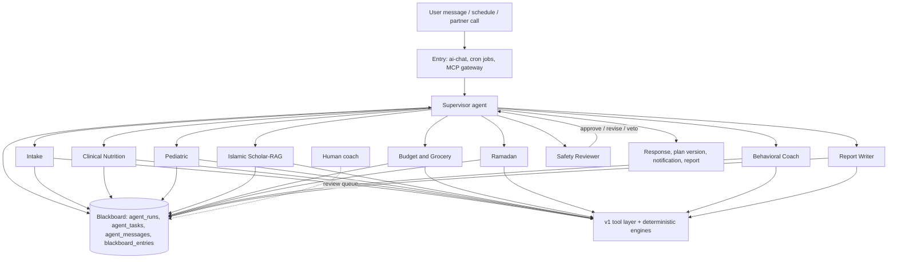
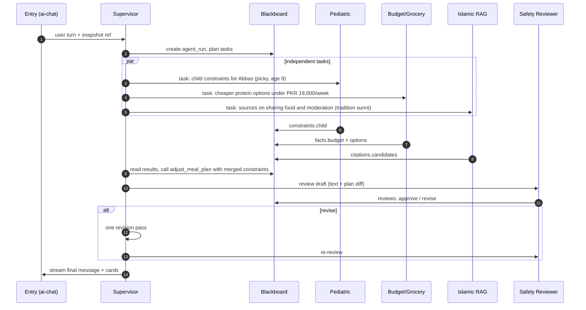
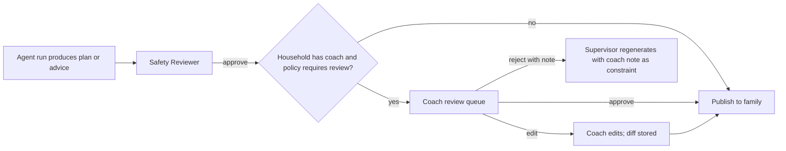
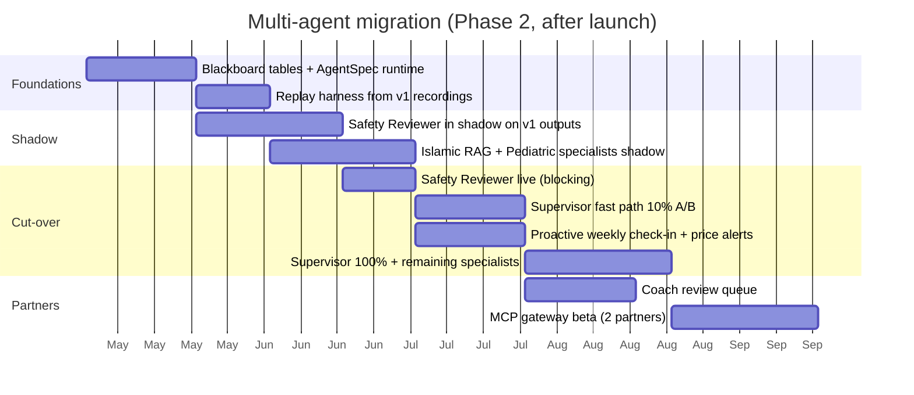

# 25 · Future Multi-Agent Architecture

> **Status:** Forward-looking design (Phase 2), with v1 obligations in section 12 · **Owner:** AI Platform · **Deliverable:** 20. Future Multi-Agent Architecture
>
> **Related:** `00-foundations.md`, `12-ai-agent-architecture.md` (v1 single orchestrator, engines, tools, guardrails), `13-islamic-knowledge-module.md`, `14-meal-planning-and-grocery.md`, `15-family-health-modules.md`, `16-security-architecture.md`, `17-subscription-architecture.md`, `22-mvp-roadmap.md`, `23-phase-2-roadmap.md`, `24-sprint-plan.md`

---

## Table of contents

1. [Why evolve, and why not yet](#1-why-evolve-and-why-not-yet)
2. [Target architecture](#2-target-architecture)
3. [Specialist agents](#3-specialist-agents)
4. [Supervisor pattern](#4-supervisor-pattern)
5. [Handoff protocol and shared blackboard in Postgres](#5-handoff-protocol-and-shared-blackboard-in-postgres)
6. [Agent-to-agent message schema](#6-agent-to-agent-message-schema)
7. [Proactive agents](#7-proactive-agents)
8. [Coach-in-the-loop](#8-coach-in-the-loop)
9. [MCP server exposure for partners](#9-mcp-server-exposure-for-partners)
10. [Evaluation](#10-evaluation)
11. [Cost and latency trade-offs](#11-cost-and-latency-trade-offs)
12. [What v1 must build now](#12-what-v1-must-build-now)
13. [Migration plan from v1](#13-migration-plan-from-v1)
14. [Risks and mitigations](#14-risks-and-mitigations)
15. [Acceptance criteria for the Phase 2 cut-over](#15-acceptance-criteria-for-the-phase-2-cut-over)
16. [Additions beyond 00-foundations](#16-additions-beyond-00-foundations)

---

## 1. Why evolve, and why not yet

v1 uses one orchestrator model with tools over deterministic engines (`12-ai-agent-architecture.md`). That is the right choice for launch: one prompt to evaluate, one safety surface, lowest latency, lowest cost. It will hit limits as the product grows:

| Pressure (Phase 2) | Symptom in a single orchestrator | Multi-agent answer |
|---|---|---|
| More modules (coach programs, madrasa group plans, wearables, barcode) | System prompt and tool list grow past the point where tool selection stays reliable (more than about 25 tools) | Specialists with small, focused tool sets |
| Proactive features (weekly check-ins, price alerts, growth reminders) | Nothing runs without a user message | Scheduled agents with their own triggers and budgets |
| Long-form outputs (monthly family report, coach summaries) | Chat model writes long documents poorly within turn limits | Report Writer agent with its own route and templates |
| Higher safety bar for clinical-adjacent advice | One model both plans and judges itself | Independent Safety Reviewer agent with veto power |
| Partners (clinics, coaches, grocers) | No stable machine interface | MCP server over the same tool layer |
| Per-domain quality tuning | Changing one behaviour risks all others | Per-agent prompts, evals and routes |

Principle: **add agents only where a measured problem exists.** Each specialist must beat the v1 orchestrator on its eval suite, or reduce cost or latency at equal quality, before it takes traffic (section 13).

---

## 2. Target architecture



What does not change from v1:

- Deterministic engines remain the only source of numbers, constraints and citations (`12-ai-agent-architecture.md` section 3).
- All provider calls go through `packages/ai-core` (router, fallback, metering, structured output). Each agent is a configuration of the same agent loop, not a new framework.
- Edge Functions in `00-foundations.md` section 7 remain the entry points. Agents run inside them (and inside scheduled invocations of them); there is no separate agent server in Phase 2's first iteration.
- Guardrails stay deterministic first. The Safety Reviewer is an additional layer, not a replacement for the validators.

---

## 3. Specialist agents

Each agent is defined by an `AgentSpec` (section 6.1): prompt key, route key, allowed tools, blackboard read and write scopes, budget, and output schema.

| Agent | Purpose | Tools (from the v1 catalog unless marked new) | Blackboard writes | Route (default) | Output |
|---|---|---|---|---|---|
| **Intake** | Find missing or contradictory profile data, ask focused questions, propose profile updates | `get_household_snapshot`, `calculate_energy_needs`, new `propose_profile_update` | `facts.profile_gaps`, `facts.proposed_updates` | `classify.intent`-class small model for gap detection, `chat.default` for questions | Questions (max 2) or structured update proposals |
| **Clinical Nutrition** | Adult targets, conditions, medication-food interactions, pregnancy and lactation nutrition | `calculate_energy_needs`, `search_meals`, `estimate_cost`, `compute_hydration_target` | `facts.targets`, `constraints.medical` | `plan.adjust` (Sonnet-class) | Targets rationale and medical constraints for the planner |
| **Pediatric** | Child growth context, complementary feeding, age-appropriate textures and choking safety, rhythm framing | `get_growth_status`, `calculate_energy_needs`, `search_meals` | `facts.child_status`, `constraints.child` | `plan.adjust` | Child constraints; red flags raised to Safety Reviewer |
| **Islamic Scholar-RAG** | Retrieve verified sources by tradition and select recommendation codes | `search_islamic_sources` | `citations.candidates` | `classify.intent`-class model for query rewriting; no long generation | Ranked source codes and recommendation codes; never free text scripture |
| **Budget and Grocery** | Cost optimisation, substitutions, purchase cadence, price trend use | `estimate_cost`, `build_grocery_list`, new `get_price_trends` | `facts.budget`, `artifacts.grocery_draft` | `plan.adjust` | Grocery draft, savings options |
| **Ramadan** | Suhoor and iftar schedule, participation rules, hydration redistribution | `plan_ramadan`, `compute_hydration_target` | `artifacts.ramadan_draft` | `plan.adjust` | Ramadan plan draft |
| **Behavioral Coach** | Picky eating and autism support, exposure ladders, parent coaching tone | `create_exposure_ladder`, `search_meals`, `log_meal` | `artifacts.ladders`, `facts.acceptance_trends` | `chat.default` | Coaching messages and ladder changes |
| **Safety Reviewer** | Independent review of every user-facing draft and plan; can veto | No write tools; read-only `get_household_snapshot`, `get_growth_status`; calls deterministic validators | `reviews.*` | `classify.safety`-class model plus deterministic validators | `approve`, `revise` (with reasons) or `veto` (escalate) |
| **Report Writer** | Monthly family summary, coach handover, growth report narrative, PDF text | read-only tools, `export` pipeline | `artifacts.report_draft` | `plan.generate` (Opus-class) for monthly reports only | Structured report sections for `export-pdf` |

The **Supervisor** is not a domain expert. It classifies the request, decomposes it into tasks, assigns them, merges results and composes the final user message (or delegates composition to the agent that owns the domain).

Hard ownership rules:

- Only the Safety Reviewer can approve a user-facing output; only the Supervisor can publish it.
- Only Clinical Nutrition and Pediatric may write `constraints.*` entries; the Meal Planning Engine reads them.
- Only Islamic Scholar-RAG may write `citations.*`; other agents cite only codes found there, and the v1 citation validator still runs on the final text.
- `escalate_to_clinician` may be called by any agent, but the Safety Reviewer must confirm before the user-facing escalation message is published (except deterministic emergency paths, which bypass all agents exactly as in v1).

---

## 4. Supervisor pattern



Supervisor rules:

1. **Fast path first.** The intent classifier sends simple requests (`small_talk`, single-domain questions, logging) to a single agent or directly to the v1-style orchestrator with no decomposition. Target: at least 70 percent of chat turns use the fast path.
2. **Plan once, execute in parallel.** The Supervisor emits a task graph (structured output) with explicit dependencies; independent tasks run concurrently.
3. **Bounded depth.** No agent may spawn agents. Only the Supervisor creates tasks. Maximum 6 tasks and one revision round per run.
4. **Deadline propagation.** Each task receives `deadline_at`; agents return partial results with `status = 'partial'` rather than overrun.
5. **Deterministic merge where possible.** Constraint merging (allergens, child rules, medical rules) is done in code by taking the strictest value; the LLM merges only prose.
6. **Single voice.** The user sees one assistant ("Thuluth Guide"). Agent names are internal; tool labels shown during streaming describe actions, not agents.

---

## 5. Handoff protocol and shared blackboard in Postgres

### 5.1 Why Postgres

Agents run in stateless Edge Function invocations. Postgres is already the system of record, has RLS for household isolation, Realtime for progress, and `pg_cron` for scheduled agents. A blackboard there keeps every intermediate fact auditable, replayable for evaluation and deletable on account erasure.

### 5.2 Tables (Phase 2 additions)

```sql
-- Addition beyond 00-foundations (Phase 2)
create table agent_runs (
  id             uuid primary key default gen_random_uuid(),
  household_id   uuid not null references households(id) on delete cascade,
  user_id        uuid references users(id),                  -- null for scheduled runs
  trigger        text not null check (trigger in ('chat','plan','schedule','partner_mcp','coach')),
  chat_message_id uuid references chat_messages(id) on delete set null,
  status         text not null default 'running' check (status in ('running','succeeded','failed','vetoed','cancelled','timed_out')),
  supervisor_prompt_version int not null,
  budget_usd_micros bigint not null,                          -- ceiling for the whole run
  spent_usd_micros  bigint not null default 0,
  deadline_at    timestamptz not null,
  request_id     uuid not null,                               -- same id used in ai_usage
  created_at     timestamptz not null default now(),
  updated_at     timestamptz not null default now()
);

create table agent_tasks (
  id             uuid primary key default gen_random_uuid(),
  run_id         uuid not null references agent_runs(id) on delete cascade,
  household_id   uuid not null references households(id) on delete cascade,
  agent          text not null,                               -- 'intake','clinical','pediatric','islamic_rag','budget_grocery','ramadan','behavioral','safety_reviewer','report_writer'
  depends_on     uuid[] not null default '{}',
  status         text not null default 'pending' check (status in ('pending','running','done','partial','failed','skipped')),
  input          jsonb not null,                              -- validated AgentTaskInput
  output         jsonb,                                       -- validated AgentTaskOutput
  attempts       int not null default 0,
  deadline_at    timestamptz not null,
  created_at     timestamptz not null default now(),
  updated_at     timestamptz not null default now()
);
create index agent_tasks_run_idx on agent_tasks (run_id, status);

create table agent_messages (
  id             uuid primary key default gen_random_uuid(),
  run_id         uuid not null references agent_runs(id) on delete cascade,
  household_id   uuid not null references households(id) on delete cascade,
  from_agent     text not null,
  to_agent       text not null,                               -- agent name or 'supervisor' or 'broadcast'
  kind           text not null,                               -- see section 6.2
  body           jsonb not null,                              -- validated AgentMessage
  created_at     timestamptz not null default now(),
  updated_at     timestamptz not null default now()
);

create table blackboard_entries (
  id             uuid primary key default gen_random_uuid(),
  run_id         uuid references agent_runs(id) on delete cascade,   -- null for household-level durable entries
  household_id   uuid not null references households(id) on delete cascade,
  family_member_id uuid references family_members(id) on delete cascade,
  key            text not null,                               -- namespaced: 'constraints.child', 'facts.budget', ...
  value          jsonb not null,
  written_by     text not null,                               -- agent name
  version        int not null default 1,
  expires_at     timestamptz,
  created_at     timestamptz not null default now(),
  updated_at     timestamptz not null default now(),
  unique (run_id, family_member_id, key, version)
);
create index blackboard_lookup_idx on blackboard_entries (household_id, key, created_at desc);

alter table agent_runs enable row level security;
alter table agent_tasks enable row level security;
alter table agent_messages enable row level security;
alter table blackboard_entries enable row level security;
create policy agent_runs_read on agent_runs for select using (is_household_member(household_id));
-- agent_tasks, agent_messages, blackboard_entries: no client policies; service role only.
-- Coaches read selected entries through a security-definer RPC (section 8).
```

### 5.3 Write scopes

Enforced in `packages/ai-core/src/multi/blackboard.ts` (not left to prompts): each `AgentSpec.writeScopes` lists key prefixes; a write outside scope throws `SCOPE_VIOLATION` and fails the task.

| Key prefix | Writers | Readers |
|---|---|---|
| `facts.profile_gaps`, `facts.proposed_updates` | intake | supervisor |
| `facts.targets`, `constraints.medical` | clinical | supervisor, planner, safety_reviewer |
| `facts.child_status`, `constraints.child` | pediatric | supervisor, planner, behavioral, safety_reviewer |
| `citations.candidates` | islamic_rag | all |
| `facts.budget`, `artifacts.grocery_draft` | budget_grocery | supervisor, report_writer |
| `artifacts.ramadan_draft` | ramadan | supervisor, safety_reviewer |
| `artifacts.ladders`, `facts.acceptance_trends` | behavioral | supervisor, report_writer, coach RPC |
| `reviews.*` | safety_reviewer | supervisor |
| `artifacts.report_draft` | report_writer | supervisor, coach RPC |

### 5.4 Handoff protocol

1. **Assign.** The Supervisor inserts an `agent_tasks` row with a typed `input` that includes: goal, member scope, blackboard keys to read, deadline, budget slice, and the `request_id`.
2. **Claim.** The executor (same Edge Function invocation for parallel tasks, or a chained invocation for long ones, using the `ai_jobs` chaining pattern from `12-ai-agent-architecture.md` section 11) sets `status = 'running'`.
3. **Read.** The agent reads only declared keys plus a minimal snapshot slice. Context is passed by reference (keys and ids), never by pasting another agent's full transcript.
4. **Work.** The agent runs the standard `ai-core` loop with its tools.
5. **Write.** Results go to scoped blackboard keys; the task `output` holds a summary, status, and pointers to the keys written.
6. **Signal.** The agent posts an `agent_messages` row of kind `task_result` to the Supervisor; for blocking concerns it posts `escalation` (red flag) or `clarification_needed` (needs user input).
7. **Merge.** The Supervisor resumes when all dependencies are done, partial or timed out, and proceeds or asks the user.

Idempotency: tool side effects keep v1 keys `(request_id, tool_call_id)`; task retries reuse the same `task_id` so writes are versioned rather than duplicated.

---

## 6. Agent-to-agent message schema

### 6.1 Agent specification

```ts
// packages/ai-core/src/multi/types.ts
export type AgentName =
  | 'supervisor' | 'intake' | 'clinical' | 'pediatric' | 'islamic_rag'
  | 'budget_grocery' | 'ramadan' | 'behavioral' | 'safety_reviewer' | 'report_writer';

export interface AgentSpec {
  name: AgentName;
  promptKey: string;                    // prompt_templates.key, e.g. 'agent.pediatric'
  route: RouteKey;                      // ai_model_routes.route_key, e.g. 'agent.pediatric' (Phase 2 rows)
  tools: string[];                      // names from the v1 tool registry
  readScopes: string[];                 // blackboard key prefixes
  writeScopes: string[];
  maxSteps: number;
  defaultBudgetUsdMicros: number;
  outputSchema: z.ZodTypeAny;
  canAddressUser: boolean;              // only supervisor and behavioral (via supervisor) true
}
```

### 6.2 Message envelope

```ts
export const AgentMessage = z.object({
  schemaVersion: z.literal('1'),
  messageId: z.string().uuid(),
  runId: z.string().uuid(),
  requestId: z.string().uuid(),
  householdId: z.string().uuid(),
  from: AgentNameZ,
  to: z.union([AgentNameZ, z.literal('broadcast')]),
  kind: z.enum([
    'task_assign',          // supervisor -> agent
    'task_result',          // agent -> supervisor
    'clarification_needed', // agent -> supervisor (needs user input)
    'escalation',           // any -> supervisor + safety_reviewer (red flag)
    'review_request',       // supervisor -> safety_reviewer
    'review_result',        // safety_reviewer -> supervisor
    'cancel',               // supervisor -> agent
  ]),
  memberScope: z.array(z.string().uuid()).default([]),
  payload: z.discriminatedUnion('type', [
    z.object({ type: z.literal('task'), goal: z.string().max(500), readKeys: z.array(z.string()), deadlineAt: z.string().datetime(), budgetUsdMicros: z.number().int().positive() }),
    z.object({ type: z.literal('result'), status: z.enum(['done','partial','failed']), summary: z.string().max(1000), wroteKeys: z.array(z.string()), confidence: z.number().min(0).max(1) }),
    z.object({ type: z.literal('clarification'), questions: z.array(z.string().max(200)).max(2), blocking: z.boolean() }),
    z.object({ type: z.literal('escalation'), category: z.string(), urgency: z.enum(['emergency_now','same_day','soon','routine']), evidence: z.string().max(500) }),
    z.object({ type: z.literal('review'), draftRef: z.string(), checks: z.array(z.string()) }),
    z.object({ type: z.literal('review_result'), decision: z.enum(['approve','revise','veto']), reasons: z.array(z.object({ code: z.string(), detail: z.string().max(300) })), requiredChanges: z.array(z.string()).max(10) }),
    z.object({ type: z.literal('cancel'), reason: z.string().max(200) }),
  ]),
  createdAt: z.string().datetime(),
});
export type AgentMessage = z.infer<typeof AgentMessage>;
```

Example:

```json
{
  "schemaVersion": "1",
  "messageId": "8a1f7c2e-1a90-4f5e-9d0b-2b8f4c0f3d11",
  "runId": "1c2d3e4f-5a6b-4c7d-8e9f-0a1b2c3d4e5f",
  "requestId": "f0e1d2c3-b4a5-4968-8776-655443322110",
  "householdId": "2b3c4d5e-6f70-4182-93a4-b5c6d7e8f901",
  "from": "safety_reviewer",
  "to": "supervisor",
  "kind": "review_result",
  "memberScope": ["9d8c7b6a-5f4e-4d3c-2b1a-0f9e8d7c6b5a"],
  "payload": {
    "type": "review_result",
    "decision": "revise",
    "reasons": [{ "code": "CHILD_RESTRICTION", "detail": "Draft suggests smaller dinner portions for a 9-year-old." }],
    "requiredChanges": ["Remove portion reduction for the child; reframe as family vegetable-first habit."]
  },
  "createdAt": "2027-03-04T16:20:11Z"
}
```

Messages carry ids and short summaries, never raw user transcripts or full snapshots; large content stays in the blackboard and is referenced by key.

---

## 7. Proactive agents

Proactive runs are triggered by `pg_cron` and executed by scheduled invocations of existing functions (`notifications-dispatch`, `prices-refresh`, `growth-compute`) that create an `agent_runs` row with `trigger = 'schedule'`. They respect `notification_preferences`, quiet hours, prayer-time quiet windows and tier entitlements, and never send health-sensitive detail in push text (push says "Your weekly check-in is ready"; details are in-app).

| Proactive agent | Schedule | Inputs | Output | Tier | Guardrails |
|---|---|---|---|---|---|
| **Weekly check-in** (Supervisor + Behavioral + Report Writer) | Household's chosen day, default Friday after Asr in household time zone | Last 7 days: `daily_meal_servings` statuses, `meal_logs`, `hydration_logs`, `food_exposures`, `nutrition_journal` | In-app card: 3 wins, 1 gentle focus for next week, offer to adjust the plan | premium | No weight talk for children; no shaming; skip if fewer than 3 days of data |
| **Price drop alert** (Budget and Grocery) | After `prices-refresh` runs | `price_observations` deltas for items on upcoming `grocery_lists` and staples in `budget_profiles` | Notification when a staple drops at least 15 percent vs 60-day median, or a seasonal item hits peak; suggests a swap | premium | Max 1 per week per household; only items the household buys |
| **Growth reminder** (Pediatric) | Monthly for under-2s, quarterly for 2-18, based on last `growth_tracking.measured_on` | Last measurements, age | Reminder to measure; after a new measurement, a gentle summary and paediatrician prompt if `growth-compute` raised an alert | free (reminder), premium (summary) | Alerts follow `00-foundations.md` section 10.2; never framed as a diet |
| **Ramadan readiness** (Ramadan) | 21 and 7 days before the expected start date | `ramadan_plans`, members, conditions | Offer to build the Ramadan plan; diabetes-on-insulin members get the clinician-first message | free (tips), premium (plan) | No fasting suggestions for under-7s; pregnancy deferral |
| **Exposure ladder nudge** (Behavioral) | 3 days after the last logged exposure on an active ladder | `exposure_ladders`, `food_exposures` | Encouraging nudge with the next small step | premium | Max 2 per week; stops when parent pauses the ladder |
| **Plan renewal** (Supervisor) | 2 days before `meal_plans.end_date` | Plan, acceptance data | Offer next week's plan with swaps for poorly accepted meals | free and premium | Respects plan entitlements |

Budgets: each proactive run has a hard cap (weekly check-in USD 0.02, price alert USD 0.005 since it is mostly deterministic, growth summary USD 0.01). Runs exceeding the cap stop and log `timed_out`.

---

## 8. Coach-in-the-loop

Phase 2 introduces nutrition coach accounts (`household_role = 'coach'`, product `thuluth_family_coach_monthly`, coach dashboard in `23-phase-2-roadmap.md`). The multi-agent system gives coaches a structured way to supervise AI output.



| Element | Design |
|---|---|
| Review policy | Per household, set by the owner with the coach: `none`, `plans_only` (default for coached households), `plans_and_sensitive_chat` (red-flag-adjacent topics, pregnancy, child growth). Stored as a household-level `blackboard_entries` row with key `policy.coach_review` and no `run_id`. |
| Queue | Coach dashboard lists `agent_runs` awaiting review with the draft, the Safety Reviewer's notes and the evidence (targets, constraints, citations). |
| SLA | Plans wait up to 24 hours for coach review; the family sees "Your coach is reviewing this plan" and keeps the current plan meanwhile. Chat answers are never held for more than the turn; sensitive chat replies are published with "Your coach will follow up" and queued for coach comment. |
| Coach edits as training data | Edits and rejections are stored as diffs and become candidate eval cases (with coach consent and household consent under `ai_processing`). |
| Permissions | Coaches read only the households that invited them (`household_members` role `coach`), through security-definer RPCs that return the blackboard keys listed in section 5.3. Coaches cannot see `ai_memories` or chat content outside queued items unless the owner grants it. |
| Accountability | Every coach action writes `audit_log` with `actor_user_id` = coach. |

---

## 9. MCP server exposure for partners

Partners (clinics, registered dietitians using their own tools, grocery partners, madrasa administrators) can connect through a **Model Context Protocol (MCP) server** that exposes a curated subset of the v1 tool layer.

### 9.1 Shape

- Transport: Streamable HTTP MCP endpoint served by a new Edge Function `mcp-gateway` (Phase 2 addition) at `https://api.thuluth.app/mcp`.
- Auth: OAuth 2.1 with PKCE (per the MCP authorization spec). The household owner authorises a partner client with explicit scopes on a consent screen in the app; consent is recorded in `consents` (new kind `partner_access`, Phase 2 addition) and revocable in Settings.
- Each MCP tool call is executed as the authorising household with the partner's scopes, through the same tool handlers, RLS and guardrails as in-app calls. Metering goes to `ai_usage` with `route_key = 'mcp.<tool>'` when a model is involved and to a partner usage counter otherwise.

### 9.2 Exposed tools and scopes

| MCP tool | Backed by v1 tool | Scope | Notes |
|---|---|---|---|
| `thuluth.get_family_summary` | `get_household_snapshot` (reduced) | `family:read` | No medications or free-text notes unless `health:read` granted |
| `thuluth.get_active_plan` | plan read | `plans:read` | |
| `thuluth.search_meals` | `search_meals` | `catalog:read` | Allergen filtering for the family still applies |
| `thuluth.calculate_energy_needs` | `calculate_energy_needs` | `health:read` | Child kcal still marked `displayToUser: false`; partner clinicians see it with a clinical-use label |
| `thuluth.get_growth_status` | `get_growth_status` | `health:read` | |
| `thuluth.propose_plan_adjustment` | `adjust_meal_plan` (draft only) | `plans:propose` | Creates a draft version the family must accept in the app; partners never activate plans |
| `thuluth.build_grocery_list` | `build_grocery_list` | `grocery:write` | Grocery partners can receive the list for fulfilment with family consent |
| `thuluth.search_islamic_sources` | `search_islamic_sources` | `knowledge:read` | Public verified content; no household data |

Resources: `thuluth://recommendations/{code}` (three-part recommendation cards) and `thuluth://plans/{id}/pdf` (signed URL via `export-pdf`). Prompts are not exposed in Phase 2.

### 9.3 Partner safeguards

- No write that changes what the family eats is applied without in-app family acceptance.
- Rate limits per partner client (default 60 calls per minute, 10,000 per day).
- Partner tool outputs pass the same output guardrails (child filter, allergen check, citation resolution) as in-app outputs.
- Data minimisation: responses are shaped per scope by Zod output schemas; partner logs exclude content.
- Partners sign a data processing agreement; access reviewed quarterly (`16-security-architecture.md`).

---

## 10. Evaluation

Multi-agent systems fail in new ways: wrong routing, lost context in handoffs, agents contradicting each other, and compounding cost. Evaluation extends the v1 suites (`12-ai-agent-architecture.md` section 16).

| Level | What is measured | Method | Gate |
|---|---|---|---|
| Agent unit evals | Each specialist on its own golden set (for example Pediatric: 80 cases on textures, choking safety, growth alert handling) | Same YAML format as v1 with `agent:` field; blackboard fixtures as inputs | Must match or beat the v1 orchestrator on the same cases |
| Routing evals | Supervisor task graphs for 150 labelled requests: correct agents, no unnecessary agents, correct dependencies | Exact-set and graph-edit-distance metrics | Precision ≥ 0.9, recall ≥ 0.95 for required agents |
| Handoff fidelity | Facts written by one agent are used correctly by the next (for example an allergy noted by Intake reaches the planner) | Synthetic runs with injected facts; check final outputs | 100 percent for safety-relevant facts |
| End-to-end evals | Full v1 suites (safety, citations, fatwa, allergen, numbers, plan quality, helpfulness) run through the multi-agent path | Side-by-side with v1 | No regression on hard expectations; quality ≥ v1 |
| Safety Reviewer evals | Planted violations in drafts (child restriction, cure claim, unresolved citation, allergen, fatwa) | Recall and false-veto rate | Recall 100 percent on planted hard violations; false veto ≤ 3 percent |
| Cost and latency | Per-run cost and p95 latency per intent | Replay of 1,000 sampled anonymised production turns (consented) | Within section 11 budgets |
| Online A/B | Thumbs-down rate, plan acceptance, repair rate, cost per conversation, 7-day retention | `feature_flags` key `ai.multi_agent` with sticky assignment | Two weeks, no safety regression, cost within +25 percent of v1 |

Run replay: because every run is fully recorded in `agent_runs`, `agent_tasks`, `agent_messages` and `blackboard_entries`, any production run (with consent) can be replayed deterministically against new prompts by stubbing tool results from the recording.

---

## 11. Cost and latency trade-offs

| Design | Typical model calls per chat turn | Est. relative cost | p95 time to first token | When to use |
|---|---|---|---|---|
| v1 single orchestrator | 1 classifier + 1-3 main steps | 1.0x | 3.5 s | Default; simple and single-domain turns |
| Supervisor fast path (route to one specialist) | 1 classifier + 1-3 specialist steps | 0.8-1.0x (specialists have smaller prompts) | 3.5 s | Most turns after cut-over |
| Supervisor with 2-3 parallel specialists + Safety Reviewer | 1 classifier + 1 plan + 2-3 specialists + 1 review + 1 compose | 2.0-3.0x | 6 s (status streamed meanwhile) | Multi-domain requests, plan changes |
| Full decomposition for monthly report | 5-8 calls including Opus-class writer | 5-8x, but monthly | async, minutes | Reports, coach handovers |

Levers:

1. **Fast path majority**: keep at least 70 percent of turns on one agent.
2. **Small models for routing and review**: Supervisor planning and Safety Reviewer use Haiku-class routes; deterministic validators do most of the review work.
3. **Shared prompt cache prefix**: all agents share the same tool definitions block ordering and household snapshot block, so cache reads apply across agents within a run.
4. **Pass references, not transcripts**: blackboard keys keep each agent's context small.
5. **Per-run budgets** enforced by `ai-core` metering: when `spent_usd_micros` reaches 80 percent of `budget_usd_micros`, the Supervisor stops spawning tasks and composes with what it has.
6. **Stream early**: the Supervisor streams a short acknowledgement and tool-status labels while specialists work, so perceived latency stays near v1 even when total latency rises.

Default per-run budgets: free chat run USD 0.004, premium chat run USD 0.02, plan change run USD 0.06, monthly report USD 0.25. These sit inside the per-user monthly caps in `12-ai-agent-architecture.md` section 17.

---

## 12. What v1 must build now

These are small, cheap choices in v1 that make the Phase 2 migration a configuration change instead of a rewrite. Each is assigned to the v1 sprint in which the related feature is built (`24-sprint-plan.md`).

| # | v1 obligation | Where | Why it matters later |
|---|---|---|---|
| 1 | Engines are pure functions in `packages/shared/src/engines` with typed inputs and outputs and an `ENGINE_VERSION` | `12-ai-agent-architecture.md` section 4 | Every specialist reuses them unchanged |
| 2 | Tool registry with Zod input and output schemas, `sideEffects`, `tier`, `timeoutMs`; handlers independent of the chat loop | `packages/ai-core/src/agent/tool-registry.ts` | Agents get tool subsets by name; MCP gateway wraps the same handlers |
| 3 | The agent loop (`run-turn.ts`) is parameterised by prompt key, route, tool list, max steps and output schema, with no chat-specific assumptions | `packages/ai-core/src/agent` | An `AgentSpec` is just these parameters |
| 4 | `request_id` propagated through `ai_usage`, `ai_jobs`, `safety_events`, Sentry | v1 metering | Run-level cost accounting and replay |
| 5 | Prompts in `prompt_templates` with versioning and A/B via `feature_flags` | `12-ai-agent-architecture.md` section 19 | Per-agent prompts use the same mechanism |
| 6 | Routes are data (`ai_model_routes`) and route keys are open strings validated against the table, not a closed enum in the database | `ai_model_routes` | Add `agent.*` routes without a migration of enum values |
| 7 | Guardrail validators (citation, numeric grounding, child filter, allergen, fatwa, cure claim) are standalone functions with a common `validate(draft, context) → Violation[]` signature | `packages/ai-core/src/guardrails` | The Safety Reviewer calls them directly |
| 8 | Async job chaining pattern (`ai_jobs` with stages and heartbeat) | `12-ai-agent-architecture.md` section 11 | Long agent tasks reuse it |
| 9 | Context is assembled from typed pieces (`HouseholdSnapshot`, summary, memories) with a deterministic renderer and hash | `packages/ai-core/src/context` | Agents read slices; shared cache prefix |
| 10 | Record full tool inputs and outputs per turn in `chat_messages.tool_calls` (redacted per `16-security-architecture.md`) | v1 `ai-chat` | Replay-based evaluation of future agents |
| 11 | Safety events and red-flag rules are data-driven (`red-flags.ts` rules table) | v1 guardrails | Pediatric and Clinical agents raise the same codes |
| 12 | Eval harness supports an `agent` field and blackboard fixtures (unused in v1) | `packages/ai-core/test/evals` | Specialist evals drop in |
| 13 | Notification pipeline accepts AI-generated in-app cards with a `source_run_id` field in `notifications.data` | `notifications-dispatch` | Proactive agents publish through it |

Explicitly **not** built in v1: blackboard tables, Supervisor, specialist prompts, MCP gateway, coach review queue.

---

## 13. Migration plan from v1



Dates are indicative and assume launch at the end of Sprint 7; `23-phase-2-roadmap.md` owns the calendar.

| Stage | Entry criteria | Exit criteria | Rollback |
|---|---|---|---|
| M1 Foundations | v1 stable for 4 weeks post-launch | Tables, scopes, AgentSpec runtime, unit tests | n/a (no traffic) |
| M2 Replay | M1 | 1,000 consented v1 turns replay deterministically | n/a |
| M3 Safety Reviewer shadow | M1 | Runs on 100 percent of v1 outputs without blocking; recall and false-veto measured | Disable flag |
| M4 Specialists shadow | M2 | Islamic RAG and Pediatric match or beat v1 on their suites | Disable flag |
| M5 Safety Reviewer live | M3 recall 100 percent on planted violations, false veto ≤ 3 percent, added p95 ≤ 400 ms | One month with no safety regression | `feature_flags` `ai.safety_reviewer.blocking = false` |
| M6 Supervisor 10 percent | M4 | A/B success metrics (section 10) | Weight to 0 |
| M7 Proactive agents | M5 | Opt-out rate under 10 percent, cost within budget | Disable per agent |
| M8 Supervisor 100 percent | M6 positive | v1 orchestrator remains as the fast-path agent and as fallback | Weight back to v1 |
| M9 Coach queue | Coach accounts launched | Coaches review 95 percent of queued plans within SLA | Policy `none` |
| M10 MCP beta | M8, security review passed | Two partners live, no data incidents | Revoke partner clients |

The v1 orchestrator is never deleted: it becomes the Supervisor's fast-path agent and the fallback when the multi-agent path fails or exceeds its deadline.

---

## 14. Risks and mitigations

| Risk | Mitigation |
|---|---|
| Inconsistent advice between agents | Single composer (Supervisor); deterministic constraint merge; Safety Reviewer checks contradictions against the blackboard |
| Context loss in handoffs | Typed blackboard keys; handoff fidelity evals; safety-relevant facts read from profile tables, not from agent prose |
| Cost blow-up | Fast path majority, per-run budgets, Haiku-class routing and review, monitoring alert at 1.25x v1 cost per conversation |
| Latency regression | Parallel tasks, early streaming, deadlines with partial results |
| Prompt injection propagating between agents | Agents exchange structured payloads only; free text from users stays in `<user_data>` and is never placed into another agent's system prompt |
| Over-proactivity annoying families | Frequency caps, quiet hours, prayer-time windows, easy per-agent opt-out, weekly cap of 3 proactive notifications total |
| Partner misuse | Scopes, consent, rate limits, draft-only writes, DPA and quarterly review |
| Coach bottleneck | SLA with fallback to publish after Safety Reviewer approval for non-sensitive content, clearly labelled "not yet reviewed by your coach" |

---

## 15. Acceptance criteria for the Phase 2 cut-over

1. All v1 eval suites pass at their v1 thresholds through the multi-agent path.
2. Routing evals meet precision ≥ 0.9 and recall ≥ 0.95.
3. Safety Reviewer recall is 100 percent on planted hard violations with false veto ≤ 3 percent.
4. p95 time to first token for chat stays at or below 3.5 s; multi-domain turns stream status within 1 s.
5. Median cost per premium conversation is no more than 1.25x v1.
6. Every agent write outside its declared scope fails in tests.
7. Account deletion removes all `agent_runs`, `agent_tasks`, `agent_messages` and `blackboard_entries` for the household (cascade test).
8. MCP partners cannot activate a plan or read health data without the matching scope and in-app consent (integration tests).

---

## 16. Additions beyond 00-foundations

All are Phase 2 additions; none are required for the v1 MVP.

| Addition | Type |
|---|---|
| `agent_runs`, `agent_tasks`, `agent_messages`, `blackboard_entries` | tables |
| Route keys `agent.supervisor`, `agent.intake`, `agent.clinical`, `agent.pediatric`, `agent.islamic_rag`, `agent.budget_grocery`, `agent.ramadan`, `agent.behavioral`, `agent.safety_reviewer`, `agent.report_writer` | `ai_model_routes` rows |
| Prompt keys `agent.*` | `prompt_templates` rows |
| Tools `propose_profile_update`, `get_price_trends` | tool registry |
| Edge Function `mcp-gateway` | function |
| `consents.kind = 'partner_access'` | enum-like value on `consents.kind` |
| `feature_flags` keys `ai.multi_agent`, `ai.safety_reviewer.blocking` | flags |
| `notifications.data.source_run_id` | JSON field convention |
